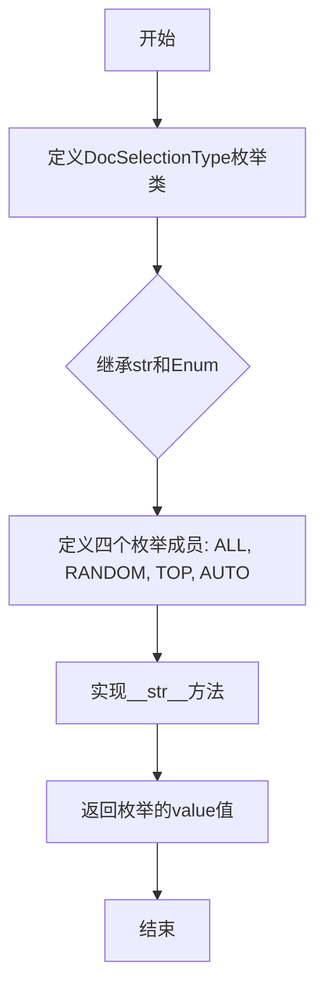
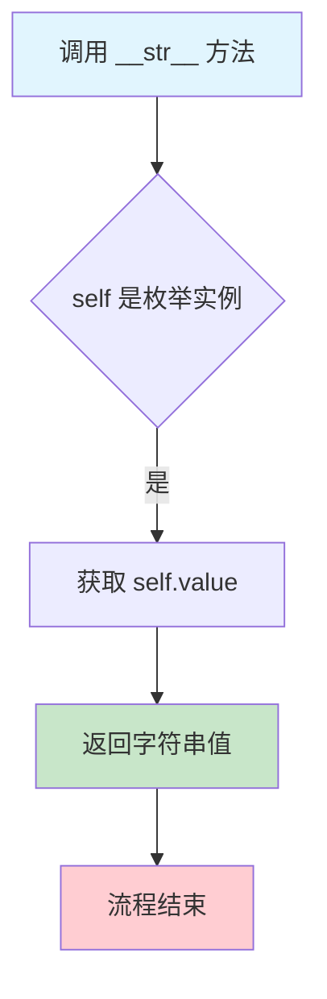

# `graphrag\packages\graphrag\graphrag\prompt_tune\types.py` 详细设计文档

该文件定义了文档选择类型的枚举类，用于prompt tuning中文档选择策略的类型定义，支持all、random、top和auto四种选择模式。

## 整体流程



## 类结构

```
DocSelectionType (枚举类)
├── ALL = 'all'
├── RANDOM = 'random'
├── TOP = 'top'
└── AUTO = 'auto'
```

## 全局变量及字段


### `DocSelectionType.ALL`
    
文档全选模式，表示选择所有文档

类型：`DocSelectionType`
    


### `DocSelectionType.RANDOM`
    
随机选择模式，表示随机选择文档

类型：`DocSelectionType`
    


### `DocSelectionType.TOP`
    
顶部选择模式，表示选择顶部的文档

类型：`DocSelectionType`
    


### `DocSelectionType.AUTO`
    
自动选择模式，表示自动选择文档

类型：`DocSelectionType`
    
    

## 全局函数及方法


### `DocSelectionType.__str__`

返回枚举成员的字符串值，实现将枚举实例转换为字符串的逻辑。

参数：

- `self`：`DocSelectionType`，当前枚举实例本身

返回值：`str`，返回枚举成员的值（如 "all"、"random"、"top"、"auto"）

#### 流程图



#### 带注释源码

```python
def __str__(self):
    """Return the string representation of the enum value."""
    return self.value
```

**代码说明：**

- `__str__` 是 Python 的特殊方法（双下划线方法），当对象被转换为字符串时自动调用
- `self` 参数隐式表示当前的枚举实例（如 `DocSelectionType.ALL`）
- `self.value` 获取枚举成员关联的值（如 `"all"`）
- 由于 `DocSelectionType` 同时继承自 `str` 和 `Enum`，`self.value` 返回的是字符串类型的值
- 该方法使得 `str(DocSelectionType.ALL)` 返回 `"all"` 而不是 `"DocSelectionType.ALL"`

## 关键组件


### DocSelectionType

枚举类，定义文档选择策略类型，用于提示调优（prompt tuning）中的文档筛选功能。支持四种选择模式：全部文档（ALL）、随机选择（RANDOM）、顶部选择（TOP）和自动选择（AUTO）。

### DocSelectionType.ALL

静态常量，表示选择所有文档的策略。

### DocSelectionType.RANDOM

静态常量，表示随机选择文档的策略。

### DocSelectionType.TOP

静态常量，表示选择顶部文档的策略。

### DocSelectionType.AUTO

静态常量，表示自动选择文档的策略。

### DocSelectionType.__str__

重写字符串表示方法，返回枚举的实际值而非枚举名称。


## 问题及建议


### 已知问题

- 代码过于简单，仅包含枚举定义，缺乏功能扩展性和业务逻辑封装
- 枚举类 `DocSelectionType` 继承自 `str` 和 `Enum` 的组合方式，虽然实现了 `__str__` 方法，但该方法实际上是冗余的（Enum 默认已支持字符串转换）
- 缺少对枚举成员的具体业务含义说明文档
- 作为基础类型定义，缺乏验证逻辑（如验证枚举值是否合法）

### 优化建议

- 移除冗余的 `__str__` 方法，Enum 默认行为已满足需求
- 添加更详细的类级别文档注释，说明该枚举的使用场景和业务含义
- 考虑是否为枚举成员添加描述性文档，说明每个选项的具体作用
- 如需更强的类型约束，可考虑使用 `StrEnum`（Python 3.11+）替代手动继承方式
- 可添加枚举值的验证方法或辅助方法，增强代码的健壮性

## 其它


### 设计目标与约束

定义文档选择类型的枚举，用于prompt tuning中控制文档选择策略。支持五种选择模式：全部、随机、顶部、自动以及字符串表示。

### 错误处理与异常设计

本模块为纯数据定义模块，不涉及运行时错误处理。枚举值的有效性由Python枚举机制保证，不存在无效值风险。

### 外部依赖与接口契约

仅依赖Python标准库`enum`模块。`str`基类的多重继承确保枚举成员可直接用于字符串比较和格式化场景。

### 使用示例

```python
# 基本用法
selection_type = DocSelectionType.ALL
print(selection_type)  # 输出: "all"

# 字符串转换
type_str = str(DocSelectionType.TOP)  # 返回 "top"

# 条件判断
if selection_type == DocSelectionType.RANDOM:
    print("使用随机选择策略")
```

### 版本历史

- 2024年：初始版本，包含在Microsoft prompt tuning工具包中

### 性能考虑

枚举类为轻量级对象，创建和比较操作具有常量时间复杂度O(1)，无性能瓶颈。

### 兼容性说明

要求Python 3.11+版本（支持枚举基类增强特性）。`str`基类继承确保与现有字符串处理代码的兼容性。

### 测试策略建议

建议测试场景：验证所有枚举值的字符串表示、验证`__str__`方法行为、验证与字符串的等价比较、验证枚举成员的唯一性。

    