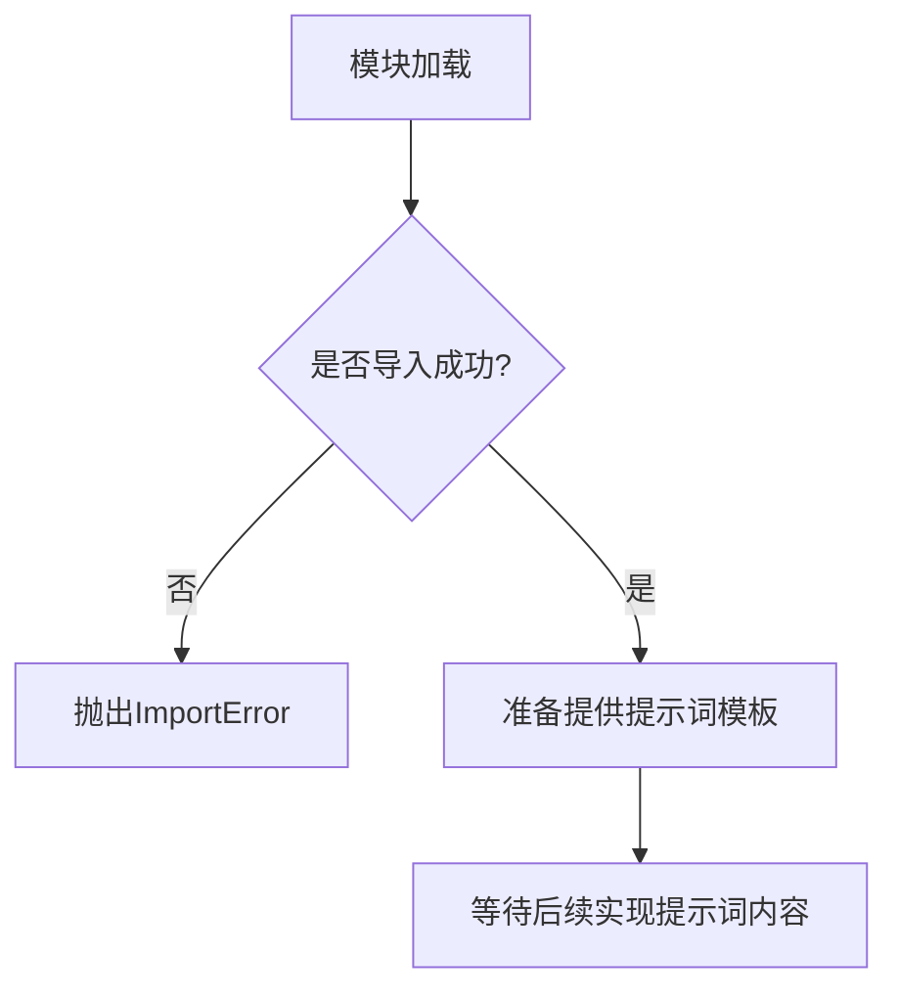

# `graphrag\packages\graphrag\graphrag\prompts\__init__.py` 详细设计文档

GraphRAG系统的提示词（Prompts）模块，用于存储和管理系统运行所需的各种提示模板。该模块目前仅包含版权信息和模块文档字符串，实际提示词内容有待后续实现。

## 整体流程



## 类结构

```
模块: prompts (当前为空模块)
```

## 全局变量及字段


    

## 全局函数及方法


## 关键组件


# GraphRAG 系统提示文档分析

## 概述
该代码文件为 GraphRAG 系统的提示词（Prompts）模块的入口文件，仅包含版权声明和模块级文档字符串，无具体实现代码。

## 文件信息
- **文件路径**: 待分析
- **模块名称**: prompts (推测)
- **核心功能**: 作为 GraphRAG 系统所有提示词的统一入口和文档说明

## 代码结构

### 模块级元素

#### 模块文档字符串
- **名称**: 模块文档字符串
- **类型**: str (docstring)
- **描述**: 标识该文件为 GraphRAG 系统的所有提示词集合

#### 版权声明
- **内容**: Copyright (c) 2024 Microsoft Corporation.
- **许可证**: MIT License

## 关键组件信息

### 组件1: 模块文档
- **描述**: 声明该文件为 GraphRAG 系统的提示词模块，用于统一管理和导出系统所需的所有提示词内容

## 技术债务与优化空间

1. **空模块问题**: 当前文件仅包含文档字符串，缺少实际的提示词内容定义和导出机制
2. **待实现功能**: 需要根据 GraphRAG 系统的具体需求，定义各类提示词模板（如索引构建提示、查询处理提示、图谱生成提示等）

## 后续工作建议

该文件需要扩展以包含：
- 索引构建相关的提示词
- 查询理解和分解的提示词
- 图谱问答的提示词
- 结果生成的提示词
- 各提示词的版本管理和国际化支持


## 问题及建议


### 已知问题

-   文件仅为占位符，仅包含版权声明和模块文档字符串，无任何实际代码实现
-   无法从现有代码中提取类、方法、全局变量等详细信息
-   缺少具体的提示词（prompts）定义和实现

### 优化建议

-   补充具体的提示词内容，定义GraphRAG系统所需的各类提示模板
-   建立结构化的提示词管理机制，如分类存储、环境变量配置化等
-   考虑将提示词外置到配置文件或数据库，支持运行时动态调整
-   为提示词添加版本控制和变更历史记录
-   添加提示词的单元测试和集成测试


## 其它


### 1. 一段话描述

这是一个空的Python模块文件，仅包含版权声明和模块级文档字符串，用于定义GraphRAG系统的提示词（Prompts）模块的接口占位符，当前没有任何实际的提示词实现或功能代码。

### 2. 文件的整体运行流程

该文件目前不包含任何可执行代码，因此没有运行流程可供描述。作为一个模块文件，它仅作为GraphRAG系统提示词模块的导入入口，在被其他模块导入时不会产生任何副作用。

### 3. 类的详细信息

当前文件中未定义任何类。

### 4. 全局变量信息

当前文件中未定义任何全局变量。

### 5. 全局函数信息

当前文件中未定义任何全局函数。

### 6. 关键组件信息

当前文件中不存在任何关键组件。该模块作为GraphRAG系统提示词管理的占位符，后续需要在此文件中实现各类提示词的存储和管理功能。

### 7. 潜在的技术债务或优化空间

- **功能缺失**：当前模块为空白模块，需要实现完整的提示词管理系统
- **缺少提示词定义**：没有定义GraphRAG系统所需的各类提示词（如索引提示词、查询提示词等）
- **模块结构不完整**：缺少必要的导入语句、配置管理和提示词模板系统

### 8. 其它项目

#### 8.1 设计目标与约束

- **设计目标**：为GraphRAG系统提供统一的提示词管理和分发机制，支持模块化、可配置的提示词系统
- **设计约束**：需要遵循MIT许可证要求，保持代码的MIT开源兼容性

#### 8.2 错误处理与异常设计

当前模块未实现任何错误处理机制。未来设计应考虑：
- 提示词加载失败时的异常抛出
- 提示词模板渲染错误时的异常处理
- 配置校验失败时的错误反馈机制

#### 8.3 数据流与状态机

当前模块无数据流设计。未来设计应包含：
- 提示词的加载流程
- 提示词模板的变量替换过程
- 提示词的缓存和更新机制

#### 8.4 外部依赖与接口契约

当前模块无外部依赖。未来设计应考虑：
- 与GraphRAG主系统的接口对接
- 提示词模板引擎的选择（如Jinja2）
- 配置管理模块的集成

#### 8.5 模块初始化与导入机制

当前文件仅包含文档字符串，未来需要添加：
- `__all__` 导出列表定义
- 提示词类的导入接口
- 模块初始化配置

#### 8.6 版本管理与变更日志

需要建立提示词版本管理机制，记录：
- 提示词版本号
- 变更历史记录
- 版本兼容性说明


    