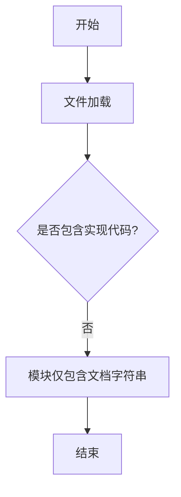

# `graphrag\packages\graphrag\graphrag\prompts\index\__init__.py` 详细设计文档

This file serves as a placeholder and documentation module for storing all prompts used by the indexing engine, containing only metadata and licensing information.

## 整体流程



## 类结构

```
无类层次结构 (空文件)
```

## 全局变量及字段


    

## 全局函数及方法


## 关键组件


## 一段话描述

该代码文件为索引引擎（Indexing Engine）的提示词（Prompts）模块，目前仅包含版权声明和模块文档字符串，用于集中管理和存储索引引擎所需的所有提示词模板。

## 文件的整体运行流程

由于当前代码文件仅包含模块文档字符串和版权声明，无实际实现代码，因此不存在可描述的运行流程。该文件预计将在后续迭代中填充具体的提示词模板内容，供索引引擎其他模块调用。

## 类的详细信息

当前代码文件中不包含任何类定义。

## 全局变量和全局函数

当前代码文件中不包含任何全局变量或全局函数定义。

## 关键组件信息

### 索引引擎提示词模块

该模块作为索引引擎的提示词管理容器，预期用于存放各类提示词模板，可能包括数据索引构建提示词、查询处理提示词、结果优化提示词等，为索引引擎提供灵活的提示词配置能力。

## 潜在的技术债务或优化空间

1. **功能实现缺失**：当前模块仅包含文档字符串，无实际提示词内容，需要后续补充具体的提示词模板实现。
2. **模块结构设计**：建议规划提示词的分类组织方式，如按功能类型（索引构建、查询处理等）或数据来源进行分类。
3. **国际化支持**：如需支持多语言环境，应考虑提示词的国际化架构设计。
4. **版本管理**：建议为提示词模板添加版本控制机制，便于追踪和管理提示词的变更历史。

## 其它项目

### 设计目标与约束

- 设计目标：集中管理索引引擎的所有提示词，提供统一接口访问
- 约束：遵循MIT开源许可证规范

### 错误处理与异常设计

由于无实际代码实现，暂不涉及错误处理设计。建议在后续实现中加入提示词加载失败、模板渲染错误等异常情况处理。

### 数据流与状态机

当前无实际数据流设计。预计后续提示词模块将接收索引引擎的上下文信息，经过模板渲染后输出最终提示词内容。

### 外部依赖与接口契约

- 预期依赖：索引引擎核心模块
- 接口契约：提供提示词查询/获取接口，接收参数并返回格式化后的提示词字符串


## 问题及建议


### 已知问题

- **空模块实现**：当前文件仅包含模块文档字符串，未包含任何实际的 prompt 定义或功能实现
- **功能不完整**：模块标题声明为"All prompts for the indexing engine"，但没有任何 prompt 模板或相关函数
- **缺乏内容**：虽然文档注释表明这是索引引擎的提示词模块，但代码中没有任何具体的提示词内容、模板变量或格式化函数

### 优化建议

- **实现核心功能**：根据模块名称和用途，定义索引引擎所需的各种提示词模板，包括文档处理、实体提取、关系识别等场景的 prompt
- **结构化设计**：考虑使用类或结构化字典组织不同类型的 prompt，例如按任务类型（索引、搜索、摘要等）分组
- **添加国际化支持**：如果需要支持多语言，考虑将 prompt 内容外部化或添加多语言支持机制
- **版本控制**：为不同类型的 prompt 添加版本管理机制，便于追踪和回滚
- **可配置性**：考虑添加 prompt 参数化功能，使提示词模板可根据不同场景动态调整


## 其它


### 一段话描述

该模块为索引引擎提供所有提示词（prompts），是索引引擎的提示词配置中心，用于管理和提供各种索引操作的提示词模板。

### 文件的整体运行流程

该文件为纯配置模块，不包含可执行代码。运行时由其他模块导入并使用其中的提示词内容。

### 类的详细信息

无类定义。

### 类字段

无类字段。

### 类方法

无类方法。

### 全局变量

无全局变量。

### 全局函数

无全局函数。

### 关键组件信息

- **提示词配置模块**：作为索引引擎的提示词资源库，提供索引过程中所需的各类提示词模板。

### 潜在的技术债务或优化空间

- **内容缺失**：当前模块仅包含文档字符串，尚未实现具体的提示词内容。建议根据索引引擎的实际需求，补充各类型的提示词定义。
- **结构单一**：如提示词种类增多，建议考虑分类管理或采用结构化的提示词管理方案。

### 设计目标与约束

- **设计目标**：集中管理索引引擎的提示词，便于维护和复用。
- **约束**：遵循MIT开源许可证，仅包含提示词配置，不包含业务逻辑。

### 错误处理与异常设计

不适用，当前模块无执行逻辑。

### 数据流与状态机

不适用，当前模块无数据处理逻辑。

### 外部依赖与接口契约

- 该模块被索引引擎的其他模块导入使用，提供提示词内容。
- 未来可能需要与提示词管理系统集成，实现动态提示词配置。

### 其它项目

无

    