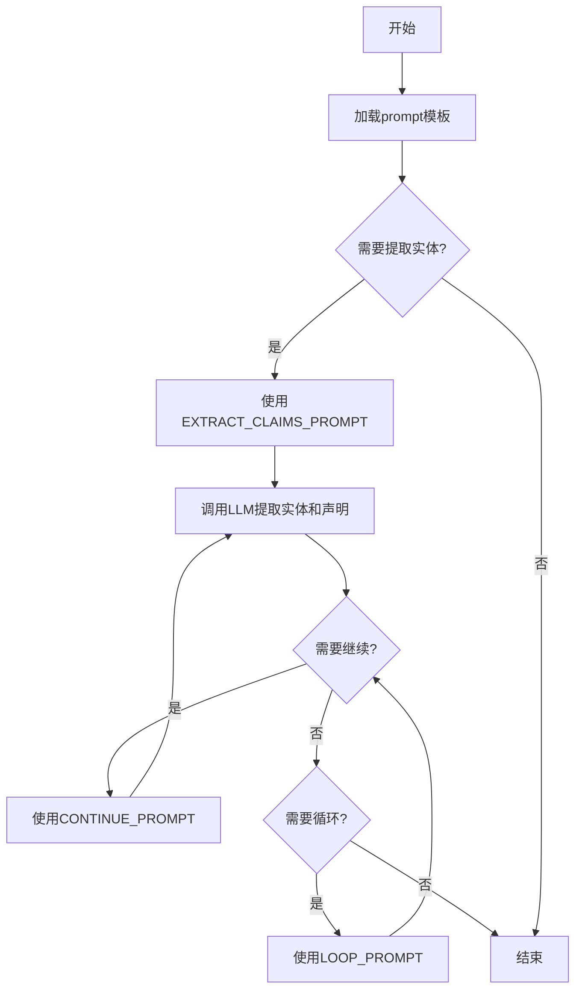

# `graphrag\packages\graphrag\graphrag\prompts\index\extract_claims.py` 详细设计文档

这是一个prompt定义文件，包含了用于从文本文档中提取实体和声明（claims）的提示模板。主要用于指导大语言模型从文本中识别指定实体并提取与这些实体相关的声明信息。

## 整体流程



## 类结构

```
无类层次结构（纯配置文件）
```

## 全局变量及字段


### `EXTRACT_CLAIMS_PROMPT`
    
用于从文本中提取实体及其相关声明的提示模板，包含实体规范、声明描述和输入文本的占位符

类型：`str`
    


### `CONTINUE_PROMPT`
    
当实体提取遗漏时，提示用户添加遗漏实体的补充提示信息

类型：`str`
    


### `LOOP_PROMPT`
    
用于循环检查是否还有遗漏实体的确认提示，只接受Y或N回复

类型：`str`
    


    

## 全局函数及方法


## 关键组件


### EXTRACT_CLAIMS_PROMPT

主要提示词模板，定义了从文本中提取实体和声明的完整流程，包含目标活动描述、提取步骤、输出格式规范和示例，用于指导模型识别符合规范的命名实体并提取相关的声明信息。

### CONTINUE_PROMPT

当实体提取不完整时使用的继续提示，要求模型补充遗漏的实体，使用与主提示相同的格式规范。

### LOOP_PROMPT

循环检查提示，用于询问模型是否还有遗漏的实体需要添加，通过单字符Y/N响应来控制提取循环。

### 实体规范解析

提示词支持两种实体规范形式：实体名称列表或实体类型列表，用于指定需要从文本中提取的目标实体。

### 声明信息结构

定义了声明的完整数据结构，包含Subject（主体）、Object（对象）、Claim Type（声明类型）、Claim Status（声明状态）、Claim Date（声明日期）、Claim Description（描述）和Claim Source Text（来源文本）七个字段。

### 声明状态枚举

声明状态支持三种值：TRUE（已确认）、FALSE（已证伪）、SUSPECTED（未验证），用于标记声明的可信度。

### 日期格式规范

要求日期采用ISO-8601格式，支持日期范围表示，单一日期时起止日期相同，未知日期返回NONE。

### 输出格式化

使用特定分隔符格式化声明：字段间用<|>分隔，列表项用##分隔，尾部以<|COMPLETE|>标记结束。

### 输入参数占位符

提示词模板包含三个动态输入占位符：entity_specs（实体规范）、claim_description（声明描述）、input_text（输入文本），用于运行时注入具体任务数据。


## 问题及建议


### 已知问题

- **魔法字符串缺乏统一管理**：状态值（TRUE、FALSE、SUSPECTED）、空值标识（NONE）、分隔符（<|>）等在提示词中重复出现，但未定义为常量，导致维护困难且容易出现拼写错误
- **提示词模板僵硬且冗长**：EXTRACT_CLAIMS_PROMPT 是一个超过100行的单一字符串，包含大量内联示例，难以阅读、维护和测试，任何修改都可能影响整体结构
- **参数占位符缺少验证机制**：模板中使用 {entity_specs}、{claim_description}、{input_text} 占位符，但没有任何参数校验逻辑，可能导致格式化失败或运行时错误
- **提示词与业务逻辑强耦合**：提取逻辑的具体要求（如日期格式ISO-8601、字段顺序、输出格式）直接硬编码在提示词中，若业务规则变更需要修改源代码
- **缺乏类型注解**：作为Python模块，没有任何类型提示（type hints），降低了代码的可读性和IDE支持
- **无国际化支持**：所有提示词文本硬编码为英文，无法满足多语言需求
- **重复代码模式未提取**：CONTINUE_PROMPT 和 LOOP_PROMPT 的用途与 EXTRACT_CLAIMS_PROMPT 相关，但结构分散，缺乏统一的Prompt管理类

### 优化建议

- **抽取魔法字符串为常量**：创建配置类或枚举定义状态值、分隔符、默认空值等，例如使用 Enum 定义 ClaimStatus，使用常量定义 DELIMITER
- **重构提示词结构**：将大型 EXTRACT_CLAIMS_PROMPT 拆分为多个独立的部分（Instructions、Format Guidelines、Examples），通过组合模式构建完整提示词
- **添加参数验证层**：在格式化前验证 entity_specs、claim_description、input_text 的类型和格式，确保必填且非空
- **实现Prompt管理类**：创建 PromptTemplate 类或使用模板引擎（如 string.Template 或 Jinja2），支持变量替换、模板继承和单元测试
- **引入类型注解**：为所有模块级变量和未来可能添加的函数添加详细的类型注解
- **设计可扩展的示例机制**：将示例数据外部化或定义为独立的数据结构，便于添加/修改示例而不破坏提示词模板
- **考虑国际化架构**：使用 gettext 或类似框架支持多语言提示词
- **添加文档字符串**：为模块和关键组件添加 docstring，说明用途、使用方法和注意事项


## 其它


### 设计目标与约束

本模块的设计目标是定义用于从文本中提取实体及其相关声明（claims）的提示词模板，支持从非结构化文本中识别特定实体并提取与这些实体相关的声明信息，包含声明类型、状态、日期、描述和来源文本等关键属性。约束条件包括：提示词必须输出英文结果、日期格式需符合ISO-8601标准、实体名称需首字母大写、声明状态限定为TRUE/FALSE/SUSPECTED三种、多个声明之间使用##分隔符、输出需以<|COMPLETE|>标记结束。

### 错误处理与异常设计

本模块为纯提示词定义文件，不涉及运行时错误处理。当输入的entity_specs、claim_description或input_text为空时，LLM应返回空结果或根据其自身的错误处理机制处理。提示词格式本身通过占位符{entity_specs}、{claim_description}和{input_text}进行参数化，调用方需确保在格式化前这些参数已正确赋值。LOOP_PROMPT用于处理可能遗漏的实体，通过单字符Y/N响应来判断是否需要继续提取。

### 数据流与状态机

提示词模板的数据流如下：首先将entity_specs、claim_description和input_text三个参数注入到EXTRACT_CLAIMS_PROMPT模板中，生成完整的提取请求；LLM执行后可能返回完整结果（以<|COMPLETE|>结束）或遗漏部分实体；若检测到遗漏，使用CONTINUE_PROMPT追加遗漏的实体；若不确定是否还有遗漏，使用LOOP_PROMPT进行确认。这是一个循环交互流程，可能需要多次调用LOOP_PROMPT来确保所有实体都被提取。

### 外部依赖与接口契约

外部依赖为大型语言模型（LLM）接口，需支持提示词注入和文本生成。接口契约要求：输入为包含三个占位符的格式化字符串和三个参数值，输出为符合特定格式的声明列表。EXTRACT_CLAIMS_PROMPT返回多条声明（用##分隔），CONTINUE_PROMPT用于追加遗漏实体（格式相同），LOOP_PROMPT仅接受单字符Y或N响应。所有提示词内容为英文，调用方需负责将目标语言文本翻译或提供英文版本。

### 配置与参数说明

EXTRACT_CLAQUES_PROMPT模板包含三个必需参数：entity_specs（实体规格，可为实体名称列表或实体类型列表）、claim_description（声明描述，指定要提取的声明类型）、input_text（待分析的输入文本）。CONTINUE_PROMPT为固定字符串，用于要求LLM补充遗漏实体。LOOP_PROMPT同样为固定字符串，用于确认是否还有更多实体需要提取。所有参数在调用LLM前完成字符串格式化替换。

### 使用示例与测试场景

基础提取场景：给定entity_specs="organization"、claim_description="red flags associated with an entity"、input_text包含公司违规罚款文本，输出结构化声明列表。多实体场景：entity_specs可包含多个实体名称（用逗号分隔），系统将分别提取各实体的声明。遗漏补充场景：当LLM首次提取不完整时，使用CONTINUE_PROMPT追加遗漏实体。循环确认场景：使用LOOP_PROMPT的Y/N响应来判断是否需要继续调用CONTINUE_PROMPT。

### 安全性考虑

本模块为纯数据文件，不直接处理敏感数据，但需注意：输入文本可能包含机密信息，应在调用LLM前进行脱敏处理；提示词本身不包含认证或授权机制，调用方需确保LLM服务的安全访问控制；输出结果包含实体名称和声明信息，需按业务需求进行访问控制。

### 性能考虑

提示词长度直接影响LLM的token消耗和响应时间，EXTRACT_CLAIMS_PROMPT包含详细示例说明（约500tokens），CONTINUE_PROMPT和LOOP_PROMPT较短。循环交互场景下可能产生多次LLM调用，需考虑延迟和成本优化。建议在业务层面设置最大循环次数限制（如5次）以防止无限循环。

### 国际化与本地化

当前所有提示词内容均为英文，包括示例输出。适用于英文文本分析场景。若要支持中文或其他语言，需对提示词进行翻译，并调整示例中的实体名称格式（如中文实体名可能不需要首字母大写规则）。日期格式ISO-8601为国际标准，通用性强。

### 监控与日志

本模块为静态定义文件，监控和日志需在调用方实现。建议记录：提示词格式化日志（参数值需脱敏）、LLM响应时间、提取结果数量、循环次数统计、异常情况记录。关键指标包括提取成功率、平均循环次数、声明数量等。

### 版本历史与变更记录

当前版本为1.0.0，发布于2024年。变更新增：初始版本定义EXTRACT_CLAIMS_PROMPT、CONTINUE_PROMPT和LOOP_PROMPT三个提示词模板，支持结构化声明提取流程。后续可能的变更方向包括：扩展声明属性字段、优化提示词以提高提取准确率、添加更多示例以覆盖边界场景。


    