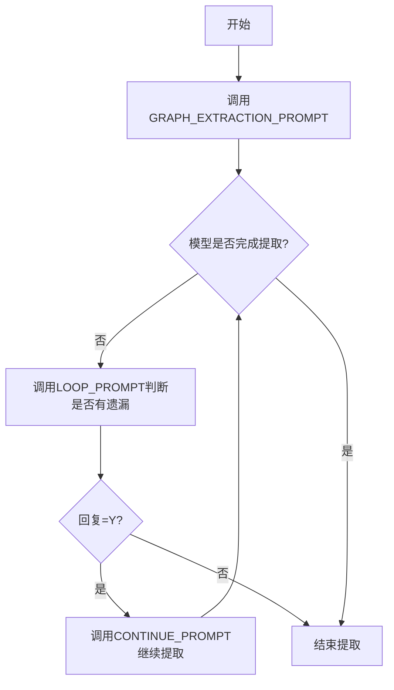

# `graphrag\packages\graphrag\graphrag\prompts\index\extract_graph.py` 详细设计文档

该文件定义了用于从文本中提取实体和关系的提示模板，包含主提取提示(GRAPH_EXTRACTION_PROMPT)、继续提取提示(CONTINUE_PROMPT)和循环判断提示(LOOP_PROMPT)，用于指导大语言模型从非结构化文本中识别指定类型的实体及其相互关系。

## 整体流程



## 类结构

```
无类层次结构（纯配置文件）
```

## 全局变量及字段


### `GRAPH_EXTRACTION_PROMPT`
    
用于从文本中提取实体和关系的主提示模板，包含目标定义、提取步骤、格式化规范和多语言示例

类型：`str`
    


### `CONTINUE_PROMPT`
    
用于提示模型补充遗漏的实体和关系的继续提取提示词

类型：`str`
    


### `LOOP_PROMPT`
    
用于询问是否还有更多实体和关系需要提取的循环检查提示词

类型：`str`
    


    

## 全局函数及方法


## 关键组件


### 实体类型定义与识别

该提示模板定义了实体识别的核心框架，支持从文本中识别组织(ORGANIZATION)、人物(PERSON)、地理(GEO)等类型的实体，并要求提取实体名称、类型和详细描述。

### 关系提取模块

从已识别的实体中识别实体对之间的明确关系，提取源实体、目标实体、关系描述和关系强度评分，支持多维度关系建模。

### 图谱提取主提示 (GRAPH_EXTRACTION_PROMPT)

包含完整的三阶段处理流程：实体识别 → 关系识别 → 输出格式化。通过四个明确步骤指导模型完成从非结构化文本到结构化知识图谱的转换。

### 迭代式补充提示 (CONTINUE_PROMPT)

用于检测并补充遗漏的实体和关系，提醒模型仅输出符合预定义类型的实体，确保提取结果的完整性和准确性。

### 循环判断提示 (LOOP_PROMPT)

提供二元判断机制，通过单字符Y/N响应判断是否需要继续迭代，适合于需要多轮补充提取的复杂场景。

### 输出格式化规范

使用特殊的分隔符语法（"<|>"）和"##"列表定界符，以及"<|COMPLETE|>"结束标记，确保输出的实体和关系可被程序精确解析。

### 示例学习组件

提供三个不同领域的完整示例（金融政策、IPO市场、人质交换），展示实体识别和关系提取的标准格式，帮助模型理解期望的输出结构。


## 问题及建议


### 已知问题

-   **提示词硬编码在源代码中**：所有提示词模板（GRAPH_EXTRACTION_PROMPT、CONTINUE_PROMPT、LOOP_PROMPT）直接定义在Python文件中，缺乏灵活性，无法在不修改代码的情况下调整提示词内容
-   **缺乏输入参数验证**：未对 entity_types 列表和 input_text 参数进行有效性校验，可能导致运行时错误或异常行为
-   **分隔符格式紧耦合**：实体和关系格式（使用`<|>`和`##`分隔符）硬编码在提示词模板中，格式变更需要修改多处代码
-   **混合示例数据与业务逻辑**：大量示例数据与实际提示词模板混在一起，降低了代码可读性和可维护性
-   **缺乏文档说明**：文件缺少对各变量的用途说明和使用指南，开发者需要阅读大量注释才能理解
-   **提示词模板与代码无版本控制**：提示词的变更历史无法追溯，缺乏版本管理机制
-   **关系强度分数无说明**：示例中使用的强度分数（如9、8、5、2）含义不明确，缺乏业务规则解释

### 优化建议

-   **配置外部化**：将提示词模板提取到独立的配置文件（如JSON或YAML），支持运行时动态加载和配置
-   **添加参数验证**：实现输入参数校验逻辑，验证 entity_types 非空、input_text 有效等
-   **提取格式常量**：将分隔符（`<|>`、`##`）和格式模式定义为常量，统一管理
-   **分离示例数据**：将示例数据移至单独的测试数据文件，保持主文件简洁
-   **补充文档注释**：为每个提示变量添加docstring说明其用途、参数期望和返回值格式
-   **实现提示词版本管理**：添加版本号和变更日志，支持提示词的迭代优化
-   **添加单元测试**：编写测试用例验证提示词模板的格式正确性和输出预期

## 其它


### 设计目标与约束

该模块的核心目标是通过大语言模型从非结构化文本中提取实体和关系，构建知识图谱。设计约束包括：仅支持英文输出、实体类型需预先定义、关系强度采用1-10评分制、输出格式严格遵循分隔符规范。

### 错误处理与异常设计

异常场景包括：输入文本为空时返回空列表、实体类型列表为空时抛出参数校验异常、模型输出格式不符合预期时触发解析错误、检测到不完整的实体/关系定义时标记为解析失败。模块本身不进行重试逻辑，由调用方负责。

### 数据流与状态机

数据流为：调用方填充{entity_types}和{input_text}占位符 → 发送完整提示词至LLM → 解析LLM输出 → 按##分隔符split获取实体/关系列表 → 转换为结构化对象。状态机包含三个状态：初始提取状态（GRAPH_EXTRACTION_PROMPT）、追加提取状态（CONTINUE_PROMPT）、循环检查状态（LOOP_PROMPT）。

### 外部依赖与接口契约

依赖外部LLM API服务，需保证API可用性。接口契约：输入entity_types为逗号分隔的字符串，input_text为原始文本；输出为字符串列表，每个元素为实体或关系的格式化字符串。调用方需自行实现LLM调用逻辑和输出解析逻辑。

### 安全性考虑

提示词中未包含敏感信息，但需注意输入文本可能包含隐私数据。LLM处理过程中应遵循数据安全规范，不建议将敏感文本直接输入第三方LLM服务。

### 性能要求与优化空间

当前实现为同步字符串模板，无缓存机制。优化方向包括：提示词模板缓存、实体类型预验证、批量提取支持。关系强度计算依赖LLM主观判断，不同模型间可能存在评分差异。

### 版本兼容性说明

当前版本为v1.0，基于MIT许可。提示词模板格式为版本无关的字符串，但LLM输出格式可能随模型版本变化，建议调用方实现容错解析逻辑。

### 测试策略建议

应覆盖以下测试场景：空输入处理、单个实体提取、多实体多关系提取、无关系场景、实体类型不匹配场景、不完整输出格式处理。建议使用代码中提供的Examples进行回归测试。


    