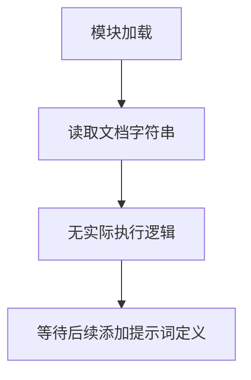

# `graphrag\packages\graphrag\graphrag\prompts\query\__init__.py` 详细设计文档

这是一个查询引擎提示词模块的占位文件，仅包含版权信息和模块级文档字符串，用于定义query engine所需的所有提示词模板。该文件目前没有实现任何功能代码。

## 整体流程



## 类结构

```
该文件为模块级别，无类层次结构
```

## 全局变量及字段


    

## 全局函数及方法


## 关键组件


### 模块概述

该代码文件作为查询引擎提示词模块的占位符，仅包含版权声明和模块级文档字符串，用于标识所有查询引擎相关的提示词定义，属于模块初始化文件。

### 文件运行流程

由于该文件仅包含模块级文档字符串和版权声明，不包含任何可执行代码，因此不存在实际的运行流程。该文件作为模块导入时的入口点，主要作用是声明模块身份和用途。

### 类信息

该文件中不包含任何类定义。

### 全局变量与全局函数

该文件中不包含任何全局变量或全局函数定义。

### 关键组件信息

#### 模块标识符

该文件作为查询引擎提示词模块的入口文件，用于组织和管理与查询引擎相关的所有提示词资源。

#### 文档字符串

模块级文档字符串 "All prompts for the query engine." 简要描述了该模块的核心用途，为开发者提供模块功能的高层概述。

### 潜在技术债务或优化空间

#### 缺失的实现代码

该文件目前仅包含占位符文档，缺少实际的提示词定义和查询引擎相关的业务逻辑实现。建议根据实际需求补充：

- 查询引擎提示词的具体定义和模板
- 提示词的版本管理和更新机制
- 提示词的分类和组织结构

#### 模块结构设计

当前模块缺乏内部结构设计，建议规划：

- 提示词的分类策略（如按功能、场景或数据类型分类）
- 提示词的参数化机制
- 提示词的验证和测试框架

### 其他项目

#### 设计目标与约束

作为模块入口文件，设计目标应遵循：

- 清晰的模块职责划分
- 便于后续扩展和维护
- 与Microsoft开源项目的一致性要求

#### 错误处理与异常设计

当前文件不涉及运行时错误处理，未来实现时应考虑：

- 提示词加载失败的处理机制
- 无效提示词格式的校验
- 异常信息的国际化支持

#### 数据流与状态机

当前文件不涉及数据流或状态机设计。

#### 外部依赖与接口契约

当前文件无外部依赖，后续实现时应明确：

- 提示词模块的导出接口
- 与查询引擎其他组件的集成方式
- API版本兼容性策略


## 问题及建议


### 已知问题

-   **空文件问题**：该文件仅包含版权声明、许可证声明和一个简单的模块文档字符串，没有任何实际的代码实现
-   **功能缺失**：根据模块文档字符串 "All prompts for the query engine"，该模块应包含查询引擎所需的所有提示模板，但目前没有任何prompt定义或相关函数
-   **文档不完整**：模块级别的文档字符串过于简略，缺少对模块功能、导出内容、使用方式的详细说明

### 优化建议

-   **补充Prompt模板**：根据模块职责，添加查询引擎所需的各类prompt模板，可能包括系统提示、用户提示、few-shot示例等
-   **完善文档字符串**：为模块添加详细的文档说明，包括模块用途、包含的prompt类型、如何使用等
-   **考虑模块化设计**：如果prompt数量较多，考虑按功能分类组织（如搜索prompt、生成prompt、总结prompt等），使用类或结构化字典管理
-   **定义接口契约**：明确该模块应该暴露的接口（如get_prompt、list_prompts等函数），确保调用方能够清晰获取所需prompt


## 其它


### 设计目标与约束

本模块作为查询引擎的提示词（Prompts）统一管理模块，旨在集中存储和组织所有查询引擎相关的提示词模板，支持模块化、可维护的提示词管理。约束包括：遵循MIT开源许可证，保持提示词与业务逻辑解耦，支持国际化扩展，考虑提示词版本管理。

### 错误处理与异常设计

由于当前模块仅包含提示词定义（非执行代码），暂不涉及运行时错误处理。未来填充提示词内容时，应定义提示词加载异常（如提示词缺失、格式错误），并提供友好的错误提示信息。提示词模板中的占位符应使用统一的标记格式（如{placeholder}），并验证占位符的完整性。

### 外部依赖与接口契约

本模块作为查询引擎的子模块，主要依赖查询引擎核心模块。接口契约方面，应提供统一的提示词获取接口（如get_prompt(prompt_name)），返回格式应为字符串或可渲染的模板对象。提示词应支持参数化替换，支持多语言版本提示词的动态加载。

### 数据流与状态机

当前模块为静态数据模块，无运行时状态机设计。未来提示词加载流程：外部模块调用提示词获取接口 → 验证提示词名称 → 加载对应提示词模板 → 替换占位符参数 → 返回格式化提示词。状态转换：UNINITIALIZED → READY（模块加载完成）→ PROMPT_RETURNED（提示词已返回）。

### 安全性考虑

提示词内容应避免包含敏感信息（如密钥、密码），如需使用敏感占位符应在调用方处理。提示词模板应防范提示词注入攻击，对用户输入的参数进行必要的转义或验证。建议添加提示词内容审核机制。

### 性能要求

提示词加载应为懒加载模式，避免启动时一次性加载所有提示词。提示词模板应支持缓存机制，对于频繁使用的提示词应保持缓存。模块初始化时间应控制在100ms以内。

### 可测试性设计

应提供单元测试接口，验证提示词模板的占位符完整性。提供提示词渲染测试工具，验证参数替换的正确性。建议使用pytest框架编写测试用例，覆盖率目标应达到80%以上。

### 版本兼容性

当前版本为1.0.0（基于MIT License）。提示词格式应保持向后兼容，如需变更提示词格式应创建新版本并提供迁移指南。建议使用语义化版本号（Semantic Versioning）。

### 配置管理

提示词模块应支持外部配置注入，如提示词文件路径、自定义模板目录等。应提供默认配置的同时支持运行时覆盖。配置格式建议使用YAML或JSON。

### 文档与注释规范

所有提示词应包含用途说明和参数说明。公开接口应使用docstring文档。提示词模板应包含版本信息和维护者信息。建议使用英文撰写提示词内容以支持国际化。

    