# `graphrag\packages\graphrag\graphrag\prompts\query\drift_search_system_prompt.py` 详细设计文档

该文件定义了DRIFT Search系统的提示词模板，包含三个核心提示：DRIFT_LOCAL_SYSTEM_PROMPT用于本地搜索模式下的系统响应，DRIFT_REDUCE_PROMPT用于对检索结果进行精简和总结，DRIFT_PRIMER_PROMPT用于在知识图谱推理前生成中间答案和后续查询建议。这些提示词通过模板变量（placeholder）实现动态内容注入，支持基于用户查询生成结构化的JSON格式响应。

## 整体流程

```mermaid
graph TD
    A[开始] --> B[接收用户查询和上下文数据]
    B --> C{选择提示词类型}
    C -->|本地搜索| D[使用 DRIFT_LOCAL_SYSTEM_PROMPT]
    C -->|结果精简| E[使用 DRIFT_REDUCE_PROMPT]
    C -->|图谱推理| F[使用 DRIFT_PRIMER_PROMPT]
    D --> G[注入 response_type, context_data, global_query, followups 变量]
    E --> H[注入 context_data, response_type 变量]
    F --> I[注入 query, community_reports 变量]
    G --> J[生成最终提示词]
    H --> J
    I --> J
    J --> K[发送给语言模型]
    K --> L[解析JSON响应]
```



## 类结构

```
无类层次结构 - 该文件为纯模块文件，仅包含全局变量定义
```

## 全局变量及字段


### `DRIFT_LOCAL_SYSTEM_PROMPT`
    
DRIFT搜索本地模式的系统提示模板，用于根据表格数据生成符合目标长度和格式的响应，并包含数据引用和评分机制

类型：`str`
    


### `DRIFT_REDUCE_PROMPT`
    
DRIFT搜索reduce阶段的提示模板，用于汇总多个报告中的信息生成响应，强调准确性和简洁性

类型：`str`
    


### `DRIFT_PRIMER_PROMPT`
    
DRIFT搜索primer阶段的提示模板，用于对知识图谱进行推理，生成中间答案、评分和跟进查询

类型：`str`
    


    

## 全局函数及方法


## 关键组件


### DRIFT_LOCAL_SYSTEM_PROMPT

本地系统提示模板，用于处理数据表查询场景。定义AI助手角色为数据表问答助手，指定响应长度和格式要求，包含数据引用格式规范（记录ID引用、最多5条记录显示"+more"），并要求生成JSON格式输出包含response、score和follow_up_queries字段。

### DRIFT_REDUCE_PROMPT

归约提示模板，用于处理报告汇总场景。指导AI基于输入报告生成目标长度和格式的响应，强调准确性和简洁性，要求仅使用有证据支持的信息，可使用通用知识但需标注来源，包含数据引用格式规范和markdown格式化要求。

### DRIFT_PRIMER_PROMPT

初始推理提示模板，用于知识图谱推理场景。定义评分机制（0-100分评估中间答案质量），要求生成恰好2000字符的中间答案（markdown格式带标题），生成至少5个跟进查询问题，基于社区摘要进行推理并输出JSON格式结果。

### 数据引用格式规范

定义标准化的数据引用格式，要求使用"Data: <数据集名> (记录ID列表)"格式，每条引用最多显示5个记录ID，超出时添加"+more"标识，支持多数据源联合引用。

### JSON输出结构定义

指定标准JSON响应格式，包含三个必需字段：response（markdown格式答案）、score（0-100整型评分）、follow_up_queries（字符串列表形式的跟进问题），用于结构化AI生成内容。

### 响应类型与格式控制

通过{response_type}占位符实现动态响应格式控制，允许针对不同查询类型生成不同长度和风格的响应，包含markdown章节组织和格式化指导。

### 评分与反馈机制

设计0-100评分体系评估答案质量，评分依据为答案对研究问题的覆盖程度和问题聚焦度，同时要求基于生成内容建议后续探索方向。

### 通用知识标注规范

当使用非数据表格来源的信息时，要求明确标注"General Knowledge"分隔符及引用链接，确保区分数据支持内容与推断内容。

### 社区摘要推理框架

基于知识图谱社区摘要进行推理的框架，强调实体分布知识用于聚焦搜索方向，指导避免复合问题并生成单一目标的跟进查询。


## 问题及建议


### 已知问题

-   **重复内容**：DRIFT_LOCAL_SYSTEM_PROMPT 中存在大量重复的指令文本（"---Goal---" 和 "---Target response length and format---" 部分重复出现），导致维护困难且增加不必要的token消耗
-   **硬编码限制值**：多处硬编码了magic numbers，如"不超过5个record ids"和"exactly 2000 characters"，这些参数应作为可配置项
-   **JSON转义复杂**：模板中使用 `{{` 和 `}}` 进行双重大括号转义，容易导致格式混淆，增加模板理解和维护的复杂度
-   **提示模板不一致**：DRIFT_LOCAL_SYSTEM_PROMPT 使用 "Data tables"，而 DRIFT_REDUCE_PROMPT 使用 "Data Reports"，命名不统一
-   **缺乏参数验证**：模板变量（{response_type}、{context_data}、{global_query}等）没有任何验证机制，运行时可能因缺失参数导致错误
-   **字符串长度管理困难**：长字符串未进行结构化拆分，难以进行单元测试和版本控制
-   **注释缺失**：代码中没有任何注释说明各个提示的用途和使用场景

### 优化建议

-   **抽取公共模板**：将重复的指令部分（如引用格式说明、响应长度格式要求等）提取为独立的模板片段，通过字符串拼接或模板继承方式复用
-   **配置化管理**：将硬编码的限制值（如5个record ids、2000字符长度限制、followups数量等）抽取到配置常量或配置文件中
-   **使用专用模板库**：考虑使用 Python 的 string.Template 或专门的提示工程库（如 LangChain 的 PromptTemplate）来替代手动字符串拼接
-   **统一命名规范**：统一使用 "Data tables" 或 "Data Reports" 其中一种命名，保持术语一致性
-   **添加参数校验**：在模板使用前添加参数校验逻辑，确保所有必需参数都已提供且类型正确
-   **结构化拆分**：将大段提示文本拆分为多个逻辑组件，每个组件负责特定的提示部分，便于测试和维护
-   **添加文档注释**：为每个提示变量添加 docstring 或注释，说明其用途、预期参数和示例用法


## 其它


### 设计目标与约束

本代码模块的设计目标是定义DRIFT（一种知识图谱搜索方法）的三个核心prompt模板，用于指导大型语言模型生成符合特定格式和长度要求的回答。约束条件包括：response_type和global_query为必需参数，followups参数控制后续问题数量，prompt模板中的占位符必须被正确填充否则会引发错误。

### 错误处理与异常设计

本模块不包含运行时错误处理逻辑，因为仅为静态字符串定义。若占位符未被正确替换，应在调用方进行字符串格式化验证。建议在使用前检查模板中是否还存在未替换的占位符（如通过正则表达式匹配{.*?}模式），避免将未填充的模板传入下游模型。

### 数据流与状态机

数据流：外部系统传入query、context_data、response_type等参数 → 字符串格式化填充prompt模板占位符 → 生成的完整prompt发送给LLM → LLM返回JSON格式响应。状态机：DRIFT_LOCAL_SYSTEM_PROMPT用于本地搜索阶段，DRIFT_REDUCE_PROMPT用于汇总阶段，DRIFT_PRIMER_PROMPT用于初始推理阶段。

### 外部依赖与接口契约

本模块无外部Python依赖，仅依赖标准的字符串格式化（str.format()或f-string）。接口契约：调用方需提供所有占位符对应的参数，包括query、context_data、response_type、global_query（可选）、followups（可选）、community_reports（仅DRIFT_PRIMER_PROMPT使用）。

### 配置与参数说明

DRIFT_LOCAL_SYSTEM_PROMPT占位符：{response_type}（目标响应类型和长度）、{context_data}（输入数据表）、{global_query}（全局研究问题）、{followups}（后续问题数量）。DRIFT_REDUCE_PROMPT占位符：{context_data}（输入报告）、{response_type}（目标响应类型）。DRIFT_PRIMER_PROMPT占位符：{query}（用户查询）、{community_reports}（社区摘要）。

### 使用场景与用例

使用场景包括：知识图谱问答系统、研究报告自动生成、多文档摘要任务。典型用例：当用户提出关于一组表格数据的复杂问题时，使用DRIFT_LOCAL_SYSTEM_PROMPT生成初始回答；当需要合并多个局部结果时，使用DRIFT_REDUCE_PROMPT进行汇总；当需要从知识图谱社区结构中提取信息时，使用DRIFT_PRIMER_PROMPT进行初始推理。

### 安全与隐私考虑

Prompt模板中包含对数据来源追溯的要求（[Data: <dataset name> (record ids)]），设计时需确保：不应在prompt中泄露敏感个人身份信息；数据引用机制应支持权限控制；若涉及通用知识，需明确标注来源。

### 性能考虑

本模块为纯字符串定义，无计算性能问题。下游使用时需注意：prompt长度直接影响LLM的token消耗和响应时间；context_data过大时需考虑分块处理；建议对生成的prompt长度进行监控和限制。

### 测试策略

测试应覆盖：占位符填充完整性验证（所有必需参数均被提供）；JSON输出格式解析验证（确保LLM返回符合指定结构）；不同response_type参数下的行为验证；空输入或边界情况处理。

### 与其他模块的关系

本模块为DRIFT搜索框架的prompt定义层，上游被drift search主模块调用，下游依赖LLM API服务。DRIFT_LOCAL_SYSTEM_PROMPT和DRIFT_REDUCE_PROMPT通常配合使用形成两阶段搜索，DRIFT_PRIMER_PROMPT可独立用于初始社区级别的推理。

### 版本历史与变更记录

当前版本：1.0.0（2024年）。此代码作为Microsoft DRIFT Search项目的一部分发布，采用MIT许可证。暂无历史变更记录。

### 关键设计决策说明

关键决策1：选择重复Goal和Data sections以强化LLM对任务的理解。关键决策2：限制单次引用最多5个record id以控制输出长度。关键决策3：要求JSON输出格式以便程序化解析后续处理。关键决策4：DRIFT_PRIMER_PROMPT强制要求2000字符的intermediate_answer以平衡信息密度和可读性。


    