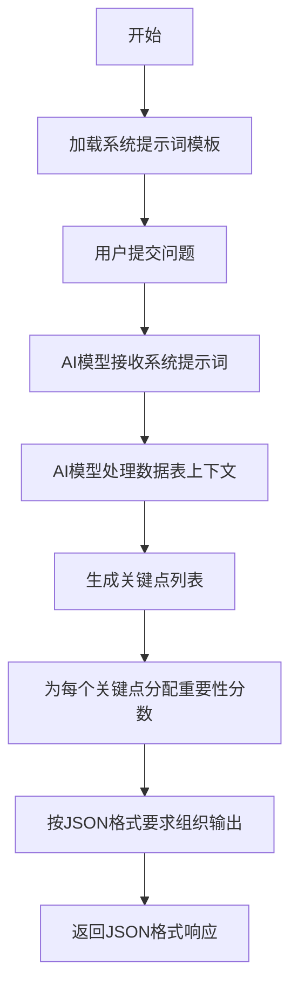

# `graphrag\packages\graphrag\graphrag\prompts\query\global_search_map_system_prompt.py` 详细设计文档

该文件定义了全局搜索功能的系统提示词（System Prompt），用于指导AI助手如何处理数据表、生成关键点摘要、并以特定JSON格式输出响应。

## 整体流程



## 类结构

```
该文件为纯字符串定义文件，不包含任何类定义
仅包含一个模块级常量 MAP_SYSTEM_PROMPT
```

## 全局变量及字段


### `MAP_SYSTEM_PROMPT`
    
系统提示词模板，包含角色定义、目标说明、数据处理规范和输出格式要求

类型：`str`
    


    

## 全局函数及方法


## 关键组件


### 系统提示模板结构

该代码定义了一个用于全局搜索（Global Search）的系统提示模板（MAP_SYSTEM_PROMPT），通过角色定义、目标说明、数据表格上下文、输出格式规范和约束条件来指导大型语言模型从表格数据中生成结构化的关键点摘要。

### 角色与目标定义

明确指定模型为帮助性助手，目标是根据输入的数据表格生成一个关键点列表来回答用户问题，并强调仅使用提供的数据，不得编造信息。

### JSON输出格式规范

定义了一个严格的JSON输出结构，包含points数组，每个元素包含description（描述）和score（重要性评分，0-100）字段，用于结构化响应。

### 数据引用机制

实现了数据溯源功能，允许在描述中通过"[Data: Reports (report ids)]"格式引用相关的报告ID，并规定单个引用最多列出5个最相关的记录ID，以"+more"表示更多。

### 响应长度控制

通过{max_length}占位符动态控制响应长度，确保输出在指定字数限制内。

### 上下文数据注入

使用{context_data}占位符插入实际的表格数据，为模型提供回答问题所需的原始数据。

### 重要性评分系统

要求对每个关键点进行0-100的重要性评分，"我不知道"类型的响应评分为0，用于量化信息价值。

### 约束与禁止事项

明确禁止在无支持证据的情况下添加信息、限制每引用最多5个ID、保留情态动词使用等约束，确保输出可靠性。


## 问题及建议


### 已知问题

- **代码重复**：提示词中存在重复的"---Goal---"部分和完全相同的指令说明，增加了维护成本和理解难度
- **缺少输入参数文档**：未对`max_length`和`context_data`等占位参数进行说明，使用者需要猜测参数含义和预期格式
- **硬编码的JSON转义**：使用`{{`和`}}`进行JSON格式化转义，在Python中虽正确但增加了理解复杂度，且限制了模板的跨语言复用性
- **缺乏错误处理指导**：未明确说明当数据不足、格式错误或超出长度限制时的具体处理方式
- **国际化支持不足**：提示词完全使用英文，限制了非英文用户群体的使用
- **无默认值定义**：`max_length`参数没有提供合理的默认值说明，可能导致生成结果超出预期

### 优化建议

- **消除重复内容**：提取重复的Goal段落，保留一份完整定义即可，使用变量引用或模板继承
- **添加参数文档注释**：在提示词开头或外部文档中明确说明`max_length`、`context_data`等参数的类型、用途和默认值
- **改进模板格式**：考虑使用标准模板语法（如Mustache或Jinja2）替代手动JSON转义，提高可读性和跨语言兼容性
- **增加错误处理指南**：在提示词中加入明确的错误场景处理说明，如"数据不足时返回score为0的空列表"
- **支持多语言**：提供国际化版本或使用语言无关的通用描述
- **提取为独立配置**：将提示词与调用逻辑分离，使用配置文件或专门的提示词管理系统


## 其它


### 设计目标与约束

本系统提示词的核心设计目标是定义AI助手在处理全局搜索时的行为规范，使其能够准确、完整地回应用户关于表格数据的查询。约束条件包括：响应必须基于提供的表格数据，不得编造信息；每个关键点必须附带重要性评分（0-100）；每个引用最多包含5个记录ID，超出部分用"+more"表示；响应长度受max_length参数限制；输出格式必须为标准JSON结构。

### 错误处理与异常设计

当输入数据表格不包含足够信息回答用户问题时，系统应明确返回"I don't know"类响应，重要性评分为0。JSON响应中的points数组可能为空，表示无法提供有效答案。对于数据引用格式错误或缺失的情况，应在description中省略引用部分而非使用占位符。

### 数据流与状态机

本提示词作为静态字符串模板被加载到LLM系统中。数据流为：用户查询 → 上下文构建（注入数据表格） → 模板变量替换（max_length、context_data） → LLM生成 → JSON解析。状态机包含三个状态：初始状态（等待查询）、处理中状态（数据注入与模板渲染）、完成状态（JSON输出验证）。

### 外部依赖与接口契约

本模块依赖外部LLM服务进行响应生成。接口契约要求：输入为用户查询字符串和格式化后的数据表格；输出必须为符合指定JSON Schema的有效JSON字符串。模板变量{max_length}和{context_data}必须在调用前进行正确转义和替换，以防止JSON格式破坏和注入攻击。

### 安全性与隐私考虑

提示词中明确要求不编造信息，防止幻觉导致的虚假数据呈现。数据引用机制确保所有声称有数据支持的观点都能追溯到具体报告ID。响应长度限制防止过度详细的信息泄露风险。敏感数据处理需在数据表格准备阶段完成过滤。

### 性能考量

响应长度限制（max_length）确保LLM生成token数量可控。引用数量限制（最多5个记录ID）减少输出复杂度。JSON格式输出便于后续解析，减少处理延迟。模板预编译和缓存可提升多次调用的性能。

### 配置与可扩展性

max_length参数可动态调整以适应不同场景需求。数据表格格式（context_data）可通过标准化接口替换为其他数据源。提示词模板结构支持模块化扩展，可在不修改核心逻辑的情况下添加新的指令或约束。

### 使用示例

```python
# 模板变量替换示例
context_data = "报告表: id=1, 内容='2023年Q1财报'..."
max_length = 500

filled_prompt = MAP_SYSTEM_PROMPT.format(
    max_length=max_length,
    context_data=context_data
)

# 期望的LLM输出格式
# {
#     "points": [
#         {"description": "描述内容 [Data: Reports (1, 2, 3)]", "score": 85},
#         {"description": "描述内容 [Data: Reports (4, 5)]", "score": 70}
#     ]
# }
```


    