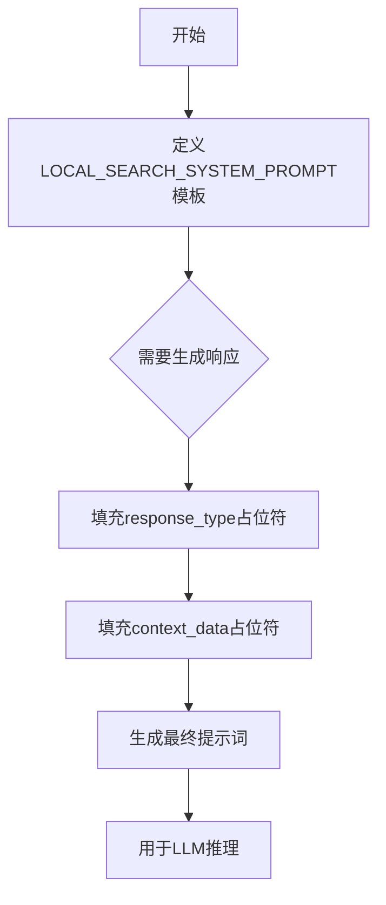

# `graphrag\packages\graphrag\graphrag\prompts\query\local_search_system_prompt.py` 详细设计文档

这是一个包含Local Search系统提示词的Python文件，定义了用于本地搜索场景的AI助手系统提示模板，用于根据提供的表格数据生成符合目标长度和格式的响应，并支持数据引用标注。

## 整体流程



## 类结构

```
模块: local_search_system_prompts (无类定义)
└── 全局变量: LOCAL_SEARCH_SYSTEM_PROMPT
```

## 全局变量及字段


### `LOCAL_SEARCH_SYSTEM_PROMPT`
    
本地搜索系统的系统提示词模板，包含角色定义、目标、数据引用格式和响应长度格式要求等指导AI回答表格数据的指令

类型：`str`
    


    

## 全局函数及方法


## 关键组件


### LOCAL_SEARCH_SYSTEM_PROMPT

全局变量，存储本地搜索系统的完整提示模板，定义了AI助手如何响应用户关于数据表中数据的问题，包括角色定义、数据引用规则、响应格式要求和模板变量占位符。

### 角色定义模块 (---Role---)

提示模板的一部分，定义AI为帮助用户回答关于数据表中数据的助手角色。

### 目标模块 (---Goal---)

提示模板的一部分，指定生成符合目标长度和格式的响应，从输入数据表中汇总信息，并可结合相关常识知识。

### 数据引用规则

提示模板中的关键规则，定义如何列出数据引用，包括：每个引用最多5个记录ID、使用"+more"表示更多记录、格式为"[Data: <数据集名称> (记录ID)]"。

### 目标响应长度和格式 (---Target response length and format---)

模板变量占位符 {response_type}，用于指定生成响应的目标长度和格式要求。

### 数据表上下文 (---Data tables---)

模板变量占位符 {context_data}，用于插入要查询的数据表内容。

### Markdown样式要求

提示模板中的最后一项要求，指定响应应以markdown格式样式化。


## 问题及建议


### 已知问题

- **代码重复**：提示模板中间和结尾重复包含了"Goal"和"Target response length and format"两个完整段落，导致冗余，增加了维护成本
- **硬编码常量**：5个记录ID的限制以魔数形式直接写在文本中，未提取为可配置常量，降低了可维护性
- **缺乏文档说明**：文件缺少模块级docstring，未说明该提示模板的用途、使用场景和依赖关系
- **国际化支持缺失**：提示文本全部硬编码为英文，若需支持多语言需要大量重构
- **占位符使用不规范**：response_type和context_data使用大括号包裹但未显式标记为模板变量，可能导致模板引擎解析混淆
- **字符串格式问题**：多行字符串缩进可能影响最终prompt的格式，建议使用textwrap.dedent或保持左对齐
- **缺乏版本控制和变更历史**：对于核心业务提示模板，缺少版本注释和变更记录

### 优化建议

- 将重复的"Goal"和"Target response length and format"段落提取为公共片段，使用变量引用
- 将5个记录ID的限制提取为常量（如MAX_REFERENCE_IDS = 5），并在模板中使用占位符引用
- 添加模块级docstring，说明该文件用于本地搜索系统的LLM提示模板
- 考虑将提示模板内容外部化到配置文件或数据库，支持运行时配置和多语言切换
- 使用明确的模板变量标记（如{{response_type}}或%(response_type)s），提高模板可读性
- 使用textwrap.dedent处理多行字符串，保持代码缩进整洁的同时不影响最终输出格式
- 添加版本号和变更日志注释，便于追踪提示模板的演进历史


## 其它


### 一段话描述

该代码文件定义了一个本地搜索系统的提示词模板（`LOCAL_SEARCH_SYSTEM_PROMPT`），用于指导AI助手根据提供的数据表内容回答用户问题，强调数据引用规范、响应格式要求和信息真实性原则。

### 文件的整体运行流程

该文件是一个纯字符串资源文件，不包含可执行逻辑。其运行流程如下：
1. 定义字符串常量 `LOCAL_SEARCH_SYSTEM_PROMPT`，包含提示词模板
2. 模板包含两个占位符：`{response_type}`（目标响应长度和格式）和 `{context_data}`（数据表格内容）
3. 在实际使用时，调用方通过字符串格式化方法（如Python的`str.format()`或f-string）替换占位符
4. 替换后的完整提示词被传递给大语言模型（LLM）以生成回答

### 类的详细信息

该文件不包含任何类定义。

### 全局变量详细信息

**LOCAL_SEARCH_SYSTEM_PROMPT**
- 类型：str（字符串）
- 描述：本地搜索系统的系统提示词模板，包含角色定义、目标说明、数据引用格式规范和响应格式要求

### 全局函数详细信息

该文件不包含任何全局函数。

### 关键组件信息

**{response_type}占位符**
- 描述：目标响应长度和格式的占位符，在实际调用时替换为具体要求

**{context_data}占位符**
- 描述：数据表格内容的占位符，在实际调用时替换为具体的表格数据

**数据引用格式规范**
- 描述：定义了在回答中引用数据记录ID的格式要求，包括最多5个记录ID和"+more"表示法

**markdown格式要求**
- 描述：要求响应使用markdown样式进行格式化

### 潜在的技术债务或优化空间

1. **硬编码模板问题**：提示词模板直接硬编码在代码中，不利于非技术人员修改和维护，建议考虑配置文件或数据库存储
2. **缺乏版本管理**：提示词模板没有版本控制机制，难以追踪修改历史
3. **重复内容**：模板中存在重复的"Goal"和"Target response length and format"段落，可简化
4. **缺乏国际化支持**：提示词目前仅有英文版本，不支持多语言
5. **缺少输入验证**：占位符替换前缺乏对输入数据的验证机制
6. **缺乏提示词测试**：没有针对提示词效果的测试用例，难以评估提示词质量

### 其它项目

#### 设计目标与约束

- **目标**：生成符合目标长度和格式的响应，正确引用数据来源，拒绝回答无法从数据中验证的问题
- **约束**：响应中引用的数据记录ID不超过5个（应显示最相关的5个并添加"+more"），不编造信息，数据引用需包含数据集名称和记录ID

#### 错误处理与异常设计

- **占位符未替换**：如果占位符未替换直接发送给LLM，可能导致模型无法正确理解任务
- **数据为空**：当`{context_data}`为空时，提示词指导模型直接说明不知道答案
- **无效的record id**：提示词假设提供的record id都是有效的，缺乏对无效ID的处理指导

#### 数据流与状态机

该文件为静态字符串资源，不涉及动态数据流或状态机设计。数据流为：原始数据 → 格式化填充 → 完整提示词 → LLM → 响应生成

#### 外部依赖与接口契约

- **依赖项**：无直接代码依赖，仅作为字符串资源被其他模块引用
- **接口契约**：
  - 输入：包含`{response_type}`和`{context_data}`占位符的模板字符串
  - 输出：完整的系统提示词字符串
  - 使用方需保证替换占位符时的数据类型正确（字符串类型）

#### 安全性考虑

- **敏感信息泄露**：提示词模板不涉及敏感信息，但使用方需注意填充的数据内容安全
- **提示词注入风险**：如果`{context_data}`或`{response_type}`来源不可控，可能存在注入风险

#### 可维护性与扩展性

- **当前局限**：提示词修改需要直接编辑源代码
- **改进建议**：可考虑抽取到独立的配置文件（如JSON/YAML），或提供管理界面便于非开发人员调整
- **A/B测试支持**：缺乏对不同提示词版本进行对比测试的机制

#### 性能考量

- 该文件为静态资源，不涉及运行时性能问题
- 字符串格式化操作性能可忽略不计

    