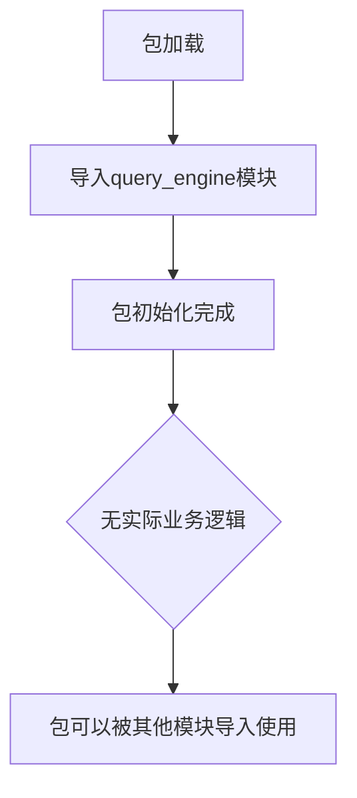

# `graphrag\packages\graphrag\graphrag\query\__init__.py` 详细设计文档

这是一个空的Python包初始化文件，定义了query engine包的根模块，包含版权声明和MIT许可证信息。该包用于组织query engine相关的代码模块。

## 整体流程



## 类结构

```
query_engine (package root)
└── (无子模块，暂为空包)
```

## 全局变量及字段


    

## 全局函数及方法


## 关键组件


### 一段话描述

这是一个名为 `query_engine` 的 Python 包的根模块初始化文件，作为该包的入口点，目前仅包含版权声明和基本的包描述文档，尚未实现任何实际功能逻辑。

### 文件的整体运行流程

该文件作为 Python 包的入口文件，在包被导入时首先被执行。由于当前仅包含文档字符串和版权声明，不涉及任何实际逻辑执行，不影响应用程序的运行流程。

### 类的详细信息

该文件中未定义任何类。

### 全局变量和全局函数

该文件中未定义任何全局变量或全局函数。

### 关键组件信息

| 名称 | 描述 |
|------|------|
| query_engine 包 | 微软官方的查询引擎包根模块，作为包的入口点 |

### 潜在的技术债务或优化空间

1. **功能缺失**：当前包仅包含文档字符串，核心功能（如查询处理、索引管理等）尚未实现
2. **接口设计**：需要根据实际需求定义包的核心 API 接口
3. **模块化设计**：建议将不同功能模块化到子包中，提高代码可维护性
4. **文档完善**：需要补充更详细的模块文档和使用说明

### 其它项目

**设计目标与约束**：
- 遵循 MIT 开源许可证
- 版权归属 Microsoft Corporation (2024)

**错误处理与异常设计**：
- 当前模块不涉及错误处理逻辑

**数据流与状态机**：
- 当前模块不涉及数据流或状态机设计

**外部依赖与接口契约**：
- 当前模块无外部依赖关系


## 问题及建议


### 已知问题

-   空包实现：该包仅包含版权声明和文档字符串，未实现任何实际功能模块
-   缺少 `__init__.py` 内容：包初始化文件为空，缺乏模块导出定义
-   无版本信息：缺少 `__version__` 等版本元数据定义
-   无公共 API：未明确导出任何类、函数或变量
-   缺乏包级文档：包文档仅有一句话描述，无使用说明或 API 列表

### 优化建议

-   在 `__init__.py` 中添加 `__version__` 变量以维护版本信息
-   明确导出公共 API，使用 `__all__` 列表定义可公开访问的模块成员
-   扩展包文档，包含模块概述、子模块说明和使用示例
-   考虑添加 `__all__` 列表以控制导入行为，提高代码可维护性


## 其它


### 1. 核心功能概述

该代码是Microsoft Graph RAG项目的query_engine包根目录的初始化文件（__init__.py），作为query_engine包的入口点，提供包级别的命名空间和文档说明，目前仅包含版权信息和包的功能描述，尚未实现具体功能模块。

### 2. 文件整体运行流程

该__init__.py文件作为Python包的初始化模块，在首次导入query_engine包时由Python解释器自动执行。其主要作用是：1) 定义包的元数据信息；2) 暴露包的公共API接口；3) 初始化必要的包级资源。当前版本为占位符实现，尚未定义具体的运行流程。

### 3. 类详细信息

**无类定义**

该文件中不包含任何类定义。作为包根目录的__init__.py文件，后续版本可能会在此文件中定义包级别的公共类或导入子模块中的类。

### 4. 全局变量和全局函数信息

**无全局变量和全局函数**

该文件中不包含任何全局变量或全局函数定义。

### 5. 关键组件信息

| 组件名称 | 描述 |
|---------|------|
| query_engine包 | 微软Graph RAG项目的查询引擎包根模块，目前作为包的入口点和命名空间容器 |

### 6. 潜在的技术债务或优化空间

1. **功能缺失**：当前包仅包含文档字符串，未实现任何查询引擎功能，需要后续补充完整的查询处理逻辑；
2. **缺少公共API导出**：未通过__all__变量定义包的公共接口，建议明确导出列表以便使用者了解可用API；
3. **版本信息缺失**：未定义包的版本号（__version__变量），不便于版本管理和依赖控制；
4. **配置管理缺失**：缺少包级别的配置管理机制，如日志配置、默认参数设置等；
5. **文档完善**：虽然有简短的包描述，但缺乏详细的使用文档和API参考。

### 7. 设计目标与约束

**设计目标**：
- 建立query_engine包的模块化架构
- 提供高效的查询处理和执行能力
- 与Graph RAG项目的其他组件（如索引引擎、文档处理等）无缝集成

**设计约束**：
- 遵循MIT开源许可证要求
- 保持与项目整体架构的一致性
- 支持Microsoft Graph生态系统集成

**状态**：待完善，当前为占位符文件

### 8. 错误处理与异常设计

**异常类体系**：待定义

**错误处理策略**：待确定

由于代码中尚未实现具体功能，无法定义具体的异常类型和错误处理机制。建议在后续实现中考虑：定义包自定义异常类、统一的错误码系统、与项目整体异常处理框架的集成。

### 9. 数据流与状态机

**数据流**：待定义

当前文件不涉及实际数据处理流程。在查询引擎完整实现后，需要明确：查询输入的处理流程、查询执行的数据流向、结果输出的格式和传递方式。

**状态机**：不适用

该文件不包含状态机实现。

### 10. 外部依赖与接口契约

**外部依赖**：待确定

当前文件无依赖。在后续实现中可能依赖：
- 微软Graph API客户端库
- 图数据库驱动（如Neo4j、GraphDB等）
- 文档处理相关库
- 向量检索库

**接口契约**：待定义

query_engine包作为Graph RAG项目的核心组件，需要定义：
- 与索引引擎的接口
- 与文档加载器的接口
- 公共API的函数签名和返回类型
- 配置接口规范

### 11. 配置与扩展性

**配置管理**：待实现

建议在包初始化时提供默认配置加载机制，支持通过环境变量或配置文件自定义查询引擎行为。

**扩展性设计**：待规划

需要考虑：
- 查询处理管道的插件化架构
- 自定义检索器和支持
- 结果后处理器的可扩展性
- 不同图数据库后端的适配器模式

### 12. 安全与隐私

**安全考虑**：待评估

在后续实现中需考虑：
- Graph API认证和授权机制
- 查询注入防护
- 敏感数据处理
- 审计日志记录

### 13. 性能考量

**性能目标**：待定义

当前无性能相关的实现。在后续设计中需要考虑：
- 查询缓存机制
- 并发查询处理能力
- 大规模图遍历的优化
- 资源使用限制

### 14. 测试策略

**测试覆盖**：待规划

建议在后续实现中包含：
- 单元测试覆盖核心查询逻辑
- 集成测试验证与Graph API的交互
- 性能基准测试
- 模拟异常场景的测试

### 15. 部署与运维

**部署要求**：待定义

该包作为Graph RAG项目的子模块，部署时需要：
- 正确的Python环境配置
- 依赖包版本管理
- 环境变量配置
- 日志输出配置

**状态监控**：待实现

    