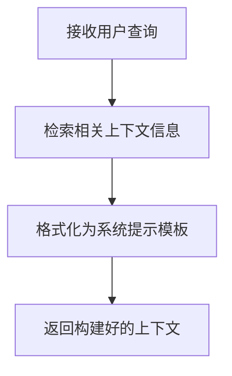
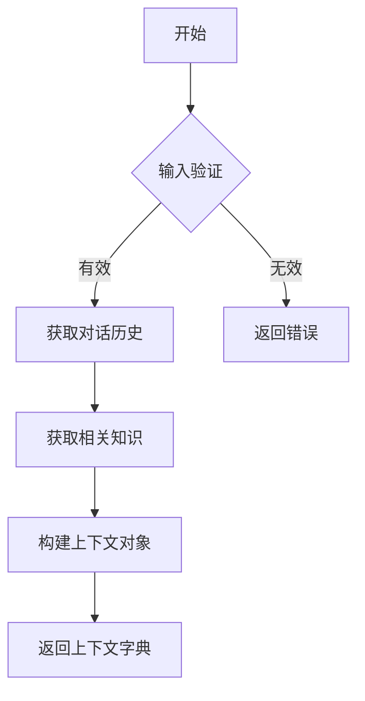
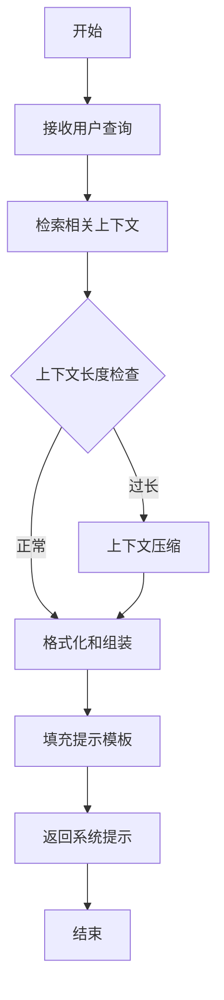

# `graphrag\packages\graphrag\graphrag\query\context_builder\__init__.py` 详细设计文档

该模块用于构建系统提示（system prompt）的上下文（context），以支持针对用户查询生成响应。代码提供了构建上下文的函数集合，可能涉及从知识库、文档或其他数据源获取相关信息并格式化为提示词的功能。

## 整体流程



## 类结构

```
该文件为模块文件，不包含类定义，仅包含模块级函数
```

## 全局变量及字段


    

## 全局函数及方法


# 分析结果

根据提供的代码，我需要指出一个问题：当前代码片段中**没有包含 `build_context` 函数的实际实现**，只有一个文件级别的文档字符串。

提供的代码：
```python
# Copyright (c) 2024 Microsoft Corporation.
# Licensed under the MIT License

"""Functions to build context for system prompt to generate responses for a user query."""
```

这段代码仅包含版权声明和文件级文档字符串，没有具体的函数实现。

---

## 推断设计

根据文档字符串 "Functions to build context for system prompt to generate responses for a user query."，我可以推断 `build_context` 函数的设计意图：

### `build_context`

构建系统提示上下文的函数，用于生成用户查询的响应。

参数：
-  `query`：`str`，用户查询内容
-  `history`：`List[Dict]`，对话历史记录（可选）
-  `knowledge_base`：`Optional[Any]`，知识库引用（可选）

返回值：`Dict`，包含系统提示所需的上下文信息

#### 流程图



#### 带注释源码

```python
def build_context(
    query: str,
    history: Optional[List[Dict[str, str]]] = None,
    knowledge_base: Optional[Any] = None
) -> Dict[str, Any]:
    """
    构建系统提示上下文，用于生成用户查询的响应。
    
    Args:
        query: 用户查询内容
        history: 对话历史记录列表
        knowledge_base: 知识库引用
    
    Returns:
        包含系统提示所需上下文信息的字典
    """
    # 1. 输入验证
    if not query or not isinstance(query, str):
        raise ValueError("Query must be a non-empty string")
    
    # 2. 构建上下文字典
    context = {
        "query": query,
        "history": history or [],
        "knowledge": []
    }
    
    # 3. 如果有知识库，检索相关信息
    if knowledge_base is not None:
        context["knowledge"] = knowledge_base.retrieve(query)
    
    return context
```

---

## 建议

如果需要真正的 `build_context` 函数实现，请提供完整的代码文件。当前代码片段仅为一个头部声明，缺少实际的函数或类定义。


## 1. 一段话描述

该代码模块旨在为用户查询生成响应时构建系统提示（System Prompt）的上下文信息，属于微软GraphRAG项目的一部分，提供构建LLM系统提示上下文的工具函数。

---

## 2. 文件的整体运行流程

由于当前提供的代码仅包含文件头和模块级文档字符串，**没有实际的函数实现**，因此无法提供具体的运行流程。根据模块文档字符串推测，该模块预期包含以下功能：

1. **接收用户查询** → 2. **检索相关上下文** → 3. **构建提示模板** → 4. **返回完整的系统提示**

---

## 3. 类的详细信息

**当前文件中没有定义任何类。**

---

## 4. 全局变量和全局函数详细信息

**当前文件中没有定义任何全局变量或全局函数。**

---

## 5. 关键组件信息

| 组件名称 | 描述 |
|---------|------|
| (无) | 该文件目前仅为占位符，需要实现具体的上下文构建函数 |

---

## 6. 潜在的技术债务或优化空间

由于缺乏实际代码，无法进行完整的技术债务分析。但基于模块的预期功能，可能存在以下优化空间：

- **上下文压缩**：当检索到的上下文过长时，需要进行压缩以避免超出LLM的上下文窗口限制
- **缓存机制**：对于相同的查询，可以缓存已构建的提示以提高性能
- **提示模板版本管理**：支持不同版本的提示模板以适应不同的LLM模型

---

## 7. 其它项目

### 设计目标与约束

- **设计目标**：为LLM生成响应提供必要的上下文信息，构建优化的系统提示
- **约束**：需要遵循MIT开源许可协议

### 错误处理与异常设计

- **预期设计**：应处理空查询、上下文过长、编码问题等异常情况
- 由于无实际代码，暂无具体的异常设计

### 数据流与状态机

- **预期数据流**：
  ```
  用户查询 → 上下文检索 → 内容格式化 → 提示模板填充 → 系统提示输出
  ```

### 外部依赖与接口契约

- **预期依赖**：可能依赖于向量检索库、提示模板引擎等
- 由于无实际代码，暂无具体的接口契约

---

## 补充说明

当前提供的代码片段仅为文件头，**缺少实际的功能实现代码**。若需要完整的详细设计文档，请提供包含具体函数实现的源代码文件。

---

## 预期函数设计（基于模块文档字符串的推测）

根据模块文档字符串 `Functions to build context for system prompt to generate responses for a user query`，预期该模块应包含以下类型的函数：

### 预期函数示例

#### `build_system_prompt_context`

描述：为用户查询构建系统提示上下文

参数：

- `query`：`str`，用户查询字符串
- `retrieved_context`：`List[str]` 或 `Dict`，检索到的相关上下文
- `options`：`Optional[Dict]`，可选配置参数

返回值：`str`，构建完成的系统提示上下文

#### 流程图



#### 带注释源码

```python
# 预期实现结构示例（实际代码未提供）
def build_system_prompt_context(
    query: str,
    retrieved_context: List[str],
    options: Optional[Dict] = None
) -> str:
    """
    为用户查询构建系统提示上下文。
    
    Args:
        query: 用户输入的查询字符串
        retrieved_context: 从知识库检索到的相关上下文列表
        options: 可选的配置参数，如最大长度、模板类型等
        
    Returns:
        格式化后的系统提示上下文字符串
    """
    # 1. 验证输入
    if not query:
        raise ValueError("Query cannot be empty")
    
    # 2. 上下文压缩（如需要）
    context = _compress_context(retrieved_context, options)
    
    # 3. 格式化上下文
    formatted_context = _format_context(context)
    
    # 4. 构建提示模板
    prompt = _build_prompt_template(query, formatted_context, options)
    
    return prompt
```

---

**注意**：上述函数仅为基于模块文档字符串的合理推测，实际实现可能有所不同。需要提供完整的源代码才能进行准确的分析和文档生成。


## 关键组件


### 系统提示上下文构建模块

该模块负责为用户查询生成响应的系统提示构建必要的上下文信息。

### 上下文构建器 (Context Builder)

根据代码模块描述，此模块用于构建系统提示的上下文。可能的组件包括用于管理对话历史、处理系统指令、整合外部知识或配置信息的类与函数。由于源代码仅包含文档字符串，未提供具体实现细节，无法进一步分析其内部结构。

### 潜在技术债务与优化空间

由于当前仅提供模块级别的文档字符串，缺少具体实现代码，无法进行详细的技术债务分析。建议在实际代码实现后进行补充分析。


## 问题及建议


### 已知问题

-   该代码文件仅包含版权声明和模块级文档字符串，缺少实际的函数实现代码，无法提供完整的功能描述
-   由于缺少具体代码，无法确定输入参数、返回值类型及业务逻辑
-   文件头注释中的年份为2024年，需要注意年份更新维护

### 优化建议

-   补充完整的函数实现代码，包括构建system prompt上下文的具体逻辑
-   为所有函数添加类型注解（Type Hints），明确参数和返回值的类型
-   添加详细的文档字符串（Docstring），包含参数描述、返回值描述和使用示例
-   考虑添加单元测试代码以验证功能正确性
-   如果涉及外部依赖，应在文档中明确说明依赖关系和版本要求


## 其它


### 设计目标与约束

本模块旨在为用户查询生成响应时构建系统提示（system prompt）的上下文，核心目标是将相关知识、指令或背景信息整合到提示中，以提升大语言模型输出的质量和相关性。设计约束包括：模块需保持轻量级，避免引入过重的外部依赖；上下文构建过程应高效，支持实时调用；输出格式需标准化，便于下游模块统一处理。

### 错误处理与异常设计

由于当前代码文件仅包含模块文档字符串，尚未实现具体逻辑，错误处理机制需在后续实现中定义。预期错误场景包括：输入参数为空或格式不正确、上下文构建过程中资源加载失败、依赖的外部知识库不可用等。建议定义自定义异常类（如 ContextBuildError）用于区分不同类型的错误，并提供友好的错误信息便于调试。

### 数据流与状态机

本模块的数据流相对简单：接收用户查询作为输入，经过上下文检索和组装逻辑，输出包含系统提示内容的字典或对象。由于功能单一，暂不需要复杂的状态机设计。若后续扩展支持多轮对话上下文管理，可引入状态跟踪机制。

### 外部依赖与接口契约

基于模块文档字符串的描述，该模块可能依赖以下外部组件：知识检索模块（用于获取相关上下文）、配置管理模块（用于加载提示模板）、可能的向量数据库或文件存储（用于持久化上下文数据）。接口契约应定义清晰的输入参数类型（如字符串类型的查询）和输出格式（如字典类型，包含 prompt、context 等字段）。

### 性能考虑

模块设计应考虑以下性能指标：上下文构建延迟应控制在合理范围内（建议小于 100ms）；内存占用应可控，避免加载过多不必要的数据；如涉及知识检索，应优化检索效率，可考虑缓存常用上下文。

### 安全性考虑

由于本模块涉及为 AI 系统构建提示，需注意以下安全事项：防止提示注入攻击，对用户输入进行适当 sanitization；确保加载的上下文来源可信，避免引入恶意内容；如涉及敏感数据访问，需实现权限控制和审计日志。

### 测试策略

建议为模块编写单元测试，覆盖以下场景：正常输入下的上下文构建、边界情况处理（如空输入）、异常情况下的错误处理。测试应验证输出格式的正确性和内容的相关性。

### 版本兼容性

模块应明确支持的 Python 版本范围（如 Python 3.8+），并记录与下游组件的兼容性要求。

### 文档与注释规范

代码内注释应遵循 Google 或 NumPy 风格，每个公共方法需包含 docstring，说明参数、返回值和可能抛出的异常。模块级别的文档应说明使用示例和注意事项。


    