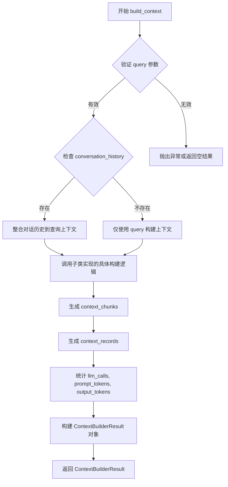
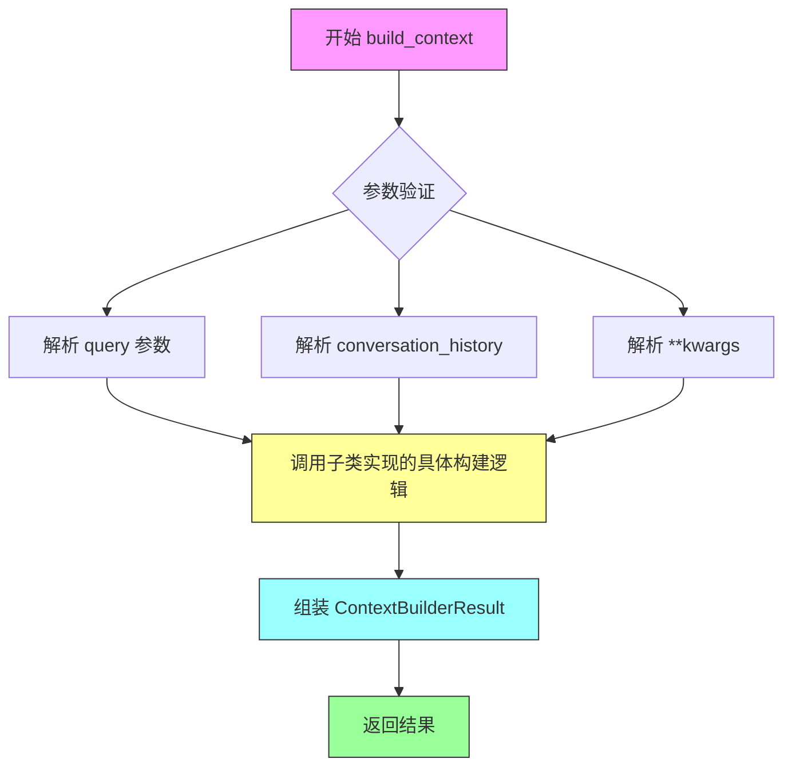
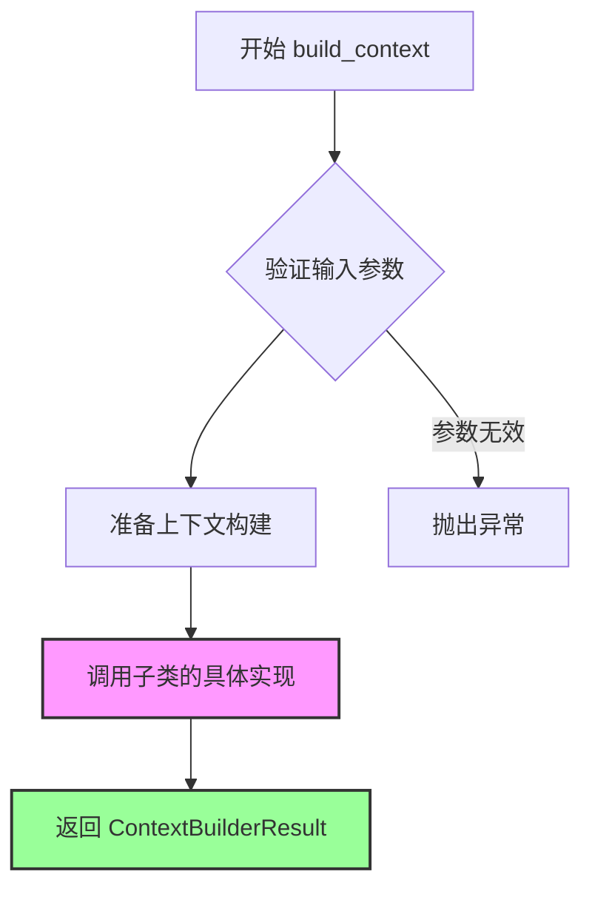

# `graphrag\packages\graphrag\graphrag\query\context_builder\builders.py` 详细设计文档

该模块定义了全局搜索、本地搜索、DRIFT搜索和基础搜索的上下文构建器抽象基类，用于构建不同搜索模式的上下文，包含上下文块、上下文记录和LLM调用统计信息。

## 整体流程

```mermaid
graph TD
    A[开始] --> B[接收查询字符串]
B --> C{搜索模式类型?}
C -->|Global| D[GlobalContextBuilder.build_context]
C -->|Local| E[LocalContextBuilder.build_context]
C -->|DRIFT| F[DRIFTContextBuilder.build_context]
C -->|Basic| G[BasicContextBuilder.build_context]
D --> H[返回ContextBuilderResult]
E --> H
F --> I[返回tuple[pd.DataFrame, dict[str, int]]]
G --> H
```

## 类结构

```
ContextBuilderResult (数据类)
├── context_chunks: str | list[str]
├── context_records: dict[str, pd.DataFrame]
├── llm_calls: int
├── prompt_tokens: int
└── output_tokens: int

GlobalContextBuilder (ABC抽象基类)
└── build_context (async抽象方法)

LocalContextBuilder (ABC抽象基类)
└── build_context (抽象方法)

DRIFTContextBuilder (ABC抽象基类)
└── build_context (async抽象方法)

BasicContextBuilder (ABC抽象基类)
└── build_context (抽象方法)
```

## 全局变量及字段


### `pd`
    
pandas库别名，用于数据处理和分析

类型：`module`
    


### `ContextBuilderResult.context_chunks`
    
上下文文本块

类型：`str | list[str]`
    


### `ContextBuilderResult.context_records`
    
上下文数据记录

类型：`dict[str, pd.DataFrame]`
    


### `ContextBuilderResult.llm_calls`
    
LLM调用次数

类型：`int`
    


### `ContextBuilderResult.prompt_tokens`
    
提示令牌数

类型：`int`
    


### `ContextBuilderResult.output_tokens`
    
输出令牌数

类型：`int`
    
    

## 全局函数及方法


### `GlobalContextBuilder.build_context`

异步构建全局搜索上下文的抽象方法，由子类实现具体逻辑，用于根据查询字符串和可选的对话历史构建全局搜索所需的上下文数据。

参数：

- `query`：`str`，用户输入的查询字符串，用于构建搜索上下文
- `conversation_history`：`ConversationHistory | None`，可选的对话历史记录，用于提供对话上下文
- `**kwargs`：`dict`，额外的关键字参数，用于扩展功能

返回值：`ContextBuilderResult`，包含上下文内容块、上下文记录、LLM调用次数、提示令牌数和输出令牌数的数据类实例

#### 流程图



#### 带注释源码

```python
class GlobalContextBuilder(ABC):
    """全局搜索上下文构建器的抽象基类"""

    @abstractmethod
    async def build_context(
        self,
        query: str,  # 用户查询字符串
        conversation_history: ConversationHistory | None = None,  # 可选的对话历史
        **kwargs,  # 额外的关键字参数
    ) -> ContextBuilderResult:
        """构建全局搜索模式的上下文
        
        参数:
            query: 搜索查询字符串
            conversation_history: 可选的对话历史，用于提供上下文
            **kwargs: 额外的关键字参数
            
        返回:
            ContextBuilderResult: 包含上下文内容、记录和统计信息的对象
            
        注意:
            这是一个抽象方法，子类必须实现具体的上下文构建逻辑
        """
        # 子类需要重写此方法实现具体逻辑
        pass
```


### `LocalContextBuilder.build_context`

同步构建本地搜索上下文的抽象方法，由子类实现具体逻辑。该方法接收查询字符串和可选的对话历史，返回包含上下文块、上下文记录及令牌使用统计的构建结果。

参数：

- `query`：`str`，用户输入的查询字符串，用于检索相关上下文
- `conversation_history`：`ConversationHistory | None`，可选的对话历史对象，用于提供会话上下文
- `**kwargs`：可变关键字参数，支持扩展额外参数

返回值：`ContextBuilderResult`，包含以下字段的数据类：
- `context_chunks`：文本块内容（字符串或字符串列表）
- `context_records`：数据记录字典（键为字符串，值为 pandas DataFrame）
- `llm_calls`：LLM 调用次数
- `prompt_tokens`：提示词令牌数
- `output_tokens`：输出令牌数

#### 流程图



#### 带注释源码

```python
class LocalContextBuilder(ABC):
    """本地搜索上下文构建器的抽象基类."""

    @abstractmethod
    def build_context(
        self,
        query: str,
        conversation_history: ConversationHistory | None = None,
        **kwargs,
    ) -> ContextBuilderResult:
        """构建本地搜索模式的上下文.
        
        Args:
            query: 用户查询字符串，用于检索相关上下文
            conversation_history: 可选的对话历史，提供会话上下文
            **kwargs: 额外的关键字参数，支持扩展
        
        Returns:
            ContextBuilderResult: 包含上下文块、记录和令牌统计的结果对象
        """
        # 注意：此方法为抽象方法，具体实现由子类完成
        # 子类需要实现：
        # 1. 根据 query 检索相关文档/数据
        # 2. 处理对话历史（如有）
        # 3. 构建上下文块和记录
        # 4. 统计令牌使用情况
        # 5. 返回 ContextBuilderResult 实例
        pass
```


### `DRIFTContextBuilder.build_context`

异步构建DRIFT搜索的上下文，用于 primer search actions。该方法是一个抽象方法，定义了DRIFT搜索模式下文构建器的接口，由具体的实现类完成实际的上下文构建逻辑。

参数：

- `query`：`str`，用户查询字符串，用于构建搜索上下文
- `**kwargs`：可变关键字参数，用于传递额外的搜索参数

返回值：`tuple[pd.DataFrame, dict[str, int]]`，返回一个元组，其中第一个元素是包含上下文数据的 pandas DataFrame，第二个元素是字符串到整数的字典（通常用于存储某种计数或统计信息）

#### 流程图

```mermaid
flowchart TD
    A[开始 build_context] --> B[接收 query 参数]
    B --> C[接收 **kwargs 可变参数]
    C --> D{子类实现}
    D --> E[执行具体上下文构建逻辑]
    E --> F[返回 tuple[pd.DataFrame, dict[str, int]]]
    F --> G[结束]
    
    style D fill:#f9f,stroke:#333,stroke-width:2px
    style E fill:#ff9,stroke:#333,stroke-width:2px
```

#### 带注释源码

```python
class DRIFTContextBuilder(ABC):
    """Base class for DRIFT-search context builders."""

    @abstractmethod
    async def build_context(
        self,
        query: str,
        **kwargs,
    ) -> tuple[pd.DataFrame, dict[str, int]]:
        """Build the context for the primer search actions."""
        # 参数:
        #   query: str - 用户查询字符串
        #   **kwargs: 可变关键字参数，用于扩展搜索配置
        # 返回值:
        #   tuple[pd.DataFrame, dict[str, int]] - 上下文数据帧和统计信息字典
        # 注意: 这是一个抽象方法，具体实现由子类完成
        pass
```


### `BasicContextBuilder.build_context`

构建基础搜索模式的上下文（Build the context for the basic search mode）。

参数：

- `query`：`str`，搜索查询字符串
- `conversation_history`：`ConversationHistory | None`，可选的对话历史，用于提供会话上下文
- `**kwargs`：其他关键字参数，用于扩展功能

返回值：`ContextBuilderResult`，包含上下文块、上下文记录、LLM调用次数、提示令牌数和输出令牌数的结果对象

#### 流程图



#### 带注释源码

```python
class BasicContextBuilder(ABC):
    """基础搜索上下文构建器的抽象基类"""

    @abstractmethod
    def build_context(
        self,
        query: str,
        conversation_history: ConversationHistory | None = None,
        **kwargs,
    ) -> ContextBuilderResult:
        """构建基础搜索模式的上下文。
        
        这是一个抽象方法，子类必须实现具体的上下文构建逻辑。
        
        参数:
            query: 搜索查询字符串
            conversation_history: 可选的对话历史，用于提供会话上下文
            **kwargs: 其他关键字参数，用于扩展功能
            
        返回:
            ContextBuilderResult: 包含以下字段的结果对象:
                - context_chunks: 上下文块（字符串或字符串列表）
                - context_records: 上下文记录（字典，键为字符串，值为pandas DataFrame）
                - llm_calls: LLM调用次数
                - prompt_tokens: 提示令牌数
                - output_tokens: 输出令牌数
        """
        # 子类需要实现此方法
        pass
```

## 关键组件


### ContextBuilderResult

用于存储上下文构建结果的数据类，包含检索到的文本块(context_chunks)、数据记录(context_records)以及LLM调用统计信息(llm_calls、prompt_tokens、output_tokens)

### GlobalContextBuilder

全局搜索场景的上下文构建器抽象基类，定义了异步构建全局搜索上下文的接口(build_context方法)，接收查询字符串和可选的对话历史，返回包含上下文内容的结果对象

### LocalContextBuilder

本地搜索场景的上下文构建器抽象基类，定义了同步构建本地搜索上下文的接口(build_context方法)，接收查询字符串和可选的对话历史，返回包含上下文内容的结果对象

### DRIFTContextBuilder

DRIFT搜索场景的上下文构建器抽象基类，定义了异步构建DRIFT搜索上下文的接口(build_context方法)，接收查询字符串和可选参数，返回原始数据帧(DataFrame)和统计数据字典的元组

### BasicContextBuilder

基础搜索场景的上下文构建器抽象基类，定义了同步构建基础搜索上下文的接口(build_context方法)，接收查询字符串和可选的对话历史，返回包含上下文内容的结果对象


## 问题及建议


### 已知问题

-   **返回值类型不一致**：DRIFTContextBuilder 的 build_context 方法返回 `tuple[pd.DataFrame, dict[str, int]]`，而其他三个类都返回 `ContextBuilderResult`。这违反了里氏替换原则（Liskov Substitution Principle），无法用 DRIFTContextBuilder 替代其他 ContextBuilder 使用。
-   **方法签名不一致**：DRIFTContextBuilder 的 build_context 方法缺少 `conversation_history` 参数，而其他三个类都支持该参数，导致接口契约不统一。
-   **同步/异步设计不统一**：GlobalContextBuilder 和 DRIFTContextBuilder 的 build_context 是 async 方法，而 LocalContextBuilder 和 BasicContextBuilder 是同步方法，增加了调用方的复杂度。
-   **DataFrame 作为返回类型**：DRIFTContextBuilder 直接返回 pd.DataFrame，这与其他类使用 ContextBuilderResult 的设计理念不一致，且 pandas 依赖较重。
-   **过度使用 kwargs**：所有 build_context 方法都使用 `**kwargs`，导致接口不透明，调用方无法明确知道支持哪些参数。

### 优化建议

-   **统一返回值类型**：将 DRIFTContextBuilder 的返回值改为 ContextBuilderResult，或创建一个统一的基类接口来定义返回类型。
-   **统一方法签名**：为 DRIFTContextBuilder 添加 conversation_history 参数，保持接口一致性。
-   **统一异步/同步设计**：根据实际需求，要么全部使用异步方法，要么全部使用同步方法，或者在文档中明确说明为何需要区分。
-   **显式参数定义**：将 **kwargs 替换为明确的参数定义，提高接口的可读性和可维护性。
-   **增强文档字符串**：为每个方法添加详细的参数说明和返回值描述。

## 其它


### 设计目标与约束

该模块定义了图谱查询系统中上下文构建器的抽象基类架构，目标是提供统一的接口规范用于构建不同搜索模式（全局搜索、局部搜索、DRIFT搜索、基本搜索）的查询上下文。约束包括：所有具体实现必须继承相应的抽象类并实现build_context方法；支持异步和同步两种实现模式；必须返回标准化的ContextBuilderResult对象。

### 错误处理与异常设计

由于是抽象基类，具体错误处理由实现类负责。基类本身不定义特定异常，但建议实现类在以下场景进行错误处理：查询字符串为空或无效时抛出ValueError；conversation_history参数类型不匹配时抛出TypeError；数据处理过程中发生异常时应包装后重新抛出；网络或存储相关错误应使用自定义异常类以便调用方区分错误类型。

### 数据流与状态机

数据流方向：调用方传入query字符串和可选的conversation_history → 传递给具体实现类的build_context方法 → 方法内部进行上下文构建（包括知识库检索、数据清洗、格式化等）→ 返回ContextBuilderResult对象（包含context_chunks、context_records、llm_calls、prompt_tokens、output_tokens）。状态机方面：GlobalContextBuilder和DRIFTContextBuilder支持异步状态转换，LocalContextBuilder和BasicContextBuilder为同步状态。

### 外部依赖与接口契约

主要依赖包括：abc模块（用于定义抽象基类）、pandas库（用于处理context_records数据）、graphrag.query.context_builder.conversation_history模块中的ConversationHistory类。接口契约：所有build_context方法必须接受query(str)作为必需参数，conversation_history(ConversationHistory|None)作为可选参数，**kwargs用于扩展；返回值类型必须为ContextBuilderResult或tuple[pd.DataFrame, dict[str, int]]（DRIFTContextBuilder）。

### 性能考量

异步实现的GlobalContextBuilder和DRIFTContextBuilder应充分利用asyncio并发能力处理多个数据源；同步实现的LocalContextBuilder和BasicContextBuilder应考虑使用缓存机制减少重复计算；context_records中的DataFrame操作应避免不必要的数据复制；大规模数据处理时应采用流式处理或分批加载策略。

### 线程安全性

抽象基类本身不涉及共享状态，因此是线程安全的。具体实现类中如果涉及共享资源（如缓存、连接池），需要自行实现适当的同步机制。异步实现应确保在并发调用时的数据隔离。

### 版本兼容性

代码标注使用MIT许可证，版权为Microsoft Corporation 2024。需要确保Python版本支持类型注解（3.10+推荐）；pandas版本应与DataFrame操作兼容； ConversationHistory类的接口变更需要向后兼容或提供版本迁移方案。

### 安全性考虑

query参数应进行输入验证以防止注入攻击；conversation_history中的敏感信息处理应遵循数据脱敏规范；如果涉及外部知识库访问，需要实施适当的认证和授权机制；返回的context_chunks和context_records应进行内容过滤以防止敏感信息泄露。

### 使用示例

```python
# 异步使用GlobalContextBuilder
result = await global_builder.build_context(
    query="查找关于人工智能的信息",
    conversation_history=ConversationHistory(history=[...])
)

# 同步使用LocalContextBuilder  
result = local_builder.build_context(
    query="查找本地技术文档",
    conversation_history=None
)
```

### 测试策略

应为每个抽象基类提供具体的mock实现用于单元测试；测试用例应覆盖正常流程、边界条件（如空query）和异常情况；异步方法应使用asyncio.testing工具进行测试；建议为每种搜索模式实现集成测试以验证上下文构建的完整性。

    