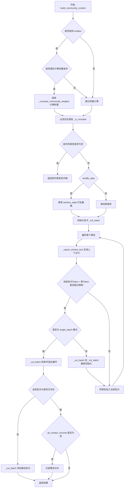
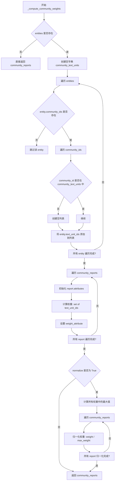
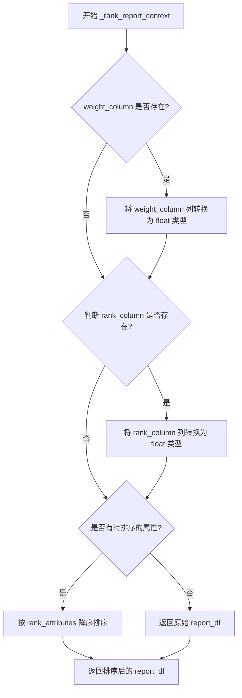
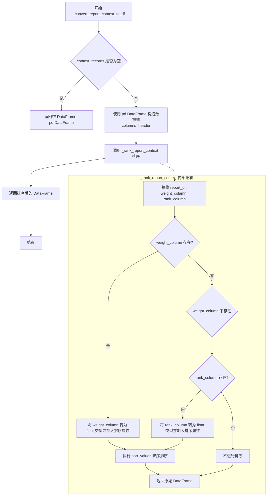

# `graphrag\packages\graphrag\graphrag\query\context_builder\community_context.py` 详细设计文档

该模块用于准备社区报告数据表，将其转换为上下文数据供系统提示词使用，支持计算社区权重、分批处理、随机打乱和CSV格式输出，适用于检索增强生成场景。

## 整体流程

```mermaid
graph TD
    A[开始 build_community_context] --> B[获取或初始化tokenizer]
B --> C{是否需要计算社区权重?}
C -- 是 --> D[_compute_community_weights]
C -- 否 --> E[过滤社区报告]
D --> E
E --> F{是否有选中报告?}
F -- 否 --> G[返回空结果]
F -- 是 --> H{shuffle_data?}
H -- 是 --> I[随机打乱数据]
H -- 否 --> J[初始化批次]
I --> J
J --> K[遍历选中的报告]
K --> L{当前批次token + 新token > max_context_tokens?}
L -- 是 --> M{单批次模式?}
M -- 是 --> N[切割批次并退出循环]
M -- 否 --> O[切割批次并重新初始化]
O --> J
L -- 否 --> P[添加到当前批次]
P --> K
K --> Q[检查当前批次ID是否已存在]
Q --> R{不存在?]
R -- 是 --> S[切割最后批次]
R -- 否 --> T{有上下文记录?]
T -- 否 --> U[记录警告并返回空]
T -- 是 --> V[返回上下文文本和DataFrame]
N --> V
```

## 类结构

```
模块: graphrag.context
└── community_context.py
    ├── 全局变量
    │   └── NO_COMMUNITY_RECORDS_WARNING
    ├── 公开函数
    │   └── build_community_context (主入口)
    └── 私有函数
        ├── _compute_community_weights
        ├── _rank_report_context
        └── _convert_report_context_to_df
```

## 全局变量及字段


### `NO_COMMUNITY_RECORDS_WARNING`
    
警告信息：当构建社区上下文时没有添加任何社区记录时输出的警告消息

类型：`str`
    


    

## 全局函数及方法


### `build_community_context`

该函数用于将社区报告（Community Report）数据表准备为系统提示（system prompt）的上下文数据，支持根据实体计算社区权重，并将数据转换为带标题的CSV格式文本，同时处理分批Token限制。

参数：

- `community_reports`：`list[CommunityReport]`，社区报告列表，作为主要的数据来源
- `entities`：`list[Entity] | None`，实体列表，用于计算社区权重（可选）
- `tokenizer`：`Tokenizer | None`，分词器实例，用于计算Token数量（可选，默认自动获取）
- `use_community_summary`：`bool`，是否使用社区摘要（True）或完整内容（False），默认True
- `column_delimiter`：`str`，列分隔符，用于CSV格式，默认"|"
- `shuffle_data`：`bool`，是否打乱选中的报告顺序，默认True
- `include_community_rank`：`bool`，是否在输出中包含社区排名列，默认False
- `min_community_rank`：`int`，最小社区排名阈值，低于此值的报告将被过滤，默认0
- `community_rank_name`：`str`，社区排名列的名称，默认"rank"
- `include_community_weight`：`bool`，是否在输出中包含社区权重列，默认True
- `community_weight_name`：`str`，社区权重列的名称，默认"occurrence weight"
- `normalize_community_weight`：`bool`，是否对社区权重进行归一化处理，默认True
- `max_context_tokens`：`int`，单个批次允许的最大Token数，超过则新建批次，默认8000
- `single_batch`：`bool`，是否只返回一个批次（达到Token限制后停止），默认True
- `context_name`：`str`，上下文名称，用于输出DataFrame的键名，默认"Reports"
- `random_state`：`int`，随机种子，用于保证数据打乱的可复现性，默认86

返回值：`tuple[str | list[str], dict[str, pd.DataFrame]]`，返回包含上下文文本（字符串或字符串列表）和上下文数据表（以context_name小写为键的字典）的元组

#### 流程图



#### 带注释源码

```python
def build_community_context(
    community_reports: list[CommunityReport],
    entities: list[Entity] | None = None,
    tokenizer: Tokenizer | None = None,
    use_community_summary: bool = True,
    column_delimiter: str = "|",
    shuffle_data: bool = True,
    include_community_rank: bool = False,
    min_community_rank: int = 0,
    community_rank_name: str = "rank",
    include_community_weight: bool = True,
    community_weight_name: str = "occurrence weight",
    normalize_community_weight: bool = True,
    max_context_tokens: int = 8000,
    single_batch: bool = True,
    context_name: str = "Reports",
    random_state: int = 86,
) -> tuple[str | list[str], dict[str, pd.DataFrame]]:
    """
    Prepare community report data table as context data for system prompt.

    If entities are provided, the community weight is calculated as the count of text units associated with entities within the community.

    The calculated weight is added as an attribute to the community reports and added to the context data table.
    """
    # 如果未提供 tokenizer，则自动获取默认分词器
    tokenizer = tokenizer or get_tokenizer()

    # 内部函数：判断报告是否应该被包含（根据排名阈值过滤）
    def _is_included(report: CommunityReport) -> bool:
        return report.rank is not None and report.rank >= min_community_rank

    # 内部函数：生成CSV表头
    def _get_header(attributes: list[str]) -> list[str]:
        header = ["id", "title"]
        # 排除已在header中的属性
        attributes = [col for col in attributes if col not in header]
        # 如果不包含权重，则排除权重列
        if not include_community_weight:
            attributes = [col for col in attributes if col != community_weight_name]
        header.extend(attributes)
        # 根据配置选择使用 summary 或 full_content
        header.append("summary" if use_community_summary else "content")
        # 如果包含排名，则添加排名列
        if include_community_rank:
            header.append(community_rank_name)
        return header

    # 内部函数：将单个报告转换为CSV格式的文本行
    def _report_context_text(
        report: CommunityReport, attributes: list[str]
    ) -> tuple[str, list[str]]:
        # 构建上下文列表：short_id, title, 属性值, summary/content, rank
        context: list[str] = [
            report.short_id if report.short_id else "",
            report.title,
            *[
                str(report.attributes.get(field, "")) if report.attributes else ""
                for field in attributes
            ],
        ]
        context.append(report.summary if use_community_summary else report.full_content)
        if include_community_rank:
            context.append(str(report.rank))
        # 使用列分隔符连接并换行
        result = column_delimiter.join(context) + "\n"
        return result, context

    # 判断是否需要计算社区权重：需要同时满足提供entities、包含权重选项、且报告中没有该属性
    compute_community_weights = (
        entities
        and len(community_reports) > 0
        and include_community_weight
        and (
            community_reports[0].attributes is None
            or community_weight_name not in community_reports[0].attributes
        )
    )
    # 如果需要计算，则调用内部函数进行权重计算
    if compute_community_weights:
        logger.debug("Computing community weights...")
        community_reports = _compute_community_weights(
            community_reports=community_reports,
            entities=entities,
            weight_attribute=community_weight_name,
            normalize=normalize_community_weight,
        )

    # 根据排名阈值过滤出需要包含的报告
    selected_reports = [report for report in community_reports if _is_included(report)]

    # 如果没有选中的报告，直接返回空结果
    if selected_reports is None or len(selected_reports) == 0:
        return ([], {})

    # 如果需要打乱数据，使用固定随机种子确保可复现性
    if shuffle_data:
        random.seed(random_state)
        random.shuffle(selected_reports)

    # 从第一个报告中获取属性列表（作为CSV的列）
    attributes = (
        list(community_reports[0].attributes.keys())
        if community_reports[0].attributes
        else []
    )
    header = _get_header(attributes)
    
    # 用于存储所有批次的上下文文本和DataFrame记录
    all_context_text: list[str] = []
    all_context_records: list[pd.DataFrame] = []

    # 批次级别的变量
    batch_text: str = ""
    batch_tokens: int = 0
    batch_records: list[list[str]] = []

    # 初始化一个新批次，设置表头
    def _init_batch() -> None:
        nonlocal batch_text, batch_tokens, batch_records
        batch_text = (
            f"-----{context_name}-----" + "\n" + column_delimiter.join(header) + "\n"
        )
        batch_tokens = tokenizer.num_tokens(batch_text)
        batch_records = []

    # 将当前批次转换为DataFrame并存储
    def _cut_batch() -> None:
        # 将上下文记录转换为DataFrame，并按权重和排名排序
        record_df = _convert_report_context_to_df(
            context_records=batch_records,
            header=header,
            weight_column=(
                community_weight_name if entities and include_community_weight else None
            ),
            rank_column=community_rank_name if include_community_rank else None,
        )
        if len(record_df) == 0:
            return
        # 转换为CSV格式字符串
        current_context_text = record_df.to_csv(index=False, sep=column_delimiter)
        # 第一个批次添加上下文名称标题
        if not all_context_text and single_batch:
            current_context_text = f"-----{context_name}-----\n{current_context_text}"

        all_context_text.append(current_context_text)
        all_context_records.append(record_df)

    # 初始化第一个批次
    _init_batch()

    # 遍历选中的报告，依次添加到批次中
    for report in selected_reports:
        new_context_text, new_context = _report_context_text(report, attributes)
        new_tokens = tokenizer.num_tokens(new_context_text)

        # 如果添加当前报告会超过Token限制
        if batch_tokens + new_tokens > max_context_tokens:
            # 保存当前批次
            _cut_batch()
            # 如果是单批次模式，停止处理
            if single_batch:
                break
            # 否则重新初始化一个新批次
            _init_batch()

        # 将当前报告添加到当前批次
        batch_text += new_context_text
        batch_tokens += new_tokens
        batch_records.append(new_context)

    # 获取当前批次的ID集合
    current_batch_ids = {record[0] for record in batch_records}

    # 获取所有之前批次的ID集合列表
    existing_ids_sets = [set(record["id"].to_list()) for record in all_context_records]

    # 如果当前批次的ID集合不存在于已有批次中，则添加最后一批
    if current_batch_ids not in existing_ids_sets:
        _cut_batch()

    # 如果没有生成任何记录，记录警告日志
    if len(all_context_records) == 0:
        logger.warning(NO_COMMUNITY_RECORDS_WARNING)
        return ([], {})

    # 返回所有上下文文本和合并后的DataFrame字典
    return all_context_text, {
        context_name.lower(): pd.concat(all_context_records, ignore_index=True)
    }
```


### `_compute_community_weights`

该函数用于计算每个社区报告的权重，权重定义为该社区内所有实体关联的文本单元（text unit）的数量（去重后的计数），可选地将其归一化到 [0, 1] 区间。权重会作为属性添加到社区报告的 `attributes` 字典中。

参数：

- `community_reports`：`list[CommunityReport]`，社区报告列表
- `entities`：`list[Entity] | None`，实体列表，用于计算社区权重
- `weight_attribute`：`str = "occurrence"`，权重属性名称，默认为 "occurrence"
- `normalize`：`bool = True`，是否归一化权重，默认为 True

返回值：`list[CommunityReport]`，更新后的社区报告列表（已在 attributes 中添加权重属性）

#### 流程图



#### 带注释源码

```python
def _compute_community_weights(
    community_reports: list[CommunityReport],
    entities: list[Entity] | None,
    weight_attribute: str = "occurrence",
    normalize: bool = True,
) -> list[CommunityReport]:
    """Calculate a community's weight as count of text units associated with entities within the community."""
    # 如果没有提供实体，直接返回原始的社区报告列表，不进行任何处理
    if not entities:
        return community_reports

    # 创建一个字典，用于存储每个社区ID对应的所有文本单元ID
    # 键: community_id, 值: 所有关联实体的 text_unit_ids 列表
    community_text_units: dict[Any, list[str]] = {}
    
    # 遍历所有实体，收集每个社区关联的文本单元
    for entity in entities:
        # 检查实体是否有社区ID
        if entity.community_ids:
            # 遍历该实体所属的所有社区
            for community_id in entity.community_ids:
                # 如果该社区ID不在字典中，初始化为空列表
                if community_id not in community_text_units:
                    community_text_units[community_id] = []
                # 将该实体的文本单元ID添加到对应社区的列表中
                community_text_units[community_id].extend(entity.text_unit_ids)
    
    # 遍历所有社区报告，为每个报告计算权重
    for report in community_reports:
        # 如果报告没有attributes字典，初始化为空字典
        if not report.attributes:
            report.attributes = {}
        
        # 计算该社区关联的文本单元数量（使用set去重）
        # 获取该报告community_id对应的所有text_unit_ids，并转为set去重
        weight = len(set(community_text_units.get(report.community_id, [])))
        
        # 将计算得到的权重添加到报告的attributes中
        report.attributes[weight_attribute] = weight
    
    # 如果需要归一化处理
    if normalize:
        # 收集所有社区报告的权重值
        all_weights = [
            report.attributes[weight_attribute]
            for report in community_reports
            if report.attributes  # 确保attributes存在
        ]
        
        # 计算最大权重值
        max_weight = max(all_weights)
        
        # 遍历所有社区报告，将权重归一化
        for report in community_reports:
            if report.attributes:
                # 归一化公式: 当前权重 / 最大权重
                report.attributes[weight_attribute] = (
                    report.attributes[weight_attribute] / max_weight
                )
    
    # 返回更新后的社区报告列表
    return community_reports
```


### `_rank_report_context`

对社区报告上下文数据按社区权重（weight）和排名（rank）进行降序排序。如果提供了权重列或排名列，该函数会将对应列转换为浮点数类型，然后按照这些属性进行降序排列，最后返回排序后的数据框。

参数：

- `report_df`：`pd.DataFrame`，输入的社区报告数据框，包含待排序的记录
- `weight_column`：`str | None`，权重列的名称，默认为 "occurrence weight"，用于表示社区的权重信息
- `rank_column`：`str | None`，排名列的名称，默认为 "rank"，用于表示社区的排名信息

返回值：`pd.DataFrame`，返回经过降序排序后的数据框

#### 流程图



#### 带注释源码

```python
def _rank_report_context(
    report_df: pd.DataFrame,
    weight_column: str | None = "occurrence weight",
    rank_column: str | None = "rank",
) -> pd.DataFrame:
    """Sort report context by community weight and rank if exist."""
    # 初始化排序属性列表
    rank_attributes: list[str] = []
    
    # 如果指定了权重列，则将其添加到排序属性列表，并转换为浮点数类型
    if weight_column:
        rank_attributes.append(weight_column)
        report_df[weight_column] = report_df[weight_column].astype(float)
    
    # 如果指定了排名列，则将其添加到排序属性列表，并转换为浮点数类型
    if rank_column:
        rank_attributes.append(rank_column)
        report_df[rank_column] = report_df[rank_column].astype(float)
    
    # 如果存在待排序的属性，则按这些属性进行降序排序
    if len(rank_attributes) > 0:
        # inplace=True 表示直接修改原数据框，不创建副本
        report_df.sort_values(by=rank_attributes, ascending=False, inplace=True)
    
    # 返回排序后的数据框
    return report_df
```


### `_convert_report_context_to_df`

将报告上下文记录列表转换为 pandas DataFrame，并根据指定的权重列和排名列进行排序。

参数：

- `context_records`：`list[list[str]]`，待转换的上下文记录列表，每个内部列表代表一行数据
- `header`：`list[str]`，DataFrame 的列名列表
- `weight_column`：`str | None`，用于排序的权重列名称（如 "occurrence weight"），可选
- `rank_column`：`str | None`，用于排序的排名列名称（如 "rank"），可选

返回值：`pd.DataFrame`，转换并排序后的 DataFrame，如果输入记录为空则返回空 DataFrame

#### 流程图



#### 带注释源码

```python
def _convert_report_context_to_df(
    context_records: list[list[str]],  # 报告上下文记录，二维列表结构
    header: list[str],                 # DataFrame 的列名
    weight_column: str | None = None, # 权重列名，用于排序（可选）
    rank_column: str | None = None,   # 排名列名，用于排序（可选）
) -> pd.DataFrame:
    """
    将报告上下文记录转换为 pandas DataFrame，并根据权重和排名进行排序。
    
    Args:
        context_records: 包含报告数据的二维字符串列表
        header: 列名列表，用于 DataFrame 的列定义
        weight_column: 可选的权重列名，存在于 header 中
        rank_column: 可选的排名列名，存在于 header 中
    
    Returns:
        转换并排序后的 DataFrame，若输入为空则返回空 DataFrame
    """
    # 空记录检查：直接返回空 DataFrame，避免后续处理开销
    if len(context_records) == 0:
        return pd.DataFrame()

    # 将列表数据转换为 DataFrame，使用 header 作为列名
    # cast("Any", header) 用于处理 pandas 类型推导的边界情况
    record_df = pd.DataFrame(
        context_records,
        columns=cast("Any", header),
    )
    
    # 调用辅助函数进行权重和排名排序
    # 该函数内部会根据 weight_column 和 rank_column 是否存在来决定排序逻辑
    return _rank_report_context(
        report_df=record_df,
        weight_column=weight_column,
        rank_column=rank_column,
    )
```

## 关键组件


### 社区权重计算组件

负责计算每个社区报告的权重，基于该社区内实体关联的文本单元数量，并支持归一化处理。该组件通过遍历实体列表，统计每个社区关联的文本单元ID集合长度作为权重值。

### 批量上下文构建组件

负责将社区报告分批转换为上下文文本，控制每批次的token数量不超过`max_context_tokens`阈值。组件维护批次文本、token计数和记录列表，在超出限制时触发批次切割，支持单批次和多批次模式。

### 数据转换与排序组件

负责将社区报告记录转换为pandas DataFrame格式，并根据社区权重和排名进行降序排序。支持可选的权重列和排名列，用于确定数据优先级。

### 社区报告过滤组件

负责根据最小社区排名阈值过滤社区报告，确保只有排名大于等于`min_community_rank`的报告被包含在上下文中。

### 上下文文本生成组件

负责将单个社区报告转换为符合指定格式的文本行，包含报告ID、标题、属性值、摘要或完整内容等信息，使用列分隔符连接各字段。

### 主入口函数组件

作为核心入口函数，协调社区报告、实体数据的处理流程，管理上下文构建的各个环节，包括权重计算、报告过滤、数据分批、结果转换等，最终返回上下文文本和DataFrame格式的数据。


## 问题及建议


### 已知问题

-   **冗余的空值检查**：`selected_reports` 始终是列表推导式的结果，不会为 `None`，因此 `if selected_reports is None` 检查是多余的
-   **重复的批次添加逻辑**：在循环结束后单独检查 `current_batch_ids not in existing_ids_sets` 来决定是否添加最后一个批次，这种逻辑与循环内的处理方式不一致，容易造成困惑
-   **DataFrame 就地修改**：`rank_report_context` 函数使用 `inplace=True` 修改 DataFrame，可能导致意外的状态变化和潜在的视图/拷贝问题
-   **嵌套函数过多**：`build_community_context` 内部定义了 5 个嵌套函数（`_is_included`、`_get_header`、`_report_context_context`、`_init_batch`、`_cut_batch`），导致函数过长且难以测试
-   **全局随机状态污染**：使用 `random.seed(random_state)` 修改全局随机状态，可能影响其他代码的随机行为
-   **参数过多**：函数包含 15 个参数，过多的参数会增加调用复杂度且难以维护
-   **类型不一致**：返回值类型为 `tuple[str | list[str], dict[str, pd.DataFrame]]`，第一项可能是字符串或字符串列表，这种不一致的设计增加了调用方的处理难度
-   **边界条件处理**：在访问 `community_reports[0]` 之前没有充分检查列表是否为空，虽然后续有检查但缺乏防御性编程
-   **不必要的变量**：`batch_text` 变量在计算 token 数后被不断追加，但在 `_cut_batch` 中并未实际使用，造成资源浪费
-   **集合成员检查效率**：将 `current_batch_ids`（一个集合）与 `existing_ids_sets`（集合列表）进行成员检查时，需要遍历整个列表

### 优化建议

-   **提取嵌套函数**：将 `_is_included`、`_get_header`、`_report_context_context`、`_init_batch`、`_cut_batch` 提升为模块级私有函数或合并到主逻辑中，减少嵌套层级
-   **简化批次逻辑**：统一循环内外的批次处理逻辑，移除重复的批次添加检查
- **移除 inplace 操作**：将 `_rank_report_context` 中的 `inplace=True` 改为返回新的 DataFrame，避免副作用
-   **使用局部随机对象**：使用 `random.Random(random_state)` 创建局部随机实例，避免污染全局随机状态
-   **使用数据类或配置对象**：将 15 个参数封装为配置类或数据类，提高可读性和可维护性
-   **统一返回类型**：明确返回值类型是字符串还是字符串列表，避免混合类型
-   **添加输入验证**：在函数开头添加参数验证，如检查 `max_context_tokens` 为正数、`column_delimiter` 不为空等
-   **优化权重计算**：`_compute_community_weights` 函数可以预先计算 entity 到 community 的映射，减少重复查找
-   **避免重复计算**：在循环中预先计算 `community_reports[0].attributes` 的属性列表，避免每次迭代都进行列表操作
-   **减少 DataFrame 创建频率**：考虑批量处理或使用更轻量的数据结构存储中间结果


## 其它


### 设计目标与约束

本模块的设计目标是将社区报告（CommunityReport）数据转换为适合大型语言模型系统提示的上下文格式，支持灵活的分批处理、权重计算和排序功能。约束条件包括：最大上下文令牌数限制（max_context_tokens，默认8000）、支持单批次和多批次模式、权重计算依赖实体数据、输出格式为CSV风格的文本和pandas DataFrame。

### 错误处理与异常设计

代码中的错误处理主要包括：
1. **空数据处理**：当selected_reports为空或None时，返回空列表和空字典（`return ([], {})`），并记录警告日志NO_COMMUNITY_RECORDS_WARNING。
2. **数据转换异常**：在_convert_report_context_to_df中，当context_records为空时返回空的DataFrame。
3. **类型转换异常**：在_rank_report_context中，对weight_column和rank_column进行float类型转换，使用try-except处理可能的转换失败。
4. **日志记录**：使用Python标准日志模块记录调试信息（logger.debug）和警告信息（logger.warning）。

### 数据流与状态机

数据流处理流程如下：
1. 初始化阶段：获取tokenizer实例，如未提供则调用get_tokenizer()获取默认tokenizer。
2. 权重计算阶段：如果entities存在且include_community_weight为True，且报告中没有权重属性，则调用_compute_community_weights计算权重。
3. 筛选阶段：使用_is_included函数根据min_community_rank筛选报告。
4. 随机打乱阶段：根据shuffle_data参数决定是否打乱选中的报告顺序。
5. 批次构建阶段：遍历选中的报告，逐个添加到当前批次，当超过max_context_tokens时触发_cut_batch。
6. 输出阶段：将所有批次的上下文文本和DataFrame记录返回。

### 外部依赖与接口契约

主要外部依赖包括：
1. **pandas**：用于DataFrame创建和CSV格式转换，依赖版本未明确指定。
2. **graphrag_llm.tokenizer.Tokenizer**：令牌计数抽象接口，需实现num_tokens方法。
3. **graphrag.data_model.community_report.CommunityReport**：社区报告数据模型，需包含short_id、title、attributes、summary、full_content、rank、community_id等属性。
4. **graphrag.data_model.entity.Entity**：实体数据模型，需包含community_ids和text_unit_ids属性。
5. **graphrag.tokenizer.get_tokenizer**：获取默认tokenizer的工厂函数。

### 性能考虑与优化空间

性能优化点包括：
1. **批量处理优化**：使用batch_tokens累积计算而非每次调用tokenizer.num_tokens，减少令牌计算次数。
2. **集合查找优化**：使用集合（set）存储ID以提高查找效率（existing_ids_sets和current_batch_ids）。
3. **权重计算优化**：使用set去除重复的text_unit_ids后再计数。
4. **潜在优化空间**：可以添加缓存机制存储已计算的token数；可以使用多进程处理权重计算；对于大规模数据可以考虑流式处理。

### 安全性与权限控制

本模块主要处理数据转换，不涉及敏感操作。安全性考虑包括：
1. **输入验证**：未对输入参数进行严格验证，建议添加参数类型和范围检查。
2. **数据脱敏**：社区报告数据可能包含敏感信息，当前实现未做脱敏处理。
3. **随机数种子**：使用random_state参数确保结果可复现。

### 可扩展性与模块化设计

代码结构具有良好的可扩展性：
1. **函数式编程**：内部使用嵌套函数（_is_included、_get_header、_report_context_text、_init_batch、_cut_batch）实现局部逻辑，便于维护和测试。
2. **配置驱动**：通过参数控制行为（如use_community_summary、include_community_weight等），便于适应不同场景。
3. **模块分离**：权重计算、排序、数据转换等功能独立封装为私有函数，便于复用和扩展。
4. **扩展建议**：可以提取批次处理逻辑为通用工具类，支持其他类型数据的上下文构建。

### 配置参数说明

关键配置参数及其默认值：
- max_context_tokens: 8000 - 最大上下文令牌数
- single_batch: True - 是否返回单批次
- use_community_summary: True - 使用摘要还是完整内容
- include_community_weight: True - 是否包含社区权重
- include_community_rank: True - 是否包含社区排名
- shuffle_data: True - 是否打乱数据顺序
- normalize_community_weight: True - 是否归一化权重
- column_delimiter: "|" - 列分隔符
- random_state: 86 - 随机种子
- community_weight_name: "occurrence weight" - 权重列名
- community_rank_name: "rank" - 排名列名

### 单元测试建议

建议添加以下测试用例：
1. 空输入测试：community_reports为None或空列表时的行为。
2. 权重计算测试：验证_compute_community_weights的正确性，包括归一化和非归一化场景。
3. 批次边界测试：验证max_context_tokens边界处理。
4. 排序测试：验证权重和排名的排序逻辑。
5. 数据转换测试：验证CSV格式输出的正确性。
6. 随机性测试：验证random_state参数的可复现性。

### 版本兼容性说明

本代码依赖Python 3.10+的类型注解语法（使用"|"表示联合类型）。pandas依赖建议使用1.5.0以上版本以支持更高效的DataFrame操作。其他graphrag模块依赖需要与本项目版本保持一致。

    