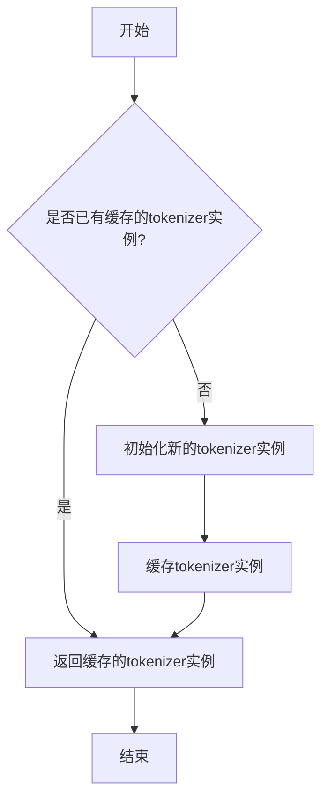
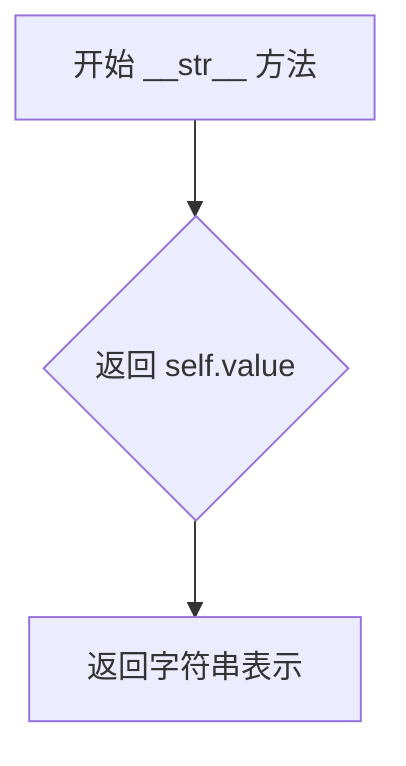
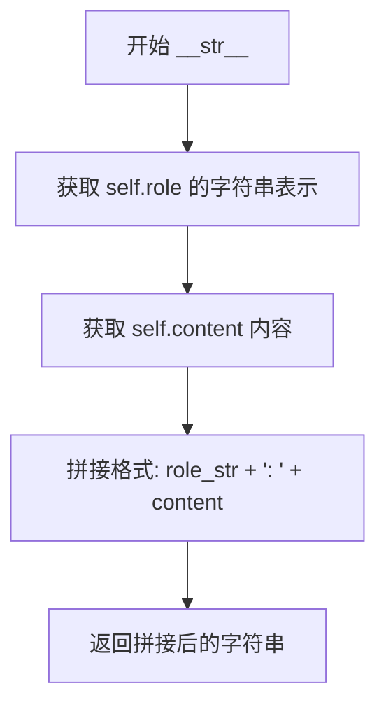
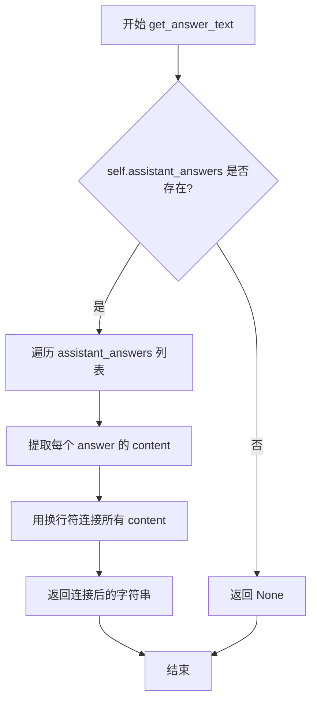
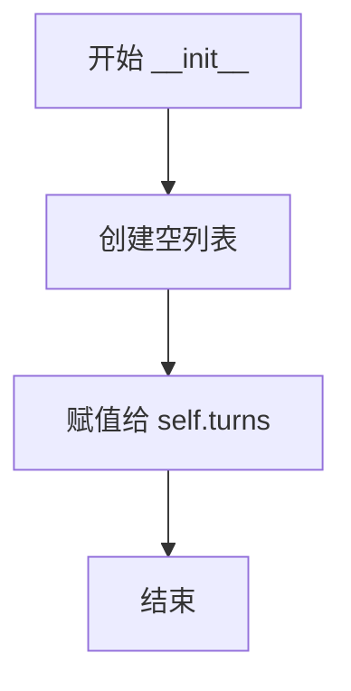
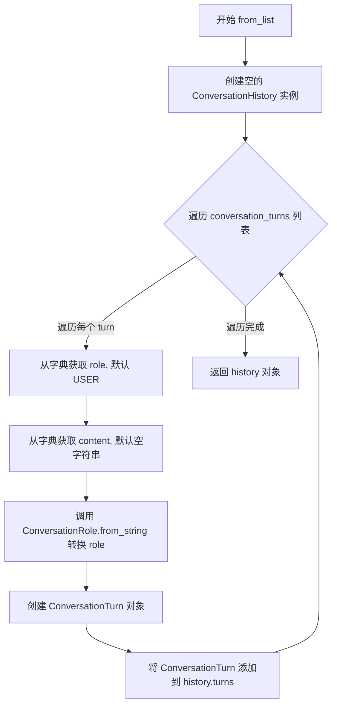
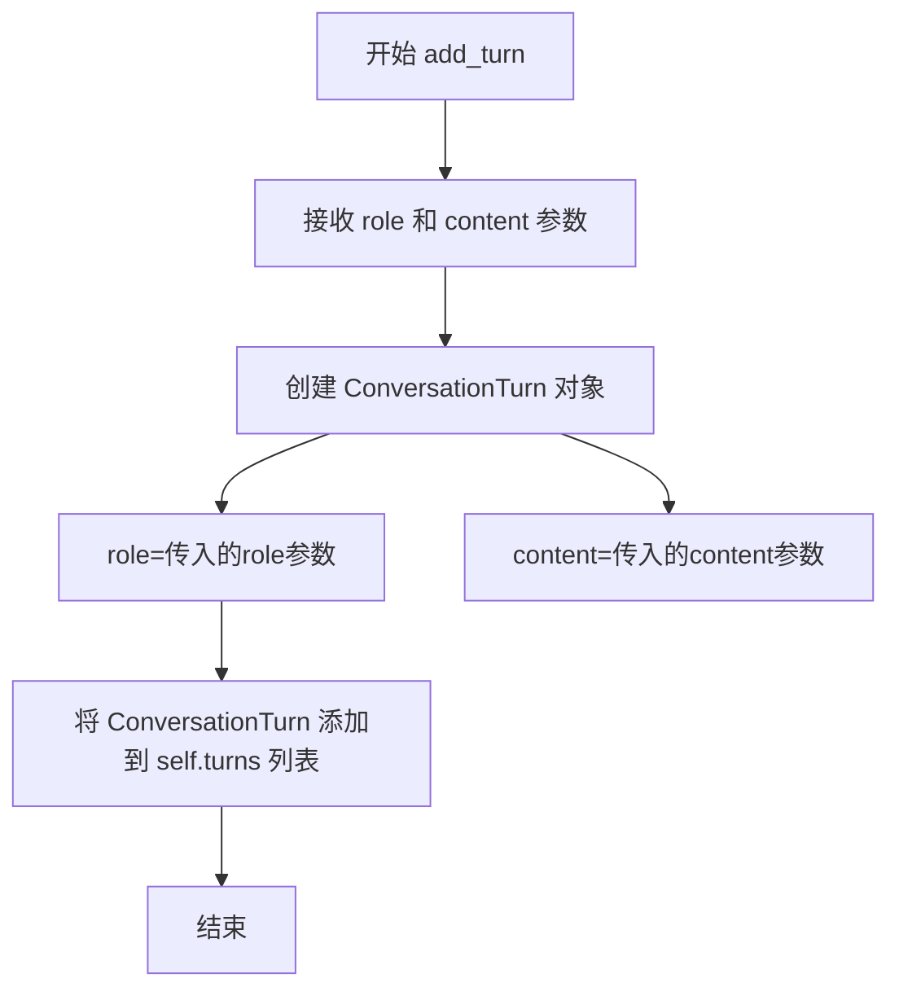

# `graphrag\packages\graphrag\graphrag\query\context_builder\conversation_history.py` 详细设计文档

用于存储和管理对话历史的数据结构模块，提供了对话角色枚举、单轮对话数据类、QA轮次数据类以及对话历史管理类，支持将对话历史转换为上下文数据用于系统提示词，包含基于token限制的上下文截断功能。

## 整体流程

```mermaid
graph TD
A[开始] --> B[创建ConversationHistory实例]
B --> C[通过from_list或add_turn添加对话轮次]
C --> D{需要构建上下文?}
D -- 否 --> E[其他操作: to_qa_turns/get_user_turns]
D -- 是 --> F[调用build_context方法]
F --> G[转换为QA轮次列表]
G --> H[根据include_user_turns_only过滤]
H --> I[根据recency_bias反转顺序]
I --> J[根据max_qa_turns截断]
J --> K{累计token是否超过max_context_tokens?}
K -- 是 --> L[返回当前已构建的上下文]
K -- 否 --> M[继续添加下一轮]
M --> K
L --> N[返回(context_text, {context_name: DataFrame})]
```

## 类结构

```
ConversationRole (Enum)
├── SYSTEM
├── USER
└── ASSISTANT
ConversationTurn (dataclass)
├── role: ConversationRole
└── content: str
QATurn (dataclass)
├── user_query: ConversationTurn
└── assistant_answers: list[ConversationTurn] | None
ConversationHistory (class)
└── turns: list[ConversationTurn]
```

## 全局变量及字段


### `ConversationRole`
    
枚举类，用于表示对话中的角色类型（系统、用户、助手）

类型：`Enum`
    


### `ConversationTurn`
    
数据类，用于存储单个对话轮次的信息，包含角色和内容

类型：`Dataclass`
    


### `QATurn`
    
数据类，用于表示问答对话中的问答轮次，包含用户问题和助手回答

类型：`Dataclass`
    


### `ConversationHistory`
    
类，用于存储和管理对话历史记录

类型：`Class`
    


### `ConversationRole.ConversationRole.SYSTEM`
    
系统角色常量

类型：`str`
    


### `ConversationRole.ConversationRole.USER`
    
用户角色常量

类型：`str`
    


### `ConversationRole.ConversationRole.ASSISTANT`
    
助手角色常量

类型：`str`
    


### `ConversationTurn.ConversationTurn.role`
    
对话角色

类型：`ConversationRole`
    


### `ConversationTurn.ConversationTurn.content`
    
对话内容

类型：`str`
    


### `QATurn.QATurn.user_query`
    
用户问题

类型：`ConversationTurn`
    


### `QATurn.QATurn.assistant_answers`
    
助手回答列表

类型：`list[ConversationTurn] | None`
    


### `ConversationHistory.ConversationHistory.turns`
    
对话轮次列表

类型：`list[ConversationTurn]`
    
    

## 全局函数及方法


### `get_tokenizer`

获取全局 tokenizer 实例，用于文本分词处理。

参数：

- 无参数

返回值：`Tokenizer`，返回全局的 tokenizer 实例，用于对文本进行 token 计数和分词处理。

#### 流程图



#### 带注释源码

```python
# 注：此函数的实现不在当前代码文件中
# 该函数通过以下导入语句引入：
from graphrag.tokenizer.get_tokenizer import get_tokenizer

# 在代码中的使用方式（在 ConversationHistory.build_context 方法中）：
tokenizer = tokenizer or get_tokenizer()
# 上述代码表明：
# 1. get_tokenizer() 是一个无参数的全局函数
# 2. 返回一个 Tokenizer 对象
# 3. 该 Tokenizer 对象具有 num_tokens() 方法，用于计算文本的 token 数量
```

---

**说明**：提供的代码片段中仅包含 `get_tokenizer` 函数的导入语句和使用方式，其实际实现位于 `graphrag/tokenizer/get_tokenizer.py` 文件中。根据代码中的使用模式，该函数是一个无参数的全局函数，返回 `Tokenizer` 实例用于文本分词和 token 计数。


### `ConversationRole.from_string`

将字符串转换为 `ConversationRole` 枚举值。如果字符串不匹配任何已知的角色名称，则抛出 `ValueError` 异常。

参数：

- `value`：`str`，要转换的字符串值，期望的值为 "system"、"user" 或 "assistant"

返回值：`ConversationRole`，转换后的枚举值

#### 流程图

```mermaid
flowchart TD
    A[开始: 传入字符串 value] --> B{value == 'system'?}
    B -->|是| C[返回 ConversationRole.SYSTEM]
    B -->|否| D{value == 'user'?}
    D -->|是| E[返回 ConversationRole.USER]
    D -->|否| F{value == 'assistant'?}
    F -->|是| G[返回 ConversationRole.ASSISTANT]
    F -->|否| H[构造错误信息: Invalid Role: {value}]
    H --> I[抛出 ValueError 异常]
    
    C --> J[结束]
    E --> J
    G --> J
    I --> J
```

#### 带注释源码

```python
@staticmethod
def from_string(value: str) -> "ConversationRole":
    """Convert string to ConversationRole."""
    # 检查值是否为 "system"，如果是则返回 SYSTEM 角色
    if value == "system":
        return ConversationRole.SYSTEM
    # 检查值是否为 "user"，如果是则返回 USER 角色
    if value == "user":
        return ConversationRole.USER
    # 检查值是否为 "assistant"，如果是则返回 ASSISTANT 角色
    if value == "assistant":
        return ConversationRole.ASSISTANT

    # 如果值不匹配任何已知角色，构造错误消息并抛出异常
    msg = f"Invalid Role: {value}"
    raise ValueError(msg)
```


### `ConversationRole.__str__`

返回枚举值的字符串表示。

参数：

-  无

返回值：`str`，返回枚举成员的字符串值（如 "system"、"user" 或 "assistant"）。

#### 流程图



#### 带注释源码

```python
def __str__(self) -> str:
    """Return string representation of the enum value."""
    # self.value 是 Enum 的内置属性，存储枚举成员的实际值（字符串）
    # 对于 ConversationRole 枚举：
    #   - SYSTEM.value = "system"
    #   - USER.value = "user"
    #   - ASSISTANT.value = "assistant"
    return self.value
```


### `ConversationTurn.__str__`

该方法为 `ConversationTurn` 数据类的字符串表示方法，用于将对话轮次转换为人类可读的字符串格式，格式为“角色: 内容”。

参数： 无（仅包含隐式参数 `self`）

返回值：`str`，返回对话轮次的字符串表示，格式为 `{role}: {content}`（例如："user: 你好" 或 "assistant: 回答内容"）

#### 流程图



#### 带注释源码

```python
def __str__(self) -> str:
    """Return string representation of the conversation turn."""
    # self.role 会调用 ConversationRole.__str__() 方法，返回枚举值（如 "user", "assistant", "system"）
    # self.content 是对话的实际内容
    # 最终格式为 "role: content"，例如 "user: 你好"
    return f"{self.role}: {self.content}"
```


### `QATurn.get_answer_text`

获取助手回答的文本内容。如果存在助手回答，则将所有回答的文本内容用换行符连接后返回；如果不存在助手回答，则返回 `None`。

参数：

-  `self`：隐式参数，`QATurn` 类的实例方法，无需显式传递

返回值：`str | None`，返回所有助手回答的文本内容（用换行符连接），如果没有助手回答则返回 `None`

#### 流程图



#### 带注释源码

```python
def get_answer_text(self) -> str | None:
    """Get the text of the assistant answers."""
    # 如果 assistant_answers 存在且不为空
    return (
        # 使用换行符连接所有助手回答的 content 内容
        "\n".join([answer.content for answer in self.assistant_answers])
        # 如果 assistant_answers 为 None 或空列表，则返回 None
        if self.assistant_answers
        else None
    )
```


### `QATurn.__str__`

返回QA轮次的字符串表示，如果存在回答则包含问题和回答内容，否则只返回问题内容。

参数：
- （无参数，除了隐式的 `self`）

返回值：`str`，QA轮次的字符串表示

#### 流程图

```mermaid
flowchart TD
    A[开始 __str__] --> B[调用 get_answer_text 获取回答文本]
    B --> C{answers 是否存在?}
    C -->|是| D[返回格式化字符串: Question: {问题内容}\nAnswer: {回答内容}]
    C -->|否| E[返回格式化字符串: Question: {问题内容}]
    D --> F[结束]
    E --> F
```

#### 带注释源码

```python
def __str__(self) -> str:
    """Return string representation of the QA turn."""
    # 调用 get_answer_text() 方法获取助手的回答文本
    # 如果 assistant_answers 存在则返回所有回答内容用换行符连接的结果，否则返回 None
    answers = self.get_answer_text()
    
    # 判断是否存在回答内容
    return (
        # 如果有回答，返回包含问题和回答的格式化字符串
        f"Question: {self.user_query.content}\nAnswer: {answers}"
        if answers
        # 如果没有回答，只返回问题内容
        else f"Question: {self.user_query.content}"
    )
```


### `ConversationHistory.__init__`

初始化 `ConversationHistory` 类的实例，创建一个空的对话历史记录列表。

参数：
- 无

返回值：`None`，无返回值（构造函数）

#### 流程图



#### 带注释源码

```python
def __init__(self):
    """初始化 ConversationHistory 实例。
    
    创建一个空的对话历史记录列表，用于存储对话轮次。
    """
    self.turns = []  # 初始化空列表，用于存储 ConversationTurn 对象
```


### `ConversationHistory.from_list`

这是一个类方法，用于将字典列表转换为 `ConversationHistory` 对象。该方法接收一个包含对话轮次的字典列表，每个字典应包含 `role`（角色）和 `content`（内容）字段，然后遍历列表创建相应的 `ConversationTurn` 对象并添加到历史记录中。

参数：

- `conversation_turns`：`list[dict[str, str]]`，表示对话轮次的字典列表，每个字典包含 `"role"`（角色）和 `"content"`（内容）字段

返回值：`ConversationHistory`，返回创建的对话历史对象

#### 流程图



#### 带注释源码

```python
@classmethod
def from_list(
    cls, conversation_turns: list[dict[str, str]]
) -> "ConversationHistory":
    """
    Create a conversation history from a list of conversation turns.

    Each turn is a dictionary in the form of {"role": "<conversation_role>", "content": "<turn_content>"}
    """
    # 1. 使用类方法创建空的 ConversationHistory 实例
    history = cls()
    
    # 2. 遍历输入的对话轮次字典列表
    for turn in conversation_turns:
        # 3. 从字典获取 role，默认为 USER 角色（使用 get 方法提供默认值保护）
        role_str = turn.get("role", ConversationRole.USER)
        
        # 4. 从字典获取 content，默认为空字符串
        content = turn.get("content", "")
        
        # 5. 将角色字符串转换为 ConversationRole 枚举类型
        role = ConversationRole.from_string(role_str)
        
        # 6. 创建 ConversationTurn 数据类实例
        conversation_turn = ConversationTurn(
            role=role,
            content=content,
        )
        
        # 7. 将创建的对话轮次添加到历史记录的 turns 列表中
        history.turns.append(conversation_turn)
    
    # 8. 返回填充好的 ConversationHistory 对象
    return history
```


### `ConversationHistory.add_turn`

添加新的对话轮次到对话历史记录中。该方法接收一个对话角色和内容，创建一个 `ConversationTurn` 对象，并将其追加到内部维护的对话轮次列表中。

参数：

- `role`：`ConversationRole`，对话角色，指定该轮次的发送者身份（system/user/assistant）
- `content`：`str`，对话内容，指定该轮次的具体文本内容

返回值：`None`，无返回值，仅修改对象内部状态

#### 流程图



#### 带注释源码

```python
def add_turn(self, role: ConversationRole, content: str):
    """Add a new turn to the conversation history."""
    # 创建一个新的 ConversationTurn 数据类实例
    # role 参数指定该轮次的角色（system/user/assistant）
    # content 参数指定该轮次的对话内容
    self.turns.append(ConversationTurn(role=role, content=content))
    # 将新创建的 ConversationTurn 对象追加到 turns 列表的末尾
    # 该操作会修改 ConversationHistory 对象的内部状态
```


### `ConversationHistory.to_qa_turns`

将对话历史记录转换为 QA 轮次列表。该方法遍历 `ConversationHistory` 中的所有对话轮次，将连续的“用户问题 + 助手回答”序列组合成 `QATurn` 对象，最终返回 `list[QATurn]`。

参数：无（仅包含 `self` 隐式参数）

返回值：`list[QATurn]`，返回转换后的 QA 轮次列表，每个 `QATurn` 包含一个用户问题（user_query）和对应的助手回答列表（assistant_answers）

#### 流程图

```mermaid
flowchart TD
    A[开始 to_qa_turns] --> B[初始化 qa_turns = list[QATurn]()]
    B --> C[初始化 current_qa_turn = None]
    C --> D{遍历 self.turns}
    D -->|当前角色为 USER| E[检查 current_qa_turn 是否存在]
    E -->|是| F[将 current_qa_turn 添加到 qa_turns]
    E -->|否| G[跳过]
    F --> H[创建新 QATurn: user_query=当前turn, assistant_answers=[]]
    G --> H
    H --> I[继续遍历下一个 turn]
    D -->|当前角色为 ASSISTANT| J{current_qa_turn 是否存在}
    J -->|是| K[将当前 turn 添加到 assistant_answers]
    J -->|否| I
    K --> I
    D -->|遍历完成| L{current_qa_turn 是否存在}
    L -->|是| M[将 current_qa_turn 添加到 qa_turns]
    L -->|否| N[跳过]
    M --> O[返回 qa_turns]
    N --> O
```

#### 带注释源码

```python
def to_qa_turns(self) -> list[QATurn]:
    """将对话历史转换为 QA 轮次列表。"""
    
    # 1. 初始化 QA 轮次列表
    qa_turns = list[QATurn]()
    
    # 2. 初始化当前正在构建的 QA 轮次（初始为 None）
    current_qa_turn = None
    
    # 3. 遍历对话历史中的每个轮次
    for turn in self.turns:
        # 4. 判断当前轮次的角色
        if turn.role == ConversationRole.USER:
            # 5. 如果遇到用户问题，先保存之前的 QA 轮次（如果存在）
            if current_qa_turn:
                qa_turns.append(current_qa_turn)
            
            # 6. 创建新的 QA 轮次，用户问题作为 user_query
            current_qa_turn = QATurn(user_query=turn, assistant_answers=[])
        else:
            # 7. 如果是助手回答，且当前有正在构建的 QA 轮次
            if current_qa_turn:
                # 8. 将助手回答添加到 assistant_answers 列表中
                current_qa_turn.assistant_answers.append(turn)  # type: ignore
    
    # 9. 遍历完成后，检查是否还有未保存的 QA 轮次
    if current_qa_turn:
        qa_turns.append(current_qa_turn)
    
    # 10. 返回转换后的 QA 轮次列表
    return qa_turns
```


### `ConversationHistory.get_user_turns`

获取最近的用户轮次内容，返回一个包含用户消息内容的字符串列表。该方法从对话历史的末尾开始反向遍历，收集指定数量的用户轮次，直到达到 `max_user_turns` 指定的数量为止。

参数：

- `max_user_turns`：`int | None`，可选参数，默认为 1，表示要获取的最大用户轮次数。如果为 None，则返回所有用户轮次。

返回值：`list[str]`，返回用户轮次的内容列表，列表中的元素按照从最近到最远的顺序排列（即列表第一个元素是最近的用户消息）。

#### 流程图

```mermaid
flowchart TD
    A[开始 get_user_turns] --> B[初始化空列表 user_turns]
    B --> C{遍历 self.turns[::-1]}
    C --> D{当前 turn.role == USER?}
    D -->|是| E[将 turn.content 添加到 user_turns]
    E --> F{max_user_turns 存在且 len >= max?}
    F -->|是| G[返回 user_turns]
    F -->|否| C
    D -->|否| C
    C --> H{遍历完成}
    H --> I[返回 user_turns]
    G --> I
```

#### 带注释源码

```python
def get_user_turns(self, max_user_turns: int | None = 1) -> list[str]:
    """Get the last user turns in the conversation history."""
    # 初始化一个空列表用于存储用户轮次内容
    user_turns = []
    
    # 反向遍历对话历史（从最近到最远）
    for turn in self.turns[::-1]:
        # 检查当前轮次是否是用户角色
        if turn.role == ConversationRole.USER:
            # 将用户消息内容添加到列表中
            user_turns.append(turn.content)
            
            # 如果设置了最大轮次数且已达到该数量，则停止遍历
            if max_user_turns and len(user_turns) >= max_user_turns:
                break
    
    # 返回收集到的用户轮次内容列表
    return user_turns
```


### `ConversationHistory.build_context`

构建用于系统提示词的上下文数据，将对话历史转换为适合放入 prompt 的格式，返回格式化的文本字符串和对应的 DataFrame 字典。

参数：

- `self`：`ConversationHistory`，ConversationHistory 实例本身
- `tokenizer`：`Tokenizer | None`，用于计算 token 数量的分词器，默认使用 `get_tokenizer()` 获取
- `include_user_turns_only`：`bool`，是否仅包含用户提问而不包含助手回答，默认 True
- `max_qa_turns`：`int | None`，最多包含的 QA 对话轮次数量，默认 5
- `max_context_tokens`：`int`，上下文最大 token 数量，超过此限制时停止添加更多对话，默认 8000
- `recency_bias`：`bool`，是否启用近期偏好（将对话顺序反转，使最近的对话排在前面），默认 True
- `column_delimiter`：`str`，CSV 格式的分隔符，默认 "|"
- `context_name`：`str`，上下文数据的名称，默认 "Conversation History"

返回值：`tuple[str, dict[str, pd.DataFrame]]`，返回元组包含格式化的上下文文本字符串，以及以 context_name（小写）为键、DataFrame 为值的字典

#### 流程图

```mermaid
flowchart TD
    A[开始 build_context] --> B{ tokenizer 是否存在?}
    B -->|否| C[调用 get_tokenizer 获取默认分词器]
    B -->|是| D[使用传入的 tokenizer]
    C --> E[调用 to_qa_turns 转换为 QA 对话列表]
    D --> E
    E --> F{ include_user_turns_only 为 True?}
    F -->|是| G[过滤掉 assistant_answers 只保留用户提问]
    F -->|否| H[保留完整 QA 对话]
    G --> I
    H --> I
    I{ recency_bias 为 True?}
    I -->|是| J[反转 qa_turns 列表]
    I -->|否| K
    J --> K
    K{ max_qa_turns 是否有限制?}
    K -->|是| L[截取前 max_qa_turns 个对话]
    K -->|否| M
    L --> M
    M{qa_turns 是否为空?}
    M -->|是| N[返回空字符串和空 DataFrame]
    M -->|否| O[初始化表头: -----context_name-----]
    O --> P[初始化空列表和空 DataFrame]
    P --> Q{遍历 qa_turns]
    Q --> R[添加用户角色和内容到列表]
    R --> S{当前 QA 是否有助手回答?}
    S -->|是| T[添加助手角色和回答内容到列表]
    S -->|否| U
    T --> U
    U --> V[将列表转换为 DataFrame]
    V --> W[生成 CSV 文本: header + DataFrame.to_csv]
    W --> X{tokenizer.num_tokens(context_text) > max_context_tokens?]
    X -->|是| Y[跳出循环，保留当前 DataFrame]
    X -->|否| Z[更新 current_context_df]
    Z --> AA{是否还有更多 QA turn?}
    AA -->|是| Q
    AA -->|否| AB[生成最终 context_text]
    AB --> AC[返回 context_text 和 dict[context_name.lower(): current_context_df]]
    Y --> AC
```

#### 带注释源码

```python
def build_context(
    self,
    tokenizer: Tokenizer | None = None,
    include_user_turns_only: bool = True,
    max_qa_turns: int | None = 5,
    max_context_tokens: int = 8000,
    recency_bias: bool = True,
    column_delimiter: str = "|",
    context_name: str = "Conversation History",
) -> tuple[str, dict[str, pd.DataFrame]]:
    """
    Prepare conversation history as context data for system prompt.

    Parameters
    ----------
        user_queries_only: If True, only user queries (not assistant responses) will be included in the context, default is True.
        max_qa_turns: Maximum number of QA turns to include in the context, default is 1.
        recency_bias: If True, reverse the order of the conversation history to ensure last QA got prioritized.
        column_delimiter: Delimiter to use for separating columns in the context data, default is "|".
        context_name: Name of the context, default is "Conversation History".

    """
    # 如果未提供 tokenizer，则获取默认分词器
    tokenizer = tokenizer or get_tokenizer()
    
    # 将对话历史转换为 QA 对话轮次列表
    qa_turns = self.to_qa_turns()
    
    # 如果只包含用户提问，则过滤掉助手回答
    if include_user_turns_only:
        qa_turns = [
            QATurn(user_query=qa_turn.user_query, assistant_answers=None)
            for qa_turn in qa_turns
        ]
    
    # 如果启用近期偏好，反转列表使最近的对话在前
    if recency_bias:
        qa_turns = qa_turns[::-1]
    
    # 如果设置了最大 QA 轮次限制，则截取前面的对话
    if max_qa_turns and len(qa_turns) > max_qa_turns:
        qa_turns = qa_turns[:max_qa_turns]

    # 检查是否有 QA 对话，没有则返回空
    if len(qa_turns) == 0 or not qa_turns:
        return ("", {context_name: pd.DataFrame()})

    # 添加表头
    header = f"-----{context_name}-----" + "\n"

    # 初始化数据结构
    turn_list = []
    current_context_df = pd.DataFrame()
    
    # 遍历每个 QA 对话轮次
    for turn in qa_turns:
        # 添加用户提问到列表
        turn_list.append({
            "turn": ConversationRole.USER.__str__(),
            "content": turn.user_query.content,
        })
        
        # 如果有助手回答，也添加到列表
        if turn.assistant_answers:
            turn_list.append({
                "turn": ConversationRole.ASSISTANT.__str__(),
                "content": turn.get_answer_text(),
            })

        # 将当前对话列表转换为 DataFrame
        context_df = pd.DataFrame(turn_list)
        
        # 生成带表头的 CSV 文本
        context_text = header + context_df.to_csv(sep=column_delimiter, index=False)
        
        # 检查 token 数量是否超过限制，超过则停止添加更多对话
        if tokenizer.num_tokens(context_text) > max_context_tokens:
            break

        # 更新当前有效的 DataFrame
        current_context_df = context_df
    
    # 生成最终上下文文本
    context_text = header + current_context_df.to_csv(
        sep=column_delimiter, index=False
    )
    
    # 返回格式化文本和 DataFrame 字典
    return (context_text, {context_name.lower(): current_context_df})
```

## 关键组件


### ConversationRole 枚举

定义对话中的角色类型，包括 system、user、assistant 三种角色，并提供字符串到枚举值的转换方法。

### ConversationTurn 数据类

存储单个对话轮次的数据结构，包含 role（角色）和 content（内容）字段，用于表示一句话或一轮对话。

### QATurn 数据类

存储问答对的数据结构，包含 user_query（用户问题）和 assistant_answers（助手回答列表），支持获取回答文本和字符串表示。

### ConversationHistory 类

核心管理类，负责存储和管理整个对话历史，提供从列表创建历史、添加对话轮次、转换为QA对、获取用户轮次和构建上下文等功能。

### build_context 方法

将对话历史构建为系统提示词上下文的核心方法，支持token数限制、用户轮次过滤、QA轮数限制、近期偏好和CSV格式输出。

### to_qa_turns 方法

将线性对话历史转换为问答对列表的转换方法，将用户问题与后续助手回答配对组成QATurn对象。

### Tokenizer 集成

使用 get_tokenizer() 获取tokenizer实例，用于计算上下文文本的token数量以实现自动截断。


## 问题及建议


### 已知问题

- **参数文档不一致**：`build_context` 方法的参数列表中有 `include_user_turns_only`，但文档字符串中描述的是 `user_queries_only`，导致文档与实际实现不匹配。
- **from_list 默认值错误**：`from_list` 方法中使用 `turn.get("role", ConversationRole.USER)` 作为默认值，但 `turn` 字典中的值是字符串类型，而 `ConversationRole.USER` 是枚举类型，逻辑错误，应使用 `turn.get("role", "user")`。
- **类型注解不精确**：`QATurn.assistant_answers` 字段类型为 `list[ConversationTurn] | None`，但在 `to_qa_turns` 方法中初始化为空列表 `[]`，类型注解应为 `list[ConversationTurn]` 以保持一致性。
- **Token 计数边界问题**：`build_context` 方法中的 token 限制逻辑在添加新 turn 后才检查是否超限，导致最终返回的上下文可能略微超过 `max_context_tokens` 限制。
- **上下文键名不一致**：`build_context` 返回的字典键使用 `context_name.lower()` 转换小写，但开发者可能期望使用原始命名，导致调用方需要处理不一致的键名。

### 优化建议

- **修复文档错误**：将文档字符串中的 `user_queries_only` 修正为 `include_user_turns_only`，或统一参数名称。
- **修正默认值逻辑**：将 `turn.get("role", ConversationRole.USER)` 修改为 `turn.get("role", "user")`，确保类型一致。
- **优化类型定义**：考虑将 `assistant_answers` 的默认值从 `None` 改为空列表 `[]`，或在 `to_qa_turns` 方法中显式处理 None 类型以提高类型安全性。
- **改进 token 限制逻辑**：在添加每个 turn 之前检查 token 数量，确保返回的上下文严格不超过 `max_context_tokens` 限制。
- **统一键名约定**：在方法文档中明确说明返回字典的键名格式，或提供参数控制是否转换大小写。

## 其它


### 设计目标与约束

本模块的设计目标是提供一种结构化的方式来存储、管理和转换对话历史，使其能够方便地用于增强AI系统的上下文理解能力。核心约束包括：1) 仅支持三种预定义的对话角色（system、user、assistant）；2) 上下文构建时默认使用token数量作为截断依据，默认上限为8000个token；3) 需要外部提供tokenizer来进行token计数；4) 依赖pandas库进行上下文数据的表格化处理。

### 错误处理与异常设计

**ValueError异常**：当`ConversationRole.from_string()`接收到无效的角色字符串时抛出，错误信息格式为"Invalid Role: {value}"。**空数据处理**：在`build_context()`方法中，当没有QA turns时返回空字符串和空DataFrame。**类型假设**：代码中存在类型假设，如`current_qa_turn.assistant_answers.append(turn)`使用`# type: ignore`注释绕过类型检查，这表明`assistant_answers`可能为None时的处理逻辑不够严谨。**Tokenization失败**：假设传入的tokenizer具有`num_tokens()`方法，若不存在可能导致运行时错误。

### 数据流与状态机

对话历史的生命周期如下：1) 初始化空列表`turns`；2) 通过`add_turn()`或`from_list()`添加对话回合；3) 可选择通过`to_qa_turns()`转换为QA格式；4) 最终通过`build_context()`生成可嵌入prompt的上下文字符串和DataFrame。状态转换路径包括：单个ConversationTurn → QATurn（配对user和assistant） → 表格化上下文数据（CSV格式）。`get_user_turns()`方法从历史末尾向前遍历，实现最近N条用户消息的提取。

### 外部依赖与接口契约

**直接依赖**：1) `dataclasses`（标准库）：用于定义数据类；2) `enum.Enum`：用于定义枚举类型；3) `pandas as pd`：用于DataFrame操作和CSV转换；4) `graphrag_llm.tokenizer.Tokenizer`：抽象 tokenizer 接口；5) `graphrag.tokenizer.get_tokenizer`：获取默认tokenizer的工厂函数。**接口契约**：Tokenizer对象必须实现`num_tokens(text: str) -> int`方法；`get_tokenizer()`返回的对象需兼容Tokenizerguang告接口。

### 性能考虑与优化空间

1) **重复tokenization**：`build_context()`方法在循环中对每个QA turn累积进行token计数，当上下文较长时效率较低，可考虑预先计算或增量计算；2) **列表反转开销**：`qa_turns[::-1]`创建新列表，当QA turn数量很大时有一定开销；3) **字符串拼接**：使用`"\n".join()`拼接answers内容，这是相对高效的方式；4) **DataFrame频繁创建**：循环内多次创建DataFrame，可考虑优化为单次构建；5) **默认token上限**：8000作为默认值可能不适合所有场景，应考虑从配置或环境变量读取。

### 安全性考虑

1) **输入验证**：`from_list()`方法对role字段有默认值处理（默认为USER），但content字段直接使用而未做长度或内容校验；2) **数据泄露风险**：对话历史可能包含敏感信息，`build_context()`生成的文本会直接嵌入prompt，需确保下游调用链的安全处理；3) **角色伪装**：虽然`ConversationRole`为枚举类型，但`from_string()`方法存在被滥用的可能性，应考虑添加角色白名单验证机制。

### 配置参数说明

`build_context()`方法的核心配置参数：- `tokenizer`: 可选的tokenizer实例，默认调用`get_tokenizer()`获取；- `include_user_turns_only`: 布尔值，控制是否仅包含用户问题（不含助手回答），默认True；- `max_qa_turns`: 最大包含的QA回合数，默认5；- `max_context_tokens`: 上下文最大token数，默认8000；- `recency_bias`: 布尔值，控制是否优先包含最近对话，默认True；- `column_delimiter`: CSV分隔符，默认"|"；- `context_name`: 上下文名称标题，默认"Conversation History"。

### 使用示例与最佳实践

```python
# 创建对话历史并添加回合
history = ConversationHistory()
history.add_turn(ConversationRole.USER, "什么是量子计算？")
history.add_turn(ConversationRole.ASSISTANT, "量子计算是一种利用量子力学原理进行信息处理的计算方式。")

# 从字典列表创建
history2 = ConversationHistory.from_list([
    {"role": "user", "content": "你好"},
    {"role": "assistant", "content": "你好，有什么可以帮助你的？"}
])

# 构建上下文用于prompt
context_text, context_df = history.build_context(
    max_qa_turns=3,
    max_context_tokens=4000,
    recency_bias=True
)
```

**最佳实践**：1) 在多轮对话场景中定期调用`build_context()`而非每次请求都重建；2) 根据实际模型上下文窗口调整`max_context_tokens`参数；3) 对于敏感对话，考虑在构建上下文前进行内容过滤。

### 兼容性考虑

1) **Python版本**：代码使用了Python 3.10+的类型注解语法（如`list[ConversationTurn]`），需确保Python 3.10+环境；2) **pandas版本**：依赖pandas的`to_csv()`方法，需pandas 1.0+；3) **枚举继承**：同时继承`str`和`Enum`是为了方便字符串比较，但这可能导致某些枚举操作行为与标准Enum不同；4) **未来扩展**：若需支持更多角色，需要修改`ConversationRole`枚举和`from_string()`方法。

### 测试策略建议

1) **单元测试**：针对`ConversationRole.from_string()`测试所有有效和无效输入；2) `ConversationTurn`和`QATurn`的字符串表示测试；3) `ConversationHistory`的各种方法测试，包括边界条件（空列表、单条记录等）；4) **集成测试**：与实际tokenizer集成测试`build_context()`的token截断逻辑；5) **模糊测试**：测试超长content、超多turns等极端情况下的行为。

### 版本历史与变更记录

当前版本为初始版本（MIT License），由Microsoft Corporation于2024年发布。作为graphrag项目的一部分，后续可能跟随主项目进行版本迭代和API变更。


    