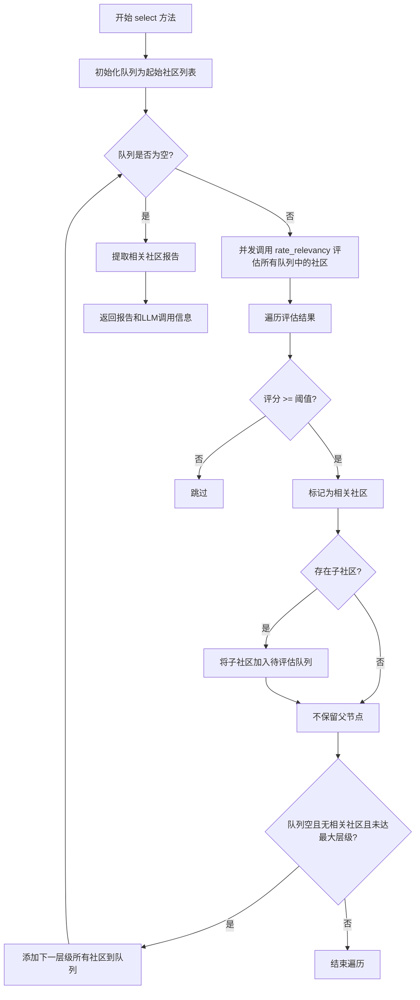
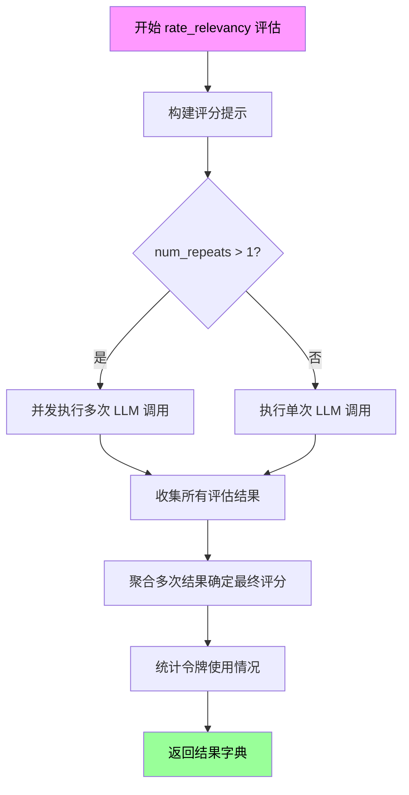
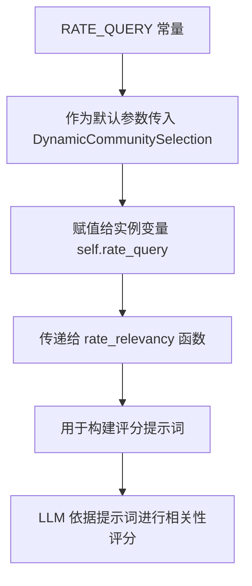

# `graphrag\packages\graphrag\graphrag\query\context_builder\dynamic_community_selection.py` 详细设计文档

一个动态社区选择算法，通过异步调用LLM对社区报告进行相关性评分，从根社区开始逐层遍历，选择评分达到阈值的所有相关社区报告，用于构建查询上下文。

## 整体流程



## 类结构

```
DynamicCommunitySelection (动态社区选择器)
  ├── 依赖类型: CommunityReport
  ├── 依赖类型: Community
  ├── 依赖类型: Tokenizer
  └── 依赖类型: LLMCompletion
```

## 全局变量及字段


### `logger`
    
模块级日志记录器

类型：`logging.Logger`
    


### `DynamicCommunitySelection.model`
    
LLM模型实例，用于评估社区相关性

类型：`LLMCompletion`
    


### `DynamicCommunitySelection.tokenizer`
    
分词器，用于处理文本

类型：`Tokenizer`
    


### `DynamicCommunitySelection.rate_query`
    
评估相关性的Prompt模板

类型：`str`
    


### `DynamicCommunitySelection.num_repeats`
    
重复评估次数，用于减少LLM调用的方差

类型：`int`
    


### `DynamicCommunitySelection.use_summary`
    
是否使用摘要而非完整内容进行评估

类型：`bool`
    


### `DynamicCommunitySelection.threshold`
    
相关性评分阈值

类型：`int`
    


### `DynamicCommunitySelection.keep_parent`
    
是否保留父节点

类型：`bool`
    


### `DynamicCommunitySelection.max_level`
    
最大遍历层级

类型：`int`
    


### `DynamicCommunitySelection.semaphore`
    
并发控制信号量

类型：`asyncio.Semaphore`
    


### `DynamicCommunitySelection.model_params`
    
LLM模型参数

类型：`dict`
    


### `DynamicCommunitySelection.reports`
    
community_id到CommunityReport的映射

类型：`dict`
    


### `DynamicCommunitySelection.communities`
    
short_id到Community的映射

类型：`dict`
    


### `DynamicCommunitySelection.levels`
    
层级到社区ID列表的映射

类型：`dict`
    


### `DynamicCommunitySelection.starting_communities`
    
起始社区列表（level 0）

类型：`list`
    
    

## 全局函数及方法


### rate_relevancy

该函数是一个异步评估函数，用于通过大型语言模型（LLM）动态评估给定查询与社区报告内容之间的相关性评分。它支持并发控制和重复评估以确保评分的一致性，并返回详细的评估结果和令牌使用统计信息。

参数：

- `query`：`str`，用户查询字符串
- `description`：`str`，社区报告的描述内容（摘要或完整内容）
- `model`：`LLMCompletion`，大型语言模型实例，用于生成评分
- `tokenizer`：`Tokenizer`，用于计算令牌数量的分词器
- `rate_query`：`str`，用于指导 LLM 进行相关性评分的提示模板
- `num_repeats`：`int`，重复评估次数，用于确保评分一致性
- `semaphore`：`asyncio.Semaphore`，异步信号量，用于控制并发数量
- `**model_params`：`dict[str, Any]`，传递给 LLM 的额外模型参数（如温度、最大令牌数等）

返回值：`dict[str, Any]`，包含以下键值的字典：
  - `rating`：`int`，相关性评分（整数）
  - `llm_calls`：`int`，LLM 调用的总次数
  - `prompt_tokens`：`int`，使用的提示令牌总数
  - `output_tokens`：`int`，生成的输出令牌总数

#### 流程图



#### 带注释源码

```python
# 由于 rate_relevancy 函数是从外部模块导入的，以下是基于代码调用方式的推断实现

async def rate_relevancy(
    query: str,                                    # 用户查询
    description: str,                              # 社区报告内容（摘要或完整）
    model: "LLMCompletion",                        # LLM模型实例
    tokenizer: Tokenizer,                         # 分词器
    rate_query: str = RATE_QUERY,                 # 评分提示模板
    num_repeats: int = 1,                         # 重复评估次数
    semaphore: asyncio.Semaphore = None,           # 并发控制信号量
    **model_params                                 # 额外模型参数
) -> dict[str, Any]:
    """
    异步评估查询与描述内容之间的相关性
    
    Args:
        query: 要评估的查询字符串
        description: 社区报告的描述内容
        model: LLMCompletion 实例
        tokenizer: Tokenizer 实例
        rate_query: 评分用的提示模板
        num_repeats: 重复评分次数，取众数作为最终结果
        semaphore: 并发控制信号量
        **model_params: 传递给模型的额外参数
    
    Returns:
        包含 rating, llm_calls, prompt_tokens, output_tokens 的字典
    """
    # 构建评分提示，将查询和描述填入提示模板
    # rate_query 通常包含占位符如 {query} 和 {description}
    # 提示 LLM 从1-10的范围内评分，或进行二分类（相关/不相关）
    
    async def _single_rating():
        """执行单次评分请求"""
        # 使用 semaphore 控制并发（如有提供）
        if semaphore:
            async with semaphore:
                return await _call_llm()
        return await _call_llm()
    
    async def _call_llm() -> dict:
        """调用 LLM 获取评分"""
        # 1. 构建完整的提示词
        prompt = rate_query.format(query=query, description=description)
        
        # 2. 计算输入令牌数
        input_tokens = len(tokenizer.encode(prompt))
        
        # 3. 调用 LLM 生成响应
        response = await model.complete(
            prompt=prompt,
            **model_params
        )
        
        # 4. 解析响应获取评分（通常需要从 LLM 输出中提取数字）
        #    例如：解析 "Rating: 8" 或 JSON 格式
        rating = _parse_rating(response)
        
        # 5. 计算输出令牌数
        output_tokens = len(tokenizer.encode(response))
        
        return {
            "rating": rating,
            "prompt_tokens": input_tokens,
            "output_tokens": output_tokens
        }
    
    # 执行一次或多次评分
    if num_repeats > 1:
        # 并发执行多次评估以确保一致性
        results = await asyncio.gather(*[_single_rating() for _ in range(num_repeats)])
        
        # 从所有结果中提取评分
        ratings = [r["rating"] for r in results]
        
        # 取众数作为最终评分（如有多个相同评分的，取最多的）
        # 或者取平均值/中位数
        final_rating = Counter(ratings).most_common(1)[0][0]
        
        # 汇总令牌使用情况
        total_prompt_tokens = sum(r["prompt_tokens"] for r in results)
        total_output_tokens = sum(r["output_tokens"] for r in results)
    else:
        # 单次评估
        result = await _single_rating()
        final_rating = result["rating"]
        total_prompt_tokens = result["prompt_tokens"]
        total_output_tokens = result["output_tokens"]
    
    # 返回结构化结果
    return {
        "rating": final_rating,
        "llm_calls": num_repeats,
        "prompt_tokens": total_prompt_tokens,
        "output_tokens": total_output_tokens
    }
```


### RATE_QUERY

RATE_QUERY 是从 `graphrag.query.context_builder.rate_prompt` 模块导入的 Prompt 模板常量，用于对社区报告进行相关性评分。该常量是一个字符串格式的提示词模板，作为参数传递给 `rate_relevancy` 函数，以指导语言模型评估社区报告与查询的相关程度。

参数：无可用参数信息（该常量为字符串常量，非函数或方法）

返回值：`str`，返回提示词模板字符串

#### 流程图



#### 带注释源码

```python
# 从 rate_prompt 模块导入 RATE_QUERY 常量
# 该模块路径为 graphrag/query/context_builder/rate_prompt.py
from graphrag.query.context_builder.rate_prompt import RATE_QUERY

# 在 DynamicCommunitySelection 类中的使用方式：
class DynamicCommunitySelection:
    def __init__(
        self,
        # ... 其他参数 ...
        rate_query: str = RATE_QUERY,  # 使用 RATE_QUERY 作为默认提示词模板
        # ... 其他参数 ...
    ):
        # ...
        self.rate_query = rate_query  # 保存为实例变量
        
    async def select(self, query: str):
        # ...
        # 在调用 rate_relevancy 时使用
        rate_relevancy(
            query=query,
            description=...,
            model=self.model,
            tokenizer=self.tokenizer,
            rate_query=self.rate_query,  # 传递提示词模板
            # ...
        )
```

#### 备注

由于 RATE_QUERY 是从外部模块导入的常量，源码中未包含其具体定义。该常量的实际内容需要查看 `graphrag/query/context_builder/rate_prompt.py` 文件。根据代码上下文推测，RATE_QUERY 应是一个包含占位符的字符串模板，用于引导 LLM 对社区报告进行相关性评分，通常包含对查询和社区报告描述的引用占位符。


### `DynamicCommunitySelection.__init__`

初始化方法，构建社区报告和社区的索引映射，建立层级结构（从根节点 level 0 开始），并设置异步并发控制信号量，为后续的社区相关性选择提供数据结构支持。

参数：

- `community_reports`：`list[CommunityReport]`，社区报告列表，每个报告包含社区的摘要或完整内容
- `communities`：`list[Community]`，社区列表，包含社区的层级关系（父子节点）
- `model`：`LLMCompletion`，语言模型实例，用于评估社区与查询的相关性
- `tokenizer`：`Tokenizer`，分词器，用于对文本进行分词处理
- `rate_query`：`str`，评分查询模板，默认为 RATE_QUERY，用于构建提示词
- `use_summary`：`bool`，是否使用摘要而非完整内容进行相关性评估，默认为 False
- `threshold`：`int`，相关性阈值，大于等于该值的社区被视为相关，默认为 1
- `keep_parent`：`bool`，当子节点相关时是否保留父节点，默认为 False（会丢弃父节点）
- `num_repeats`：`int`，对每个社区进行相关性评估的重复次数（用于稳定性），默认为 1
- `max_level`：`int`，最大遍历层级深度，默认为 2
- `concurrent_coroutines`：`int`，异步调用的最大并发数，默认为 8
- `model_params`：`dict[str, Any] | None`，传递给语言模型的额外参数，默认为 None

返回值：`None`，无返回值（构造函数）

#### 流程图

```mermaid
flowchart TD
    A[开始 __init__] --> B[接收参数]
    B --> C[存储 model, tokenizer, rate_query, num_repeats]
    C --> D[存储 use_summary, threshold, keep_parent, max_level]
    D --> E[创建 asyncio.Semaphore 并发控制]
    E --> F[存储 model_params]
    F --> G[构建 reports 索引: {community_id: report}]
    G --> H[构建 communities 索引: {short_id: community}]
    H --> I[遍历 communities 构建 levels 字典]
    I --> J{community.level 是否在 levels 中?}
    J -->|否| K[创建新 level 列表]
    K --> L{community.short_id 在 reports 中?}
    J -->|是| L
    L -->|是| M[将该 community 添加到对应 level 列表]
    L -->|否| N[跳过不添加]
    M --> O[设置 starting_communities = levels['0']]
    N --> O
    O --> P[结束 __init__]
```

#### 带注释源码

```python
def __init__(
    self,
    community_reports: list[CommunityReport],
    communities: list[Community],
    model: "LLMCompletion",
    tokenizer: Tokenizer,
    rate_query: str = RATE_QUERY,
    use_summary: bool = False,
    threshold: int = 1,
    keep_parent: bool = False,
    num_repeats: int = 1,
    max_level: int = 2,
    concurrent_coroutines: int = 8,
    model_params: dict[str, Any] | None = None,
):
    # 存储语言模型和分词器实例，用于后续的相关性评估
    self.model = model
    self.tokenizer = tokenizer
    
    # 存储评分查询模板，默认为预定义的 RATE_QUERY
    self.rate_query = rate_query
    
    # 存储重复评估次数，用于提高评估结果的稳定性
    self.num_repeats = num_repeats
    
    # 存储是否使用摘要的标志
    self.use_summary = use_summary
    
    # 存储相关性阈值，只有评分 >= 该值的社区才被视为相关
    self.threshold = threshold
    
    # 存储是否保留父节点的标志
    self.keep_parent = keep_parent
    
    # 存储最大遍历层级深度
    self.max_level = max_level
    
    # 创建异步信号量，用于控制并发调用的数量，避免同时发起过多 LLM 请求
    self.semaphore = asyncio.Semaphore(concurrent_coroutines)
    
    # 存储模型参数字典，如果为 None 则使用空字典
    self.model_params = model_params if model_params else {}

    # 构建社区报告索引：以 community_id 为键，报告对象为值，便于快速查找
    self.reports = {report.community_id: report for report in community_reports}
    
    # 构建社区索引：以 community.short_id 为键，社区对象为值，便于快速查找社区信息
    self.communities = {community.short_id: community for community in communities}

    # 初始化层级字典，用于按层级组织社区
    # mapping from level to communities
    self.levels: dict[str, list[str]] = {}

    # 遍历所有社区，按层级分组
    for community in communities:
        # 如果该层级尚未在字典中，创建新的列表
        if community.level not in self.levels:
            self.levels[community.level] = []
        # 只有当社区有对应的报告时，才将其添加到层级列表中
        if community.short_id in self.reports:
            self.levels[community.level].append(community.short_id)

    # 从根社区（level 0）开始选择，作为遍历的起点
    self.starting_communities = self.levels["0"]
```


### `DynamicCommunitySelection.select`

异步方法，执行动态社区选择流程。通过逐层遍历社区结构，对每个社区报告进行相关性评分，筛选出与查询相关的社区及其子社区，最终返回相关社区报告列表和LLM调用统计信息。

参数：

- `query`：`str`，用户查询字符串，用于与社区报告进行相关性评分

返回值：`tuple[list[CommunityReport], dict[str, Any]]`，包含两个元素：
  - 第一个元素是符合条件的社区报告列表（CommunityReport对象列表）
  - 第二个元素是包含LLM调用统计信息的字典，包括调用次数、prompt tokens、output tokens以及每个社区的评分详情

#### 流程图

```mermaid
flowchart TD
    A[开始 select 方法] --> B[初始化: queue = deepcopy(starting_communities), level = 0]
    B --> C{queue 是否为空?}
    C -->|是| D[返回 community_reports 和 llm_info]
    C -->|否| E[使用 asyncio.gather 并发调用 rate_relevancy]
    E --> F[遍历每个社区的评分结果]
    F --> G{rating >= threshold?}
    G -->|是| H[将社区加入 relevant_communities]
    H --> I[查找子社区并加入待评分队列]
    G -->|否| J[不加入相关集合]
    I --> K{keep_parent 为 false 且存在父节点?}
    K -->|是| L[从 relevant_communities 移除父节点]
    K -->|否| M[继续]
    L --> M
    J --> M
    M --> N[更新 llm_info 统计信息]
    N --> O{queue 为空 且 relevant_communities 为空 且 level <= max_level?}
    O -->|是| P[添加下一层的所有社区到队列]
    O -->|否| Q[继续]
    P --> Q
    Q --> R[level += 1]
    R --> C
    
    style A fill:#f9f,color:#000
    style D fill:#9f9,color:#000
```

#### 带注释源码

```python
async def select(self, query: str) -> tuple[list[CommunityReport], dict[str, Any]]:
    """
    Select relevant communities with respect to the query.

    Args:
        query: the query to rate against
    """
    start = time()  # 记录开始时间用于性能监控
    queue = deepcopy(self.starting_communities)  # 复制起始社区列表到队列（从根社区level 0开始）
    level = 0  # 当前遍历的层级

    ratings = {}  # 存储每个社区的评分结果
    llm_info: dict[str, Any] = {  # 初始化LLM调用统计信息
        "llm_calls": 0,  # LLM调用总次数
        "prompt_tokens": 0,  # 输入token总数
        "output_tokens": 0,  # 输出token总数
    }
    relevant_communities = set()  # 存储被判定为相关的社区ID集合

    # 主循环：持续处理队列中的社区直到队列为空
    while queue:
        # 并发调用 rate_relevancy 函数对队列中所有社区进行评分
        # 使用 asyncio.gather 并发执行以提高效率
        gather_results = await asyncio.gather(*[
            rate_relevancy(
                query=query,  # 用户查询
                description=(
                    self.reports[community].summary  # 如果使用摘要模式
                    if self.use_summary
                    else self.reports[community].full_content  # 否则使用完整内容
                ),
                model=self.model,  # LLM模型实例
                tokenizer=self.tokenizer,  # 分词器
                rate_query=self.rate_query,  # 评分提示词
                num_repeats=self.num_repeats,  # 重复评分次数（用于一致性）
                semaphore=self.semaphore,  # 并发控制信号量
                **self.model_params,  # 额外模型参数
            )
            for community in queue
        ])

        communities_to_rate = []  # 准备下一轮待评分的子社区列表
        # 遍历评分结果，处理每个社区的评分
        for community, result in zip(queue, gather_results, strict=True):
            rating = result["rating"]  # 获取评分结果
            logger.debug(
                "dynamic community selection: community %s rating %s",
                community,
                rating,
            )
            ratings[community] = rating  # 记录评分到ratings字典
            # 累加LLM调用统计信息
            llm_info["llm_calls"] += result["llm_calls"]
            llm_info["prompt_tokens"] += result["prompt_tokens"]
            llm_info["output_tokens"] += result["output_tokens"]
            
            # 如果评分达到阈值，判定为相关社区
            if rating >= self.threshold:
                relevant_communities.add(community)  # 添加到相关社区集合
                # 查找当前社区的子社区并加入下一轮评分队列
                # TODO check why some sub_communities are NOT in report_df
                if community in self.communities:
                    for child in self.communities[community].children:
                        # 转换为字符串以匹配 self.reports 的键类型
                        child_str = str(child)
                        if child_str in self.reports:
                            communities_to_rate.append(child_str)
                        else:
                            logger.debug(
                                "dynamic community selection: cannot find community %s in reports",
                                child,
                            )
                # 如果不保留父节点，从相关集合中移除父节点
                # （避免同时返回父子两代社区）
                if not self.keep_parent and community in self.communities:
                    relevant_communities.discard(self.communities[community].parent)
        
        # 更新队列为子社区列表，准备下一层级的评分
        queue = communities_to_rate
        level += 1  # 层数加1
        
        # 检查是否需要添加下一层的所有社区
        # 条件：队列为空 但 没有相关社区 且 存在下一层 且 未超过最大层级
        if (
            (len(queue) == 0)
            and (len(relevant_communities) == 0)
            and (str(level) in self.levels)
            and (level <= self.max_level)
        ):
            logger.debug(
                "dynamic community selection: no relevant community "
                "reports, adding all reports at level %s to rate.",
                level,
            )
            # 将下一层的所有社区添加到队列，强制扩展搜索范围
            queue = self.levels[str(level)]

    # 从相关社区ID列表中提取对应的社区报告对象
    community_reports = [
        self.reports[community] for community in relevant_communities
    ]
    end = time()  # 记录结束时间

    # 输出详细的调试日志，包含性能指标和统计信息
    logger.debug(
        "dynamic community selection (took: %ss)\n"
        "\trating distribution %s\n"
        "\t%s out of %s community reports are relevant\n"
        "\tprompt tokens: %s, output tokens: %s",
        int(end - start),
        dict(sorted(Counter(ratings.values()).items())),  # 评分分布统计
        len(relevant_communities),  # 相关社区数量
        len(self.reports),  # 总社区数量
        llm_info["prompt_tokens"],
        llm_info["output_tokens"],
    )

    llm_info["ratings"] = ratings  # 将评分详情添加到返回信息中
    return community_reports, llm_info  # 返回相关社区报告和LLM统计信息
```

## 关键组件


### DynamicCommunitySelection 类

核心类，负责根据查询动态选择相关的社区报告。实现基于层级遍历的相关性评分机制，使用 LLM 评估每个社区与查询的相关程度，并支持通过阈值过滤和父子关系处理来筛选最终结果。

### 异步并发控制机制

使用 asyncio.Semaphore 控制并发协程数量，限制同时进行 LLM 调用的数量，避免资源过载。支持配置最大并发数 (concurrent_coroutines 参数)，平衡执行效率与系统负载。

### 社区层级管理

通过 levels 字典将社区按层级 (level) 组织，支持从根社区 (level 0) 开始逐层向下遍历。维护 starting_communities 列表记录起始社区，支持最大层级限制 (max_level 参数)。

### 相关性评分机制

调用 rate_relevancy 函数使用 LLM 对每个社区进行评分，支持使用摘要 (summary) 或完整内容 (full_content) 进行评估。通过 threshold 参数设定评分阈值，只有评分 >= threshold 的社区才会被选中。

### BFS 遍历与子节点扩展

采用广度优先搜索策略遍历社区树结构，当某个社区被判定为相关时，将其子节点加入待评估队列。支持 keep_parent 参数控制是否保留父节点，以及通过 num_repeats 多次评分提高结果稳定性。

### LLM 调用信息追踪

在 llm_info 字典中记录每次选择的详细统计信息，包括 LLM 调用次数、提示词 token 数量、输出 token 数量以及每个社区的评分分布。用于监控和优化查询性能。

### 社区报告索引

将输入的社区报告列表转换为以 community_id 为键的字典结构，提供 O(1) 快速查找能力。同时维护社区对象字典支持父子关系查询和子节点遍历。

### 兜底层级加载机制

当没有找到任何相关社区时，自动加载下一层级的所有社区进行评估，直到达到最大层级限制。避免因阈值过高导致返回空结果。


## 问题及建议


### 已知问题

-   **类型不一致风险**：`community.short_id`、`community.parent` 和 `children` 的类型未明确，可能导致字典键匹配失败（如 `self.communities[community].parent` 的类型与 `self.communities` 的键类型不一致）
-   **不必要的深拷贝**：`queue = deepcopy(self.starting_communities)` 对字符串列表使用深拷贝是多余的开销，普通赋值或浅拷贝即可
-   **硬编码层级键**：使用 `self.levels["0"]` 和 `self.levels[str(level)]` 假设层级键总是字符串类型，与 `community.level` 的实际类型可能不匹配
-   **缺少错误处理**：`rate_relevancy` 的异步调用没有 try-except 包装，任何 LLM 调用失败都会导致整个 `select` 方法中断
-   **空值未验证**：初始化时未验证 `community_reports` 和 `communities` 是否为空列表，可能导致后续操作异常
-   **日志级别不当**：关键信息（如最终选择的社区数量）仅在 DEBUG 级别记录，生产环境排查问题时不方便
-   **并发安全问题**：`gather_results` 批量调用时未限制单个协程的执行时间，可能因单个 LLM 调用超时导致整体阻塞

### 优化建议

-   显式定义 `Community.short_id`、`Community.parent` 和 `Community.children` 的类型，确保字典键的类型一致性
-   移除 `deepcopy`，改用 `list(self.starting_communities)` 创建队列
-   添加空列表检查和默认值处理：`self.starting_communities = self.levels.get("0", [])`
-   为 `asyncio.gather` 添加 `return_exceptions=True`，并对每个结果进行异常处理，避免单个失败导致整体中断
-   在 INFO 级别记录最终结果统计（如选中的社区数量、LLM 调用次数等）
-   考虑添加结果缓存机制：对相同 query 的评级结果进行缓存，避免重复 LLM 调用
-   为 `rate_relevancy` 调用添加超时控制，使用 `asyncio.wait_for` 防止单个调用无限阻塞

## 其它


### 设计目标与约束

**设计目标**：
- 实现基于查询的动态社区选择，从层级社区报告中筛选出与查询相关的报告
- 通过LLM评估社区报告与查询的相关性，使用阈值过滤不相关的社区
- 支持并发处理以提高性能，支持层级遍历以发现更深层次的相关社区

**约束条件**：
- 依赖LLM模型进行相关性评估，评估结果受模型质量影响
- 需要预先构建好的社区报告和社区层级数据
- 并发数量受`concurrent_coroutines`参数限制，默认值为8
- 最大遍历层级受`max_level`参数限制，默认值为2

### 错误处理与异常设计

**异常处理机制**：
- 使用`logger.debug`记录调试信息，包括评分详情和社区匹配失败的情况
- 当子社区ID不在报告中时，记录debug日志而非抛出异常
- 当队列为空、相关社区为空但还存在层级时，自动添加下一层级的所有社区
- LLM调用失败时（返回的result为None或缺少rating字段），rating默认为0，不影响整体流程继续执行

**边界条件处理**：
- `num_repeats`参数控制LLM调用的重复次数，用于提高评分稳定性
- `threshold`参数决定相关性阈值，默认为1（最低评级）
- `keep_parent`参数控制是否保留父节点，默认为False（不保留）
- 当社区报告为空或社区列表为空时，`starting_communities`可能为空，导致直接返回空结果

### 数据流与状态机

**主要状态流转**：
1. **初始化状态**：加载社区报告和社区数据，构建层级映射
2. **选择状态**：从根社区（level 0）开始，构造待评估队列
3. **评估状态**：并发调用LLM评估队列中每个社区的相关性
4. **过滤状态**：根据阈值过滤相关社区，收集子社区到下一轮队列
5. **终止状态**：队列为空或达到最大层级，返回相关社区报告

**数据流转**：
- 输入：query字符串、社区报告列表、社区列表、LLM模型、分词器
- 中间数据：ratings字典存储每个社区的评分、relevant_communities集合存储相关社区ID、llm_info字典记录LLM调用统计
- 输出：相关社区报告列表、LLM调用信息字典

### 外部依赖与接口契约

**核心依赖**：
- `graphrag_llm.tokenizer.Tokenizer`：分词器，用于处理文本
- `graphrag_llm.completion.LLMCompletion`：LLMCompletion接口，用于调用大语言模型
- `graphrag.data_model.community.Community`：社区数据模型
- `graphrag.data_model.community_report.CommunityReport`：社区报告数据模型
- `graphrag.query.context_builder.rate_relevancy.rate_relevancy`：相关性评分函数
- `graphrag.query.context_builder.rate_prompt.RATE_QUERY`：默认的评分提示词

**接口契约**：
- `CommunityReport`必须包含`community_id`、`summary`、`full_content`字段
- `Community`必须包含`short_id`、`level`、`parent`、`children`字段
- `rate_relevancy`函数必须返回包含`rating`、`llm_calls`、`prompt_tokens`、`output_tokens`的字典
- `LLMCompletion`模型必须支持异步调用

### 性能考虑与优化建议

**当前性能特征**：
- 使用`asyncio.gather`实现并发LLM调用，默认并发数为8
- 使用`asyncio.Semaphore`控制并发数量，防止LLM过载
- 使用字典存储社区报告和社区，查找复杂度为O(1)
- 使用`deepcopy`复制起始社区列表，避免修改原始数据

**潜在优化空间**：
- 可以考虑使用缓存机制存储已评估社区的结果，避免重复LLM调用
- `deepcopy(self.starting_communities)`在每次select调用时执行，可以优化为只复制一次
- 可以添加早期终止策略，当已找到足够多的相关社区时提前结束
- 评分结果`ratings`在返回时包含完整信息，但实际只使用了相关社区的ID，可以考虑精简返回数据
- 可以添加批量评分优化，将多个社区合并为一个prompt进行评估

### 安全性考虑

**当前安全性分析**：
- 代码本身不涉及用户认证或授权
- LLM调用依赖外部模型服务，需要确保模型服务的安全性
- 日志记录可能包含查询内容，需要注意敏感信息泄露

**安全建议**：
- 可以在日志中过滤敏感查询内容
- 考虑添加LLM调用的超时机制，防止长时间挂起
- 模型参数`model_params`需要验证，防止注入恶意参数

### 测试策略

**单元测试建议**：
- 测试`__init__`方法：验证层级映射构建、报告和社区字典初始化
- 测试`select`方法：验证空输入、单层级输入、多层级输入的场景
- 测试边界条件：无社区报告、无社区、threshold为最高值、max_level为0等
- Mock LLM调用，验证并发控制和结果聚合逻辑

**集成测试建议**：
- 集成测试需要完整的社区报告和社区数据
- 测试与实际LLM的交互，验证评分准确性
- 测试并发场景下的性能和稳定性

### 配置说明

**主要配置参数**：
- `community_reports`：社区报告列表，必填
- `communities`：社区列表，必填
- `model`：LLMCompletion模型实例，必填
- `tokenizer`：分词器实例，必填
- `rate_query`：评分提示词，默认值为RATE_QUERY常量
- `use_summary`：是否使用摘要，默认为False（使用完整内容）
- `threshold`：相关性阈值，默认为1
- `keep_parent`：是否保留父节点，默认为False
- `num_repeats`：LLM重复调用次数，默认为1
- `max_level`：最大遍历层级，默认为2
- `concurrent_coroutines`：并发协程数，默认为8
- `model_params`：模型额外参数，默认为空字典

### 使用示例

```python
# 初始化DynamicCommunitySelection
selector = DynamicCommunitySelection(
    community_reports=reports,
    communities=communities,
    model=llm_model,
    tokenizer=tokenizer,
    threshold=2,
    max_level=3,
    concurrent_coroutines=10
)

# 执行社区选择
relevant_reports, llm_info = await selector.select("What is the relationship between X and Y?")

# 查看结果
for report in relevant_reports:
    print(f"Community {report.community_id}: {report.summary}")
    
# 查看LLM调用统计
print(f"LLM calls: {llm_info['llm_calls']}")
print(f"Prompt tokens: {llm_info['prompt_tokens']}")
print(f"Output tokens: {llm_info['output_tokens']}")
print(f"Ratings: {llm_info['ratings']}")
```

### 版本历史与变更记录

**当前版本**：初始版本（代码无版本标记）

**预期变更**：
- 可能的优化：添加结果缓存机制
- 可能的增强：支持自定义相关性评分算法
- 可能的改进：添加进度回调函数，支持实时进度展示
- 可能的扩展：支持多种社区遍历策略（广度优先、深度优先、启发式等）


    