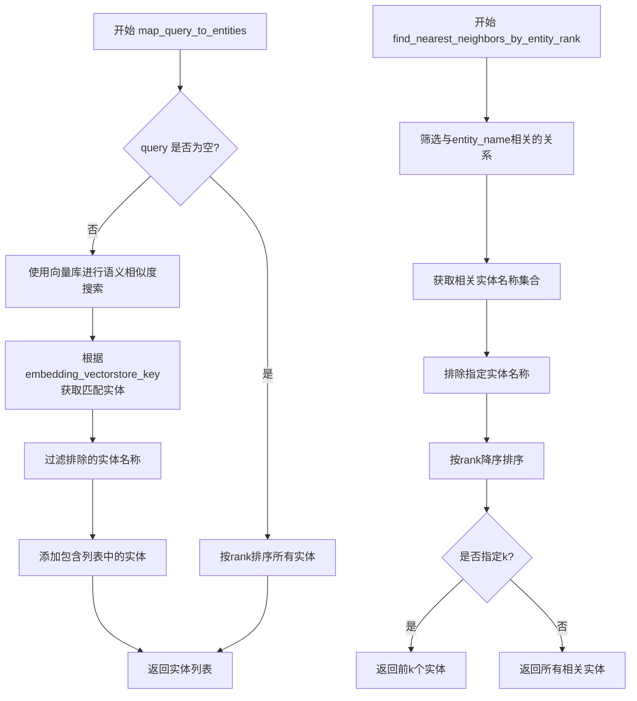
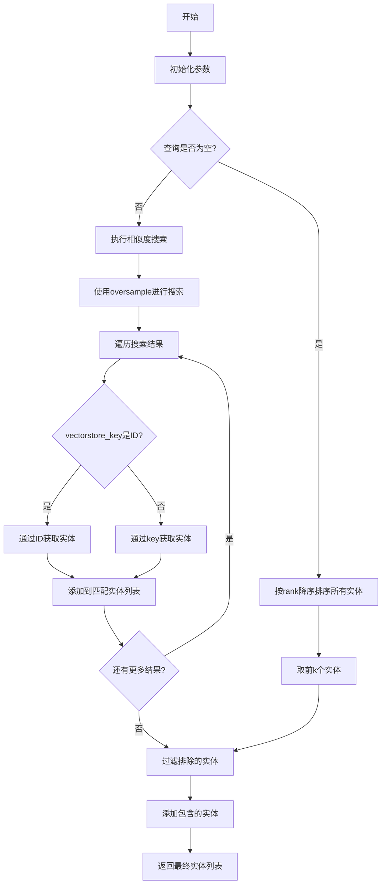
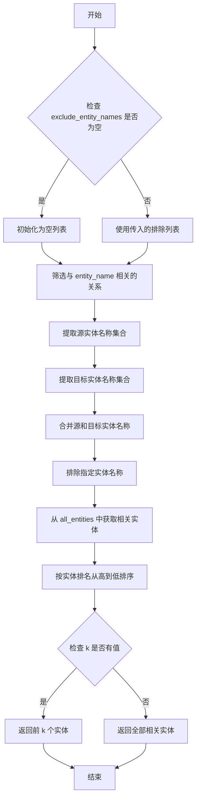
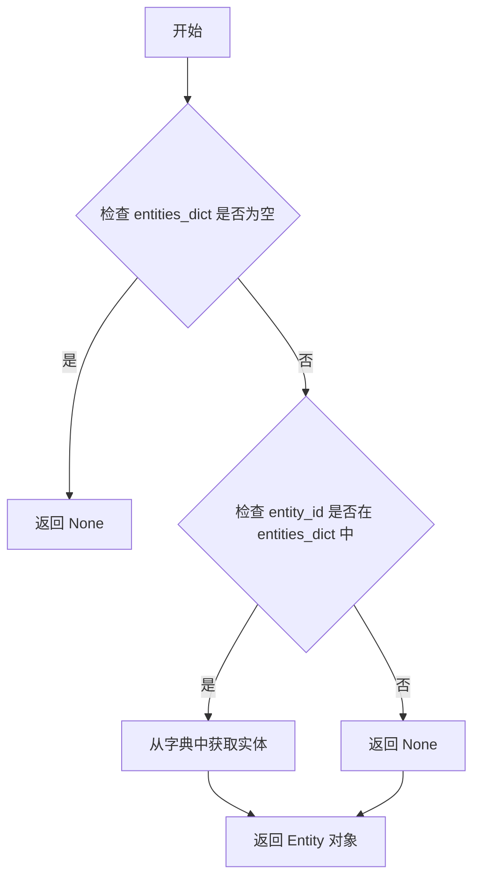
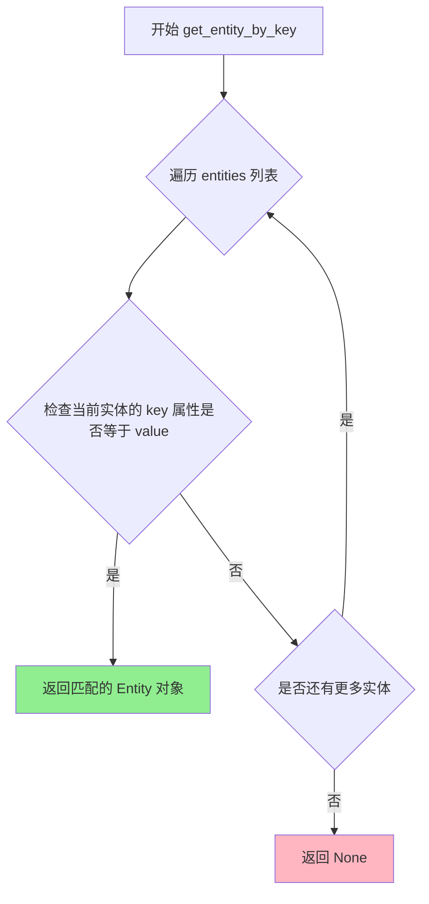
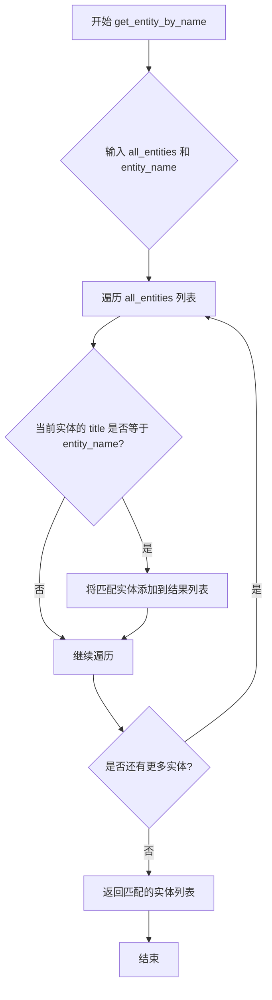

# `graphrag\packages\graphrag\graphrag\query\context_builder\entity_extraction.py` 详细设计文档

该代码是GraphRAG系统的编排上下文构建器，提供了基于语义相似度的实体匹配和基于实体排名的最近邻查找功能，支持通过文本嵌入向量库检索相关实体，并允许包含或排除特定实体。

## 整体流程



## 类结构

```
EntityVectorStoreKey (Enum)
├── ID
├── TITLE
└── from_string() [静态方法]

全局函数
├── map_query_to_entities()
└── find_nearest_neighbors_by_entity_rank()
```

## 全局变量及字段


### `query`
    
输入的查询字符串

类型：`str`
    


### `text_embedding_vectorstore`
    
文本嵌入向量存储库

类型：`VectorStore`
    


### `text_embedder`
    
文本嵌入器

类型：`LLMEmbedding`
    


### `all_entities_dict`
    
所有实体的字典映射

类型：`dict[str, Entity]`
    


### `embedding_vectorstore_key`
    
向量存储键类型，默认为EntityVectorStoreKey.ID

类型：`str`
    


### `include_entity_names`
    
需要包含的实体名称列表

类型：`list[str] | None`
    


### `exclude_entity_names`
    
需要排除的实体名称列表

类型：`list[str] | None`
    


### `k`
    
返回实体数量，默认值为10

类型：`int`
    


### `oversample_scaler`
    
过采样倍数，用于扩展搜索结果以过滤排除的实体，默认值为2

类型：`int`
    


### `entity_name`
    
目标实体名称

类型：`str`
    


### `all_entities`
    
所有实体列表

类型：`list[Entity]`
    


### `all_relationships`
    
所有关系列表

类型：`list[Relationship]`
    


### `EntityVectorStoreKey.EntityVectorStoreKey.ID`
    
用于实体嵌入向量存储的ID键

类型：`str, Enum member`
    


### `EntityVectorStoreKey.EntityVectorStoreKey.TITLE`
    
用于实体嵌入向量存储的标题键

类型：`str, Enum member`
    
    

## 全局函数及方法


### `map_query_to_entities`

使用文本嵌入的语义相似度将查询与实体描述进行匹配，返回与查询最相关的实体列表。

参数：

- `query`：`str`，输入的查询字符串
- `text_embedding_vectorstore`：`VectorStore`，用于存储和检索文本嵌入的向量存储
- `text_embedder`：`LLMEmbedding`，用于生成文本嵌入的嵌入器
- `all_entities_dict`：`dict[str, Entity]`，包含所有实体的字典
- `embedding_vectorstore_key`：`str`（默认：`EntityVectorStoreKey.ID`），向量存储中使用的键类型
- `include_entity_names`：`list[str] | None`（默认：`None`），需要包含的实体名称列表
- `exclude_entity_names`：`list[str] | None`（默认：`None`），需要排除的实体名称列表
- `k`：`int`（默认：`10`），返回的实体数量
- `oversample_scaler`：`int`（默认：`2`），过采样因子，用于补偿被排除的实体

返回值：`list[Entity]`，匹配查询的实体列表

#### 流程图



#### 带注释源码

```python
def map_query_to_entities(
    query: str,  # 输入的查询字符串
    text_embedding_vectorstore: VectorStore,  # 文本嵌入向量存储
    text_embedder: "LLMEmbedding",  # 文本嵌入器
    all_entities_dict: dict[str, Entity],  # 所有实体的字典
    embedding_vectorstore_key: str = EntityVectorStoreKey.ID,  # 向量存储键类型
    include_entity_names: list[str] | None = None,  # 包含的实体名
    exclude_entity_names: list[str] | None = None,  # 排除的实体名
    k: int = 10,  # 返回实体数量
    oversample_scaler: int = 2,  # 过采样因子
) -> list[Entity]:
    """使用查询和实体描述的文本嵌入语义相似度匹配实体"""
    # 初始化空列表
    if include_entity_names is None:
        include_entity_names = []
    if exclude_entity_names is None:
        exclude_entity_names = []
    
    # 获取所有实体列表
    all_entities = list(all_entities_dict.values())
    matched_entities = []
    
    if query != "":
        # 查询非空：进行语义相似度搜索
        # 过采样以补偿被排除的实体
        search_results = text_embedding_vectorstore.similarity_search_by_text(
            text=query,
            text_embedder=lambda t: text_embedder.embedding(input=[t]).first_embedding,
            k=k * oversample_scaler,
        )
        
        # 遍历搜索结果
        for result in search_results:
            # 根据vectorstore_key类型选择获取方式
            if embedding_vectorstore_key == EntityVectorStoreKey.ID and isinstance(
                result.document.id, str
            ):
                # 通过ID获取实体
                matched = get_entity_by_id(all_entities_dict, result.document.id)
            else:
                # 通过key获取实体
                matched = get_entity_by_key(
                    entities=all_entities,
                    key=embedding_vectorstore_key,
                    value=result.document.id,
                )
            
            # 添加到匹配列表
            if matched:
                matched_entities.append(matched)
    else:
        # 查询为空：按rank排序返回top-k实体
        all_entities.sort(key=lambda x: x.rank if x.rank else 0, reverse=True)
        matched_entities = all_entities[:k]

    # 过滤排除的实体
    if exclude_entity_names:
        matched_entities = [
            entity
            for entity in matched_entities
            if entity.title not in exclude_entity_names
        ]

    # 添加需要包含的实体
    included_entities = []
    for entity_name in include_entity_names:
        included_entities.extend(get_entity_by_name(all_entities, entity_name))
    
    # 返回包含的实体 + 匹配的实体
    return included_entities + matched_entities
```


### `find_nearest_neighbors_by_entity_rank`

根据实体排名查找与目标实体有直接连接的最近邻实体，并按实体排名从高到低排序返回。

参数：

-  `entity_name`：`str`，目标实体的名称，用于查找与其有直接关系的实体
-  `all_entities`：`list[Entity]`，所有实体的列表，包含实体对象
-  `all_relationships`：`list[Relationship]`，所有关系的列表，包含实体间的关系数据
-  `exclude_entity_names`：`list[str] | None`，可选参数，要排除的实体名称列表，默认为空列表
-  `k`：`int | None`，可选参数，返回的最近邻实体数量，默认为10，None表示返回全部

返回值：`list[Entity]`，与目标实体有直接连接且按排名排序的实体列表

#### 流程图



#### 带注释源码

```python
def find_nearest_neighbors_by_entity_rank(
    entity_name: str,
    all_entities: list[Entity],
    all_relationships: list[Relationship],
    exclude_entity_names: list[str] | None = None,
    k: int | None = 10,
) -> list[Entity]:
    """Retrieve entities that have direct connections with the target entity, sorted by entity rank."""
    # 如果未提供排除列表，则初始化为空列表
    if exclude_entity_names is None:
        exclude_entity_names = []
    
    # 从所有关系中筛选出与目标实体相关的所有关系（作为源或目标）
    entity_relationships = [
        rel
        for rel in all_relationships
        if rel.source == entity_name or rel.target == entity_name
    ]
    
    # 提取作为源实体的所有相关实体名称
    source_entity_names = {rel.source for rel in entity_relationships}
    # 提取作为目标实体的所有相关实体名称
    target_entity_names = {rel.target for rel in entity_relationships}
    
    # 合并源和目标实体名称，并排除指定要排除的实体名称
    related_entity_names = (source_entity_names.union(target_entity_names)).difference(
        set(exclude_entity_names)
    )
    
    # 从所有实体列表中筛选出与目标实体相关的实体
    top_relations = [
        entity for entity in all_entities if entity.title in related_entity_names
    ]
    
    # 按实体排名从高到低排序（rank 越大排名越高）
    top_relations.sort(key=lambda x: x.rank if x.rank else 0, reverse=True)
    
    # 如果指定了 k，则返回前 k 个实体，否则返回全部
    if k:
        return top_relations[:k]
    return top_relations
```


### `get_entity_by_id`

根据代码分析，`get_entity_by_id` 是从 `graphrag.query.input.retrieval.entities` 模块导入的函数，在当前代码的 `map_query_to_entities` 方法中被调用用于通过实体ID获取实体对象。

参数：

-  `entities_dict`：`dict[str, Entity]`，存储所有实体的字典，键为实体ID
-  `entity_id`：`str`，要查找的实体ID

返回值：`Entity | None`，如果找到则返回对应的 Entity 对象，否则返回 None

#### 流程图



#### 带注释源码

```python
# 该函数定义在 graphrag.query.input.retrieval.entities 模块中
# 当前代码文件中仅导入了该函数，以下为根据调用方式推断的实现逻辑

def get_entity_by_id(
    entities_dict: dict[str, Entity],  # 实体字典，键为实体ID
    entity_id: str                      # 要查找的实体ID
) -> Entity | None:                     # 返回找到的实体或None
    """
    通过实体ID从实体字典中获取实体对象。
    
    参数:
        entities_dict: 包含所有实体的字典，键为实体ID字符串
        entity_id: 要查询的实体ID
    
    返回:
        如果找到则返回对应的 Entity 对象，否则返回 None
    """
    # 检查实体ID是否存在于字典中
    if entity_id in entities_dict:
        return entities_dict[entity_id]
    return None
```

> **注意**：由于 `get_entity_by_id` 函数的实现位于外部模块 `graphrag.query.input.retrieval.entities` 中，未在当前代码文件中直接定义，以上源码是基于该函数在 `map_query_to_entities` 方法中的调用方式推断得出的逻辑实现。


### `get_entity_by_key`

通过指定的键（key）在实体列表中查找匹配值（value）的实体。该函数根据提供的键类型（如 ID 或 Title）在实体集合中执行查找操作，返回第一个匹配的实体对象，若未找到则返回 None。

参数：

- `entities`：`list[Entity]`，包含所有实体的列表，用于在其中进行搜索
- `key`：`str`，用于匹配的键，指定要匹配的实体属性（如 "id" 或 "title"）
- `value`：`str`，要匹配的值，将在实体属性中查找该值

返回值：`Entity | None`，返回第一个匹配的实体对象，如果未找到匹配的实体则返回 None

#### 流程图



#### 带注释源码

```
# 注意：以下为基于代码调用推断的函数签名和逻辑
# 实际源码位于 graphrag/query/input/retrieval/entities 模块中

def get_entity_by_key(
    entities: list[Entity],  # 实体列表，包含所有待搜索的实体对象
    key: str,                # 匹配键，指定要比较的实体属性名称（如 "id" 或 "title"）
    value: str,              # 要匹配的值，将在指定键属性中进行匹配
) -> Entity | None:          # 返回第一个匹配成功的实体，未找到则返回 None
    """
    通过键值对在实体列表中查找实体。
    
    参数:
        entities: 实体列表
        key: 实体属性键（如 "id" 或 "title"）
        value: 要匹配的值
    
    返回:
        匹配的实体对象，如果未找到则返回 None
    """
    # 遍历所有实体
    for entity in entities:
        # 获取实体指定键对应的属性值
        entity_value = getattr(entity, key, None)
        # 检查是否匹配
        if entity_value == value:
            return entity
    # 未找到匹配的实体
    return None
```

> **注**：该函数在 `map_query_to_entities` 方法中被调用，用于在语义搜索结果中根据向量存储的文档 ID 查找对应的实体对象。当 `embedding_vectorstore_key` 设置为 `EntityVectorStoreKey.TITLE` 时使用此函数进行匹配。


### `get_entity_by_name`

根据代码分析，`get_entity_by_name` 是从外部模块 `graphrag.query.input.retrieval.entities` 导入的函数，用于在实体列表中根据名称查找匹配的实体。该函数被 `map_query_to_entities` 方法调用，用于将用户指定的实体名称包含在检索结果中。

参数：

- `all_entities`：`list[Entity]`，包含所有实体的列表
- `entity_name`：`str`，要查找的实体名称

返回值：`list[Entity]`，返回与给定名称匹配的实体列表

#### 流程图



#### 带注释源码

```
# 由于 get_entity_by_name 的实际定义不在当前文件中
# 以下是基于代码调用方式的推断源码

def get_entity_by_name(
    entities: list[Entity],  # 实体列表，包含所有可用的Entity对象
    entity_name: str          # 要查找的实体名称（字符串）
) -> list[Entity]:           # 返回匹配名称的实体列表
    """
    根据名称从实体列表中获取匹配的实体。
    
    参数:
        entities: 包含所有实体的列表
        entity_name: 要匹配的实体名称
    
    返回:
        与给定名称匹配的所有实体列表
    """
    matched_entities = []
    
    # 遍历所有实体，查找title与entity_name匹配的实体
    for entity in entities:
        if entity.title == entity_name:
            matched_entities.append(entity)
    
    return matched_entities


# 在 map_query_to_entities 函数中的调用方式：
# included_entities.extend(get_entity_by_name(all_entities, entity_name))
# 其中 all_entities 是 list[Entity] 类型
# entity_name 是 str 类型（来自 include_entity_names 列表中的元素）
```

> **注意**：由于 `get_entity_by_name` 函数定义在外部模块 `graphrag.query.input.retrieval.entities` 中，上述源码是基于其在当前文件中的调用方式推断得出的。如需获取完整的函数实现，建议查看源模块文件。


### `EntityVectorStoreKey.from_string`

将字符串转换为 `EntityVectorStoreKey` 枚举值，用于根据给定的字符串值返回对应的枚举成员，如果字符串值无效则抛出 `ValueError` 异常。

参数：

- `value`：`str`，要转换的字符串值，用于匹配枚举的字符串表示

返回值：`EntityVectorStoreKey`，返回与输入字符串对应的枚举成员（`ID` 或 `TITLE`）

#### 流程图

```mermaid
flowchart TD
    A[Start: from_string] --> B{value == "id"?}
    B -->|Yes| C[Return EntityVectorStoreKey.ID]
    B -->|No| D{value == "title"?}
    D -->|Yes| E[Return EntityVectorStoreKey.TITLE]
    D -->|No| F[Raise ValueError: Invalid EntityVectorStoreKey: {value}]
    C --> G[End]
    E --> G
    F --> G
```

#### 带注释源码

```python
@staticmethod
def from_string(value: str) -> "EntityVectorStoreKey":
    """Convert string to EntityVectorStoreKey."""
    # 检查值是否为 "id"，如果是则返回 ID 枚举成员
    if value == "id":
        return EntityVectorStoreKey.ID
    # 检查值是否为 "title"，如果是则返回 TITLE 枚举成员
    if value == "title":
        return EntityVectorStoreKey.TITLE

    # 如果值既不是 "id" 也不是 "title"，抛出 ValueError 异常
    msg = f"Invalid EntityVectorStoreKey: {value}"
    raise ValueError(msg)
```

## 关键组件


### EntityVectorStoreKey 枚举类

用于标识实体嵌入向量存储中的键类型枚举，包含ID和TITLE两种模式，并提供字符串到枚举值的转换功能。

### map_query_to_entities 函数

通过文本嵌入的语义相似度将查询映射到匹配实体的核心函数，支持实体过滤、包含/排除列表、过采样和按排名排序等功能。

### find_nearest_neighbors_by_entity_rank 函数

根据实体排名查找与目标实体有直接连接的邻居实体，支持排除特定实体并按相关实体排名返回结果。

### VectorStore 接口

图向量存储的抽象接口，提供基于文本的相似度搜索功能，是实体嵌入检索的基础组件。

### LLMEmbedding 接口

大型语言模型嵌入接口，提供embedding方法将文本转换为向量表示，用于计算查询与实体描述之间的语义相似度。

### Entity/Relationship 数据模型

图数据模型的核心结构，分别表示图中的实体节点和关系边，包含id、title、rank等属性，用于构建知识图谱的向量表示。

### text_embedding_vectorstore.similarity_search_by_text 方法

向量存储的语义搜索方法，支持自定义文本嵌入函数，返回与查询文本最相似的文档结果列表。

### get_entity_by_id/get_entity_by_key/get_entity_by_name 工具函数

从实体集合中按不同方式（ID、键、名称）检索实体的辅助函数，用于查询结果的匹配和转换。


## 问题及建议


### 已知问题

-   **向量搜索键值逻辑不一致**：在 `map_query_to_entities` 函数中，当 `embedding_vectorstore_key` 为 `EntityVectorStoreKey.ID` 时使用 `get_entity_by_id`，否则使用 `get_entity_by_key`。但传入 `get_entity_by_key` 的 `value` 参数是 `result.document.id`，这里假设 `result.document.id` 存储的是 key 对应的值（如 title），但实际可能存储的是 ID，导致匹配失败。
-   **空查询时过滤逻辑缺失**：当 `query` 为空时，直接对所有实体按 rank 排序并取前 k 个，但此时未应用 `exclude_entity_names` 和 `include_entity_names` 的过滤逻辑，与非空查询时的行为不一致。
-   **实体名称比较假设不严谨**：`find_nearest_neighbors_by_entity_rank` 函数中，使用 `entity.title` 与 `rel.source`/`rel.target` 进行比较，假设关系中的 source 和 target 是实体的 title，但代码中未做验证，可能导致匹配失败。
-   **类型假设缺乏验证**：调用 `text_embedder.embedding(input=[t]).first_embedding` 时假设返回值有 `first_embedding` 属性，但 `LLMEmbedding` 接口定义中未强制要求此属性，可能导致运行时错误。
-   **缺少异常处理**：向量存储的 `similarity_search_by_text` 方法调用未做异常捕获，若向量存储服务不可用或返回格式异常，程序会直接崩溃。
-   **重复代码**：两个函数中都存在按 `rank` 排序的逻辑（`lambda x: x.rank if x.rank else 0, reverse=True`），未提取为公共函数。

### 优化建议

-   **修复键值匹配逻辑**：在调用 `get_entity_by_key` 前，明确 `result.document.id` 的内容与 `embedding_vectorstore_key` 的对应关系，或在 `EntityVectorStoreKey` 中添加验证逻辑。
-   **统一空查询行为**：在 `query` 为空时，也应对 `exclude_entity_names` 和 `include_entity_names` 进行处理，确保行为一致。
-   **增加实体名称类型校验**：在 `find_nearest_neighbors_by_entity_rank` 中添加参数（如 `entity_id_key`）来明确 source/target 是 ID 还是 title，或增加类型检查。
-   **强化类型标注**：为 `text_embedder.embedding` 的返回值定义明确的接口，或在调用前进行类型检查。
-   **添加异常处理**：对 `similarity_search_by_text` 调用添加 try-except 块，处理可能的异常情况。
-   **提取公共逻辑**：将排序逻辑提取为工具函数，如 `sort_entities_by_rank`，减少重复代码。
-   **配置化 Oversample Scaler**：将 `oversample_scaler` 作为可选参数或配置项，避免硬编码。

## 其它


### 设计目标与约束

本模块旨在为GraphRAG系统提供实体检索和上下文构建能力，核心目标是通过语义相似度和图关系实现精准的实体召回。设计约束包括：依赖graphrag_vectors的VectorStore进行向量检索；依赖graphrag_llm的LLMEmbedding进行文本嵌入；实体匹配支持ID和TITLE两种键模式；oversample机制用于补偿过滤后的实体数量损失。

### 错误处理与异常设计

**异常类型**：ValueError用于无效的EntityVectorStoreKey枚举值；KeyError用于实体查找失败场景；TypeError用于类型不匹配场景。**异常传播**：相似度搜索失败时返回空列表而非抛出异常；实体匹配失败时跳过该结果继续处理；空查询时回退到按rank排序的实体列表。**边界处理**：k值为None时返回全部结果；exclude_entity_names过滤后可能少于k个实体；include_entity_names中的实体名称不存在时返回空列表。

### 数据流与状态机

**主数据流**：查询字符串 → 文本嵌入 → 向量相似度搜索 → 实体匹配 → 过滤(排除) → 过滤(包含) → 返回实体列表。**查询为空状态**：转切换至rank排序模式，取top-k实体。**过滤状态**：先应用exclude过滤，再应用include补充，确保included_entities优先级高于matched_entities。

### 外部依赖与接口契约

**VectorStore接口**：需实现similarity_search_by_text方法，接收text、text_embedder、k参数，返回包含document属性的搜索结果。**LLMEmbedding接口**：需实现embedding方法，接收input列表参数，返回包含first_embedding属性的结果对象。**Entity模型**：需包含id、title、rank属性，其中rank用于排序。**Relationship模型**：需包含source、target属性用于关系匹配。

### 配置参数说明

**embedding_vectorstore_key**：默认为ID模式，可选TITLE模式，决定向量库中文档ID的映射方式。**k**：默认10，控制返回实体数量上限。**oversample_scaler**：默认2，用于向量搜索时的过采样，补偿exclude过滤带来的数量损失。**exclude_entity_names**：排除列表，优先级高于include，用于过滤已识别但不想要的实体。

### 性能考虑

**向量搜索优化**：使用oversample策略减少多次向量搜索的开销，将过滤成本转移至内存操作。**排序优化**：仅在查询为空时对全量实体进行rank排序，避免频繁排序操作。**集合操作**：使用set进行exclude_entity_names的差集运算，时间复杂度为O(n)。

### 安全性考虑

**输入验证**：query参数未做长度限制，大查询可能影响嵌入性能；entity_name参数需确保来自可信源，防止图遍历攻击。**数据隔离**：all_entities_dict和all_relationships为内存对象，需确保在多租户场景下正确隔离。

### 使用示例

**场景一：语义搜索**
```python
entities = map_query_to_entities(
    query="人工智能技术",
    text_embedding_vectorstore=vector_store,
    text_embedder=embedder,
    all_entities_dict=entities_dict,
    k=5
)
```

**场景二：图关系查询**
```python
neighbors = find_nearest_neighbors_by_entity_rank(
    entity_name="Microsoft",
    all_entities=entities_list,
    all_relationships=relationships_list,
    k=10
)
```


    