# `graphrag\packages\graphrag\graphrag\query\context_builder\local_context.py` 详细设计文档

这是一个本地上下文构建器，用于将图谱中的实体、关系和协变量数据转换为适合作为大语言模型系统提示上下文的文本和表格数据，支持token数量限制和优先级排序。

## 整体流程

```mermaid
graph TD
    A[开始] --> B[调用 get_candidate_context]
    B --> C[获取候选关系]
    C --> D[转换为关系DataFrame]
    D --> E[从关系中提取候选实体]
    E --> F[转换为实体DataFrame]
    F --> G[遍历协变量类型]
    G --> H[获取候选协变量]
    H --> I[转换为协变量DataFrame]
    I --> J[返回候选上下文字典]
    J --> K{调用 build_entity_context}
    K --> L{有选中实体?}
    L -- 否 --> M[返回空字符串和空DataFrame]
    L -- 是 --> N[构建表头]
    N --> O[遍历实体构建记录]
    O --> P{超过最大token限制?}
    P -- 是 --> Q[停止添加]
    P -- 否 --> O]
    Q --> R[返回上下文文本和DataFrame]
    R --> S{调用 build_relationship_context}
    S --> T[调用 _filter_relationships 过滤关系]
    T --> U[构建关系表头和记录]
    U --> V[返回关系上下文]
    V --> W{调用 build_covariates_context}
    W --> X[筛选匹配的协变量]
    X --> Y[构建协变量表头和记录]
    Y --> Z[返回协变量上下文]
```

## 类结构

```
无类定义 - 模块级函数集合
主要模块: local_context_builder
├── build_entity_context (构建实体上下文)
├── build_covariates_context (构建协变量上下文)
├── build_relationship_context (构建关系上下文)
├── _filter_relationships (私有 - 过滤关系)
└── get_candidate_context (获取候选上下文)
```

## 全局变量及字段


### `selected_entities`
    
选中的实体列表，用于构建上下文

类型：`list[Entity]`
    


### `tokenizer`
    
分词器实例，用于计算token数量，如果为None则自动获取

类型：`Tokenizer | None`
    


### `max_context_tokens`
    
最大上下文token数量限制，默认8000

类型：`int`
    


### `include_entity_rank`
    
是否在实体上下文中包含实体排名，默认True

类型：`bool`
    


### `rank_description`
    
实体排名的描述字段名，默认"number of relationships"

类型：`str`
    


### `column_delimiter`
    
列分隔符，用于格式化输出表格，默认"|"

类型：`str`
    


### `context_name`
    
上下文名称，用于生成表格标题

类型：`str`
    


### `relationships`
    
关系列表，用于构建关系上下文

类型：`list[Relationship]`
    


### `covariates`
    
协变量列表或字典，用于构建协变量上下文

类型：`list[Covariate] | dict[str, list[Covariate]]`
    


### `include_relationship_weight`
    
是否在关系上下文中包含权重，默认False

类型：`bool`
    


### `top_k_relationships`
    
每个实体最多保留的关系数量，默认10

类型：`int`
    


### `relationship_ranking_attribute`
    
关系排序的属性名，默认"rank"

类型：`str`
    


    

## 全局函数及方法


### `build_entity_context`

Prepare entity data table as context data for system prompt. This function takes a list of selected entities and converts them into a formatted text table and pandas DataFrame, respecting token limits for context window. It builds a delimited table with entity ID, title, description, rank, and optional attributes.

参数：

- `selected_entities`：`list[Entity]`，待处理的实体列表，用于构建上下文数据
- `tokenizer`：`Tokenizer | None`，分词器实例，若为None则自动获取默认分词器
- `max_context_tokens`：`int`，最大上下文token数，默认为8000，用于控制生成的上下文长度
- `include_entity_rank`：`bool`，是否在输出中包含实体排名，默认为True
- `rank_description`：`str`，排名的描述文本，默认为"number of relationships"
- `column_delimiter`：`str`，列分隔符，默认为"|"
- `context_name`：`str`，上下文名称，默认为"Entities"

返回值：`tuple[str, pd.DataFrame]`，返回格式化后的上下文文本和对应的pandas DataFrame

#### 流程图

```mermaid
flowchart TD
    A[开始 build_entity_context] --> B{selected_entities 为空?}
    B -->|是| C[返回空字符串和空DataFrame]
    B -->|否| D[获取或创建 tokenizer]
    D --> E[构建表头: id, entity, description, rank_description, attributes]
    E --> F[计算表头 token 数]
    F --> G[初始化 all_context_records = [header]]
    G --> H{遍历 selected_entities}
    H --> I[构建实体行数据: short_id, title, description, rank, attributes]
    I --> J[计算新行 token 数]
    J --> K{current_tokens + new_tokens > max_context_tokens?}
    K -->|是| L[跳出循环]
    K -->|否| M[追加到上下文文本和记录列表]
    M --> N[更新 token 计数]
    N --> H
    L --> O{有有效记录?}
    O -->|是| P[创建 DataFrame]
    O -->|否| Q[创建空 DataFrame]
    P --> R[返回上下文文本和 DataFrame]
    Q --> R
```

#### 带注释源码

```python
def build_entity_context(
    selected_entities: list[Entity],
    tokenizer: Tokenizer | None = None,
    max_context_tokens: int = 8000,
    include_entity_rank: bool = True,
    rank_description: str = "number of relationships",
    column_delimiter: str = "|",
    context_name="Entities",
) -> tuple[str, pd.DataFrame]:
    """Prepare entity data table as context data for system prompt."""
    # 如果没有提供 tokenizer，则获取默认分词器
    tokenizer = tokenizer or get_tokenizer()

    # 空实体列表直接返回空结果
    if len(selected_entities) == 0:
        return "", pd.DataFrame()

    # 添加上下文标题行
    current_context_text = f"-----{context_name}-----" + "\n"
    
    # 构建表头：包含 id, entity, description
    header = ["id", "entity", "description"]
    
    # 如果需要包含实体排名，则将排名描述添加到表头
    if include_entity_rank:
        header.append(rank_description)
    
    # 获取实体属性列（如果有）
    attribute_cols = (
        list(selected_entities[0].attributes.keys())
        if selected_entities[0].attributes
        else []
    )
    
    # 将属性列添加到表头
    header.extend(attribute_cols)
    
    # 将表头转换为文本并计算 token 数
    current_context_text += column_delimiter.join(header) + "\n"
    current_tokens = tokenizer.num_tokens(current_context_text)

    # 初始化记录列表，表头为首个元素
    all_context_records = [header]
    
    # 遍历每个实体，构建数据行
    for entity in selected_entities:
        # 构建基础数据行：short_id, title, description
        new_context = [
            entity.short_id if entity.short_id else "",
            entity.title,
            entity.description if entity.description else "",
        ]
        
        # 如果需要包含排名，添加排名值
        if include_entity_rank:
            new_context.append(str(entity.rank))
        
        # 添加属性字段值
        for field in attribute_cols:
            field_value = (
                str(entity.attributes.get(field))
                if entity.attributes and entity.attributes.get(field)
                else ""
            )
            new_context.append(field_value)
        
        # 将行数据转换为文本
        new_context_text = column_delimiter.join(new_context) + "\n"
        
        # 计算新行的 token 数
        new_tokens = tokenizer.num_tokens(new_context_text)
        
        # 检查是否超过最大 token 限制
        if current_tokens + new_tokens > max_context_tokens:
            break  # 超过限制，停止添加更多实体
        
        # 追加到上下文文本和记录列表
        current_context_text += new_context_text
        all_context_records.append(new_context)
        current_tokens += new_tokens

    # 将记录转换为 DataFrame
    if len(all_context_records) > 1:
        record_df = pd.DataFrame(
            all_context_records[1:], columns=cast("Any", all_context_records[0])
        )
    else:
        record_df = pd.DataFrame()

    # 返回上下文文本和 DataFrame
    return current_context_text, record_df
```


### `build_covariates_context`

准备协变量数据表作为系统提示的上下文数据。该函数接收选中的实体列表和协变量列表，筛选出与选中实体匹配的协变量，构建成带分隔符的文本表格，同时控制总token数不超过指定上限。

参数：

- `selected_entities`：`list[Entity]`，选中的实体列表，用于筛选协变量
- `covariates`：`list[Covariate]`，候选协变量列表
- `tokenizer`：`Tokenizer | None`，分词器，默认为 None（自动获取）
- `max_context_tokens`：`int`，最大上下文 token 数，默认为 8000
- `column_delimiter`：`str`，列分隔符，默认为 "|"
- `context_name`：`str`，上下文名称，默认为 "Covariates"

返回值：`tuple[str, pd.DataFrame]`，返回上下文文本字符串和对应的 DataFrame 数据

#### 流程图

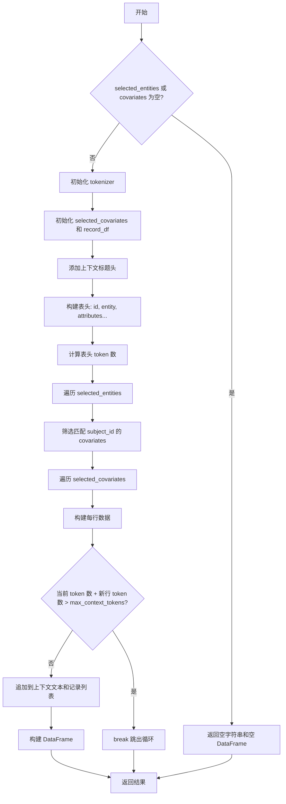

#### 带注释源码

```python
def build_covariates_context(
    selected_entities: list[Entity],
    covariates: list[Covariate],
    tokenizer: Tokenizer | None = None,
    max_context_tokens: int = 8000,
    column_delimiter: str = "|",
    context_name: str = "Covariates",
) -> tuple[str, pd.DataFrame]:
    """Prepare covariate data tables as context data for system prompt."""
    # 获取或创建 tokenizer 实例
    tokenizer = tokenizer or get_tokenizer()
    
    # 如果没有选中实体或协变量，直接返回空结果
    if len(selected_entities) == 0 or len(covariates) == 0:
        return "", pd.DataFrame()

    # 初始化选中的协变量列表和 DataFrame
    selected_covariates = list[Covariate]()
    record_df = pd.DataFrame()

    # 添加上下文标题头：-----Covariates-----
    current_context_text = f"-----{context_name}-----" + "\n"

    # 构建表头：先添加 id 和 entity 列
    header = ["id", "entity"]
    # 获取协变量的属性列名
    attributes = covariates[0].attributes or {} if len(covariates) > 0 else {}
    attribute_cols = list(attributes.keys()) if len(covariates) > 0 else []
    # 将属性列名添加到表头
    header.extend(attribute_cols)
    # 追加表头到上下文文本并计算 token 数
    current_context_text += column_delimiter.join(header) + "\n"
    current_tokens = tokenizer.num_tokens(current_context_text)

    # 初始化所有上下文记录列表，表头为首个元素
    all_context_records = [header]
    
    # 遍历所有选中的实体，筛选出与该实体匹配的协变量
    for entity in selected_entities:
        selected_covariates.extend([
            cov for cov in covariates if cov.subject_id == entity.title
        ])

    # 遍历筛选出的协变量，构建每行数据
    for covariate in selected_covariates:
        # 构建新行数据：id 和 subject_id
        new_context = [
            covariate.short_id if covariate.short_id else "",
            covariate.subject_id,
        ]
        # 遍历属性列，获取属性值
        for field in attribute_cols:
            field_value = (
                str(covariate.attributes.get(field))
                if covariate.attributes and covariate.attributes.get(field)
                else ""
            )
            new_context.append(field_value)

        # 将新行转换为文本并计算 token 数
        new_context_text = column_delimiter.join(new_context) + "\n"
        new_tokens = tokenizer.num_tokens(new_context_text)
        
        # 检查是否超过最大 token 数限制
        if current_tokens + new_tokens > max_context_tokens:
            break
            
        # 追加到上下文文本和记录列表
        current_context_text += new_context_text
        all_context_records.append(new_context)
        current_tokens += new_tokens

        # 将记录列表转换为 DataFrame
        if len(all_context_records) > 1:
            record_df = pd.DataFrame(
                all_context_records[1:], columns=cast("Any", all_context_records[0])
            )
        else:
            record_df = pd.DataFrame()

    # 返回上下文文本和 DataFrame
    return current_context_text, record_df
```


### `build_relationship_context`

准备关系数据表作为系统提示的上下文数据，通过过滤、排序和格式化关系实体，生成符合token限制的上下文文本和对应的DataFrame。

参数：

- `selected_entities`：`list[Entity]`，从中筛选关系的实体列表
- `relationships`：`list[Relationship]`，待处理的所有关系列表
- `tokenizer`：`Tokenizer | None`，分词器实例，默认为None则获取全局tokenizer
- `include_relationship_weight`：`bool`，是否在输出中包含关系权重，默认为False
- `max_context_tokens`：`int`，上下文最大token数，默认为8000
- `top_k_relationships`：`int`，每个实体保留的Top K关系数，默认为10
- `relationship_ranking_attribute`：`str`，关系排序属性，默认为"rank"
- `column_delimiter`：`str`，列分隔符，默认为"|"
- `context_name`：`str`，上下文名称，默认为"Relationships"

返回值：`tuple[str, pd.DataFrame]`，包含格式化的上下文文本和对应的pandas DataFrame

#### 流程图

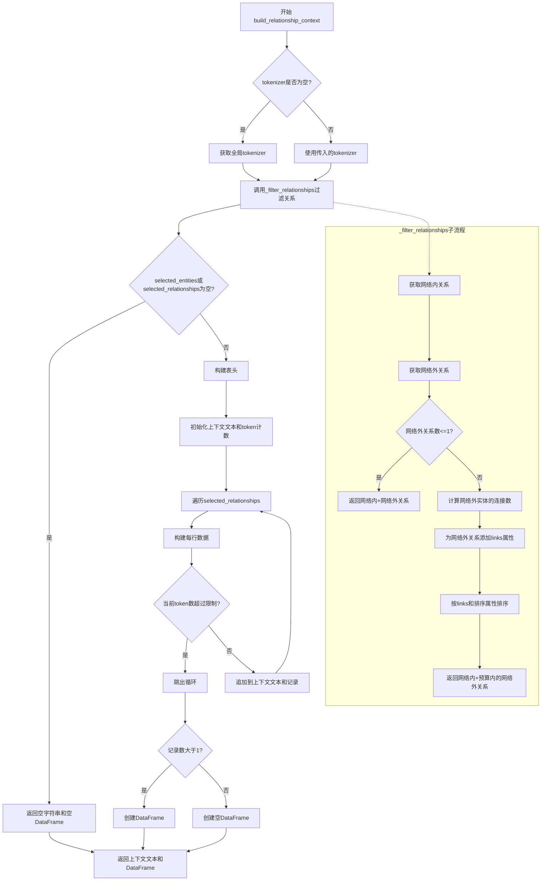

#### 带注释源码

```python
def build_relationship_context(
    selected_entities: list[Entity],
    relationships: list[Relationship],
    tokenizer: Tokenizer | None = None,
    include_relationship_weight: bool = False,
    max_context_tokens: int = 8000,
    top_k_relationships: int = 10,
    relationship_ranking_attribute: str = "rank",
    column_delimiter: str = "|",
    context_name: str = "Relationships",
) -> tuple[str, pd.DataFrame]:
    """Prepare relationship data tables as context data for system prompt."""
    # 获取tokenizer实例，如果未提供则使用全局默认tokenizer
    tokenizer = tokenizer or get_tokenizer()
    
    # 调用内部函数_filter_relationships过滤和排序关系
    # 优先选择网络内关系（selected_entities之间的关系）
    # 其次选择网络外关系，并根据top_k_relationships和relationship_ranking_attribute排序
    selected_relationships = _filter_relationships(
        selected_entities=selected_entities,
        relationships=relationships,
        top_k_relationships=top_k_relationships,
        relationship_ranking_attribute=relationship_ranking_attribute,
    )

    # 如果没有选中的实体或关系，直接返回空结果
    if len(selected_entities) == 0 or len(selected_relationships) == 0:
        return "", pd.DataFrame()

    # 添加上下文标题头
    current_context_text = f"-----{context_name}-----" + "\n"
    
    # 构建表头：id, source, target, description
    header = ["id", "source", "target", "description"]
    
    # 如果需要包含关系权重，在表头中添加weight列
    if include_relationship_weight:
        header.append("weight")
    
    # 从关系属性中获取额外的列，排除已在header中的列
    attribute_cols = (
        list(selected_relationships[0].attributes.keys())
        if selected_relationships[0].attributes
        else []
    )
    attribute_cols = [col for col in attribute_cols if col not in header]
    header.extend(attribute_cols)

    # 将表头添加到上下文文本，并计算当前token数量
    current_context_text += column_delimiter.join(header) + "\n"
    current_tokens = tokenizer.num_tokens(current_context_text)

    # 初始化所有上下文记录，表头作为第一行
    all_context_records = [header]
    
    # 遍历每个选中的关系，构建数据行
    for rel in selected_relationships:
        # 构建基础字段：short_id, source, target, description
        new_context = [
            rel.short_id if rel.short_id else "",
            rel.source,
            rel.target,
            rel.description if rel.description else "",
        ]
        
        # 如果需要包含权重，添加weight字段
        if include_relationship_weight:
            new_context.append(str(rel.weight if rel.weight else ""))
        
        # 添加属性列的值
        for field in attribute_cols:
            field_value = (
                str(rel.attributes.get(field))
                if rel.attributes and rel.attributes.get(field)
                else ""
            )
            new_context.append(field_value)
        
        # 将行数据转换为文本
        new_context_text = column_delimiter.join(new_context) + "\n"
        new_tokens = tokenizer.num_tokens(new_context_text)
        
        # 检查添加此行后是否超过最大token限制
        if current_tokens + new_tokens > max_context_tokens:
            break  # 超过限制，跳出循环
        
        # 未超过限制，追加到上下文和记录中
        current_context_text += new_context_text
        all_context_records.append(new_context)
        current_tokens += new_tokens

    # 根据记录数创建DataFrame
    if len(all_context_records) > 1:
        record_df = pd.DataFrame(
            all_context_records[1:], columns=cast("Any", all_context_records[0])
        )
    else:
        record_df = pd.DataFrame()

    # 返回格式化的上下文文本和DataFrame
    return current_context_text, record_df
```


### `_filter_relationships`

该函数用于根据选定的实体集合和排名属性过滤和排序关系，优先返回网络内关系（选定实体之间的关系），然后返回网络外关系（选定实体与外部实体之间的关系），并根据链接数量和排名属性对网络外关系进行排序。

参数：

- `selected_entities`：`list[Entity]`，用于过滤关系的选定实体列表
- `relationships`：`list[Relationship]`，所有待过滤的关系列表
- `top_k_relationships`：`int = 10`，每个实体最多保留的关系数量
- `relationship_ranking_attribute`：`str = "rank"`，用于排序的关系属性名

返回值：`list[Relationship]`，过滤并排序后的关系列表

#### 流程图

```mermaid
flowchart TD
    A[Start _filter_relationships] --> B[Get in-network relationships]
    B --> C[Get out-of-network relationships]
    C --> D{len <= 1?}
    D -->|Yes| E[Return in_network + out_network]
    D -->|No| F[Get selected entity names]
    F --> G[Extract out-network entity names]
    G --> H[Calculate links for each out-network entity]
    H --> I[Add links attribute to out-network relationships]
    I --> J{Sort by ranking_attribute?}
    J -->|rank| K[Sort by links and rank]
    J -->|weight| L[Sort by links and weight]
    J -->|other| M[Sort by links and custom attribute]
    K --> N[Calculate budget: top_k * len(selected_entities)]
    L --> N
    M --> N
    N --> O[Return in_network + out_network[:budget]]
```

#### 带注释源码

```python
def _filter_relationships(
    selected_entities: list[Entity],
    relationships: list[Relationship],
    top_k_relationships: int = 10,
    relationship_ranking_attribute: str = "rank",
) -> list[Relationship]:
    """Filter and sort relationships based on a set of selected entities and a ranking attribute."""
    # First priority: in-network relationships (i.e. relationships between selected entities)
    in_network_relationships = get_in_network_relationships(
        selected_entities=selected_entities,
        relationships=relationships,
        ranking_attribute=relationship_ranking_attribute,
    )

    # Second priority -  out-of-network relationships
    # (i.e. relationships between selected entities and other entities that are not within the selected entities)
    out_network_relationships = get_out_network_relationships(
        selected_entities=selected_entities,
        relationships=relationships,
        ranking_attribute=relationship_ranking_attribute,
    )
    # If there are 0 or 1 out-of-network relationships, return all without further processing
    if len(out_network_relationships) <= 1:
        return in_network_relationships + out_network_relationships

    # within out-of-network relationships, prioritize mutual relationships
    # (i.e. relationships with out-network entities that are shared with multiple selected entities)
    # Get titles of all selected entities
    selected_entity_names = [entity.title for entity in selected_entities]
    # Extract source entity names that are not in selected entities
    out_network_source_names = [
        relationship.source
        for relationship in out_network_relationships
        if relationship.source not in selected_entity_names
    ]
    # Extract target entity names that are not in selected entities
    out_network_target_names = [
        relationship.target
        for relationship in out_network_relationships
        if relationship.target not in selected_entity_names
    ]
    # Get unique out-network entity names
    out_network_entity_names = list(
        set(out_network_source_names + out_network_target_names)
    )
    # Count how many selected entities each out-network entity connects to
    out_network_entity_links = defaultdict(int)
    for entity_name in out_network_entity_names:
        # Find all targets from this entity
        targets = [
            relationship.target
            for relationship in out_network_relationships
            if relationship.source == entity_name
        ]
        # Find all sources to this entity
        sources = [
            relationship.source
            for relationship in out_network_relationships
            if relationship.target == entity_name
        ]
        # Store the count of unique connections
        out_network_entity_links[entity_name] = len(set(targets + sources))

    # sort out-network relationships by number of links and rank_attributes
    for rel in out_network_relationships:
        if rel.attributes is None:
            rel.attributes = {}
        # Assign links count to the relationship based on source or target entity
        rel.attributes["links"] = (
            out_network_entity_links[rel.source]
            if rel.source in out_network_entity_links
            else out_network_entity_links[rel.target]
        )

    # sort by attributes[links] first, then by ranking_attribute
    if relationship_ranking_attribute == "rank":
        out_network_relationships.sort(
            key=lambda x: (x.attributes["links"], x.rank),  # type: ignore
            reverse=True,  # type: ignore
        )
    elif relationship_ranking_attribute == "weight":
        out_network_relationships.sort(
            key=lambda x: (x.attributes["links"], x.weight),  # type: ignore
            reverse=True,  # type: ignore
        )
    else:
        out_network_relationships.sort(
            key=lambda x: (
                x.attributes["links"],  # type: ignore
                x.attributes[relationship_ranking_attribute],  # type: ignore
            ),  # type: ignore
            reverse=True,
        )

    # Calculate total budget: top K relationships per selected entity
    relationship_budget = top_k_relationships * len(selected_entities)
    # Return in-network relationships (full) plus truncated out-network relationships
    return in_network_relationships + out_network_relationships[:relationship_budget]
```


### `get_candidate_context`

准备实体、关系和协变量数据表，作为系统提示的上下文数据。

参数：

- `selected_entities`：`list[Entity]`，从知识图谱中检索到的选定实体列表
- `entities`：`list[Entity]`，完整的实体列表，用于从关系中获取候选实体
- `relationships`：`list[Relationship]`，完整的知识图谱关系列表
- `covariates`：`dict[str, list[Covariate]]`，协变量字典，键为协变量类型名称，值为协变量列表
- `include_entity_rank`：`bool`，是否在实体数据中包含实体排名信息，默认为 True
- `entity_rank_description`：`str`，实体排名的描述文本，默认为 "number of relationships"
- `include_relationship_weight`：`bool`，是否在关系数据中包含关系权重，默认为 False

返回值：`dict[str, pd.DataFrame]`，返回包含实体、关系和协变量数据表的字典，键分别为 "entities"、"relationships" 以及协变量类型名称（小写）

#### 流程图

```mermaid
flowchart TD
    A[开始 get_candidate_context] --> B[初始化空字典 candidate_context]
    B --> C[调用 get_candidate_relationships 获取候选关系]
    C --> D[调用 to_relationship_dataframe 转换为 DataFrame]
    D --> E[将关系数据存入 candidate_context['relationships']]
    E --> F[调用 get_entities_from_relationships 从关系中获取候选实体]
    F --> G[调用 to_entity_dataframe 转换为 DataFrame]
    G --> H[将实体数据存入 candidate_context['entities']]
    H --> I{遍历 covariates 字典}
    I -->|是| J[对每个协变量类型调用 get_candidate_covariates]
    J --> K[调用 to_covariate_dataframe 转换为 DataFrame]
    K --> L[将协变量数据存入 candidate_context[协变量名小写]]
    L --> I
    I -->|否| M[返回 candidate_context 字典]
```

#### 带注释源码

```python
def get_candidate_context(
    selected_entities: list[Entity],
    entities: list[Entity],
    relationships: list[Relationship],
    covariates: dict[str, list[Covariate]],
    include_entity_rank: bool = True,
    entity_rank_description: str = "number of relationships",
    include_relationship_weight: bool = False,
) -> dict[str, pd.DataFrame]:
    """Prepare entity, relationship, and covariate data tables as context data for system prompt."""
    # 初始化用于存储候选上下文数据的字典
    candidate_context = {}
    
    # 第一步：从选定实体中获取相关的关系
    # 调用 get_candidate_relationships 函数，筛选出与选定实体直接相关的关系
    candidate_relationships = get_candidate_relationships(
        selected_entities=selected_entities,
        relationships=relationships,
    )
    
    # 第二步：将候选关系转换为 pandas DataFrame 格式
    # 包含可选的关系权重信息
    candidate_context["relationships"] = to_relationship_dataframe(
        relationships=candidate_relationships,
        include_relationship_weight=include_relationship_weight,
    )
    
    # 第三步：从候选关系中提取涉及的实体
    # 因为关系可能连接未直接选中的实体，需要从关系中提取所有涉及的实体
    candidate_entities = get_entities_from_relationships(
        relationships=candidate_relationships, entities=entities
    )
    
    # 第四步：将候选实体转换为 pandas DataFrame 格式
    # 包含可选的实体排名信息
    candidate_context["entities"] = to_entity_dataframe(
        entities=candidate_entities,
        include_entity_rank=include_entity_rank,
        rank_description=entity_rank_description,
    )

    # 第五步：处理协变量数据
    # 遍历每个协变量类型，为其生成候选协变量并转换为 DataFrame
    for covariate in covariates:
        # 获取与选定实体相关的协变量
        candidate_covariates = get_candidate_covariates(
            selected_entities=selected_entities,
            covariates=covariates[covariate],
        )
        # 将协变量转换为 DataFrame 并存储，使用小写协变量名作为键
        candidate_context[covariate.lower()] = to_covariate_dataframe(
            candidate_covariates
        )

    # 返回包含所有上下文数据的字典
    return candidate_context
```


### `get_tokenizer`

获取分词器（Tokenizer）实例的函数，用于文本分词处理。

参数：

- （无参数）

返回值：`Tokenizer`，返回当前配置的分词器实例

#### 流程图

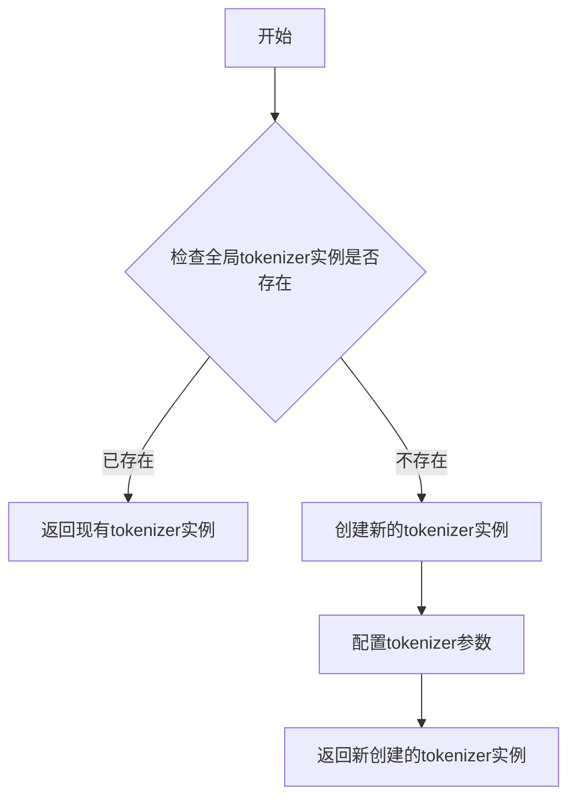

#### 带注释源码

```python
# 注意：此函数定义在 graphrag.tokenizer.get_tokenizer 模块中
# 当前文件通过以下方式导入：
from graphrag.tokenizer.get_tokenizer import get_tokenizer

# 在代码中的调用方式：
# tokenizer = tokenizer or get_tokenizer()
# 这表明 get_tokenizer() 不接受任何参数
# 返回一个 Tokenizer 对象，用于文本分词

# 以下是函数在代码中的实际使用示例：
def build_entity_context(
    selected_entities: list[Entity],
    tokenizer: Tokenizer | None = None,
    max_context_tokens: int = 8000,
    include_entity_rank: bool = True,
    rank_description: str = "number of relationships",
    column_delimiter: str = "|",
    context_name="Entities",
) -> tuple[str, pd.DataFrame]:
    """Prepare entity data table as context data for system prompt."""
    # 如果没有提供tokenizer，则获取默认的tokenizer
    tokenizer = tokenizer or get_tokenizer()
    # ... 后续使用 tokenizer.num_tokens() 方法计算token数量
```

### 补充说明

由于 `get_tokenizer` 函数定义在 `graphrag/tokenizer/get_tokenizer.py` 文件中（通过导入语句可知），而该文件内容未在当前代码片段中提供，因此无法获取其完整的实现源码。以上信息是根据当前文件中的导入语句和实际调用方式推断得出的。

**在当前文件中，`get_tokenizer` 的使用方式总结：**
- 调用方式：`get_tokenizer()`
- 参数：无
- 返回值：用于计算文本token数量的 `Tokenizer` 对象
- 主要方法：`tokenizer.num_tokens(text: str) -> int` 用于计算文本的token数量


### `get_candidate_covariates`

根据代码分析，`get_candidate_covariates` 是一个从导入模块 `graphrag.query.input.retrieval.covariates` 中使用的函数，用于根据选中的实体从所有协变量中筛选出相关的候选协变量。

参数：

- `selected_entities`：`list[Entity]`，包含选中的实体列表，用于过滤协变量
- `covariates`：`list[Covariate]`，包含所有可用的协变量列表

返回值：`list[Covariate]`，返回与选中实体相关的候选协变量列表

#### 流程图

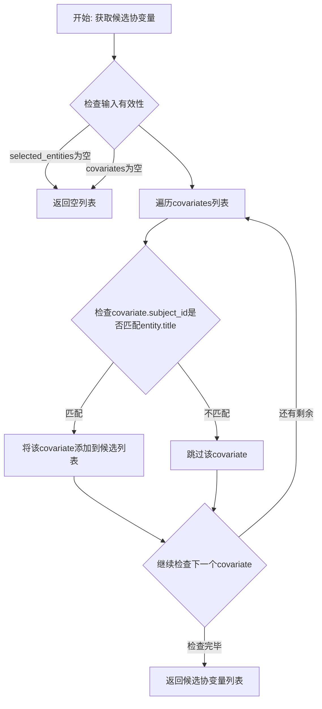

#### 带注释源码

```python
# 该函数定义在 graphrag.query.input.retrieval.covariates 模块中
# 代码中仅导入了该函数，未提供实现
# 根据调用方式推断的函数签名和逻辑：

def get_candidate_covariates(
    selected_entities: list[Entity],
    covariates: list[Covariate],
) -> list[Covariate]:
    """
    根据选中的实体获取相关的候选协变量。
    
    参数:
        selected_entities: 选中的实体列表
        covariates: 所有协变量列表
        
    返回:
        与选中实体相关的协变量列表
    """
    # 提取选中实体的标题列表
    selected_entity_titles = {entity.title for entity in selected_entities}
    
    # 过滤出subject_id在选中实体标题中的协变量
    candidate_covariates = [
        cov for cov in covariates 
        if cov.subject_id in selected_entity_titles
    ]
    
    return candidate_covariates
```


### `to_covariate_dataframe`

该函数用于将协变量列表转换为 pandas DataFrame 格式，以便在图谱检索流程中作为上下文数据使用。

参数：

- `candidate_covariates`：`list[Covariate]`，待转换的协变量列表

返回值：`pd.DataFrame`，转换后的 DataFrame 对象

#### 流程图

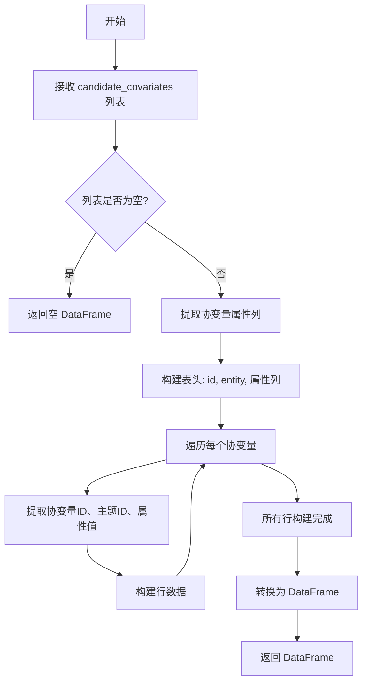

#### 带注释源码

```
# 注意: 该函数定义在 graphrag/query/input/retrieval/covariates 模块中
# 以下为基于代码上下文的推断实现

def to_covariate_dataframe(
    candidate_covariates: list[Covariate]
) -> pd.DataFrame:
    """将协变量列表转换为 DataFrame 格式。
    
    参数:
        candidate_covariates: 协变量对象列表
        
    返回:
        包含协变量数据的 DataFrame
    """
    # 如果列表为空,返回空 DataFrame
    if not candidate_covariates:
        return pd.DataFrame()
    
    # 获取属性列名
    attributes = candidate_covariates[0].attributes or {}
    attribute_cols = list(attributes.keys())
    
    # 构建表头: id, subject_id, 属性列
    header = ["id", "subject_id"] + attribute_cols
    
    # 遍历协变量构建行数据
    rows = []
    for cov in candidate_covariates:
        row = [
            cov.short_id if cov.short_id else "",
            cov.subject_id,
        ]
        # 添加各属性列的值
        for field in attribute_cols:
            field_value = (
                str(cov.attributes.get(field))
                if cov.attributes and cov.attributes.get(field)
                else ""
            )
            row.append(field_value)
        rows.append(row)
    
    # 创建 DataFrame
    return pd.DataFrame(rows, columns=header)
```

#### 说明

该函数在 `get_candidate_context` 函数中被调用：

```python
candidate_context[covariate.lower()] = to_covariate_dataframe(
    candidate_covariates
)
```

函数定义位于外部模块 `graphrag.query.input.retrieval.covariates`，源码实现基于代码上下文的调用模式推断得出。该函数将协变量对象列表转换为 pandas DataFrame，表头包含 `id`、`subject_id` 以及各属性列，用于后续的上下文构建和 prompt 生成。


### `to_entity_dataframe`

该函数是一个数据转换工具函数，用于将 `Entity` 对象列表转换为 Pandas DataFrame，以便于进行向量化检索或作为 Prompt 上下文的一部分。在提供的代码文件中，仅包含对该函数的调用和导入，未包含其具体实现源码。以下信息基于调用上下文 (`get_candidate_context` 函数中的调用) 推断得出。

**描述：** 将输入的实体对象列表（包含标题、描述、排名及属性）转换为结构化的 Pandas DataFrame。

参数：

-  `entities`：`list[Entity]`，待转换的实体对象列表。
-  `include_entity_rank`：`bool`，是否在 DataFrame 中包含实体的排名信息。
-  `rank_description`：`str`，排名列的描述或列名（例如 "number of relationships"）。

返回值：`pd.DataFrame`，转换后的数据表，包含实体的 ID、标题、描述、排名（可选）及属性列。

#### 流程图

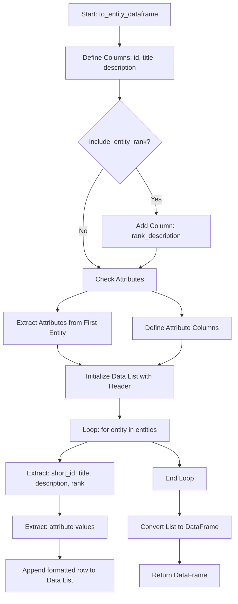

#### 带注释源码

```python
# 导入所需的 Entity 数据模型（假设存在于 graphrag.data_model.entity）
# 实际源码位于 graphrag/query/input/retrieval/entities.py
from typing import List
import pandas as pd
# from graphrag.data_model.entity import Entity  # 定义通常在此

def to_entity_dataframe(
    entities: List[Entity],
    include_entity_rank: bool = True,
    rank_description: str = "number of relationships",
) -> pd.DataFrame:
    """
    将 Entity 对象列表转换为 Pandas DataFrame。
    
    参数:
        entities: 实体对象列表。
        include_entity_rank: 是否包含排名列。
        rank_description: 排名列的显示名称。
    返回:
        包含实体数据的 DataFrame。
    """
    if not entities:
        return pd.DataFrame()

    # 1. 初始化列名
    # 默认包含: id, entity(也就是title), description
    columns = ["id", "entity", "description"]
    
    # 2. 根据参数添加排名列
    if include_entity_rank:
        columns.append(rank_description)
        
    # 3. 提取并添加属性列
    # 获取第一个实体的属性键，以确定 DataFrame 的结构
    attribute_cols = []
    if entities[0].attributes:
        attribute_cols = list(entities[0].attributes.keys())
    columns.extend(attribute_cols)

    # 4. 构建数据记录
    all_records = []
    for entity in entities:
        # 基础字段处理，处理 None 值
        row = [
            entity.short_id if entity.short_id else "",
            entity.title,
            entity.description if entity.description else ""
        ]
        
        # 添加排名
        if include_entity_rank:
            row.append(entity.rank)
            
        # 添加属性值
        for attr_col in attribute_cols:
            attr_val = entity.attributes.get(attr_col) if entity.attributes else None
            row.append(str(attr_val) if attr_val else "")
            
        all_records.append(row)

    # 5. 转换为 DataFrame 并返回
    return pd.DataFrame(all_records, columns=columns)
```


### `get_candidate_relationships`

该函数用于从所有关系中筛选出与选中的实体相关的候选关系。它接收选中的实体列表和完整的关系列表作为输入，通过遍历关系并检查每条关系的源实体或目标实体是否存在于选中实体列表中来过滤关系。最终返回与选中实体相关的所有关系，支持后续的实体关系数据框构建和上下文检索。

参数：

- `selected_entities`：`list[Entity]`（在文件中使用的方式），表示已被选中的实体列表，用于筛选相关关系
- `relationships`：`list[Relationship]`，表示完整的原始关系列表，从中筛选出与选中实体相关的候选关系

返回值：`list[Relationship]`，返回与选中实体相关的候选关系列表，可用于后续的实体提取和上下文构建

#### 流程图

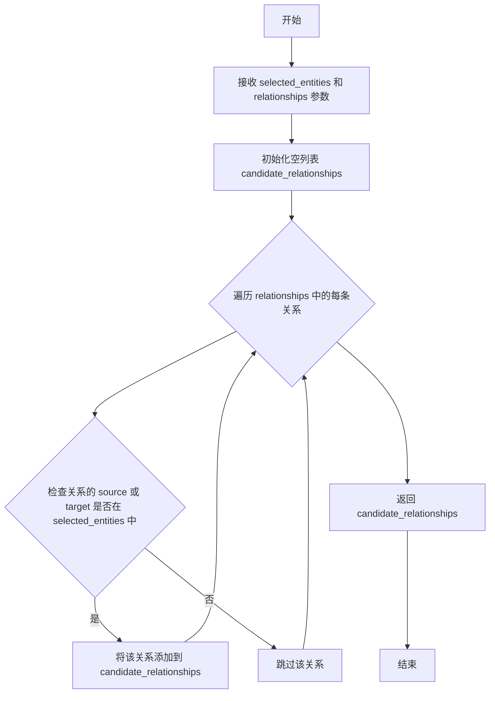

#### 带注释源码

```
# 该函数为外部导入函数，基于其在文件中的调用方式推断其实现逻辑
# 导入来源：from graphrag.query.input.retrieval.relationships import get_candidate_relationships

def get_candidate_relationships(
    selected_entities: list[Entity],
    relationships: list[Relationship],
) -> list[Relationship]:
    """
    从所有关系中筛选出与选中的实体相关的候选关系。
    
    参数:
        selected_entities: 已选中的实体列表，用于匹配关系
        relationships: 完整的关系列表
        
    返回:
        与选中实体相关的所有关系
    """
    # 提取选中实体的标题集合，用于快速查找
    selected_entity_titles = {entity.title for entity in selected_entities}
    
    # 初始化候选关系列表
    candidate_relationships = []
    
    # 遍历所有关系，筛选出与选中实体相关的关系
    for relationship in relationships:
        # 检查关系的源实体或目标实体是否在选中实体列表中
        if relationship.source in selected_entity_titles or relationship.target in selected_entity_titles:
            candidate_relationships.append(relationship)
    
    return candidate_relationships
```


### `get_entities_from_relationships`

该函数用于从给定的关系列表中提取相关的实体，基于关系中的源实体和目标实体，从完整的实体列表中筛选出与这些关系相关联的实体。

参数：

- `relationships`：`list[Relationship]`，输入的关系列表，包含需要提取实体的关系数据
- `entities`：`list[Entity]`，完整的实体列表，作为实体查找的来源

返回值：`list[Entity]`，返回与给定关系相关联的实体列表

#### 流程图

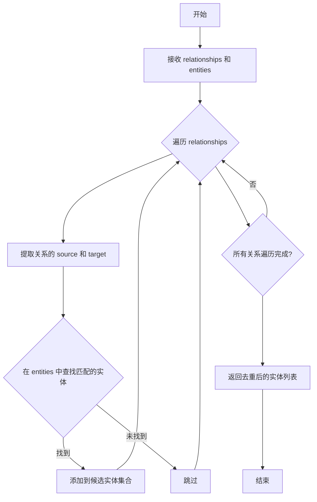

#### 带注释源码

```
# 该函数定义位于 graphrag/query/input/retrieval/relationships.py
# 在本文件中通过导入使用，其实际实现未包含在当前代码文件中

# 调用示例：
candidate_entities = get_entities_from_relationships(
    relationships=candidate_relationships,  # 候选关系列表
    entities=entities                        # 完整实体列表
)

# 函数功能说明：
# 1. 遍历输入的 relationships 关系列表
# 2. 对于每个关系，提取其 source（源实体）和 target（目标实体）
# 3. 在 entities 列表中查找与上述源和目标匹配的实体
# 4. 返回所有匹配的去重后的实体列表
# 该函数常用于在已知候选关系的情况下，获取这些关系涉及的相关实体
```


### `get_in_network_relationships`

该函数用于从所有关系中筛选出"网络内关系"，即源实体和目标实体都出现在选定实体列表中的关系，并按照指定属性进行排序。

参数：

- `selected_entities`：`list[Entity]`，选定实体列表，用于筛选网络内关系
- `relationships`：`list[Relationship]`，
  所有候选关系列表
- `ranking_attribute`：`str`，用于排序的属性名称（如"rank"或"weight"）

返回值：`list[Relationship]`，筛选并排序后的网络内关系列表

#### 流程图

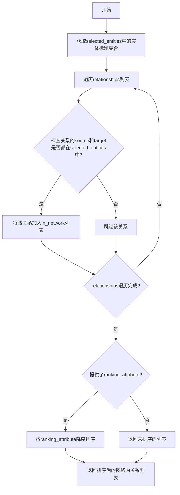

#### 带注释源码

```
# 从 graphrag.query.input.retrieval.relationships 模块导入
# (具体实现不在当前文件中，但在逻辑上执行以下操作)

def get_in_network_relationships(
    selected_entities: list[Entity],
    relationships: list[Relationship],
    ranking_attribute: str = "rank",
) -> list[Relationship]:
    """获取网络内关系（源和目标都在selected_entities中的关系）。
    
    参数:
        selected_entities: 选中的实体列表
        relationships: 所有候选关系列表
        ranking_attribute: 排序属性名称，默认为"rank"
    
    返回:
        网络内关系列表，按ranking_attribute降序排序
    """
    # 1. 获取选中实体的标题集合，用于快速查找
    selected_entity_titles = {entity.title for entity in selected_entities}
    
    # 2. 筛选出源和目标都在选中实体中的关系
    in_network_relationships = [
        rel for rel in relationships
        if rel.source in selected_entity_titles 
        and rel.target in selected_entity_titles
    ]
    
    # 3. 按指定属性排序（降序）
    if ranking_attribute == "rank":
        in_network_relationships.sort(key=lambda x: x.rank, reverse=True)
    elif ranking_attribute == "weight":
        in_network_relationships.sort(key=lambda x: x.weight, reverse=True)
    else:
        # 对于其他属性，从attributes字典中获取
        in_network_relationships.sort(
            key=lambda x: x.attributes.get(ranking_attribute, 0), 
            reverse=True
        )
    
    return in_network_relationships
```

**注意**：该函数的实际实现位于 `graphrag/query/input/retrieval/relationships.py` 模块中，上述源码是根据其在 `_filter_relationships` 函数中的使用方式推断得出的逻辑实现。


### `get_out_network_relationships`

获取选定实体与不在选定实体列表中的其他实体之间的关系（网络外关系），用于构建关系上下文数据。

参数：

- `selected_entities`：`list[Entity]`选定实体列表，用于过滤关系
- `relationships`：`list[Relationship]`完整的关系列表
- `ranking_attribute`：`str`用于排序的属性名称，默认值为 "rank"

返回值：`list[Relationship]`网络外关系列表，即与选定实体相关但目标实体不在选定实体列表中的关系

#### 流程图

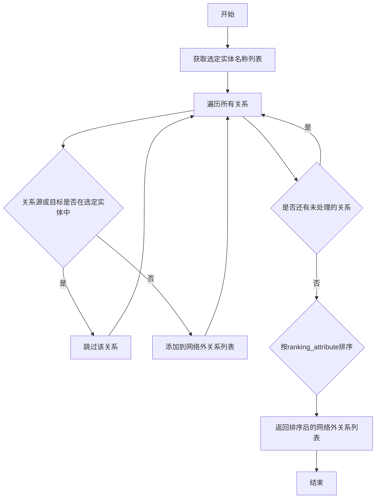

#### 带注释源码

由于该函数定义在外部模块 `graphrag.query.input.retrieval.relationships` 中，未在当前代码文件中实现，因此无法提供其完整源码。根据在 `_filter_relationships` 函数中的调用方式，推断其核心逻辑如下：

```python
# 该函数定义在 graphrag.query.input.retrieval.relationships 模块中
def get_out_network_relationships(
    selected_entities: list[Entity],
    relationships: list[Relationship],
    ranking_attribute: str = "rank",
) -> list[Relationship]:
    """
    获取网络外关系（out-of-network relationships）
    即：源实体或目标实体中只有一个在选定实体列表中的关系
    
    参数：
        selected_entities: 选中的实体列表
        relationships: 所有候选关系
        ranking_attribute: 用于排序的属性（默认为 'rank'）
    
    返回：
        网络外关系列表，按指定属性排序
    """
    # 1. 获取选定实体的标题集合
    selected_entity_names = {entity.title for entity in selected_entities}
    
    # 2. 过滤出网络外关系
    # 网络外关系：关系的一端在选定实体中，另一端不在选定实体中
    out_network_rels = [
        rel for rel in relationships
        if (rel.source in selected_entity_names) != (rel.target in selected_entity_names)
    ]
    
    # 3. 按指定属性排序并返回
    # 注意：具体排序逻辑依赖于传入的 ranking_attribute
    return out_network_rels
```


根据提供的代码，`to_relationship_dataframe` 函数是从外部模块 `graphrag.query.input.retrieval.relationships` 导入的，并没有在该代码文件中定义。以下是从代码中的使用方式推断出的该函数的信息：

### `to_relationship_dataframe`

将 Relationship 对象列表转换为 pandas DataFrame 格式，用于系统提示的上下文数据。

参数：

- `relationships`：`list[Relationship]`，需要转换的关系对象列表
- `include_relationship_weight`：`bool`，是否在 DataFrame 中包含关系权重列

返回值：`pd.DataFrame`，包含关系数据的 DataFrame

#### 流程图

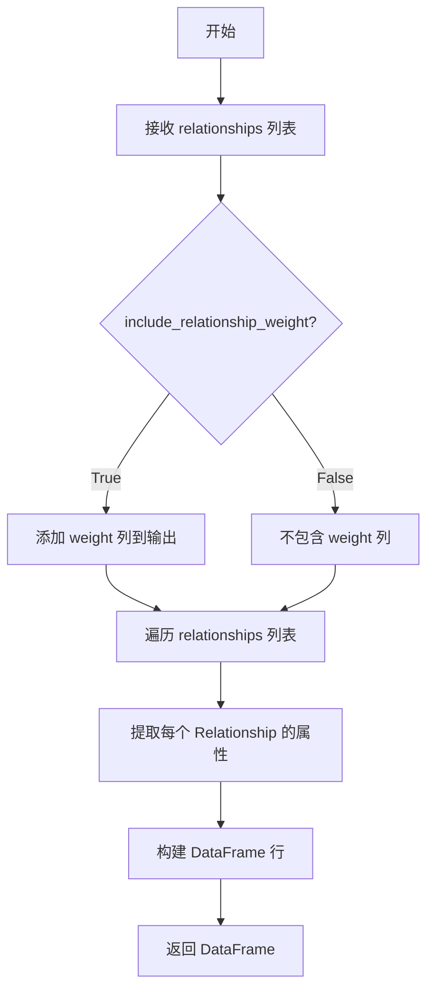

#### 带注释源码

```
# 注：该函数的实际定义不在提供 的代码中
# 而是从 graphrag.query.input.retrieval.relationships 模块导入
# 以下是根据代码调用方式推断的函数签名和使用方式：

def to_relationship_dataframe(
    relationships: list[Relationship],  # 关系对象列表
    include_relationship_weight: bool = False  # 是否包含权重列
) -> pd.DataFrame:
    """将 Relationship 对象列表转换为 DataFrame。
    
    参数:
        relationships: 关系列表
        include_relationship_weight: 是否包含权重信息
        
    返回:
        包含关系数据的 DataFrame
    """
    # ... (实际实现不在当前代码文件中)
```

---

**注意**：由于该函数定义在外部模块中，无法获取其完整源码和详细实现。若需查看完整源码，建议查看 `graphrag/query/input/retrieval/relationships.py` 文件。

## 关键组件


### build_entity_context

Prepare entity data table as context data for system prompt, supporting token limit constraints and optional entity ranking.

### build_covariates_context

Prepare covariate data tables as context data for system prompt with token budget management.

### build_relationship_context

Prepare relationship data tables as context data for system prompt with filtering and ranking capabilities.

### _filter_relationships

Filter and sort relationships based on selected entities and ranking attribute, prioritizing in-network relationships over out-of-network relationships.

### get_candidate_context

Prepare entity, relationship, and covariate data tables as context data for system prompt by coordinating candidate retrieval from multiple data sources.


## 问题及建议


### 已知问题

-   **类型注解语法错误**：第90行 `selected_covariates = list[Covariate]()` 是无效的Python语法，应该使用 `selected_covariates: list[Covariate] = []`
-   **DataFrame重复构建**：在 `build_covariates_context` 函数的循环内部（第108-116行）每次迭代都创建DataFrame，应该移到循环外部一次性构建，严重影响性能
-   **重复代码模式**：三个 `build_*_context` 函数包含大量重复逻辑（构建header、token计数、截断判断、DataFrame构建），违反DRY原则
-   **边界条件检查不足**：多处直接访问 `selected_entities[0]`、`covariates[0]`、`selected_relationships[0]` 而未先验证列表非空，可能引发IndexError
-   **参数不一致**：`build_covariates_context` 缺少 `include_entity_rank` 和 `rank_description` 参数，与 `build_entity_context` 和 `build_relationship_context` 接口不对称
-   **重复数据风险**：第102-104行对每个entity重复添加covariates，如果一个covariate关联多个entity会导致重复记录
-   **魔法数字**：max_context_tokens默认值8000硬编码在多个函数中，缺乏统一配置
-   **性能低效**：`_filter_relationships` 中多次遍历 `out_network_relationships` 列表，可以优化为单次遍历

### 优化建议

-   修复第90行类型注解，改为 `selected_covariates: list[Covariate] = []`
-   将DataFrame构建逻辑移出循环，在函数末尾统一创建
-   抽取公共逻辑到私有辅助函数，如 `_build_context_table`、`_tokenize_and_truncate`、`_create_dataframe`
-   在访问列表元素前添加非空检查：`if selected_entities and selected_entities[0].attributes:`
-   为 `build_covariates_context` 添加缺失的参数以保持接口一致性
-   使用 `dict.fromkeys()` 或在添加前检查来避免重复添加covariates
-   将8000提取为模块级常量 `DEFAULT_MAX_CONTEXT_TOKENS = 8000`
-   在 `_filter_relationships` 中使用单次遍历收集信息，或使用集合进行快速查找
-   考虑将三个build函数合并为一个通用函数，通过参数区分处理类型


## 其它


### 设计目标与约束

本模块的核心目标是将图谱中的实体、关系和协变量数据转换为适合大型语言模型（LLM）系统提示词的文本格式和DataFrame格式。设计约束包括：1）最大上下文token数限制（默认8000），通过截断机制确保不超出LLM的上下文窗口；2）列分隔符可配置（默认"|"）；3）支持实体排名描述自定义；4）优先返回网络内关系（in-network relationships），其次是网络外关系。

### 错误处理与异常设计

代码中主要依赖以下错误处理机制：1）空输入处理：build_entity_context、build_covariates_context和build_relationship_context在selected_entities为空时直接返回空字符串和空DataFrame；2）空属性处理：通过get(field) or ""模式处理可能为None的属性值；3）类型转换保护：使用cast("Any", ...)进行类型断言；4）token计算保护：所有token计算都包装在条件判断中，防止空tokenizer导致的问题。

### 数据流与状态机

数据流遵循以下路径：输入阶段（selected_entities、relationships、covariates）→ 过滤阶段（_filter_relationships对关系进行优先级排序）→ 格式化阶段（构建header和记录行）→ token预算检查（超过max_context_tokens则截断）→ 输出阶段（返回字符串文本和DataFrame）。状态机表现为：空输入状态 → 初始化状态 → 迭代添加记录状态 → 达到预算截断状态 → 完成状态。

### 外部依赖与接口契约

主要外部依赖包括：1）graphrag_llm.tokenizer.Tokenizer - token计数功能；2）pandas - DataFrame数据结构；3）graphrag.data_model下的Entity、Relationship、Covariate数据模型；4）graphrag.query.input.retrieval下的多个模块（get_candidate_covariates、to_covariate_dataframe、to_entity_dataframe等）。接口契约要求：Entity需包含short_id、title、description、rank、attributes属性；Relationship需包含short_id、source、target、description、weight、attributes属性；Covariate需包含short_id、subject_id、attributes属性。

### 性能考量与优化空间

性能考量点：1）token计数每行都调用tokenizer.num_tokens()，可通过批量计算优化；2）_filter_relationships中的嵌套循环和时间复杂度较高；3）list extend操作在循环中可能导致性能问题。优化空间：1）考虑使用lru_cache缓存tokenizer的num_tokens结果；2）_filter_relationships中可使用向量化操作替代部分循环；3）属性字典的多次get操作可合并；4）可考虑并行处理多个实体的上下文构建。

### 安全性与边界检查

当前代码主要关注功能实现，安全性考虑相对有限：1）column_delimiter参数未做特殊字符过滤，如果传入特殊正则字符可能导致输出格式问题；2）rank_description参数直接用于header构建，未做安全性检查；3）context_name参数直接拼接字符串，存在潜在注入风险（虽然在LLM提示词场景下风险较低）。

### 配置与可扩展性

可配置项包括：1）max_context_tokens - 最大上下文token数（默认8000）；2）column_delimiter - 列分隔符（默认"|"）；3）include_entity_rank - 是否包含实体排名；4）rank_description - 排名描述文本；5）include_relationship_weight - 是否包含关系权重；6）top_k_relationships - 关系数量上限；7）relationship_ranking_attribute - 关系排名属性。扩展点：可继承或扩展_filter_relationships函数实现自定义关系过滤策略；可添加新的上下文构建函数支持其他数据类型。

### 测试与验证策略

建议的测试覆盖：1）空输入边界条件测试；2）token预算截断行为验证；3）属性为None或空字符串时的处理；4）不同relationship_ranking_attribute值的排序正确性；5）in-network和out-network关系的优先级验证；6）多属性实体的上下文构建正确性；7）DataFrame和字符串输出的格式一致性。

### 日志与监控

当前代码未包含日志记录功能。建议添加：1）DEBUG级别：记录每个实体的token计数和累计token数；2）INFO级别：记录上下文构建的摘要信息（实体数、关系数、最终token数）；3）WARNING级别：记录因token预算导致的截断行为；4）ERROR级别：记录tokenizer异常或数据模型格式错误。

    