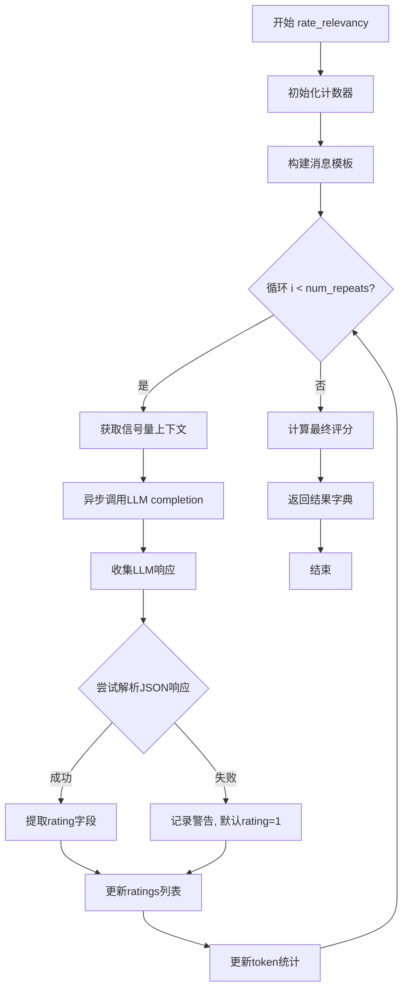

# `graphrag\packages\graphrag\graphrag\query\context_builder\rate_relevancy.py` 详细设计文档

该模块实现了一个基于大语言模型(LLM)的查询与描述文本相关性评分算法，通过异步调用LLM对查询与描述内容进行相关性评估，评分范围为0-10分，并使用多数投票机制处理多次评分的场景。

## 整体流程



## 类结构

```
无类层次结构 (函数式模块)
└── rate_relevancy (顶层异步函数)
```

## 全局变量及字段


### `logger`
    
模块级日志记录器，用于记录函数执行过程中的警告和错误信息

类型：`logging.Logger`
    


    

## 全局函数及方法


### `rate_relevancy`

该异步函数用于评估查询与描述文本之间的相关性，评分范围为0到10分。函数通过调用大语言模型（LLM）进行评分，并使用多数投票机制确定最终评分，同时跟踪token使用情况和LLM调用次数。

参数：

- `query`：`str`，要评分的查询（或问题）
- `description`：`str`，社区描述文本，可以是社区标题、摘要或完整内容
- `model`：`LLMCompletion`，用于评分的大语言模型
- `tokenizer`：用于计算token数量的分词器
- `rate_query`：`str`（默认值：RATE_QUERY），评分提示模板
- `num_repeats`：`int`（默认值：1），对同一社区重复评分过程的次数
- `semaphore`：`asyncio.Semaphore | None`（默认值：None），用于限制并发LLM调用的信号量
- `**model_params`：`Any`，传递给LLM模型的额外参数

返回值：`dict[str, Any]`，包含以下键值的字典：

- `rating`：`int`，最终评分（多数投票结果）
- `ratings`：`list`，所有评分的列表
- `llm_calls`：`int`，LLM调用次数
- `prompt_tokens`：`int`，使用的提示tokens总数
- `output_tokens`：`int`，输出的tokens总数

#### 流程图

```mermaid
flowchart TD
    A([开始]) --> B[初始化变量: llm_calls=0, prompt_tokens=0, output_tokens=0, ratings=[]]
    B --> C[构建消息: 使用CompletionMessagesBuilder添加系统消息和用户消息]
    C --> D{循环: i < num_repeats?}
    D -->|是| E[获取信号量上下文]
    E --> F[异步调用LLM: model.completion_async]
    F --> G[收集LLM响应]
    G --> H{尝试解析JSON响应}
    H -->|成功| I[提取rating字段]
    H -->|失败| J[记录警告日志, 默认rating=1]
    I --> K[添加rating到ratings列表]
    J --> K
    K --> L[累加llm_calls计数]
    L --> M[累加prompt_tokens和output_tokens]
    M --> D
    D -->|否| N[使用numpy计算多数投票: np.unique + np.argmax]
    N --> O[构建返回字典]
    O --> P([结束])
    
    style H fill:#f9f,stroke:#333
    style J fill:#ff9,stroke:#333
```

#### 带注释源码

```python
async def rate_relevancy(
    query: str,
    description: str,
    model: "LLMCompletion",
    tokenizer: Tokenizer,
    rate_query: str = RATE_QUERY,
    num_repeats: int = 1,
    semaphore: asyncio.Semaphore | None = None,
    **model_params: Any,
) -> dict[str, Any]:
    """
    Rate the relevancy between the query and description on a scale of 0 to 10.

    Args:
        query: the query (or question) to rate against
        description: the community description to rate, it can be the community
            title, summary, or the full content.
        llm: LLM model to use for rating
        tokenizer: tokenizer
        num_repeats: number of times to repeat the rating process for the same community (default: 1)
        model_params: additional arguments to pass to the LLM model
        semaphore: asyncio.Semaphore to limit the number of concurrent LLM calls (default: None)
    """
    # 初始化统计变量
    llm_calls, prompt_tokens, output_tokens, ratings = 0, 0, 0, []

    # 构建消息构造器，添加系统消息（包含评分提示模板和描述）
    # 和用户消息（查询内容）
    messages_builder = (
        CompletionMessagesBuilder()
        .add_system_message(rate_query.format(description=description, question=query))
        .add_user_message(query)
    )

    # 根据num_repeats重复评分过程，用于提高评分准确性
    for _ in range(num_repeats):
        # 使用信号量限制并发LLM调用数量（如果提供了信号量）
        # 否则使用nullcontext()作为空上下文管理器
        async with semaphore if semaphore is not None else nullcontext():
            # 异步调用LLM完成生成，设置response_format_json_object=True
            # 要求返回JSON对象格式的响应
            model_response = await model.completion_async(
                messages=messages_builder.build(),
                response_format_json_object=True,
                **model_params,
            )
            # 收集LLM的响应结果
            response = await gather_completion_response_async(model_response)
        
        # 尝试解析JSON响应，提取rating字段
        try:
            _, parsed_response = try_parse_json_object(response)
            ratings.append(parsed_response["rating"])
        except KeyError:
            # 如果JSON解析失败（极少发生），默认rating为1以保留报告
            logger.warning("Error parsing json response, defaulting to rating 1")
            ratings.append(1)
        
        # 统计LLM调用次数和token使用量
        llm_calls += 1
        prompt_tokens += tokenizer.num_prompt_tokens(messages_builder.build())
        output_tokens += tokenizer.num_tokens(response)
    
    # 使用numpy的unique和argmax计算多数投票结果
    # 选择出现次数最多的rating作为最终评分
    options, counts = np.unique(ratings, return_counts=True)
    rating = int(options[np.argmax(counts)])
    
    # 返回包含评分结果和统计信息的字典
    return {
        "rating": rating,
        "ratings": ratings,
        "llm_calls": llm_calls,
        "prompt_tokens": prompt_tokens,
        "output_tokens": output_tokens,
    }
```

## 关键组件


### 异步评分函数 (rate_relevancy)

核心函数，通过LLM模型异步评估查询与描述文本之间的相关性，输出0-10的评分结果。

### 消息构建器 (CompletionMessagesBuilder)

构建LLM提示消息的系统，包含系统消息和用户消息的组装功能。

### 令牌计算器 (Tokenizer)

用于计算提示词和输出响应的token数量，统计LLM调用的资源消耗。

### 异步响应收集 (gather_completion_response_async)

异步收集LLM模型返回的响应内容。

### JSON解析器 (try_parse_json_object)

尝试解析LLM返回的JSON响应，提取评分数据。

### 评分提示模板 (RATE_QUERY)

预定义的提示词模板，用于指导LLM进行相关性评分。

### 并发控制 (asyncio.Semaphore)

可选的异步信号量，用于限制并发LLM调用的数量，防止资源过载。

### 评分聚合逻辑

使用numpy的unique和argmax函数，通过多数投票机制从多次评分结果中确定最终评分。


## 问题及建议


### 已知问题

-   **异常处理不完善**：`model.completion_async` 和 `gather_completion_response_async` 调用未捕获异常，若 LLM 调用失败会导致整个异步任务失败；`try_parse_json_object` 解析失败时仅记录 warning 日志，未记录原始响应内容用于调试
-   **资源管理潜在问题**：`semaphore` 使用 `nullcontext()` 包装而非直接传递 None，在高并发场景下可能引入不必要的上下文切换开销
-   **评分逻辑冗余**：当 `num_repeats=1` 时仍执行 `np.unique` 投票逻辑，但单次评分无需投票，增加了不必要的计算开销
-   **Token 统计时机问题**：Token 计数在循环内部累加，但计算逻辑依赖于 `response` 变量，若循环因异常中断，可能导致统计不完整
-   **函数职责过重**：`rate_relevancy` 函数同时承担评分逻辑、响应解析、投票决策、指标统计等多重职责，不利于单元测试和维护
-   **硬编码默认值**：评分解析失败时硬编码默认值为 1，缺乏配置性；若评分范围变化，代码需要多处修改
-   **缺乏重试机制**：网络波动或 LLM 服务临时不可用时无重试逻辑，一次失败即导致整个评分流程失败

### 优化建议

-   添加 LLM 调用异常捕获和可选的重试机制，提高函数鲁棒性；考虑添加超时参数
-   将 token 统计移至循环外层统一计算，或使用上下文管理器确保统计完整性
-   提取投票逻辑为独立函数，根据 `num_repeats` 决定是否执行投票；或至少在 `num_repeats=1` 时跳过投票
-   将默认评分值参数化，添加到函数签名中，如 `default_rating_on_error: int = 1`
-   考虑拆分函数为更细粒度的职责：构建消息、调用 LLM、解析响应、投票选择、统计指标
-   在日志中记录原始响应内容，便于排查 JSON 解析错误
-   添加单元测试覆盖边界情况：`num_repeats=0`、`num_repeats=1`、LLM 返回无效 JSON、semaphore 为 0 等场景

## 其它


### 设计目标与约束

本模块的设计目标是通过LLM模型对用户查询与社区描述文本之间的相关性进行评分，评分范围为0-10分。设计约束包括：1) 必须使用指定的LLM模型进行评分；2) 支持多次重复评分以提高结果可靠性；3) 必须支持并发控制以限制LLM调用数量；4) 默认重复次数为1次。

### 错误处理与异常设计

代码包含以下错误处理机制：1) JSON解析异常：当LLM返回的响应无法解析为JSON对象时，记录警告日志并默认将评分设为1，以保留报告内容；2) KeyError处理：当解析的JSON中缺少"rating"字段时，同样默认评分为1；3) 异常传播：LLM调用过程中的其他异常会向上抛出，由调用方处理。设计意图是通过默认评分策略保证流程的持续性，避免因个别评分失败导致整个任务中断。

### 数据流与状态机

数据流如下：1) 输入阶段：接收query、description、model、tokenizer等参数；2) 消息构建阶段：使用CompletionMessagesBuilder构建包含系统消息和用户消息的对话上下文；3) 评分循环阶段：根据num_repeats参数循环调用LLM进行评分，每次调用受semaphore控制并发；4) 解析阶段：尝试解析LLM返回的JSON响应，提取rating字段；5) 聚合阶段：使用numpy的unique和argmax函数计算多数投票结果；6) 输出阶段：返回包含rating、ratings数组、llm_calls、prompt_tokens、output_tokens的字典。状态机主要体现在循环评分过程中的状态转换。

### 外部依赖与接口契约

主要外部依赖包括：1) graphrag_llm.tokenizer.Tokenizer：用于计算token数量；2) graphrag_llm.utils.CompletionMessagesBuilder：用于构建LLM消息；3) graphrag_llm.utils.gather_completion_response_async：用于收集异步响应；4) graphrag.query.context_builder.rate_prompt.RATE_QUERY：评分提示模板；5) graphrag.query.llm.text_utils.try_parse_json_object：JSON解析工具；6) numpy：用于多数投票计算；7) asyncio：用于异步并发控制。接口契约方面，model参数必须实现completion_async方法，tokenizer必须实现num_prompt_tokens和num_tokens方法。

### 性能考虑

性能方面主要涉及：1) 并发控制：通过semaphore参数限制同时进行的LLM调用数量，避免超出API速率限制；2) Token计算：分别统计prompt_tokens和output_tokens用于成本计算和监控；3) 多数投票优化：使用numpy的unique和argmax实现高效的投票统计，时间复杂度为O(n)；4) 异步设计：使用async/await实现非阻塞的LLM调用，提高整体吞吐量。

### 安全性考虑

安全性设计包括：1) 输入验证：依赖LLM模型本身的输入验证机制；2) 错误容错：JSON解析失败时采用默认评分而非直接失败，保证系统可用性；3) 日志记录：通过logger.warning记录解析错误，便于问题追踪；4) 类型提示：使用TYPE_CHECKING进行类型提示，避免运行时导入开销。

### 配置参数说明

关键配置参数包括：1) rate_query：评分提示模板，默认使用RATE_QUERY常量；2) num_repeats：重复评分次数，默认为1，增加此值可提高评分稳定性但会增加LLM调用成本；3) semaphore：并发信号量，用于限制同时进行的LLM调用；4) **model_params：传递给LLM模型的额外参数，如temperature、max_tokens等。

### 使用示例

基本用法：result = await rate_relevancy(query="什么是机器学习？", description="机器学习是人工智能的一个分支...", model=llm_model, tokenizer=tokenizer)
返回结果：{"rating": 8, "ratings": [8], "llm_calls": 1, "prompt_tokens": 150, "output_tokens": 20}

多次评分：result = await rate_relevancy(query="...", description="...", model=llm_model, tokenizer=tokenizer, num_repeats=3)
并发控制：semaphore = asyncio.Semaphore(5); result = await rate_relevancy(..., semaphore=semaphore)

### 测试策略

测试应覆盖：1) 正常评分流程：验证返回结果包含所有必需字段；2) 多次评分多数投票：验证3次评分[7,8,7]返回7；3) JSON解析失败：验证LLM返回非JSON时默认评分为1；4) 缺少rating字段：验证KeyError时默认评分为1；5) 并发控制：验证semaphore限制生效；6) Token统计：验证prompt_tokens和output_tokens计算正确；7) 空输入边界：验证空query和description的处理。

    