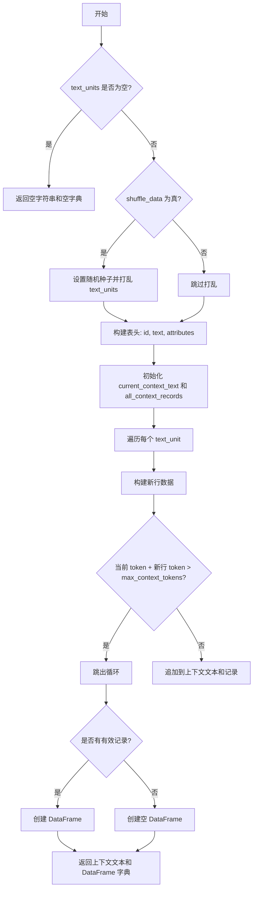
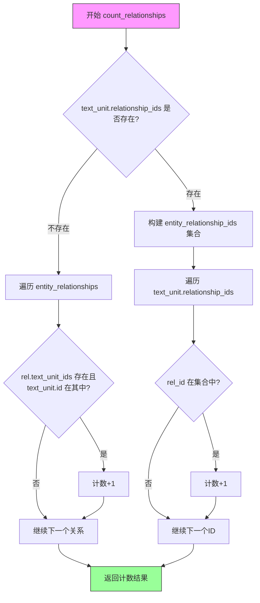

# `graphrag\packages\graphrag\graphrag\query\context_builder\source_context.py` 详细设计文档

该文件是GraphRAG系统中用于构建搜索系统提示词上下文数据的工具模块，主要提供两个函数：一个用于将文本单元列表格式化为带表头的文本上下文（支持token限制和随机打乱），另一个用于统计特定文本单元关联的关系数量。

## 整体流程

```mermaid
graph TD
    A[开始 build_text_unit_context] --> B{text_units为空?}
    B -- 是 --> C[返回空字符串和空字典]
    B -- 否 --> D{shuffle_data=True?}
    D -- 是 --> E[设置随机种子并打乱text_units]
    D -- 否 --> F[跳过打乱]
E --> F
F --> G[构建表头: id, text, attribute_cols]
G --> H[初始化current_context_text和current_tokens]
H --> I[遍历每个text_unit]
I --> J{current_tokens + new_tokens > max_context_tokens?}
J -- 是 --> K[退出循环]
J -- 否 --> L[追加上下文文本和记录]
L --> I
K --> M{有数据记录?}
M -- 是 --> N[创建DataFrame]
M -- 否 --> O[创建空DataFrame]
N --> P[返回(上下文文本, {context_name: DataFrame})]
O --> P
Q[开始 count_relationships] --> R{text_unit.relationship_ids为空?}
R -- 是 --> S[遍历entity_relationships统计匹配]
R -- 否 --> T[构建entity_relationship_ids集合]
T --> U[统计text_unit.relationship_ids中的匹配数量]
S --> V[返回计数结果]
U --> V
```

## 类结构

```
该文件为纯工具函数模块，无类层次结构
包含2个模块级函数:
├── build_text_unit_context
└── count_relationships
```

## 全局变量及字段


### `text_units`
    
输入的文本单元列表，用于构建上下文

类型：`list[TextUnit]`
    


### `tokenizer`
    
分词器实例，如果为None则自动获取

类型：`Tokenizer | None`
    


### `column_delimiter`
    
列分隔符，用于格式化输出表格

类型：`str`
    


### `shuffle_data`
    
是否打乱数据顺序的标志

类型：`bool`
    


### `max_context_tokens`
    
最大上下文token数量限制

类型：`int`
    


### `context_name`
    
上下文名称，用于生成表头

类型：`str`
    


### `random_state`
    
随机种子，确保结果可复现

类型：`int`
    


### `current_context_text`
    
累积构建的上下文文本

类型：`str`
    


### `header`
    
表格列名列表

类型：`list[str]`
    


### `attribute_cols`
    
文本单元的属性列名

类型：`list[str]`
    


### `current_tokens`
    
当前上下文的token计数

类型：`int`
    


### `all_context_records`
    
所有上下文记录列表

类型：`list[list[str]]`
    


### `new_context`
    
单个文本单元的上下文记录

类型：`list[str]`
    


### `new_context_text`
    
单个文本单元的上下文文本

类型：`str`
    


### `new_tokens`
    
新文本单元的token数量

类型：`int`
    


### `record_df`
    
转换后的DataFrame格式记录

类型：`pd.DataFrame`
    


### `entity_relationships`
    
实体关系列表

类型：`list[Relationship]`
    


### `text_unit`
    
文本单元对象

类型：`TextUnit`
    


### `entity_relationship_ids`
    
关系ID集合，用于快速查找

类型：`set[str]`
    


    

## 全局函数及方法


### `build_text_unit_context`

该函数将文本单元（TextUnit）列表转换为适合作为搜索系统提示上下文的格式化表格数据，同时控制 token 数量以避免超出模型限制。

参数：

- `text_units`：`list[TextUnit]`，待处理的文本单元对象列表
- `tokenizer`：`Tokenizer | None`，分词器实例，用于计算 token 数量，默认为 None（自动获取）
- `column_delimiter`：`str`，列分隔符，默认为 "|" 
- `shuffle_data`：`bool`，是否打乱数据顺序，默认为 True
- `max_context_tokens`：`int`，最大上下文 token 数，默认为 8000
- `context_name`：`str`，上下文名称，用于生成表头，默认为 "Sources"
- `random_state`：`int`，随机种子，确保结果可复现，默认为 86

返回值：`tuple[str, dict[str, pd.DataFrame]]`，返回格式化后的上下文文本和以小写上下文名称为键、DataFrame 为值的字典

#### 流程图



#### 带注释源码

```python
def build_text_unit_context(
    text_units: list[TextUnit],
    tokenizer: Tokenizer | None = None,
    column_delimiter: str = "|",
    shuffle_data: bool = True,
    max_context_tokens: int = 8000,
    context_name: str = "Sources",
    random_state: int = 86,
) -> tuple[str, dict[str, pd.DataFrame]]:
    """Prepare text-unit data table as context data for system prompt."""
    # 获取分词器，如果未提供则自动获取默认分词器
    tokenizer = tokenizer or get_tokenizer()
    
    # 处理空输入情况，直接返回空结果
    if text_units is None or len(text_units) == 0:
        return ("", {})

    # 如果需要打乱数据，使用固定随机种子确保可复现性
    if shuffle_data:
        random.seed(random_state)
        random.shuffle(text_units)

    # 添加上下文区域的分隔标题
    current_context_text = f"-----{context_name}-----" + "\n"

    # 构建表头：先包含 id 和 text，再添加属性列（排除已在基础列中的）
    header = ["id", "text"]
    attribute_cols = (
        list(text_units[0].attributes.keys()) if text_units[0].attributes else []
    )
    attribute_cols = [col for col in attribute_cols if col not in header]
    header.extend(attribute_cols)

    # 将表头添加到上下文文本中
    current_context_text += column_delimiter.join(header) + "\n"
    # 记录当前已使用的 token 数量（从表头开始计算）
    current_tokens = tokenizer.num_tokens(current_context_text)
    # 保存所有记录行，表头作为第一行
    all_context_records = [header]

    # 逐个处理文本单元，累积添加直到达到 token 上限
    for unit in text_units:
        # 构建单行数据：short_id, text, 以及各属性字段值
        new_context = [
            unit.short_id,
            unit.text,
            *[
                str(unit.attributes.get(field, "")) if unit.attributes else ""
                for field in attribute_cols
            ],
        ]
        # 将列表转换为分隔符分隔的字符串
        new_context_text = column_delimiter.join(new_context) + "\n"
        # 计算新增内容的 token 数量
        new_tokens = tokenizer.num_tokens(new_context_text)

        # 检查添加此行后是否超过最大 token 限制
        if current_tokens + new_tokens > max_context_tokens:
            break  # 超过限制，停止添加更多行

        # 未超限，累加到上下文中
        current_context_text += new_context_text
        all_context_records.append(new_context)
        current_tokens += new_tokens

    # 将记录列表转换为 pandas DataFrame
    if len(all_context_records) > 1:
        record_df = pd.DataFrame(
            all_context_records[1:], columns=cast("Any", all_context_records[0])
        )
    else:
        record_df = pd.DataFrame()
    
    # 返回格式化文本和以小写 context_name 为键的 DataFrame 字典
    return current_context_text, {context_name.lower(): record_df}
```

#### 潜在的技术债务或优化空间

1. **token 计算效率**：每次循环都调用 `tokenizer.num_tokens()`，可考虑批量预计算或缓存
2. **DataFrame 构建时机**：即使不需要 DataFrame 输出也会在最后构建，可改为按需生成
3. **属性字段处理**：仅基于第一个 text_unit 的属性构建表头，若后续单元属性不一致可能导致数据丢失
4. **硬编码的列过滤**：表头中排除 id 和 text 的逻辑是硬编码的，缺乏灵活性

#### 其它项目

**设计目标与约束**：
- 核心目标是将结构化文本单元转换为 LLM 可读的表格格式上下文
- 约束：输出 token 数量必须控制在 `max_context_tokens` 以内

**错误处理与异常设计**：
- 对空输入返回空字符串和空字典，而非抛出异常
- 依赖 pandas 和 tokenizer 库的底层异常传播机制

**数据流与状态机**：
- 输入：TextUnit 对象列表 → 处理：过滤、格式化、打乱 → 输出：格式化文本 + DataFrame
- 状态：初始 → 遍历中（累积 token） → 完成（达到上限或遍历完毕）

**外部依赖与接口契约**：
- 依赖 `graphrag_llm.tokenizer.Tokenizer` 接口
- 依赖 `graphrag.data_model.text_unit.TextUnit` 数据模型
- 依赖 `pandas` 库进行数据表格化


### `count_relationships`

统计与指定文本单元（TextUnit）关联的关系数量。该函数首先检查文本单元是否直接存储了关系ID列表：如果没有，则遍历所有实体关系，通过检查关系的`text_unit_ids`属性来判断关联性；如果有，则使用集合数据结构高效地计算匹配的关系ID数量。

参数：

- `entity_relationships`：`list[Relationship]`，实体关系列表，包含所有需要检查的关系对象
- `text_unit`：`TextUnit`，目标文本单元，用于查找与其关联的关系

返回值：`int`，返回与指定文本单元关联的关系数量

#### 流程图



#### 带注释源码

```python
def count_relationships(
    entity_relationships: list[Relationship], text_unit: TextUnit
) -> int:
    """Count the number of relationships of the selected entity that are associated with the text unit."""
    
    # 场景1：text_unit 没有直接存储 relationship_ids
    # 需要遍历所有关系，检查关系的 text_unit_ids 属性中是否包含当前 text_unit 的 id
    if not text_unit.relationship_ids:
        # 使用列表推导式统计关系数量
        # 条件：关系的 text_unit_ids 存在且包含当前文本单元的 id
        return sum(
            1
            for rel in entity_relationships
            if rel.text_unit_ids and text_unit.id in rel.text_unit_ids
        )

    # 场景2：text_unit 直接存储了关联的关系 ID 列表
    # 使用集合数据结构来加速查找（特别是在关系列表很大的情况下）
    # 将所有关系的 id 转换为集合，便于 O(1) 时间复杂度的查找
    entity_relationship_ids = {rel.id for rel in entity_relationships}

    # 遍历 text_unit 中存储的关系 ID，统计在 entity_relationships 中存在的数量
    # 这种方式比遍历整个关系列表更高效
    return sum(
        1 for rel_id in text_unit.relationship_ids if rel_id in entity_relationship_ids
    )
```

## 关键组件


### 文本单元上下文构建器

负责将文本单元列表转换为系统提示的上下文数据表，包含表头和记录，支持令牌数限制、属性列扩展和数据洗牌。

### 关系计数功能

提供高效的关联关系数量统计，支持两种模式：通过文本单元ID列表匹配，或遍历关系列表检查关联性，并针对大数据集优化使用集合查询。

### 分词器集成模块

集成Tokenizer分词器用于计算令牌数，支持自定义分词器或自动获取默认分词器，实现文本到令牌数量的转换。

### 令牌计数与限制机制

实现动态令牌预算管理，在构建上下文时逐个累加记录令牌数，当超过max_context_tokens阈值时停止添加，确保输出不超出大模型上下文窗口。

### 数据洗牌策略

支持可配置的数据随机化，通过random_state固定随机种子确保可复现性，允许在保持结果一致性的前提下打乱文本单元顺序。

### 属性列动态处理

自动从文本单元提取属性列，排除预设的id和text列，支持动态扩展表头和对应字段值。


## 问题及建议


### 已知问题

-   **时间复杂度问题**：`count_relationships` 函数在 `text_unit.relationship_ids` 为空时，使用嵌套循环遍历所有关系，时间复杂度为 O(n*m)，其中 n 是文本单元关系数，m 是实体关系数，即使 `text_unit.relationship_ids` 存在，也会在每次调用时重新创建集合。
-   **重复计算性能开销**：`build_text_unit_context` 中每次循环都调用 `tokenizer.num_tokens(new_context_text)` 和 `tokenizer.num_tokens(current_context_text)`，当文本单元数量很大时会产生显著的性能开销。
-   **魔法数字和硬编码值**：随机种子 `random_state=86` 硬编码在函数签名中，降低了函数的灵活性和可测试性。
-   **属性访问重复**：循环中对 `unit.attributes.get(field, "")` 的重复调用，对于大型属性字典可能造成不必要的开销。
-   **边界条件处理不完善**：仅检查 `text_units` 是否为空，未处理 `text_units[0]` 为 None 或 `text_units[0].attributes` 为 None 的情况，可能导致 AttributeError。
-   **类型转换开销**：使用 `cast("Any", ...)` 表明类型系统使用不够精确，这可能是技术债务的信号。
-   **DataFrame 构建逻辑冗余**：在 `all_context_records` 长度大于 1 时才构建 DataFrame，但空 DataFrame 的情况未明确处理，可能导致调用方需要额外的空值检查。
-   **函数职责不单一**：`build_text_unit_context` 同时返回字符串和 DataFrame 两种形式的数据，增加了函数的复杂度。

### 优化建议

-   **优化 `count_relationships` 性能**：将集合创建逻辑提取到函数外部，或使用 `functools.lru_cache` 缓存实体关系 ID 集合，避免每次调用都重新创建。
-   **批量计算 Token 数量**：考虑使用分词器的批量接口，或预先计算每个文本单元的 token 数量并缓存，避免在循环中重复调用。
-   **提取配置常量**：将 `random_state=86`、`max_context_tokens=8000` 等魔法数字提取为模块级常量或配置参数。
-   **增强边界条件检查**：在访问 `text_units[0]` 之前添加更严格的验证，确保列表不为空且元素有效。
-   **改进类型标注**：移除不必要的 `cast` 调用，确保类型标注准确，或使用 `Protocol` 定义更精确的接口。
-   **简化 DataFrame 构建**：统一处理空和非空情况，使用更清晰的逻辑返回 DataFrame。
-   **考虑函数拆分**：将上下文文本构建和 DataFrame 构建分离为独立函数，提高函数的可测试性和复用性。
-   **使用生成器模式**：对于大型文本单元列表，考虑使用生成器代替一次性加载所有记录到内存。


## 其它


### 设计目标与约束

本模块的设计目标是为搜索系统提供文本单元（TextUnit）的上下文数据，将结构化的文本单元转换为系统提示（system prompt）中可用的表格格式。主要约束包括：1）最大上下文token数限制（默认8000），确保不超出LLM的上下文窗口；2）依赖确定性随机（random_state=86）以保证结果可复现；3）列过滤排除["id", "text"]避免重复；4）仅处理非空文本单元列表。

### 错误处理与异常设计

代码中包含以下错误处理逻辑：1）空文本单元列表检查：`if text_units is None or len(text_units) == 0` 时返回空字符串和空字典；2）Token计算使用外部Tokenizer的`num_tokens`方法，依赖其内部错误处理；3）属性字段访问使用`.get()`方法避免KeyError；4）DataFrame创建时处理空记录情况（`len(all_context_records) > 1`检查）。潜在改进：可添加tokenizer为None且get_tokenizer()失败时的异常处理，以及max_context_tokens过小时的边界情况处理。

### 数据流与状态机

数据流处理流程：1）输入验证阶段 → 检查text_units是否为空；2）数据预处理阶段 → 可选shuffle操作（确定性随机）；3）表头构建阶段 → 合并默认列["id", "text"]与动态属性列；4）迭代构建阶段 → 逐条记录添加，同时累加token计数；5）终止条件 → 达到max_context_tokens上限；6）输出转换阶段 → 列表转换为DataFrame。状态转换由token计数阈值控制，break条件`current_tokens + new_tokens > max_context_tokens`确保不超出限制。

### 外部依赖与接口契约

本模块依赖以下外部组件：1）`graphrag_llm.tokenizer.Tokenizer` - Token计数抽象接口，需实现`num_tokens(text: str) -> int`方法；2）`graphrag.data_model.relationship.Relationship` - 关系数据模型，需包含`id`和`text_unit_ids`字段；3）`graphrag.data_model.text_unit.TextUnit` - 文本单元数据模型，需包含`short_id`、`text`、`attributes`、`relationship_ids`字段；4）`graphrag.tokenizer.get_tokenizer` - Tokenizer工厂函数，返回Tokenizer实例；5）`pandas`库 - DataFrame数据结构。接口契约：get_tokenizer()在tokenizer参数为None时被调用；Relationship的text_unit_ids可为None或list类型。

### 性能考虑与优化空间

当前实现存在以下性能考量：1）每条记录都调用`tokenizer.num_tokens()`，可考虑批量预计算；2）字符串拼接使用`+=`操作符，在大规模数据下效率较低，可改用list join；3）count_relationships函数中对大列表使用set转换优化查找性能（代码已实现）；4）属性字典遍历使用列表推导式，效率尚可。优化空间：1）预计算所有record的token数，避免循环内重复计算；2）使用StringIO替代字符串拼接；3）可考虑添加缓存机制存储已计算的上下文。

### 配置参数说明

| 参数名 | 类型 | 默认值 | 说明 |
|--------|------|--------|------|
| text_units | list[TextUnit] | 必填 | 待处理的文本单元列表 |
| tokenizer | Tokenizer \| None | None | 自定义分词器，为None时自动获取 |
| column_delimiter | str | "|" | CSV格式的列分隔符 |
| shuffle_data | bool | True | 是否打乱数据顺序 |
| max_context_tokens | int | 8000 | 上下文最大token数限制 |
| context_name | str | "Sources" | 上下文表头名称 |
| random_state | int | 86 | 随机种子，确保可复现性 |

### 边界条件处理

代码处理的边界条件包括：1）空输入：text_units为None或空列表返回("", {})；2）单条记录：DataFrame列从header获取；3）属性为空：unit.attributes为None时使用空字符串填充；4）属性列不存在：使用.get()方法返回空字符串；5）token超限：精确在max_context_tokens边界时允许添加最后一条记录。潜在边界问题：若text_units[0]无attributes属性，attribute_cols可能为空列表；max_context_tokens小于单条记录token数时返回空表。

### 使用示例

```python
# 基本用法
text_units = [TextUnit(id="1", text="内容A", attributes={"source": "doc1"}), ...]
context_text, context_data = build_text_unit_context(text_units)

# 自定义配置
context_text, context_data = build_text_unit_context(
    text_units,
    tokenizer=custom_tokenizer,
    column_delimiter=",",
    shuffle_data=False,
    max_context_tokens=4000,
    context_name="Documents",
    random_state=42
)

# 关系计数
relationships = [Relationship(id="r1", text_unit_ids=["1", "2"]), ...]
count = count_relationships(relationships, text_unit)
```

### 模块职责与边界

本模块（graphrag.context_builder）职责：1）将TextUnit列表转换为LLM可消费的表格化上下文；2）提供关系计数的辅助功能；3）封装token预算管理逻辑。不负责：1）TextUnit/Relationship模型的定义和验证；2）Tokenizer的具体实现；3）LLM调用和响应处理；4）持久化存储逻辑。模块边界清晰，遵循单一职责原则，仅专注于上下文数据的构建和格式化。


    