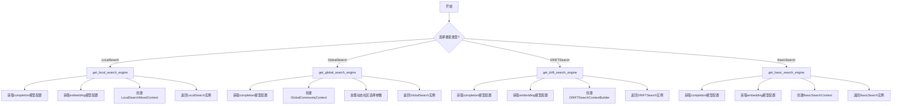
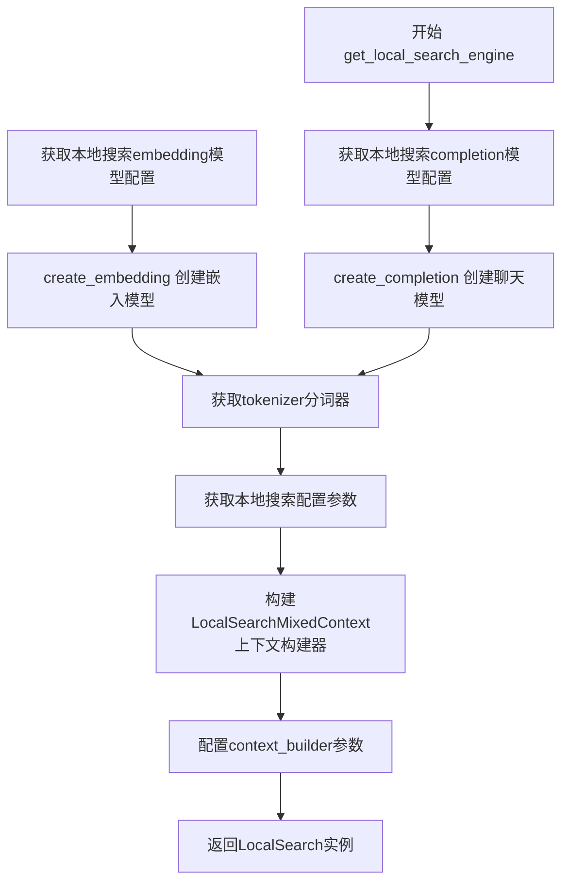
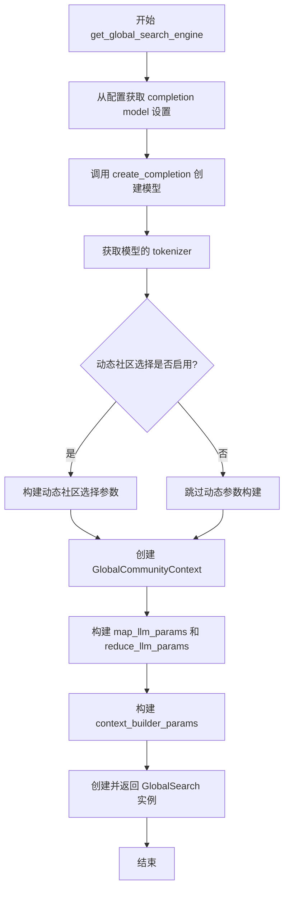
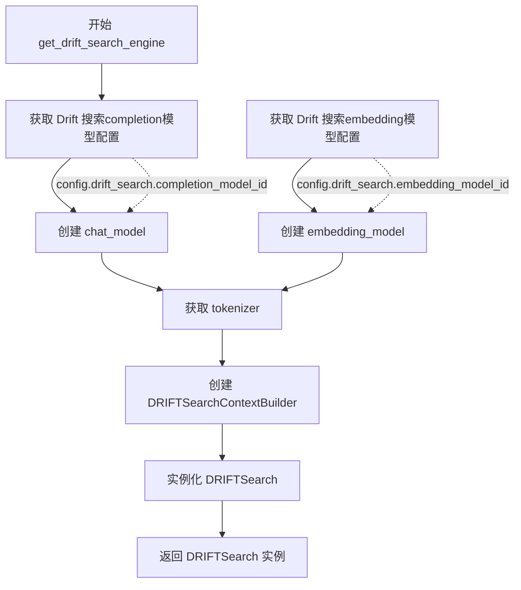
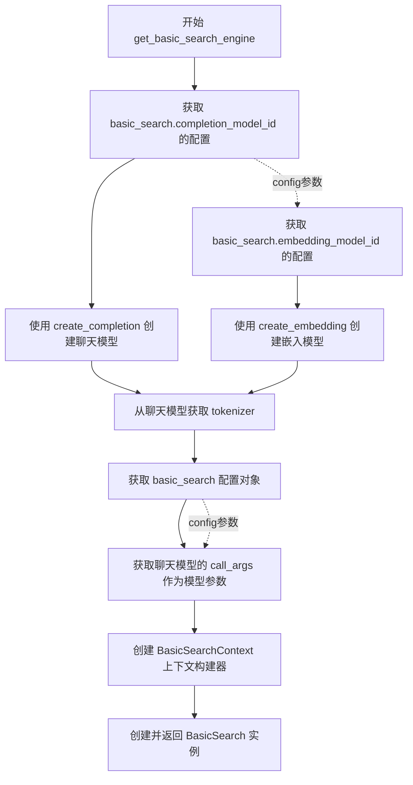

# `graphrag\packages\graphrag\graphrag\query\factory.py` 详细设计文档

该文件是GraphRAG项目的查询工厂模块，提供了四个工厂函数用于创建不同类型的搜索引擎（本地搜索、全局搜索、漂移搜索和基本搜索），每种搜索引擎都基于配置和数据模型构建相应的上下文和模型参数。

## 整体流程



## 类结构

```
Query Factory (模块级)
├── get_local_search_engine (工厂函数)
├── get_global_search_engine (工厂函数)
├── get_drift_search_engine (工厂函数)
└── get_basic_search_engine (工厂函数)
```

## 全局变量及字段


### `create_completion`
    
创建LLM完成模型的工厂函数

类型：`function`
    


### `create_embedding`
    
创建嵌入模型的工厂函数

类型：`function`
    


### `VectorStore`
    
向量存储抽象类，用于存储和检索向量嵌入

类型：`class`
    


### `QueryCallbacks`
    
查询回调接口，用于处理查询过程中的事件

类型：`class`
    


### `GraphRagConfig`
    
GraphRAG配置模型，包含系统所有配置项

类型：`class`
    


### `Community`
    
社区数据模型，表示图中的社区实体

类型：`class`
    


### `CommunityReport`
    
社区报告数据模型，包含社区的摘要信息

类型：`class`
    


### `Covariate`
    
协变量数据模型，表示实体相关的额外信息

类型：`class`
    


### `Entity`
    
实体数据模型，表示图中的节点实体

类型：`class`
    


### `Relationship`
    
关系数据模型，表示实体之间的边

类型：`class`
    


### `TextUnit`
    
文本单元数据模型，表示处理后的文本块

类型：`class`
    


### `EntityVectorStoreKey`
    
实体向量存储键枚举，定义向量存储的索引键类型

类型：`class`
    


### `LocalSearch`
    
本地搜索引擎，基于局部上下文进行问答

类型：`class`
    


### `LocalSearchMixedContext`
    
本地搜索混合上下文构建器

类型：`class`
    


### `GlobalSearch`
    
全局搜索引擎，使用社区报告进行全局推理

类型：`class`
    


### `GlobalCommunityContext`
    
全局搜索社区上下文构建器

类型：`class`
    


### `DRIFTSearch`
    
漂移搜索引擎，支持多轮探索性搜索

类型：`class`
    


### `DRIFTSearchContextBuilder`
    
漂移搜索上下文构建器

类型：`class`
    


### `BasicSearch`
    
基础搜索引擎，基于向量相似度进行搜索

类型：`class`
    


### `BasicSearchContext`
    
基础搜索上下文构建器

类型：`class`
    


    

## 全局函数及方法


### `get_local_search_engine`

创建一个基于数据+配置的本地搜索引擎（LocalSearch），用于执行图谱驱动的本地查询操作。

参数：

- `config`：`GraphRagConfig`，全局配置对象，包含本地搜索的模型配置和参数
- `reports`：`list[CommunityReport]`，社区报告列表，用于提供社区级别的上下文信息
- `text_units`：`list[TextUnit]`，文本单元列表，作为搜索的基本数据单元
- `entities`：`list[Entity]`，实体列表，包含图谱中的实体节点
- `relationships`：`list[Relationship]`，关系列表，包含图谱中的实体关系边
- `covariates`：`dict[str, list[Covariate]]`，协变量字典，按类型键组织的协变量数据
- `response_type`：`str`，响应类型字符串，指定搜索结果的输出格式类型
- `description_embedding_store`：`VectorStore`，描述嵌入向量存储，用于实体描述的向量检索
- `system_prompt`：`str | None`，可选的系统提示词，用于自定义搜索行为
- `callbacks`：`list[QueryCallbacks] | None`，可选的查询回调函数列表，用于钩子扩展

返回值：`LocalSearch`，本地搜索引擎实例，用于执行本地化的图谱查询

#### 流程图



#### 带注释源码

```python
def get_local_search_engine(
    config: GraphRagConfig,
    reports: list[CommunityReport],
    text_units: list[TextUnit],
    entities: list[Entity],
    relationships: list[Relationship],
    covariates: dict[str, list[Covariate]],
    response_type: str,
    description_embedding_store: VectorStore,
    system_prompt: str | None = None,
    callbacks: list[QueryCallbacks] | None = None,
) -> LocalSearch:
    """Create a local search engine based on data + configuration."""
    # 从配置中获取本地搜索使用的completion模型配置
    model_settings = config.get_completion_model_config(
        config.local_search.completion_model_id
    )

    # 使用工厂函数创建聊天Completion模型实例
    chat_model = create_completion(model_settings)

    # 从配置中获取本地搜索使用的embedding模型配置
    embedding_settings = config.get_embedding_model_config(
        config.local_search.embedding_model_id
    )

    # 使用工厂函数创建嵌入模型实例
    embedding_model = create_embedding(embedding_settings)

    # 从聊天模型中获取tokenizer用于分词和token计数
    tokenizer = chat_model.tokenizer

    # 获取本地搜索的特定配置
    ls_config = config.local_search

    # 从模型设置中提取调用参数
    model_params = model_settings.call_args

    # 创建并返回LocalSearch搜索引擎实例
    return LocalSearch(
        model=chat_model,
        system_prompt=system_prompt,
        # 构建本地搜索混合上下文，包含实体、关系、报告等多种数据源
        context_builder=LocalSearchMixedContext(
            community_reports=reports,
            text_units=text_units,
            entities=entities,
            relationships=relationships,
            covariates=covariates,
            entity_text_embeddings=description_embedding_store,
            # 设置向量存储键为ID（如果向量存储使用实体标题作为ID，则设为EntityVectorStoreKey.TITLE）
            embedding_vectorstore_key=EntityVectorStoreKey.ID,
            text_embedder=embedding_model,
            tokenizer=tokenizer,
        ),
        tokenizer=tokenizer,
        model_params=model_params,
        # 配置上下文构建器的详细参数
        context_builder_params={
            "text_unit_prop": ls_config.text_unit_prop,
            "community_prop": ls_config.community_prop,
            "conversation_history_max_turns": ls_config.conversation_history_max_turns,
            "conversation_history_user_turns_only": True,
            "top_k_mapped_entities": ls_config.top_k_entities,
            "top_k_relationships": ls_config.top_k_relationships,
            "include_entity_rank": True,
            "include_relationship_weight": True,
            "include_community_rank": False,
            "return_candidate_context": False,
            "embedding_vectorstore_key": EntityVectorStoreKey.ID,
            "max_context_tokens": ls_config.max_context_tokens,
        },
        response_type=response_type,
        callbacks=callbacks,
    )
```


### `get_global_search_engine`

该函数用于根据提供的配置、数据实体、社区报告和可选提示创建一个全局搜索引擎（GlobalSearch），支持动态社区选择功能，以实现更灵活的知识图谱查询。

参数：

- `config`：`GraphRagConfig`，全局配置对象，包含模型和搜索相关配置
- `reports`：`list[CommunityReport]`，社区报告列表，用于构建搜索上下文
- `entities`：`list[Entity]`，实体列表，提供图谱中的实体信息
- `communities`：`list[Community]`，社区列表，用于社区级别的检索
- `response_type`：`str`，响应类型，指定返回结果的格式或类型
- `dynamic_community_selection`：`bool`，默认为 False，是否启用动态社区选择
- `map_system_prompt`：`str | None`，默认为 None，Map 阶段的系统提示词
- `reduce_system_prompt`：`str | None`，默认为 None，Reduce 阶段的系统提示词
- `general_knowledge_inclusion_prompt`：`str | None`，默认为 None，通用知识包含提示词
- `callbacks`：`list[QueryCallbacks] | None`，默认为 None，查询回调函数列表

返回值：`GlobalSearch`，返回配置好的全局搜索引擎实例

#### 流程图



#### 带注释源码

```python
def get_global_search_engine(
    config: GraphRagConfig,
    reports: list[CommunityReport],
    entities: list[Entity],
    communities: list[Community],
    response_type: str,
    dynamic_community_selection: bool = False,
    map_system_prompt: str | None = None,
    reduce_system_prompt: str | None = None,
    general_knowledge_inclusion_prompt: str | None = None,
    callbacks: list[QueryCallbacks] | None = None,
) -> GlobalSearch:
    """Create a global search engine based on data + configuration."""
    
    # 从配置中获取全局搜索的 completion model 设置
    model_settings = config.get_completion_model_config(
        config.global_search.completion_model_id
    )

    # 使用工厂方法创建 completion 模型实例
    model = create_completion(model_settings)

    # 提取模型的调用参数，用于后续 LLM 调用
    model_params = model_settings.call_args

    # 获取模型关联的 tokenizer，用于文本分词
    tokenizer = model.tokenizer
    
    # 获取全局搜索的配置对象
    gs_config = config.global_search

    # 初始化动态社区选择参数字典
    dynamic_community_selection_kwargs = {}
    
    # 如果启用动态社区选择功能
    if dynamic_community_selection:
        # TODO: 允许为全局搜索单独定义 LLM 以使用 -mini 模型
        
        # 构建动态社区选择所需的参数
        dynamic_community_selection_kwargs.update({
            "model": model,  # 使用的模型
            "tokenizer": tokenizer,  # 分词器
            "keep_parent": gs_config.dynamic_search_keep_parent,  # 是否保留父社区
            "num_repeats": gs_config.dynamic_search_num_repeats,  # 重复次数
            "use_summary": gs_config.dynamic_search_use_summary,  # 是否使用摘要
            "concurrent_coroutines": config.concurrent_requests,  # 并发协程数
            "threshold": gs_config.dynamic_search_threshold,  # 阈值
            "max_level": gs_config.dynamic_search_max_level,  # 最大层级
            "model_params": {**model_params},  # 模型参数副本
        })

    # 返回配置完整的 GlobalSearch 实例
    return GlobalSearch(
        model=model,  # LLM 模型
        map_system_prompt=map_system_prompt,  # Map 阶段系统提示
        reduce_system_prompt=reduce_system_prompt,  # Reduce 阶段系统提示
        general_knowledge_inclusion_prompt=general_knowledge_inclusion_prompt,  # 通用知识提示
        # 创建全局社区上下文构建器
        context_builder=GlobalCommunityContext(
            community_reports=reports,  # 社区报告
            communities=communities,  # 社区列表
            entities=entities,  # 实体列表
            tokenizer=tokenizer,  # 分词器
            dynamic_community_selection=dynamic_community_selection,  # 动态选择开关
            dynamic_community_selection_kwargs=dynamic_community_selection_kwargs,  # 动态选择参数
        ),
        tokenizer=tokenizer,  # 分词器
        max_data_tokens=gs_config.data_max_tokens,  # 最大数据 token 数
        map_llm_params={**model_params},  # Map 阶段 LLM 参数
        reduce_llm_params={**model_params},  # Reduce 阶段 LLM 参数
        map_max_length=gs_config.map_max_length,  # Map 阶段最大长度
        reduce_max_length=gs_config.reduce_max_length,  # Reduce 阶段最大长度
        allow_general_knowledge=False,  # 是否允许通用知识
        json_mode=False,  # 是否使用 JSON 模式
        # 上下文构建器参数配置
        context_builder_params={
            "use_community_summary": False,  # 不使用社区摘要
            "shuffle_data": True,  # 打乱数据顺序
            "include_community_rank": True,  # 包含社区排名
            "min_community_rank": 0,  # 最小社区排名
            "community_rank_name": "rank",  # 社区排名字段名
            "include_community_weight": True,  # 包含社区权重
            "community_weight_name": "occurrence weight",  # 社区权重字段名
            "normalize_community_weight": True,  # 归一化社区权重
            "max_context_tokens": gs_config.max_context_tokens,  # 最大上下文 token 数
            "context_name": "Reports",  # 上下文名称
        },
        concurrent_coroutines=config.concurrent_requests,  # 并发协程数
        response_type=response_type,  # 响应类型
        callbacks=callbacks,  # 回调函数列表
    )
```


### `get_drift_search_engine`

该函数用于创建基于数据配置的 DRIFT（Deep Retrieval and Interactive Exploration）搜索引擎，支持多轮对话式搜索，通过本地和降维系统提示词灵活处理实体、关系和文本单元的上下文构建。

参数：

- `config`：`GraphRagConfig`，全局配置对象，包含搜索模型和嵌入模型的配置信息
- `reports`：`list[CommunityReport]`，社区报告列表，用于提供社区级别的上下文信息
- `text_units`：`list[TextUnit]`，文本单元列表，包含待检索的文本片段
- `entities`：`list[Entity]`，实体列表，包含图谱中的实体节点
- `relationships`：`list[Relationship]`，关系列表，包含图谱中的实体关系边
- `description_embedding_store`：`VectorStore`，实体描述的向量存储，用于语义相似度检索
- `response_type`：`str`，响应类型，决定输出格式（如 "single_column"、"table" 等）
- `local_system_prompt`：`str | None`，可选的本地搜索系统提示词，用于定制本地搜索行为
- `reduce_system_prompt`：`str | None`，可选的降维系统提示词，用于定制降维处理逻辑
- `callbacks`：`list[QueryCallbacks] | None`，可选的查询回调函数列表，用于监控和处理搜索过程中的事件

返回值：`DRIFTSearch`，返回配置好的 DRIFT 搜索引擎实例

#### 流程图



#### 带注释源码

```python
def get_drift_search_engine(
    config: GraphRagConfig,
    reports: list[CommunityReport],
    text_units: list[TextUnit],
    entities: list[Entity],
    relationships: list[Relationship],
    description_embedding_store: VectorStore,
    response_type: str,
    local_system_prompt: str | None = None,
    reduce_system_prompt: str | None = None,
    callbacks: list[QueryCallbacks] | None = None,
) -> DRIFTSearch:
    """Create a local search engine based on data + configuration."""
    # 从配置中获取 Drift 搜索使用的 LLM 模型配置
    chat_model_settings = config.get_completion_model_config(
        config.drift_search.completion_model_id
    )

    # 使用工厂函数创建 LLM 实例
    chat_model = create_completion(chat_model_settings)

    # 从配置中获取嵌入模型配置
    embedding_model_settings = config.get_embedding_model_config(
        config.drift_search.embedding_model_id
    )

    # 创建嵌入模型实例
    embedding_model = create_embedding(embedding_model_settings)

    # 从 LLM 获取分词器
    tokenizer = chat_model.tokenizer

    # 返回配置完整的 DRIFTSearch 引擎实例
    return DRIFTSearch(
        model=chat_model,  # LLM 模型实例
        context_builder=DRIFTSearchContextBuilder(
            model=chat_model,  # 用于构建上下文的 LLM
            text_embedder=embedding_model,  # 文本嵌入器
            entities=entities,  # 实体列表
            relationships=relationships,  # 关系列表
            reports=reports,  # 社区报告
            entity_text_embeddings=description_embedding_store,  # 实体向量存储
            text_units=text_units,  # 文本单元
            local_system_prompt=local_system_prompt,  # 本地搜索提示词
            reduce_system_prompt=reduce_system_prompt,  # 降维提示词
            config=config.drift_search,  # Drift 搜索配置
            response_type=response_type,  # 响应类型
        ),
        tokenizer=tokenizer,  # 分词器
        callbacks=callbacks,  # 回调函数
    )
```


### `get_basic_search_engine`

该函数用于根据提供的文本单元、文本嵌入、配置和响应类型创建一个基础搜索引擎（BasicSearch）。它首先从配置中获取聊天模型和嵌入模型的设置，然后创建相应的模型实例，最后使用这些组件构建并返回一个配置好的BasicSearch对象。

参数：

- `text_units`：`list[TextUnit]`，包含用于搜索的文本单元列表
- `text_unit_embeddings`：`VectorStore`，存储文本单元嵌入向量的向量数据库
- `config`：`GraphRagConfig`，图RAG的全局配置对象
- `response_type`：`str`，期望的响应类型或格式
- `system_prompt`：`str | None`，可选的系统提示词，用于引导模型行为，默认为None
- `callbacks`：`list[QueryCallbacks] | None`，可选的查询回调函数列表，用于在查询过程中执行自定义逻辑，默认为None

返回值：`BasicSearch`，返回配置好的基础搜索引擎实例

#### 流程图



#### 带注释源码

```python
def get_basic_search_engine(
    text_units: list[TextUnit],                    # 文本单元列表，提供搜索的原始文本数据
    text_unit_embeddings: VectorStore,             # 文本单元的向量嵌入存储，用于语义搜索
    config: GraphRagConfig,                        # GraphRAG全局配置，包含各搜索模式的配置参数
    response_type: str,                           # 响应类型，指定输出格式或风格
    system_prompt: str | None = None,             # 可选的系统提示词，用于定制聊天模型行为
    callbacks: list[QueryCallbacks] | None = None,# 可选的查询回调，用于监控或修改查询过程
) -> BasicSearch:
    """Create a basic search engine based on data + configuration."""
    
    # 从配置中获取basic_search模块的completion模型设置
    # 包括模型ID、温度、最大token数等参数
    chat_model_settings = config.get_completion_model_config(
        config.basic_search.completion_model_id
    )

    # 使用工厂函数创建聊天Completion模型实例
    # 该模型用于生成自然语言响应
    chat_model = create_completion(chat_model_settings)

    # 从配置中获取basic_search模块的embedding模型设置
    # 嵌入模型用于将文本转换为向量表示
    embedding_model_settings = config.get_embedding_model_config(
        config.basic_search.embedding_model_id
    )

    # 使用工厂函数创建嵌入模型实例
    # 用于计算文本的语义向量
    embedding_model = create_embedding(embedding_model_settings)

    # 从聊天模型获取分词器，用于文本 tokenization
    # 分词器在上下文构建中用于计算token数量
    tokenizer = chat_model.tokenizer

    # 获取basic_search模块的专用配置对象
    # 包含k值、最大上下文token数等参数
    bs_config = config.basic_search

    # 获取模型的调用参数，如temperature、max_tokens等
    # 这些参数将传递给模型用于控制生成行为
    model_params = chat_model_settings.call_args

    # 构建并返回BasicSearch搜索引擎实例
    # 包含聊天模型、上下文构建器、分词器等核心组件
    return BasicSearch(
        model=chat_model,                                      # 用于生成响应的聊天模型
        system_prompt=system_prompt,                          # 自定义系统提示
        response_type=response_type,                          # 期望的响应类型
        context_builder=BasicSearchContext(                   # 上下文构建器，管理搜索上下文
            text_embedder=embedding_model,                   # 文本嵌入器
            text_unit_embeddings=text_unit_embeddings,       # 文本单元向量存储
            text_units=text_units,                            # 原始文本单元
            tokenizer=tokenizer,                              # 分词器
        ),
        tokenizer=tokenizer,                                  # 用于token计数
        model_params=model_params,                            # 模型生成参数
        context_builder_params={                              # 上下文构建器的参数
            "embedding_vectorstore_key": "id",               # 向量存储使用的键类型
            "k": bs_config.k,                                 # 检索的top-k结果数
            "max_context_tokens": bs_config.max_context_tokens, # 最大上下文token限制
        },
        callbacks=callbacks,                                  # 查询回调函数
    )
```

## 关键组件


### LocalSearch (本地搜索)

基于图谱数据的本地搜索引擎，结合社区报告、文本单元、实体、关系和协变量进行上下文构建，支持实体描述嵌入和关系权重计算。

### GlobalSearch (全局搜索)

全局搜索引擎，支持动态社区选择（dynamic_community_selection），通过Map-Reduce模式处理大规模图谱数据，可配置并发协程数和阈值。

### DRIFTSearch (漂移搜索)

结合本地和全局搜索的混合搜索方式，使用DRIFTSearchContextBuilder构建上下文，支持本地和减少（reduce）两阶段提示词。

### BasicSearch (基础搜索)

基于向量嵌入的简单搜索，通过BasicSearchContext进行文本单元检索，支持k近邻搜索和token限制。

### VectorStore (向量存储)

用于存储和检索实体描述嵌入和文本单元嵌入，支持ID或TITLE作为向量键。

### EntityVectorStoreKey (实体向量存储键)

枚举类型，定义向量存储的键类型（ID或TITLE），用于在不同搜索模式间切换实体匹配策略。

### GraphRagConfig (图谱配置)

包含本地搜索、全局搜索、DRIFT搜索和基础搜索的详细配置，如模型ID、嵌入模型ID、top_k参数、上下文token限制等。

### QueryCallbacks (查询回调)

查询执行过程中的回调接口，用于监控和处理查询生命周期事件。


## 问题及建议


### 已知问题

-   **代码重复**：多个搜索工厂函数（get_local_search_engine、get_global_search_engine、get_drift_search_engine、get_basic_search_engine）存在大量重复模式，如获取模型配置、创建completion模型、embedding模型和tokenizer的逻辑几乎相同，可抽象为通用工厂方法。
-   **硬编码参数**：在 get_local_search_engine 中存在多处硬编码的配置参数，如 `conversation_history_user_turns_only=True`、`include_entity_rank=True`、`include_community_rank=False`、`return_candidate_context=False` 等，这些应该通过配置文件或参数传入，增加灵活性。
-   **TODO 技术债务**：get_global_search_engine 函数中包含TODO注释 "# TODO: Allow for another llm definition only for Global Search to leverage -mini models"，表明当前全局搜索未实现使用不同LLM模型的能力。
-   **参数传递冗余**：model_params 先从 model_settings.call_args 获取，随后在创建搜索对象时又通过 `{**model_params}` 展开传递，造成不必要的数据复制和冗余。
-   **缺乏输入验证**：所有工厂函数都没有对输入参数（如 reports、text_units、entities 等列表）进行空值检查或类型验证，可能导致运行时错误。
-   **配置访问分散**：config.local_search、config.global_search、config.drift_search、config.basic_search 的访问方式分散在各个函数中，缺乏统一的配置获取抽象层。
-   **重复的 embedding_vectorstore_key 注释**：EntityVectorStoreKey.ID 和 EntityVectorStoreKey.TITLE 的说明在代码注释中重复出现两次，可提取为常量或配置说明。

### 优化建议

-   **提取通用工厂逻辑**：创建一个通用的 `_create_search_components` 函数，负责处理模型创建、embedding创建、tokenizer获取等通用逻辑，各搜索工厂函数只需调用此函数并专注于特定配置。
-   **配置驱动硬编码值**：将硬编码的布尔参数（如 include_entity_rank、conversation_history_user_turns_only 等）提取到 GraphRagConfig 配置类中，通过配置文件或初始化参数控制。
-   **实现 TODO 需求**：在 GraphRagConfig 中添加 global_search 专用的 completion_model_id 字段，允许全局搜索使用独立的轻量级模型（如 -mini 版本）。
-   **简化参数传递**：直接使用 model_settings.call_args 替代 model_params 变量，或在配置类中直接存储解析后的参数字典。
-   **添加参数验证**：在工厂函数入口处添加必要的输入验证，如检查必要列表是否为空、config对象是否有效等，并提供清晰的错误信息。
-   **统一配置访问层**：在 GraphRagConfig 类中添加通用方法如 `get_search_config(search_type: str)` 返回对应的搜索配置对象，减少代码中的条件分支。
-   **提取常量**：将 "id"、"title"、EntityVectorStoreKey 等常量提取为模块级常量或枚举，避免注释中的重复说明。

## 其它


### 设计目标与约束

本模块的设计目标是提供统一的查询引擎工厂方法，支持四种不同的搜索策略（本地搜索、全局搜索、漂移搜索、基本搜索），以便在GraphRAG系统中根据不同场景选择合适的查询方式。设计约束包括：1）必须依赖GraphRagConfig进行配置管理；2）所有搜索引擎都需要支持callbacks机制用于监控和扩展；3）需要从配置中获取模型参数和tokenizer；4）所有引擎创建方法遵循相同的函数签名模式。

### 错误处理与异常设计

代码中未显式包含错误处理逻辑，但潜在异常场景包括：1）config中未配置相应的completion_model_id或embedding_model_id时，get_completion_model_config和get_embedding_model_config可能返回None或抛出KeyError；2）VectorStore或create_completion/create_embedding返回无效对象时，后续使用可能失败；3）tokenizer为None时会导致后续传参失败。建议添加：参数验证、默认值回退机制、try-except包装关键调用、详细的错误日志记录。

### 数据流与状态机

数据流如下：调用方传入配置和数据（reports、text_units、entities、relationships、covariates等）→ 工厂函数获取模型配置 → 创建chat_model和embedding_model → 根据配置构建context_builder → 实例化对应的Search对象。各Search对象内部状态转换：初始化 → 构建context（提取相关实体/关系/文本单元） → 调用LLM生成响应。状态机由各Search类内部管理，工厂函数仅负责实例化。

### 外部依赖与接口契约

主要外部依赖包括：1）graphrag_llm.completion.create_completion - 创建LLM聊天模型；2）graphrag_llm.embedding.create_embedding - 创建embedding模型；3）graphrag_vectors.VectorStore - 向量存储接口；4）各Search类（LocalSearch、GlobalSearch、DRIFTSearch、BasicSearch）- 搜索策略实现。接口契约：所有工厂函数返回对应Search实例；config必须包含相应的completion_model_id、embedding_model_id配置；VectorStore必须支持相似度查询。

### 性能考虑

性能关键点：1）模型参数通过model_settings.call_args传递，需注意深拷贝避免意外修改；2）tokenizer的获取依赖模型实例，应缓存复用；3）dynamic_community_selection启用时会进行额外的并发协程处理；4）context_builder_params中的max_context_tokens需根据实际模型token限制合理设置。建议优化：考虑添加模型和embedding实例缓存、异步加载机制、配置预验证。

### 安全性考虑

代码本身为工厂方法，安全性依赖下游：1）system_prompt参数允许调用方注入自定义提示词，需确保可信；2）callbacks机制允许执行自定义逻辑，需限制权限；3）配置中的模型参数可能包含敏感信息（如API密钥），应避免日志泄露。建议：添加system_prompt内容校验、敏感配置脱敏、callbacks执行权限控制。

### 配置管理

配置通过GraphRagConfig统一管理，各搜索类型在config中对应独立配置块（local_search、global_search、drift_search、basic_search），包含：completion_model_id、embedding_model_id、max_context_tokens、top_k_entities、top_k_relationships等参数。配置采用链式获取方式：config.get_completion_model_config()和config.get_embedding_model_config()。建议：添加配置Schema验证、配置变更热重载支持、配置版本兼容性检查。

### 扩展性设计

扩展点包括：1）新增搜索类型只需添加新的工厂函数和对应的Search类；2）callbacks机制支持在搜索前后插入自定义逻辑；3）system_prompt参数支持自定义提示词工程；4）dynamic_community_selection支持运行时社区选择策略调整。建议：提供抽象基类或协议规范新搜索类型实现、配置驱动的新搜索插件机制。

    