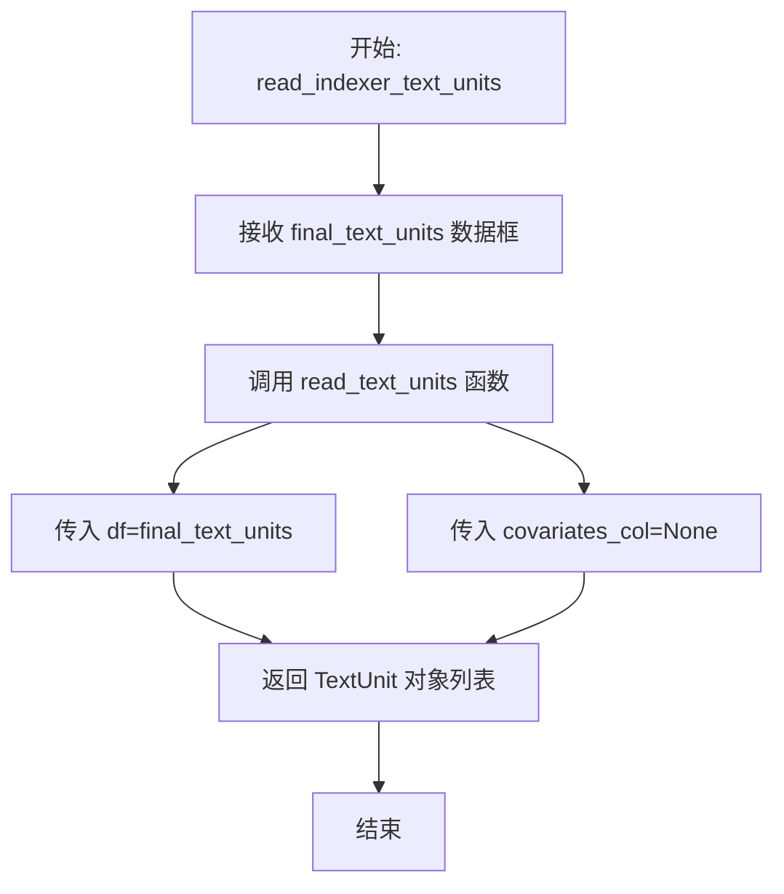
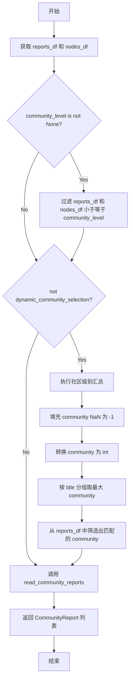
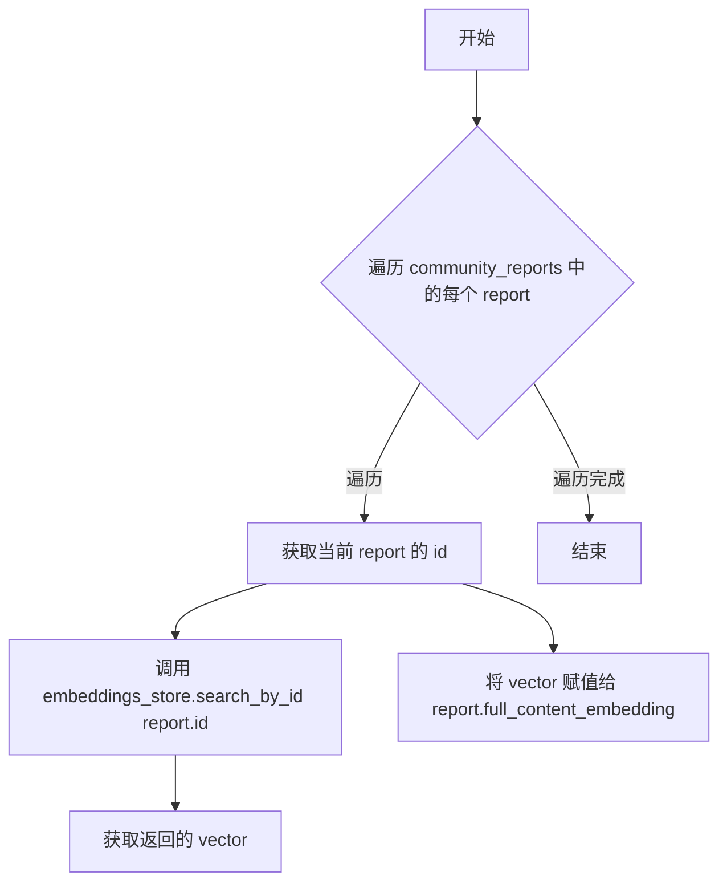
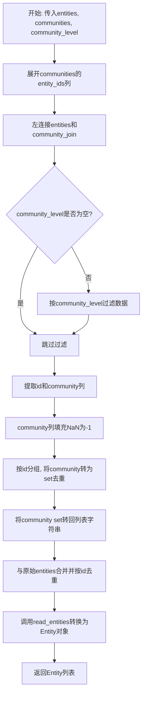
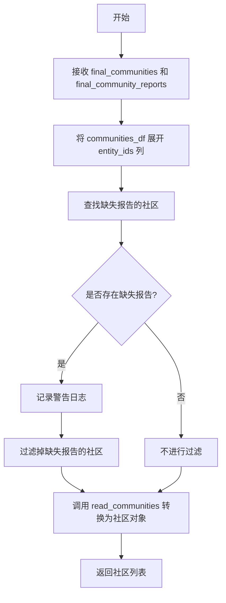
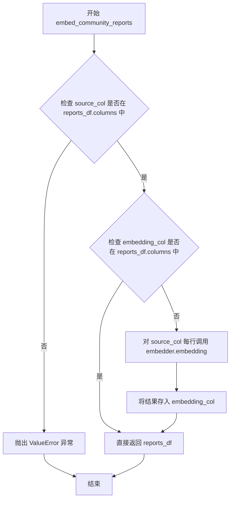
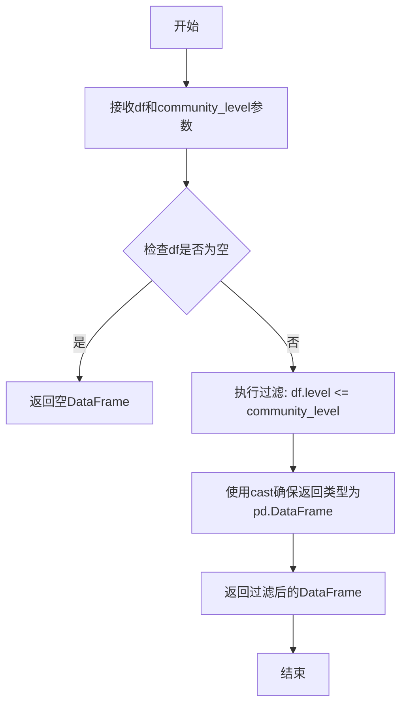

# `graphrag\packages\graphrag\graphrag\query\indexer_adapters.py` 详细设计文档

这是一个索引引擎的查询读取适配器模块，负责将原始索引输出（DataFrame格式）转换为领域模型对象（TextUnit、Covariate、Relationship、Entity、Community、CommunityReport），同时支持社区级别过滤、嵌入向量处理和社区层级重建等功能。

## 整体流程

```mermaid
graph TD
    A[开始] --> B[接收原始DataFrame输入]
    B --> C{数据类型?}
    C --> D[TextUnits]
    C --> E[Covariates]
    C --> F[Relationships]
    C --> G[Entities + Communities]
    C --> H[Communities + Reports]
    C --> I[CommunityReports]
    D --> D1[read_indexer_text_units]
    D1 --> D2[read_text_units]
    D2 --> D3[返回list[TextUnit]]
    E --> E1[read_indexer_covariates]
    E1 --> E2[read_covariates]
    E2 --> E3[返回list[Covariate]]
    F --> F1[read_indexer_relationships]
    F1 --> F2[read_relationships]
    F2 --> F3[返回list[Relationship]]
    G --> G1[read_indexer_entities]
    G1 --> G2[explode entity_ids并合并community]
    G2 --> G3{community_level过滤?}]
    G3 -- 是 --> G4[_filter_under_community_level]
    G3 -- 否 --> G5[groupby聚合community]
    G4 --> G5
    G5 --> G6[read_entities]
    G6 --> G7[返回list[Entity]]
    H --> H1[read_indexer_communities]
    H1 --> H2[检查missing_reports]
    H2 --> H3[read_communities]
    H3 --> H4[返回list[Community]]
    I --> I1[read_indexer_reports]
    I1 --> I2{explode entity_ids}]
    I2 --> I3{community_level过滤?}]
    I3 -- 是 --> I4[_filter_under_community_level]
    I3 -- 否 --> I5{动态选择?}]
    I4 --> I5
    I5 -- 否 --> I6[社区级别聚合roll-up]
    I5 -- 是 --> I7[read_community_reports]
    I6 --> I7
    I7 --> I8[返回list[CommunityReport]]
    I8 --> I9[可选: read_indexer_report_embeddings]
    I9 --> I10[从VectorStore加载embedding]
    I10 --> I11[可选: embed_community_reports]
    I11 --> I12[使用LLMEmbedding生成embedding]
```

## 类结构

```
无类定义 (纯函数模块)
├── 数据模型导入 (graphrag.data_model)
│   ├── TextUnit
│   ├── Covariate
│   ├── Relationship
│   ├── Entity
│   ├── Community
│   └── CommunityReport
├── 读取适配器函数
read_indexer_text_units
read_indexer_covariates
read_indexer_relationships
read_indexer_reports
read_indexer_report_embeddings
read_indexer_entities
read_indexer_communities
├── 嵌入处理函数
embed_community_reports
└── 辅助工具函数
    └── _filter_under_community_level
```

## 全局变量及字段


### `logger`
    
模块级日志记录器，用于记录模块运行过程中的警告和调试信息

类型：`logging.Logger`
    


    

## 全局函数及方法


### `read_indexer_text_units`

从原始索引输出中读取文本单元（Text Units），将其转换为 TextUnit 对象列表。

参数：

- `final_text_units`：`pd.DataFrame`，包含原始索引输出的文本单元数据

返回值：`list[TextUnit]`，文本单元对象列表

#### 流程图



#### 带注释源码

```python
def read_indexer_text_units(final_text_units: pd.DataFrame) -> list[TextUnit]:
    """Read in the Text Units from the raw indexing outputs."""
    # 调用 read_text_units 函数，将 DataFrame 转换为 TextUnit 对象列表
    # covariates_col 设置为 None，表示不包含协变量映射
    return read_text_units(
        df=final_text_units,
        # expects a covariate map of type -> ids
        covariates_col=None,
    )
```


### `read_indexer_covariates`

从原始索引输出中读取Claims（索赔/声明）数据，将其转换为协变量对象列表。

参数：

- `final_covariates`：`pd.DataFrame`，原始协变量数据，包含id、human_readable_id、object_id、status、start_date、end_date、description等列

返回值：`list[Covariate]`，转换后的协变量对象列表

#### 流程图

```mermaid
flowchart TD
    A[开始: read_indexer_covariates] --> B[接收 final_covariates DataFrame]
    B --> C[将 id 列转换为字符串类型]
    C --> D[调用 read_covariates 函数]
    D --> E[传入参数: df=covariate_df]
    D --> F[传入参数: short_id_col='human_readable_id']
    D --> G[传入参数: attributes_cols=['object_id', 'status', 'start_date', 'end_date', 'description']]
    D --> H[传入参数: text_unit_ids_col=None]
    E --> I[返回 list[Covariate] 对象列表]
    F --> I
    G --> I
    H --> I
    I --> J[结束]
```

#### 带注释源码

```python
def read_indexer_covariates(final_covariates: pd.DataFrame) -> list[Covariate]:
    """Read in the Claims from the raw indexing outputs."""
    # 将输入的DataFrame赋值给局部变量
    covariate_df = final_covariates
    # 确保id列是字符串类型，以保持数据一致性
    covariate_df["id"] = covariate_df["id"].astype(str)
    # 调用read_covariates函数将DataFrame转换为Covariate对象列表
    return read_covariates(
        df=covariate_df,
        short_id_col="human_readable_id",  # 人类可读ID列名
        attributes_cols=[
            "object_id",     # 关联对象ID
            "status",        # 状态
            "start_date",    # 开始日期
            "end_date",      # 结束日期
            "description",   # 描述
        ],
        text_unit_ids_col=None,  # 文本单元ID列，设为None表示不关联
    )
```


### `read_indexer_relationships`

从原始索引输出中读取关系数据，并将其转换为 Relationship 对象列表。

参数：

- `final_relationships`：`pd.DataFrame`，包含从索引管道输出的原始关系数据

返回值：`list[Relationship]`：转换后的 Relationship 对象列表

#### 流程图

```mermaid
flowchart TD
    A[开始 read_indexer_relationships] --> B[接收 final_relationships DataFrame]
    B --> C[调用 read_relationships 函数]
    C --> D[传入参数: df=final_relationships]
    C --> E[传入参数: short_id_col='human_readable_id']
    C --> F[传入参数: rank_col='combined_degree']
    C --> G[传入参数: description_embedding_col=None]
    C --> H[传入参数: attributes_cols=None]
    H --> I[返回 list[Relationship]]
    I --> J[结束]
```

#### 带注释源码

```python
def read_indexer_relationships(final_relationships: pd.DataFrame) -> list[Relationship]:
    """Read in the Relationships from the raw indexing outputs."""
    # 调用 read_relationships 函数将 DataFrame 转换为 Relationship 对象列表
    # 参数说明：
    # - df: 输入的关系数据 DataFrame
    # - short_id_col: 用于生成人类可读短ID的列名
    # - rank_col: 用于排序的度数列名
    # - description_embedding_col: 描述嵌入列（此处设为None，不包含嵌入向量）
    # - attributes_cols: 属性列（此处设为None，使用默认属性）
    return read_relationships(
        df=final_relationships,
        short_id_col="human_readable_id",
        rank_col="combined_degree",
        description_embedding_col=None,
        attributes_cols=None,
    )
```


### `read_indexer_reports`

从原始索引输出中读取社区报告（Community Reports）。如果未启用动态社区选择，则选择实体所属的最大社区级别的报告。

参数：

- `final_community_reports`：`pd.DataFrame`，原始索引输出的社区报告数据
- `final_communities`：`pd.DataFrame`，原始索引输出的社区数据
- `community_level`：`int | None`，用于过滤的社区级别
- `dynamic_community_selection`：`bool = False`，是否启用动态社区选择

返回值：`list[CommunityReport]`，社区报告对象列表

#### 流程图



#### 带注释源码

```python
def read_indexer_reports(
    final_community_reports: pd.DataFrame,
    final_communities: pd.DataFrame,
    community_level: int | None,
    dynamic_community_selection: bool = False,
) -> list[CommunityReport]:
    """Read in the Community Reports from the raw indexing outputs.

    If not dynamic_community_selection, then select reports with the max community level that an entity belongs to.
    """
    # 获取社区报告 DataFrame
    reports_df = final_community_reports
    # 将 entity_ids 列展开为多行，创建节点 DataFrame
    nodes_df = final_communities.explode("entity_ids")

    # 如果指定了社区级别，则过滤小于等于该级别的数据
    if community_level is not None:
        nodes_df = _filter_under_community_level(nodes_df, community_level)
        reports_df = _filter_under_community_level(reports_df, community_level)

    # 如果未启用动态社区选择，则执行社区级别汇总
    if not dynamic_community_selection:
        # 执行社区级别汇总
        # 将 community 列中的 NaN 值填充为 -1
        nodes_df.loc[:, "community"] = nodes_df["community"].fillna(-1)
        # 将 community 转换为整数类型
        nodes_df.loc[:, "community"] = nodes_df["community"].astype(int)

        # 按 title 分组，取每个实体的最大 community 值
        nodes_df = nodes_df.groupby(["title"]).agg({"community": "max"}).reset_index()
        # 获取去重后的 community 列表
        filtered_community_df = nodes_df["community"].drop_duplicates()

        # 合并过滤后的社区报告，保留只在 filtered_community_df 中的 community
        reports_df = reports_df.merge(
            filtered_community_df, on="community", how="inner"
        )

    # 调用 read_community_reports 将 DataFrame 转换为 CommunityReport 对象列表
    return read_community_reports(df=reports_df, id_col="id", short_id_col="community")
```


### `read_indexer_report_embeddings`

该函数用于将社区报告（Community Report）的向量嵌入从向量存储（VectorStore）中读取出来，并填充到每个社区报告对象的 `full_content_embedding` 属性中。

参数：

- `community_reports`：`list[CommunityReport]`，待填充嵌入向量的社区报告列表
- `embeddings_store`：`VectorStore`，用于查询嵌入向量的向量存储接口

返回值：`None`，该函数直接修改传入的 `community_reports` 列表中的对象属性，无返回值

#### 流程图



#### 带注释源码

```python
def read_indexer_report_embeddings(
    community_reports: list[CommunityReport],
    embeddings_store: VectorStore,
):
    """Read in the Community Reports from the raw indexing outputs."""
    # 遍历每一个社区报告对象
    for report in community_reports:
        # 根据报告的 id 在向量存储中搜索对应的嵌入向量
        # 并将其赋值给报告的 full_content_embedding 属性
        report.full_content_embedding = embeddings_store.search_by_id(report.id).vector
```


### `read_indexer_entities`

从原始索引输出中读取实体数据，将DataFrame格式的实体和社区信息转换为Entity对象列表。该函数负责数据整合、社区级别过滤和去重，最终通过read_entities函数将处理后的数据转换为领域模型中的Entity对象。

参数：

- `entities`：`pd.DataFrame`，原始实体数据框，包含实体的基本信息（如id、title、type等）
- `communities`：`pd.DataFrame`，社区数据框，包含社区与实体的关联关系（entity_ids字段）
- `community_level`：`int | None`，可选的社区级别过滤参数，用于筛选不超过指定级别的实体

返回值：`list[Entity]`，转换后的实体对象列表

#### 流程图



#### 带注释源码

```python
def read_indexer_entities(
    entities: pd.DataFrame,
    communities: pd.DataFrame,
    community_level: int | None,
) -> list[Entity]:
    """Read in the Entities from the raw indexing outputs."""
    # 1. 展开communities数据框中的entity_ids列，将每个entity_id展开为独立行
    # 2. 只保留community、level、entity_ids三列用于后续关联
    community_join = communities.explode("entity_ids").loc[
        :, ["community", "level", "entity_ids"]
    ]
    
    # 3. 将entities与community_join进行左连接，以id字段关联entity表的id与community表的entity_ids
    #    这样可以为每个实体关联其所属的社区信息
    nodes_df = entities.merge(
        community_join, left_on="id", right_on="entity_ids", how="left"
    )

    # 4. 如果指定了community_level，则过滤掉level大于community_level的记录
    if community_level is not None:
        nodes_df = _filter_under_community_level(nodes_df, community_level)

    # 5. 只保留id和community两列用于后续处理
    nodes_df = nodes_df.loc[:, ["id", "community"]]
    
    # 6. 将community列中的NaN值填充为-1，表示该实体不属于任何社区
    nodes_df["community"] = nodes_df["community"].fillna(-1)
    
    # 7. 按id分组，对每个实体的community进行set化处理以去除重复的community ID
    #    这样可以确保每个实体只保留唯一的社区列表
    nodes_df = nodes_df.groupby(["id"]).agg({"community": set}).reset_index()
    
    # 8. 将community set中的每个元素转换为字符串整数形式
    nodes_df["community"] = nodes_df["community"].apply(
        lambda x: [str(int(i)) for i in x]
    )
    
    # 9. 再次与原始entities数据合并，使用inner join并按id去重
    #    确保最终数据只包含有效的实体记录
    final_df = nodes_df.merge(entities, on="id", how="inner").drop_duplicates(
        subset=["id"]
    )
    
    # 10. 调用read_entities函数将处理后的DataFrame转换为Entity领域模型对象列表
    return read_entities(
        df=final_df,
        id_col="id",
        title_col="title",
        type_col="type",
        short_id_col="human_readable_id",
        description_col="description",
        community_col="community",
        rank_col="degree",
        name_embedding_col=None,
        description_embedding_col="description_embedding",
        text_unit_ids_col="text_unit_ids",
    )
```


### `read_indexer_communities`

该函数从原始索引输出中读取社区数据，验证每个社区是否存在对应的社区报告，过滤掉没有报告的社区，并将社区层级信息添加到子社区字段中，最终返回重构的 Community 对象列表。

参数：

- `final_communities`：`pd.DataFrame`，原始索引输出的社区数据
- `final_community_reports`：`pd.DataFrame`，原始索引输出的社区报告数据

返回值：`list[Community]`，从索引输出中重构的社区对象列表

#### 流程图



#### 带注释源码

```python
def read_indexer_communities(
    final_communities: pd.DataFrame,
    final_community_reports: pd.DataFrame,
) -> list[Community]:
    """Read in the Communities from the raw indexing outputs.

    Reconstruct the community hierarchy information and add to the sub-community field.
    """
    # 将输入数据赋值给局部变量
    communities_df = final_communities
    # 展开 entity_ids 列，每行对应一个实体
    nodes_df = communities_df.explode("entity_ids")
    reports_df = final_community_reports

    # 确保社区与社区报告相匹配，找出缺少报告的社区
    missing_reports = communities_df[
        ~communities_df.community.isin(reports_df.community.unique())
    ].community.to_list()
    # 如果存在缺失报告的社区
    if len(missing_reports):
        # 记录警告日志
        logger.warning("Missing reports for communities: %s", missing_reports)
        # 过滤掉缺失报告的社区数据
        communities_df = communities_df.loc[
            communities_df.community.isin(reports_df.community.unique())
        ]
        nodes_df = nodes_df.loc[nodes_df.community.isin(reports_df.community.unique())]

    # 调用 read_communities 将 DataFrame 转换为 Community 对象列表
    return read_communities(
        communities_df,
        id_col="id",
        short_id_col="community",
        title_col="title",
        level_col="level",
        entities_col=None,
        relationships_col=None,
        covariates_col=None,
        parent_col="parent",
        children_col="children",
        attributes_cols=None,
    )
```


### `embed_community_reports`

该函数用于将社区报告数据框中的指定文本列转换为嵌入向量，通过调用 LLM 嵌入器对每一行内容进行向量化处理，并将结果存储在指定的嵌入列中，最终返回包含嵌入向量的更新后数据框。

参数：

- `reports_df`：`pd.DataFrame`，待嵌入的社区报告数据框
- `embedder`：`LLMEmbedding`，用于生成文本嵌入向量的嵌入器实例
- `source_col`：`str`，要嵌入的文本列名，默认为 "full_content"
- `embedding_col`：`str`，存储嵌入向量的目标列名，默认为 "full_content_embedding"

返回值：`pd.DataFrame`，添加嵌入向量列后的数据框

#### 流程图



#### 带注释源码

```python
def embed_community_reports(
    reports_df: pd.DataFrame,
    embedder: "LLMEmbedding",
    source_col: str = "full_content",
    embedding_col: str = "full_content_embedding",
) -> pd.DataFrame:
    """Embed a source column of the reports dataframe using the given embedder."""
    # 检查数据框中是否存在指定的源文本列，若不存在则抛出错误
    if source_col not in reports_df.columns:
        error_msg = f"Reports missing {source_col} column"
        raise ValueError(error_msg)

    # 如果嵌入列不存在，则对源文本列的每一行进行向量化处理
    if embedding_col not in reports_df.columns:
        # 使用 embedder 对每行文本生成嵌入向量
        # loc[:, source_col] 选取整列，apply 对每行应用 lambda 函数
        reports_df[embedding_col] = reports_df.loc[:, source_col].apply(
            lambda x: embedder.embedding(input=[x]).first_embedding
        )

    # 返回包含嵌入向量的数据框
    return reports_df
```


### `_filter_under_community_level`

该函数是一个私有辅助函数，用于根据社区级别（community_level）过滤数据框，只保留级别（level）小于或等于指定阈值的记录，常用于在读取索引数据时筛选特定社区层级的数据。

参数：

- `df`：`pd.DataFrame`，需要过滤的pandas数据框，必须包含`level`列
- `community_level`：`int`，社区级别阈值，筛选条件为`level <= community_level`

返回值：`pd.DataFrame`，过滤后的数据框，只包含`level`值小于或等于指定`community_level`的行

#### 流程图



#### 带注释源码

```python
def _filter_under_community_level(
    df: pd.DataFrame, community_level: int
) -> pd.DataFrame:
    """根据社区级别过滤数据框，只保留level小于等于指定community_level的记录。

    Args:
        df: pandas DataFrame对象，必须包含'level'列用于过滤
        community_level: int类型，社区级别阈值

    Returns:
        pd.DataFrame: 过滤后的数据框，只包含level <= community_level的记录
    """
    # 使用布尔索引过滤数据，保留level列值小于等于community_level的行
    # df[df.level <= community_level] 创建布尔掩码，只保留满足条件的行
    # cast用于类型提示，确保返回类型被正确识别为pd.DataFrame
    return cast(
        "pd.DataFrame",
        df[df.level <= community_level],
    )
```

## 关键组件


### 索引引擎核心功能

这段代码是图谱检索系统的索引引擎核心模块，负责将原始索引输出的pandas DataFrame数据转换为知识模型对象（Entity、Relationship、Community、CommunityReport、TextUnit、Covariate），支持社区级别过滤、动态社区选择、嵌入向量填充等操作。

### read_indexer_text_units

从原始索引输出DataFrame读取TextUnit列表，调用read_text_units将DataFrame转换为TextUnit模型对象。

### read_indexer_covariates

从原始协变量DataFrame读取Covariate列表，对id列进行字符串类型转换，提取属性列（object_id、status、start_date、end_date、description）并调用read_covariates转换为模型对象。

### read_indexer_relationships

从原始关系DataFrame读取Relationship列表，使用human_readable_id作为短ID，combined_degree作为排序列，调用read_relationships转换为模型对象。

### read_indexer_reports

从原始社区报告DataFrame和社区DataFrame读取CommunityReport列表。支持社区级别过滤和动态社区选择逻辑：当不使用动态选择时，执行社区级别汇总，按title分组取最大community值，然后过滤报告。

### read_indexer_report_embeddings

为社区报告填充嵌入向量。从VectorStore中根据report.id查询嵌入向量，赋值给report.full_content_embedding字段。

### read_indexer_entities

从实体DataFrame和社区DataFrame读取Entity列表。执行实体与社区的左连接，对社区进行汇总去重，将社区ID集合转换为字符串列表，最后调用read_entities转换为模型对象。

### read_indexer_communities

从社区DataFrame和社区报告DataFrame读取Community列表。执行数据验证确保每个社区都有对应的报告，记录缺失报告的警告信息，重建社区层级结构（parent/children），调用read_communities转换为模型对象。

### embed_community_reports

使用给定的嵌入器对报告DataFrame的指定列进行向量化处理。检查源列和嵌入列是否存在，如不存在则调用embedder.embedding生成嵌入向量并添加到DataFrame。

### _filter_under_community_level

辅助过滤函数，根据community_level过滤DataFrame，返回level小于等于指定值的记录。


## 问题及建议


### 已知问题

-   **DataFrame操作效率低**：在`read_indexer_entities`中对`community`列先调用`fillna(-1)`再调用`astype(int)`，进行了两次冗余操作；在`read_indexer_entities`中使用`apply`配合lambda函数进行类型转换，未使用向量化操作影响性能。
-   **缺乏输入验证**：多个函数（如`read_indexer_text_units`、`read_indexer_covariates`等）未对输入的DataFrame进行空值或类型检查，可能导致运行时错误。
-   **魔法字符串和硬编码**：多处使用硬编码的列名（如"human_readable_id"、"community"、"level"等），维护性差，容易因上游数据Schema变化而失效。
-   **副作用设计**：`read_indexer_report_embeddings`函数直接修改传入的`CommunityReport`对象的内部状态（`full_content_embedding`），不符合函数式编程原则，可能导致意外的副作用。
-   **类型转换过度使用**：在`_filter_under_community_level`函数中使用`cast`进行类型转换，暗示类型安全存在隐患，应在数据源头确保类型正确。
-   **重复的DataFrame处理逻辑**：多个`read_indexer_*`函数中包含相似的DataFrame预处理逻辑（如列选择、类型转换、过滤等），代码重复度高，可抽象为通用工具函数。
-   **隐式依赖与顺序依赖**：函数间存在隐式的数据流依赖（如`read_indexer_reports`需要先调用`read_indexer_communities`处理后的数据），缺乏明确的接口契约文档。

### 优化建议

-   **合并DataFrame操作**：将`fillna`和`astype`合并为一次操作，使用`fillna(-1).astype(int)`；将lambda函数替换为`map`或向量化操作以提升性能。
-   **添加输入验证**：在函数入口处添加DataFrame空值检查、必需列存在性验证，以及类型提示的运行时检查。
-   **提取配置常量**：将硬编码的列名提取为模块级常量或配置对象，提高代码可维护性。
-   **重构为无副作用设计**：将`read_indexer_report_embeddings`改为返回新的`CommunityReport`对象列表，而非修改原对象。
-   **消除不必要的类型转换**：确保上游数据在进入此模块前已具有正确的类型，减少或移除`cast`的使用。
-   **抽象通用逻辑**：提取DataFrame预处理逻辑（如爆炸列、合并、过滤）为可复用的工具函数，减少代码重复。
-   **完善文档与接口契约**：为每个函数添加详细的参数说明、异常抛出条件，以及函数间的数据流依赖关系文档。

## 其它


### 设计目标与约束

本模块的设计目标是将索引引擎的原始输出（存储在DataFrame中）转换为GraphRAG的对象模型（Entity、Relationship、Community等），以便后续查询流程使用。核心约束包括：1) 依赖pandas作为数据转换媒介，这些类型适配、重命名、整理操作最终应被移除，理想情况下应直接读取到对象模型；2) 社区报告和实体的过滤基于community_level参数；3) 动态社区选择模式下不执行社区级别的聚合操作。

### 错误处理与异常设计

代码中的错误处理采用以下策略：1) 在`embed_community_reports`函数中，当指定的source_col不存在时抛出ValueError异常，并包含明确的错误信息（如"Reports missing {source_col} column"）；2) 使用Python标准库的logging模块记录警告信息，如`read_indexer_communities`中检测到缺失社区报告时使用`logger.warning`；3) 类型转换使用`cast`进行显式类型标注；4) 函数文档字符串中未明确声明异常传播，调用方需注意DataFrame结构不匹配可能引发的pandas异常。

### 数据流与状态机

数据流主要分为三条路径：路径一（实体/关系/文本单元）接收final_开头的DataFrame，经过列映射和类型转换后调用对应的read_函数生成对象列表；路径二（社区报告）接收final_community_reports和final_communities，根据community_level过滤后进行聚合操作，再调用read_community_reports；路径三（嵌入生成）接收reports_df和embedder，调用LLMEmbedding生成full_content_embedding列。无复杂状态机，主要为转换函数。

### 外部依赖与接口契约

本模块依赖以下外部组件：1) pandas库用于数据处理；2) graphrag_vectors.VectorStore用于读取社区报告嵌入；3) graphrag.data_model下的6个数据模型类（Community、CommunityReport、Covariate、Entity、Relationship、TextUnit）；4) graphrag.query.input.loaders.dfs模块下的6个read_函数作为核心转换器；5) graphrag_llm.embedding.LLMEmbedding用于生成文本嵌入。接口契约要求输入DataFrame必须包含特定列（如entities需要id、title、type等列），输出为对应的数据模型对象列表。

### 性能考虑与优化空间

当前实现存在以下性能考量：1) `read_indexer_entities`中多次使用merge和groupby操作，大数据量时可能存在性能瓶颈；2) `read_indexer_communities`中的`explode`操作和重复的isin过滤可优化；3) `embed_community_reports`使用apply逐行调用embedding，建议改为批量处理；4) 社区报告嵌入读取使用for循环遍历，可考虑向量化操作。优化空间包括：减少不必要的DataFrame复制、使用原地操作替代复制、合并重复的过滤逻辑、以及预留的TODO即将类型适配逻辑迁移到数据模型层。

### 配置与参数说明

模块级配置参数主要包括：read_indexer_reports中的community_level（int | None）用于过滤低于指定级别的社区，dynamic_community_selection（bool）控制是否启用动态社区选择；read_indexer_entities中的community_level同样用于过滤；embed_community_reports中的source_col（默认"full_content"）和embedding_col（默认"full_content_embedding"）用于指定嵌入列名。

### 测试策略建议

建议补充以下测试用例：1) 单元测试验证各read_indexer_*函数对标准DataFrame输入的输出正确性；2) 边界条件测试包括空DataFrame、缺失必需列、community_level为0或极大值等；3) 集成测试验证与下游数据模型对象的兼容性；4) 性能基准测试评估大数据集下的执行时间；5) 错误场景测试验证异常抛出和日志记录行为。

### 使用示例

典型使用流程为：首先从存储加载final_开头的CSV/Parquet文件为DataFrame，然后依次调用read_indexer_text_units、read_indexer_entities、read_indexer_relationships、read_indexer_reports、read_indexer_communities、read_indexer_covariates生成对应的对象列表，最后若需要嵌入则调用embed_community_reports或read_indexer_report_embeddings。

    