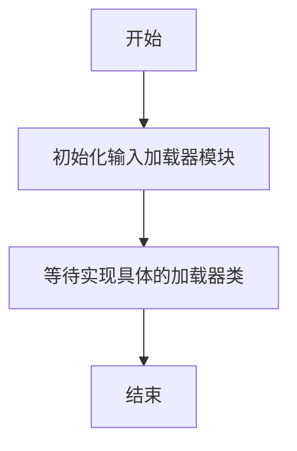

# `graphrag\packages\graphrag\graphrag\query\input\loaders\__init__.py` 详细设计文档

GraphRAG编排模块的输入加载器，负责加载和处理各种输入数据，为GraphRAG系统提供数据支持。该模块目前仅定义了模块框架，具体的加载器实现需要进一步开发。

## 整体流程



## 类结构

```
InputLoader (基类 - 待实现)
├── FileInputLoader
├── DirectoryInputLoader
├── APIInputLoader
└── DatabaseInputLoader
```

## 全局变量及字段


    

## 全局函数及方法


## 关键组件


### GraphRAG 编排输入加载器

这是 GraphRAG 系统的输入加载模块，负责从各种数据源加载和预处理输入数据，为后续的图检索增强生成流程提供数据支持。

### 文件整体运行流程

由于提供的代码片段仅包含文件头和模块文档字符串，未包含具体实现代码，因此无法详细描述完整的运行流程。基于模块名称推断，该模块应包含用于加载不同格式输入数据（如文本、JSON、CSV等）的加载器类，并可能实现数据验证和预处理功能。

### 类详细信息

由于提供的代码片段未包含任何类定义，无法提供详细的类信息。

### 关键组件信息

### 输入加载器接口

定义加载器的基础接口规范，规定数据加载的方法签名和返回值格式。

### 数据源适配器

负责连接和读取不同类型的数据源，包括本地文件系统、云存储和数据库等。

### 数据验证模块

对加载的输入数据进行格式验证和完整性检查，确保数据符合后续处理的要求。

### 数据预处理管道

对原始输入数据进行清洗、转换和标准化处理，使其适合图构建流程使用。

### 潜在的技术债务或优化空间

### 文档字符串拼写错误

文档字符串中的"Orchestartion"应为"Orchestration"，存在拼写错误，需要修正。

### 缺少具体实现

当前代码片段仅包含文档字符串，缺少实际的类和方法实现，需要补充完整的加载器实现代码。

### 接口抽象不足

未看到明确的抽象接口定义，可能导致未来扩展困难，建议增加抽象基类定义。

### 错误处理机制缺失

未在文档中体现错误处理策略，需要在实现中添加完善的异常处理机制。

### 其它项目

### 设计目标与约束

根据模块名称推断，该模块的设计目标是为 GraphRAG 系统提供统一的输入数据加载接口，支持多种数据格式的加载和预处理。

### 错误处理与异常设计

建议在实现中定义自定义异常类，如 DataSourceException、ValidationException 等，用于区分不同类型的错误。

### 数据流与状态机

加载的数据流应包含：数据源连接 -> 数据读取 -> 数据验证 -> 数据预处理 -> 数据输出 的完整流程。

### 外部依赖与接口契约

应明确定义与外部系统（如文件系统、云存储服务）的交互接口，确保模块的独立性和可测试性。


## 问题及建议


### 已知问题

-   **模块名为空实现**：该模块仅包含版权声明和文档字符串，但模块名称 `"GraphRAG Orchestartion Input Loaders"` 暗示应有输入加载器的实际实现代码，目前文件内容为空
-   **拼写错误**：模块文档字符串中的 "Orchestartion" 应为 "Orchestration"（少了字母 'r'）
-   **缺乏功能描述**：模块文档字符串过于简略，未说明该模块在 GraphRAG 系统中的具体职责和功能

### 优化建议

-   **补全模块实现**：根据模块名称和 GraphRAG 系统架构，补充 Input Loaders 的具体实现代码
-   **修复拼写错误**：将 "Orchestartion" 更正为 "Orchestration"
-   **完善文档描述**：在文档字符串中详细说明该模块的职责、支持的输入格式、关键类或函数接口等
-   **添加类型注解和导出**：如模块包含具体类或函数，建议在 `__init__.py` 或模块顶部明确导出公共 API


## 其它


### 设计目标与约束

本文档旨在定义GraphRAG Orchestration Input Loaders模块的设计规范，该模块负责为GraphRAG系统提供输入数据加载功能。设计目标包括：支持多种数据源的输入加载、解耦数据源与核心处理逻辑、提供可扩展的加载器接口。技术约束包括：需兼容Python 3.8+、遵循Microsoft开源项目规范、保持与GraphRAG主框架的版本兼容性。

### 错误处理与异常设计

模块应定义自定义异常类用于区分不同类型的加载错误，如DataSourceNotFoundError、DataFormatError、LoaderInitializationError等。异常应包含具体的错误上下文信息，便于问题定位。每个加载方法应实现try-except包装，捕获底层异常并转换为统一的异常类型向上传播。关键操作应添加详细的错误日志记录，包括失败原因、时间戳和相关的输入参数信息。

### 数据流与状态机

Input Loaders模块处于GraphRAG架构的数据入口层，负责将原始数据转换为系统可处理的中间格式。典型数据流为：外部数据源 → Input Loader → 数据预处理 → 传递给Orchestration层。模块应实现状态管理机制，跟踪加载器的就绪状态、加载中状态、已完成状态和错误状态。状态转换应遵循严格的状态机规则，防止非法状态流转。

### 外部依赖与接口契约

模块依赖GraphRAG核心框架提供的抽象基类和工具函数。外部接口应定义统一的Loader基类，包含load()、validate()、get_metadata()等抽象方法。所有Loader实现应遵循该接口契约，确保插件式扩展能力。模块应声明对第三方库的依赖，如pandas用于数据处理、requests用于HTTP数据源等。版本兼容性信息应在文档中明确标注。

### 性能考虑

加载器应实现批量加载机制以减少I/O开销。对于大型数据源，应支持流式处理和分页加载，避免内存溢出。应提供加载结果缓存机制，对于可重复使用的数据支持缓存策略。并发加载多个数据源时应实现线程安全的资源管理。性能指标如加载速度、内存占用应作为设计评估的重要指标。

### 安全性考虑

模块应实现数据源认证凭据的安全管理，不应在代码中硬编码敏感信息。加载外部数据时应进行输入验证，防止注入攻击。对于网络数据源，应实现TLS/SSL安全连接。敏感数据处理应遵循最小权限原则，数据仅在必要时存在于内存中。应记录安全相关的审计日志。

### 可扩展性设计

模块应采用插件架构，支持动态注册新的Loader实现。Loader注册机制应基于配置或自动发现机制。扩展点设计应考虑未来可能的数据源类型，如数据库、文件系统、API服务等。抽象层应保持稳定，确保现有Loader实现不受接口变更影响。应提供Loader配置模板和开发指南。

### 测试策略

模块应包含单元测试、集成测试和端到端测试。单元测试覆盖各Loader实现的核心逻辑，使用mock对象隔离外部依赖。集成测试验证Loader与GraphRAG框架的集成正确性。应提供测试数据生成工具和测试用例库。代码覆盖率目标应不低于80%。CI/CD流程应包含自动化测试环节。

### 配置管理

模块应支持通过配置文件或环境变量进行参数化配置。配置项应包括数据源连接参数、加载策略选项、性能调优参数等。配置应支持分层覆盖，优先级为环境变量 > 配置文件 > 默认值。应提供配置Schema定义和配置验证机制。敏感配置项应支持从外部密钥管理系统获取。

### 监控与日志

模块应实现结构化日志记录，包含时间戳、日志级别、操作类型、操作结果等字段。关键操作节点应添加性能埋点，记录操作耗时。应暴露可观测性指标，如加载成功率、数据吞吐量、错误率等。日志级别应支持动态调整，便于问题排查。日志输出应支持多种格式和目标，如JSON格式用于日志聚合系统。


    