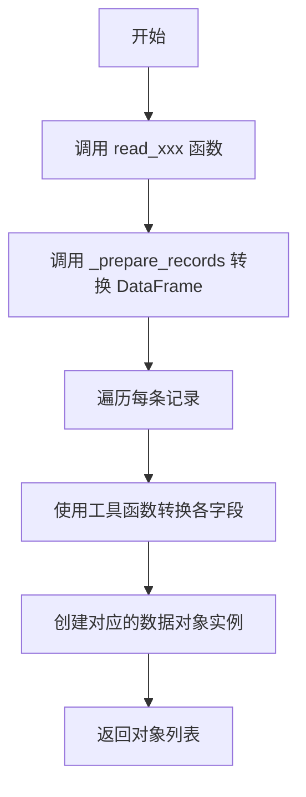
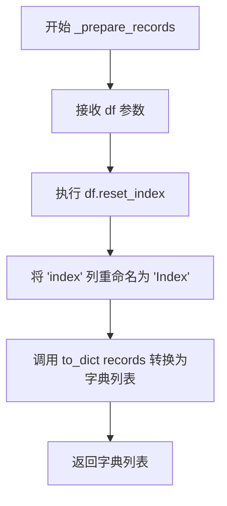
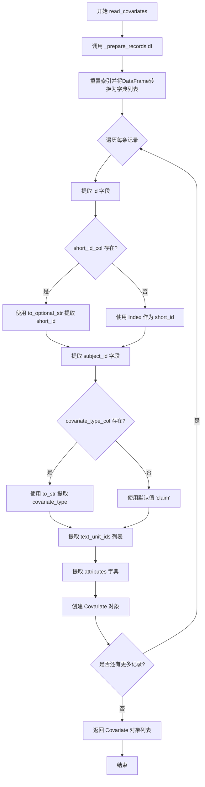
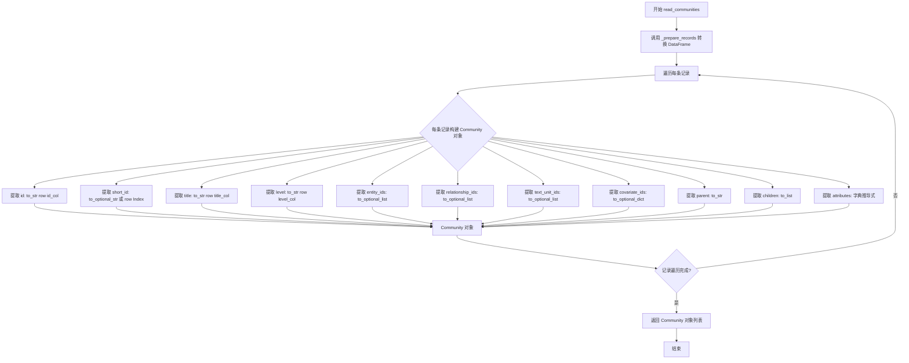
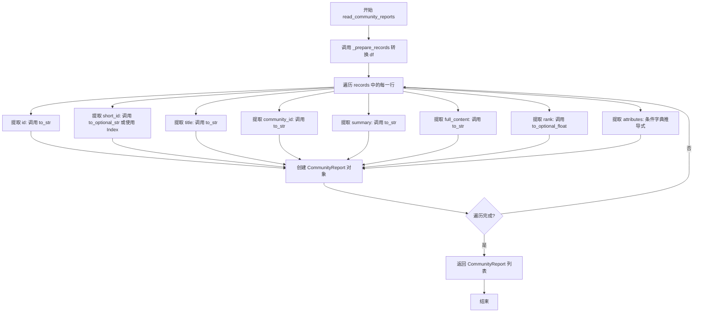
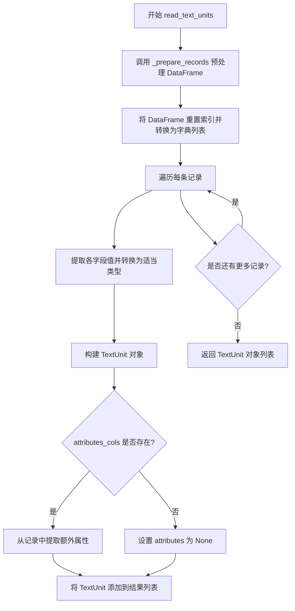

# `graphrag\packages\graphrag\graphrag\query\input\loaders\dfs.py` 详细设计文档

该模块负责将pandas DataFrame中的数据加载到GraphRAG的各种数据对象（Entity、Relationship、Covariate、Community、CommunityReport、TextUnit）中，提供了一系列读取函数用于数据转换和映射。

## 整体流程



## 类结构

```
该文件为模块文件，无类定义
所有函数均为模块级全局函数
数据模型类（由外部导入）:
├── Entity
├── Relationship
├── Covariate
├── Community
├── CommunityReport
└── TextUnit
```

## 全局变量及字段


### `pd`
    
pandas库，用于数据处理和分析

类型：`module`
    


### `df`
    
输入的pandas DataFrame对象

类型：`pd.DataFrame`
    


### `df_reset`
    
重置索引后的DataFrame副本

类型：`pd.DataFrame`
    


### `records`
    
DataFrame转换为字典列表的结果

类型：`list[dict]`
    


### `row`
    
当前处理的单条记录字典

类型：`dict`
    


### `id_col`
    
Entity id列名，默认为'id'

类型：`str`
    


### `short_id_col`
    
Entity短ID列名，可选默认为'human_readable_id'

类型：`str | None`
    


### `title_col`
    
Entity标题列名，默认为'title'

类型：`str`
    


### `type_col`
    
Entity类型列名，可选

类型：`str | None`
    


### `description_col`
    
Entity描述列名，可选

类型：`str | None`
    


### `name_embedding_col`
    
Entity名称嵌入列名，可选

类型：`str | None`
    


### `description_embedding_col`
    
Entity描述嵌入列名，可选

类型：`str | None`
    


### `community_col`
    
Entity社区ID列表列名，可选默认为'community_ids'

类型：`str | None`
    


### `text_unit_ids_col`
    
Entity关联文本单元ID列表列名，可选

类型：`str | None`
    


### `rank_col`
    
Entity排名/度数列名，可选默认为'degree'

类型：`str | None`
    


### `attributes_cols`
    
额外属性列名列表，可选

类型：`list[str] | None`
    


### `source_col`
    
Relationship源节点列名，默认为'source'

类型：`str`
    


### `target_col`
    
Relationship目标节点列名，默认为'target'

类型：`str`
    


### `weight_col`
    
Relationship权重列名，可选

类型：`str | None`
    


### `subject_col`
    
Covariate主体ID列名，默认为'subject_id'

类型：`str`
    


### `covariate_type_col`
    
Covariate类型列名，可选

类型：`str | None`
    


### `level_col`
    
Community层级列名，默认为'level'

类型：`str`
    


### `entities_col`
    
Community实体ID列表列名，可选默认为'entity_ids'

类型：`str | None`
    


### `relationships_col`
    
Community关系ID列表列名，可选默认为'relationship_ids'

类型：`str | None`
    


### `text_units_col`
    
Community文本单元ID列表列名，可选默认为'text_unit_ids'

类型：`str | None`
    


### `covariates_col`
    
Community协变量ID字典列名，可选默认为'covariate_ids'

类型：`str | None`
    


### `parent_col`
    
Community父社区列名，可选

类型：`str | None`
    


### `children_col`
    
Community子社区列表列名，可选

类型：`str | None`
    


### `community_col`
    
CommunityReport关联社区ID列名，默认为'community'

类型：`str`
    


### `summary_col`
    
CommunityReport摘要列名，默认为'summary'

类型：`str`
    


### `content_col`
    
CommunityReport完整内容列名，默认为'full_content'

类型：`str`
    


### `rank_col`
    
CommunityReport排名列名，可选默认为'rank'

类型：`str | None`
    


### `text_col`
    
TextUnit文本内容列名，默认为'text'

类型：`str`
    


### `tokens_col`
    
TextUnit令牌数量列名，可选默认为'n_tokens'

类型：`str | None`
    


### `document_id_col`
    
TextUnit所属文档ID列名，可选

类型：`str | None`
    


### `col`
    
遍历attributes_cols时的当前列名

类型：`str`
    


### `data_model.Entity`
    
实体数据模型类，包含id、short_id、title等属性

类型：`class`
    


### `data_model.Relationship`
    
关系数据模型类，包含id、source、target、weight等属性

类型：`class`
    


### `data_model.Covariate`
    
协变量数据模型类，包含id、subject_id、covariate_type等属性

类型：`class`
    


### `data_model.Community`
    
社区数据模型类，包含id、title、level、entity_ids等属性

类型：`class`
    


### `data_model.CommunityReport`
    
社区报告数据模型类，包含id、title、community_id、summary等属性

类型：`class`
    


### `data_model.TextUnit`
    
文本单元数据模型类，包含id、text、entity_ids等属性

类型：`class`
    


### `global_function._prepare_records`
    
内部函数，将DataFrame重置索引并转换为字典列表

类型：`function`
    


### `global_function.read_entities`
    
从DataFrame读取实体数据列表

类型：`function`
    


### `global_function.read_relationships`
    
从DataFrame读取关系数据列表

类型：`function`
    


### `global_function.read_covariates`
    
从DataFrame读取协变量数据列表

类型：`function`
    


### `global_function.read_communities`
    
从DataFrame读取社区数据列表

类型：`function`
    


### `global_function.read_community_reports`
    
从DataFrame读取社区报告数据列表

类型：`function`
    


### `global_function.read_text_units`
    
从DataFrame读取文本单元数据列表

类型：`function`
    
    

## 全局函数及方法


### `_prepare_records`

重置DataFrame的索引并将处理后的DataFrame转换为字典列表，同时将重置的索引列重命名为"Index"以保持一致性。

参数：

- `df`：`pd.DataFrame`，输入的pandas DataFrame对象

返回值：`list[dict]`，包含重置索引后的DataFrame记录的字典列表

#### 流程图



#### 带注释源码

```python
def _prepare_records(df: pd.DataFrame) -> list[dict]:
    """
    Reset index and convert the DataFrame to a list of dictionaries.

    We rename the reset index column to 'Index' for consistency.
    """
    # 重置DataFrame索引，将原索引作为新的一列
    # 然后将原索引列名 'index' 重命名为 'Index' 以保持命名一致性
    df_reset = df.reset_index().rename(columns={"index": "Index"})
    # 将DataFrame转换为字典列表，每行对应一个字典
    return df_reset.to_dict("records")
```


### `read_entities`

从 pandas DataFrame 中读取实体数据，将其转换为 Entity 对象列表。支持自定义列名映射、嵌入向量提取、社区和文本单元关联以及动态属性扩展。

#### 参数

- `df`：`pd.DataFrame`，输入的实体数据 DataFrame
- `id_col`：`str`，默认为 "id"，实体唯一标识列名
- `short_id_col`：`str | None`，默认为 "human_readable_id"，人类可读短 ID 列名
- `title_col`：`str`，默认为 "title"，实体标题列名
- `type_col`：`str | None`，默认为 "type"，实体类型列名
- `description_col`：`str | None`，默认为 "description"，实体描述列名
- `name_embedding_col`：`str | None`，默认为 "name_embedding"，名称嵌入向量列名
- `description_embedding_col`：`str | None`，默认为 "description_embedding"，描述嵌入向量列名
- `community_col`：`str | None`，默认为 "community_ids"，社区 ID 列表列名
- `text_unit_ids_col`：`str | None`，默认为 "text_unit_ids"，关联文本单元 ID 列表列名
- `rank_col`：`str | None`，默认为 "degree"，实体排名/度数值列名
- `attributes_cols`：`list[str] | None`，默认为 None，额外属性列名列表

#### 返回值

`list[Entity]`，返回填充完成的 Entity 对象列表

#### 流程图

```mermaid
flowchart TD
    A[开始 read_entities] --> B[调用 _prepare_records 预处理 DataFrame]
    B --> C[重置索引并将 DataFrame 转为字典列表]
    D[遍历每条记录 row] --> E{检查 short_id_col 是否存在}
    E -->|是| F[使用 to_optional_str 读取短 ID]
    E -->|否| G[使用 row['Index'] 作为短 ID]
    F --> H[构建 Entity 对象]
    G --> H
    H --> I{检查 attributes_cols 是否存在}
    I -->|是| J[从 row 提取指定列作为属性字典]
    I -->|否| K[设置 attributes 为 None]
    J --> L[创建完整 Entity 对象]
    K --> L
    L --> M[返回 Entity 对象列表]
    C --> D
    M --> N[结束]
```

#### 带注释源码

```python
def read_entities(
    df: pd.DataFrame,
    id_col: str = "id",
    short_id_col: str | None = "human_readable_id",
    title_col: str = "title",
    type_col: str | None = "type",
    description_col: str | None = "description",
    name_embedding_col: str | None = "name_embedding",
    description_embedding_col: str | None = "description_embedding",
    community_col: str | None = "community_ids",
    text_unit_ids_col: str | None = "text_unit_ids",
    rank_col: str | None = "degree",
    attributes_cols: list[str] | None = None,
) -> list[Entity]:
    """Read entities from a dataframe using pre-converted records."""
    # 步骤1: 调用内部函数将 DataFrame 预处理为记录列表
    # 重置索引并将数据转换为字典格式，每行对应一条记录
    records = _prepare_records(df)
    
    # 步骤2: 列表推导式遍历每条记录，构建 Entity 对象
    return [
        Entity(
            # 必需字段：使用 to_str 确保转换为字符串
            id=to_str(row, id_col),
            
            # 短 ID 处理：若指定了 short_id_col 则使用，否则回退到 DataFrame 索引
            short_id=to_optional_str(row, short_id_col)
            if short_id_col
            else str(row["Index"]),
            
            # 必需字段：标题
            title=to_str(row, title_col),
            
            # 可选字段：类型（可能为 None）
            type=to_optional_str(row, type_col),
            
            # 可选字段：描述
            description=to_optional_str(row, description_col),
            
            # 可选字段：名称嵌入向量，转换为 float 列表
            name_embedding=to_optional_list(row, name_embedding_col, item_type=float),
            
            # 可选字段：描述嵌入向量，转换为 float 列表
            description_embedding=to_optional_list(
                row, description_embedding_col, item_type=float
            ),
            
            # 可选字段：社区 ID 列表，转换为字符串列表
            community_ids=to_optional_list(row, community_col, item_type=str),
            
            # 可选字段：文本单元 ID 列表
            text_unit_ids=to_optional_list(row, text_unit_ids_col),
            
            # 可选字段：排名/度数，转换为整数
            rank=to_optional_int(row, rank_col),
            
            # 动态属性：若指定了 attributes_cols，则从记录中提取对应列作为属性字典
            attributes=(
                {col: row.get(col) for col in attributes_cols}
                if attributes_cols
                else None
            ),
        )
        for row in records  # 遍历预处理后的每条记录
    ]
```


### `read_relationships`

从 DataFrame 中读取关系数据，将每行记录转换为 Relationship 对象列表。

参数：

- `df`：`pd.DataFrame`，包含关系数据的 DataFrame
- `id_col`：`str`，关系 ID 列名，默认为 "id"
- `short_id_col`：`str | None`，人类可读 ID 列名，默认为 "human_readable_id"
- `source_col`：`str`，关系源实体列名，默认为 "source"
- `target_col`：`str`，关系目标实体列名，默认为 "target"
- `description_col`：`str | None`，关系描述列名
- `rank_col`：`str | None`，关系排名/度数列名，默认为 "combined_degree"
- `description_embedding_col`：`str | None`，描述嵌入向量列名
- `weight_col`：`str | None`，关系权重列名
- `text_unit_ids_col`：`str | None`，关联文本单元 ID 列表列名
- `attributes_cols`：`list[str] | None`，额外属性列名列表

返回值：`list[Relationship]`，Relationship 对象列表

#### 流程图

```mermaid
flowchart TD
    A[开始 read_relationships] --> B[调用 _prepare_records 转换 DataFrame]
    B --> C[遍历每条记录]
    C --> D{short_id_col 是否存在}
    D -->|是| E[使用 to_optional_str 获取 short_id]
    D -->|否| F[使用 row['Index'] 作为 short_id]
    E --> G[构建 Relationship 对象]
    F --> G
    G --> H{attributes_cols 是否存在}
    H -->|是| I[从 row 提取指定列作为 attributes]
    H -->|否| J[attributes 设为 None]
    I --> K[返回 Relationship 对象列表]
    J --> K
    C -->|还有更多记录| C
    K --> L[结束]
```

#### 带注释源码

```python
def read_relationships(
    df: pd.DataFrame,
    id_col: str = "id",
    short_id_col: str | None = "human_readable_id",
    source_col: str = "source",
    target_col: str = "target",
    description_col: str | None = "description",
    rank_col: str | None = "combined_degree",
    description_embedding_col: str | None = "description_embedding",
    weight_col: str | None = "weight",
    text_unit_ids_col: str | None = "text_unit_ids",
    attributes_cols: list[str] | None = None,
) -> list[Relationship]:
    """Read relationships from a dataframe using pre-converted records."""
    # 使用辅助函数将 DataFrame 重置索引并转换为字典列表
    records = _prepare_records(df)
    
    # 遍历每条记录，构建 Relationship 对象列表
    return [
        Relationship(
            id=to_str(row, id_col),  # 必需：关系 ID
            # 条件判断：如果提供了 short_id_col 则使用，否则使用行索引
            short_id=to_optional_str(row, short_id_col)
            if short_id_col
            else str(row["Index"]),
            source=to_str(row, source_col),  # 必需：源实体 ID
            target=to_str(row, target_col),  # 必需：目标实体 ID
            description=to_optional_str(row, description_col),  # 可选：关系描述
            # 将描述嵌入向量转换为 float 列表
            description_embedding=to_optional_list(
                row, description_embedding_col, item_type=float
            ),
            weight=to_optional_float(row, weight_col),  # 可选：权重
            # 将文本单元 ID 列表转换为字符串列表
            text_unit_ids=to_optional_list(row, text_unit_ids_col, item_type=str),
            rank=to_optional_int(row, rank_col),  # 可选：排名/度数
            # 条件处理额外属性列
            attributes=(
                {col: row.get(col) for col in attributes_cols}
                if attributes_cols
                else None
            ),
        )
        for row in records
    ]
```


### `read_covariates`

从 pandas DataFrame 中读取协变量（Covariate）数据，并将其转换为 `Covariate` 对象列表。

参数：

- `df`：`pd.DataFrame`，包含协变量数据的输入数据框
- `id_col`：`str`，默认为 `"id"`，协变量唯一标识符列名
- `short_id_col`：`str | None`，默认为 `"human_readable_id"`，人类可读短ID列名
- `subject_col`：`str`，默认为 `"subject_id"`，关联主体ID列名
- `covariate_type_col`：`str | None`，默认为 `"type"`，协变量类型列名
- `text_unit_ids_col`：`str | None`，默认为 `"text_unit_ids"`，关联文本单元ID列名
- `attributes_cols`：`list[str] | None`，默认为 `None`，额外属性列名列表

返回值：`list[Covariate]`，转换后的 `Covariate` 对象列表

#### 流程图



#### 带注释源码

```python
def read_covariates(
    df: pd.DataFrame,
    id_col: str = "id",
    short_id_col: str | None = "human_readable_id",
    subject_col: str = "subject_id",
    covariate_type_col: str | None = "type",
    text_unit_ids_col: str | None = "text_unit_ids",
    attributes_cols: list[str] | None = None,
) -> list[Covariate]:
    """Read covariates from a dataframe using pre-converted records."""
    # 步骤1: 将DataFrame转换为记录列表（字典列表）
    # 重置索引并将数据转换为records格式，便于逐行处理
    records = _prepare_records(df)
    
    # 步骤2: 遍历每条记录，构建Covariate对象列表
    return [
        Covariate(
            # 提取协变量的唯一标识符
            id=to_str(row, id_col),
            
            # 处理短ID：如果提供了short_id_col则使用，否则使用索引值
            short_id=to_optional_str(row, short_id_col)
            if short_id_col
            else str(row["Index"]),
            
            # 提取关联的主体ID（被描述的实体）
            subject_id=to_str(row, subject_col),
            
            # 处理协变量类型：如果提供了类型列则使用，否则默认为"claim"
            covariate_type=(
                to_str(row, covariate_type_col) if covariate_type_col else "claim"
            ),
            
            # 提取关联的文本单元ID列表
            text_unit_ids=to_optional_list(row, text_unit_ids_col, item_type=str),
            
            # 处理额外属性：如果提供了属性列名列表，则构建属性字典
            attributes=(
                {col: row.get(col) for col in attributes_cols}
                if attributes_cols
                else None
            ),
        )
        for row in records
    ]
```


### `read_communities`

从 Pandas DataFrame 中读取社区（Community）数据，并将其转换为 Community 对象列表。

参数：

- `df`：`pd.DataFrame`，包含社区数据的 DataFrame
- `id_col`：`str`，默认为 "id"，社区唯一标识列名
- `short_id_col`：`str | None`，默认为 "community"，社区短标识列名
- `title_col`：`str`，默认为 "title"，社区标题列名
- `level_col`：`str`，默认为 "level"，社区层级列名
- `entities_col`：`str | None`，默认为 "entity_ids"，实体 ID 列表列名
- `relationships_col`：`str | None`，默认为 "relationship_ids"，关系 ID 列表列名
- `text_units_col`：`str | None`，默认为 "text_unit_ids"，文本单元 ID 列表列名
- `covariates_col`：`str | None`，默认为 "covariate_ids"，协变量 ID 字典列名
- `parent_col`：`str | None`，默认为 "parent"，父社区列名
- `children_col`：`str | None`，默认为 "children"，子社区列名
- `attributes_cols`：`list[str] | None`，默认为 None，自定义属性列名列表

返回值：`list[Community]`，社区对象列表

#### 流程图



#### 带注释源码

```python
def read_communities(
    df: pd.DataFrame,                          # 输入：包含社区数据的 DataFrame
    id_col: str = "id",                        # 社区唯一标识列名
    short_id_col: str | None = "community",    # 社区短标识列名（可选）
    title_col: str = "title",                  # 社区标题列名
    level_col: str = "level",                  # 社区层级列名
    entities_col: str | None = "entity_ids",   # 实体 ID 列表列名（可选）
    relationships_col: str | None = "relationship_ids",  # 关系 ID 列表列名（可选）
    text_units_col: str | None = "text_unit_ids",        # 文本单元 ID 列表列名（可选）
    covariates_col: str | None = "covariate_ids",       # 协变量 ID 字典列名（可选）
    parent_col: str | None = "parent",         # 父社区列名（可选）
    children_col: str | None = "children",     # 子社区列名（可选）
    attributes_cols: list[str] | None = None,  # 自定义属性列名列表（可选）
) -> list[Community]:                          # 返回：社区对象列表
    """Read communities from a dataframe using pre-converted records."""
    # 步骤1：调用内部函数 _prepare_records 将 DataFrame 转换为记录字典列表
    # 该函数重置索引并将数据转换为 records 格式
    records = _prepare_records(df)
    
    # 步骤2：遍历每条记录，构建 Community 对象并返回列表
    return [
        Community(
            # 社区唯一标识，从指定列提取，强制要求
            id=to_str(row, id_col),
            
            # 社区短标识：如果指定了 short_id_col 则从列提取，否则使用行索引
            short_id=to_optional_str(row, short_id_col)
            if short_id_col
            else str(row["Index"]),
            
            # 社区标题，从指定列提取，强制要求
            title=to_str(row, title_col),
            
            # 社区层级，从指定列提取，强制要求
            level=to_str(row, level_col),
            
            # 实体 ID 列表：可选字段，提取为字符串列表
            entity_ids=to_optional_list(row, entities_col, item_type=str),
            
            # 关系 ID 列表：可选字段，提取为字符串列表
            relationship_ids=to_optional_list(row, relationships_col, item_type=str),
            
            # 文本单元 ID 列表：可选字段，提取为字符串列表
            text_unit_ids=to_optional_list(row, text_units_col, item_type=str),
            
            # 协变量 ID 字典：可选字段，提取为键值对字典（键和值均为字符串）
            covariate_ids=to_optional_dict(
                row, covariates_col, key_type=str, value_type=str
            ),
            
            # 父社区：强制字段（与 level/title 不同处理方式）
            parent=to_str(row, parent_col),
            
            # 子社区列表：使用 to_list 而非 to_optional_list
            children=to_list(row, children_col),
            
            # 自定义属性：如果指定了 attributes_cols，则提取指定列作为属性字典
            attributes=(
                {col: row.get(col) for col in attributes_cols}
                if attributes_cols
                else None
            ),
        )
        for row in records  # 列表推导式遍历所有记录
    ]
```


### `read_community_reports`

该函数用于从 Pandas DataFrame 中读取社区报告数据，并将每条记录转换为 `CommunityReport` 对象列表，支持自定义列名映射和可选属性字段的提取。

参数：

- `df`：`pd.DataFrame`，包含社区报告数据的输入数据框
- `id_col`：`str`，可选，默认为 `"id"`，用于指定 ID 列的列名
- `short_id_col`：`str | None`，可选，默认为 `"community"`，用于指定短 ID 列的列名
- `title_col`：`str`，可选，默认为 `"title"`，用于指定标题列的列名
- `community_col`：`str`，可选，默认为 `"community"`，用于指定社区 ID 列的列名
- `summary_col`：`str`，可选，默认为 `"summary"`，用于指定摘要列的列名
- `content_col`：`str`，可选，默认为 `"full_content"`，用于指定完整内容列的列名
- `rank_col`：`str | None`，可选，默认为 `"rank"`，用于指定排名列的列名
- `attributes_cols`：`list[str] | None`，可选，默认为 `None`，用于指定额外属性列的列名列表

返回值：`list[CommunityReport]`，返回转换后的社区报告对象列表

#### 流程图



#### 带注释源码

```python
def read_community_reports(
    df: pd.DataFrame,
    id_col: str = "id",
    short_id_col: str | None = "community",
    title_col: str = "title",
    community_col: str = "community",
    summary_col: str = "summary",
    content_col: str = "full_content",
    rank_col: str | None = "rank",
    attributes_cols: list[str] | None = None,
) -> list[CommunityReport]:
    """
    Read community reports from a dataframe using pre-converted records.

    该函数将输入的 DataFrame 转换为社区报告对象列表。
    首先调用 _prepare_records 将 DataFrame 重置索引并转换为字典列表，
    然后遍历每条记录，使用转换工具函数提取各字段值，最后构建 CommunityReport 对象。

    参数:
        df: 包含社区报告数据的 DataFrame
        id_col: ID 列名，默认为 "id"
        short_id_col: 短 ID 列名，默认为 "community"，设为 None 时不使用
        title_col: 标题列名，默认为 "title"
        community_col: 社区 ID 列名，默认为 "community"
        summary_col: 摘要列名，默认为 "summary"
        content_col: 完整内容列名，默认为 "full_content"
        rank_col: 排名列名，可选，默认为 "rank"
        attributes_cols: 额外属性列名列表，可选

    返回:
        包含所有社区报告对象的列表
    """
    # 将 DataFrame 转换为字典列表记录
    # 内部会重置索引并将索引列重命名为 'Index'
    records = _prepare_records(df)

    # 遍历每条记录，构建 CommunityReport 对象列表
    return [
        CommunityReport(
            # 提取必填字段 id
            id=to_str(row, id_col),
            # 提取可选字段 short_id，如果 short_id_col 为 None 则使用行索引作为默认值
            short_id=to_optional_str(row, short_id_col)
            if short_id_col
            else str(row["Index"]),
            # 提取必填字段 title
            title=to_str(row, title_col),
            # 提取必填字段 community_id
            community_id=to_str(row, community_col),
            # 提取必填字段 summary
            summary=to_str(row, summary_col),
            # 提取必填字段 full_content
            full_content=to_str(row, content_col),
            # 提取可选字段 rank
            rank=to_optional_float(row, rank_col),
            # 提取可选的额外属性字段
            attributes=(
                {col: row.get(col) for col in attributes_cols}
                if attributes_cols
                else None
            ),
        )
        for row in records
    ]
```


### `read_text_units`

将 pandas DataFrame 中的数据记录转换为 TextUnit 对象列表，用于从预转换的数据记录中读取文本单元数据。

参数：

- `df`：`pd.DataFrame`，包含文本单元数据的 DataFrame
- `id_col`：`str`，文本单元的唯一标识列名，默认为 "id"
- `text_col`：`str`，文本内容的列名，默认为 "text"
- `entities_col`：`str | None`，关联实体ID列表的列名，默认为 "entity_ids"
- `relationships_col`：`str | None`，关联关系ID列表的列名，默认为 "relationship_ids"
- `covariates_col`：`str | None`，协变量字典的列名，默认为 "covariate_ids"
- `tokens_col`：`str | None`，令牌数量的列名，默认为 "n_tokens"
- `document_id_col`：`str | None`，文档ID的列名，默认为 "document_id"
- `attributes_cols`：`list[str] | None`，额外属性列名列表，默认为 None

返回值：`list[TextUnit]`，返回包含所有转换后 TextUnit 对象的列表

#### 流程图



#### 带注释源码

```python
def read_text_units(
    df: pd.DataFrame,
    id_col: str = "id",
    text_col: str = "text",
    entities_col: str | None = "entity_ids",
    relationships_col: str | None = "relationship_ids",
    covariates_col: str | None = "covariate_ids",
    tokens_col: str | None = "n_tokens",
    document_id_col: str | None = "document_id",
    attributes_cols: list[str] | None = None,
) -> list[TextUnit]:
    """Read text units from a dataframe using pre-converted records."""
    # 调用内部方法将 DataFrame 转换为记录列表
    # 重置索引并将每行转换为字典格式
    records = _prepare_records(df)
    
    # 使用列表推导式遍历每条记录，构建 TextUnit 对象列表
    return [
        TextUnit(
            id=to_str(row, id_col),  # 提取文本单元ID
            short_id=str(row["Index"]),  # 使用DataFrame索引作为短ID
            text=to_str(row, text_col),  # 提取文本内容
            entity_ids=to_optional_list(row, entities_col, item_type=str),  # 提取关联实体ID列表
            relationship_ids=to_optional_list(row, relationships_col, item_type=str),  # 提取关联关系ID列表
            covariate_ids=to_optional_dict(
                row, covariates_col, key_type=str, value_type=str  # 提取协变量字典
            ),
            n_tokens=to_optional_int(row, tokens_col),  # 提取令牌数量
            document_id=to_optional_str(row, document_id_col),  # 提取文档ID
            attributes=(
                # 如果指定了额外属性列，则提取这些列的值构建属性字典
                {col: row.get(col) for col in attributes_cols}
                if attributes_cols
                else None  # 否则设为 None
            ),
        )
        for row in records  # 遍历预处理后的每条记录
    ]
```

## 关键组件


### _prepare_records

重置DataFrame索引并将数据转换为字典列表的辅助函数，为后续数据模型对象构建做准备。

### read_entities

从DataFrame读取实体数据，转换为Entity对象列表，支持可选字段如类型、描述、嵌入向量、社区ID等。

### read_relationships

从DataFrame读取关系数据，转换为Relationship对象列表，包含源目标实体、权重、描述嵌入等字段。

### read_covariates

从DataFrame读取协变量数据，转换为Covariate对象列表，表示实体相关的声明或属性信息。

### read_communities

从DataFrame读取社区数据，转换为Community对象列表，包含层级结构、实体关系引用、子社区等。

### read_community_reports

从DataFrame读取社区报告数据，转换为CommunityReport对象列表，包含摘要和完整内容。

### read_text_units

从DataFrame读取文本单元数据，转换为TextUnit对象列表，包含文本内容、关联实体、关系、令牌数等。

### 类型转换工具函数

提供类型安全的数据提取功能，包括to_str、to_optional_str、to_optional_list、to_optional_float、to_optional_int、to_list、to_optional_dict等，用于将DataFrame记录中的值转换为适当的数据类型。

### 数据模型类

包括Entity、Relationship、Covariate、Community、CommunityReport、TextUnit等数据对象，定义了图谱数据的结构化表示。


## 问题及建议


### 已知问题

-   **short_id处理不一致**：在`read_text_units`函数中，无论是否传入`short_id_col`参数，都始终使用`str(row["Index"])`作为short_id，而其他函数则根据`short_id_col`参数是否存在来决定是否调用`to_optional_str`
-   **缺少输入验证**：所有read函数都没有验证输入的DataFrame是否包含必需的列，可能导致运行时KeyError
-   **重复代码模式**：每个read函数都包含几乎相同的attributes_cols处理逻辑、`_prepare_records`调用、以及短ID的回退逻辑，导致代码冗余
-   **类型转换不一致**：`read_communities`中`level_col`使用`to_str`转换，但根据语义应该是整数类型
-   **默认值的语义不一致**：`read_covariates`对`covariate_type_col`有默认值"claim"，但其他类似的可选字段没有提供默认值
-   **DataFrame复制开销**：`_prepare_records`每次调用都创建新的DataFrame副本（reset_index + rename + to_dict），对于大数据集可能影响性能
- **空值处理不一致**：某些字段在值为None时返回None，而某些字段（如community_ids、text_unit_ids等列表类型）返回空列表，缺乏统一的空值处理策略
- **潜在的KeyError风险**：当`short_id_col`参数被提供但列名不存在于DataFrame中时，`to_optional_str(row, short_id_col)`可能返回None而非使用回退值

### 优化建议

-   **提取公共基类或使用装饰器**：将重复的attributes处理、短ID回退逻辑、数据准备等common patterns提取到基类或使用装饰器模式
-   **添加输入验证函数**：创建验证函数在读取数据前检查DataFrame是否包含必需的列，并给出清晰的错误信息
-   **统一短ID处理逻辑**：在所有read函数中保持一致的short_id处理策略
-   **优化DataFrame处理**：考虑使用原地操作或流式处理来减少内存复制，或添加缓存机制避免重复的`_prepare_records`调用
-   **添加类型提示和校验**：为`level_col`等字段使用正确的类型转换函数，并添加运行时类型校验
-   **统一空值处理策略**：为所有可选字段定义统一的空值处理规则（如：列表类型返回空列表，字符串类型返回None）
-   **添加错误处理和日志**：为关键操作添加try-except块和日志记录，便于调试和监控
-   **考虑使用数据类工厂模式**：创建通用的数据转换函数，减少每个函数中的重复代码


## 其它


### 设计目标与约束

本模块的设计目标是提供一个统一的、高效的接口，将存储在pandas DataFrame中的数据转换为图谱系统的核心数据对象（实体、关系、协变量、社区、社区报告、文本单元）。主要约束包括：(1) 依赖pandas库进行数据处理；(2) 假设输入的DataFrame结构符合预定义的列名约定；(3) 需要与graphrag.data_model中的数据模型类配合使用；(4) 所有转换函数均为纯函数，无副作用。

### 错误处理与异常设计

主要潜在错误包括：(1) DataFrame中缺少必需列会触发KeyError；(2) 数据类型不匹配可能导致转换失败；(3) 空DataFrame会返回空列表。错误处理策略建议：(1) 在调用这些函数前验证DataFrame结构；(2) 为缺失的列提供默认值或抛出有意义的自定义异常；(3) 考虑添加可选的参数校验机制，允许用户指定必需列和可选列。

### 数据流与状态机

数据流转过程为：输入DataFrame → _prepare_records()预处理（重置索引、转换为字典列表）→ 根据不同数据类型调用对应的read_*函数 → 遍历记录并调用工具函数进行类型转换 → 构建并返回数据对象列表。无状态机设计，属于单向数据转换流程。

### 外部依赖与接口契约

主要外部依赖包括：(1) pandas库用于DataFrame操作；(2) graphrag.data_model中的六个数据模型类（Entity, Relationship, Covariate, Community, CommunityReport, TextUnit）；(3) graphrag.query.input.loaders.utils中的类型转换工具函数。接口契约：所有read_*函数均接受DataFrame和可选的列名参数，返回对应的数据对象列表；_prepare_records为内部函数，返回字典列表。

### 配置参数说明

read_*系列函数均支持可配置的列名参数，允许用户自定义DataFrame中各字段对应的列名。默认列名遵循项目约定，如id_col默认为"id"，title_col默认为"title"等。attributes_cols参数允许用户指定额外的属性列，这些列会被打包成字典传递给数据对象的attributes字段。

### 使用示例

典型使用场景：从CSV或Parquet文件加载数据并转换为数据对象列表。例如：首先使用pandas读取CSV文件得到DataFrame，然后调用read_entities(df)获取实体列表，或调用read_communities(df)获取社区列表。工具函数（如to_optional_str, to_optional_list）负责处理None值和类型转换。

### 性能考虑

潜在的性能瓶颈：(1) 大规模DataFrame转换时，列表推导式可能占用大量内存；(2) 每次调用都会执行df.reset_index()和to_dict操作。优化建议：(1) 对于超大型数据集，考虑使用生成器替代列表推导；(2) 预先缓存_prepare_records的结果；(3) 考虑使用pandas的apply方法替代当前实现。

### 安全性考虑

当前代码无直接的安全风险，因为数据转换操作不涉及文件I/O或网络请求。但需要注意：(1) 验证用户输入的attributes_cols参数，防止列名注入；(2) 对从DataFrame获取的数据进行必要的消毒处理，防止恶意数据进入下游系统。

### 版本兼容性

代码使用了Python 3.10+的类型注解语法（如str | None）。pandas版本应为1.0+以支持to_dict方法。需要与graphrag.data_model和graphrag.query.input.loaders.utils模块的版本保持一致。

### 测试策略

建议的测试覆盖：(1) 各read_*函数的基本功能测试，使用模拟的DataFrame验证输出；(2) 空DataFrame和单行DataFrame的边界情况测试；(3) 列名参数自定义的功能测试；(4) 类型转换工具函数的单元测试；(5) 大规模数据集的性能基准测试。

    