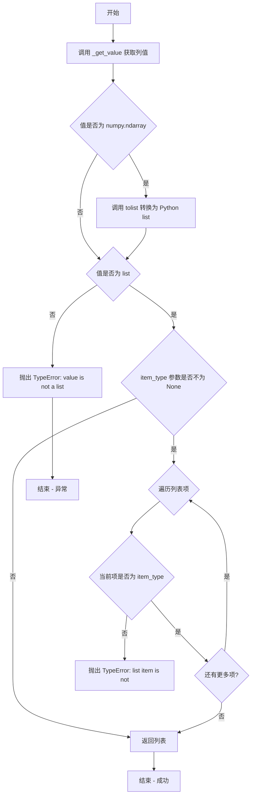
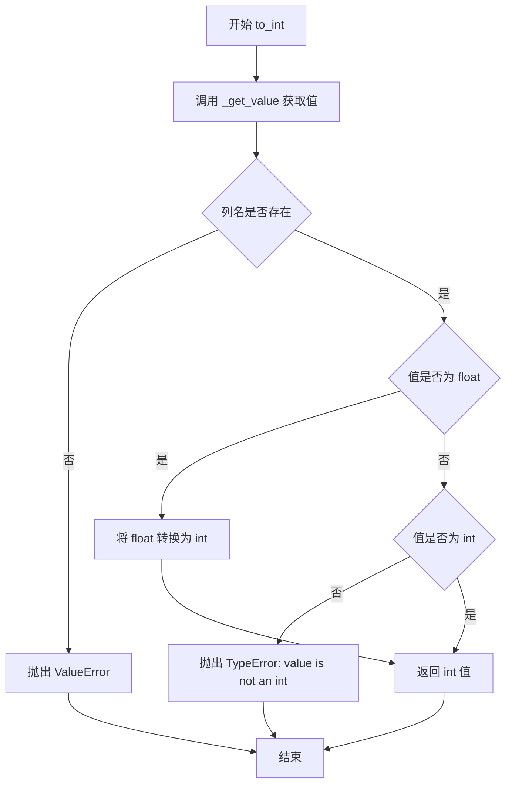
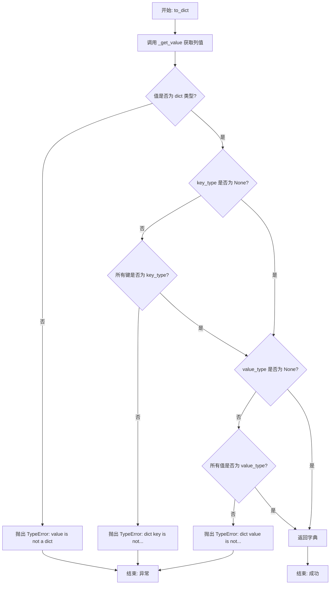

# `graphrag\packages\graphrag\graphrag\query\input\loaders\utils.py` 详细设计文档

一个数据加载工具模块，提供从Mapping数据结构中检索、转换和验证数据为各种类型（字符串、列表、整数、浮点数、字典）的辅助函数，支持必需字段和可选字段的转换处理。

## 整体流程

```mermaid
graph TD
    A[开始] --> B{column_name是否为None}
    B -- 是 --> C{required=True?}
    C -- 是 --> D[抛出ValueError]
    C -- 否 --> E[返回None]
    B -- 否 --> F{column_name在data中?}
    F -- 否 --> G{required=True?}
    G -- 是 --> H[抛出ValueError]
    G -- 否 --> I[返回None]
    F -- 是 --> J[返回data[column_name]]
    J --> K{执行类型转换}
    K --> L[返回转换后的值]
```

## 类结构

```
无类层次结构（纯函数模块）
所有函数均为模块级全局函数
```

## 全局变量及字段


### `_get_value`
    
从数据映射中检索列值，支持必需和可选列的验证

类型：`function`
    


### `to_str`
    
将值转换为字符串并进行验证

类型：`function`
    


### `to_optional_str`
    
将值转换为可选字符串，支持None值

类型：`function`
    


### `to_list`
    
将值转换为列表，支持numpy数组转换和类型检查

类型：`function`
    


### `to_optional_list`
    
将值转换为可选列表，支持字符串自动转为单元素列表

类型：`function`
    


### `to_int`
    
将值转换为整数，支持浮点数向下取整

类型：`function`
    


### `to_optional_int`
    
将值转换为可选整数，支持None值处理

类型：`function`
    


### `to_float`
    
将值转换为浮点数并进行类型验证

类型：`function`
    


### `to_optional_float`
    
将值转换为可选浮点数

类型：`function`
    


### `to_dict`
    
将值转换为字典，支持键值类型验证

类型：`function`
    


### `to_optional_dict`
    
将值转换为可选字典，支持键值类型检查

类型：`function`
    


    

## 全局函数及方法


### `_get_value`

从 `data` 映射中检索指定列名的值。如果 `required` 为 `True`，则在列名为 `None` 或列名不存在于数据中时抛出 `ValueError`；如果 `required` 为 `False`，则在上述情况下返回 `None`。

参数：

- `data`：`Mapping[str, Any]`，包含列数据的字典映射
- `column_name`：`str | None`，要检索的列名
- `required`：`bool = True`，指示该列是否为必需列

返回值：`Any`，从数据映射中获取的值，如果为可选列且未找到则返回 `None`

#### 流程图

```mermaid
flowchart TD
    A[开始 _get_value] --> B{column_name is None?}
    B -- 是 --> C{required = True?}
    C -- 是 --> D[raise ValueError: Column name is None]
    C -- 否 --> E[return None]
    B -- 否 --> F{column_name in data?}
    F -- 是 --> G[return data[column_name]]
    F -- 否 --> H{required = True?}
    H -- 是 --> I[raise ValueError: Column not found in data]
    H -- 否 --> J[return None]
```

#### 带注释源码

```python
def _get_value(
    data: Mapping[str, Any], column_name: str | None, required: bool = True
) -> Any:
    """
    Retrieve a column value from data.

    If `required` is True, raises a ValueError when:
      - column_name is None, or
      - column_name is not in data.

    For optional columns (required=False), returns None if column_name is None.
    """
    # 检查列名是否为 None
    if column_name is None:
        # 如果列是必需的，抛出 ValueError
        if required:
            msg = "Column name is None"
            raise ValueError(msg)
        # 如果列不是必需的，返回 None
        return None
    
    # 检查列名是否存在于数据映射中
    if column_name in data:
        # 返回对应的值
        return data[column_name]
    
    # 列名不存在于数据中
    if required:
        # 如果列是必需的，抛出 ValueError
        msg = f"Column [{column_name}] not found in data"
        raise ValueError(msg)
    
    # 如果列不是必需的，返回 None
    return None
```


### `to_str`

将数据字典中指定列的值转换为字符串，并进行必要的验证。

参数：

- `data`：`Mapping[str, Any]`，包含数据的字典对象，提供列名与值的映射
- `column_name`：`str | None`，要提取并转换的列名，如果为 None 则抛出异常

返回值：`str`，将指定列的值转换为字符串的结果

#### 流程图

```mermaid
flowchart TD
    A[开始 to_str] --> B{column_name 是否为 None}
    B -- 是 --> C{required 参数}
    C -- True --> D[抛出 ValueError: Column name is None]
    C -- False --> E[返回 None]
    B -- 否 --> F{column_name 是否在 data 中}
    F -- 是 --> G[获取 data[column_name] 的值]
    F -- 否 --> H{required 参数}
    H -- True --> I[抛出 ValueError: Column [{column_name}] not found in data]
    H -- False --> E
    G --> J[将值转换为字符串 str(value)]
    J --> K[返回字符串结果]
```

#### 带注释源码

```python
def to_str(data: Mapping[str, Any], column_name: str | None) -> str:
    """
    Convert and validate a value to a string.
    
    将数据字典中指定列的值转换为字符串，并进行验证。
    该函数是强制性（required=True）的转换，若列名不存在或为 None，
    将抛出 ValueError 异常。
    """
    # 调用内部函数 _get_value 获取列值，required=True 表示该列必须存在
    # 如果 column_name 为 None 或不在 data 中，将抛出 ValueError
    value = _get_value(data, column_name, required=True)
    
    # 使用 Python 内置的 str() 函数将值转换为字符串并返回
    return str(value)
```


### `to_optional_str`

将数据映射中指定列的值转换为可选字符串。如果值为 `None`，返回 `None`；否则返回值的字符串表示形式。

参数：

- `data`：`Mapping[str, Any]`，包含数据的字典映射
- `column_name`：`str | None`，要提取的列名

返回值：`str | None`，转换后的字符串或 `None`

#### 流程图

```mermaid
flowchart TD
    A[开始] --> B[调用 _get_value]
    B --> C{获取的值是否为 None?}
    C -->|是| D[返回 None]
    C -->|否| E[调用 str(value)]
    E --> F[返回字符串]
    
    B -.-> G[_get_value 内部逻辑]
    G --> G1{column_name is None?}
    G1 -->|是且 required=True| G2[抛出 ValueError]
    G1 -->|否| G3{column_name in data?}
    G3 -->|是| G4[返回 data[column_name]]
    G3 -->|否且 required=True| G5[抛出 ValueError]
    G3 -->|否且 required=False| G6[返回 None]
```

#### 带注释源码

```python
def to_optional_str(data: Mapping[str, Any], column_name: str | None) -> str | None:
    """
    Convert and validate a value to an optional string.
    
    将数据映射中指定列的值转换为可选字符串。
    
    注意：虽然函数名暗示是可选列（column_name 为 None 时返回 None），
    但内部调用 _get_value 时 required=True，这意味着：
    - 如果 column_name 为 None，会抛出 ValueError
    - 如果 column_name 不在 data 中，会抛出 ValueError
    
    这种实现与同文件的 to_optional_list、to_optional_int 等函数不一致，
    后者对可选列返回 None 而不抛出异常。
    """
    # 调用 _get_value 获取值，required=True 表示列必须存在且非 None
    value = _get_value(data, column_name, required=True)
    
    # 如果值为 None，返回 None；否则返回字符串形式
    return None if value is None else str(value)
```


### `to_list`

将数据字典中指定列的值转换为列表，并可选地验证列表项类型。

参数：

- `data`：`Mapping[str, Any]` ，包含数据的字典映射
- `column_name`：`str | None`，要提取并转换为列表的列名
- `item_type`：`type | None = None`，可选的列表项类型，用于验证列表中每个元素的类型

返回值：`list`，转换并验证后的列表

#### 流程图



#### 带注释源码

```python
def to_list(
    data: Mapping[str, Any], column_name: str | None, item_type: type | None = None
) -> list:
    """Convert and validate a value to a list."""
    # 使用内部函数获取列值，required=True 表示该列为必需字段
    value = _get_value(data, column_name, required=True)
    
    # 如果值是 numpy 数组，转换为 Python 列表
    if isinstance(value, np.ndarray):
        value = value.tolist()
    
    # 验证值是否为列表类型，若不是则抛出 TypeError
    if not isinstance(value, list):
        msg = f"value is not a list: {value} ({type(value)})"
        raise TypeError(msg)
    
    # 如果指定了 item_type，则验证列表中每个元素的类型
    if item_type is not None:
        for v in value:
            if not isinstance(v, item_type):
                msg = f"list item is not [{item_type}]: {v} ({type(v)})"
                raise TypeError(msg)
    
    # 返回转换并验证后的列表
    return value
```


### `to_optional_list`

将数据中的列值转换为可选列表，支持类型验证。如果列不存在、值为 None 或列名为 None，则返回 None。

参数：

- `data`：`Mapping[str, Any]`，包含数据的字典映射
- `column_name`：`str | None`，要转换的列名
- `item_type`：`type | None`，可选，期望的列表元素类型，用于验证列表中的元素类型

返回值：`list | None`，转换后的列表或 None

#### 流程图

```mermaid
flowchart TD
    A[开始] --> B{column_name is None\nor column_name not in data?}
    B -->|是| C[返回 None]
    B -->|否| D[获取 data[column_name] 的值]
    D --> E{value is None?}
    E -->|是| C
    E -->|否| F{isinstance(value, np.ndarray)?}
    F -->|是| G[value = value.tolist]
    F -->|否| H{isinstance(value, str)?}
    G --> I
    H -->|是| J[value = [value]]
    H -->|否| K{isinstance(value, list)?}
    J --> K
    I[继续] --> K
    K -->|否| L[抛出 TypeError:\nvalue is not a list]
    K -->|是| M{item_type is not None?}
    M -->|否| N[返回 value]
    M -->|是| O{遍历列表中的每个元素 v}
    O --> P{isinstance(v, item_type)?}
    P -->|否| Q[抛出 TypeError:\nlist item is not [item_type]]
    P -->|是| R{还有更多元素?}
    R -->|是| O
    R -->|否| N
```

#### 带注释源码

```python
def to_optional_list(
    data: Mapping[str, Any], column_name: str | None, item_type: type | None = None
) -> list | None:
    """Convert and validate a value to an optional list."""
    # 如果列名为 None 或列名不在 data 中，直接返回 None
    if column_name is None or column_name not in data:
        return None
    
    # 从 data 中获取列值
    value = data[column_name]
    
    # 如果值为 None，返回 None
    if value is None:
        return None
    
    # 如果值是 numpy 数组，转换为 Python 列表
    if isinstance(value, np.ndarray):
        value = value.tolist()
    
    # 如果值是字符串，将其包装为单元素列表
    if isinstance(value, str):
        value = [value]
    
    # 验证值是列表类型，否则抛出 TypeError
    if not isinstance(value, list):
        msg = f"value is not a list: {value} ({type(value)})"
        raise TypeError(msg)
    
    # 如果指定了 item_type，验证列表中所有元素是否符合类型要求
    if item_type is not None:
        for v in value:
            if not isinstance(v, item_type):
                msg = f"list item is not [{item_type}]: {v} ({type(v)})"
                raise TypeError(msg)
    
    # 返回转换并验证后的列表
    return value
```


### `to_int`

将数据映射中指定列的值转换为整数并进行类型验证。如果值为浮点数则进行截断转换，若值既不是整数也不是浮点数则抛出 TypeError。

参数：

- `data`：`Mapping[str, Any]`，包含数据的字典映射对象
- `column_name`：`str | None`，要获取并转换的列名

返回值：`int`，转换并验证后的整数值

#### 流程图



#### 带注释源码

```python
def to_int(data: Mapping[str, Any], column_name: str | None) -> int:
    """
    Convert and validate a value to an int.
    
    Args:
        data: 包含数据的字典映射对象
        column_name: 要获取的列名
    
    Returns:
        转换并验证后的整数值
    
    Raises:
        ValueError: 当 column_name 为 None 或不在 data 中时
        TypeError: 当值既不是 int 也不是 float 类型时
    """
    # 调用内部函数获取值，required=True 表示该列为必需列
    value = _get_value(data, column_name, required=True)
    
    # 如果值为浮点数，进行截断转换为整数
    # 注意：这里使用 int() 进行截断，而非四舍五入
    if isinstance(value, float):
        value = int(value)
    
    # 验证转换后的值是否为整数类型
    # 注意：Python 中 bool 是 int 的子类，所以 True/False 也会通过此检查
    if not isinstance(value, int):
        msg = f"value is not an int: {value} ({type(value)})"
        raise TypeError(msg)
    
    # 再次调用 int() 确保返回的是真正的 int 类型（而非 bool）
    return int(value)
```


### `to_optional_int`

将数据映射中的列值转换为可选整数类型，如果列名不存在、值为 None 或列名本身为 None，则返回 None；否则进行类型验证后返回转换后的整数。

参数：

- `data`：`Mapping[str, Any]`，包含数据的映射对象（字典）
- `column_name`：`str | None`，要转换的列名，如果为 None 则返回 None

返回值：`int | None`，转换后的整数或 None

#### 流程图

```mermaid
flowchart TD
    A[开始] --> B{column_name is None or<br/>column_name not in data?}
    B -->|是| C[返回 None]
    B -->|否| D[value = data[column_name]]
    D --> E{value is None?}
    E -->|是| C
    E -->|否| F{value is float?}
    F -->|是| G[value = int(value)]
    F -->|否| H{value is int?}
    G --> H
    H -->|否| I[raise TypeError]
    H -->|是| J[返回 int(value)]
    C --> K[结束]
    J --> K
    I --> K
```

#### 带注释源码

```python
def to_optional_int(data: Mapping[str, Any], column_name: str | None) -> int | None:
    """
    Convert and validate a value to an optional int.
    
    将数据映射中的列值转换为可选整数类型。
    如果列名不存在、值为 None 或列名本身为 None，则返回 None；
    否则进行类型验证后返回转换后的整数。
    """
    # 检查列名是否为 None 或不在数据中，如果是则返回 None
    if column_name is None or column_name not in data:
        return None
    
    # 从数据中获取列值
    value = data[column_name]
    
    # 如果值为 None，返回 None
    if value is None:
        return None
    
    # 如果值是浮点数，转换为整数（向下取整）
    if isinstance(value, float):
        value = int(value)
    
    # 验证值是否为整数类型，如果不是则抛出 TypeError
    if not isinstance(value, int):
        msg = f"value is not an int: {value} ({type(value)})"
        raise TypeError(msg)
    
    # 返回转换后的整数值
    return int(value)
```


### `to_float`

将数据中的指定列值转换为浮点数并进行类型验证。如果值不是浮点数类型，则抛出 TypeError 异常。

参数：

- `data`：`Mapping[str, Any]` - 包含数据的字典映射对象
- `column_name`：`str | None` - 要转换的列名

返回值：`float` - 转换后的浮点数

#### 流程图

```mermaid
flowchart TD
    A[开始] --> B[调用 _get_value 获取列值]
    B --> C{值是否为 float 类型?}
    C -->|是| D[返回 float(value)]
    C -->|否| E[抛出 TypeError 异常]
    E --> F[结束]
    D --> F
```

#### 带注释源码

```python
def to_float(data: Mapping[str, Any], column_name: str | None) -> float:
    """
    Convert and validate a value to a float.
    
    从 data 字典中获取 column_name 对应的值，并确保其为 float 类型。
    如果值不是 float 类型，将抛出 TypeError 异常。
    """
    # 调用内部函数 _get_value 获取必需列的值
    value = _get_value(data, column_name, required=True)
    
    # 检查值是否为 float 类型
    if not isinstance(value, float):
        # 类型不匹配时抛出详细的 TypeError 异常
        msg = f"value is not a float: {value} ({type(value)})"
        raise TypeError(msg)
    
    # 确保返回值为 float 类型（虽然已经是 float，但做一次转换确保安全）
    return float(value)
```


### `to_optional_float`

将数据映射中指定列的值转换为可选的浮点数类型，如果列名不存在、值为 None 或无法转换则返回 None。

参数：

- `data`：`Mapping[str, Any]`，包含数据的映射对象（通常为字典）
- `column_name`：`str | None`，要获取并转换的列名

返回值：`float | None`，转换后的浮点数；如果列名不存在、值为 None 或无法转换则返回 None

#### 流程图

```mermaid
flowchart TD
    A[开始] --> B{column_name is None?}
    B -->|Yes| C[返回 None]
    B -->|No| D{column_name in data?}
    D -->|No| C
    D -->|Yes| E[获取 value = data[column_name]]
    E --> F{value is None?}
    F -->|Yes| C
    F -->|No| G{isinstance value, float?}
    G -->|No| H[返回 float(value)]
    G -->|Yes| I[返回 float(value)]
    H --> J[结束]
    I --> J
```

#### 带注释源码

```python
def to_optional_float(data: Mapping[str, Any], column_name: str | None) -> float | None:
    """
    Convert and validate a value to an optional float.
    
    将数据映射中指定列的值转换为可选的浮点数类型。
    如果列名不存在、值为 None 或无法转换则返回 None。
    """
    # 检查列名是否为 None 或不在数据中，若是则返回 None
    if column_name is None or column_name not in data:
        return None
    
    # 从数据中获取指定列的值
    value = data[column_name]
    
    # 如果值为 None，直接返回 None
    if value is None:
        return None
    
    # 如果值不是 float 类型，尝试转换为 float；若是则直接返回 float 类型
    # 注意：这里存在冗余逻辑，无论是否为 float 都会执行 float() 转换
    if not isinstance(value, float):
        return float(value)
    return float(value)
```

---

**技术债务说明**：该函数存在轻微的代码冗余，`if not isinstance(value, float)` 分支和最后的 `return float(value)` 实际上可以合并，因为 `float(value)` 无论 value 是否为 float 都会返回 float 类型。此外，函数未对无法转换为 float 的类型（如字符串 "abc"）进行异常处理，可能导致运行时错误。


### `to_dict`

将数据中指定列的值转换为字典，并可选地验证字典的键和值类型。如果键或值类型不匹配，则抛出 TypeError。

参数：

- `data`：`Mapping[str, Any]`，包含数据的映射对象，从中提取指定列的值
- `column_name`：`str | None`，要提取的列名，对应 data 中的键
- `key_type`：`type | None`，可选参数，指定的字典键类型，用于验证字典的键是否为指定类型
- `value_type`：`type | None`，可选参数，指定的字典值类型，用于验证字典的值是否为指定类型

返回值：`dict`，返回验证后的字典对象

#### 流程图



#### 带注释源码

```python
def to_dict(
    data: Mapping[str, Any],
    column_name: str | None,
    key_type: type | None = None,
    value_type: type | None = None,
) -> dict:
    """Convert and validate a value to a dict."""
    # 从 data 中获取 column_name 对应的值，required=True 表示该列必须存在
    value = _get_value(data, column_name, required=True)
    
    # 验证获取的值是否为字典类型，若不是则抛出 TypeError
    if not isinstance(value, dict):
        msg = f"value is not a dict: {value} ({type(value)})"
        raise TypeError(msg)
    
    # 如果指定了 key_type，则验证字典的所有键是否为指定类型
    if key_type is not None:
        for k in value:
            if not isinstance(k, key_type):
                msg = f"dict key is not [{key_type}]: {k} ({type(k)})"
                raise TypeError(msg)
    
    # 如果指定了 value_type，则验证字典的所有值是否为指定类型
    if value_type is not None:
        for v in value.values():
            if not isinstance(v, value_type):
                msg = f"dict value is not [{value_type}]: {v} ({type(v)})"
                raise TypeError(msg)
    
    # 返回验证通过后的字典
    return value
```


### `to_optional_dict`

将数据映射中的列值转换为可选的字典类型，并可选地验证字典的键和值类型。

参数：

- `data`：`Mapping[str, Any]`，包含列数据的映射对象
- `column_name`：`str | None`，要获取的列名
- `key_type`：`type | None`，可选的字典键类型约束，默认为 None
- `value_type`：`type | None`，可选的字典值类型约束，默认为 None

返回值：`dict | None`，如果列不存在或值为 None 则返回 None，否则返回验证后的字典

#### 流程图

```mermaid
flowchart TD
    A[开始] --> B{column_name is None\nor column_name not in data?}
    B -->|Yes| C[返回 None]
    B -->|No| D[获取 data[column_name] 的值]
    D --> E{value is None?}
    E -->|Yes| C
    E -->|No| F{value is dict?}
    F -->|No| G[抛出 TypeError:\nvalue is not a dict]
    F -->|Yes| H{key_type is not None?}
    H -->|No| I{value_type is not None?}
    H -->|Yes| J{所有 key 都是 key_type?}
    J -->|No| K[抛出 TypeError:\ndict key is not [key_type]
    J -->|Yes| I
    I -->|No| L[返回 value]
    I -->|Yes| M{所有 value 都是 value_type?}
    M -->|No| N[抛出 TypeError:\ndict value is not [value_type]
    M -->|Yes| L
```

#### 带注释源码

```python
def to_optional_dict(
    data: Mapping[str, Any],      # 输入数据映射
    column_name: str | None,      # 要获取的列名
    key_type: type | None = None,  # 可选的键类型约束
    value_type: type | None = None, # 可选的值类型约束
) -> dict | None:                  # 返回验证后的字典或 None
    """Convert and validate a value to an optional dict."""
    
    # 检查列名是否存在，若不存在则返回 None（可选列的默认行为）
    if column_name is None or column_name not in data:
        return None
    
    # 从数据中获取列值
    value = data[column_name]
    
    # 若值为 None，则返回 None（表示该列为空）
    if value is None:
        return None
    
    # 验证值必须是字典类型，否则抛出 TypeError
    if not isinstance(value, dict):
        msg = f"value is not a dict: {value} ({type(value)})"
        raise TypeError(msg)
    
    # 如果指定了 key_type，验证所有字典键的类型
    if key_type is not None:
        for k in value:
            if not isinstance(k, key_type):
                msg = f"dict key is not [{key_type}]: {k} ({type(k)})"
                raise TypeError(msg)
    
    # 如果指定了 value_type，验证所有字典值的类型
    if value_type is not None:
        for v in value.values():
            if not isinstance(v, value_type):
                msg = f"dict value is not [{value_type}]: {v} ({type(v)})"
                raise TypeError(msg)
    
    # 返回验证后的字典
    return value
```

## 关键组件


### 数据值获取与验证核心函数 `_get_value`

该函数是整个模块的核心底层函数，负责从Mapping数据结构中获取字段值，支持必填和可选字段的验证，当column_name为None或字段不存在时，根据required参数决定是抛出ValueError还是返回None。

### 字符串类型转换函数组 (`to_str`, `to_optional_str`)

提供必填字符串和可选字符串的转换与验证功能，将任意值转换为字符串类型，必填版本调用_get_value强制要求字段存在，可选版本允许字段不存在或值为None时返回None。

### 列表类型转换函数组 (`to_list`, `to_optional_list`)

提供必填列表和可选列表的转换与验证功能，支持将numpy数组自动转换为Python list，可通过item_type参数验证列表元素的类型，可选版本支持字符串自动包装为单元素列表。

### 整数类型转换函数组 (`to_int`, `to_optional_int`)

提供必填整数和可选整数的转换与验证功能，支持将float类型自动转换为int，可选版本在字段不存在或值为None时返回None。

### 浮点数类型转换函数组 (`to_float`, `to_optional_float`)

提供必填浮点数和可选浮点数的转换与验证功能，可选版本在字段不存在或值为None时返回None。

### 字典类型转换函数组 (`to_dict`, `to_optional_dict`)

提供必填字典和可选字典的转换与验证功能，支持通过key_type和value_type参数分别验证字典键和值的类型。

### NumPy数组自动转换支持

模块内置对numpy数组的自动转换处理，在多个转换函数中（to_list、to_optional_list）检测numpy数组并调用tolist()方法将其转换为Python原生list类型。

### 类型参数化验证机制

提供可选的类型参数（item_type、key_type、value_type）用于运行时类型检查，确保列表元素、字典键、字典值的类型符合预期，不符合时抛出TypeError异常。


## 问题及建议


### 已知问题

-   **代码重复严重**：`to_str/to_optional_str`、`to_int/to_optional_int`、`to_float/to_optional_float`、`to_list/to_optional_list`、`to_dict/to_optional_dict` 之间存在大量重复的验证和转换逻辑，可通过通用模板函数或装饰器重构。
-   **类型检查不一致**：`to_optional_float` 在值不是 float 时会尝试 `float(value)` 转换并返回，而 `to_float` 则直接抛出 TypeError；`to_optional_int` 同样存在此问题，违反了函数的类型安全承诺。
-   **可选类型处理逻辑矛盾**：`to_optional_str` 内部使用 `required=True` 调用 `_get_value`，导致当 `column_name` 为 None 时抛出异常，与其"可选"语义不符。
-   **返回值类型不一致**：部分函数（如 `to_optional_float`）在类型检查失败时不抛出异常而是尝试隐式转换，可能导致运行时错误难以追踪。
-   **缺少泛型支持**：`to_list/to_optional_list` 的 `item_type` 参数应为 `TypeVar` 以获得更好的类型推断，目前无法在调用时获得列表元素类型的类型提示。
-   **类型注解可优化**：所有返回 `list` 的函数应使用泛型 `list[T]` 而非裸 `list`，以提升类型安全。
-   **错误消息格式不统一**：不同函数的错误消息格式略有差异（如中英文混用、括号使用不一致），影响可维护性。

### 优化建议

-   **提取公共逻辑**：创建高阶函数或使用装饰器模式，将"获取值"、"类型验证"、"类型转换"三步骤解耦，减少重复代码。
-   **统一类型检查策略**：明确每个函数的类型安全策略——严格模式（不合格则抛异常）vs 宽松模式（尝试转换），并保持一致。
-   **修复可选函数逻辑**：`to_optional_*` 系列函数应使用 `required=False` 调用 `_get_value`，并正确处理 None 返回值。
-   **添加泛型支持**：使用 `TypeVar` 定义 `T`，将 `to_list` 改为 `to_list[T](...) -> list[T]`，并考虑为其他函数添加类似泛型支持。
-   **统一错误消息格式**：制定错误消息规范模板，确保所有验证失败的消息格式一致，便于日志分析和国际化。
-   **考虑外部验证库**：评估引入 Pydantic 或 attrs 等数据验证库，替代手写的类型检查逻辑，提升可维护性和扩展性。
-   **扩展数组类型支持**：除 `np.ndarray` 外，考虑支持 `pandas.Series` 等常见数据结构的自动转换。


## 其它


### 设计目标与约束

本模块的核心设计目标是提供一套统一的数据加载和类型转换工具函数，用于从Mapping数据结构（如字典）中安全地提取、验证并转换数据为指定类型。设计约束包括：1) 仅依赖Python标准库和numpy；2) 所有转换函数遵循一致的接口模式（data, column_name, *args）；3) 必须保持对numpy数组的良好支持；4) 遵循MIT许可证（继承自父项目）。

### 错误处理与异常设计

本模块采用统一的异常处理策略。对于必填字段，_get_value函数在column_name为None或字段不存在时抛出ValueError；类型转换失败时抛出TypeError；不支持的类型转换（如将字符串转换为列表）抛出TypeError。所有错误消息均包含失败的值及其实际类型，以便于调试。模块不捕获任何异常，错误由上层调用者处理。

### 数据流与状态机

本模块不涉及复杂的状态机，主要为无状态的工具函数集合。数据流遵循以下模式：调用者提供data(Mapping)和column_name，_get_value进行基础提取和必填校验，随后各类型转换函数(to_str, to_int等)执行类型验证和转换，最终返回标准化后的Python数据类型。numpy数组会被自动转换为list。

### 外部依赖与接口契约

本模块仅依赖两个外部包：typing标准库（用于类型提示）和numpy（用于numpy数组到list的转换）。接口契约明确规定：所有函数第一个参数为data(Mapping[str, Any])，第二个参数为column_name(str | None)，返回对应类型的值或None（可选版本）。调用者需保证传入的data参数支持Mapping接口。

### 性能考量

当前实现未进行特殊性能优化。在高频调用场景下，可考虑的优化方向包括：1) 使用functools.lru_cache缓存类型检查结果；2) 将重复的isinstance检查合并；3) 对于大批量数据处理，考虑使用numpy向量化操作替代逐元素检查。当前实现对于一般数据加载场景性能足够。

### 安全考量

本模块不涉及安全敏感操作。主要安全考虑包括：1) 不执行任意代码，仅进行类型检查；2) 不访问文件系统或网络；3) 不存储敏感数据。输入数据的合法性由调用者负责验证，本模块仅做类型层面的校验。

### 测试策略建议

建议为每个转换函数编写单元测试，覆盖：1) 正常类型转换场景；2) 类型不匹配场景；3) 缺失字段场景；4) None值处理场景；5) numpy数组转换场景；6) 嵌套数据结构场景。推荐使用pytest框架，并利用parametrized tests提高覆盖率。

### 使用示例

```python
# 基本用法
data = {"name": "test", "count": 42, "scores": [1.0, 2.0, 3.0]}
name = to_str(data, "name")  # "test"
count = to_int(data, "count")  # 42

# 可选字段
data = {"optional_field": None}
result = to_optional_str(data, "optional_field")  # None

# 带类型检查的列表
data = {"ids": [1, 2, 3]}
ids = to_list(data, "ids", item_type=int)  # [1, 2, 3]

# numpy数组转换
import numpy as np
data = {"array": np.array([1, 2, 3])}
arr = to_list(data, "array")  # [1, 2, 3]
```

### 关键组件信息

_get_value: 核心辅助函数，负责从data中提取字段值并进行必填校验，是所有转换函数的底层依赖。to_str/to_optional_str: 字符串类型转换及验证。to_int/to_optional_int: 整数类型转换及验证，支持float到int的隐式转换。to_float/to_optional_float: 浮点数类型转换及验证。to_list/to_optional_list: 列表类型转换及验证，支持numpy数组和字符串到列表的自动转换。to_dict/to_optional_dict: 字典类型转换及验证，支持键值类型检查。

### 潜在的技术债务与优化空间

当前代码存在以下可改进之处：1) 函数存在较多重复逻辑（如to_optional_*系列函数），可考虑使用装饰器或泛型函数进行重构；2) to_optional_float函数存在冗余代码（两次调用float(value)）；3) 缺少对bytes类型的支持；4) 缺少对datetime类型转换的支持；5) 可考虑添加日志记录功能便于问题追踪；6) 类型提示可使用TypeVar进一步泛化以支持自定义类型。

    