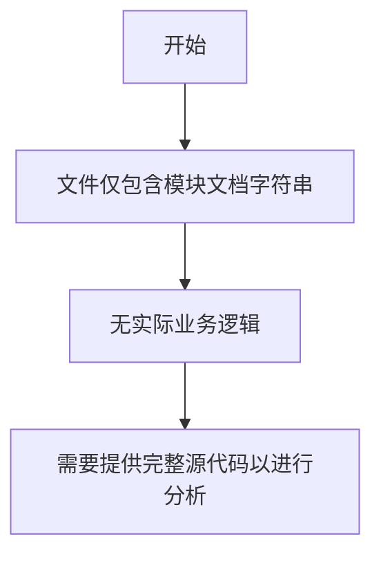

# `graphrag\packages\graphrag\graphrag\query\input\retrieval\__init__.py` 详细设计文档

GraphRAG编排输入检索模块的存根文件，仅包含版权和许可证声明，暂无实际实现代码。

## 整体流程



## 类结构

```
该文件无类定义结构
```

## 全局变量及字段


    

## 全局函数及方法


## 关键组件


### GraphRAG 编排输入检索模块

GraphRAG 系统中负责处理和管理检索输入的核心模块，涵盖输入验证、查询解析、检索参数配置及与下游检索引擎的交互协调。

### 输入数据模型

定义检索请求的数据结构和类型，包含查询文本、检索参数、过滤条件等核心字段。

### 查询解析器

将原始查询文本转换为结构化检索请求，支持关键词提取、语义增强和查询优化。

### 检索参数管理器

管理检索过程中的配置参数，包括相似度阈值、返回结果数量、索引类型等配置项。

### 编排协调器

协调输入处理、查询解析和检索执行的完整流程，处理错误和异常情况。

### 外部检索接口

与底层向量数据库或搜索引擎的接口抽象层，处理实际的检索操作。


## 问题及建议


### 已知问题

-   代码片段严重不完整，仅包含文件头和模块文档字符串，缺少实际的类和函数实现
-   模块文档字符串过于简略，仅包含名称而未说明具体功能、用途和使用方式
-   缺少类型注解（Type Hints），不利于静态分析和IDE支持
-   缺少模块级变量、函数或类的定义，无法进行详细分析
-   缺乏错误处理机制的代码示例
-   缺少单元测试或集成测试的框架代码
-   缺少 `__all__` 导出定义，公共API不明确

### 优化建议

-   补充完整的模块功能文档，包括主要类、函数的作用说明
-   为所有函数和类添加类型注解（PEP 484）
-   添加详细的docstring，包含参数、返回值和异常说明
-   建立基本的错误处理框架，定义自定义异常类
-   添加日志记录功能，便于调试和监控
-   考虑添加配置管理接口，支持运行时配置
-   建立测试框架，添加基础测试用例
-   定义 `__all__` 明确导出公共API
-   添加版本信息和变更日志
-   考虑添加性能监控和指标收集的基础设施


## 其它


### 一段话描述

GraphRAG Orchestration Input Retrieval 模块是 GraphRAG 系统中的关键组件，负责管理和协调各类输入数据的检索流程，支持从不同数据源获取结构化和非结构化数据，为后续的知识图谱构建和检索增强生成提供必要的输入数据支持。

### 文件的整体运行流程

由于当前代码文件仅包含模块声明和文档字符串，具体的运行流程需要根据实际实现确定。基于模块名称推测，该模块的主要运行流程可能包括：

1. 初始化检索配置和连接参数
2. 接收来自上游编排模块的检索请求
3. 根据请求类型选择相应的检索策略
4. 执行数据检索操作（可能涉及向量检索、图数据库查询、文本搜索等）
5. 对检索结果进行预处理和格式化
6. 返回标准化的检索结果给下游模块

### 类的详细信息

由于当前代码文件中未包含具体的类实现，无法提供详细的类信息。基于模块功能推测，可能涉及的核心类包括：

- **InputRetriever**：负责执行具体的输入数据检索操作
- **RetrievalConfig**：管理检索相关的配置参数
- **DataSourceConnector**：处理与不同数据源的连接和交互

### 全局变量和全局函数

由于当前代码文件中未包含具体的全局变量和函数实现，无法提供详细信息。

### 关键组件信息

由于当前代码文件中未包含具体实现细节，无法提供关键组件的详细信息。可能的关键组件包括：

- **检索策略选择器**：根据请求类型选择合适的检索方法
- **结果处理器**：对检索结果进行清洗、转换和格式化
- **缓存管理器**：优化重复检索的性能

### 潜在的技术债务或优化空间

由于代码文件内容有限，无法进行完整的技术债务分析。基于模块名称推测，可能的优化方向包括：

1. **检索性能优化**：建立有效的缓存机制，减少重复检索
2. **错误处理完善**：建立健壮的异常处理和重试机制
3. **扩展性支持**：支持更多类型的数据源和检索方法
4. **配置管理**：提供更灵活的检索配置选项

### 设计目标与约束

- **设计目标**：提供高效、可靠的输入数据检索能力，支持多种数据源类型，与 GraphRAG 系统其他模块无缝集成
- **设计约束**：需要遵循 GraphRAG 系统的整体架构规范，支持水平扩展，保持低延迟响应

### 错误处理与异常设计

由于代码文件内容有限，无法提供详细的错误处理机制。基于最佳实践推测，可能需要考虑：

- 数据源连接失败的处理
- 检索超时和重试机制
- 无结果返回的容错处理
- 输入参数验证

### 数据流与状态机

由于代码文件内容有限，无法提供详细的数据流和状态机描述。基于模块功能推测，可能的数据流包括：

- 输入请求 → 检索策略选择 → 数据源查询 → 结果处理 → 结果返回

### 外部依赖与接口契约

由于代码文件内容有限，无法提供详细的外部依赖信息。可能涉及的外部依赖包括：

- 图数据库客户端（如 NetworkX、Neo4j 等）
- 向量检索库
- 配置文件解析库
- 日志记录模块

### 接口规范

由于代码文件内容有限，无法提供详细的接口规范。基于模块功能推测，可能的接口包括：

- `retrieve_inputs(query: str, config: dict) -> List[dict]`：执行输入检索
- `validate_config(config: dict) -> bool`：验证配置有效性
- `get_supported_sources() -> List[str]`：获取支持的数据源类型

    