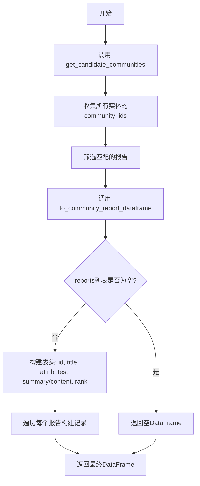
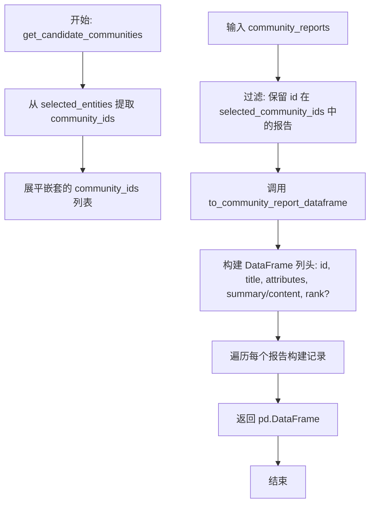
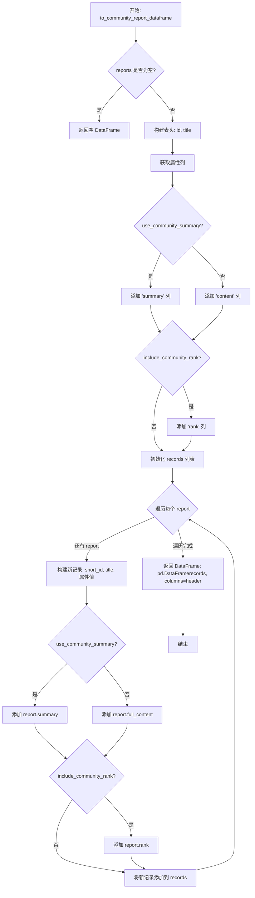

# `graphrag\packages\graphrag\graphrag\query\input\retrieval\community_reports.py` 详细设计文档

该模块提供从实体集合中检索相关社区报告的工具函数，能够将社区报告转换为pandas DataFrame格式，支持包含社区排名或使用摘要的选项。

## 整体流程



## 类结构

```
模块 (无类定义)
├── get_candidate_communities (函数)
└── to_community_report_dataframe (函数)
```

## 全局变量及字段


### `selected_entities`
    
选中的实体列表，用于筛选相关的社区报告

类型：`list[Entity]`
    


### `community_reports`
    
社区报告列表，作为数据源输入

类型：`list[CommunityReport]`
    


### `include_community_rank`
    
控制是否在结果数据帧中包含社区排名列

类型：`bool`
    


### `use_community_summary`
    
控制使用摘要还是完整内容作为文本列

类型：`bool`
    


### `selected_community_ids`
    
从选中实体中提取的所有社区ID列表（扁平化后的）

类型：`list`
    


### `selected_reports`
    
筛选出的与选中实体相关的社区报告列表

类型：`list[CommunityReport]`
    


### `reports`
    
待转换的社区报告列表输入参数

类型：`list[CommunityReport]`
    


### `header`
    
数据帧的列名列表，包含id、title、属性列、summary/content及可选的rank

类型：`list[str]`
    


### `attribute_cols`
    
社区报告的属性列名列表（排除id和title后）

类型：`list[str]`
    


### `records`
    
用于构建数据帧的记录列表，每条记录对应一个社区报告

类型：`list[list]`
    


### `report`
    
循环迭代中的当前社区报告对象

类型：`CommunityReport`
    


### `new_record`
    
当前报告转换后的记录列表

类型：`list`
    


### `field`
    
循环迭代中的当前属性字段名

类型：`str`
    


    

## 全局函数及方法


### `get_candidate_communities`

获取与选定实体相关的所有社区，返回包含社区报告信息的 pandas DataFrame。

参数：

- `selected_entities`：`list[Entity]`，选定的实体列表，每个实体包含其所属的社区 ID 列表
- `community_reports`：`list[CommunityReport]`，所有可用的社区报告列表
- `include_community_rank`：`bool`，可选参数，默认为 False，是否在结果中包含社区排名
- `use_community_summary`：`bool`，可选参数，默认为 False，是否使用社区摘要而非完整内容

返回值：`pd.DataFrame`，包含与选定实体相关的社区报告数据，列为 id、title、attributes、summary/content、以及可选的 rank

#### 流程图



#### 带注释源码

```python
def get_candidate_communities(
    selected_entities: list[Entity],
    community_reports: list[CommunityReport],
    include_community_rank: bool = False,
    use_community_summary: bool = False,
) -> pd.DataFrame:
    """Get all communities that are related to selected entities."""
    # 第一步：从选定的实体中提取所有社区 ID
    # 遍历每个实体，获取其 community_ids 属性（可能为空）
    selected_community_ids = [
        entity.community_ids for entity in selected_entities if entity.community_ids
    ]
    # 第二步：展平嵌套列表，将 [[1,2], [3,4]] 转换为 [1,2,3,4]
    selected_community_ids = [
        item for sublist in selected_community_ids for item in sublist
    ]
    # 第三步：根据社区 ID 过滤出相关的社区报告
    selected_reports = [
        community
        for community in community_reports
        if community.id in selected_community_ids
    ]
    # 第四步：调用辅助函数将报告列表转换为 DataFrame
    return to_community_report_dataframe(
        reports=selected_reports,
        include_community_rank=include_community_rank,
        use_community_summary=use_community_summary,
    )
```


### `to_community_report_dataframe`

将社区报告列表转换为pandas DataFrame格式，便于后续处理和展示。

参数：

- `reports`：`list[CommunityReport]`，社区报告对象列表
- `include_community_rank`：`bool = False`，是否在结果中包含社区排名信息
- `use_community_summary`：`bool = False`，是否使用摘要内容而非完整内容

返回值：`pd.DataFrame`，转换后的pandas DataFrame对象

#### 流程图



#### 带注释源码

```python
def to_community_report_dataframe(
    reports: list[CommunityReport],
    include_community_rank: bool = False,
    use_community_summary: bool = False,
) -> pd.DataFrame:
    """将社区报告列表转换为 pandas DataFrame。
    
    参数:
        reports: 社区报告对象列表
        include_community_rank: 是否包含社区排名
        use_community_summary: 是否使用摘要而非完整内容
        
    返回:
        转换后的 pandas DataFrame
    """
    # 空列表直接返回空 DataFrame，避免后续处理报错
    if len(reports) == 0:
        return pd.DataFrame()

    # --- 构建表头 ---
    # 基础列：id 和 title
    header = ["id", "title"]
    
    # 从第一个报告获取属性列名（假设所有报告结构一致）
    attribute_cols = list(reports[0].attributes.keys()) if reports[0].attributes else []
    # 排除已存在于基础列的字段
    attribute_cols = [col for col in attribute_cols if col not in header]
    # 将属性列添加到表头
    header.extend(attribute_cols)
    # 根据 use_community_summary 决定使用 summary 还是 content 列
    header.append("summary" if use_community_summary else "content")
    # 如果需要排名，则添加 rank 列
    if include_community_rank:
        header.append("rank")

    # --- 构建数据记录 ---
    records = []
    for report in reports:
        # 初始化记录，包含 short_id 和 title
        new_record = [
            report.short_id if report.short_id else "",  # 短 ID，空则为空字符串
            report.title,
        ]
        
        # 添加属性值（遍历属性列）
        new_record.extend([
            str(report.attributes.get(field, ""))
            if report.attributes and report.attributes.get(field)
            else ""
            for field in attribute_cols
        ])
        
        # 添加内容：根据 use_community_summary 选择 summary 或 full_content
        new_record.append(
            report.summary if use_community_summary else report.full_content
        )
        
        # 如果需要排名，添加 rank
        if include_community_rank:
            new_record.append(str(report.rank))
            
        # 将记录添加到列表
        records.append(new_record)
        
    # --- 返回 DataFrame ---
    # 使用 cast 避免类型检查警告
    return pd.DataFrame(records, columns=cast("Any", header))
```

## 关键组件


### 社区报告检索与转换框架

该代码模块提供从实体集合中筛选相关社区报告并将报告数据转换为 Pandas DataFrame 的工具函数，支持灵活选择社区排名和摘要内容。

### 候选社区筛选器 (get_candidate_communities)

从选定的实体列表中提取所有关联的社区ID，过滤社区报告集合，返回符合条件的社区报告 DataFrame。

### DataFrame 转换器 (to_community_report_dataframe)

将社区报告列表转换为结构化的 Pandas DataFrame，支持动态属性列提取、条件性包含社区排名和摘要/全文切换。

### 实体-社区关联关系处理

通过展平嵌套的 community_ids 列表实现多对多关系的查询，支持单一实体属于多个社区的场景。

### 属性列动态提取

从社区报告对象中自动提取 attributes 字典的键，排除预定义的头部字段，生成动态列结构。

### 数据规范化处理

对 short_id、attributes 和 rank 字段进行字符串转换和空值处理，确保 DataFrame 数据一致性。


## 问题及建议


### 已知问题

- **性能问题 - 集合转换缺失**：在`get_candidate_communities`函数中，`if community.id in selected_community_ids`使用了列表进行成员检查，时间复杂度为O(n)。当社区报告数量较大时，应先将`selected_community_ids`转换为集合以将复杂度降至O(1)。
- **重复属性访问**：`to_community_report_dataframe`函数中`reports[0].attributes.keys()`被调用，且在循环中多次访问`report.attributes`和`report.attributes.get(field)`，可提取到循环外部以减少重复计算。
- **类型安全妥协**：使用`cast("Any", header)`绕过类型检查，表明类型定义可能不精确，应改进类型注解而非使用cast。
- **魔法字符串**：代码中直接使用"summary"、"content"、"rank"等字符串字面量，应提取为常量以提高可维护性和避免拼写错误。
- **空值处理逻辑不一致**：使用`if report.short_id else ""`判断空值，这种方式无法区分`None`、空字符串和其他假值，应使用显式的None检查。
- **输入验证缺失**：函数参数`selected_entities`和`community_reports`可能为`None`，但没有进行前置验证，可能导致运行时错误。
- **列顺序不确定**：`reports[0].attributes.keys()`返回顺序依赖于字典实现（Python 3.7+虽然保证插入顺序，但属性字典的构建方式可能不稳定），可能导致不同运行产生不同列顺序的DataFrame。
- **内存效率问题**：通过列表推导式先收集所有记录再构建DataFrame，对大数据集可能造成较高的内存占用。

### 优化建议

- 将`selected_community_ids`列表转换为集合：`selected_community_ids_set = set(selected_community_ids)`，然后使用`if community.id in selected_community_ids_set`。
- 提取公共的列表展平逻辑为独立函数或使用`itertools.chain.from_iterable`。
- 定义常量类存储魔法字符串：`COLUMN_SUMMARY = "summary"`, `COLUMN_CONTENT = "content"`, `COLUMN_RANK = "rank"`。
- 使用显式None检查替代隐式布尔转换：`report.short_id if report.short_id is not None else ""`。
- 在函数入口添加参数验证：`if selected_entities is None or community_reports is None: raise ValueError(...)`。
- 考虑使用`pd.DataFrame.from_records`或直接构建带类型的DataFrame以提高效率。
- 为属性列排序以保证一致的列顺序：`attribute_cols = sorted([col for col in attribute_cols if col not in header])`。

## 其它


### 设计目标与约束

本模块的设计目标是提供一个高效的社区报告检索和转换工具，支持从实体列表中筛选相关社区报告，并将结果转换为结构化的pandas DataFrame格式，便于后续的数据处理和分析。约束条件包括：输入的实体列表和社区报告列表不能为None；社区报告对象必须包含id、title、attributes等必要字段；支持可选的社区排名和摘要功能。

### 错误处理与异常设计

代码中的错误处理主要体现在以下几个方面：1）空列表处理：当reports列表为空时，直接返回空的pandas DataFrame；2）空值处理：在构建DataFrame记录时，对short_id为None的情况处理为空字符串；3）属性字段处理：对于报告中不存在的属性字段，返回空字符串。异常情况主要包括：输入的community_reports或selected_entities为None可能导致AttributeError；报告中缺少必要字段（如id、title）会导致KeyError。建议在调用前对输入数据进行有效性校验。

### 外部依赖与接口契约

本模块依赖以下外部组件：1）pandas库 - 用于创建和管理DataFrame数据结构；2）typing模块 - 用于类型注解；3）graphrag.data_model.community_report.CommunityReport - 社区报告数据模型；4）graphrag.data_model.entity.Entity - 实体数据模型。接口契约要求：Entity对象必须包含community_ids属性（可选）；CommunityReport对象必须包含id、short_id、title、attributes、summary、full_content、rank等属性；所有输入参数均为可选参数，具有默认值。

### 性能考虑与优化空间

当前实现的主要性能瓶颈在于：1）列表推导式中多次遍历selected_community_ids和community_reports；2）每次调用get_candidate_communities都会重新构建selected_community_ids列表；3）to_community_report_dataframe中对每个报告逐个处理记录。优化建议：可以使用set数据结构存储selected_community_ids以提高查找效率；对于大规模数据，可以考虑使用向量化操作替代逐行处理；可以添加缓存机制避免重复计算。

### 测试考虑

建议添加以下测试用例：1）空输入测试 - 传入空列表时的行为验证；2）正常输入测试 - 验证返回的DataFrame结构和内容正确性；3）边界情况测试 - 包含None值、缺失字段的社区报告；4）参数组合测试 - 不同include_community_rank和use_community_summary组合；5）性能测试 - 大规模数据集下的执行时间和内存使用情况。

### 使用示例与调用场景

典型调用场景包括：1）在图检索系统中，根据用户查询的实体获取相关的社区报告；2）在知识图谱构建过程中，将社区信息导出为表格形式进行进一步分析；3）在可视化模块中，将社区报告转换为DataFrame以便绑定到UI组件。调用示例：首先准备Entity列表和CommunityReport列表，然后调用get_candidate_communities函数，设置include_community_rank和use_community_summary参数获取所需的DataFrame结果。

    