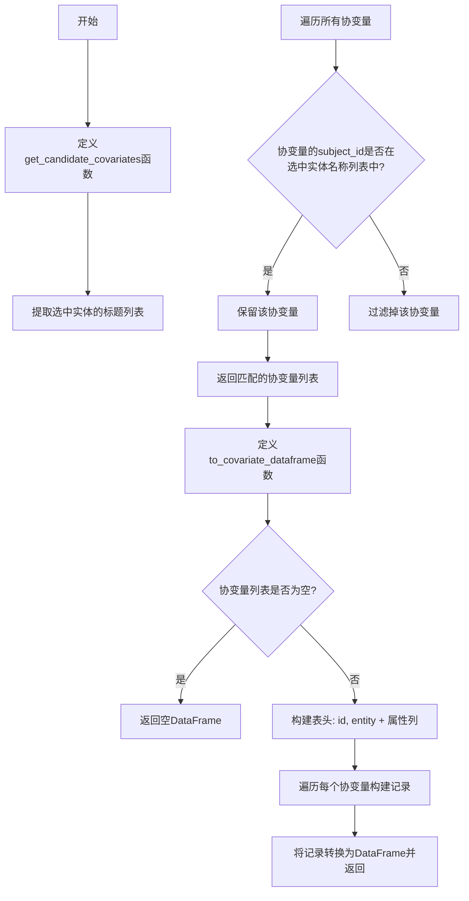
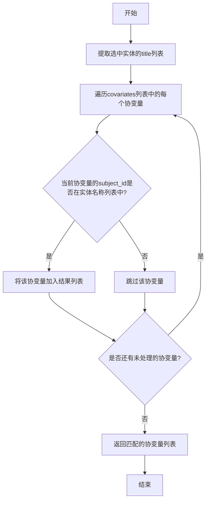
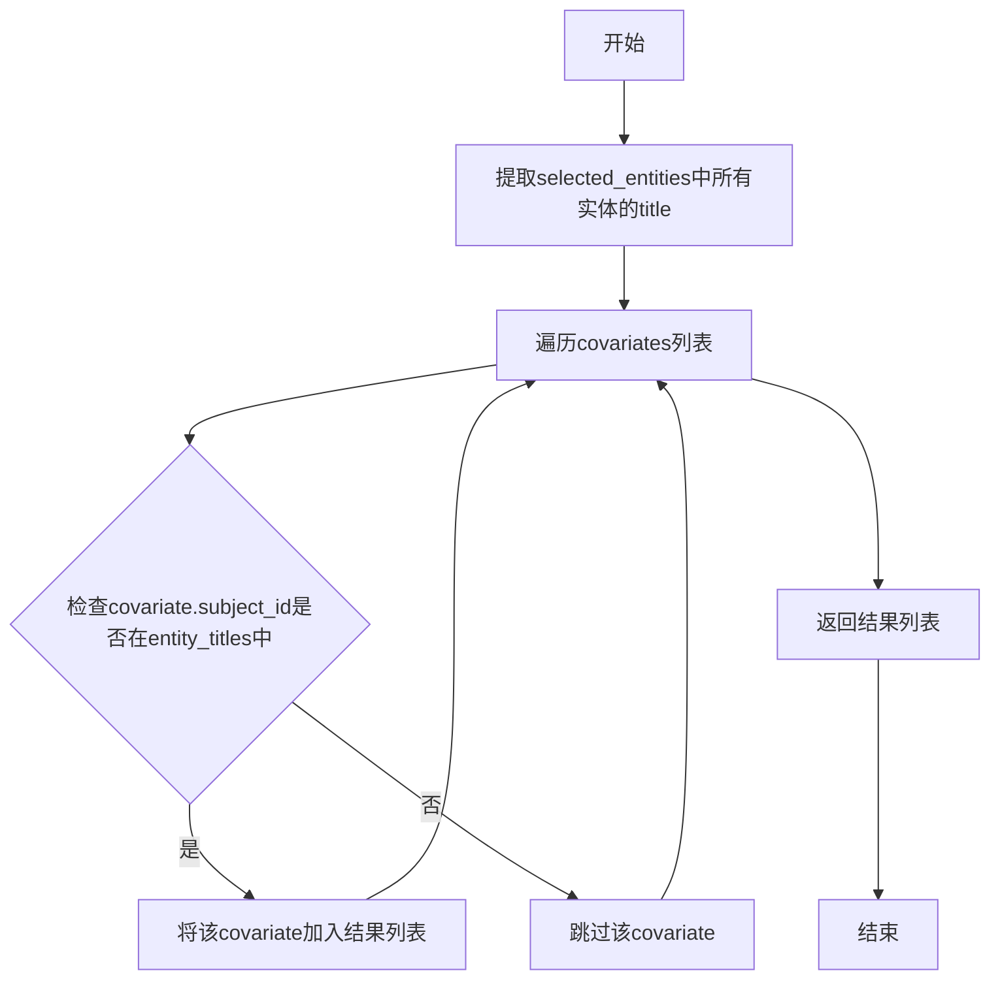
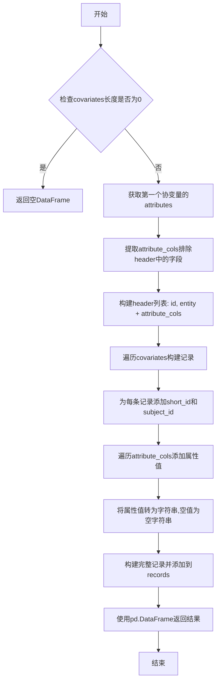

# `graphrag\packages\graphrag\graphrag\query\input\retrieval\covariates.py` 详细设计文档

该文件提供了从实体集合中检索协变量的工具函数，包括根据选定实体筛选相关协变量，以及将协变量列表转换为pandas DataFrame格式。

## 整体流程



## 类结构

```
该文件为工具函数模块，不包含类定义
仅包含两个全局函数:
├── get_candidate_covariates
└── to_covariate_dataframe
```

## 全局变量及字段


### `selected_entity_names`
    
从选定的实体中提取的标题列表，用于后续协变量过滤

类型：`list[str]`
    


### `header`
    
DataFrame的列名列表，包含id和entity基础列以及动态属性列

类型：`list[str]`
    


### `attributes`
    
第一个协变量的属性字典，用于提取属性键

类型：`dict[str, Any]`
    


### `attribute_cols`
    
协变量的动态属性列名列表（排除id和entity基础列后）

类型：`list[str]`
    


### `records`
    
用于构建DataFrame的数据记录列表，每条记录对应一个协变量

类型：`list[list[Any]]`
    


### `new_record`
    
单条协变量记录，包含short_id、subject_id和所有属性值

类型：`list[Any]`
    


### `field_value`
    
单个属性字段的字符串值，用于构建记录

类型：`str`
    


    

## 全局函数及方法


### `get_candidate_covariates`

该函数用于从给定的协变量列表中筛选出与所选实体相关的协变量，通过比对协变量的 `subject_id` 与选中实体的 `title` 来实现关联匹配。

参数：

- `selected_entities`：`list[Entity]`，选中的实体列表，用于确定需要保留哪些协变量
- `covariates`：`list[Covariate]`，待筛选的协变量列表

返回值：`list[Covariate]`，返回与选中实体相关的协变量子集

#### 流程图



#### 带注释源码

```python
def get_candidate_covariates(
    selected_entities: list[Entity],
    covariates: list[Covariate],
) -> list[Covariate]:
    """Get all covariates that are related to selected entities."""
    
    # 从选中的实体列表中提取所有实体的title，形成一个名称列表
    # 用于后续比对协变量的subject_id
    selected_entity_names = [entity.title for entity in selected_entities]
    
    # 列表推导式：过滤出所有subject_id在选中实体名称列表中的协变量
    # 返回与选中实体相关联的所有协变量
    return [
        covariate
        for covariate in covariates
        if covariate.subject_id in selected_entity_names
    ]
```


### `to_covariate_dataframe`

将协变量列表转换为 pandas DataFrame 的工具函数。该函数接收一个协变量列表，通过提取每个协变量的标识符、主题ID以及自定义属性，构建一个结构化的表格数据格式。

参数：

- `covariates`：`list[Covariate]` - 要转换的协变量列表，每个协变量包含标识符、主题ID和可选的自定义属性

返回值：`pd.DataFrame` - 转换后的 pandas DataFrame，表头包含 id、entity 以及协变量的所有自定义属性列

#### 流程图

```mermaid
flowchart TD
    A[开始] --> B{检查 covariates 是否为空}
    B -->|是| C[返回空 DataFrame]
    B -->|否| D[初始化 header: ["id", "entity"]]
    D --> E[获取第一个 covariate 的 attributes]
    E --> F{检查 covariates 长度 > 0}
    F -->|是| G[获取 attributes keys]
    F -->|否| H[attribute_cols = []]
    G --> I[过滤排除 header 中的列]
    I --> J[header.extendattribute_cols]
    J --> K[初始化 records 列表]
    K --> L{遍历 covariates}
    L -->|每个 covariate| M[构建 new_record]
    M --> N[添加 short_id 或空字符串]
    N --> O[添加 subject_id]
    O --> P{遍历 attribute_cols}
    P -->|每个 field| Q[获取 attributes 中的值]
    Q --> R[转换为字符串或空字符串]
    R --> S[添加到 new_record]
    S --> P
    P -->|结束| T[new_record 加入 records]
    T --> L
    L -->|结束| U[返回 DataFrame]
```

#### 带注释源码

```python
def to_covariates_dataframe(covariates: list[Covariate]) -> pd.DataFrame:
    """将协变量列表转换为 pandas DataFrame。
    
    参数:
        covariates: 要转换的协变量列表
        
    返回:
        转换后的 DataFrame，表头包含 id、entity 及所有自定义属性
    """
    # 检查输入列表是否为空，若为空则直接返回空 DataFrame
    if len(covariates) == 0:
        return pd.DataFrame()

    # === 第一步：构建表头（header）===
    # 初始化基础列：id 和 entity
    header = ["id", "entity"]
    
    # 获取第一个协变量的属性字典，若存在则提取其键名作为列名
    attributes = covariates[0].attributes or {} if len(covariates) > 0 else {}
    attribute_cols = list(attributes.keys()) if len(covariates) > 0 else []
    
    # 过滤掉与基础列重复的属性名，确保列名唯一
    attribute_cols = [col for col in attribute_cols if col not in header]
    
    # 将属性列名添加到表头
    header.extend(attribute_cols)

    # === 第二步：构建数据记录 ===
    records = []
    
    # 遍历每个协变量，逐一构建记录
    for covariate in covariates:
        # 构建新记录的前两列：short_id（短ID）和 subject_id（主题ID）
        new_record = [
            covariate.short_id if covariate.short_id else "",  # 若 short_id 不存在则为空字符串
            covariate.subject_id,
        ]
        
        # 遍历属性列，提取并添加每个属性的值
        for field in attribute_cols:
            field_value = (
                str(covariate.attributes.get(field))  # 将属性值转换为字符串
                if covariate.attributes and covariate.attributes.get(field)
                else ""  # 若属性不存在则为空字符串
            )
            new_record.append(field_value)
        
        # 将构建好的记录添加到记录列表
        records.append(new_record)
    
    # === 第三步：返回 DataFrame ===
    # 使用 cast("Any", header) 绕过类型检查问题
    return pd.DataFrame(records, columns=cast("Any", header))
```

## 关键组件


### 实体-协变量关联过滤

通过实体标题匹配协变量的subject_id，实现协变量数据的筛选功能

### 协变量DataFrame转换

将协变量对象列表转换为带表头的pandas DataFrame，支持动态属性列提取


## 问题及建议


### 已知问题

-   **重复计算列表长度**：代码中多次检查 `len(covariates) > 0`（第31行和第34行），在第30行已经检查了 `len(covariates) == 0` 的情况下，后续的 `len(covariates) > 0` 检查是冗余的
-   **属性访问冗余**：`covariate.attributes` 在循环中被多次访问（第38行、第40行），每次都需要进行字典查找和None检查
-   **类型转换妥协**：使用 `cast("Any", header)` 表明类型定义不够精确，这是一种类型断言的妥协方式
-   **硬编码列名**："id"和"entity"作为header被硬编码在函数内部，缺乏可配置性
-   **字符串转换方式**：使用 `str()` 进行属性值的字符串转换可能不是最优方式，可能丢失类型信息或格式化不佳

### 优化建议

-   **提取属性缓存**：在循环外获取 `covariate.attributes`，避免重复字典查找
-   **移除冗余检查**：在第30行已经处理空列表后，删除后续冗余的 `len(covariates) > 0` 判断
-   **优化类型提示**：重新审视 Covariate 类型定义，消除对 `cast()` 的依赖
-   **常量提取**：将 "id"、"entity" 等列名提取为模块级常量
-   **属性获取优化**：使用 `getattr()` 或改进的属性访问方式，减少嵌套的if检查

## 其它


### 一段话描述

该代码模块提供了从实体集合中检索相关协变量的工具函数，包含两个核心函数：一个用于根据选定的实体筛选关联的协变量，另一个用于将协变量列表转换为pandas DataFrame格式，便于后续数据处理和分析。

### 文件的整体运行流程

该模块主要服务于数据处理流水线，提供两种操作能力。首先，`get_candidate_covariates`函数接收实体列表和协变量列表，通过遍历比较协变量的subject_id与实体的title字段，筛选出与选定实体相关的所有协变量。其次，`to_covariate_dataframe`函数接收协变量列表，将其转换为结构化的pandas DataFrame，其中第一列为id和entity，后列为协变量的属性字段，每个协变量对应DataFrame的一行记录。

### 全局变量和全局函数详细信息

### get_candidate_covariates

**参数：**
- selected_entities: list[Entity] - 选定的实体对象列表，用于匹配协变量
- covariates: list[Covariate] - 所有的协变量列表，从中筛选相关协变量

**返回值：** list[Covariate] - 与选定实体相关的协变量列表

**功能描述：** 获取所有与选定实体相关的协变量，通过比对协变量的subject_id与实体的title字段来确定关联关系

**mermaid流程图：**



**源码：**

```python
def get_candidate_covariates(
    selected_entities: list[Entity],
    covariates: list[Covariate],
) -> list[Covariate]:
    """Get all covariates that are related to selected entities."""
    # 提取所有选中实体的title作为匹配依据
    selected_entity_names = [entity.title for entity in selected_entities]
    # 列表推导式过滤出subject_id在实体名称列表中的协变量
    return [
        covariate
        for covariate in covariates
        if covariate.subject_id in selected_entity_names
    ]
```

### to_covariate_dataframe

**参数：**
- covariates: list[Covariate] - 协变量列表，需要转换为DataFrame

**返回值：** pd.DataFrame - 转换后的pandas DataFrame对象，空列表返回空DataFrame

**功能描述：** 将协变量列表转换为pandas DataFrame格式，包含id、entity字段以及所有属性字段

**mermaid流程图：**



**源码：**

```python
def to_covariate_dataframe(covariates: list[Covariate]) -> pd.DataFrame:
    """Convert a list of covariates to a pandas dataframe."""
    # 空列表直接返回空DataFrame，避免后续处理空列表
    if len(covariates) == 0:
        return pd.DataFrame()

    # 构建表头：先添加基础字段id和entity
    header = ["id", "entity"]
    # 从第一个协变量获取属性键名，处理空列表边界情况
    attributes = covariates[0].attributes or {} if len(covariates) > 0 else {}
    attribute_cols = list(attributes.keys()) if len(covariates) > 0 else []
    # 排除已在header中的字段，避免重复列
    attribute_cols = [col for col in attribute_cols if col not in header]
    header.extend(attribute_cols)

    # 遍历每个协变量构建记录
    records = []
    for covariate in covariates:
        # 基础字段：short_id和subject_id
        new_record = [
            covariate.short_id if covariate.short_id else "",
            covariate.subject_id,
        ]
        # 遍历属性列添加属性值
        for field in attribute_cols:
            field_value = (
                str(covariate.attributes.get(field))
                if covariate.attributes and covariate.attributes.get(field)
                else ""
            )
            new_record.append(field_value)
        records.append(new_record)
    # 构建DataFrame，使用cast避免类型警告
    return pd.DataFrame(records, columns=cast("Any", header))
```

### 关键组件信息

- **Entity模型**：来自graphrag.data_model.entity模块，表示图谱中的实体对象，包含title字段用于标识实体名称
- **Covariate模型**：来自graphrag.data_model.covariate模块，表示图谱中的协变量对象，包含short_id、subject_id和attributes字段
- **pandas库**：外部依赖，用于创建和操作DataFrame数据结构

### 潜在的技术债务或优化空间

1. **冗余条件判断**：在to_covariate_dataframe函数中，`if len(covariates) > 0 else {}`的判断在外层已经判断过len(covariates) == 0的情况下是冗余的，可以直接访问covariates[0].attributes
2. **类型转换开销**：属性值转换为字符串时使用str()函数，可能在大量数据时影响性能
3. **缺少错误处理**：没有对Entity或Covariate对象的必要字段进行验证，如果对象缺少必要属性可能抛出AttributeError
4. **属性一致性假设**：假设所有协变量具有相同的属性结构，如果属性结构不一致可能导致DataFrame列不完整
5. **重复计算**：每次调用都重新构建header，对于大规模数据处理可以缓存header结构

### 设计目标与约束

该模块的设计目标是为图谱检索系统提供轻量级的协变量筛选和转换功能。核心约束包括：依赖graphrag数据模型中的Entity和Covariate定义，输出格式必须兼容pandas DataFrame以便于下游分析，函数设计为纯函数无副作用便于并行处理。设计时考虑了与现有数据处理流水线的集成需求，确保输出的DataFrame可以直接用于后续的机器学习或可视化流程。

### 错误处理与异常设计

当前代码的错误处理较为薄弱，存在以下改进空间：当传入空列表时正确返回空DataFrame，但未验证输入类型是否符合预期；如果Covariate对象缺少subject_id或attributes属性会抛出AttributeError；属性值类型转换使用str()可能产生意外结果（如None转为"None"字符串）。建议添加输入验证逻辑，对异常情况给出明确错误提示而非静默失败。外部调用方应确保传入的Entity和Covariate对象具有必要的属性字段。

### 数据流与状态机

该模块不涉及复杂的状态机设计，属于无状态的数据转换函数。数据流遵循以下路径：外部系统 -> get_candidate_covariates -> 关联筛选 -> 协变量列表 -> to_covariate_dataframe -> DataFrame -> 下游分析。整个过程中数据不可变，函数不维护任何内部状态，便于测试和并行执行。

### 外部依赖与接口契约

主要外部依赖包括：typing模块提供类型注解支持，pandas库提供DataFrame实现，graphrag.data_model.covariate和graphrag.data_model.entity定义数据结构。接口契约要求：get_covariates函数接受Entity列表和Covariate列表，返回关联的Covariate列表；to_covariate_dataframe接受Covariate列表返回DataFrame，输入为空列表时返回空DataFrame。调用方需保证Entity对象具有title属性，Covariate对象具有subject_id、short_id和attributes属性。

### 性能考虑

在处理大规模数据时，性能瓶颈主要包括：列表推导式遍历协变量列表的时间复杂度为O(n*m)，其中n为实体数，m为协变量数；属性字典的get操作和字符串转换带来额外开销；每次调用都重新构建表头结构。优化方向包括：考虑使用集合(set)存储实体名称以提升查找性能至O(1)；对于大规模转换场景可考虑分批处理；对于属性结构一致的情况可缓存表头结构。
    