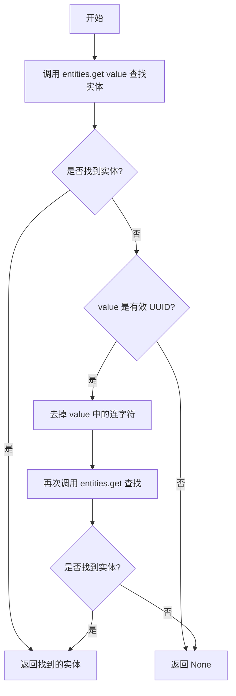
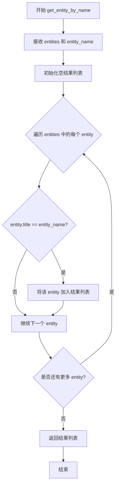
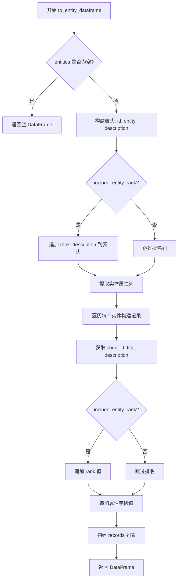
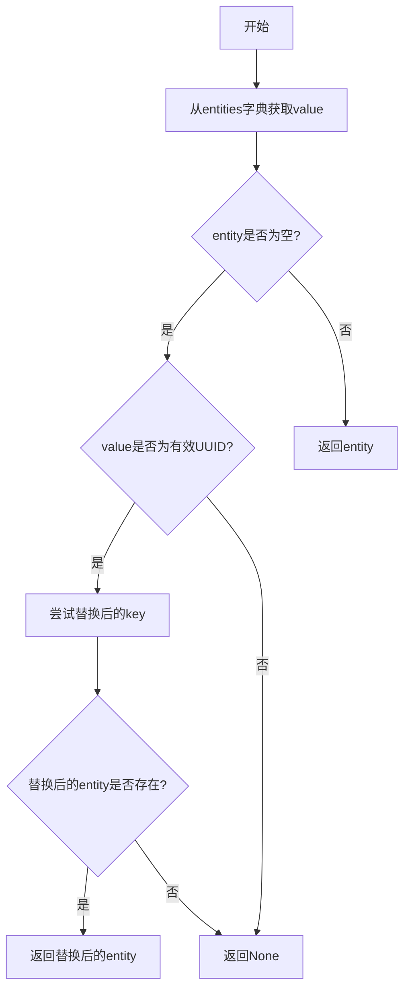
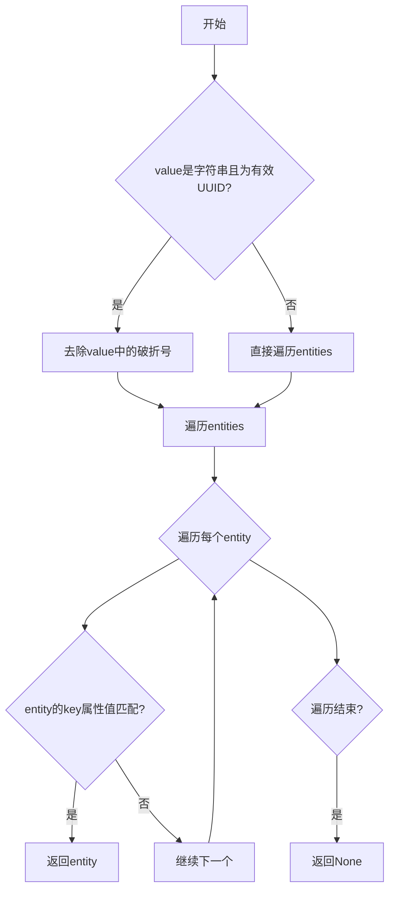
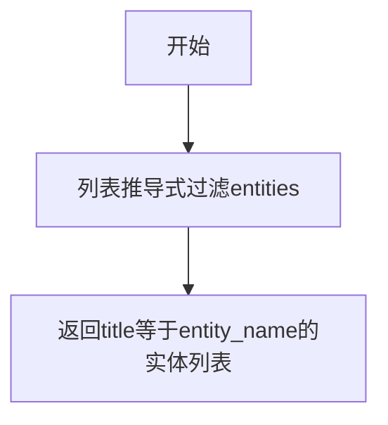
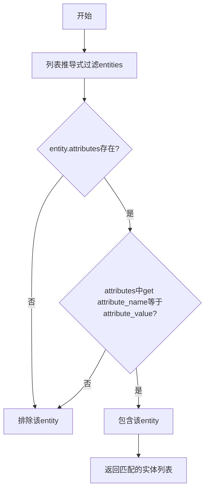
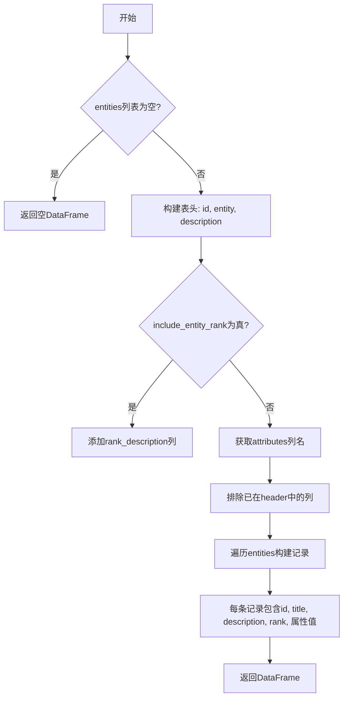
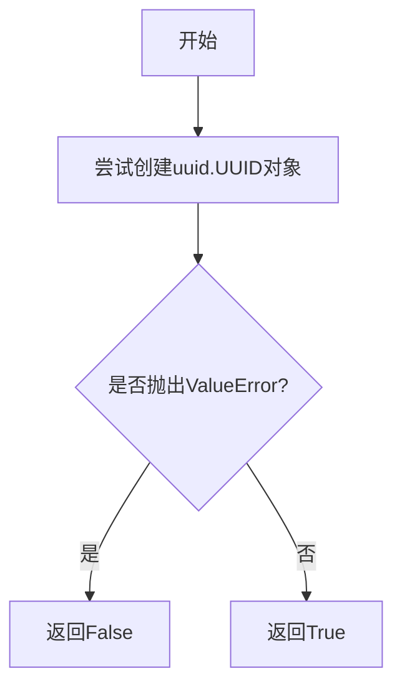

# `graphrag\packages\graphrag\graphrag\query\input\retrieval\entities.py` 详细设计文档

该模块提供了一系列工具函数，用于从实体集合中按不同方式（ID、键、名称、属性）查询实体，并将实体列表转换为pandas DataFrame格式，支持UUID验证和去重处理。

## 整体流程

```mermaid
graph TD
    A[开始] --> B{查询类型}
B --> C[按ID查询]
B --> D[按键查询]
B --> E[按名称查询]
B --> F[按属性查询]
B --> G[转换为DataFrame]
C --> C1[调用get_entity_by_id]
C1 --> C2{entities.get成功?}
C2 -- 是 --> C3[返回Entity]
C2 -- 否 --> C4[尝试去UUID横线后查询]
C4 --> C5[返回Entity或None]
D --> D1[调用get_entity_by_key]
D1 --> D2{值是UUID?}
D2 -- 是 --> D3[遍历entities比较value和value_no_dashes]
D2 -- 否 --> D4[直接遍历比较]
D3 --> D5[返回Entity或None]
D4 --> D5
E --> E1[调用get_entity_by_name]
E1 --> E2[列表推导式过滤title==entity_name]
E2 --> E3[返回list[Entity]]
F --> F1[调用get_entity_by_attribute]
F1 --> F2[列表推导式过滤attributes.get==attribute_value]
F2 --> F3[返回list[Entity]]
G --> G1[调用to_entity_dataframe]
G1 --> G2{entities为空?}
G2 -- 是 --> G3[返回空DataFrame]
G2 -- 否 --> G4[构建表头和记录]
G4 --> G5[返回pd.DataFrame]
```

## 类结构

```
无类层次结构 (纯工具函数模块)
```

## 全局变量及字段


### `entities`
    
A dictionary mapping entity IDs to Entity objects

类型：`dict[str, Entity]`
    


### `value`
    
The entity ID or UUID string to search for

类型：`str`
    


### `key`
    
The attribute name to search by

类型：`str`
    


### `entity_name`
    
The name/title of the entity to search for

类型：`str`
    


### `attribute_name`
    
The name of the entity attribute to filter by

类型：`str`
    


### `attribute_value`
    
The value to match against the specified attribute

类型：`Any`
    


### `include_entity_rank`
    
Whether to include entity rank column in the dataframe

类型：`bool`
    


### `rank_description`
    
Description text for the rank column header

类型：`str`
    


### `entities`
    
A list of Entity objects to convert to dataframe

类型：`list[Entity]`
    


### `header`
    
Column headers for the dataframe

类型：`list[str]`
    


### `attribute_cols`
    
List of attribute column names to include

类型：`list[str]`
    


### `records`
    
List of row records for the dataframe

类型：`list[list[Any]]`
    


### `new_record`
    
A single row record being constructed

类型：`list[Any]`
    


    

## 全局函数及方法


### `get_entity_by_id`

根据给定的 ID（支持带连字符或不带连字符的 UUID 格式）从实体字典中查找并返回对应的 Entity 对象。

参数：

- `entities`：`dict[str, Entity]`，实体字典，键为实体 ID（字符串），值为 Entity 对象
- `value`：`str`，要查找的实体 ID，可以是带连字符的 UUID 或不带连字符的 UUID

返回值：`Entity | None`，如果找到则返回 Entity 对象，否则返回 None

#### 流程图



#### 带注释源码

```python
def get_entity_by_id(entities: dict[str, Entity], value: str) -> Entity | None:
    """Get entity by id.
    
    根据给定的 ID 从实体字典中查找实体。支持两种格式的 UUID：
    1. 带连字符的标准 UUID 格式（如 '550e8400-e29b-41d4-a716-446655440000'）
    2. 不带连字符的 UUID 格式（如 '550e8400e29b41d4a716446655440000'）
    
    参数:
        entities: 实体字典，键为实体 ID 字符串，值为 Entity 对象
        value: 要查找的实体 ID 字符串
        
    返回:
        找到的 Entity 对象，若不存在则返回 None
    """
    # 第一次尝试：直接用原始 value 查找
    entity = entities.get(value)
    
    # 如果没找到，且 value 是有效 UUID，则尝试去掉连字符后再次查找
    # 这是为了兼容两种 UUID 格式的存储方式
    if entity is None and is_valid_uuid(value):
        entity = entities.get(value.replace("-", ""))
    
    # 返回找到的实体（可能为 None）
    return entity
```


### `get_entity_by_key`

根据指定的键（属性名）从实体集合中查找并返回第一个匹配的实体。

参数：

- `entities`：`Iterable[Entity]`，实体集合，可迭代的 Entity 对象列表
- `key`：`str`，要匹配的实体属性名
- `value`：`str | int`，要匹配的属性值，支持字符串或整数类型

返回值：`Entity | None`，找到的第一个匹配实体，如果未找到则返回 None

#### 流程图

```mermaid
flowchart TD
    A[开始 get_entity_by_key] --> B{value 是字符串<br/>且为有效 UUID?}
    B -->|是| C[value_no_dashes = value.replace<br/>('-', '')]
    B -->|否| F[遍历 entities]
    C --> D[遍历 entities]
    D --> E[entity_value = getattr<br/>(entity, key)]
    E --> G{entity_value == value<br/>或 entity_value ==<br/>value_no_dashes?}
    F --> H[entity_value = getattr<br/>(entity, key)]
    H --> I{entity_value == value?}
    G -->|是| J[返回 entity]
    G -->|否| K{还有更多实体?}
    I -->|是| J
    I -->|否| L{还有更多实体?}
    K -->|是| D
    K -->|否| M[返回 None]
    L -->|是| F
    L -->|否| M
```

#### 带注释源码

```python
def get_entity_by_key(
    entities: Iterable[Entity], key: str, value: str | int
) -> Entity | None:
    """Get entity by key."""
    # 检查value是否为字符串且为有效UUID格式
    if isinstance(value, str) and is_valid_uuid(value):
        # 移除UUID中的短横线，用于兼容存储格式
        value_no_dashes = value.replace("-", "")
        # 遍历所有实体，尝试匹配UUID（原始值或无短横线格式）
        for entity in entities:
            entity_value = getattr(entity, key)
            # 检查属性值是否匹配原始UUID或无短横线UUID
            if entity_value in (value, value_no_dashes):
                return entity
    else:
        # 非UUID场景：直接遍历实体进行精确匹配
        for entity in entities:
            if getattr(entity, key) == value:
                return entity
    # 未找到匹配实体时返回None
    return None
```


### `get_entity_by_name`

根据指定名称从实体集合中筛选并返回所有匹配的实体对象。

参数：

- `entities`：`Iterable[Entity]`，输入的实体集合迭代器
- `entity_name`：`str`，要匹配的实体名称（title 字段）

返回值：`list[Entity]`，返回所有 title 字段与指定名称匹配的实体对象列表

#### 流程图



#### 带注释源码

```python
def get_entity_by_name(entities: Iterable[Entity], entity_name: str) -> list[Entity]:
    """Get entities by name.
    
    根据实体名称（title 字段）从实体集合中筛选匹配的实体。
    这是一个精确匹配查找，返回所有 title 完全等于 entity_name 的实体。
    
    Args:
        entities: 实体对象的可迭代集合（list、set、generator 等）
        entity_name: 要匹配的实体名称字符串
    
    Returns:
        返回所有 title 字段与 entity_name 完全匹配的 Entity 对象列表
    """
    # 使用列表推导式遍历所有实体，筛选 title 字段等于 entity_name 的实体
    return [entity for entity in entities if entity.title == entity_name]
```


### `get_entity_by_attribute`

根据指定的属性名称和属性值，从实体集合中筛选并返回所有匹配该属性的实体列表。

参数：

- `entities`：`Iterable[Entity]`，实体集合，可迭代的 Entity 对象列表
- `attribute_name`：`str`，属性名称，用于匹配的属性名
- `attribute_value`：`Any`，属性值，用于匹配的属性值

返回值：`list[Entity]`，返回所有属性值匹配的实体列表

#### 流程图

```mermaid
flowchart TD
    A[开始 get_entity_by_attribute] --> B[初始化空结果列表]
    B --> C{遍历 entities 中的每个 entity}
    C --> D{entity.attributes 存在且非空?}
    D -->|否| C
    D -->|是| E{attributes 中是否存在 attribute_name?}
    E -->|否| C
    E -->|是| F{entity.attributes[attribute_name] == attribute_value?}
    F -->|否| C
    F -->|是| G[将该 entity 添加到结果列表]
    G --> C
    C --> H[遍历完成]
    H --> I[返回结果列表]
```

#### 带注释源码

```python
def get_entity_by_attribute(
    entities: Iterable[Entity], attribute_name: str, attribute_value: Any
) -> list[Entity]:
    """Get entities by attribute.
    
    根据指定的属性名称和属性值，从实体集合中筛选匹配的实体。
    
    参数:
        entities: 可迭代的 Entity 实体集合
        attribute_name: 要匹配的属性的名称
        attribute_value: 要匹配的属性的值
    
    返回:
        包含所有匹配属性值的 Entity 对象列表
    """
    # 使用列表推导式遍历所有实体，过滤出属性匹配的实体
    return [
        entity
        for entity in entities  # 遍历输入的实体集合
        if entity.attributes  # 检查实体是否具有 attributes 属性且非空
        and entity.attributes.get(attribute_name) == attribute_value  # 检查指定属性的值是否匹配
    ]
```


### `to_entity_dataframe`

该函数用于将实体对象列表转换为 pandas DataFrame，支持可选的实体排名信息以及动态提取实体属性列。

参数：

- `entities`：`list[Entity]`，需要转换的实体列表
- `include_entity_rank`：`bool = True`，是否在 DataFrame 中包含实体排名列
- `rank_description`：`str = "number of relationships"`，排名列的列名描述

返回值：`pd.DataFrame`，转换后的 pandas 数据框

#### 流程图



#### 带注释源码

```python
def to_entity_dataframe(
    entities: list[Entity],
    include_entity_rank: bool = True,
    rank_description: str = "number of relationships",
) -> pd.DataFrame:
    """将实体列表转换为 pandas DataFrame。
    
    参数:
        entities: 实体对象列表
        include_entity_rank: 是否包含实体排名列
        rank_description: 排名列的显示名称
    
    返回:
        包含实体数据的 DataFrame
    """
    # 空列表直接返回空 DataFrame
    if len(entities) == 0:
        return pd.DataFrame()
    
    # 初始化基础表头：id、entity 标题、description 描述
    header = ["id", "entity", "description"]
    
    # 如果需要包含排名，则追加排名描述作为列名
    if include_entity_rank:
        header.append(rank_description)
    
    # 从第一个实体的 attributes 字典中提取所有属性键作为额外列
    # 并过滤掉已存在于 header 中的列（如 id、entity、description）
    attribute_cols = (
        list(entities[0].attributes.keys()) if entities[0].attributes else []
    )
    attribute_cols = [col for col in attribute_cols if col not in header]
    
    # 将属性列名追加到表头
    header.extend(attribute_cols)

    # 逐个实体构建记录
    records = []
    for entity in entities:
        # 构建基础记录：short_id、title、description
        new_record = [
            entity.short_id if entity.short_id else "",
            entity.title,
            entity.description if entity.description else "",
        ]
        
        # 如果包含排名，则将 rank 转为字符串追加
        if include_entity_rank:
            new_record.append(str(entity.rank))

        # 遍历属性列，提取对应属性值
        for field in attribute_cols:
            field_value = (
                str(entity.attributes.get(field))
                if entity.attributes and entity.attributes.get(field)
                else ""
            )
            new_record.append(field_value)
        
        # 将构建好的记录添加到 records 列表
        records.append(new_record)
    
    # 使用构建好的 records 和 header 生成 DataFrame
    return pd.DataFrame(records, columns=cast("Any", header))
```


### `is_valid_uuid`

确定字符串是否为有效的UUID格式。

参数：

- `value`：`str`，需要验证的字符串值

返回值：`bool`，如果是有效的UUID则返回True，否则返回False

#### 流程图

```mermaid
flowchart TD
    A[开始] --> B[接收value参数]
    B --> C[尝试调用uuid.UUID str(value)]
    C --> D{是否抛出ValueError异常?}
    D -->|是| E[返回False]
    D -->|否| F[返回True]
    E --> G[结束]
    F --> G
```

#### 带注释源码

```python
def is_valid_uuid(value: str) -> bool:
    """Determine if a string is a valid UUID."""
    try:
        # 尝试将输入值转换为UUID对象
        # uuid.UUID()会验证字符串是否符合UUID格式
        uuid.UUID(str(value))
    except ValueError:
        # 如果抛出ValueError，说明不是有效的UUID格式
        return False
    else:
        # 没有抛出异常，说明是有效的UUID
        return True
```

## 关键组件


### 一段话描述

该代码模块提供了从实体集合中检索实体的工具函数，支持按ID、键、名称、属性等多种方式查询实体，并可将实体列表转换为pandas DataFrame格式，同时包含UUID验证和标准化处理功能。

### 文件的整体运行流程

该模块为纯工具函数集合，不存在主执行流程。各函数可被外部模块独立调用：
1. 外部模块传入实体集合（dict或Iterable）作为参数
2. 根据查询条件调用相应的get_entity_*函数
3. 如需数据展示，调用to_entity_dataframe转换为DataFrame
4. is_valid_uuid作为辅助函数被其他函数调用处理UUID格式

### 类的详细信息

该文件不包含类定义，仅包含全局函数。

### 全局变量和全局函数

#### uuid
- **类型**: import (标准库)
- **描述**: Python标准库uuid模块，用于UUID生成和验证

#### pd
- **类型**: import (第三方库)
- **描述**: pandas库别名，用于DataFrame操作

#### Entity
- **类型**: import (自定义模块)
- **描述**: 实体数据模型类，来自graphrag.data_model.entity

#### get_entity_by_id
- **名称**: get_entity_by_id
- **参数**: entities (dict[str, Entity]), value (str)
- **参数类型**: dict[str, Entity], str
- **参数描述**: entities为实体字典映射，value为待查询的ID字符串
- **返回值类型**: Entity | None
- **返回值描述**: 找到的实体对象或None
- **mermaid流程图**: 

- **源码**:
```python
def get_entity_by_id(entities: dict[str, Entity], value: str) -> Entity | None:
    """Get entity by id."""
    entity = entities.get(value)
    if entity is None and is_valid_uuid(value):
        entity = entities.get(value.replace("-", ""))
    return entity
```

#### get_entity_by_key
- **名称**: get_entity_by_key
- **参数**: entities (Iterable[Entity]), key (str), value (str | int)
- **参数类型**: Iterable[Entity], str, str | int
- **参数描述**: entities为实体可迭代对象，key为实体属性名，value为待匹配的值
- **返回值类型**: Entity | None
- **返回值描述**: 找到的第一个匹配实体或None
- **mermaid流程图**:

- **源码**:
```python
def get_entity_by_key(
    entities: Iterable[Entity], key: str, value: str | int
) -> Entity | None:
    """Get entity by key."""
    if isinstance(value, str) and is_valid_uuid(value):
        value_no_dashes = value.replace("-", "")
        for entity in entities:
            entity_value = getattr(entity, key)
            if entity_value in (value, value_no_dashes):
                return entity
    else:
        for entity in entities:
            if getattr(entity, key) == value:
                return entity
    return None
```

#### get_entity_by_name
- **名称**: get_entity_by_name
- **参数**: entities (Iterable[Entity]), entity_name (str)
- **参数类型**: Iterable[Entity], str
- **参数描述**: entities为实体可迭代对象，entity_name为待匹配的实体标题
- **返回值类型**: list[Entity]
- **返回值描述**: 所有标题匹配的实体列表
- **mermaid流程图**:

- **源码**:
```python
def get_entity_by_name(entities: Iterable[Entity], entity_name: str) -> list[Entity]:
    """Get entities by name."""
    return [entity for entity in entities if entity.title == entity_name]
```

#### get_entity_by_attribute
- **名称**: get_entity_by_attribute
- **参数**: entities (Iterable[Entity]), attribute_name (str), attribute_value (Any)
- **参数类型**: Iterable[Entity], str, Any
- **参数描述**: entities为实体可迭代对象，attribute_name为实体属性名，attribute_value为待匹配的属性值
- **返回值类型**: list[Entity]
- **返回值描述**: 所有属性匹配的实体列表
- **mermaid流程图**:

- **源码**:
```python
def get_entity_by_attribute(
    entities: Iterable[Entity], attribute_name: str, attribute_value: Any
) -> list[Entity]:
    """Get entities by attribute."""
    return [
        entity
        for entity in entities
        if entity.attributes
        and entity.attributes.get(attribute_name) == attribute_value
    ]
```

#### to_entity_dataframe
- **名称**: to_entity_dataframe
- **参数**: entities (list[Entity]), include_entity_rank (bool), rank_description (str)
- **参数类型**: list[Entity], bool, str
- **参数描述**: entities为实体列表，include_entity_rank控制是否包含排名列，rank_description为排名列描述
- **返回值类型**: pd.DataFrame
- **返回值描述**: 包含实体数据的DataFrame
- **mermaid流程图**:

- **源码**:
```python
def to_entity_dataframe(
    entities: list[Entity],
    include_entity_rank: bool = True,
    rank_description: str = "number of relationships",
) -> pd.DataFrame:
    """Convert a list of entities to a pandas dataframe."""
    if len(entities) == 0:
        return pd.DataFrame()
    header = ["id", "entity", "description"]
    if include_entity_rank:
        header.append(rank_description)
    attribute_cols = (
        list(entities[0].attributes.keys()) if entities[0].attributes else []
    )
    attribute_cols = [col for col in attribute_cols if col not in header]
    header.extend(attribute_cols)

    records = []
    for entity in entities:
        new_record = [
            entity.short_id if entity.short_id else "",
            entity.title,
            entity.description if entity.description else "",
        ]
        if include_entity_rank:
            new_record.append(str(entity.rank))

        for field in attribute_cols:
            field_value = (
                str(entity.attributes.get(field))
                if entity.attributes and entity.attributes.get(field)
                else ""
            )
            new_record.append(field_value)
        records.append(new_record)
    return pd.DataFrame(records, columns=cast("Any", header))
```

#### is_valid_uuid
- **名称**: is_valid_uuid
- **参数**: value (str)
- **参数类型**: str
- **参数描述**: 待验证的字符串
- **返回值类型**: bool
- **返回值描述**: 字符串是否为有效UUID
- **mermaid流程图**:

- **源码**:
```python
def is_valid_uuid(value: str) -> bool:
    """Determine if a string is a valid UUID."""
    try:
        uuid.UUID(str(value))
    except ValueError:
        return False
    else:
        return True
```

### 关键组件信息

### UUID验证与标准化组件
负责验证字符串是否为有效UUID，并处理带破折号与不带破折号UUID格式之间的转换，确保ID查询的灵活性。

### 实体查询接口组件
提供多种实体检索方式：按ID精确查询、按指定属性键值查询、按名称模糊查询、按扩展属性过滤查询，满足不同业务场景的实体定位需求。

### DataFrame转换组件
将实体对象列表转换为pandas DataFrame，支持可选的排名列和动态属性列扩展，实现实体数据的表格化展示。

### 潜在的技术债务或优化空间

1. **性能优化空间**: get_entity_by_key和get_entity_by_name使用线性遍历，在大型实体集合中性能较差，建议为常用查询字段建立索引
2. **代码重复**: get_entity_by_id和get_entity_by_key中都有UUID格式处理逻辑，可提取为独立函数
3. **类型安全**: to_entity_dataframe中使用cast("Any", header)绕过了类型检查，应优化类型注解
4. **边界条件处理**: to_entity_dataframe假设entities[0]存在，未对空列表做进一步检查
5. **属性访问效率**: 使用getattr动态获取属性，可考虑缓存或预编译属性访问

### 其它项目

#### 设计目标与约束
- 目标：提供灵活的实体查询接口，支持多种检索方式
- 约束：依赖Entity数据模型结构，需要实体具有id、title、description等基础字段

#### 错误处理与异常设计
- UUID验证失败返回False而非抛出异常
- 查询不到实体返回None或空列表，不抛出异常
- DataFrame转换对空列表有特殊处理

#### 数据流与状态机
- 数据流：外部实体集合 → 过滤/转换函数 → 返回Entity/Entity[]/DataFrame
- 无状态机设计，所有函数均为纯函数

#### 外部依赖与接口契约
- 依赖graphrag.data_model.entity.Entity类
- 依赖pandas库进行DataFrame操作
- 依赖uuid标准库进行UUID验证


## 问题及建议


### 已知问题

- **get_entity_by_key 函数的参数类型设计不一致**：参数 `entities` 声明为 `Iterable[Entity]`，但在函数内部对其进行遍历操作，如果是生成器会导致只能迭代一次的问题。此外，该函数内部遍历逻辑与 `get_entity_by_id` 中使用 `dict` 查找的方式相比，缺乏效率。
- **to_entity_dataframe 函数存在数据丢失风险**：仅根据 `entities[0]` 的属性键构建属性列，如果列表中不同实体具有不同的属性键，部分实体的属性数据将无法体现在 DataFrame 中。
- **UUID 处理逻辑重复**：在 `get_entity_by_id` 和 `get_entity_by_key` 中都有 `value.replace("-", "")` 的 UUID 规范化逻辑，造成代码重复。
- **属性访问效率低下**：`to_entity_dataframe` 函数在循环中多次调用 `entity.attributes.get(field)`，每次都需要进行字典查找和 None 检查，可优化。
- **类型安全存在隐患**：使用 `cast("Any", header)` 进行类型强制转换，掩盖了类型不匹配的问题，降低了代码的可维护性。
- **API 返回值类型不一致**：部分函数返回 `Entity | None`，部分返回 `list[Entity]`，调用方需要区分处理，增加了使用复杂度。

### 优化建议

- **重构 get_entity_by_key 函数**：建议将参数类型改为 `list[Entity]` 或在文档中明确说明传入可迭代对象的要求，避免生成器导致的问题。
- **改进属性列提取逻辑**：遍历所有实体收集属性键的并集，确保所有实体的属性都能正确映射到 DataFrame 列。
- **抽取 UUID 规范化函数**：创建统一的 UUID 规范化辅助函数，消除重复代码。
- **优化属性访问**：在循环前将实体属性预加载为局部变量，减少字典查找次数。
- **移除不安全的类型转换**：明确 header 的类型声明，或使用 TypedDict 定义数据结构。
- **统一返回类型或明确文档**：考虑返回 Optional[List[Entity]] 或在文档中清晰说明不同函数的返回行为差异。

## 其它


### 设计目标与约束

**设计目标**：提供一套灵活、高效的实体查询工具函数，支持通过ID、键（属性）、名称和任意属性值查询实体，并将实体列表转换为pandas DataFrame格式便于后续处理。

**设计约束**：
- 依赖外部库：pandas（数据转换）、uuid（UUID验证）
- 输入约束：entities参数必须为可迭代对象，Entity对象必须具有title、description、short_id、rank、attributes等属性
- 性能约束：线性时间复杂度O(n)，适用于中小规模实体集合

### 错误处理与异常设计

**异常处理策略**：
- **查询返回空值**：当实体不存在时，get_entity_by_id/key返回None，get_entity_by_name/attribute返回空列表
- **属性访问异常**：使用getattr带默认值处理可能不存在的属性，使用字典.get()方法避免KeyError
- **UUID验证异常**：is_valid_uuid通过捕获ValueError处理无效UUID输入
- **空输入处理**：to_entity_dataframe在entities为空时直接返回空DataFrame

**边界情况**：
- entities为空列表或空字典
- Entity对象attributes为None
- entity.short_id为None
- entity.description为None

### 数据流与状态机

**数据流转流程**：
```
输入验证 -> 参数预处理 -> 查询执行 -> 结果格式化 -> 输出
```

**查询流程状态机**：
- **get_entity_by_id**：检查entities字典键存在性 -> 尝试原始UUID -> 尝试去除横线的UUID -> 返回结果
- **get_entity_by_key**：判断value类型 -> 遍历entities集合 -> 属性匹配 -> 返回首个匹配或None
- **get_entity_by_name**：列表推导式过滤 -> 返回匹配实体列表
- **get_entity_by_attribute**：条件过滤 -> 返回匹配实体列表
- **to_entity_dataframe**：提取表头 -> 遍历实体构建记录 -> 构建DataFrame

### 外部依赖与接口契约

**外部依赖**：
- `uuid`：标准库，用于UUID验证
- `pandas`：第三方库，DataFrame构建
- `collections.abc.Iterable`：标准库，类型提示
- `typing`：标准库，类型标注

**接口契约**：
- **Entity对象必须属性**：
  - `title` (str)：实体名称
  - `description` (str|None)：实体描述
  - `short_id` (str|None)：实体短ID
  - `rank` (int)：实体排名
  - `attributes` (dict|None)：实体属性字典

- **返回值契约**：
  - get_entity_by_id/key返回单个Entity或None
  - get_entity_by_name/attribute返回Entity列表
  - to_entity_dataframe返回pd.DataFrame
  - is_valid_uuid返回bool

### 性能考虑与优化空间

**当前实现分析**：
- get_entity_by_id使用字典直接查找O(1)，但包含UUID规范化逻辑
- get_entity_by_key/name/attribute均为线性遍历O(n)
- to_entity_dataframe多次遍历entities，存在优化空间

**潜在优化**：
- 为频繁查询场景提供索引缓存机制
- get_entity_by_key支持提前终止（找到首个匹配即返回）
- to_entity_dataframe可使用向量化操作替代循环

### 使用示例与调用模式

**典型调用场景**：
```python
# 从字典查询
entity = get_entity_by_id(entities_dict, "123e4567-e89b-12d3-a456-426614174000")

# 从列表按名称查询
results = get_entity_by_name(entities_list, "Microsoft")

# 转换为DataFrame用于数据分析
df = to_entity_dataframe(entities_list, include_entity_rank=True)
```

### 版本与兼容性信息

**当前版本**：代码头部标注2024年Microsoft Corporation，MIT License
**Python版本要求**：3.9+（使用str | None联合类型语法）
**外部库版本**：pandas >= 1.0（支持DataFrame构造）


    