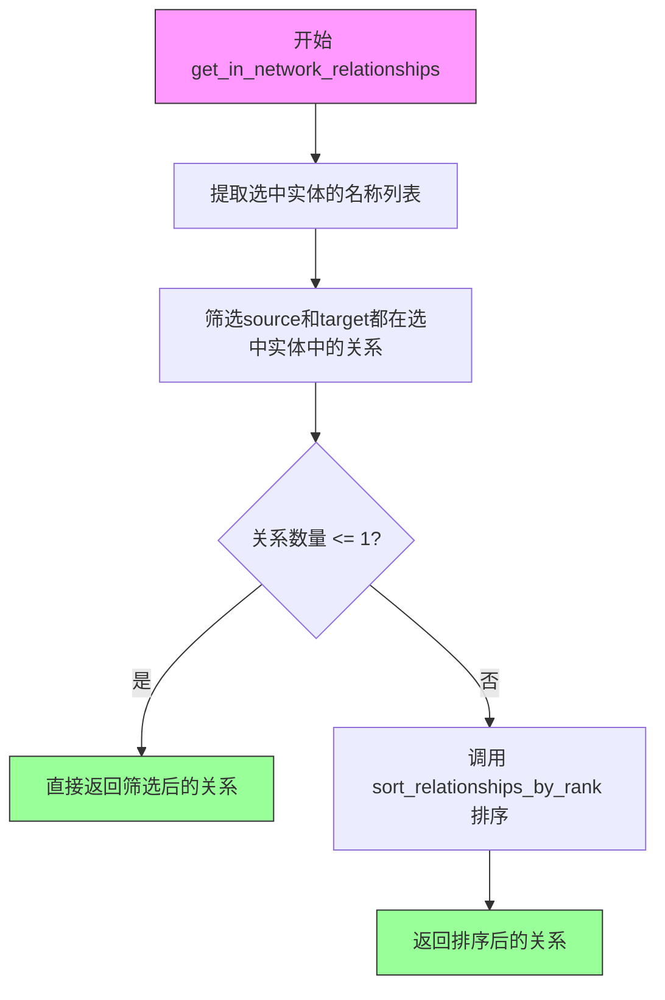
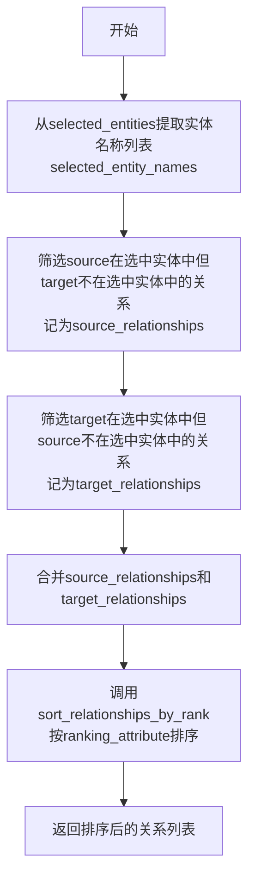
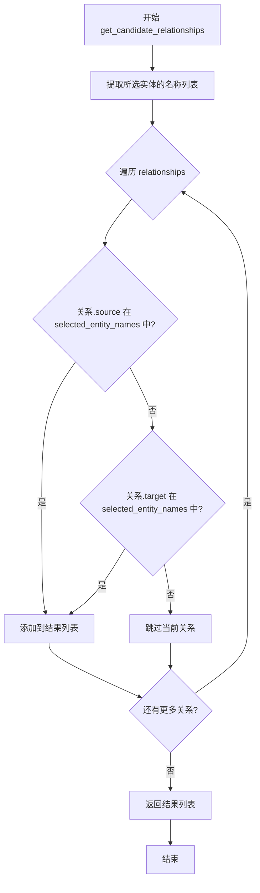
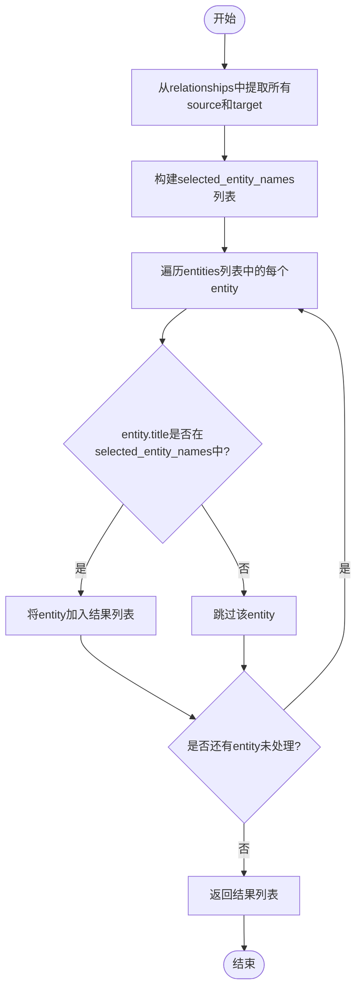
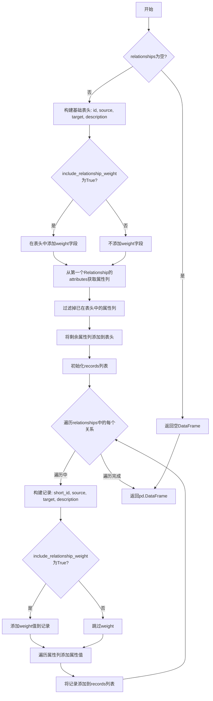

# `graphrag\packages\graphrag\graphrag\query\input\retrieval\relationships.py` 详细设计文档

该文件提供了一组工具函数，用于从实体集合和关系集合中检索、过滤和排序关系，支持获取网络内部关系、网络外部关系和候选关系，并将关系数据转换为pandas DataFrame格式。

## 整体流程

```mermaid
graph TD
    A[开始] --> B[输入: selected_entities, relationships]
    B --> C{调用函数类型}
    C --> D[get_in_network_relationships]
    C --> E[get_out_network_relationships]
    C --> F[get_candidate_relationships]
    C --> G[get_entities_from_relationships]
    C --> H[sort_relationships_by_rank]
    C --> I[to_relationship_dataframe]
    D --> D1[提取实体名称列表]
    D1 --> D2[过滤: source和target都在实体列表中]
    D2 --> D3{关系数量 <= 1}
    D3 -- 是 --> D4[直接返回]
    D3 -- 否 --> D5[调用sort_relationships_by_rank排序]
    D5 --> D6[返回排序后的关系列表]
    E --> E1[提取实体名称列表]
    E1 --> E2[过滤: source在实体列表中且target不在]
    E2 --> E3[过滤: target在实体列表中且source不在]
    E3 --> E4[合并source和target关系]
    E4 --> E5[调用sort_relationships_by_rank排序]
    E5 --> E6[返回排序后的关系列表]
    F --> F1[提取实体名称列表]
    F1 --> F2[过滤: source或target在实体列表中]
    F2 --> F3[返回候选关系列表]
    G --> G1[提取关系的source和target作为实体名]
    G1 --> G2[过滤: entity.title在关系实体名列表中]
    G2 --> G3[返回关联的实体列表]
    H --> H1{关系列表为空}
    H1 -- 是 --> H2[直接返回空列表]
    H1 -- 否 --> H3{ ranking_attribute在attributes中}
    H3 -- 是 --> H4[按attributes[ranking_attribute]排序]
    H3 -- 否 --> H5{ ranking_attribute == 'rank'}
    H5 -- 是 --> H6[按rank属性排序]
    H5 -- 否 --> H7{ ranking_attribute == 'weight'}
    H7 -- 是 --> H8[按weight属性排序]
    H7 -- 否 --> H9[返回未排序的关系]
    H4 --> H10[返回排序后的关系列表]
    H6 --> H10
    H8 --> H10
    I --> I1{关系列表为空}
    I1 -- 是 --> I2[返回空DataFrame]
    I1 -- 否 --> I3[构建表头: id, source, target, description]
    I3 --> I4[可选添加weight列]
    I4 --> I5[添加attributes中的其他列]
    I5 --> I6[遍历关系构建记录]
    I6 --> I7[返回DataFrame]
```

## 类结构

```
无类定义 (模块级函数集合)
```

## 全局变量及字段


### `selected_entities`
    
选定的实体列表

类型：`list[Entity]`
    


### `relationships`
    
关系列表

类型：`list[Relationship]`
    


### `ranking_attribute`
    
用于排序的排名属性名称

类型：`str`
    


### `selected_entity_names`
    
选定实体的标题列表

类型：`list[str]`
    


### `selected_relationships`
    
筛选后的关系列表

类型：`list[Relationship]`
    


### `source_relationships`
    
源实体在选定列表中的关系

类型：`list[Relationship]`
    


### `target_relationships`
    
目标实体在选定列表中的关系

类型：`list[Relationship]`
    


### `attribute_names`
    
关系属性名称列表

类型：`list[str]`
    


### `include_relationship_weight`
    
是否在结果中包含关系权重

类型：`bool`
    


### `header`
    
DataFrame的列名列表

类型：`list[str]`
    


### `attribute_cols`
    
额外的属性列名列表

类型：`list[str]`
    


### `records`
    
用于构建DataFrame的记录列表

类型：`list[list]`
    


### `new_record`
    
单个关系的记录行

类型：`list`
    


### `field_value`
    
属性字段的值

类型：`str`
    


### `rel`
    
当前遍历的关系对象

类型：`Relationship`
    


### `entity`
    
当前遍历的实体对象

类型：`Entity`
    


### `relationship`
    
当前遍历的关系对象（列表推导中）

类型：`Relationship`
    


### `x`
    
排序函数中的关系对象

类型：`Relationship`
    


    

## 全局函数及方法


### `get_in_network_relationships`

获取所选实体之间的所有有向关系，并按指定排名属性排序后返回。

参数：

- `selected_entities`：`list[Entity]`，需要获取关联关系的实体列表
- `relationships`：`list[Relationship]`，所有可能的关系集合
- `ranking_attribute`：`str = "rank"`，用于排序的属性名称，默认为"rank"

返回值：`list[Relationship]`，筛选出的在网络内部的关系列表，如果关系数量小于等于1则直接返回，否则按指定排名属性降序排序

#### 流程图



#### 带注释源码

```python
def get_in_network_relationships(
    selected_entities: list[Entity],
    relationships: list[Relationship],
    ranking_attribute: str = "rank",
) -> list[Relationship]:
    """Get all directed relationships between selected entities, sorted by ranking_attribute."""
    
    # 从选中的实体对象列表中提取所有实体的title，生成名称列表
    # 用于后续判断关系的两端是否都在选中实体中
    selected_entity_names = [entity.title for entity in selected_entities]
    
    # 筛选关系：只保留source和target都在selected_entity_names中的关系
    # 即只保留"网络内部"的关系（完全由选中实体组成的有向边）
    selected_relationships = [
        relationship
        for relationship in relationships
        if relationship.source in selected_entity_names
        and relationship.target in selected_entity_names
    ]
    
    # 如果筛选后的关系数量<=1，无需排序，直接返回
    # 这种情况可能是：没有关系，或者只有一条关系
    if len(selected_relationships) <= 1:
        return selected_relationships

    # 关系数量大于1时，按ranking_attribute进行降序排序后返回
    # 排序操作委托给sort_relationships_by_rank函数处理
    return sort_relationships_by_rank(selected_relationships, ranking_attribute)
```


### `get_out_network_relationships`

获取选中实体与网络外部实体之间的关系，并按排名属性排序。该函数返回两种类型的关系：一是源实体在选中实体中但目标实体不在选中实体中的关系（出站关系），二是目标实体在选中实体中但源实体不在选中实体中的关系（入站关系）。

参数：

- `selected_entities`：`list[Entity]`，选中的实体列表，用于筛选关系
- `relationships`：`list[Relationship]`的全部关系列表，从中筛选符合条件的外部网络关系
- `ranking_attribute`：`str`，默认值为`"rank"`，用于排序的属性名称

返回值：`list[Relationship]`，从选中实体到外部实体或从外部实体到选中实体的关系列表，按指定排名属性降序排序

#### 流程图



#### 带注释源码

```python
def get_out_network_relationships(
    selected_entities: list[Entity],
    relationships: list[Relationship],
    ranking_attribute: str = "rank",
) -> list[Relationship]:
    """Get relationships from selected entities to other entities that are not within the selected entities, sorted by ranking_attribute."""
    
    # 从选中的实体列表中提取所有实体的标题（名称），用于后续的关系筛选
    selected_entity_names = [entity.title for entity in selected_entities]
    
    # 筛选出站关系：关系的源实体在选中实体中，但目标实体不在选中实体中
    # 这表示从选中实体指向外部实体的关系
    source_relationships = [
        relationship
        for relationship in relationships
        if relationship.source in selected_entity_names
        and relationship.target not in selected_entity_names
    ]
    
    # 筛选入站关系：关系的目标实体在选中实体中，但源实体不在选中实体中
    # 这表示从外部实体指向选中实体的关系
    target_relationships = [
        relationship
        for relationship in relationships
        if relationship.target in selected_entity_names
        and relationship.source not in selected_entity_names
    ]
    
    # 合并出站关系和入站关系，形成完整的外部网络关系集合
    selected_relationships = source_relationships + target_relationships
    
    # 调用排序函数，按照指定的排名属性对关系进行降序排序后返回
    return sort_relationships_by_rank(selected_relationships, ranking_attribute)
```


### `get_candidate_relationships`

获取与所选实体关联的所有关系，包括源或目标为所选实体中任意一个的关系。

参数：

- `selected_entities`：`list[Entity]`，需要查询关联关系的实体列表
- `relationships`：`list[Relationship]``，关系数据源列表

返回值：`list[Relationship]`，返回所有与所选实体存在关联的关系列表

#### 流程图



#### 带注释源码

```python
def get_candidate_relationships(
    selected_entities: list[Entity],
    relationships: list[Relationship],
) -> list[Relationship]:
    """Get all relationships that are associated with the selected entities."""
    # 从所选实体列表中提取所有实体的名称（title）
    # 这一步是为了将实体对象列表转换为名称字符串列表，
    # 以便后续进行快速的成员关系检查
    selected_entity_names = [entity.title for entity in selected_entities]
    
    # 使用列表推导式过滤出所有与所选实体关联的关系
    # 判断条件：关系的源实体或目标实体在所选实体名称列表中
    # 注意：这里是"或"逻辑，只要源或目标之一在列表中就保留
    return [
        relationship
        for relationship in relationships
        if relationship.source in selected_entity_names
        or relationship.target in selected_entity_names
    ]
```


### `get_entities_from_relationships`

根据给定的关系列表，从实体列表中筛选出与这些关系相关联的所有实体。

参数：

- `relationships`：`list[Relationship]`，输入的关系列表，包含需要查找实体的关系
- `entities`：`list[Entity]`，输入的实体列表，从中筛选与关系相关联的实体

返回值：`list[Entity]`，返回与给定关系相关联的所有实体列表

#### 流程图



#### 带注释源码

```python
def get_entities_from_relationships(
    relationships: list[Relationship], entities: list[Entity]
) -> list[Entity]:
    """Get all entities that are associated with the selected relationships."""
    # 从所有关系中提取source和target，合并为实体名称列表
    # 使用列表推导式分别提取source和target，然后拼接
    selected_entity_names = [relationship.source for relationship in relationships] + [
        relationship.target for relationship in relationships
    ]
    # 从entities中筛选title在selected_entity_names中的实体
    # 使用列表推导式过滤出所有与关系相关联的实体
    return [entity for entity in entities if entity.title in selected_entity_names]
```


### `sort_relationships_by_rank`

对关系列表按指定的排名属性进行降序排序，支持通过关系属性、rank字段或weight字段进行排序。

参数：

- `relationships`：`list[Relationship]`，需要排序的关系列表
- `ranking_attribute`：`str = "rank"`，排序所依据的属性名称，默认为"rank"

返回值：`list[Relationship]`，排序后的关系列表（降序排列）

#### 流程图

```mermaid
flowchart TD
    A[开始 sort_relationships_by_rank] --> B{relationships 列表为空?}
    B -->|是| C[直接返回原始 relationships 列表]
    B -->|否| D[获取第一个关系的 attributes 键列表]
    D --> E{ranking_attribute 在 attributes 中?}
    E -->|是| F[使用 attributes[ranking_attribute] 作为排序键]
    E -->|否| G{ranking_attribute == 'rank'?}
    G -->|是| H[使用 x.rank 作为排序键]
    G -->|否| I{ranking_attribute == 'weight'?}
    I -->|是| J[使用 x.weight 作为排序键]
    I -->|否| K[保持原顺序返回]
    F --> L[relationships.sort 反向排序]
    H --> L
    J --> L
    C --> M[返回排序后的列表]
    K --> M
    L --> M
```

#### 带注释源码

```python
def sort_relationships_by_rank(
    relationships: list[Relationship],
    ranking_attribute: str = "rank",
) -> list[Relationship]:
    """Sort relationships by a ranking_attribute."""
    # 边界情况：如果关系列表为空，直接返回空列表
    if len(relationships) == 0:
        return relationships

    # 获取第一个关系的属性键列表，用于判断 ranking_attribute 是否存在于属性中
    attribute_names = (
        list(relationships[0].attributes.keys()) if relationships[0].attributes else []
    )
    
    # 判断排序方式：根据 attributes、rank 或 weight 字段进行排序
    if ranking_attribute in attribute_names:
        # 方式一：如果 ranking_attribute 在关系属性中，从 attributes 字典获取值排序
        relationships.sort(
            key=lambda x: int(x.attributes[ranking_attribute]) if x.attributes else 0,
            reverse=True,  # 降序排列（高排名在前）
        )
    elif ranking_attribute == "rank":
        # 方式二：如果指定按 rank 字段排序
        relationships.sort(key=lambda x: x.rank if x.rank else 0.0, reverse=True)
    elif ranking_attribute == "weight":
        # 方式三：如果指定按 weight 字段排序
        relationships.sort(key=lambda x: x.weight if x.weight else 0.0, reverse=True)
    
    # 返回排序后的关系列表（原地排序）
    return relationships
```


### `to_relationship_dataframe`

将关系列表转换为pandas DataFrame的函数，用于数据分析和可视化。

参数：

- `relationships`：`list[Relationship]`，需要转换的关系对象列表
- `include_relationship_weight`：`bool`，是否在输出中包含关系权重，默认为True

返回值：`pd.DataFrame`，包含关系数据的pandas DataFrame对象

#### 流程图



#### 带注释源码

```python
def to_relationship_dataframe(
    relationships: list[Relationship], include_relationship_weight: bool = True
) -> pd.DataFrame:
    """Convert a list of relationships to a pandas dataframe."""
    # 如果关系列表为空，直接返回空的DataFrame，避免后续处理空列表
    if len(relationships) == 0:
        return pd.DataFrame()

    # 定义基础表头，包含关系的基本字段
    header = ["id", "source", "target", "description"]
    
    # 根据参数决定是否在表头中添加weight（权重）字段
    if include_relationship_weight:
        header.append("weight")
    
    # 从第一个关系对象中提取其attributes字典的键（即额外属性列）
    # 使用relationships[0]是因为假设列表中所有关系的结构相同
    attribute_cols = (
        list(relationships[0].attributes.keys()) if relationships[0].attributes else []
    )
    
    # 过滤掉已经在基础表头中的属性列，避免重复
    attribute_cols = [col for col in attribute_cols if col not in header]
    
    # 将剩余的自定义属性列添加到表头中
    header.extend(attribute_cols)

    # 初始化记录列表，用于存储所有关系的数据
    records = []
    
    # 遍历每个关系对象，提取其数据构建记录
    for rel in relationships:
        # 构建基础记录：包含short_id、source、target、description
        # 如果short_id为空，则使用空字符串填充
        new_record = [
            rel.short_id if rel.short_id else "",
            rel.source,
            rel.target,
            rel.description if rel.description else "",
        ]
        
        # 如果包含权重，则将权重转换为字符串并添加到记录中
        # 如果weight为空，则使用空字符串
        if include_relationship_weight:
            new_record.append(str(rel.weight if rel.weight else ""))
        
        # 遍历自定义属性列，提取每个属性的值
        for field in attribute_cols:
            field_value = (
                str(rel.attributes.get(field))
                if rel.attributes and rel.attributes.get(field)
                else ""
            )
            new_record.append(field_value)
        
        # 将构建好的记录添加到records列表中
        records.append(new_record)
    
    # 使用pd.DataFrame构造返回的数据框，columns类型转换为Any以避免类型检查问题
    return pd.DataFrame(records, columns=cast("Any", header))
```

## 关键组件


### 关系检索工具模块

用于从实体集合中检索、筛选和排序关系数据的工具函数集合，支持网络内关系、网络外关系、候选关系的获取，并提供关系数据转换为DataFrame的功能。

### get_in_network_relationships

获取选定实体集合内部的所有有向关系（源和目标都在选定实体列表中），并按指定排名属性排序返回。

### get_out_network_relationships

获取选定实体与外部实体之间的所有关系（包括从选定实体指向外部实体的关系，以及外部实体指向选定实体的关系），按指定排名属性排序返回。

### get_candidate_relationships

获取与选定实体相关的所有关系（无论方向，只要源或目标在选定实体列表中即返回）。

### get_entities_from_relationships

根据给定的关系列表，从完整实体集合中提取与这些关系相关联的所有实体。

### sort_relationships_by_rank

按照指定的排名属性（如rank、weight或自定义属性）对关系列表进行降序排序。

### to_relationship_dataframe

将关系列表转换为pandas DataFrame格式，支持包含权重属性和自定义属性列。


## 问题及建议


### 已知问题

-   **重复代码**：多个函数中重复实现从`Entity`列表提取`entity.title`的逻辑（如第19行、第35-36行、第49行、第60-61行），违反DRY原则，增加维护成本
-   **效率问题**：使用列表存储实体名称进行`in`操作，时间复杂度为O(n)，当数据量大时性能较差，应使用集合（set）替代
-   **边界条件处理不足**：`to_relationship_dataframe`函数直接访问`relationships[0]`（第101行），未在访问前检查列表是否为空
-   **类型安全隐患**：第88行的`int(x.attributes[ranking_attribute])`在属性不存在或类型转换失败时可能抛出异常，缺乏异常处理
-   **属性访问未做空值保护**：第94-95行`x.rank if x.rank else 0.0`和第96-97行`x.weight if x.weight else 0.0`仅检查了None情况，但`rank`和`weight`可能为其他falsy值（如0）
-   **魔法字符串**：第19行、第35行的`"rank"`字符串在多处重复出现，应提取为常量
-   **函数职责不单一**：`sort_relationships_by_rank`函数包含多种排序逻辑（属性字典排序、rank排序、weight排序），违背单一职责原则

### 优化建议

-   抽取`selected_entity_names = [entity.title for entity in selected_entities]`为独立函数或使用集合推导式
-   将实体名称列表转换为集合：`selected_entity_names = {entity.title for entity in selected_entities}`，将`in`操作时间复杂度降至O(1)
-   在`to_relationship_dataframe`函数开头添加空列表检查
-   在属性排序逻辑处添加try-except或使用`.get()`方法并提供默认值
-   考虑将"rank"、"weight"等常量提取为模块级常量
-   考虑将排序逻辑拆分为独立的排序策略函数，提高可测试性和可维护性
-   对`sort_relationships_by_rank`函数添加类型注解的泛型支持，使其更健壮

## 其它


### 设计目标与约束

本模块的设计目标是从实体集合和关系集合中高效检索、过滤和排序关系数据，支持图谱查询、网络分析等场景。核心约束包括：输入的实体和关系列表必须为有效Python对象，ranking_attribute参数必须为字符串类型，关系对象必须包含必要的属性字段。

### 错误处理与异常设计

代码采用防御式编程风格，对于空列表和空属性字典进行了显式处理。主要错误处理方式包括：空列表直接返回空列表或空DataFrame；属性不存在时使用默认值（如0.0或空字符串）；使用类型转换（cast）确保类型安全。未捕获的异常场景包括：Entity对象缺少title属性时抛出AttributeError；Relationship对象缺少必要属性时可能导致KeyError。

### 数据流与状态机

数据流主要分为三类：输入流（selected_entities、relationships作为函数参数）、处理流（列表推导式过滤、排序操作）和输出流（返回过滤后的关系列表或DataFrame）。无状态机设计，所有函数均为纯函数式的数据转换操作，不涉及状态保持。

### 外部依赖与接口契约

本模块依赖以下外部包：pandas（用于DataFrame转换）、typing（类型注解）、graphrag.data_model.entity和graphrag.data_model.relationship（数据模型）。接口契约要求：Entity对象必须包含title属性；Relationship对象必须包含source、target属性，可选包含rank、weight、short_id、description、attributes等属性。

### 性能考量与优化空间

当前实现使用列表推导式进行过滤，时间复杂度为O(n*m)，其中n为关系数量，m为选定实体数量。优化空间包括：使用集合（set）替代列表存储selected_entity_names可将查找时间从O(m)降至O(1)；对于大规模数据集，可考虑使用NumPy向量化操作或pandas的isin方法提升性能；sort_relationships_by_rank函数每次调用都重新获取attribute_names，可缓存以减少重复计算。

### 使用示例与调用场景

典型调用场景包括：查询实体间的直接关系（get_in_network_relationships）、查询实体的外部连接（get_out_network_relationships）、图可视化数据准备（to_relationship_dataframe）、关系排序与筛选（sort_relationships_by_rank）。

    