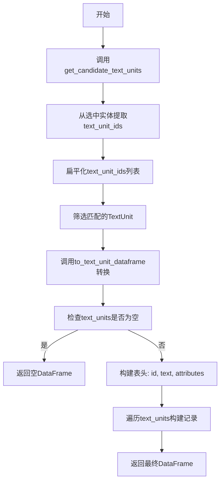
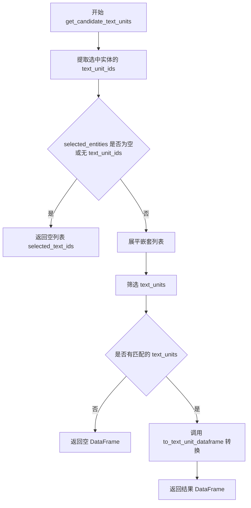
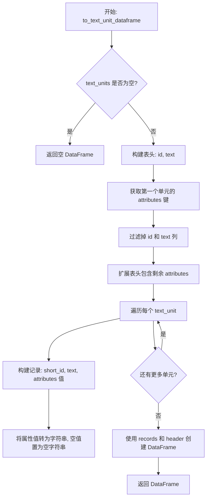

# `graphrag\packages\graphrag\graphrag\query\input\retrieval\text_units.py` 详细设计文档

该文件提供从实体集合中检索关联文本单元的工具函数，支持将文本单元列表转换为pandas DataFrame格式，便于后续数据处理和分析。

## 整体流程



## 类结构

```
Entity (数据模型类)
└── text_unit_ids: list[str]
TextUnit (数据模型类)
├── id: str
├── short_id: str
├── text: str
└── attributes: dict
```

## 全局变量及字段


### `selected_text_ids`
    
从选中实体提取的文本单元ID列表（扁平化后）

类型：`list[str]`
    


### `selected_text_units`
    
匹配筛选后的文本单元列表

类型：`list[TextUnit]`
    


### `header`
    
DataFrame表头列表

类型：`list[str]`
    


### `attribute_cols`
    
属性列名列表

类型：`list[str]`
    


### `records`
    
DataFrame记录列表

类型：`list[list[Any]]`
    


### `new_record`
    
单条记录临时变量

类型：`list[Any]`
    


### `unit`
    
循环迭代变量

类型：`TextUnit`
    


### `field`
    
属性字段循环变量

类型：`str`
    


### `Entity.text_unit_ids`
    
关联的文本单元ID列表

类型：`list[str]`
    


### `TextUnit.id`
    
文本单元唯一标识

类型：`str`
    


### `TextUnit.short_id`
    
短标识符

类型：`str`
    


### `TextUnit.text`
    
文本内容

类型：`str`
    


### `TextUnit.attributes`
    
额外属性字典

类型：`dict`
    
    

## 全局函数及方法


### `get_candidate_text_units`

获取与选中实体关联的所有文本单元，并将结果转换为 pandas DataFrame 格式返回。

参数：

- `selected_entities`：`list[Entity]`，包含已选中实体的列表，每个实体都包含 `text_unit_ids` 属性用于关联文本单元
- `text_units`：`list[TextUnit]`，所有可用的文本单元列表

返回值：`pd.DataFrame`，包含与选中实体关联的文本单元数据，列包括 id、text 以及可选的属性列

#### 流程图



#### 带注释源码

```python
def get_candidate_text_units(
    selected_entities: list[Entity],
    text_units: list[TextUnit],
) -> pd.DataFrame:
    """Get all text units that are associated to selected entities."""
    
    # 步骤1: 从选中实体中提取所有 text_unit_ids
    # 遍历每个实体，获取其关联的文本单元 ID 列表
    # 只保留有 text_unit_ids 属性的实体（过滤掉 None）
    selected_text_ids = [
        entity.text_unit_ids for entity in selected_entities if entity.text_unit_ids
    ]
    
    # 步骤2: 展平嵌套列表
    # selected_text_ids 是 [[id1, id2], [id3]] 格式，需要转换为 [id1, id2, id3]
    selected_text_ids = [item for sublist in selected_text_ids for item in sublist]
    
    # 步骤3: 筛选匹配的文本单元
    # 从所有 text_units 中保留 id 在 selected_text_ids 列表中的单元
    selected_text_units = [unit for unit in text_units if unit.id in selected_text_ids]
    
    # 步骤4: 转换为 DataFrame 并返回
    return to_text_unit_dataframe(selected_text_units)


def to_text_unit_dataframe(text_units: list[TextUnit]) -> pd.DataFrame:
    """Convert a list of text units to a pandas dataframe."""
    
    # 边界情况处理：空列表返回空 DataFrame
    if len(text_units) == 0:
        return pd.DataFrame()

    # 确定 DataFrame 的列名
    # 基础列：id 和 text
    header = ["id", "text"]
    
    # 从第一个文本单元的属性中提取额外列名
    # 排除已包含在基础列中的属性
    attribute_cols = (
        list(text_units[0].attributes.keys()) if text_units[0].attributes else []
    )
    attribute_cols = [col for col in attribute_cols if col not in header]
    
    # 合并基础列和属性列
    header.extend(attribute_cols)

    # 构建记录列表
    records = []
    for unit in text_units:
        # 构建每条记录：short_id, text, 以及各属性字段的值
        new_record = [
            unit.short_id,
            unit.text,
            *[
                # 将属性值转换为字符串，空值转换为空字符串
                str(unit.attributes.get(field, ""))
                if unit.attributes and unit.attributes.get(field)
                else ""
                for field in attribute_cols
            ],
        ]
        records.append(new_record)
    
    # 创建并返回 DataFrame
    return pd.DataFrame(records, columns=cast("Any", header))
```

---

## 补充信息

### 关键组件

| 组件名称 | 描述 |
|---------|------|
| `Entity` | 数据模型实体，包含 `text_unit_ids` 属性用于关联文本单元 |
| `TextUnit` | 文本单元数据模型，包含 `id`、`short_id`、`text`、`attributes` 属性 |
| `to_text_unit_dataframe` | 辅助函数，将 TextUnit 列表转换为 pandas DataFrame |

### 潜在技术债务与优化空间

1. **性能优化**：当前使用 `unit.id in selected_text_ids` 进行线性查找，时间复杂度为 O(n*m)。当文本单元数量较大时，可考虑将 `selected_text_ids` 转换为 `set` 以将查找复杂度降至 O(1)。

2. **重复 ID 处理**：当前实现未处理重复的 text_unit_ids，可能导致返回重复的文本单元。可在展平后使用 `set()` 去重。

3. **空值处理**：`to_text_unit_dataframe` 中对属性的处理逻辑较为复杂，可考虑使用 pandas 的 `fillna()` 或更清晰的空值处理策略。

### 设计约束与错误处理

- **空输入处理**：函数能正确处理空列表输入，返回空 DataFrame 而不抛出异常
- **类型假设**：代码假设 `text_units` 列表非空时才访问 `text_units[0].attributes`，若传入空列表会在前面返回空 DataFrame
- **类型安全**：使用 `cast("Any", header)` 绕过类型检查，这是类型系统的一种妥协

### 外部依赖

- `pandas`：用于返回 DataFrame 格式结果
- `graphrag.data_model.entity`：Entity 数据模型
- `graphrag.data_model.text_unit`：TextUnit 数据模型


### `to_text_unit_dataframe`

该函数用于将文本单元（TextUnit）对象列表转换为包含 id、text 和 attributes 字段的 pandas DataFrame，以便后续数据处理或可视化。

参数：

- `text_units`：`list[TextUnit]`，输入的文本单元列表，每个元素为一个 TextUnit 对象

返回值：`pd.DataFrame`，转换后的 pandas DataFrame，包含 id、text 以及可选的 attribute 列

#### 流程图



#### 带注释源码

```python
def to_text_unit_dataframe(text_units: list[TextUnit]) -> pd.DataFrame:
    """将文本单元列表转换为 pandas DataFrame。
    
    参数:
        text_units: TextUnit 对象列表
        
    返回:
        包含 id、text 和 attributes 列的 DataFrame
    """
    # 如果输入为空，直接返回空 DataFrame
    if len(text_units) == 0:
        return pd.DataFrame()

    # ========== 步骤1: 构建表头 ==========
    # 基础列: id 和 text
    header = ["id", "text"]
    
    # 从第一个 text_unit 获取 attributes 的键名
    # 如果 attributes 为 None 或空字典，则返回空列表
    attribute_cols = (
        list(text_units[0].attributes.keys()) if text_units[0].attributes else []
    )
    
    # 过滤掉已经在基础列中的属性（避免重复）
    attribute_cols = [col for col in attribute_cols if col not in header]
    
    # 合并基础列和属性列形成完整表头
    header.extend(attribute_cols)

    # ========== 步骤2: 构建数据记录 ==========
    records = []
    for unit in text_units:
        # 构建单条记录: 先添加 short_id 和 text
        new_record = [
            unit.short_id,
            unit.text,
            # 对于每个属性列，获取对应的值并转为字符串
            # 如果属性不存在或值为空，则置为空字符串
            *[
                str(unit.attributes.get(field, ""))
                if unit.attributes and unit.attributes.get(field)
                else ""
                for field in attribute_cols
            ],
        ]
        records.append(new_record)
    
    # ========== 步骤3: 返回 DataFrame ==========
    # 使用 cast 绕过 pandas 类型检查限制
    return pd.DataFrame(records, columns=cast("Any", header))
```

## 关键组件


### 核心功能概述

该代码模块提供文本单元检索工具函数，能够从选定的实体集合中提取关联的文本单元，并将文本单元列表转换为结构化的pandas DataFrame，用于后续数据分析和处理。

### 文件运行流程

该模块执行流程如下：首先接收选定的实体列表和完整的文本单元列表作为输入；然后通过`get_candidate_text_units`函数提取每个实体关联的文本单元ID；接着对ID列表进行扁平化处理以支持多对多关系；之后在文本单元列表中进行过滤匹配；最终通过`to_text_unit_dataframe`函数将结果转换为包含id、text和attributes列的DataFrame返回。

### 关键组件

#### 1. get_candidate_text_units 函数

从选定实体集合中检索关联的文本单元

#### 2. to_text_unit_dataframe 函数

将TextUnit对象列表转换为pandas DataFrame格式

#### 3. Entity 数据模型

表示图谱中的实体对象，包含text_unit_ids字段用于建立实体与文本单元的关联关系

#### 4. TextUnit 数据模型

表示文本单元，包含id、short_id、text和attributes等字段

### 潜在技术债务与优化空间

1. **性能优化**：当前使用列表推导式和遍历方式进行ID匹配，时间复杂度为O(n*m)，当数据量较大时可考虑使用集合(set)进行O(1)查找优化

2. **属性处理逻辑**：属性字段的获取仅基于第一个文本单元，若不同文本单元具有不同属性结构可能导致数据缺失

3. **空值处理**：属性为空字符串的显式处理可进一步优化，使用None可能更符合数据分析惯例

4. **类型注解**：header参数使用了cast("Any", header)绕过类型检查，可考虑重构为更清晰的类型定义

### 其他项目

#### 设计目标与约束

- 目标：提供高效的文本单元检索接口，将复杂对象转换为便于分析的DataFrame格式
- 约束：依赖pandas库和graphrag数据模型，假定输入的Entity和TextUnit对象结构符合预期

#### 错误处理与异常设计

- 当text_units为空时返回空DataFrame
- 未对selected_entities或text_units为None的情况进行显式处理
- 属性字段不存在时返回空字符串而非抛出异常

#### 数据流与状态机

数据流为：Entity列表 → 提取text_unit_ids → 扁平化ID列表 → 过滤TextUnit列表 → 转换为DataFrame。状态流转简单，属于单向数据转换流程。

#### 外部依赖与接口契约

- 依赖pandas库进行数据格式化
- 依赖graphrag.data_model.entity.Entity类
- 依赖graphrag.data_model.text_unit.TextUnit类
- 输入：Entity列表和TextUnit列表
- 输出：pd.DataFrame对象


## 问题及建议


### 已知问题

-   **性能效率低下**：`get_candidate_text_units` 中使用列表推导式和嵌套循环将 `text_unit_ids` 扁平化，时间复杂度和空间复杂度较高。当实体数量较多时，`unit.id in selected_text_ids` 的列表查找操作是 O(n) 的，可以考虑使用 set 替代列表以提高查找效率至 O(1)。
-   **属性收集不完整**：`to_text_unit_dataframe` 中 `attribute_cols` 仅基于第一个 `text_unit` 的属性键构建，如果后续 `text_unit` 包含不同的属性字段，这些属性将不会被包含在最终的 DataFrame 中，导致数据丢失。
-   **类型转换不规范**：使用 `cast("Any", header)` 将列名进行类型转换，这种写法不优雅且降低了代码的可读性，应使用正确的类型注解。
-   **缺少输入验证**：函数没有对输入参数进行有效性校验，例如 `selected_entities` 为空列表、`text_units` 为空列表、或其中的对象属性缺失等情况都可能导致运行时错误。
-   **属性访问冗余**：在构建记录时，重复调用 `unit.attributes.get(field, "")` 且对结果进行条件判断，每次循环都执行了多次字典查找操作。
-   **硬编码列名**：表头 "id" 和 "text" 以硬编码字符串形式出现，缺乏常量定义，不利于后续维护和修改。

### 优化建议

-   将 `selected_text_ids` 的构建改为使用 `set`，将 `in` 查询从 O(n) 优化至 O(1)，显著提升大规模数据场景下的性能。
-   遍历所有 `text_unit` 收集完整的属性键集合，而不是仅依赖第一个单元的属性，确保所有属性都被正确保留。
-   移除不必要的 `cast` 调用，直接使用 `list[str]` 作为 `columns` 参数的类型注解。
-   在函数入口处添加输入参数的有效性检查，提前处理边界情况并给出明确的错误信息。
-   预先获取属性值并进行缓存，避免在列表推导式中重复调用字典的 `get` 方法。
-   定义常量或枚举来管理列名，提高代码的可维护性和可读性。

## 其它


### 设计目标与约束

本模块的核心设计目标是提供一种高效从实体集合中检索关联文本单元的能力，并将结果转换为结构化的pandas DataFrame格式，便于后续分析和处理。设计约束包括：输入的实体列表和文本单元列表必须来自同一数据源；返回的DataFrame列仅包含id、text及attributes中的自定义属性；空输入时返回空DataFrame而非None；不支持嵌套属性的展开处理。

### 错误处理与异常设计

代码中主要处理的边界情况包括：空列表输入（selected_entities或text_units为空时返回空DataFrame）、实体未关联文本单元（text_unit_ids为None或空列表时跳过）、属性字段缺失（使用空字符串填充）。未显式抛出的异常类型：若Entity或TextUnit对象结构不匹配可能导致AttributeError；DataFrame构造时的类型转换异常会被捕获后返回空DataFrame。建议在调用方进行输入验证，确保传入的对象符合预期结构。

### 外部依赖与接口契约

主要外部依赖包括：pandas库用于DataFrame构造；graphrag.data_model.entity.Entity类需包含text_unit_ids属性（类型为list[str]或None）；graphrag.data_model.text_unit.TextUnit类需包含id、short_id、text、attributes属性。接口契约：get_candidate_text_units接受selected_entities(list[Entity])和text_units(list[TextUnit])两个参数，返回pd.DataFrame；to_text_unit_dataframe接受text_units(list[TextUnit])参数，返回pd.DataFrame。

### 性能考虑与优化空间

当前实现存在以下性能瓶颈：列表推导式嵌套循环处理selected_text_ids时间复杂度为O(n*m)；每次调用attributes.get都进行字典查找；属性字段仅从第一个文本单元获取，若第一个单元无属性可能导致列不完整。优化建议：使用集合(set)替代列表进行id匹配，将时间复杂度降至O(n+m)；预先计算attribute_cols避免重复调用keys()；增加对空attributes情况的健壮性处理。

### 数据流与状态机

数据流路径：输入selected_entities → 提取所有text_unit_ids → 扁平化为一维列表 → 使用列表推导式过滤text_units → 调用to_text_unit_dataframe转换为DataFrame。to_text_unit_dataframe内部流程：空检查 → 提取属性列名 → 遍历text_units构建记录列表 → 构造DataFrame。无状态机设计，该模块为纯函数式转换逻辑。

### 安全性考虑

当前代码不涉及用户输入处理、网络请求或文件操作，安全性风险较低。但需要注意：属性值转换为字符串时未进行转义处理，若attributes包含特殊字符可能导致CSV导出或HTML展示时的XSS风险；建议在展示层进行额外的转义处理。

### 测试策略建议

应覆盖的测试场景：空输入（空entities列表、空text_units列表）、正常输入（多个实体关联多个文本单元）、无关联文本单元的实体、文本单元无attributes属性、attributes包含空值或None、重复的text_unit_ids处理。建议使用pytest框架编写单元测试，验证边界条件和正常流程的正确性。

### 配置与参数说明

本模块无配置文件依赖。核心参数说明：selected_entities为Entity对象列表，每个Entity需有text_unit_ids属性指向关联的TextUnit ID；text_units为TextUnit对象列表，需包含id、short_id、text及可选的attributes字典；返回的DataFrame列顺序为[id, text, ...attribute_cols]。

### 版本兼容性说明

当前代码使用Python 3.9+的类型注解语法（list[Entity]）；依赖pandas库的具体版本未声明，建议使用pandas 1.3.0+以支持新版API；typing.cast用于类型提示的向下转型操作，不影响运行时性能。


    