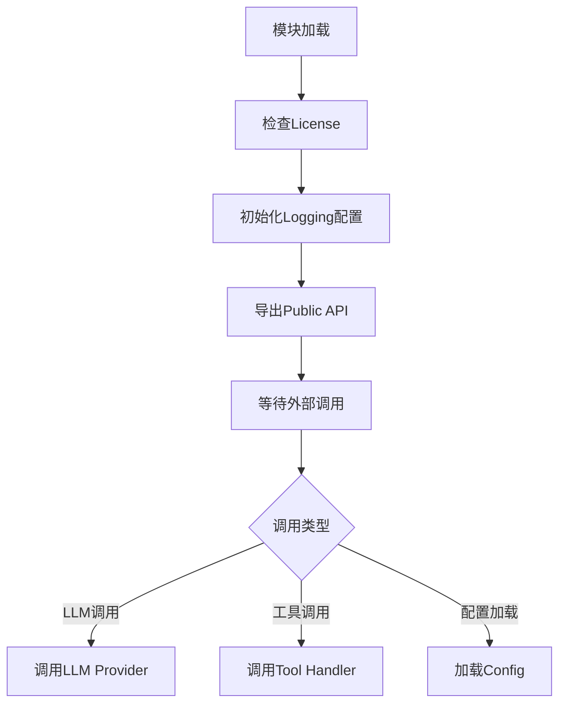

# `graphrag\packages\graphrag\graphrag\query\llm\__init__.py` 详细设计文档

这是一个用于编排大型语言模型(LLM)的工具模块，提供orchestration层所需的LLM相关Utility函数和类。该文件作为Microsoft LLMs相关项目的Orchestration模块的基础设施。

## 整体流程



## 类结构

```
当前文件仅包含文件头和模块文档字符串
无类定义
无函数定义
无全局变量
```

## 全局变量及字段


    

## 全局函数及方法


## 关键组件


### 模块概述

由于提供的源代码文件仅包含版权声明和模块文档字符串（"Orchestration LLM utilities"），并未包含实际的实现代码，因此无法提供完整的设计文档。以下是基于现有信息的分析和预期设计方向的说明。

### 文件信息

- **模块名称**: orchestration_llm_utils（预期）
- **版权**: Copyright (c) 2024 Microsoft Corporation
- **许可协议**: MIT License
- **模块描述**: Orchestration LLM utilities（编排LLM工具）

### 设计预期（基于模块名称）

根据模块名称"Orchestration LLM utilities"推断，该模块预计将包含与LLM（大型语言模型）编排相关的工具函数和类，可能涉及：

- LLM调用封装
- 提示词模板管理
- 响应解析与处理
- 多模型协调
- 错误处理与重试机制

### 当前状态

**现有代码**:
```python
# Copyright (c) 2024 Microsoft Corporation.
# Licensed under the MIT License

"""Orchestration LLM utilities."""
```

**状态**: 这是一个占位符文件，等待实现。

### 潜在技术债务与优化空间

1. **未实现的模块**: 该模块需要完整的实现以满足其预期功能
2. **缺少具体功能**: 无法从现有代码中提取关键组件（如张量索引、反量化、量化策略）
3. **接口契约缺失**: 需要定义清晰的API接口以供其他模块调用

### 后续建议

如需生成完整的详细设计文档，请提供包含实际业务逻辑的实现代码。


## 问题及建议


### 已知问题

- 代码文件几乎为空，仅包含版权声明和模块文档字符串，缺少任何实际的功能实现代码
- 没有定义任何类、结构或函数，无法提供详细的架构设计文档
- 模块声称是"Orchestration LLM utilities"，但没有任何实际的编排或LLM相关功能实现
- 缺少任何可测试的代码逻辑

### 优化建议

- 补充实现"Orchestration LLM utilities"模块的核心功能代码
- 添加具体的类和方法定义，如LLM调用封装、提示词管理、响应解析等功能
- 考虑添加配置管理、错误处理、日志记录等基础设施代码
- 提供完整的类型注解和文档字符串，以便后续维护和扩展
- 添加单元测试和集成测试代码，确保功能正确性


## 其它


### 设计目标与约束

本模块旨在为LLM编排提供统一的工具函数支持，简化与大语言模型的交互流程。核心设计目标包括：提供标准化的LLM调用接口、支持多种模型提供商的后端适配、实现请求重试与降级机制、确保输出一致性和可靠性。约束条件包括：需兼容OpenAI/Anthropic等主流LLM API规范、需支持同步和异步调用模式、需遵守Microsoft内部代码规范、需保持轻量级依赖。

### 错误处理与异常设计

本模块应定义统一的异常类体系，包括LLMConnectionError（连接错误）、LLMResponseError（响应解析错误）、LLMTimeoutError（超时错误）、LLMRateLimitError（速率限制错误）等。所有公开方法应捕获底层异常并转换为模块特定异常，同时保留原始错误信息以供调试。建议采用指数退避算法实现重试机制，设置最大重试次数和超时时间。

### 数据流与状态机

LLM调用数据流包括：请求构建阶段（参数序列化、模型选择）→ API调用阶段（网络传输）→ 响应处理阶段（结果解析、格式转换）→ 后处理阶段（结果验证）。状态机应定义以下状态：Idle（空闲）、Requesting（请求中）、Processing（处理中）、Completed（完成）、Failed（失败）、Retrying（重试中）。状态转换应触发相应的事件和回调。

### 外部依赖与接口契约

本模块依赖以下外部组件：HTTP客户端库（如httpx或requests）用于API通信、JSON解析库用于数据序列化、日志框架用于审计追踪、Pydantic或类似库用于数据验证。接口契约方面，LLM调用方法应接受统一格式的请求对象（包含model、messages、temperature、max_tokens等参数），返回统一格式的响应对象（包含content、usage、finish_reason等字段）。

### 性能要求与约束

响应时间目标：P99延迟应低于目标LLM API的响应时间加上500ms的处理开销。吞吐量要求：应支持至少50 QPS的并发请求。内存占用：单次请求处理的内存峰值不应超过100MB。需实现连接池复用以减少TCP握手开销。

### 安全性考虑

API密钥管理：敏感凭证应通过环境变量或密钥管理服务注入，禁止硬编码。输入验证：所有用户输入需进行严格验证，防止注入攻击。输出过滤：需对LLM输出进行安全审查，防止敏感信息泄露。日志脱敏：日志记录时需对敏感数据进行脱敏处理。

### 可扩展性设计

模块应采用插件化架构，支持新增模型提供商而无需修改核心逻辑。需定义统一的Provider接口，包含chat、embeddings等方法签名。配置系统应支持从文件或环境变量加载provider配置，支持运行时切换不同provider。

### 配置与参数设计

配置项应包括：默认模型选择、超时时间设置、重试策略配置、API端点URL、日志级别开关。建议使用Pydantic BaseSettings或类似方案实现配置管理，支持环境变量覆盖文件配置。参数命名应遵循Python命名规范，采用下划线分隔。

### 测试策略

单元测试应覆盖所有工具函数和异常类，Mock外部API调用。集成测试应针对真实LLM API进行端到端验证（可使用mock server）。性能测试应验证并发场景下的稳定性和延迟指标。需实现测试覆盖率目标：核心逻辑覆盖率不低于80%。

### 部署与运维考虑

模块以Python包形式发布，支持pip/conda安装。版本管理遵循Semantic Versioning规范。需提供详细的README文档和使用示例。发布流程应包含类型检查（mypy）、代码格式化（black/isort）和单元测试验证。

### 监控与日志设计

关键指标监控：请求成功率、平均响应时间、Token消耗量、错误类型分布。日志级别规范：DEBUG用于开发调试、INFO用于正常流程记录、WARNING用于可恢复错误、ERROR用于严重错误。日志格式应包含时间戳、请求ID、模型名称、响应状态等关键字段，便于问题排查。


    