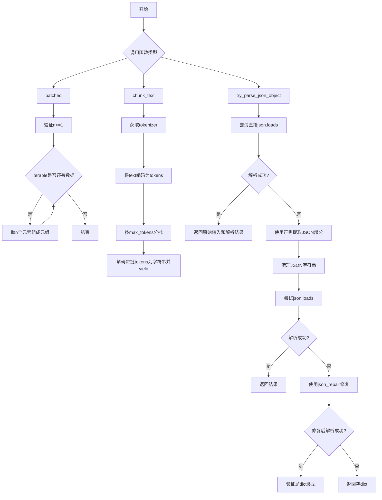
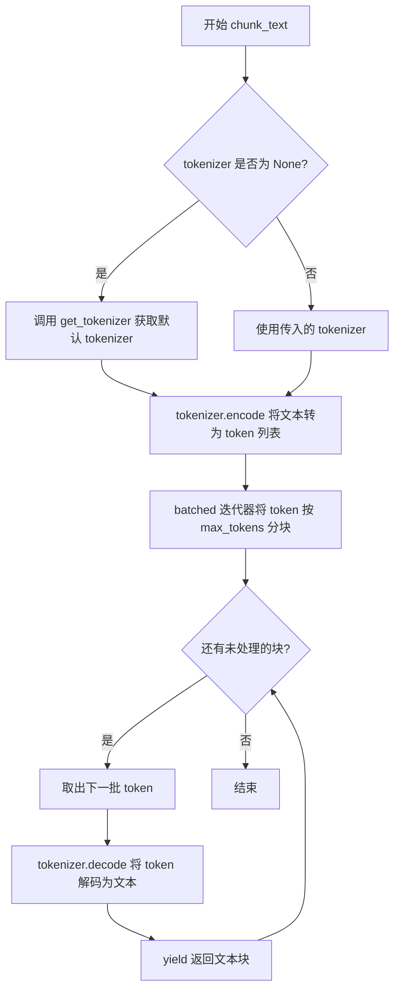

# `graphrag\packages\graphrag\graphrag\query\llm\text_utils.py` 详细设计文档

这是一个用于大语言模型(LLM)的文本处理工具库，提供文本分块批处理、JSON解析和修复等功能，主要解决LLM输出中常见的JSON格式问题和文本过长需要分块处理的场景。

## 整体流程



## 类结构

```
text_utils.py (工具模块)
├── batched (全局函数)
├── chunk_text (全局函数)
└── try_parse_json_object (全局函数)
```

## 全局变量及字段


### `logger`
    
模块级日志记录器，用于记录警告和异常信息

类型：`logging.Logger`
    


    

## 全局函数及方法


### `batched`

将迭代器中的数据批量分割成指定大小的元组，最后一批可能较短。该函数取自 Python 官方文档的 itertools 食谱。

参数：

- `iterable`：`Iterator`，输入的可迭代对象，可以是任何可迭代的数据类型
- `n`：`int`，每个批次的元素数量，必须至少为 1

返回值：`Iterator[tuple]`，返回一个迭代器，产生指定大小的元组，最后一批可能少于 n 个元素

#### 流程图

```mermaid
flowchart TD
    A[开始 batched 函数] --> B{n < 1?}
    B -- 是 --> C[抛出 ValueError: n must be at least one]
    B -- 否 --> D[it = iter(iterable)]
    D --> E{获取下一批 n 个元素}
    E --> F{batch 不为空?}
    F -- 是 --> G[yield batch 元组]
    G --> E
    F -- 否 --> H[结束函数]
    
    style A fill:#f9f,color:#333
    style C fill:#ff6b6b,color:#fff
    style G fill:#4ecdc4,color:#333
    style H fill:#95a5a6,color:#fff
```

#### 带注释源码

```python
def batched(iterable: Iterator, n: int):
    """
    Batch data into tuples of length n. The last batch may be shorter.

    Taken from Python's cookbook: https://docs.python.org/3/library/itertools.html#itertools.batched
    """
    # 示例: batched('ABCDEFG', 3) --> ABC DEF G
    
    # 参数校验：如果 n 小于 1，抛出 ValueError 异常
    if n < 1:
        value_error = "n must be at least one"
        raise ValueError(value_error)
    
    # 将输入的可迭代对象转换为迭代器
    it = iter(iterable)
    
    # 使用islice从迭代器中每次最多读取n个元素，
    # 只要读取到的批次不为空，就yield返回
    # tuple()将读取到的元素转换为元组
    while batch := tuple(islice(it, n)):
        yield batch
```


# 设计文档：chunk_text 函数

## 1. 核心功能概述

`chunk_text` 函数是一个文本分块工具，通过将输入文本按指定的 token 数量限制进行分割，支持自定义 tokenizer 或使用默认 tokenizer，适合处理大规模文本的批量处理场景。

## 2. 文件整体运行流程

```
导入依赖模块
    ↓
定义辅助函数 batched (迭代器分批工具)
    ↓
定义 chunk_text 函数 (主函数)
    ↓
    ├── 检查 tokenizer 是否提供
    │   └── 未提供则调用 get_tokenizer() 获取默认
    ├── 使用 tokenizer.encode() 将文本转为 token 列表
    ├── 使用 batched() 将 token 按 max_tokens 分块
    └── 使用 tokenizer.decode() 将每批 token 解码为文本并 yield 输出
```

## 3. 函数详细信息

### `chunk_text`

文本分块函数，将文本按 token 数量分块。

**参数：**

- `text`：`str`，待分块的原始文本
- `max_tokens`：`int`，每个文本块的最大 token 数量
- `tokenizer`：`Tokenizer | None`，可选的自定义 tokenizer，默认调用 `get_tokenizer()` 获取

**返回值：** `Iterator[str]`，生成器迭代器，逐个产出分块后的文本字符串

#### 流程图



#### 带注释源码

```python
def chunk_text(text: str, max_tokens: int, tokenizer: Tokenizer | None = None):
    """Chunk text by token length."""
    # 如果未提供 tokenizer，则使用默认的全局 tokenizer
    if tokenizer is None:
        tokenizer = get_tokenizer()
    
    # 将输入文本编码为 token 列表
    tokens = tokenizer.encode(text)  # type: ignore
    
    # 使用 batched 函数将 token 流按 max_tokens 分批
    chunk_iterator = batched(iter(tokens), max_tokens)
    
    # 对每批 token 解码为文本并 yield 返回
    yield from (tokenizer.decode(list(chunk)) for chunk in chunk_iterator)
```

## 4. 关键组件信息

| 组件名称 | 描述 |
|---------|------|
| `batched` | 辅助函数，将迭代器按固定大小 n 分批成元组 |
| `get_tokenizer` | 全局函数，获取默认的 tokenizer 实例 |
| `Tokenizer` | token 化接口类，提供 encode/decode 方法 |
| `tokenizer.encode()` | 将文本字符串编码为 token ID 列表 |
| `tokenizer.decode()` | 将 token ID 列表解码为文本字符串 |

## 5. 潜在技术债务与优化空间

1. **类型标注不完整**：`tokenizer.encode(text)` 返回值使用了 `# type: ignore`，应明确返回类型
2. **缺乏边界情况处理**：
   - 当 `max_tokens <= 0` 时未做校验
   - 当 `text` 为空字符串时返回结果未定义
3. **batch 大小固定**：当前实现中每个块严格按 `max_tokens` 分，可能导致最后一个块极小
4. **错误处理缺失**：未处理 tokenizer 本身可能抛出的异常

## 6. 其它项目

### 设计目标与约束
- **目标**：将长文本分割为适合 LLM 处理的较小文本块
- **约束**：依赖 tokenizer 的实现，不保证跨 tokenizer 的一致性

### 错误处理与异常设计
- 当前版本主要依赖 `batched` 函数中的 `ValueError`（当 n < 1 时）
- tokenizer 相关错误会直接向上传播

### 数据流与状态机
- 输入：原始文本字符串
- 处理：编码 → 分批 → 解码
- 输出：文本块生成器（惰性求值）

### 外部依赖与接口契约
- `graphrag_llm.tokenizer.Tokenizer`：tokenizer 抽象接口
- `graphrag.tokenizer.get_tokenizer`：全局 tokenizer 获取函数
- `json_repair`：JSON 修复库（本函数未直接使用）


### `try_parse_json_object`

尝试解析JSON字符串，包含多层修复策略。该函数会尝试多种方法解析LLM返回的可能包含额外描述或格式错误的JSON字符串，包括直接解析、正则提取、字符串清理、Markdown框架移除以及使用json_repair库修复。

参数：

- `input`：`str`，需要解析的JSON字符串，可能包含额外描述或格式错误
- `verbose`：`bool`，是否输出详细日志，默认为True

返回值：`tuple[str, dict]`，返回原始输入字符串和处理后的JSON对象字典；如果解析失败则返回原始输入和空字典

#### 流程图

```mermaid
flowchart TD
    A[开始 try_parse_json_object] --> B{verbose?}
    B -->|Yes| C[logger.warning准备就绪]
    B -->|No| D[跳过日志]
    C --> E[尝试 json.loads 解析]
    D --> E
    
    E --> F{解析成功?}
    F -->|Yes| G[返回 input, result]
    F -->|No| H[使用正则提取JSON对象]
    H --> I{匹配成功?}
    I -->|Yes| J[input = '{' + group(1) + '}' ]
    I -->|No| K[保持原input]
    J --> L
    K --> L
    
    L[清理JSON字符串] --> L1[替换 {{ -> {, }} -> }]
    L1 --> L2[替换 '"[' -> '[' , '}]' -> ']']
    L2 --> L3[替换反斜杠和换行符为空格]
    L3 --> L4[去除首尾空白]
    
    L4 --> M[移除Markdown框架]
    M --> M1{以 '```json' 开头?}
    M1 -->|Yes| M2[去掉 '```json']
    M1 -->|No| M3
    M2 --> M3
    M3 --> M4{以 '```' 结尾?}
    M4 -->|Yes| M5[去掉末尾 '```']
    M4 -->|No| N
    
    M5 --> N[再次尝试 json.loads 解析]
    
    N --> O{解析成功?}
    O -->|Yes| P[返回 input, result]
    O -->|No| Q[使用 json_repair 修复]
    
    Q --> R[调用 repair_json]
    R --> S{修复后解析成功?}
    S -->|Yes| T{结果是dict类型?}
    S -->|No| U[记录异常日志]
    U --> V[返回 input, {}]
    
    T -->|Yes| W[返回 input, result]
    T -->|No| X[记录异常日志]
    X --> V
    
    G --> Z[结束]
    P --> Z
    W --> Z
    V --> Z
```

#### 带注释源码

```python
def try_parse_json_object(input: str, verbose: bool = True) -> tuple[str, dict]:
    """JSON cleaning and formatting utilities."""
    # 有时LLM会返回带有额外描述的JSON字符串，此函数将清理并解析它

    result = None
    try:
        # 策略1: 尝试直接解析JSON
        result = json.loads(input)
    except json.JSONDecodeError:
        # 解析失败时记录警告（如果verbose为True）
        if verbose:
            logger.warning("Error decoding faulty json, attempting repair")

    # 如果直接解析成功，直接返回结果
    if result:
        return input, result

    # 策略2: 使用正则表达式提取JSON对象部分
    # 匹配 { ... } 之间的内容
    pattern = r"\{(.*)\}"
    match = re.search(pattern, input, re.DOTALL)
    # 如果匹配成功，重新构建JSON字符串
    input = "{" + match.group(1) + "}" if match else input

    # 策略3: 清理JSON字符串中的常见问题
    input = (
        input
        # 处理双大括号（模板变量）
        .replace("{{", "{")
        .replace("}}", "}")
        # 处理嵌套数组的引号问题
        .replace('"[{', "[{")
        .replace('}]"', "}]")
        # 替换反斜杠为空格
        .replace("\\", " ")
        # 替换各种换行符为空格
        .replace("\\n", " ")
        .replace("\n", " ")
        .replace("\r", "")
        .strip()
    )

    # 策略4: 移除JSON Markdown框架
    # 很多LLM会返回 ```json ... ``` 格式的内容
    if input.startswith("```json"):
        input = input[len("```json") :]
    if input.endswith("```"):
        input = input[: len(input) - len("```")]

    # 策略5: 再次尝试解析
    try:
        result = json.loads(input)
    except json.JSONDecodeError:
        # 策略6: 使用 json_repair 库修复损坏的JSON
        input = str(repair_json(json_str=input, return_objects=False))

        # 策略7: 最后一次尝试解析修复后的JSON
        try:
            result = json.loads(input)
        except json.JSONDecodeError:
            # 所有策略都失败，记录异常并返回空字典
            if verbose:
                logger.exception("error loading json, json=%s", input)
            return input, {}
        else:
            # 检查解析结果是否为字典类型
            if not isinstance(result, dict):
                if verbose:
                    logger.exception("not expected dict type. type=%s:", type(result))
                return input, {}
            return input, result
    else:
        # 解析成功，返回结果
        return input, result
```

---

#### 潜在的技术债务或优化空间

1. **错误处理不一致**：函数在多个地方返回不同的值（成功时返回元组，失败时返回 `input, {}`），调用者需要理解这种不一致的行为，可能导致调用方处理困难。

2. **魔法字符串和硬编码**：如 `"```json"`、双大括号替换等硬编码在函数中，如果LLM输出格式变化需要修改代码。

3. **正则表达式局限性**：`r"\{(.*)\}"` 正则只取第一个 `{` 到最后一个 `}` 之间的内容，如果字符串中有多个JSON对象可能产生错误结果。

4. **verbose参数的双重职责**：该参数同时控制警告和异常日志的输出，缺乏灵活性；可以考虑拆分为多个配置选项。

5. **缺乏类型验证**：最终返回的dict没有进行深度的类型验证或schema校验，可能导致后续处理出错。

6. **日志级别选择**：`logger.warning` 和 `logger.exception` 混用，异常应该用更合适的级别记录堆栈信息。

7. **json_repair的调用时机**：在已经有多种清理策略的情况下，可以考虑在更早阶段使用repair来简化代码逻辑。

---

#### 其它项目

**设计目标与约束**：
- 目标：尽可能从LLM返回的格式错误的JSON中恢复出有效的JSON对象
- 约束：必须保持原始输入字符串的返回，以便调用者进行进一步处理

**错误处理与异常设计**：
- 使用 try-except 捕获 `json.JSONDecodeError`
- 当所有解析策略都失败时，返回空字典而非抛出异常
- 通过 `verbose` 参数控制是否输出详细的错误日志

**数据流与状态机**：
- 输入：原始字符串（可能包含额外描述、Markdown格式、JSON语法错误）
- 输出：(原始字符串或处理后的字符串, 解析后的字典或空字典)
- 处理流程：直接解析 → 正则提取 → 字符串清理 → Markdown移除 → json_repair修复 → 最终验证

**外部依赖与接口契约**：
- 依赖 `json` 标准库进行JSON解析
- 依赖 `json_repair` 第三方库进行JSON修复
- 依赖 `logging` 标准库进行日志记录
- 依赖 `re` 标准库进行正则表达式匹配

## 关键组件


### batched 函数

批处理迭代器函数，将数据分批成指定长度的元组

### chunk_text 函数

文本分块函数，按token数量将长文本分割成小块，支持惰性加载和流式处理

### try_parse_json_object 函数

JSON解析和修复函数，支持从LLM输出中提取和修复JSON，包含多种容错机制和降级策略

### Tokenizer 依赖

文本编码和解码的核心组件，支持从全局配置获取默认分词器

### JSON修复机制

使用json_repair库修复损坏的JSON字符串，提供多层级容错处理

### 正则表达式匹配

用于从混合文本中提取JSON对象的模式匹配组件


## 问题及建议


### 已知问题

- **正则表达式潜在空指针**：在 `try_parse_json_object` 函数中，使用 `re.search(pattern, input, re.DOTALL)` 后未检查 `match` 是否为 `None`就直接访问 `match.group(1)`，虽然在后面有 `if match else input` 的保护，但逻辑可读性较差。
- **JSON 修复库的过度依赖**：当 JSON 解析失败时，直接调用 `repair_json` 进行修复，这是一个重量级操作，可能带来性能开销和不可预测的结果。
- **字符串替换操作效率低下**：`try_parse_json_object` 中的多个链式 `.replace()` 调用会创建多个中间字符串对象，可以考虑使用正则表达式或编译模式进行批量替换。
- **Token 分块逻辑的潜在问题**：`chunk_text` 中 `iter(tokens)` 的使用假设 `tokenizer.encode()` 返回的是可迭代对象，但如果返回的是 numpy 数组或其他类型，可能导致意外行为。
- **日志级别默认开启**：`verbose` 参数默认为 `True`，在生产环境中可能导致过多的日志输出，影响性能。
- **函数返回语义不明确**：`try_parse_json_object` 返回元组 `(input, result)`，其中 `input` 是修改后的原始字符串，但这个设计的目的和使用场景不够清晰。
- **类型注解不完整**：`chunk_text` 函数的生成器返回类型未明确指定，代码中使用了 `yield from` 但缺少显式的类型标注。

### 优化建议

- **优化正则表达式匹配逻辑**：在 `try_parse_json_object` 中，将正则匹配和空值检查合并为更清晰的逻辑，或使用 `match.expand()` 或 `match.group(0)` 配合空值检查。
- **改进字符串替换性能**：将多个 `.replace()` 调用合并为一次正则表达式替换，或使用 `str.translate()` 方法处理多个字符的替换。
- **添加 JSON 解析缓存**：对于相同或相似的输入，可以考虑添加简单的缓存机制避免重复调用 `repair_json`。
- **完善类型注解**：为生成器函数添加明确的返回类型注解，如 `Generator[str, None, None]` 或使用 Python 3.9+ 的 `list[str]` 语法。
- **重构错误处理流程**：将 `try_parse_json_object` 中的多层嵌套 try-except 逻辑提取为独立的私有方法，提高可读性和可维护性。
- **添加输入验证**：在 `batched` 函数中，可以添加对 `n` 类型的检查，而不仅仅是值的检查。
- **考虑惰性求值**：在 `chunk_text` 中，当前实现会在内存中保留所有 token，建议评估是否需要真正的流式处理。

## 其它


### 设计目标与约束

本模块旨在为 LLM 应用提供文本处理工具函数，核心目标包括：1）支持文本按 token 数量进行分块处理；2）提供 JSON 解析和修复能力，能够处理 LLM 返回的不规范 JSON 输出。设计约束：依赖 graphrag_llm.tokenizer 和 graphrag.tokenizer.get_tokenizer，需保持与这些模块的版本兼容；函数设计为无状态纯函数，便于测试和并发使用。

### 错误处理与异常设计

1. `batched` 函数：当 n < 1 时抛出 ValueError，错误信息为 "n must be at least one"。2. `chunk_text` 函数：依赖 tokenizer.encode/decode，tokenizer 异常会直接向上传播。3. `try_parse_json_object` 函数：采用多层级错误恢复机制——首先尝试标准 json.loads 解析；失败后使用正则提取 JSON 对象；再次失败后调用 json_repair 库修复；最终仍失败时返回空字典并记录日志。关键异常类型：json.JSONDecodeError（标准库）、json_repair 可能的异常、日志记录使用 logger.warning 和 logger.exception。

### 外部依赖与接口契约

| 依赖模块 | 版本要求 | 接口契约 |
|---------|---------|---------|
| graphrag_llm.tokenizer.Tokenizer | 需安装 | 提供 encode(text) -> list 和 decode(tokens) -> str 方法 |
| graphrag.tokenizer.get_tokenizer | 需安装 | 返回全局 Tokenizer 实例 |
| json_repair | 需安装 | repair_json(json_str, return_objects=False) -> str |

### 性能考虑

1. 使用生成器模式：`chunk_text` 和 `batched` 均使用 yield，实现惰性计算，避免一次性加载全部数据到内存。2. `islice` 迭代器切片：batched 函数使用 itertools.islice 提高批处理效率。3. tokenizer 缓存：chunk_text 支持传入 tokenizer 实例，避免重复获取。

### 兼容性设计

1. Python 版本：依赖 type hint 的 union 语法（tokenizer: Tokenizer | None），需 Python 3.10+。2. 函数签名稳定性：batched 遵循 Python itertools.batched 官方实现，chunk_text 参考常见分块库设计。3. 返回类型一致性：try_parse_json_object 始终返回 tuple[str, dict] 类型。

### 使用示例

```python
# 文本分块示例
text = "很长很长的文本..."
for chunk in chunk_text(text, max_tokens=512):
    process(chunk)

# JSON 修复示例
raw_output = '```json\n{"key": "value"}\n```'
cleaned_text, parsed = try_parse_json_object(raw_output)
```

### 测试策略建议

1. 单元测试覆盖：batched 函数的 n=1、n=len(iterable)、n>len(iterable) 等边界情况；chunk_text 的空文本、单 token、跨多块场景。2. JSON 修复测试：正常 JSON、带 markdown 包裹的 JSON、双大括号、缺失引号等异常情况。3. 集成测试：与实际 tokenizer 集成测试，验证 token 计数准确性。

### 配置与参数说明

| 参数名 | 所属函数 | 类型 | 默认值 | 说明 |
|-------|---------|------|-------|------|
| n | batched | int | 必填 | 每批元素数量，必须 >= 1 |
| iterable | batched | Iterator | 必填 | 输入可迭代对象 |
| text | chunk_text | str | 必填 | 待分块文本 |
| max_tokens | chunk_text | int | 必填 | 每块最大 token 数 |
| tokenizer | chunk_text | Tokenizer \| None | None | 指定分词器，为空时使用全局默认 |
| input | try_parse_json_object | str | 必填 | 待解析字符串 |
| verbose | try_parse_json_object | bool | True | 是否输出日志警告 |


    