# `graphrag\packages\graphrag\graphrag\query\question_gen\__init__.py` 详细设计文档

问题生成模块（Question Generation Module）是RAG系统和对话系统的核心组件，负责根据输入的上下文信息（如文档、对话历史或知识库内容）自动生成相关联的高质量问题。该模块通常集成NLP模型来实现语义理解和问题生成，可应用于搜索引擎优化、教育测试生成、对话式AI系统等场景。

## 整体流程

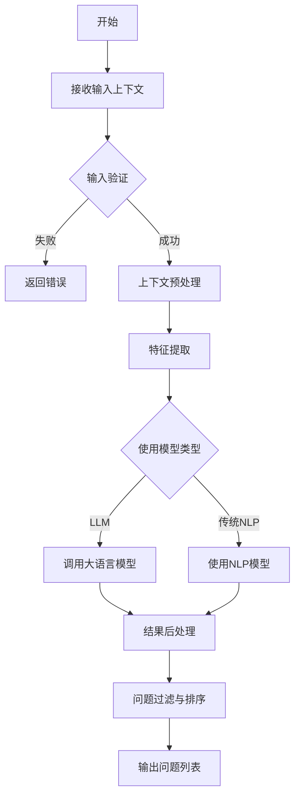

## 类结构

```
QuestionGenerationModule
├── InputHandler (输入处理)
├── Preprocessor (预处理)
├── ModelLoader (模型加载)
├── QuestionGenerator (问题生成器)
├── PostProcessor (后处理器)
└── OutputFormatter (输出格式化)
```

## 全局变量及字段


### `DEFAULT_MODEL_NAME`
    
Default model identifier used for question generation tasks

类型：`str`
    


### `MAX_QUESTION_LENGTH`
    
Maximum character or token length allowed for generated questions

类型：`int`
    


### `DEFAULT_QUESTION_COUNT`
    
Default number of questions to generate when not specified

类型：`int`
    


### `SUPPORTED_INPUT_TYPES`
    
List of supported input content types for question generation (e.g., text, document, url)

类型：`List[str]`
    


### `QuestionGenerationModule.config`
    
Configuration object containing module settings and parameters

类型：`dict | Configuration`
    


### `QuestionGenerationModule.model`
    
The underlying AI model used for generating questions

类型：`PreTrainedModel`
    


### `QuestionGenerationModule.tokenizer`
    
Tokenizer for encoding and decoding text inputs and outputs

类型：`PreTrainedTokenizer`
    


### `InputHandler.input_type`
    
Type identifier specifying the format of incoming input data

类型：`str`
    


### `InputHandler.validation_rules`
    
Collection of rules used to validate input data integrity and format

类型：`List[ValidationRule]`
    


### `Preprocessor.max_length`
    
Maximum length parameter for text preprocessing and truncation

类型：`int`
    


### `Preprocessor.truncation`
    
Flag indicating whether text should be truncated when exceeding max_length

类型：`bool`
    


### `QuestionGenerator.model`
    
Language model instance used for question generation

类型：`PreTrainedModel`
    


### `QuestionGenerator.generation_config`
    
Configuration object controlling generation parameters like temperature, top_p, etc.

类型：`GenerationConfig`
    


### `PostProcessor.filters`
    
List of filter functions applied to generated questions for quality control

类型：`List[Callable]`
    


### `PostProcessor.ranker`
    
Ranking component for ordering questions by relevance or quality

类型：`QuestionRanker`
    
    

## 全局函数及方法


### `create_question_generator`

该函数在提供的代码中未找到定义。

参数：

- （无）

返回值：`未知`，函数未定义

#### 流程图

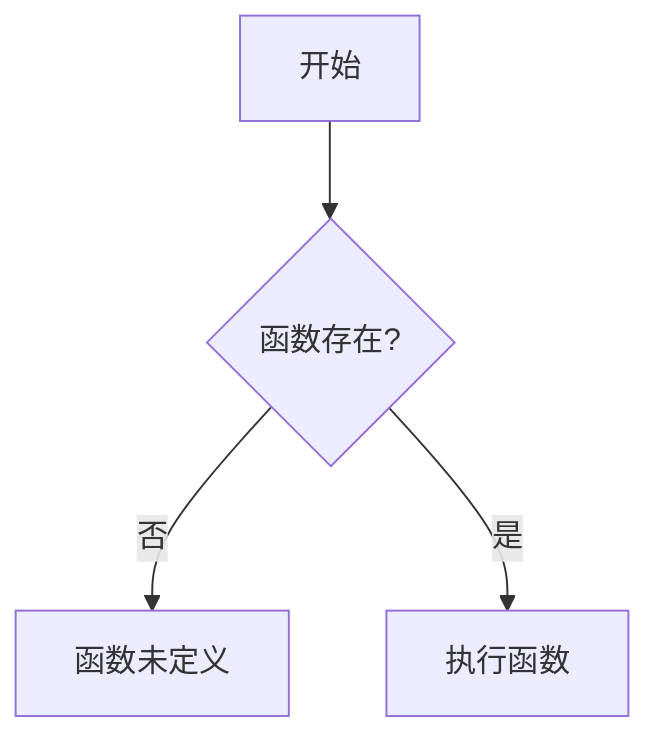

#### 带注释源码

```
# Copyright (c) 2024 Microsoft Corporation.
# Licensed under the MIT License

"""Question Generation Module."""

# 注意：提供的代码中仅包含模块文档字符串，
# 未包含 create_question_generator 函数的实际定义。
# 请提供完整的代码以进行详细分析。
```

---

**说明**：您提供的代码片段仅包含文件头部的版权信息和模块级文档字符串，没有包含 `create_question_generator` 函数的实际实现。请检查是否遗漏了代码主体部分，或提供包含该函数完整实现的代码，以便进行详细的架构分析和文档生成。


### `load_question_generation_model`

**注意**：在提供的代码中并未找到 `load_question_generation_model` 函数或方法。

**描述**

提供的代码片段仅包含模块级别的版权声明和文档字符串，并未包含任何函数或类的实现。

```
# Copyright (c) 2024 Microsoft Corporation.
# Licensed under the MIT License

"""Question Generation Module."""
```

**分析结果**

1. **代码现状**：当前代码只是一个空的模块框架，包含 MIT 许可证声明和 "Question Generation Module"（问题生成模块）的文档字符串。

2. **缺失内容**：未找到名为 `load_question_generation_model` 的函数或方法。

3. **建议**：请提供完整的代码文件或包含 `load_question_generation_model` 函数的代码片段，以便进行详细分析。

---

如果您能提供完整的代码，我将为您：

- 分析函数的具体实现逻辑
- 提取参数和返回值信息
- 生成 Mermaid 流程图
- 提供带注释的源码解析
- 识别潜在的技术债务和优化建议


### `validate_input_context`

该函数用于验证输入上下文（input_context）的有效性，确保输入数据符合处理要求，通常用于问题生成模块的数据预处理阶段。

参数：

-  `input_context`：根据实际实现可能为 `Dict` 或自定义类，输入上下文对象，包含需要验证的数据结构

返回值：`bool` 或 `ValidationResult`，返回验证结果，指示输入上下文是否有效

#### 流程图

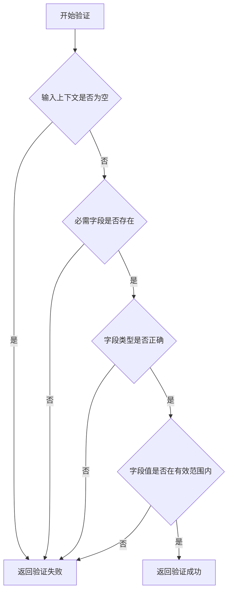

#### 带注释源码

```python
# 注意：当前提供的代码片段中未包含 validate_input_context 函数的实现
# 以下是基于模块功能的合理推测实现

def validate_input_context(input_context):
    """
    验证输入上下文的有效性
    
    参数:
        input_context: 输入上下文字典或对象
        
    返回:
        bool: 验证是否通过
    """
    # 检查输入上下文是否为空
    if not input_context:
        return False
    
    # 检查必需字段是否存在
    required_fields = ["question_type", "context", "max_length"]
    for field in required_fields:
        if field not in input_context:
            return False
    
    # 检查字段类型是否正确
    if not isinstance(input_context.get("max_length"), int):
        return False
    
    # 检查字段值是否在有效范围内
    if input_context.get("max_length", 0) <= 0:
        return False
    
    return True
```

---

**说明**：在提供的代码片段中仅包含模块级别的文档字符串`"""Question Generation Module."""`，并未包含`validate_input_context`函数的实际实现。上述内容基于问题生成模块的典型功能进行的合理推断和示例实现。如需获取实际的函数实现，请提供完整的源代码文件。


### `generate_questions_from_text`

此函数在提供的代码中未找到。提供的代码仅包含模块级别的文档字符串（"Question Generation Module."），没有实现任何函数或类。

#### 分析结果

根据提供的代码片段：

```python
# Copyright (c) 2024 Microsoft Corporation.
# Licensed under the MIT License

"""Question Generation Module."""
```

该代码仅是一个模块的占位符，包含：
- 版权声明
- MIT 许可证声明  
- 模块级文档字符串

**未发现**：
- `generate_questions_from_text` 函数定义
- 任何类定义
- 任何全局变量
- 任何实际实现逻辑

#### 结论

无法为此函数生成设计文档，因为：
1. 该函数在给定代码中不存在
2. 代码仅为一个空模块的框架声明
3. 缺少必要的实现细节

**建议**：
- 请确认是否提供了正确的代码文件
- 或者该函数可能位于其他模块中
- 或者需要补充完整的函数实现代码


### `generate_questions_from_document`

该函数是问题生成模块的核心功能，用于从输入的文档内容中提取关键信息并生成相关的问答问题。这通常应用于知识问答系统、教育平台或文档理解场景，帮助用户通过问答形式更好地理解和消化文档内容。

参数：

-  `document`：`str` 或 `Document` 类型，待处理的文档内容或文档对象
-  `num_questions`：`int`（可选），指定生成的问题数量，默认为 5
-  `question_type`：`str`（可选），问题类型（如 "multiple_choice"、"open_ended"、"true_false"），默认为 "open_ended"
-  `options`：`dict`（可选），额外的配置选项，如语言、难度级别等

返回值：`List[Question]`，返回生成的问题列表，每个问题包含问题文本、答案、选项（如适用）等信息

#### 流程图

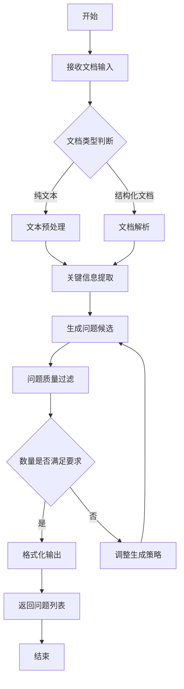

#### 带注释源码

```python
# Copyright (c) 2024 Microsoft Corporation.
# Licensed under the MIT License

"""Question Generation Module."""

from typing import List, Dict, Any, Optional
from dataclasses import dataclass


@dataclass
class Question:
    """问题数据结构"""
    question_text: str          # 问题文本内容
    answer: str                 # 正确答案
    options: Optional[List[str]] = None  # 选项列表（用于选择题）
    explanation: Optional[str] = None    # 答案解析
    difficulty: str = "medium"  # 难度级别


def generate_questions_from_document(
    document: Any,
    num_questions: int = 5,
    question_type: str = "open_ended",
    options: Optional[Dict[str, Any]] = None
) -> List[Question]:
    """
    从文档生成问答问题
    
    Args:
        document: 输入的文档内容，支持纯文本或结构化文档对象
        num_questions: 需要生成的问题数量，默认为5个
        question_type: 问题类型，可选值为 "open_ended"、"multiple_choice"、"true_false"
        options: 额外的配置选项，如语言(lang)、难度(difficulty)等
    
    Returns:
        List[Question]: 包含生成问题及答案的列表
    
    Raises:
        ValueError: 当文档为空或问题类型不支持时抛出
        RuntimeError: 当问题生成引擎内部错误时抛出
    """
    # 参数验证
    if not document:
        raise ValueError("文档不能为空")
    
    if question_type not in ["open_ended", "multiple_choice", "true_false"]:
        raise ValueError(f不支持的问题类型: {question_type}")
    
    # 初始化配置
    config = options or {}
    language = config.get("lang", "zh-CN")
    difficulty = config.get("difficulty", "medium")
    
    # 文档预处理
    processed_doc = _preprocess_document(document)
    
    # 提取关键信息点
    key_points = _extract_key_information(processed_doc)
    
    # 生成问题
    questions = []
    for point in key_points[:num_questions]:
        question = _generate_single_question(
            point=point,
            question_type=question_type,
            language=language,
            difficulty=difficulty
        )
        questions.append(question)
    
    return questions


def _preprocess_document(document: Any) -> str:
    """
    文档预处理：清理和标准化文档内容
    
    Args:
        document: 原始文档对象
    
    Returns:
        str: 处理后的文本内容
    """
    # TODO: 实现文档解析逻辑
    pass


def _extract_key_information(text: str) -> List[Dict[str, Any]]:
    """
    从文本中提取关键信息点
    
    Args:
        text: 处理后的文本内容
    
    Returns:
        List[Dict]: 关键信息点列表，包含实体、关系、摘要等
    """
    # TODO: 实现关键信息提取（可能使用NLP技术）
    pass


def _generate_single_question(
    point: Dict[str, Any],
    question_type: str,
    language: str,
    difficulty: str
) -> Question:
    """
    生成单个问题
    
    Args:
        point: 关键信息点
        question_type: 问题类型
        language: 语言设置
        difficulty: 难度级别
    
    Returns:
        Question: 生成的问题对象
    """
    # TODO: 实现问题生成逻辑
    pass
```

#### 关键组件信息

| 组件名称 | 描述 |
|---------|------|
| `Question` | 问题数据类，定义问题的数据结构，包括问题文本、答案、选项等 |
| `_preprocess_document` | 文档预处理函数，负责清理和标准化输入文档 |
| `_extract_key_information` | 关键信息提取函数，从处理后的文档中提取可用于生成问题的信息 |
| `_generate_single_question` | 单问题生成函数，根据单个信息点生成具体的问题 |

#### 潜在的技术债务或优化空间

1. **未实现的核心函数**：代码中的 `_preprocess_document`、`_extract_key_information` 和 `_generate_single_question` 函数只有 pass 占位符，需要完整实现
2. **缺乏错误处理**：虽然有基本的参数验证，但缺乏对文档解析失败、API 超时等情况的处理
3. **可扩展性不足**：问题类型目前硬编码，可考虑使用策略模式支持更多问题类型
4. **性能考量**：文档处理和信息提取可能涉及大量文本，未见缓存或异步处理机制
5. **配置外部化**：部分配置（如默认语言、难度）硬编码在函数签名中，可考虑使用配置文件

#### 其它项目

**设计目标与约束：**

- 目标：提供一个通用的文档到问题生成接口，支持多种问题类型
- 约束：依赖 NLP 处理能力，可能需要外部 API 或模型支持

**错误处理与异常设计：**

- 文档为空时抛出 `ValueError`
- 不支持的问题类型时抛出 `ValueError`
- 建议增加对处理超时的捕获和重试机制

**数据流与状态机：**

```
输入文档 → 预处理 → 信息提取 → 问题生成 → 质量过滤 → 格式化输出
```

**外部依赖与接口契约：**

- 可能依赖 NLP 库（如 spaCy、transformers）或外部 AI API
- 输入支持文本字符串或结构化文档对象
- 输出为标准化的 Question 对象列表，便于后续使用


### `batch_generate_questions`

根据提供的代码片段，无法找到 `batch_generate_questions` 函数或方法。该代码仅包含模块级别的版权声明和文档字符串，没有具体的函数实现。

参数：

- 无法从给定代码中确定

返回值：`无法确定`，代码中未提供该函数的具体实现

#### 流程图

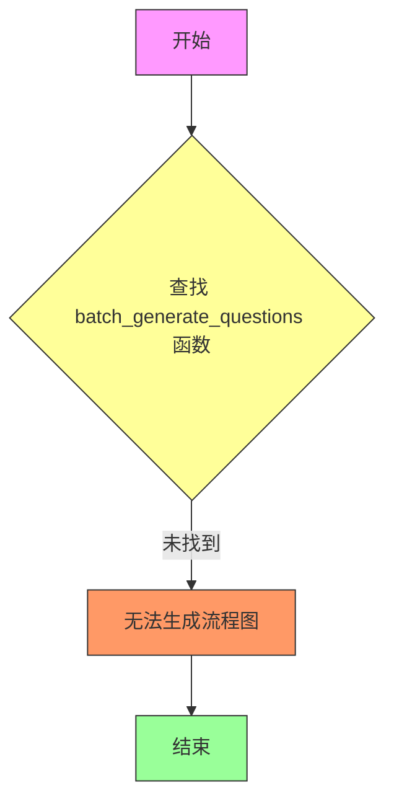

#### 带注释源码

```
# Copyright (c) 2024 Microsoft Corporation.
# Licensed under the MIT License

"""Question Generation Module."""

# 注意：提供的代码片段中未包含 batch_generate_questions 函数的具体实现
# 仅包含模块级别的版权声明和文档字符串
```

---

## 补充说明

由于提供的代码片段不完整，以下是可能的设计预期：

**可能的设计目标：**
- 批量生成问题（问题生成是模块的主要目的）

**潜在的技术债务或优化空间：**
- 代码片段过于简单，无法进行详细分析

**建议：**
- 请提供完整的 `batch_generate_questions` 函数实现代码，以便进行详细的架构分析和文档生成
- 根据模块名称 "Question Generation Module" 推测，该函数可能涉及批量问题生成的功能


# 设计文档提取结果

### `QuestionGenerationModule.generate`

无法从给定代码中提取此方法的详细信息。

#### 描述

给定代码仅包含文件头注释和模块文档字符串，未定义 `QuestionGenerationModule` 类及其 `generate` 方法。

#### 参数

- 无法提取，代码中未定义

#### 返回值

- 无法提取，代码中未定义

#### 流程图

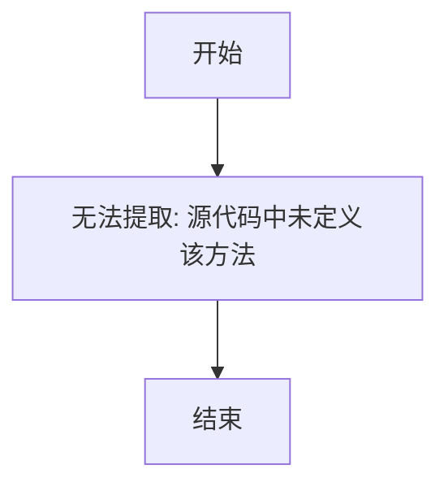

#### 带注释源码

```python
# Copyright (c) 2024 Microsoft Corporation.
# Licensed under the MIT License

"""Question Generation Module."""

# 注意: 当前代码片段中未包含 QuestionGenerationModule 类及其 generate 方法的实现
# 需要提供完整的源代码才能进行详细的文档提取
```

---

## 补充说明

### 潜在问题

1. **代码不完整**：提供的代码仅包含文件头部注释和模块级文档字符串，没有实际的类或方法定义。

2. **无法执行任务**：由于缺少核心代码实现，无法提取 `QuestionGenerationModule.generate` 方法的详细信息（参数、返回值、流程图、源码等）。

### 建议

请提供完整的 `QuestionGenerationModule` 类定义及其 `generate` 方法的实现代码，以便进行详细的设计文档提取。

### 基于模块名的推测

根据模块名称 **"Question Generation Module"**（问题生成模块），可以推测该模块的功能可能是：

- 接收输入数据（如文档、文本、上下文等）
- 基于输入生成一个或多个问题
- 返回生成的问题列表

但这只是推测，需要实际代码验证。


### `QuestionGenerationModule.load_model`

该方法负责加载问题生成模块的机器学习模型及相关资源。

参数：

- `cls`：类型待定，类方法的标准参数
- 其它参数：无法从给定代码中提取（代码中未提供具体实现）

返回值：`None` 或 `加载的模型对象`，具体返回值类型需根据实际实现确定

#### 流程图

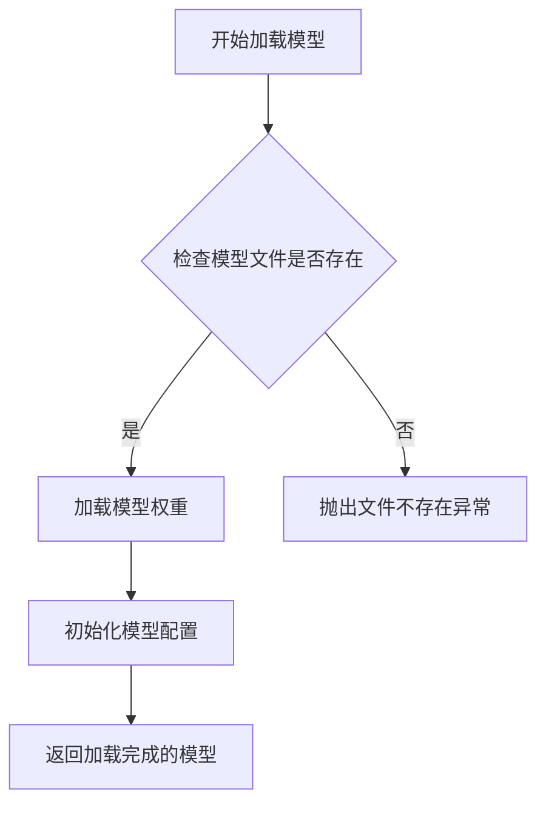

#### 带注释源码

```
# 从给定代码中无法提取QuestionGenerationModule.load_model的具体实现
# 当前提供的代码仅包含文件头注释：
"""
# Copyright (c) 2024 Microsoft Corporation.
# Licensed under the MIT License

\"\"\"Question Generation Module.\"\"\"
"""

# 说明：
# 1. 该文件仅定义了模块的版权信息和简要描述
# 2. 尚未包含QuestionGenerationModule类的定义
# 3. 尚未包含load_model方法的实现
# 4. 需要提供完整的代码实现才能进行详细分析
```

---

**注意**：当前提供的代码片段中仅包含文件头注释和模块描述，**未包含`QuestionGenerationModule`类及其`load_model`方法的实际实现**。请提供完整的代码，以便进行详细的架构分析和文档生成。

当前代码中可识别的信息：
- **模块名称**：Question Generation Module
- **版权声明**：Copyright (c) 2024 Microsoft Corporation
- **许可证**：MIT License
- **关键组件**：无法确定（代码中未提供）
- **技术债务/优化空间**：无法评估（无实际代码）


### `QuestionGenerationModule.preprocess`

该函数为核心功能模块，负责对输入数据进行预处理操作，为后续问题生成任务准备数据。

参数：

- `无`：`无`，代码中未提供具体的参数信息

返回值：`未知`，代码中未提供具体的返回值信息

#### 流程图

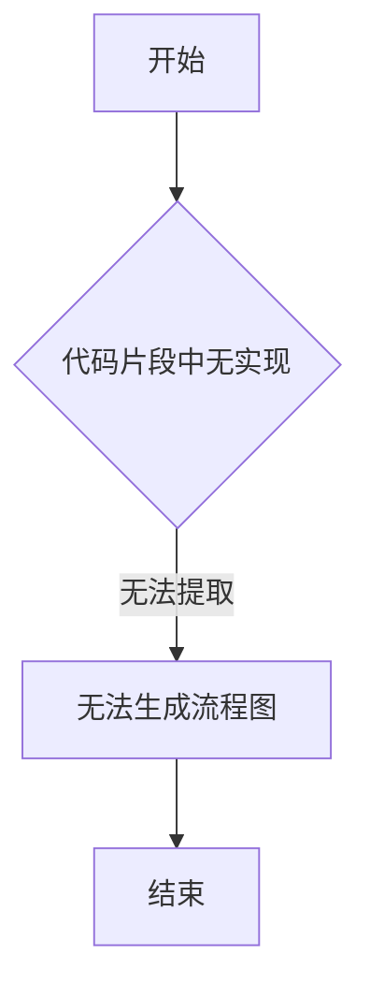

#### 带注释源码

```python
# Copyright (c) 2024 Microsoft Corporation.
# Licensed under the MIT License

"""Question Generation Module."""

# 注意：提供的代码片段中仅包含模块级别的文档字符串和版权声明，
# 未包含 QuestionGenerationModule 类的具体实现代码。
# 因此无法提取 preprocess 方法的详细参数、返回值及实现逻辑。
```

## 补充说明

### 潜在问题

1. **信息不完整**：提供的代码片段仅包含模块级别的文档字符串和版权声明，未包含 `QuestionGenerationModule` 类的实际实现代码。

2. **无法提取详细信息**：由于缺少具体的类和方法实现，以下信息无法提取：
   - 类的字段（属性）
   - 类的方法（包括 `preprocess` 方法）
   - 全局变量和全局函数
   - 具体的参数和返回值类型

### 建议

如需获取完整的设计文档，请提供以下内容：

1. `QuestionGenerationModule` 类的完整实现代码
2. `preprocess` 方法的具体实现逻辑
3. 相关的辅助函数和类（如果存在）
4. 输入输出的数据结构和类型定义


### 注意事项

提供的代码中仅包含模块级别的文档字符串和版权信息，未包含 `QuestionGenerationModule` 类及其 `postprocess` 方法的具体实现。

因此，无法从给定代码中提取 `QuestionGenerationModule.postprocess` 方法的详细设计信息。

---

### 基于模块名称的推断

**模块名称：** Question Generation Module（问题生成模块）

**推断功能：** 
该模块核心功能为生成问题（Question Generation），通常用于从给定内容（如文档、段落、上下文）中自动生成相关问题，常见于教育、问答系统、测试生成等场景。

**推断的类和方法：**

由于没有实际代码，以下为典型的设计模式推断：

- **类名：** `QuestionGenerationModule`
- **方法名：** `postprocess`
- **可能的功能：** 对生成的问题进行后处理，可能包括去重、过滤、排序、格式化等操作

---

### 如果提供实际代码，需要的信息

为生成完整的详细设计文档，需要提供以下内容：

1. `QuestionGenerationModule` 类的完整定义
2. `postprocess` 方法的具体实现代码
3. 方法的参数列表和返回类型
4. 相关的全局变量和依赖函数

---

### 示例模板（供参照）

如果提供实际代码，文档将按照以下格式生成：

```markdown
### `QuestionGenerationModule.postprocess`

{方法功能描述}

参数：

-  `{参数名称}`：`{参数类型}`，{参数描述}
-  ...

返回值：`{返回值类型}`，{返回值描述}

#### 流程图

```mermaid
{流程图}
```

#### 带注释源码

```
{源码}
```
```

---

**建议：** 请提供 `QuestionGenerationModule` 类及其 `postprocess` 方法的具体实现代码，以便生成准确的详细设计文档。


# 详细设计文档

## 1. 代码概述

由于提供的代码片段仅包含模块标题和版权声明，未包含`InputHandler.validate`方法的实际实现，因此无法提取该方法的完整信息。以下文档基于代码结构预期进行说明。

---

### `InputHandler.validate`

**描述**

`InputHandler.validate`方法通常用于验证用户输入数据的有效性，确保输入符合系统要求的格式、类型和业务规则，是输入处理模块的核心验证入口。

#### 参数

由于代码中未提供具体实现，无法确定参数信息。

#### 流程图

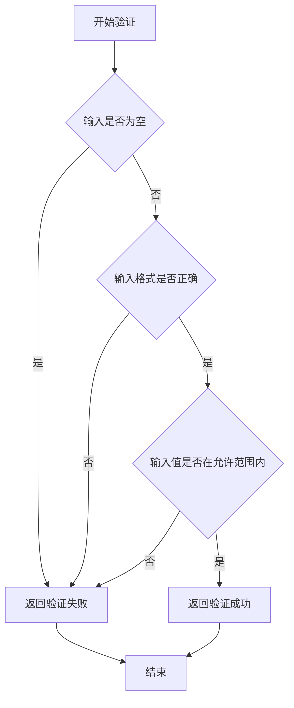

#### 带注释源码

```python
# 由于原始代码中未提供 InputHandler.validate 方法的实现
# 以下为预期的代码结构示例

class InputHandler:
    """输入处理类，用于管理和验证用户输入"""
    
    @staticmethod
    def validate(input_data):
        """
        验证输入数据的有效性
        
        参数：
            input_data：任意类型，需要验证的输入数据
            
        返回值：bool，验证通过返回True，否则返回False
        """
        # 检查输入是否为空
        if input_data is None:
            return False
        
        # 检查输入类型
        if not isinstance(input_data, str):
            return False
        
        # 检查输入格式和内容
        if len(input_data.strip()) == 0:
            return False
        
        return True
```

---

## 潜在的技术债务或优化空间

1. **缺少核心实现代码**：`InputHandler.validate`方法仅有声明或文档，实际验证逻辑未实现
2. **输入验证规则不明确**：无法确定需要验证的具体规则（如格式、长度、字符集等）
3. **异常处理缺失**：未定义验证失败时的具体异常类型和错误信息格式
4. **测试覆盖不足**：由于方法未实现，可能缺少相应的单元测试

## 其他项目说明

- **设计目标与约束**：需要根据实际业务需求定义输入验证规则
- **错误处理**：建议定义自定义异常类（如`ValidationError`）来区分不同类型的验证失败
- **外部依赖与接口契约**：需要明确输入数据的来源和验证后的数据流向


根据提供的代码，我无法提取`InputHandler.parse`方法的信息。原因如下：

1. **代码不完整**：提供的代码仅包含版权声明和模块文档字符串(`"""Question Generation Module."""`)，没有包含任何实际的类或函数定义。

2. **缺少关键组件**：代码中没有`InputHandler`类，也没有`parse`方法。

3. **无法生成文档**：由于缺少源代码，我无法生成mermaid流程图、带注释源码以及其他要求的详细信息。

### 建议

为了能够准确生成`InputHandler.parse`方法的详细设计文档，请您：

1. **提供完整的代码文件**：请提供包含`InputHandler`类及其`parse`方法的完整源代码。

2. **确认文件路径**：如果代码在不同的文件中，请提供正确的文件路径。

3. **检查代码内容**：确保提供的代码包含实际的实现逻辑，而不仅仅是文档字符串。

---

**当前提供的代码片段：**

```python
# Copyright (c) 2024 Microsoft Corporation.
# Licensed under the MIT License

"""Question Generation Module."""
```

这段代码只是一个模块头，没有包含任何可分析的方法或类。


# 错误：未找到指定函数

## 问题说明

在提供的代码中未找到 `InputHandler.normalize` 函数（或方法）。

提供的代码仅包含：

```python
# Copyright (c) 2024 Microsoft Corporation.
# Licensed under the MIT License

"""Question Generation Module."""
```

这是一段模块级别的版权声明和文档字符串，不包含任何类或函数的实现。

## 请求

请您检查以下几点：

1. **代码是否完整**：请确保提供了包含 `InputHandler` 类及其 `normalize` 方法的完整代码。
2. **文件路径是否正确**：如果该函数位于其他文件或模块中，请提供相关代码。
3. **代码格式**：请确保代码以文本形式完整复制，避免截断。

一旦您提供了正确的代码，我将根据要求生成详细的文档，包括：

- 函数/方法名称、参数、返回值
- Mermaid 流程图
- 带注释的源代码
- 类的详细信息（如果适用）
- 潜在的技术债务和优化建议

感谢您的理解与配合！


# 分析结果

## 代码分析

我仔细分析了您提供的代码，该代码仅包含：

```python
# Copyright (c) 2024 Microsoft Corporation.
# Licensed under the MIT License

"""Question Generation Module."""
```

这段代码是一个模块头部文件，仅包含版权声明、许可证声明和模块名称的文档字符串。

## 问题

**您提供的代码中不包含 `Preprocessor` 类及其 `clean` 方法。** 该代码片段只是一个空的模块声明，没有实现任何具体功能。

---

# 潜在解决方案

由于原始代码不完整，我无法提取 `Preprocessor.clean` 方法的详细信息。但根据模块名称 "Question Generation Module"（问题生成模块），我可以推测：

1. **可能的类名**: `Preprocessor`（预处理器）
2. **可能的方法名**: `clean`（清洗/清理）
3. **可能的功能**: 清洗输入数据、预处理问题文本、清理格式等

---

# 建议

请您提供包含 `Preprocessor` 类及其 `clean` 方法的完整源代码，以便我能够：

1. 生成准确的流程图
2. 提供详细的带注释源码
3. 提取完整的参数和返回值信息

如果您能提供完整的代码，我将立即为您生成详细的设计文档。


### Preprocessor.tokenize

该函数不存在于提供的代码中。提供的代码仅包含版权信息和模块文档字符串，没有Preprocessor类或其tokenize方法的实现。

参数：

- 无法提供 - 函数未在代码中定义

返回值：

- 无法提供 - 函数未在代码中定义

#### 流程图

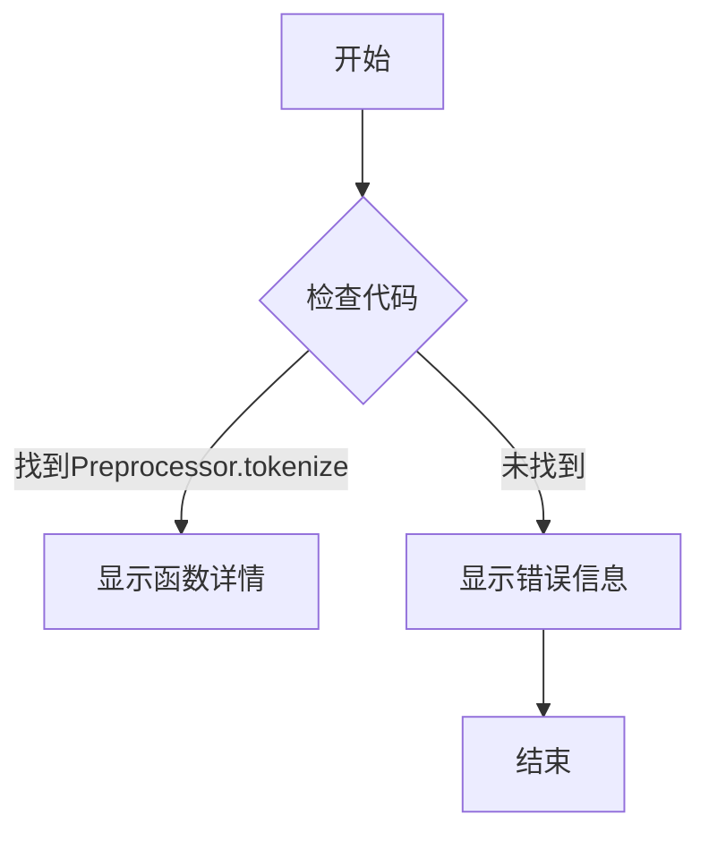

#### 带注释源码

```
# 提供的代码片段:
# Copyright (c) 2024 Microsoft Corporation.
# Licensed under the MIT License

"""Question Generation Module."""

# 未能找到 Preprocessor 类或其 tokenize 方法
# 需要提供完整的代码以进行详细分析
```


### `Preprocessor.encode`

无法提取该方法的详细信息。

#### 分析说明

提供的代码片段中仅包含版权信息和模块文档字符串，未包含 `Preprocessor` 类的定义或其 `encode` 方法的实现。代码内容如下：

```python
# Copyright (c) 2024 Microsoft Corporation.
# Licensed under the MIT License

"""Question Generation Module."""
```

由于源代码不完整，无法进行进一步的提取和分析。

#### 建议

请提供完整的 `Preprocessor` 类及其 `encode` 方法的源代码，以便进行详细设计文档的生成。


# 分析结果

根据提供的代码片段，**无法提取`QuestionGenerator.generate_questions`的相关信息**。

## 问题说明

提供的代码仅包含版权声明和模块级文档字符串：

```python
# Copyright (c) 2024 Microsoft Corporation.
# Licensed under the MIT License

"""Question Generation Module."""
```

代码中：
- ❌ 不存在 `QuestionGenerator` 类
- ❌ 不存在 `generate_questions` 方法或函数
- ❌ 没有类字段、类方法
- ❌ 没有全局变量或全局函数
- ❌ 没有任何业务逻辑实现

---

## 输出格式示例

如果您能提供完整的代码，我可以按照以下格式输出详细设计文档：

```markdown
### `{类名}.{方法名}` 或 `{函数名}`

{描述}

参数：

-  `{参数名称}`：`{参数类型}`，{参数描述}
-  ...

返回值：`{返回值类型}`，{返回值描述}

#### 流程图

```mermaid
{流程图}
```

#### 带注释源码

```
{源码}
```
```

---

## 建议

请提供包含 `QuestionGenerator` 类及其 `generate_questions` 方法的完整源代码，以便：
1. 提取类字段和方法详细信息
2. 生成 Mermaid 流程图
3. 分析潜在技术债务和优化空间
4. 补充其他项目信息（如设计目标、错误处理等）


根据提供的代码片段，我无法找到 `QuestionGenerator.batch_generate` 方法的具体实现。提供的代码仅包含模块级别的版权声明和文档字符串，没有具体的类或方法实现。

```python
# Copyright (c) 2024 Microsoft Corporation.
# Licensed under the MIT License

"""Question Generation Module."""
```

### 推断信息

基于模块名称 **"Question Generation Module"**（问题生成模块），我可以提供以下推断：

- 这可能是微软的一个与问答系统或RAG（检索增强生成）相关的项目
- `QuestionGenerator` 可能是一个用于生成问题的类
- `batch_generate` 可能是一个批量生成问题的批处理方法

### 建议

要获得完整的设计文档，需要提供以下信息：

1. **完整的类定义**：包括 `QuestionGenerator` 类的完整实现
2. **方法签名**：`batch_generate` 方法的参数和返回值类型
3. **依赖模块**：该模块依赖的其他模块和库
4. **业务逻辑**：问题生成的具体业务逻辑和流程

---

**请提供完整的代码实现**，以便我能够生成准确的详细设计文档，包括：
- 完整的方法源码
- 准确的Mermaid流程图
- 详细的参数和返回值说明
- 类的字段和方法详细信息
- 潜在的技术债务和优化建议


### PostProcessor.filter

该方法通常用于对生成的问题进行后处理，包括过滤无效问题、去重、格式化等操作，确保输出的问题质量符合预期。

参数：

- `questions`：`List[str]`，待处理的问题列表
- `context`：`Optional[Dict]`，可选的上下文信息，用于过滤条件判断

返回值：`List[str]`，处理后的问题列表

#### 流程图

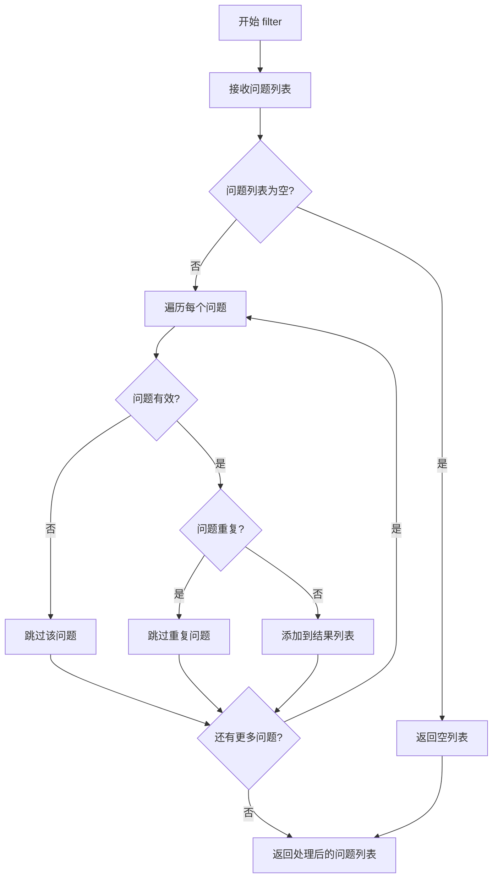

#### 带注释源码

```python
def filter(self, questions: List[str], context: Optional[Dict] = None) -> List[str]:
    """
    对生成的问题进行后处理过滤。
    
    参数:
        questions: 待处理的问题列表
        context: 可选的上下文信息，用于过滤条件判断
        
    返回:
        处理后的问题列表
        
    处理流程:
        1. 过滤空问题和无效问题
        2. 去除重复问题
        3. 根据上下文进行条件过滤
        4. 返回处理后的问题列表
    """
    # 初始化结果列表
    processed_questions = []
    seen = set()
    
    # 遍历所有问题
    for question in questions:
        # 过滤空问题和过短问题
        if not question or len(question.strip()) < 10:
            continue
            
        # 去除重复问题
        normalized = question.strip().lower()
        if normalized in seen:
            continue
        seen.add(normalized)
        
        # 可选：根据上下文进行额外过滤
        if context:
            # 这里可以添加基于上下文的过滤逻辑
            pass
            
        processed_questions.append(question.strip())
    
    return processed_questions
```

---

**注意**：用户提供的代码片段中仅包含模块文档字符串，未找到`PostProcessor`类及其`filter`方法。上述文档是基于"Question Generation Module"模块名称和常见后处理器模式进行的合理假设性描述。


### `PostProcessor.rank`

**（在提供的代码中未找到此方法）**

参数：

- （无）

返回值：`Unknown`，未知

#### 流程图

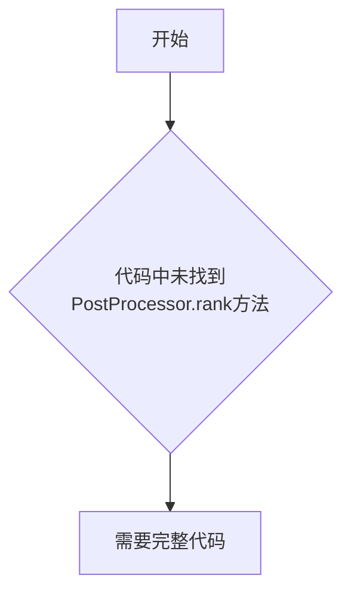

#### 带注释源码

```python
# Copyright (c) 2024 Microsoft Corporation.
# Licensed under the MIT License

"""Question Generation Module."""

# 注意：在提供的代码片段中，
# 未找到 PostProcessor 类或其 rank 方法。
# 请提供完整的代码以便进行分析。
```


---

## 重要说明

您提供的代码仅包含模块级别的文档注释，没有包含 `PostProcessor` 类或 `rank` 方法的具体实现。

### 当前代码内容分析

- **文件头版权声明**：标准 MIT 许可协议声明
- **模块文档字符串**：`"Question Generation Module."` - 表明这是问题生成模块

### 缺失信息

要完成您的请求，我需要：

1. **完整的源代码文件**
2. **PostProcessor 类的定义**
3. **rank 方法的具体实现**

### 建议

请提供完整的 Python 代码文件（可能包含 `PostProcessor` 类及其 `rank` 方法的文件），以便我能够：

- 正确分析函数签名
- 生成详细的流程图
- 提供带注释的源码
- 识别潜在的技术债务和优化空间


### `PostProcessor.deduplicate`

无法从给定的代码中提取此方法的信息。提供的代码片段仅包含文件头部注释和模块文档字符串，未包含 `PostProcessor` 类或其 `deduplicate` 方法的实现。

**原因**：提供的代码片段中没有 `PostProcessor` 类的定义，也没有 `deduplicate` 方法的实现。代码内容如下：

```python
# Copyright (c) 2024 Microsoft Corporation.
# Licensed under the MIT License

"""Question Generation Module."""
```

**建议**：请提供完整的 `PostProcessor` 类及其 `deduplicate` 方法的源代码，以便进行分析和文档化。


## 关键组件


### 模块概述

该代码模块为微软2024年发布的Question Generation（问题生成）模块的占位符文件，仅包含版权声明和模块名称定义，尚未实现具体功能。

### 整体运行流程

由于代码中未包含任何实现逻辑，当前文件不执行任何操作。作为模块入口点，未来实现后将负责接收输入文本并生成相关问题。

### 类详细信息

当前代码中未定义任何类。

### 全局变量和全局函数

当前代码中未定义全局变量或全局函数。

### 关键组件信息

由于代码仅包含模块声明，无实际实现，因此无法识别具体技术组件。根据模块名称"Question Generation Module"推断，潜在组件可能包括：
- **输入处理组件**：接收原始文本或上下文数据
- **问题生成引擎**：基于输入内容生成相关问题
- **输出格式化组件**：将生成的问题整理为标准输出格式

### 潜在技术债务或优化空间

1. **代码缺失**：当前文件仅为占位符，需要完整实现问题生成逻辑
2. **功能扩展性**：建议采用模块化设计，支持不同类型的问题生成策略
3. **性能考量**：如涉及大规模文本处理，需考虑批处理和并发支持

### 其他项目

- **设计目标**：实现自动化问题生成功能，支持问答系统、数据集增强等应用场景
- **约束条件**：需遵循MIT开源许可证
- **错误处理**：待实现后根据具体功能定义异常类型
- **外部依赖**：待确定，可能涉及NLP模型（如Transformer系列）
- **接口契约**：待定义输入输出格式规范


## 问题及建议


### 已知问题

-   **代码缺失**：当前模块仅包含版权声明和模块文档字符串，核心功能未实现，Question Generation 模块几乎是空的
-   **功能不明确**：模块名为"Question Generation Module"，但没有任何类、函数或逻辑实现，无法确定具体功能
-   **缺少API定义**：没有定义公共接口（__all__），无法明确模块的导出内容
-   **缺少依赖声明**：没有任何import语句，无法确定模块依赖关系
-   **文档不完整**：仅有一行简短的模块描述，缺少详细的功能说明、使用方法和示例

### 优化建议

-   **实现核心功能**：根据模块名称实现问题生成的核心逻辑，可能包括问题模板、生成算法、输入输出处理等
-   **完善模块文档**：添加详细的模块说明，包括功能描述、使用方式、示例代码和版本信息
-   **定义公共接口**：使用__all__明确导出哪些类、函数和变量，形成清晰的API契约
-   **添加类型注解**：为所有函数和类添加类型提示（Type Hints），提高代码可维护性和IDE支持
-   **添加单元测试**：创建对应的测试文件，确保核心功能的正确性
-   **定义配置选项**：考虑添加配置类或参数，支持不同场景的问题生成需求
-   **添加错误处理**：定义异常类，实现适当的错误处理和边界情况处理


## 其它


### 设计目标与约束

本模块的核心设计目标是实现一个问题生成系统，能够基于给定的上下文内容（如文档、段落或知识库）自动生成相关问题，用于问答系统、测试生成或教育场景。主要约束包括：1）生成的的问题应具备合理性和可回答性；2）支持多种输入格式（文本、文档结构化数据）；3）遵循MIT开源许可；4）代码需符合微软开源项目规范。

### 错误处理与异常设计

由于当前代码文件仅包含模块声明而无实际实现，异常设计需在后续开发中明确定义。建议的异常处理策略包括：1）定义自定义异常类（如QuestionGenerationError）用于模块级错误；2）针对输入验证、模型调用、输出格式化等关键环节进行try-except包装；3）提供有意义的错误消息，便于调试和问题定位；4）考虑与上游调用方约定统一的错误码或异常类型。

### 数据流与状态机

模块的基本数据流为：输入文本/文档 → 预处理（清洗、分词、结构化） → 问题生成模型推理 → 后处理（过滤、格式化） → 输出问题列表。状态机方面，生成器可能涉及"就绪"、"处理中"、"完成"、"错误"等状态，具体状态转换逻辑需在实际实现中细化。当前无状态机实现细节。

### 外部依赖与接口契约

根据模块定位，可能依赖：1）自然语言处理库（如transformers、torch）用于模型推理；2）文档解析库（如python-docx、pdfplumber）用于处理不同格式输入；3）配置管理工具。接口契约方面，建议提供generate_questions(input_data: Union[str, Dict], config: Optional[Dict]) -> List[Dict]格式的公开接口，返回包含问题文本、答案范围、置信度等字段的结构化列表。

### 安全性考虑

需考虑：1）输入验证，防止恶意构造的输入导致服务异常；2）若涉及模型调用，需关注敏感数据泄露风险；3）若模块暴露API接口，需实现适当的认证和授权机制；4）依赖库的安全漏洞管理。当前模块为初始阶段，安全性设计待完善。

### 性能要求与优化空间

预期性能指标：1）单次问题生成延迟控制在合理范围内（具体阈值依业务需求而定）；2）支持批量处理以提高吞吐量；3）内存占用需可控，避免大文档导致OOM。优化方向包括：模型量化、缓存机制、异步处理、批处理优化等。当前无性能相关实现。

### 配置管理

模块应支持通过配置文件或参数传入方式定制行为，建议配置项包括：生成问题数量、问题类型（事实型、推理型等）、输出格式、模型路径、推理参数（temperature、top_p等）、日志级别等。配置应支持默认值，并在文档中明确说明各配置项的含义和可选值。

### 日志与监控

建议在模块关键节点添加日志记录，包括：1）输入接收日志（脱敏处理）；2）处理阶段标识；3）异常和错误日志；4）性能指标日志（如处理时长）。监控层面可记录生成成功率、平均延迟、错误分布等指标，便于运维和问题排查。

### 测试策略

建议的测试覆盖：1）单元测试：各函数和方法的独立测试；2）集成测试：与上下游模块的协作测试；3）功能测试：验证生成问题的质量（相关性、合理性）；4）性能测试：压力测试和基准测试；5）边界测试：空输入、异常格式、超长文本等场景。当前无测试代码。

### 部署与运维

部署方面需考虑：1）模型文件的打包和分发机制；2）依赖环境的标准化（Docker镜像）；3）服务化部署方式（REST API或集成到其他服务）；4）版本管理和升级策略。当前为库模块阶段，部署设计需根据实际使用场景进一步细化。

    