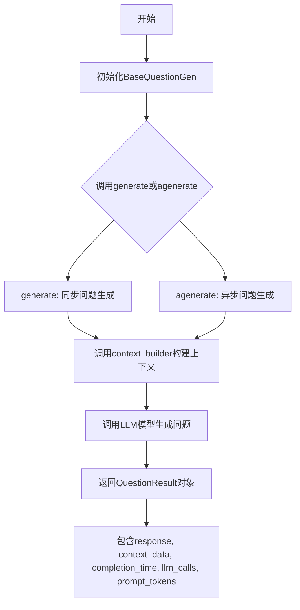
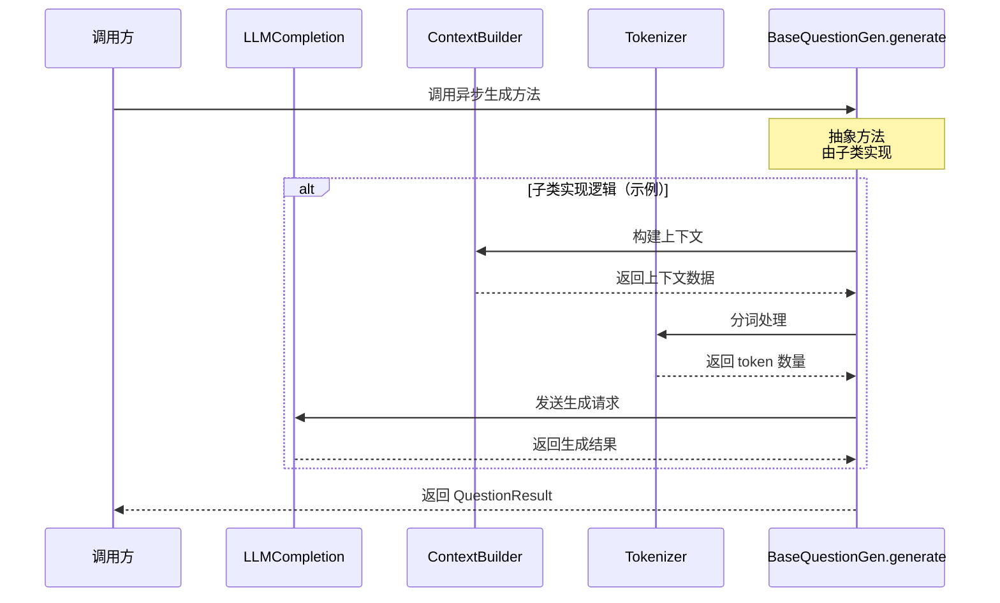
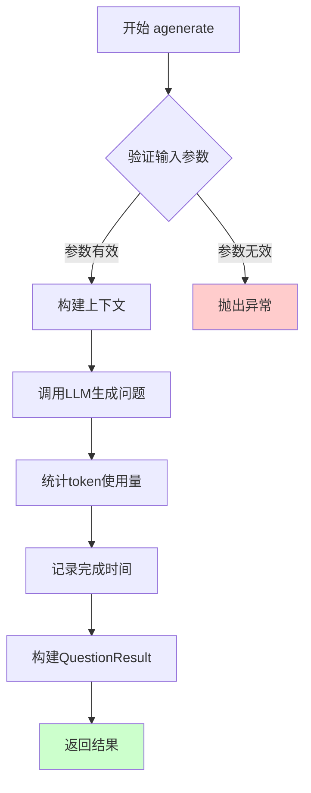

# `graphrag\packages\graphrag\graphrag\query\question_gen\base.py` 详细设计文档

该文件定义了基于历史问题和最新上下文数据生成问题的基类，包括QuestionResult数据结构类和BaseQuestionGen抽象基类，提供了同步和异步两种问题生成接口。

## 整体流程



## 类结构

```
QuestionResult (数据类)
└── BaseQuestionGen (抽象基类)
    ├── generate (抽象方法-同步)
    └── agenerate (抽象方法-异步)
```

## 全局变量及字段


### `QuestionResult.response`
    
生成的问题列表

类型：`list[str]`
    


### `QuestionResult.context_data`
    
上下文数据

类型：`str | dict[str, Any]`
    


### `QuestionResult.completion_time`
    
完成时间

类型：`float`
    


### `QuestionResult.llm_calls`
    
LLM调用次数

类型：`int`
    


### `QuestionResult.prompt_tokens`
    
提示词token数量

类型：`int`
    


### `BaseQuestionGen.model`
    
LLM模型实例

类型：`LLMCompletion`
    


### `BaseQuestionGen.context_builder`
    
上下文构建器

类型：`GlobalContextBuilder | LocalContextBuilder`
    


### `BaseQuestionGen.tokenizer`
    
分词器

类型：`Tokenizer`
    


### `BaseQuestionGen.model_params`
    
模型参数

类型：`dict[str, Any]`
    


### `BaseQuestionGen.context_builder_params`
    
上下文构建器参数

类型：`dict[str, Any]`
    
    

## 全局函数及方法


### `BaseQuestionGen.__init__`

初始化方法，用于创建问题生成器实例，接收模型、上下文构建器等必要组件，并设置默认参数。

参数：

- `model`：`"LLMCompletion"`，LLM模型实例，用于生成问题
- `context_builder`：`GlobalContextBuilder | LocalContextBuilder`，全局或本地上下文构建器，用于构建查询上下文
- `tokenizer`：`Tokenizer | None`，可选的分词器，若未提供则使用模型的默认分词器
- `model_params`：`dict[str, Any] | None`，可选的模型参数字典，用于配置模型行为
- `context_builder_params`：`dict[str, Any] | None`，可选的上下文构建器参数字典

返回值：`None`，无返回值（初始化方法）

#### 流程图

```mermaid
flowchart TD
    A[开始初始化] --> B[接收model参数]
    B --> C[接收context_builder参数]
    C --> D[接收tokenizer参数]
    D --> E{tokenizer是否为None?}
    E -->|是| F[使用model.tokenizer作为默认值]
    E -->|否| G[使用传入的tokenizer]
    F --> H[接收model_params参数]
    G --> H
    H --> I{model_params是否为None?}
    I -->|是| J[使用空字典{}作为默认值]
    I -->|否| K[使用传入的model_params]
    J --> L[接收context_builder_params参数]
    K --> L
    L --> M{context_builder_params是否为None?}
    M -->|是| N[使用空字典{}作为默认值]
    M -->|否| O[使用传入的context_builder_params]
    N --> P[设置self.model = model]
    O --> P
    P --> Q[设置self.context_builder = context_builder]
    Q --> R[设置self.tokenizer = tokenizer]
    R --> S[设置self.model_params = model_params]
    S --> T[设置self.context_builder_params = context_builder_params]
    T --> U[结束初始化]
```

#### 带注释源码

```python
def __init__(
    self,
    model: "LLMCompletion",
    context_builder: GlobalContextBuilder | LocalContextBuilder,
    tokenizer: Tokenizer | None = None,
    model_params: dict[str, Any] | None = None,
    context_builder_params: dict[str, Any] | None = None,
):
    """初始化问题生成器实例。
    
    参数:
        model: LLM模型实例，用于生成问题
        context_builder: 全局或本地上下文构建器
        tokenizer: 可选的分词器，默认使用模型的默认分词器
        model_params: 可选的模型参数字典
        context_builder_params: 可选的上下文构建器参数字典
    """
    # 将传入的模型实例存储为实例变量
    self.model = model
    
    # 将传入的上下文构建器存储为实例变量
    self.context_builder = context_builder
    
    # 如果未提供tokenizer，则使用模型的默认分词器
    # 否则使用传入的tokenizer
    self.tokenizer = tokenizer or model.tokenizer
    
    # 如果未提供model_params，则使用空字典作为默认值
    self.model_params = model_params or {}
    
    # 如果未提供context_builder_params，则使用空字典作为默认值
    self.context_builder_params = context_builder_params or {}
```


### `BaseQuestionGen.generate`

异步生成问题（抽象方法），该方法由子类实现，用于根据问题历史和上下文数据生成新的问题。

参数：

- `question_history`：`list[str]`，用户之前提出的问题历史列表，用于参考生成后续问题
- `context_data`：`str | None`，当前对话的上下文数据，可为字符串或 None
- `question_count`：`int`，需要生成的问题数量
- `**kwargs`：可选关键字参数，用于传递额外的生成配置

返回值：`QuestionResult`，包含生成的问题响应、上下文数据、完成时间、LLM 调用次数和提示词令牌数的数据类

#### 流程图



#### 带注释源码

```python
@abstractmethod
async def generate(
    self,
    question_history: list[str],
    context_data: str | None,
    question_count: int,
    **kwargs,
) -> QuestionResult:
    """Generate questions.
    
    抽象方法，由子类实现具体的问答生成逻辑。
    该方法接收问题历史、上下文数据和要生成的问题数量，
    通过 LLM 模型生成相应的问题，并返回包含结果和元数据的 QuestionResult。
    
    参数:
        question_history: 之前对话中的问题列表，用于上下文理解和问题延续
        context_data: 检索到的上下文数据，可为字符串或字典形式
        question_count: 需要生成的问题数量
        **kwargs: 额外的关键字参数，如温度、最大令牌数等模型参数
        
    返回:
        QuestionResult: 包含以下字段的数据类:
            - response: 生成的问题列表
            - context_data: 使用的上下文数据
            - completion_time: 完成时间（秒）
            - llm_calls: LLM 调用次数
            - prompt_tokens: 提示词使用的令牌数
            
    注意:
        此方法为抽象方法，子类必须实现具体的生成逻辑。
        通常实现会包含以下步骤:
        1. 使用 context_builder 构建完整上下文
        2. 使用 tokenizer 计算令牌数
        3. 调用 LLM 模型生成问题
        4. 封装结果为 QuestionResult 返回
    """
```


### `BaseQuestionGen.agenerate`

异步生成问题的抽象方法，由子类实现。该方法根据问题历史记录和上下文数据异步生成指定数量的新问题，并返回包含问题响应、上下文数据、完成时间、LLM调用次数和提示词令牌数的问题结果对象。

参数：

- `self`：`BaseQuestionGen`，当前类实例
- `question_history`：`list[str]`，历史问题列表，包含之前已生成或用户提出的问题
- `context_data`：`str | None`，上下文数据，可选的字符串形式的上下文信息，用于生成问题时参考
- `question_count`：`int`，要生成的问题数量，指定需要生成的新问题数量
- `**kwargs`：可变关键字参数，允许子类扩展或传递额外的参数

返回值：`QuestionResult`，问题结果对象，包含以下字段：

- `response: list[str]` - 生成的问题列表
- `context_data: str | dict[str, Any]` - 使用的上下文数据
- `completion_time: float` - 完成时间（秒）
- `llm_calls: int` - LLM调用次数
- `prompt_tokens: int` - 提示词令牌数量

#### 流程图



#### 带注释源码

```python
@abstractmethod
async def agenerate(
    self,
    question_history: list[str],
    context_data: str | None,
    question_count: int,
    **kwargs,
) -> QuestionResult:
    """Generate questions asynchronously.
    
    异步生成问题的抽象方法，由子类具体实现。
    
    Args:
        question_history: 历史问题列表，用于上下文参考
        context_data: 上下文数据，可以是字符串或None
        question_count: 需要生成的问题数量
        **kwargs: 额外的关键字参数，允许扩展
    
    Returns:
        QuestionResult: 包含生成结果的数据类对象
        
    Note:
        这是一个抽象方法，子类必须实现此方法。
        该方法应该是异步的，使用await调用LLM和其他异步操作。
    """
    # 抽象方法，子类需实现具体逻辑
    pass
```

## 关键组件


### QuestionResult

一个数据类，用于存储问题生成的结果，包含响应列表、上下文数据、完成时间、LLM调用次数和提示词token数量。

### BaseQuestionGen

一个抽象基类，定义了问题生成的接口规范，包含模型初始化、上下文构建器配置、tokenizer设置以及异步/同步问题生成方法的抽象定义。

### Tokenizer

外部依赖的tokenizer模块，用于对文本进行分词处理，支持将文本转换为token序列以供模型使用。

### GlobalContextBuilder / LocalContextBuilder

上下文构建器模块，用于根据全局或局部上下文数据构建提示词上下文，支持从知识图谱中检索相关信息。

### LLMCompletion

语言模型Completion接口，定义了与语言模型交互的契约，支持同步和异步调用以生成问题答案。

### model_params

模型参数字典，用于配置语言模型的各项参数，如温度、最大token数、top_p等生成控制参数。

### context_builder_params

上下文构建器参数字典，用于配置上下文构建的相关参数，如检索窗口大小、相似度阈值等。


## 问题及建议


### 已知问题

-   **抽象方法设计冗余**：`generate` 和 `agenerate` 两个抽象方法逻辑相似但必须分别实现，违反了 DRY 原则，增加了子类实现的负担
-   **类型提示不够具体**：`model_params` 和 `context_builder_params` 使用 `dict[str, Any]` 过于宽泛，缺乏静态类型检查的保护
-   **参数验证缺失**：构造函数和生成方法都没有对输入参数（如 `question_count`、`question_history`）进行有效性校验
-   **tokenizer 回退逻辑脆弱**：依赖 `model.tokenizer` 属性，当 model 对象没有该属性时会抛出 `AttributeError`
-   **context_data 参数类型不一致**：基类中 `context_data` 参数声明为 `str | None`，而 `QuestionResult.context_data` 为 `str | dict[str, Any]`，存在类型不一致
-   **缺乏错误处理机制**：没有异常捕获和重试逻辑，LLM 调用失败时会导致整个流程中断
-   **缺少日志记录**：没有任何日志输出，难以追踪调试和问题排查

### 优化建议

-   **提供基类默认实现**：在基类中实现一个通用的 `_generate` 私有方法，同步/异步方法只需调用该方法，避免子类重复实现相同逻辑
-   **定义具体的数据类**：将 `model_params` 和 `context_builder_params` 替换为具体的 TypedDict 或 dataclass，增强类型安全
-   **添加参数校验**：在 `__init__` 和生成方法中添加参数校验逻辑，如 `question_count` 应为正整数、`question_history` 应为非空列表等
-   **改进 tokenizer 初始化**：使用 `getattr(model, 'tokenizer', None)` 或 try-except 处理 tokenizer 属性的缺失
-   **统一类型定义**：确保 `context_data` 在参数和返回值中类型一致，或添加类型转换逻辑
-   **引入重试机制**：为 LLM 调用添加重试逻辑和错误处理，提高系统健壮性
-   **添加日志模块**：使用 `logging` 模块记录关键操作和错误信息，便于运维监控

## 其它


### 设计目标与约束

本模块作为问题生成的抽象基类，旨在为基于大语言模型的问题生成提供统一的接口和基础架构。设计目标包括：1）解耦问题生成逻辑与具体实现，允许通过继承扩展不同的生成策略；2）支持同步和异步两种生成方式，以适应不同的应用场景；3）通过context_builder实现灵活的上下文构建，支持全局和局部上下文；4）提供标准化的输出格式（QuestionResult），确保下游处理的一致性。约束方面：依赖LLMCompletion接口，需要模型支持文本生成能力；tokenizer为可选依赖，若未提供则尝试从模型获取；所有参数需支持序列化以便于配置管理。

### 错误处理与异常设计

异常处理策略遵循以下原则：1）抽象方法generate/agenerate的具体实现负责捕获和处理业务逻辑异常；2）初始化参数校验在__init__中执行，缺失必需依赖应抛出TypeError或ValueError；3）模型调用失败时应记录llm_calls计数并保留上下文数据以供调试；4）tokenizer初始化失败时使用模型内置tokenizer作为回退方案。异常类型定义建议包括：QuestionGenerationError（生成失败）、ContextBuildError（上下文构建失败）、ModelInvocationError（模型调用失败）、ValidationError（参数校验失败）。

### 数据流与状态机

数据流模型：输入端接收question_history（历史问题列表）、context_data（上下文数据，可选）、question_count（生成数量）；处理流程为：构建上下文→调用LLM生成→格式化输出；输出端返回QuestionResult对象。状态机定义三种状态：IDLE（初始状态）、PROCESSING（处理中）、COMPLETED（完成）或ERROR（错误）。状态转换：IDLE→PROCESSING（调用generate/agenerate）→COMPLETED（成功返回）或ERROR（异常发生）。

### 外部依赖与接口契约

核心依赖接口：1）LLMCompletion：需实现__call__或generate方法，支持文本生成，暴露tokenizer属性；2）Tokenizer：需实现encode/decode方法，用于token计数；3）GlobalContextBuilder/LocalContextBuilder：需实现build方法，返回构建后的上下文数据。版本约束建议：Python≥3.9，typing.TYPE_CHECKING用于避免循环导入。接口变更策略：新增可选参数通过**kwargs传递，保持向后兼容；返回值结构变更应新增版本标识字段。

### 性能考量与优化空间

性能指标关注：1）LLM调用次数由llm_calls字段追踪；2）token消耗由prompt_tokens字段监控；3）生成时间由completion_time记录。优化方向：1）支持批量生成以减少LLM调用开销；2）context_builder结果缓存机制；3）tokenizer的lazy初始化；4）支持流式输出以提升用户体验。异步实现建议：agenerate方法应正确处理asyncio任务，释放事件循环资源。

### 安全性与合规性

安全考量：1）context_data可能包含敏感信息，需在日志中脱敏处理；2）model_params可能包含API密钥等凭证，需安全存储和传输；3）输入验证防止注入攻击。合规性：1）遵循MIT开源许可证；2）依赖的第三方库需兼容主许可证；3）生成的prompt需符合模型使用政策。审计日志建议：记录关键操作的timestamp、user_id、operation_type。

### 测试策略

单元测试覆盖：1）QuestionResult dataclass字段验证；2）BaseQuestionGen初始化参数组合测试；3）抽象方法契约验证。集成测试场景：1）模拟LLMCompletion实现测试完整流程；2）测试context_builder不同配置的兼容性；3）异常场景下的错误传播验证。Mock策略：使用unittest.mock模拟LLM和tokenizer，验证交互调用参数。

### 使用示例与文档

典型用法示例：
```python
# 同步调用
result = await question_gen.generate(
    question_history=["What is the capital of France?"],
    context_data="Paris is the capital and most populous city of France.",
    question_count=3
)
# 异步调用
result = await question_gen.agenerate(
    question_history=["What is machine learning?"],
    context_data=None,
    question_count=5
)
```
继承实现要点：实现类需重写generate和agenerate方法；建议使用self.model调用LLM；通过self.context_builder构建上下文；返回QuestionResult对象时确保所有字段赋值。

    