# `graphrag\packages\graphrag\graphrag\query\question_gen\local_gen.py` 详细设计文档

这是一个本地问题生成模块，负责根据对话历史和上下文数据使用LLM生成相关问题。继承自BaseQuestionGen类，支持同步和异步两种生成方式，通过LocalContextBuilder构建上下文，并提供回调机制处理流式响应。

## 整体流程

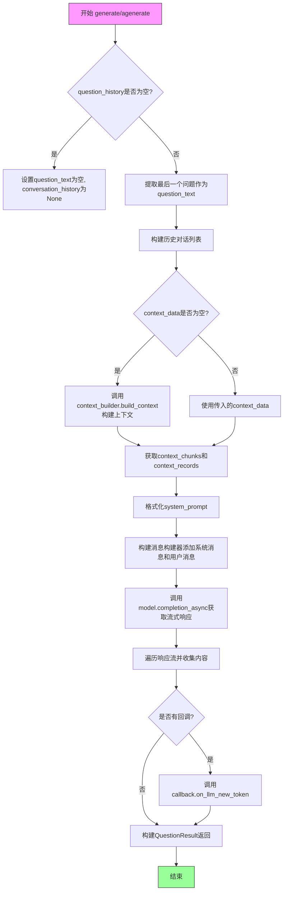

## 类结构

```
BaseQuestionGen (抽象基类)
└── LocalQuestionGen (本地问题生成实现)
    ├── 依赖: LocalContextBuilder
    ├── 依赖: Tokenizer
    └── 依赖: LLMCompletion
```

## 全局变量及字段


### `logger`
    
模块级日志记录器

类型：`logging.Logger`
    


### `LocalQuestionGen.model`
    
LLM模型实例

类型：`LLMCompletion`
    


### `LocalQuestionGen.context_builder`
    
上下文构建器

类型：`LocalContextBuilder`
    


### `LocalQuestionGen.tokenizer`
    
分词器

类型：`Tokenizer | None`
    


### `LocalQuestionGen.system_prompt`
    
系统提示词模板

类型：`str`
    


### `LocalQuestionGen.callbacks`
    
LLM回调列表

类型：`list[BaseLLMCallback]`
    


### `LocalQuestionGen.model_params`
    
模型参数

类型：`dict[str, Any] | None`
    


### `LocalQuestionGen.context_builder_params`
    
上下文构建参数

类型：`dict[str, Any] | None`
    
    

## 全局函数及方法


### `logging.getLogger`

获取与当前模块（`__name__`）关联的日志记录器实例，用于在代码中输出日志信息。

参数：

- `__name__`：`str`，Python 模块的特殊变量，表示当前模块的完全限定名称（如 `graphrag.query.question_gen.local`）

返回值：`logging.Logger`，返回一个日志记录器对象，可用于记录不同级别的日志信息（debug、info、warning、error、exception 等）

#### 流程图

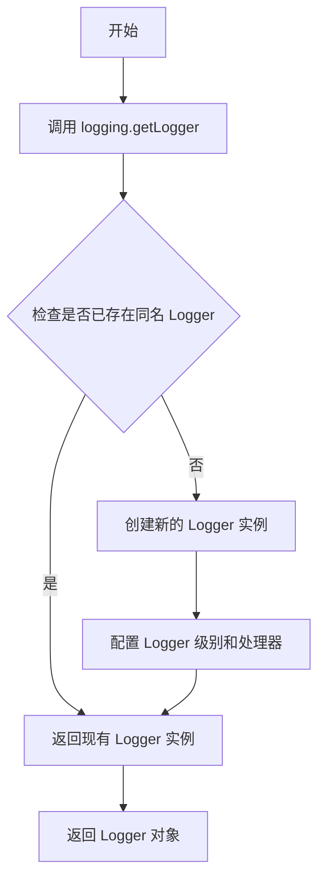

#### 带注释源码

```python
# 导入标准库 logging 模块
import logging

# 使用当前模块的 __name__ 获取日志记录器
# __name__ 是 Python 的内置变量，自动填充为当前模块的完全限定名称
# 例如：如果此文件是 graphrag/query/question_gen/local.py，则 __name__ 为 "graphrag.query.question_gen.local"
# logging.getLogger 会返回与该名称关联的 Logger 实例
# 如果已存在同名 Logger，则返回现有实例；否则创建新的 Logger
logger = logging.getLogger(__name__)
```


### `time.time`

获取当前时间的时间戳（Unix 时间戳，即自 1970 年 1 月 1 日以来的秒数）。在代码中用于计算 `LocalQuestionGen` 类的 `agenerate` 和 `generate` 方法的执行时间，以记录生成问题的完成时间。

参数：
- 无参数

返回值：`float`，返回自 Unix epoch（1970年1月1日 00:00:00 UTC）以来的秒数（浮点数），表示当前时间的时间戳。

#### 流程图

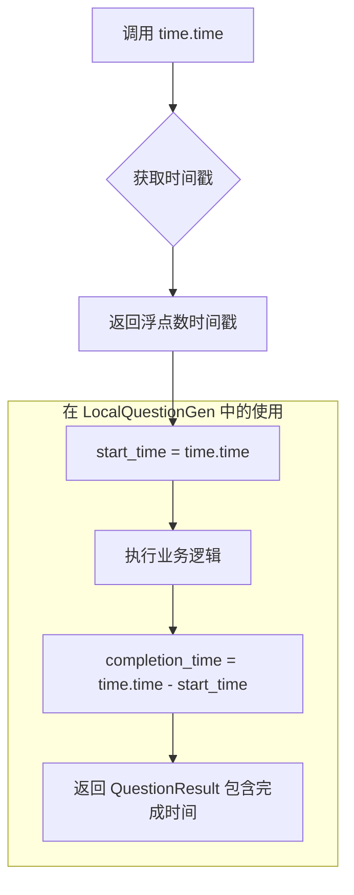

#### 带注释源码

```python
# time.time() 使用示例 - 位于 LocalQuestionGen 类中

# 1. 在 agenerate 方法开始时记录开始时间
start_time = time.time()  # 获取当前时间戳（浮点数），精确到秒

# ... 执行问题生成的业务逻辑 ...

# 2. 在成功返回时计算完成时间
return QuestionResult(
    response=response.split("\n"),
    context_data={
        "question_context": question_text,
        **context_records,
    },
    completion_time=time.time() - start_time,  # 结束时间减去开始时间 = 执行耗时（秒）
    llm_calls=1,
    prompt_tokens=self.tokenizer.num_tokens(system_prompt),
)

# 3. 在异常处理中也计算完成时间
except Exception:
    logger.exception("Exception in generating question")
    return QuestionResult(
        response=[],
        context_data=context_records,
        completion_time=time.time() - start_time,  # 即使发生异常，也记录已消耗的时间
        llm_calls=1,
        prompt_tokens=self.tokenizer.num_tokens(system_prompt),
    )

# 同样的模式也出现在 generate 方法中（第134行、第180行、第187行）
```


### `cast`

`cast` 是 Python `typing` 模块提供的类型转换函数，用于在类型检查阶段声明变量的类型。它不会在运行时执行任何类型检查或转换，仅作为类型提示供静态类型检查器（如 mypy）使用，帮助开发者明确变量的预期类型。

#### 使用实例

在 `LocalQuestionGen` 类中，共有两处使用 `cast`：

**实例 1：在 `agenerate` 方法中**

```python
result = cast(
    "ContextBuilderResult",
    self.context_builder.build_context(
        query=question_text,
        conversation_history=conversation_history,
        **kwargs,
        **self.context_builder_params,
    ),
)
context_data = cast("str", result.context_chunks)
```

**实例 2：在 `generate` 方法中**

```python
result = cast(
    "ContextBuilderResult",
    self.context_builder.build_context(
        query=question_text,
        conversation_history=conversation_history,
        **kwargs,
        **self.context_builder_params,
    ),
)
context_data = cast("str", result.context_chunks)
```

#### 参数

- `T`：类型字符串（Literal Type），目标类型（如 `"ContextBuilderResult"` 或 `"str"`）
- `x`：待转换的值（Any），需要进行类型声明的变量

#### 返回值

返回转换为目标类型的值，但实际为原值引用，仅用于类型声明。

#### 流程图

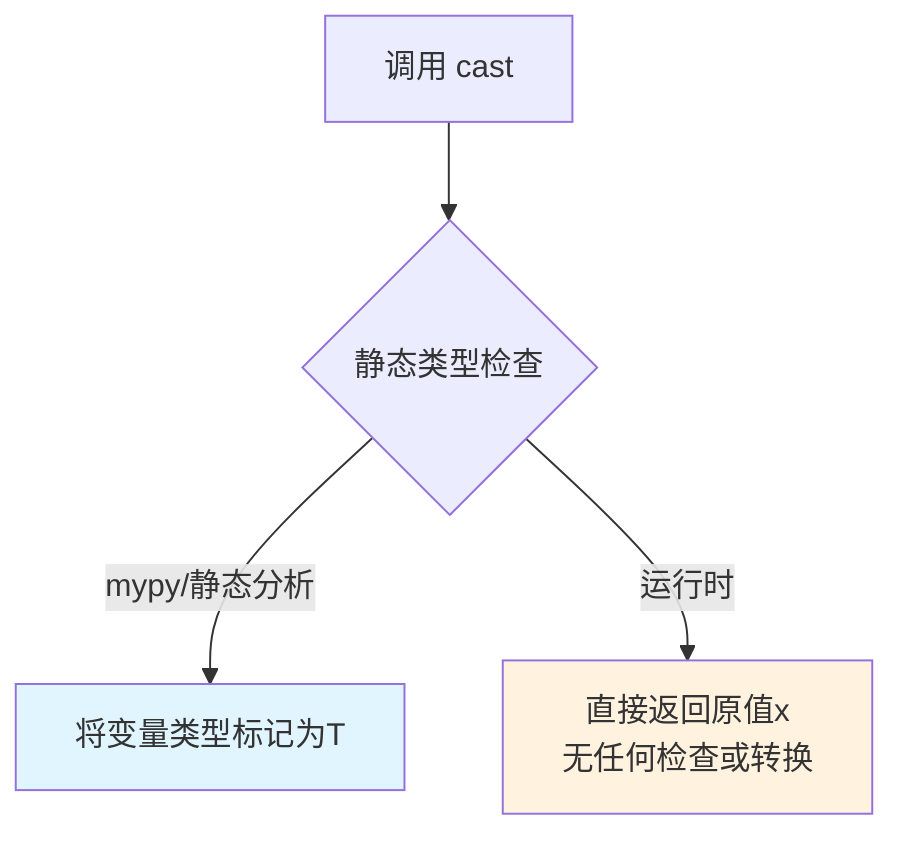

#### 带注释源码

```python
# cast 函数定义（来自 typing 模块）
# def cast(typ: Type[T], val: T | Any) -> T:
#     """Cast a value to the given type.
#     
#     This function is for type checking only. It has no runtime effect.
#     """
#     return val

# 在 LocalQuestionGen 中的实际使用：

# 第一次 cast：将 context_builder.build_context() 的返回值
# 显式声明为 ContextBuilderResult 类型
result = cast(
    "ContextBuilderResult",  # 目标类型：类型字符串
    self.context_builder.build_context(
        query=question_text,
        conversation_history=conversation_history,
        **kwargs,
        **self.context_builder_params,
    ),  # 源值：context_builder.build_context() 的返回值
)

# 第二次 cast：将 result.context_chunks 显式声明为 str 类型
context_data = cast("str", result.context_chunks)
```

#### 技术说明

| 属性 | 说明 |
|------|------|
| **来源模块** | `typing` |
| **运行时行为** | 无任何操作，仅返回原值 |
| **静态类型检查** | 告知类型检查器变量的预期类型 |
| **使用场景** | 当类型检查器无法推断出正确类型时，人工指定类型 |


# 分析结果

根据提供的代码，我注意到代码中并没有定义 `Tokenizer` 类，而是从 `graphrag_llm.tokenizer` 模块导入了 `Tokenizer` 类。该类在代码中是被使用的一方，而非定义的一方。

不过，我可以提供代码中关于 `Tokenizer` 的使用信息：

---

### `LocalQuestionGen.__init__` (tokenizer 参数使用)

#### 参数

- `tokenizer`：`Tokenizer | None`，分词器实例，用于对提示文本进行分词计数

#### 返回值

无（`__init__` 方法返回 `None`）

#### 流程图

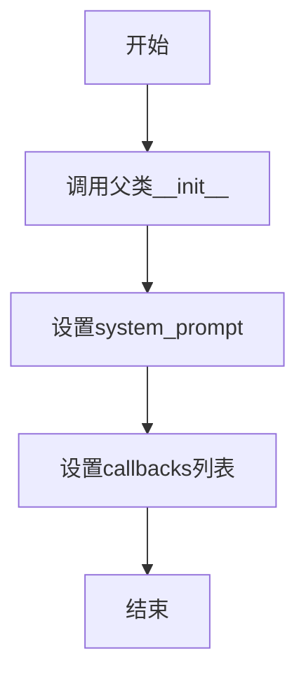

#### 带注释源码

```python
def __init__(
    self,
    model: "LLMCompletion",
    context_builder: LocalContextBuilder,
    tokenizer: Tokenizer | None = None,  # 分词器实例，用于计算token数量
    system_prompt: str = QUESTION_SYSTEM_PROMPT,
    callbacks: list[BaseLLMCallback] | None = None,
    model_params: dict[str, Any] | None = None,
    context_builder_params: dict[str, Any] | None = None,
):
    super().__init__(
        model=model,
        context_builder=context_builder,
        tokenizer=tokenizer,  # 传递给父类
        model_params=model_params,
        context_builder_params=context_builder_params,
    )
    self.system_prompt = system_prompt
    self.callbacks = callbacks or []
```

---

### `self.tokenizer.num_tokens()` 调用

#### 参数

- `system_prompt`：`str`，需要计算token数量的提示文本

#### 返回值

- `int`，token数量

#### 流程图

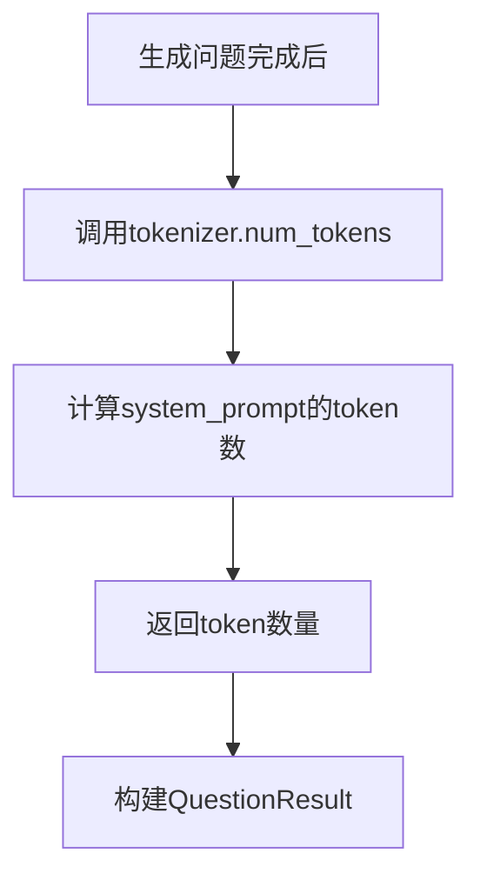

#### 带注释源码

```python
# 在agenerate和generate方法中
return QuestionResult(
    response=response.split("\n"),
    context_data={
        "question_context": question_text,
        **context_records,
    },
    completion_time=time.time() - start_time,
    llm_calls=1,
    prompt_tokens=self.tokenizer.num_tokens(system_prompt),  # 使用分词器计算token数量
)
```

---

## 重要说明

**Tokenizer 类本身并未在此代码文件中定义**，它是从外部模块 `graphrag_llm.tokenizer` 导入的。如需了解 `Tokenizer` 类的完整定义（包含字段和方法），需要查看 `graphrag_llm/tokenizer.py` 文件。

当前代码对 `Tokenizer` 的使用仅限于：
1. 在 `__init__` 中接收 `tokenizer` 参数
2. 调用 `self.tokenizer.num_tokens()` 方法计算提示文本的 token 数量


### `CompletionMessagesBuilder`

消息构建器（Message Builder）是一种流式 API，用于逐步构建 LLM 消息列表。它支持链式调用，通过 `add_system_message()` 和 `add_user_message()` 方法添加不同角色的消息，最后通过 `build()` 方法生成最终的消息列表。

#### 参数

此为类构造函数，参数如下：

- 无显式参数（使用默认构造函数）

#### 流程图

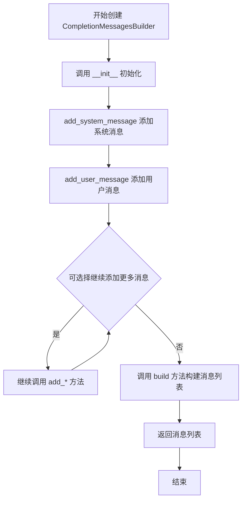

#### 带注释源码

```python
# 使用示例（在 LocalQuestionGen 类中）

# 1. 创建 CompletionMessagesBuilder 实例
messages_builder = (
    CompletionMessagesBuilder()  # 调用无参构造函数初始化构建器
    .add_system_message(system_prompt)  # 添加系统消息，返回 Self 支持链式调用
    .add_user_message(question_text)    # 添加用户消息，返回 Self 支持链式调用
)

# 2. 构建最终的消息列表
# messages_builder.build() 返回格式如下的列表：
# [
#     {"role": "system", "content": "<system_prompt 内容>"},
#     {"role": "user", "content": "<question_text 内容>"}
# ]

# 3. 将构建的消息传递给模型
response_stream = await self.model.completion_async(
    messages=messages_builder.build(),  # 获取构建好的消息列表
    stream=True,
    **self.model_params,
)
```

#### 推断的类接口

基于代码中的使用方式，推断的完整接口如下：

```python
class CompletionMessagesBuilder:
    """用于构建 LLM 消息列表的流式构建器"""
    
    def __init__(self) -> None:
        """初始化消息构建器"""
        self._messages: list[dict[str, str]] = []
    
    def add_system_message(self, content: str) -> "CompletionMessagesBuilder":
        """
        添加系统消息
        
        参数：
            - content: str，系统消息的内容
        
        返回：
            Self，返回自身以支持链式调用
        """
        self._messages.append({"role": "system", "content": content})
        return self
    
    def add_user_message(self, content: str) -> "CompletionMessagesBuilder":
        """
        添加用户消息
        
        参数：
            - content: str，用户消息的内容
        
        返回：
            Self，返回自身以支持链式调用
        """
        self._messages.append({"role": "user", "content": content})
        return self
    
    def build(self) -> list[dict[str, str]]:
        """
        构建并返回消息列表
        
        返回：
            list[dict[str, str]]，包含所有已添加消息的列表
        """
        return self._messages.copy()
```

#### 关键点说明

1. **流式 API 设计**：该类采用流式接口模式，允许链式调用 `add_system_message()` 和 `add_user_message()` 方法
2. **不可变性**：`build()` 方法返回列表的副本，避免外部修改内部状态
3. **消息角色支持**：当前实现支持 "system" 和 "user" 两种角色
4. **实际定义位置**：`CompletionMessagesBuilder` 类定义在 `graphrag_llm.utils` 模块中，当前文件通过 `from graphrag_llm.utils import CompletionMessagesBuilder` 导入使用


### `BaseLLMCallback`

BaseLLMCallback 是一个用于 LLM（大型语言模型）回调的抽象基类，定义了 LLM 调用过程中的回调接口，允许在生成过程中接收流式 token 等事件通知。该类在 LocalQuestionGen 中被使用，用于在流式响应过程中处理新的 token。

参数：

- 该类为抽象基类，具体参数需查看完整定义（当前代码中仅导入，未包含完整定义）

返回值：该类为抽象基类，具体返回值需查看完整定义

#### 流程图

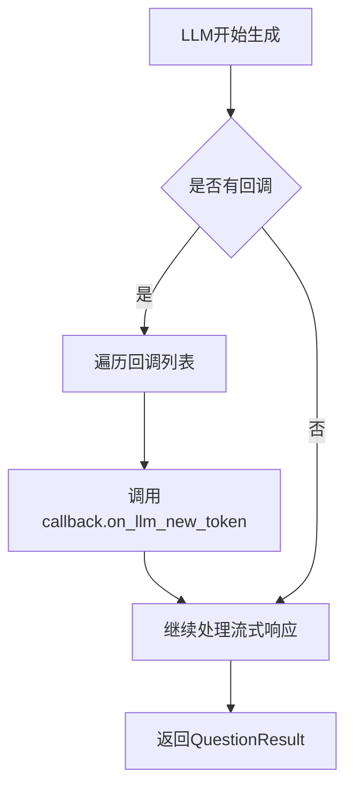

#### 带注释源码

```
# 从外部模块导入的抽象基类
# 完整定义不在当前代码文件中
from graphrag.callbacks.llm_callbacks import BaseLLMCallback

# 在LocalQuestionGen类中的使用方式：
class LocalQuestionGen(BaseQuestionGen):
    def __init__(
        self,
        model: "LLMCompletion",
        context_builder: LocalContextBuilder,
        tokenizer: Tokenizer | None = None,
        system_prompt: str = QUESTION_SYSTEM_PROMPT,
        callbacks: list[BaseLLMCallback] | None = None,  # 回调列表
        model_params: dict[str, Any] | None = None,
        context_builder_params: dict[str, Any] | None = None,
    ):
        # ...
        self.callbacks = callbacks or []

    # 在流式响应中使用回调
    async def agenerate(...):
        # ...
        async for chunk in response_stream:
            response_text = chunk.choices[0].delta.content or ""
            response += response_text
            for callback in self.callbacks:
                callback.on_llm_new_token(response_text)  # 调用回调方法
```

---

**注意**：提供的代码文件中仅包含 `BaseLLMCallback` 的导入和使用，并未包含该类的完整定义。该类的具体实现（包含所有抽象方法如 `on_llm_new_token` 的完整签名）位于 `graphrag.callbacks.llm_callbacks` 模块中。从代码使用方式可以推断：

- 该类是一个抽象基类（ABC）
- 至少包含一个方法：`on_llm_new_token(response_text: str)` - 用于处理流式响应中的新 token
- 设计目的是允许在 LLM 生成过程中插入自定义逻辑（如日志记录、实时显示等）


### `QUESTION_SYSTEM_PROMPT`

系统提示词常量，用于为本地问题生成任务提供指令模板。该常量定义在 `graphrag/prompts/query/question_gen_system_prompt.py` 模块中，包含用于指导大语言模型根据上下文数据生成问题的格式化字符串模板。

参数：无（作为常量导入，无需参数）

返回值：`str`，返回包含格式化占位符的系统提示词模板字符串

#### 流程图

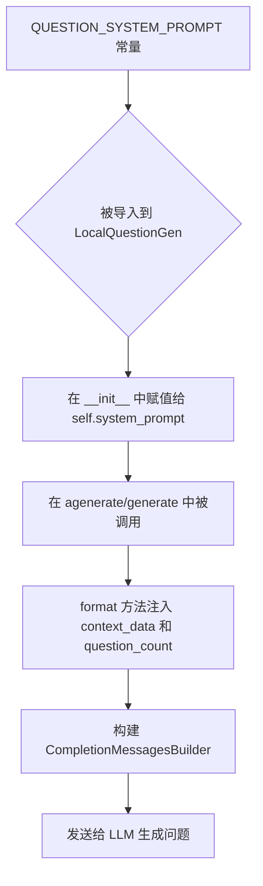

#### 带注释源码

```python
# 该常量在 graphrag/prompts/query/question_gen_system_prompt.py 中定义
# 通过以下方式导入到当前文件：
from graphrag.prompts.query.question_gen_system_prompt import QUESTION_SYSTEM_PROMPT

# 在 LocalQuestionGen 类的 __init__ 方法中作为默认参数使用：
def __init__(
    self,
    model: "LLMCompletion",
    context_builder: LocalContextBuilder,
    tokenizer: Tokenizer | None = None,
    system_prompt: str = QUESTION_SYSTEM_PROMPT,  # ← 默认使用该常量作为系统提示词
    callbacks: list[BaseLLMCallback] | None = None,
    model_params: dict[str, Any] | None = None,
    context_builder_params: dict[str, Any] | None = None,
):
    ...
    self.system_prompt = system_prompt  # ← 实例化时存储该提示词

# 在生成方法中通过 format 方法动态填充参数：
system_prompt = self.system_prompt.format(
    context_data=context_data,      # ← 上下文数据填充
    question_count=question_count   # ← 问题数量填充
)

# 完整的使用示例：
messages_builder = (
    CompletionMessagesBuilder()
    .add_system_message(system_prompt)  # ← 格式化后的提示词作为系统消息
    .add_user_message(question_text)
)
```

#### 补充说明

由于 `QUESTION_SYSTEM_PROMPT` 的实际源码未在提供的代码中展示，根据其使用方式可以推断：

1. **模板结构**：该常量是一个包含 `{context_data}` 和 `{question_count}` 占位符的字符串模板
2. **功能定位**：指导 LLM 根据提供的上下文数据生成指定数量的相关问题
3. **可定制性**：允许通过 `LocalQuestionGen` 的构造函数传入自定义的系统提示词，默认为 `QUESTION_SYSTEM_PROMPT`
4. **错误处理**：在 `agenerate` 和 `generate` 方法中都有 try-except 块捕获异常，确保即使生成失败也能返回默认的 `QuestionResult`


### `ContextBuilderResult`

`ContextBuilderResult` 是从 `graphrag.query.context_builder.builders` 模块导入的上下文构建结果对象，用于封装由 `LocalContextBuilder` 的 `build_context` 方法返回的上下文数据。该对象包含两个核心属性：`context_chunks`（上下文文本块，用于生成问题）和 `context_records`（上下文记录字典，包含原始上下文数据）。在 `LocalQuestionGen` 类中，通过调用 `context_builder.build_context()` 方法获取该结果，并将其用于后续的问题生成流程。

参数：

- 此函数/方法本身无直接参数，作为类型声明和返回值类型使用

返回值：`ContextBuilderResult`，包含上下文构建的结果数据

- `context_chunks`：`str` 类型，拼接后的上下文文本块，用于填充系统提示词模板
- `context_records`：`dict` 类型，原始上下文记录字典，用于传递到结果中保持数据溯源

#### 流程图

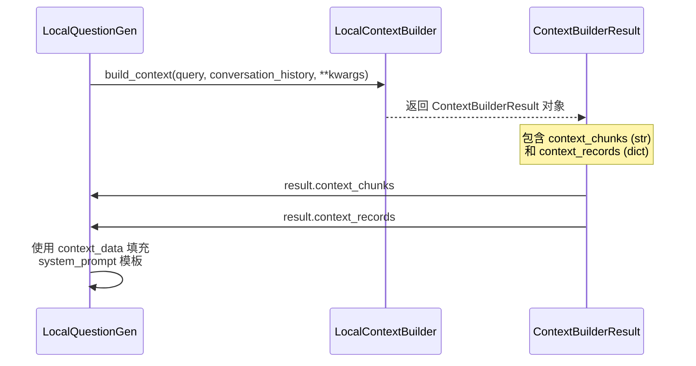

#### 带注释源码

```python
# 在 LocalQuestionGen.agenerate() 或 generate() 方法中：

if context_data is None:
    # 当未提供上下文数据时，通过 context_builder 构建上下文
    # cast() 用于类型断言，将 build_context 的返回值强转为 ContextBuilderResult 类型
    result = cast(
        "ContextBuilderResult",  # 目标类型：上下文构建结果类
        self.context_builder.build_context(  # 调用 LocalContextBuilder 的 build_context 方法
            query=question_text,               # 当前查询文本
            conversation_history=conversation_history,  # 会话历史记录
            **kwargs,                          # 其他动态参数
            **self.context_builder_params,     # 预配置的上下文构建参数
        ),
    )
    # 从结果中提取上下文文本块，转换为字符串
    context_data = cast("str", result.context_chunks)
    # 从结果中提取上下文记录字典
    context_records = result.context_records
else:
    # 如果已提供上下文数据，则直接使用
    context_records = {"context_data": context_data}

# 后续使用 context_data 填充 system_prompt 模板进行问题生成
```


# LocalContextBuilder 提取结果

### LocalContextBuilder.build_context

本方法为本地搜索模式下的上下文构建器，用于根据用户查询和对话历史构建检索上下文。

参数：

- `query`：`str`，用户当前查询字符串
- `conversation_history`：`ConversationHistory | None`，对话历史记录对象，包含之前的问答信息
- `**kwargs`：`Any`，其他可选参数，用于扩展上下文构建逻辑

返回值：`ContextBuilderResult`，包含构建后的上下文信息对象

#### 流程图

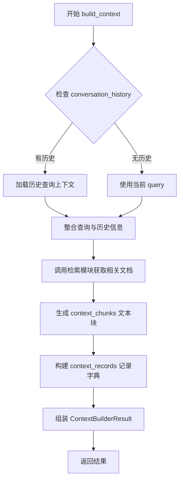

#### 带注释源码

```python
# 注意：以下为基于 LocalQuestionGen 中调用方式推断的 LocalContextBuilder 实现
# 实际定义位于 graphrag/query/context_builder/builders 模块

class LocalContextBuilder:
    """本地上下文构建器，用于为本地搜索生成查询上下文"""
    
    def build_context(
        self,
        query: str,
        conversation_history: "ConversationHistory | None" = None,
        **kwargs: Any
    ) -> "ContextBuilderResult":
        """
        根据查询和对话历史构建上下文
        
        参数:
            query: 当前用户查询字符串
            conversation_history: 可选的对话历史对象
            **kwargs: 额外的构建参数
        
        返回:
            ContextBuilderResult: 包含上下文块和记录的构建结果
        """
        # 1. 处理对话历史，提取之前的查询信息
        historical_queries = []
        if conversation_history is not None:
            historical_queries = conversation_history.queries
        
        # 2. 组合当前查询与历史查询，构建增强查询
        enhanced_query = self._build_enhanced_query(query, historical_queries)
        
        # 3. 调用检索模块获取相关文档/上下文
        retrieved_docs = self._retrieve_context(enhanced_query, **kwargs)
        
        # 4. 生成上下文文本块
        context_chunks = self._format_context_chunks(retrieved_docs)
        
        # 5. 构建上下文记录
        context_records = {
            "query": query,
            "enhanced_query": enhanced_query,
            "retrieved_documents": retrieved_docs
        }
        
        # 6. 返回结果对象
        return ContextBuilderResult(
            context_chunks=context_chunks,
            context_records=context_records
        )
    
    def _build_enhanced_query(
        self, 
        query: str, 
        historical_queries: list[str]
    ) -> str:
        """构建增强查询，结合历史上下文"""
        # 简化实现：直接返回原始查询
        # 实际可能包含历史查询拼接、关键词扩展等逻辑
        return query
    
    def _retrieve_context(
        self, 
        query: str, 
        **kwargs: Any
    ) -> list[Any]:
        """检索相关文档/上下文"""
        # 由具体子类实现或依赖注入的检索器
        return []
    
    def _format_context_chunks(
        self, 
        documents: list[Any]
    ) -> str:
        """格式化上下文块为字符串"""
        # 将文档格式化为文本块
        return "\n\n".join(str(doc) for doc in documents)


# 在 LocalQuestionGen 中的调用示例：
"""
result = cast(
    "ContextBuilderResult",
    self.context_builder.build_context(
        query=question_text,
        conversation_history=conversation_history,
        **kwargs,
        **self.context_builder_params,
    ),
)
context_data = cast("str", result.context_chunks)
context_records = result.context_records
"""
```

---

## 补充说明

### 在 LocalQuestionGen 中的使用方式

从提供的代码中可以看到，`LocalContextBuilder` 被用作 `LocalQuestionGen` 类的核心组件：

1. **初始化注入**：在 `LocalQuestionGen.__init__` 中通过 `context_builder: LocalContextBuilder` 参数传入
2. **调用时机**：在 `agenerate` 和 `generate` 方法中，当 `context_data` 为 `None` 时自动调用
3. **返回值使用**：
   - `result.context_chunks` → 作为 LLM 生成的上下文输入
   - `result.context_records` → 作为结果的一部分返回

### 潜在优化空间

- **代码重复**：`agenerate` 和 `generate` 方法存在大量重复代码，可提取公共逻辑
- **错误处理**：异常捕获后返回空结果，但未区分不同类型的错误
- **上下文构建**：当前实现假设 `LocalContextBuilder` 总是同步方法，但实际场景可能需要异步支持


### `ConversationHistory`

对话历史类（ConversationHistory）是用于构建和管理对话历史的组件，它将用户查询列表转换为对话历史对象，以便于上下文构建器使用。

参数：

- `history`：`list[dict[str, str]]`，包含对话历史记录的列表，每个元素为包含 "role" 和 "content" 键的字典

返回值：`ConversationHistory`，返回构建的对话历史对象

#### 流程图

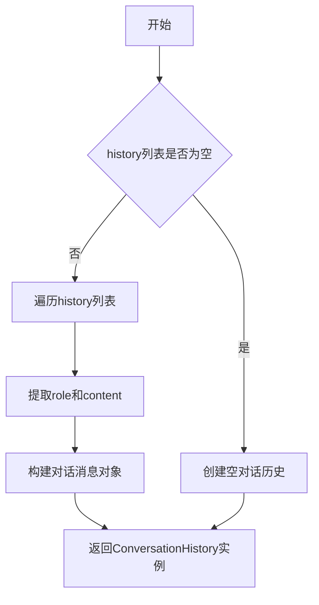

#### 带注释源码

```python
# 从导入语句可以看到ConversationHistory来自graphrag.query.context_builder.conversation_history模块
from graphrag.query.context_builder.conversation_history import (
    ConversationHistory,
)

# 在LocalQuestionGen类中的使用方式：

# 当question_history不为空时
question_text = question_history[-1]  # 获取最新问题
history = [
    {"role": "user", "content": query} for query in question_history[:-1]
]  # 构建历史消息列表，只保留user角色的问题
conversation_history = ConversationHistory.from_list(history)  # 从列表创建对话历史对象

# 将对话历史传递给上下文构建器
result = self.context_builder.build_context(
    query=question_text,
    conversation_history=conversation_history,  # 传入对话历史用于构建上下文
    **kwargs,
    **self.context_builder_params,
)
```

#### 补充说明

由于 `ConversationHistory` 类的完整源代码不在当前文件中，而是通过导入语句从 `graphrag/query/context_builder/conversation_history.py` 引入，因此无法提供该类的完整实现源码。从代码使用方式可以推断：

1. **核心方法**：`from_list` - 这是一个类方法，用于从列表创建对话历史对象
2. **用途**：将用户问题历史转换为对话历史格式，供 `LocalContextBuilder` 构建上下文使用
3. **设计目的**：支持多轮对话场景，让LLM能够理解之前的对话内容

如需查看 `ConversationHistory` 类的完整实现，请参考源文件 `graphrag/query/context_builder/conversation_history.py`。


### `QuestionResult`

QuestionResult 是一个问题结果数据类，用于封装问题生成任务的结果数据，包含生成的响应内容、上下文数据、完成时间、LLM调用次数和提示词令牌数等信息。

参数：

- `response`：`list[str]`，生成的响应内容列表，通常是将LLM返回的文本按换行符分割后的结果
- `context_data`：`dict[str, Any]`，上下文数据字典，包含问题上下文（question_context）和上下文记录（context_records）
- `completion_time`：`float`，完成整个生成任务所花费的时间（秒）
- `llm_calls`：`int`，LLM调用的次数
- `prompt_tokens`：`int`，提示词的令牌数量

返回值：`QuestionResult`，返回封装了问题生成结果的数据类实例

#### 流程图

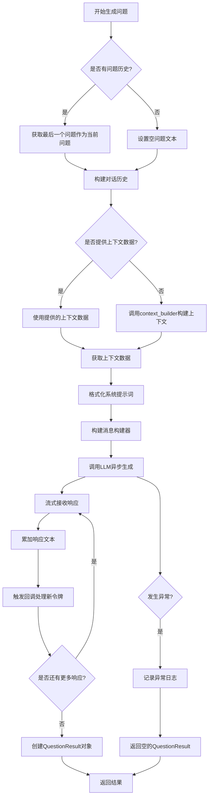

#### 带注释源码

```python
# QuestionResult 数据类的使用示例（位于 LocalQuestionGen 类中）

# 成功情况下的返回值创建
return QuestionResult(
    response=response.split("\n"),  # 将LLM返回的响应按换行符分割成列表
    context_data={
        "question_context": question_text,  # 当前问题文本作为问题上下文
        **context_records,  # 展开上下文记录字典
    },
    completion_time=time.time() - start_time,  # 计算从开始到当前的耗时
    llm_calls=1,  # 本次操作进行了1次LLM调用
    prompt_tokens=self.tokenizer.num_tokens(system_prompt),  # 计算系统提示词的令牌数
)

# 异常情况下的返回值创建
return QuestionResult(
    response=[],  # 异常时返回空列表
    context_data=context_records,  # 保留上下文记录
    completion_time=time.time() - start_time,  # 仍记录耗时
    llm_calls=1,  # 记录LLM调用次数
    prompt_tokens=self.tokenizer.num_tokens(system_prompt),  # 记录提示词令牌数
)
```


### `LocalQuestionGen.__init__`

初始化 LocalQuestionGen 类的实例，用于本地问题生成场景。该方法继承自 BaseQuestionGen，配置 LLM 模型、本地上下文构建器、分词器、系统提示词和回调函数等核心组件，为后续的问题生成操作做好准备。

参数：

-  `model`：`LLMCompletion`，执行问题生成的 LLM 模型实例
-  `context_builder`：`LocalContextBuilder`，用于构建查询上下文的本地上下文构建器
-  `tokenizer`：`Tokenizer | None`，可选的分词器，用于计算 token 数量，默认为 None
-  `system_prompt`：`str`，系统提示词模板，默认为 QUESTION_SYSTEM_PROMPT
-  `callbacks`：`list[BaseLLMCallback] | None`，可选的 LLM 回调函数列表，用于处理流式输出，默认为 None
-  `model_params`：`dict[str, Any] | None`，可选的模型参数配置，默认为 None
-  `context_builder_params`：`dict[str, Any] | None`，可选的上下文构建器参数配置，默认为 None

返回值：`None`，__init__ 方法不返回值，仅进行对象初始化

#### 流程图

```mermaid
flowchart TD
    A[开始初始化 LocalQuestionGen] --> B[调用父类 BaseQuestionGen.__init__]
    B --> C[传入 model 参数]
    B --> D[传入 context_builder 参数]
    B --> E[传入 tokenizer 参数]
    B --> F[传入 model_params 参数]
    B --> G[传入 context_builder_params 参数]
    C --> H[设置 system_prompt 实例变量]
    D --> H
    E --> H
    F --> H
    G --> H
    H --> I{callbacks 参数是否为 None}
    I -->|是| J[使用空列表 [] 作为默认值]
    I -->|否| K[使用传入的 callbacks 列表]
    J --> L[设置 self.callbacks]
    K --> L
    L --> M[初始化完成]
```

#### 带注释源码

```python
def __init__(
    self,
    model: "LLMCompletion",
    context_builder: LocalContextBuilder,
    tokenizer: Tokenizer | None = None,
    system_prompt: str = QUESTION_SYSTEM_PROMPT,
    callbacks: list[BaseLLMCallback] | None = None,
    model_params: dict[str, Any] | None = None,
    context_builder_params: dict[str, Any] | None = None,
):
    """
    初始化 LocalQuestionGen 实例。
    
    参数:
        model: LLM 模型实例，用于生成问题
        context_builder: 本地上下文构建器，用于构建查询上下文
        tokenizer: 可选的分词器，用于计算 token 数量
        system_prompt: 系统提示词模板，默认使用 QUESTION_SYSTEM_PROMPT
        callbacks: 可选的 LLM 回调列表，用于流式输出处理
        model_params: 可选的模型参数字典
        context_builder_params: 可选的上下文构建器参数字典
    """
    # 调用父类 BaseQuestionGen 的初始化方法
    # 父类负责初始化基础组件：model, context_builder, tokenizer, model_params, context_builder_params
    super().__init__(
        model=model,
        context_builder=context_builder,
        tokenizer=tokenizer,
        model_params=model_params,
        context_builder_params=context_builder_params,
    )
    # 设置系统提示词实例变量
    self.system_prompt = system_prompt
    # 初始化回调列表，如果未提供则使用空列表
    # 回调用于在 LLM 流式输出时处理每个新的 token
    self.callbacks = callbacks or []
```


### `LocalQuestionGen.agenerate`

基于问题历史和上下文数据生成新问题的异步方法，通过本地上下文构建器获取上下文信息，并调用大语言模型生成问题。

参数：

- `question_history`：`list[str]`，用户提问的历史记录列表
- `context_data`：`str | None`，可选的上下文数据，若为 None 则由 LocalContextBuilder 自动构建
- `question_count`：`int`，需要生成的问题数量
- `**kwargs`：任意关键字参数，用于传递给上下文构建器

返回值：`QuestionResult`，包含生成的问题列表、上下文数据、耗时、LLM 调用次数和提示词 token 数量

#### 流程图

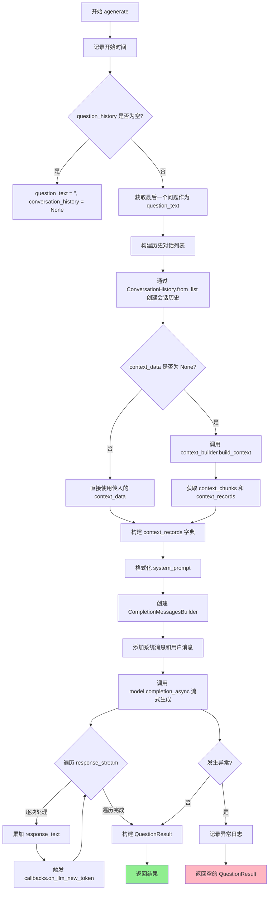

#### 带注释源码

```python
async def agenerate(
    self,
    question_history: list[str],
    context_data: str | None,
    question_count: int,
    **kwargs,
) -> QuestionResult:
    """
    Generate a question based on the question history and context data.

    If context data is not provided, it will be generated by the local context builder
    """
    # 记录方法开始执行的时间，用于后续计算耗时
    start_time = time.time()

    # 判断是否有问题历史记录
    if len(question_history) == 0:
        # 无历史记录时，设置空问题文本和空会话历史
        question_text = ""
        conversation_history = None
    else:
        # 有历史记录时，取最后一个问题作为当前查询
        question_text = question_history[-1]
        # 将前面的问题历史转换为消息格式列表
        history = [
            {"role": "user", "content": query} for query in question_history[:-1]
        ]
        # 从历史列表构建会话历史对象
        conversation_history = ConversationHistory.from_list(history)

    # 如果未提供上下文数据，则通过上下文构建器动态生成
    if context_data is None:
        # generate context data based on the question history
        result = cast(
            "ContextBuilderResult",
            self.context_builder.build_context(
                query=question_text,
                conversation_history=conversation_history,
                **kwargs,
                **self.context_builder_params,
            ),
        )
        # 从构建结果中提取上下文文本块和上下文记录
        context_data = cast("str", result.context_chunks)
        context_records = result.context_records
    else:
        # 使用传入的上下文数据，包装为字典格式
        context_records = {"context_data": context_data}
    
    # 调试日志：记录生成问题的起始时间和最后的问题
    logger.debug(
        "GENERATE QUESTION: %s. LAST QUESTION: %s", start_time, question_text
    )
    
    # 初始化 system_prompt 为空字符串，用于异常时的默认值
    system_prompt = ""
    try:
        # 格式化系统提示词，注入上下文数据和问题数量
        system_prompt = self.system_prompt.format(
            context_data=context_data, question_count=question_count
        )

        # 构建消息序列：系统消息 + 用户消息
        messages_builder = (
            CompletionMessagesBuilder()
            .add_system_message(system_prompt)
            .add_user_message(question_text)
        )

        # 初始化响应字符串，用于累积流式返回的内容
        response = ""

        # 调用大语言模型的异步流式补全接口
        response_stream: AsyncIterator[
            LLMCompletionChunk
        ] = await self.model.completion_async(
            messages=messages_builder.build(),
            stream=True,
            **self.model_params,
        )  # type: ignore

        # 异步迭代流式响应，逐块处理返回的内容
        async for chunk in response_stream:
            # 提取当前块中的内容，若为空则默认为空字符串
            response_text = chunk.choices[0].delta.content or ""
            # 累加到完整响应中
            response += response_text
            # 遍历所有回调，通知每个回调有新的 token 生成
            for callback in self.callbacks:
                callback.on_llm_new_token(response_text)

        # 构建并返回成功的问题生成结果
        return QuestionResult(
            # 将响应按换行符分割为问题列表
            response=response.split("\n"),
            # 包含问题上下文和原始上下文记录的上下文数据
            context_data={
                "question_context": question_text,
                **context_records,
            },
            # 计算整个过程的耗时
            completion_time=time.time() - start_time,
            # 记录 LLM 调用的次数
            llm_calls=1,
            # 计算并记录提示词的 token 数量
            prompt_tokens=self.tokenizer.num_tokens(system_prompt),
        )

    except Exception:
        # 捕获异常并记录详细的异常堆栈信息
        logger.exception("Exception in generating question")
        # 返回空的 QuestionResult，保留上下文记录和耗时信息
        return QuestionResult(
            response=[],
            context_data=context_records,
            completion_time=time.time() - start_time,
            llm_calls=1,
            prompt_tokens=self.tokenizer.num_tokens(system_prompt),
        )
```


### `LocalQuestionGen.generate`

该方法是一个基于问题历史和上下文数据生成新问题的同步方法。它首先检查是否存在问题历史，若存在则构造当前查询和会话历史；若未提供上下文数据，则通过本地上下文构建器基于问题历史生成上下文数据。随后使用LLM模型流式生成问题，并通过回调函数处理每个token，最后返回包含生成问题、上下文数据、完成时间和token使用情况的QuestionResult对象。

参数：

- `question_history`：`list[str]`，问题历史列表，用于参考之前的问题来生成新问题
- `context_data`：`str | None`，可选的上下文数据，若为None则由context_builder生成
- `question_count`：`int`，要生成的问题数量
- `**kwargs`：其他关键字参数，会传递给context_builder

返回值：`QuestionResult`，包含生成的问题列表、上下文数据、完成时间、LLM调用次数和prompt的token数量

#### 流程图

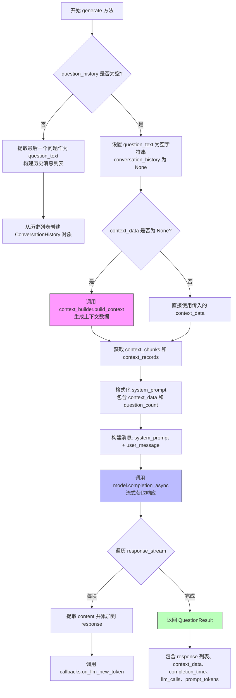

#### 带注释源码

```python
async def generate(
    self,
    question_history: list[str],
    context_data: str | None,
    question_count: int,
    **kwargs,
) -> QuestionResult:
    """
    Generate a question based on the question history and context data.

    If context data is not provided, it will be generated by the local context builder
    """
    # 记录开始时间用于计算执行耗时
    start_time = time.time()
    
    # 判断是否有问题历史
    if len(question_history) == 0:
        # 无历史时，设置空问题文本和空会话历史
        question_text = ""
        conversation_history = None
    else:
        # 有历史时，提取最后一个问题作为当前问题
        question_text = question_history[-1]
        
        # 将历史问题列表转换为消息格式 [{"role": "user", "content": query}, ...]
        history = [
            {"role": "user", "content": query} for query in question_history[:-1]
        ]
        # 从历史列表创建会话历史对象
        conversation_history = ConversationHistory.from_list(history)

    # 如果未提供上下文数据，则通过context_builder生成
    if context_data is None:
        # generate context data based on the question history
        # 调用本地上下文构建器构建上下文
        result = cast(
            "ContextBuilderResult",
            self.context_builder.build_context(
                query=question_text,
                conversation_history=conversation_history,
                **kwargs,
                **self.context_builder_params,
            ),
        )
        # 从构建结果中提取上下文文本和上下文记录
        context_data = cast("str", result.context_chunks)
        context_records = result.context_records
    else:
        # 如果已提供上下文数据，直接包装为字典
        context_records = {"context_data": context_data}
    
    # 记录调试日志
    logger.debug(
        "GENERATE QUESTION: %s. QUESTION HISTORY: %s", start_time, question_text
    )
    
    # 初始化system_prompt为空字符串
    system_prompt = ""
    try:
        # 格式化系统提示词，注入上下文数据和期望生成的问题数量
        system_prompt = self.system_prompt.format(
            context_data=context_data, question_count=question_count
        )

        # 构建消息构建器，添加系统消息和用户消息
        messages_builder = (
            CompletionMessagesBuilder()
            .add_system_message(system_prompt)
            .add_user_message(question_text)
        )

        # 初始化响应字符串
        response = ""

        # 异步调用LLM模型进行流式completion
        response_stream: AsyncIterator[
            LLMCompletionChunk
        ] = await self.model.completion_async(
            messages=messages_builder.build(),
            stream=True,
            **self.model_params,
        )  # type: ignore

        # 遍历流式响应，处理每个chunk
        async for chunk in response_stream:
            # 提取chunk中的内容文本
            response_text = chunk.choices[0].delta.content or ""
            # 累加到响应字符串
            response += response_text
            # 触发每个回调的on_llm_new_token事件
            for callback in self.callbacks:
                callback.on_llm_new_token(response_text)

        # 成功时返回QuestionResult，包含按行分割的响应、上下文数据、耗时等
        return QuestionResult(
            response=response.split("\n"),
            context_data={
                "question_context": question_text,
                **context_records,
            },
            completion_time=time.time() - start_time,
            llm_calls=1,
            prompt_tokens=self.tokenizer.num_tokens(system_prompt),
        )

    except Exception:
        # 异常处理：记录异常日志，返回空的QuestionResult
        logger.exception("Exception in generating questions")
        return QuestionResult(
            response=[],
            context_data=context_records,
            completion_time=time.time() - start_time,
            llm_calls=1,
            prompt_tokens=self.tokenizer.num_tokens(system_prompt),
        )
```

## 关键组件


### LocalQuestionGen 类

本地问题生成器，负责根据问题历史和上下文数据生成新问题。继承自 BaseQuestionGen，提供异步和同步两种生成方法。

### 问题历史处理 (question_history)

处理用户提问历史，构建当前查询和对话历史，用于生成更加连贯的后续问题。

### 上下文构建 (LocalContextBuilder)

使用 LocalContextBuilder 根据问题文本和对话历史构建上下文数据，支持惰性加载和按需生成上下文。

### LLM 调用与流式响应

通过 model.completion_async 异步调用 LLM，支持流式输出 (stream=True)，逐块获取生成内容。

### 回调机制 (BaseLLMCallback)

使用回调函数处理 LLM 生成的每个新 token，支持流式输出的实时处理和中间结果处理。

### 对话历史管理 (ConversationHistory)

将问题历史转换为对话历史格式，供上下文构建器使用，支持多轮对话上下文维护。

### 消息构建 (CompletionMessagesBuilder)

使用 CompletionMessagesBuilder 构建符合 LLM 要求的系统消息和用户消息格式。

### 异常处理与降级设计

捕获 LLM 调用异常，返回空结果并保留上下文数据和计时信息，确保系统稳定性。

### 系统提示词格式化

动态格式化系统提示词，注入上下文数据和生成问题数量，支持可配置的提示词模板。


## 问题及建议


### 已知问题

- **代码重复**：类中包含两个几乎完全相同的方法 `agenerate` 和 `generate`，两者除了方法名外实现逻辑完全一致，造成代码冗余，维护成本高
- **日志格式字符串错误**：`agenerate` 方法中 `logger.debug("GENERATE QUESTION: %s. LAST QUESTION: %s", start_time, question_text)` 和 `generate` 方法中 `logger.debug("GENERATE QUESTION: %s. QUESTION HISTORY: %s", start_time, question_text)` 的格式说明符与传入的参数不匹配（`start_time` 是时间戳，不应作为日志消息的一部分），且消息内容与实际逻辑不符
- **空字符串初始化**：`system_prompt = ""` 在 try 块前初始化为空字符串，但在 except 块中使用时已被修改，这种模式容易造成混淆
- **异常处理过于宽泛**：捕获所有 `Exception` 类型并返回空结果，无法区分不同类型的错误，可能隐藏潜在的严重问题
- **类型转换过度使用**：多处使用 `cast()` 进行类型转换，表明类型设计可能存在问题或对类型系统理解不足

### 优化建议

- **提取公共逻辑**：将 `agenerate` 和 `generate` 中的共同逻辑提取到一个私有方法 `_build_context_and_history` 中，两个公共方法只需调用该方法即可，减少代码重复
- **修复日志调用**：修正日志格式字符串，使用更清晰的日志消息，如 `logger.debug("Generating question, history length: %d", len(question_history))`
- **改进错误处理**：为不同类型的异常定义特定的错误处理逻辑，或使用自定义异常类；考虑在异常情况下抛出错误而非仅返回空结果
- **优化类型设计**：重新审视并修正类型定义，减少对 `cast()` 的依赖，使用泛型或协议来改进类型安全
- **考虑移除冗余方法**：评估 `generate` 方法是否真正需要，如果仅用于同步调用场景，可考虑统一使用异步接口并提供适配器

## 其它


### 设计目标与约束

本模块的核心设计目标是实现本地场景下的自动问题生成功能，通过结合对话历史和上下文数据，利用大语言模型生成相关问题。约束条件包括：必须继承BaseQuestionGen基类、必须支持同步和异步两种调用方式、必须通过回调机制实现流式输出的处理、context_data为可选参数若未提供则由LocalContextBuilder自动构建。

### 错误处理与异常设计

模块采用try-except捕获所有Exception异常，记录完整堆栈信息后返回空的QuestionResult对象。异常处理要点包括：LLM调用失败时返回空响应但保留context_records和计时信息、系统prompt格式化失败时system_prompt为空字符串、tokenizer.tokenizer可能为None时的处理（虽然当前代码未做防御）。建议改进：区分不同异常类型进行针对性处理、添加重试机制、定义自定义异常类。

### 数据流与状态机

数据流主要包括三条路径：路径一（提供context_data）→ 接收外部context_data → 构建ConversationHistory → 格式化system_prompt → 调用LLM生成 → 处理流式响应 → 返回结果；路径二（未提供context_data）→ 调用LocalContextBuilder.build_context() → 获取context_chunks和context_records → 格式化system_prompt → 调用LLM生成 → 处理流式响应 → 返回结果。状态机涉及：空闲状态、上下文构建状态、LLM调用状态、流式输出状态、完成状态。

### 外部依赖与接口契约

主要外部依赖包括：LLMCompletion接口（必须实现completion_async方法接受messages和stream参数）、Tokenizer接口（必须实现num_tokens方法）、LocalContextBuilder接口（必须实现build_context方法）、BaseLLMCallback抽象类（必须实现on_llm_new_token方法）、ConversationHistory类（必须实现from_list静态方法）。接口契约：model.completion_async返回AsyncIterator[LLMCompletionChunk]、context_builder.build_context返回ContextBuilderResult、QuestionResult为命名元组包含response/context_data/completion_time/llm_calls/prompt_tokens字段。

### 性能考虑

性能优化点：异步流式处理减少等待时间、token计数用于配额管理、start_time计时用于性能监控。潜在瓶颈：LLM调用延迟（取决于模型响应速度）、context_data构建时间（取决于数据规模）、回调处理阻塞（如果回调操作耗时）。建议添加：超时控制、并发限制、缓存机制。

### 安全性考虑

当前代码未包含敏感数据处理的安全措施。需要考虑：LLM输出内容的过滤和验证、用户输入的消毒处理、API密钥和凭证的安全存储、prompt注入攻击的防护、敏感信息在日志中的脱敏处理。

### 配置与参数说明

model参数：LLMCompletion实例，必填，用于调用大语言模型；context_builder参数：LocalContextBuilder实例，必填，用于构建查询上下文；tokenizer参数：Tokenizer实例，可选，默认为None，用于计算token数量；system_prompt参数：字符串，可选，默认为QUESTION_SYSTEM_PROMPT模板；callbacks参数：BaseLLMCallback列表，可选，默认为空列表，用于流式输出回调；model_params参数：字典，可选，默认为None，传给LLM的额外参数；context_builder_params参数：字典，可选，默认为None，传给context_builder的额外参数。

### 使用示例

```python
# 基本用法
question_gen = LocalQuestionGen(
    model=llm_model,
    context_builder=local_context_builder,
    tokenizer=tokenizer
)

# 同步调用
result = await question_gen.generate(
    question_history=["第一个问题", "第二个问题"],
    context_data=None,
    question_count=3
)

# 异步流式调用
result = await question_gen.agenerate(
    question_history=["问题1"],
    context_data="相关上下文内容",
    question_count=5
)
```

### 限制与边界情况

边界情况处理：question_history为空列表时question_text为空字符串conversation_history为None；context_data为None时自动调用context_builder构建；LLM返回空响应时response.split("\n")返回空列表；tokenizer为None时调用num_tokens可能报错（当前代码假设tokenizer已初始化）。限制：依赖外部LLM服务可用性、context_data大小受token限制、问题数量受question_count参数控制。

### 并发与异步处理

模块支持异步调用（agenerate方法）和同步调用（generate方法）两种模式。异步处理使用async for遍历流式响应，每个chunk立即触发回调处理。需要注意：多个并发调用时需要确保线程安全、回调函数应该是非阻塞的、应该添加并发数量限制。

### 日志与监控

日志记录点：debug级别记录生成开始和最后问题、exception级别记录生成过程中的异常。监控指标：completion_time（完成耗时）、llm_calls（LLM调用次数）、prompt_tokens（消耗的token数）。建议添加：更细粒度的性能指标、调用成功/失败率的统计、token消耗的聚合统计。

### 测试策略

单元测试要点：测试空question_history处理、测试context_data为None时的构建逻辑、测试异常情况下的返回结果、测试tokenizer为None的行为。集成测试要点：测试与LLM的完整交互、测试与LocalContextBuilder的集成、测试回调机制的正确性。模拟测试：模拟LLM返回不同响应格式、模拟context_builder返回异常。

### 版本兼容性

依赖版本要求：Python 3.10+（使用match/case语法潜力）、graphrag_llm模块需实现Tokenizer和CompletionMessagesBuilder、graphrag包需包含相关提示词和上下文构建器。向后兼容性：system_prompt参数支持自定义模板、model_params和context_builder_params支持传额外参数、kwargs支持传递给context_builder。


    