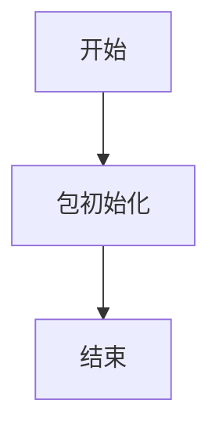

# `graphrag\packages\graphrag\graphrag\query\structured_search\__init__.py` 详细设计文档

这是Structured Search包的初始化文件，仅包含版权声明和包的基本描述，无实际实现代码。

## 整体流程



## 类结构

```
无类层次结构（代码中未定义任何类）
```

## 全局变量及字段


    

## 全局函数及方法


## 关键组件


# Structured Search 包详细设计文档

## 1. 一段话描述

该代码为一个名为"Structured Search"的结构化搜索包的初始化文件，目前仅包含版权信息和基本的包描述，尚未实现具体的搜索功能模块。

## 2. 文件的整体运行流程

由于当前代码仅包含包声明和文档字符串，该模块在导入时仅完成命名空间的初始化，不执行任何实质性的运行逻辑。

## 3. 类的详细信息

当前代码中不存在任何类定义。

## 4. 关键组件信息

### Structured Search 包

结构化搜索包的根模块，当前处于初始化状态，等待后续功能模块的填充实现。

## 5. 潜在的技术债务或优化空间

由于代码目前仅有基础的模块声明，尚未建立任何功能实现，因此不存在技术债务但也缺乏任何功能实现。

## 6. 其它项目

### 设计目标与约束

- **设计目标**：构建一个结构化搜索功能包
- **约束**：遵循MIT开源许可证协议

### 错误处理与异常设计

当前无错误处理机制

### 数据流与状态机

当前无数据流设计

### 外部依赖与接口契约

当前无外部依赖和接口定义


## 问题及建议


### 已知问题

-   **空包实现**：当前代码仅包含版权声明和包级别的文档字符串，缺少实际的模块实现代码，无法提供任何功能
-   **缺少入口文件**：未发现 `__init__.py` 文件或该文件为空，模块无法被正确导入使用
-   **缺乏公共 API**：未定义任何可供外部调用的函数、类或接口
-   **功能范围不明确**：包名为 "Structured Search"（结构化搜索），但代码中无任何相关实现逻辑或设计说明
-   **文档不完整**：缺少使用示例、API 文档或 README 文件

### 优化建议

-   **完善模块实现**：根据包名 "Structured Search" 添加结构化搜索的核心功能实现，如搜索索引构建、查询解析、结果排序等模块
-   **定义公共接口**：使用 `__all__` 显式导出公共 API，包括主要类和函数
-   **添加类型注解**：为所有公共方法添加完整的类型提示（Type Hints），提升代码可维护性和 IDE 支持
-   **补充文档字符串**：为每个模块、类和函数添加详细的文档字符串（Docstring），包括参数、返回值和异常说明
-   **设计模块结构**：考虑合理的模块划分，如 `indexer.py`、`query.py`、`results.py` 等
-   **添加单元测试**：创建 `tests` 目录并编写测试用例，确保核心功能可测试
-   **定义依赖声明**：在 `pyproject.toml` 或 `requirements.txt` 中声明项目依赖


## 其它


### 设计目标与约束

本Structured Search包的核心设计目标是提供一个结构化的搜索框架，支持对结构化数据（如数据库表、JSON文档、图数据等）进行高效检索。约束条件包括：必须遵循MIT开源许可协议，支持Python 3.8+版本，代码需保持轻量级依赖原则，尽量减少外部库依赖以降低集成复杂度。

### 错误处理与异常设计

由于代码中尚未实现具体功能，建议设计以下异常体系：定义SearchException作为基础异常类，继承自Exception；针对不同错误场景设计子类，包括QueryParseException（查询解析错误）、ConnectionException（连接错误）、TimeoutException（超时错误）等。所有公开API应通过异常向上传递错误信息，并在文档中明确标注可能抛出的异常类型。

### 数据流与状态机

Structured Search包的数据流主要包括：输入层（接收查询请求）→ 解析层（解析查询语句）→ 执行层（执行搜索）→ 结果处理层（格式化返回结果）。状态机设计建议包含：IDLE（空闲）、PARSING（解析中）、EXECUTING（执行中）、COMPLETED（完成）、ERROR（错误）五种状态，用于追踪搜索请求的生命周期。

### 外部依赖与接口契约

基于MIT License要求，需明确所有外部依赖的兼容性。包设计应定义清晰的公共接口契约，包括：SearchClient类作为主要入口点，QueryBuilder用于构建查询对象，ResultSet用于封装搜索结果。建议依赖最小化，核心功能仅依赖Python标准库，可选依赖如需要支持特定后端数据库时再引入。

### 安全性考虑

由于涉及数据搜索功能，需考虑：输入验证（防止SQL注入等）、认证授权机制（如果涉及远程服务）、敏感数据脱敏、日志脱敏处理。建议在接口设计时加入输入校验层，对所有外部输入进行安全检查。

### 性能要求与基准

建议设定性能指标：查询响应时间应在100ms以内（针对常规搜索），支持并发搜索数至少为50，支持的数据量级应达到百万级文档/记录。具体性能基准需在实际实现后通过基准测试确定。

### 配置说明

建议支持通过配置文件或环境变量进行配置，配置项包括：连接超时时间、结果集返回上限、日志级别、缓存策略、后端存储类型等。配置应支持分层配置（全局配置 → 项目配置 → 运行时配置）。

### 测试策略

建议采用单元测试、集成测试、端到端测试相结合的方式。单元测试覆盖率目标应达到80%以上，集成测试覆盖主要的数据源适配器，端到端测试验证完整搜索流程。建议使用pytest作为测试框架。

### 部署与运行环境

支持通过pip直接安装部署，要求Python 3.8+运行环境。建议提供Docker支持以简化部署。部署时应注意配置合理的资源限制（内存、CPU），并设置健康检查接口。

### 版本兼容性策略

遵循语义化版本号规范（SemVer），主版本号变更表示不兼容的API修改。需明确声明支持的Python版本范围，并在版本升级时提供迁移指南。建议维护CHANGELOG文档记录所有变更。

### 监控与可观测性

建议集成标准日志记录机制，使用Python的logging模块。支持配置不同日志级别（DEBUG、INFO、WARNING、ERROR）。建议提供性能指标收集能力，包括查询耗时、成功/失败计数等，便于运维监控。

### 代码规范与约定

遵循PEP 8代码风格规范，使用类型注解（Type Hints）增强代码可读性和可维护性。公共API应有完整的docstring文档。建议使用Black进行代码格式化，flake8进行代码检查。


    