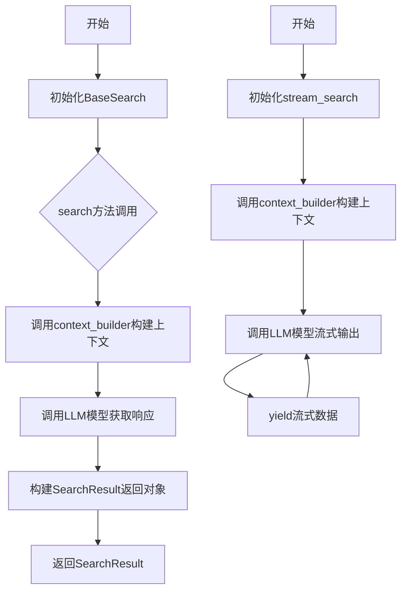
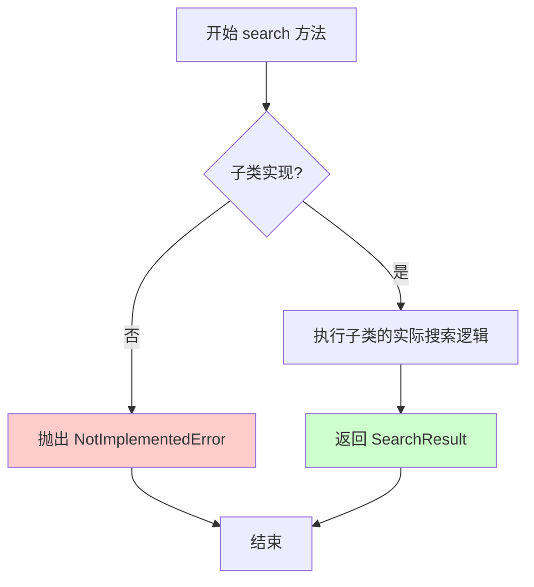
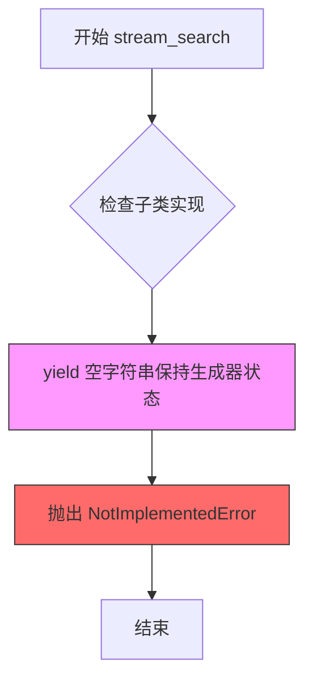

# `graphrag\packages\graphrag\graphrag\query\structured_search\base.py` 详细设计文档

这是GraphRAG项目中搜索算法的抽象基类模块，定义了结构化搜索的接口和通用实现框架。该模块通过泛型设计支持多种上下文构建器（Global、Local、DRIFT、Basic），并提供异步搜索和流式搜索的抽象方法，用于构建不同类型的问答系统和搜索应用。

## 整体流程



## 类结构

```
SearchResult (数据类)
BaseSearch (抽象基类)
  ├── 泛型参数: T (GlobalContextBuilder | LocalContextBuilder | DRIFTContextBuilder | BasicContextBuilder)
```

## 全局变量及字段


### `T`
    
泛型类型变量，用于约束搜索上下文构建器类型，支持GlobalContextBuilder、LocalContextBuilder、DRIFTContextBuilder和BasicContextBuilder

类型：`TypeVar`
    


### `SearchResult.response`
    
搜索结果响应，支持字符串、字典或字典列表格式的结构化输出

类型：`str | dict[str, Any] | list[dict[str, Any]]`
    


### `SearchResult.context_data`
    
搜索使用的上下文数据，包含原始数据框格式的上下文信息

类型：`str | list[pd.DataFrame] | dict[str, pd.DataFrame]`
    


### `SearchResult.context_text`
    
从context_data构建的实际文本字符串，构成上下文窗口内容

类型：`str | list[str] | dict[str, str]`
    


### `SearchResult.completion_time`
    
搜索完成所花费的时间，以秒为单位

类型：`float`
    


### `SearchResult.llm_calls`
    
LLM调用的总次数

类型：`int`
    


### `SearchResult.prompt_tokens`
    
发送给LLM的提示词token总数

类型：`int`
    


### `SearchResult.output_tokens`
    
LLM生成的输出token总数

类型：`int`
    


### `SearchResult.llm_calls_categories`
    
按类别分组的LLM调用次数统计，可选字段用于细粒度追踪

类型：`dict[str, int] | None`
    


### `SearchResult.prompt_tokens_categories`
    
按类别分组的提示词token统计，可选字段用于细粒度追踪

类型：`dict[str, int] | None`
    


### `SearchResult.output_tokens_categories`
    
按类别分组的输出token统计，可选字段用于细粒度追踪

类型：`dict[str, int] | None`
    


### `BaseSearch.model`
    
用于执行搜索的语言模型 completion 接口实例

类型：`LLMCompletion`
    


### `BaseSearch.context_builder`
    
泛型上下文构建器，用于构建搜索所需的上下文信息

类型：`T`
    


### `BaseSearch.tokenizer`
    
文本分词器，如果为None则使用model自带的tokenizer

类型：`Tokenizer | None`
    


### `BaseSearch.model_params`
    
传递给语言模型的配置参数字典

类型：`dict[str, Any]`
    


### `BaseSearch.context_builder_params`
    
传递给上下文构建器的配置参数字典

类型：`dict[str, Any]`
    
    

## 全局函数及方法


### `BaseSearch.search`

这是一个抽象异步搜索方法，定义了搜索接口的契约。所有具体搜索实现都应继承并实现此方法，用于根据查询字符串和可选的对话历史执行异步搜索并返回结构化的搜索结果。

参数：

- `query`：`str`，用户输入的查询字符串
- `conversation_history`：`ConversationHistory | None`，可选的对话历史，用于上下文理解和多轮对话
- `**kwargs`：可变关键字参数，用于扩展搜索行为的额外参数

返回值：`SearchResult`，包含搜索响应、上下文数据、上下文文本、完成时间、LLM调用统计和token使用情况等结构化结果

#### 流程图



#### 带注释源码

```python
@abstractmethod
async def search(
    self,
    query: str,
    conversation_history: ConversationHistory | None = None,
    **kwargs,
) -> SearchResult:
    """Search for the given query asynchronously."""
    # 抽象方法标记，强制子类实现具体逻辑
    # 子类需要重写此方法以提供实际的搜索功能
    msg = "Subclasses must implement this method"
    raise NotImplementedError(msg)
```


### `BaseSearch.stream_search`

流式搜索方法，用于异步流式返回查询结果。

参数：

- `query`：`str`，查询字符串
- `conversation_history`：`ConversationHistory | None`，可选的对话历史记录

返回值：`AsyncGenerator[str, None]`，异步生成器，流式返回搜索结果字符串

#### 流程图



#### 带注释源码

```python
@abstractmethod
async def stream_search(
    self,
    query: str,
    conversation_history: ConversationHistory | None = None,
) -> AsyncGenerator[str, None]:
    """Stream search for the given query."""
    # 使用 yield 语句使方法成为异步生成器函数
    # 这是 Python 中定义异步生成器的必需语法
    yield ""  # This makes it an async generator.
    # 标记该方法为抽象方法，子类必须重写此方法
    msg = "Subclasses must implement this method"
    raise NotImplementedError(msg)
```


### `BaseSearch.__init__`

这是搜索算法的基类构造函数，用于初始化语言模型实例、上下文构建器、tokenizer 以及相关配置参数。

参数：

-  `model`：`LLMCompletion`，执行搜索的语言模型实例
-  `context_builder`：T（泛型类型），用于构建搜索上下文的构建器，支持 GlobalContextBuilder、LocalContextBuilder、DRIFTContextBuilder 或 BasicContextBuilder
-  `tokenizer`：`Tokenizer | None`，可选的 tokenizer 实例，若未提供则使用 model 的 tokenizer
-  `model_params`：`dict[str, Any] | None`，可选的模型参数字典，用于配置语言模型的生成参数
-  `context_builder_params`：`dict[str, Any] | None`，可选的上下文构建器参数字典

返回值：无（`__init__` 方法不返回值）

#### 流程图

```mermaid
flowchart TD
    A[开始 __init__] --> B[接收参数: model, context_builder, tokenizer, model_params, context_builder_params]
    B --> C[设置 self.model = model]
    C --> D[设置 self.context_builder = context_builder]
    D --> E{tokenizer is None?}
    E -->|是| F[使用 model.tokenizer]
    E -->|否| G[使用传入的 tokenizer]
    F --> H[设置 self.tokenizer]
    G --> H
    H --> I{model_params is None?}
    I -->|是| J[设置 self.model_params = {}]
    I -->|否| K[设置 self.model_params = model_params]
    J --> L{context_builder_params is None?}
    K --> L
    L -->|是| M[设置 self.context_builder_params = {}]
    L -->|否| N[设置 self.context_builder_params = context_builder_params]
    M --> O[结束]
    N --> O
```

#### 带注释源码

```python
def __init__(
    self,
    model: "LLMCompletion",              # 语言模型实例，负责生成搜索结果
    context_builder: T,                  # 上下文构建器，用于构建检索上下文
    tokenizer: Tokenizer | None = None,  # 可选的 tokenizer，默认使用模型的 tokenizer
    model_params: dict[str, Any] | None = None,        # 可选的模型参数字典
    context_builder_params: dict[str, Any] | None = None,  # 可选的上下文构建器参数
):
    """初始化 BaseSearch 实例。

    Args:
        model: 语言模型实例，用于生成搜索响应
        context_builder: 上下文构建器，负责构建检索上下文
        tokenizer: 可选的 tokenizer，若为 None 则使用 model.tokenizer
        model_params: 可选的模型参数字典，默认为空字典
        context_builder_params: 可选的上下文构建器参数字典，默认为空字典
    """
    # 设置语言模型实例
    self.model = model
    
    # 设置上下文构建器
    self.context_builder = context_builder
    
    # 设置 tokenizer：如果未提供，则使用模型自带的 tokenizer
    self.tokenizer = tokenizer or model.tokenizer
    
    # 设置模型参数：如果未提供，则使用空字典
    self.model_params = model_params or {}
    
    # 设置上下文构建器参数：如果未提供，则使用空字典
    self.context_builder_params = context_builder_params or {}
```

## 关键组件


### SearchResult 数据类

一个数据结构，用于存储搜索算法的结构化结果。包含原始响应数据、上下文数据、上下文文本字符串、完成任务时间、LLM调用次数和token使用量统计，支持按类别细分的token统计功能。

### BaseSearch 抽象基类

搜索算法的通用基类，实现了模型调用、上下文构建和搜索逻辑的模板。采用泛型设计支持多种上下文构建器类型，定义了异步搜索和流式搜索两个抽象接口供子类实现，封装了模型参数和上下文构建器参数的配置管理。

### 类型变量 T

用于泛型约束的TypeVar，限定BaseSearch类支持四种上下文构建器类型（GlobalContextBuilder、LocalContextBuilder、DRIFTContextBuilder、BasicContextBuilder），实现搜索算法与具体上下文构建策略的解耦。

### 上下文构建器接口

支持四种不同策略的上下文构建器：BasicContextBuilder（基础构建器）、LocalContextBuilder（本地上下文构建器）、GlobalContextBuilder（全局上下文构建器）、DRIFTContextBuilder（漂移上下文构建器），分别对应不同的搜索场景和知识检索策略。

### 异步搜索接口

定义了search异步方法规范，要求子类实现完整的非流式搜索流程，包括查询理解、上下文检索、LLM调用和结果封装返回。

### 流式搜索接口

定义了stream_search异步生成器接口规范，支持逐块返回搜索结果，实现实时流式输出体验，子类需实现具体的流式生成逻辑。


## 问题及建议


### 已知问题

-   **抽象方法实现不当**：`search` 和 `stream_search` 方法在方法体内先执行代码（yield "" / raise NotImplementedError），而非仅通过 @abstractmethod 装饰器声明抽象方法。这种实现方式会导致即使子类未实现这些方法，基类方法也会被执行，产生不符合预期的行为。
-   **泛型类型约束不规范**：`TypeVar T` 直接使用具体类（GlobalContextBuilder 等）作为约束，而非使用 `TypeAlias` 或 `Protocol`，不符合 PEP 484 最佳实践。
-   **SearchResult 字段类型过于宽泛**：response、context_data、context_text 等字段使用多种类型的联合（`str | dict | list` 等），导致类型安全性和可维护性降低。
-   **参数字典类型弱化类型检查**：`model_params` 和 `context_builder_params` 使用 `dict[str, Any]`，使接口类型提示失去意义，无法在编译期发现参数错误。
-   **stream_search 空 yield 设计冗余**：方法体中 `yield ""` 后立即抛出异常的设计没有实际意义，反而增加了代码复杂度。
-   **缺少日志记录**：没有使用 logging 模块进行调试和监控，线上问题排查困难。
-   **异常处理策略缺失**：未定义异常类型或错误处理机制，子类实现时缺乏统一规范。

### 优化建议

-   将 `search` 和 `stream_search` 改为纯抽象方法，仅保留 @abstractmethod 装饰器，移除方法体内的 raise NotImplementedError 代码。
-   考虑使用 `Protocol[T]` 或类型别名定义泛型约束，提高类型检查的准确性。
-   考虑将 SearchResult 拆分为多个具体的结果类，或使用泛型 + 严格类型定义替代宽泛的联合类型。
-   为 `model_params` 和 `context_builder_params` 定义具体的数据类（dataclass）或 TypedDict，提供参数验证和类型提示。
-   移除 `stream_search` 中的空 `yield ""` 语句，改为仅声明抽象方法。
-   添加日志记录功能，使用 Python logging 模块记录关键操作和性能指标。
-   定义自定义异常类（如 `SearchError`）并在文档中明确异常传播规则。

## 其它


### 设计目标与约束

本模块旨在为GraphRAG查询系统提供统一的搜索算法抽象基类，支持异步搜索和流式搜索能力。设计约束包括：1) 必须继承ABC实现抽象方法；2) 支持泛型类型以适应不同的上下文构建器；3) 模型参数和上下文构建器参数通过字典传递以保持灵活性；4) 必须支持会话历史记录功能。

### 错误处理与异常设计

1. NotImplementedError: 子类未实现抽象方法时抛出，错误消息为"Subclasses must implement this method"
2. TypeError: 当传入的model不是LLMCompletion实例时会在初始化阶段潜在触发
3. AttributeError: 当tokenizer为None且model.tokenizer也不存在时可能触发
4. 异常传播机制: 搜索过程中的异常应向上传播给调用者处理

### 数据流与状态机

数据流如下：
1. 调用search()或stream_search()方法
2. 传入query字符串和可选的conversation_history
3. 内部调用context_builder构建上下文
4. 调用model生成响应
5. 返回SearchResult包含response、context_data、context_text和token统计信息

状态机: 无复杂状态管理，主要处于"就绪"和"搜索中"两种状态

### 外部依赖与接口契约

外部依赖：
1. graphrag_llm.tokenizer.Tokenizer: tokenization功能
2. graphrag_llm.completion.LLMCompletion: LLM模型接口
3. graphrag.query.context_builder.builders: 各种上下文构建器
4. pandas: 数据处理
5. typing.TypeVar, Generic: 泛型支持

接口契约：
1. search()方法必须返回SearchResult对象
2. stream_search()必须返回AsyncGenerator[str, None]
3. context_builder必须实现build_context()方法
4. model必须实现completion()或类似生成方法

### 性能考虑

1. tokenizer延迟初始化: tokenizer为None时使用model.tokenizer，减少初始化开销
2. 异步设计: 使用async/await支持高并发搜索请求
3. 流式输出: stream_search支持token级别的流式输出，降低首字节延迟
4. 参数默认空字典: 使用or{}避免重复创建空字典实例

### 安全性考虑

1. 输入验证: query参数应为字符串类型（运行时由调用方保证）
2. 敏感信息: SearchResult中的context_text可能包含敏感数据，需注意日志输出
3. 模型参数: model_params和context_builder_params直接透传，需确保调用方可信

### 兼容性考虑

1. Python版本: 依赖typing泛型，需Python 3.9+
2. 类型提示: 使用TYPE_CHECKING避免循环导入
3. 未来扩展: 可通过泛型T添加新的上下文构建器类型

### 版本演化考虑

1. SearchResult扩展: 可添加新字段如metadata、sources等
2. 方法扩展: 可添加同步版本search_sync()
3. 泛型扩展: 可添加更多上下文构建器类型支持

### 测试策略

1. 单元测试: 测试BaseSearch的初始化和属性设置
2. 集成测试: 测试子类实现是否正确
3. 抽象方法验证: 确认子类实现了所有抽象方法
4. 泛型测试: 验证不同类型构建器的兼容性

### 配置说明

model: LLMCompletion实例，必填
context_builder: 上下文构建器实例，必填
tokenizer: Tokenizer实例，可选，默认使用model.tokenizer
model_params: 模型参数字典，可选，默认为空字典
context_builder_params: 上下文构建器参数字典，可选，默认为空字典

### 使用示例

```python
# 假设有一个具体实现类LocalSearch继承BaseSearch
searcher = LocalSearch(
    model=llm_model,
    context_builder=local_context_builder,
    tokenizer=None,  # 将使用model.tokenizer
    model_params={"temperature": 0.7, "max_tokens": 1000},
    context_builder_params={"max_tokens": 5000}
)

# 异步搜索
result = await searcher.search("What is the capital of France?", conversation_history)

# 流式搜索
async for chunk in searcher.stream_search("Tell me about AI"):
    print(chunk, end="")
```


    