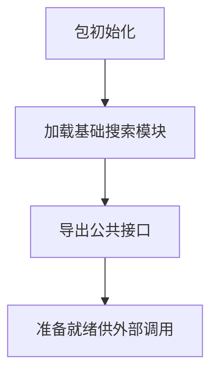

# `graphrag\packages\graphrag\graphrag\query\structured_search\basic_search\__init__.py` 详细设计文档

这是一个名为 BasicSearch 的基础搜索包，提供基本的搜索功能模块，可能包含搜索相关的核心算法和工具函数。

## 整体流程



## 类结构

```
当前文件为包初始化文件，无类层次结构
如后续有模块，可能包含：
└── BasicSearch
    ├── __init__.py (当前文件)
    ├── core/ (核心搜索逻辑)
    ├── models/ (数据模型)
    └── utils/ (工具函数)
```

## 全局变量及字段


    

## 全局函数及方法


## 关键组件


# BasicSearch 包设计文档

## 1. 核心功能概述

该代码仅为 BasicSearch 包的声明文件，包含版权信息和包名称定义，不包含具体实现逻辑。

## 2. 文件运行流程

由于该文件仅包含包级别的文档字符串和版权声明，无可执行的运行时流程。

## 3. 类详细信息

**无类定义**

## 4. 字段与变量详情

**无全局变量**

## 5. 方法与函数详情

**无全局函数**

## 6. 关键组件信息

### BasicSearch 包

仅作为包的入口声明存在，标识该包的基本搜索功能定位。

## 7. 技术债务与优化空间

由于代码仅为占位声明，无技术债务评估。

## 8. 其它项目

- **设计目标**: 需后续补充具体实现代码以完成设计文档
- **约束**: 遵循 MIT 开源许可证
- **错误处理**: 不适用
- **数据流**: 不适用
- **外部依赖**: 不适用


## 问题及建议


### 已知问题

-   **功能缺失**：该代码仅为一个空的包初始化文件，仅包含版权声明和包描述，未实现任何实际功能或API
-   **文档不完整**：包级别的文档字符串过于简略，缺乏对BasicSearch包核心功能、使用方式、关键类的说明
-   **无导出定义**：未通过`__all__`明确导出公共API，导致外部调用时无法清晰了解可用接口
-   **元数据缺失**：缺少版本信息（`__version__`）、作者信息、依赖说明等标准包元数据

### 优化建议

-   **完善功能实现**：根据包名"BasicSearch"推断，应实现基础搜索功能的核心逻辑，如索引构建、查询处理、结果返回等
-   **丰富文档内容**：添加详细的模块文档，说明包的用途、主要类/函数、简单使用示例
-   **定义公共API**：合理设计并导出核心类和函数，通过`__all__`明确公共接口
-   **添加版本管理**：参照PEP 396添加`__version__`版本号，可选配置`__author__`、`__email__`等元信息
-   **依赖声明**：如存在外部依赖，应在包中或通过`pyproject.toml`/`setup.py`明确声明


## 其它


### 设计目标与约束

**设计目标**：由于代码仅包含包级别的文档字符串和版权信息，无法从当前代码中推断具体的设计目标。该包预期将实现BasicSearch（基础搜索）功能，但具体目标待定。

**约束条件**：遵循MIT开源许可证约束，版权归属Microsoft Corporation。

### 错误处理与异常设计

由于代码中未包含任何实际实现逻辑，无法从当前代码中提取错误处理与异常设计相关的内容。该部分内容需要在后续功能开发中明确。

### 数据流与状态机

由于代码中未包含任何数据处理逻辑或状态管理代码，无法从当前代码中提取数据流与状态机相关信息。该部分内容需要在后续功能开发中明确。

### 外部依赖与接口契约

由于代码中未包含任何功能实现，无法确定外部依赖关系和接口契约。该部分内容需要在后续功能开发中明确。

### 性能要求与优化策略

由于代码中未包含任何功能实现，无法提取性能要求与优化策略相关内容。该部分内容需要在后续功能开发中明确。

### 安全性考虑

由于代码中未包含任何功能实现，无法提取安全性相关设计。该部分内容需要在后续功能开发中明确。

### 可测试性设计

由于代码中未包含任何功能实现，无法提取可测试性设计相关内容。该部分内容需要在后续功能开发中明确。

### 版本兼容性

当前代码声明了2024年的版权年份，但未指定具体的版本号和兼容性策略。该部分内容需要在后续功能开发中明确。

### 配置与扩展性

由于代码中未包含任何配置相关的实现，无法提取配置与扩展性设计。该部分内容需要在后续功能开发中明确。

### 日志与监控

由于代码中未包含任何日志或监控相关的实现，无法提取日志与监控设计。该部分内容需要在后续功能开发中明确。

### 代码组织与模块划分

由于代码中未包含任何类或函数定义，无法提取代码组织与模块划分信息。该部分内容需要在后续功能开发中明确。

### API 接口设计

由于代码中未包含任何API接口定义，无法提取API接口设计。该部分内容需要在后续功能开发中明确。


    