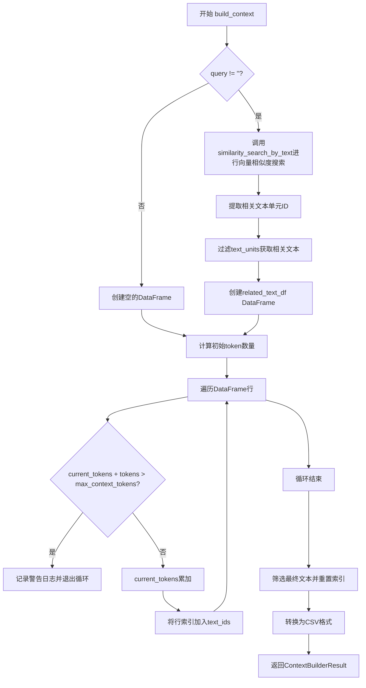
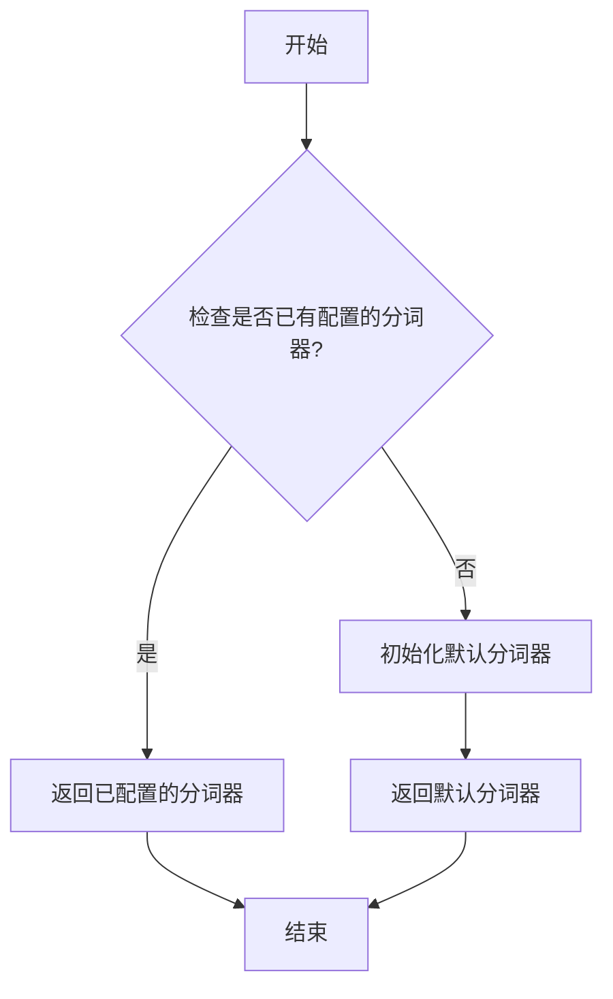
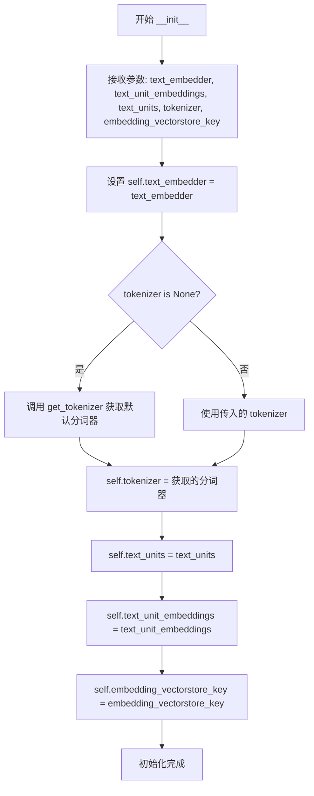
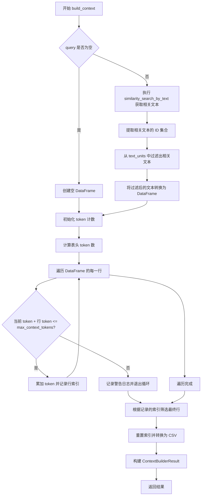

# `graphrag\packages\graphrag\graphrag\query\structured_search\basic_search\basic_context.py` 详细设计文档

这是一个基础搜索上下文构建器实现，用于在检索增强生成(RAG)场景下，根据用户查询从向量存储中检索相关文本单元，并将其组织成适合大语言模型处理的上下文格式，同时控制上下文窗口的token数量。

## 整体流程



## 类结构

```
BasicContextBuilder (抽象基类)
└── BasicSearchContext (实现类)
```

## 全局变量及字段


### `BasicSearchContext.text_embedder`
    
用于将文本嵌入为向量的LLM嵌入器

类型：`LLMEmbedding`
    


### `BasicSearchContext.tokenizer`
    
文本分词器，用于对文本进行编码和解码以计算token数量

类型：`Tokenizer`
    


### `BasicSearchContext.text_units`
    
文本单元列表，存储待检索的文本片段

类型：`list[TextUnit]`
    


### `BasicSearchContext.text_unit_embeddings`
    
向量存储库，存储文本单元的嵌入向量用于相似度搜索

类型：`VectorStore`
    


### `BasicSearchContext.embedding_vectorstore_key`
    
向量存储中用于标识文档的键名，默认为'id'

类型：`str`
    
    

## 全局函数及方法


### `get_tokenizer`

获取全局分词器实例。如果已配置自定义分词器则返回该分词器，否则返回默认分词器。

参数： 无

返回值：`Tokenizer`，全局分词器实例，用于文本编码和解码

#### 流程图



#### 带注释源码

```
# 位置：graphrag/tokenizer/get_tokenizer.py（推断位置）

from graphrag_llm.tokenizer import Tokenizer

# 全局分词器实例缓存
_tokenizer_instance = None

def get_tokenizer() -> Tokenizer:
    """获取全局分词器实例。
    
    这是一个工厂函数/单例模式实现，确保全局只存在一个分词器实例。
    在BasicSearchContext中作为默认分词器使用：
        self.tokenizer = tokenizer or get_tokenizer()
    
    Returns:
        Tokenizer: 分词器实例，用于文本到token的编码和解码
        
    Note:
        - 如果需要自定义分词器，应在应用初始化时配置
        - 默认使用与LLM模型配套的分词器
    """
    global _tokenizer_instance
    
    if _tokenizer_instance is None:
        # 初始化默认分词器
        # 实际实现会根据配置加载对应的Tokenizer模型
        _tokenizer_instance = Tokenizer()
    
    return _tokenizer_instance
```

> **注意**：由于提供的代码片段中仅包含 `get_tokenizer` 的导入和使用，未包含其完整实现，上述源码为基于其使用方式和典型工厂模式推断的注释版本。实际实现可能包含更多配置选项，如模型路径、词汇表加载等。


### `BasicSearchContext.__init__`

这是 BasicSearchContext 类的构造函数，用于初始化搜索上下文构建器的基本配置，包括文本嵌入器、向量存储、分词器等核心组件。

参数：

- `self`：隐式参数，类的实例本身
- `text_embedder`：`LLMEmbedding`，用于将文本转换为向量嵌入的嵌入器
- `text_unit_embeddings`：`VectorStore`，存储文本单元嵌入向量的向量数据库
- `text_units`：`list[TextUnit] | None`，可选的文本单元列表，默认为 None
- `tokenizer`：`Tokenizer | None`，可选的分词器，如果为 None 则自动获取默认分词器，默认为 None
- `embedding_vectorstore_key`：`str`，向量存储中用于标识文档的键字段名，默认为 "id"

返回值：`None`，构造函数不返回值，仅初始化实例属性

#### 流程图



#### 带注释源码

```python
def __init__(
    self,
    text_embedder: "LLMEmbedding",
    text_unit_embeddings: VectorStore,
    text_units: list[TextUnit] | None = None,
    tokenizer: Tokenizer | None = None,
    embedding_vectorstore_key: str = "id",
):
    """初始化 BasicSearchContext 类的实例。
    
    参数:
        text_embedder: 用于生成文本嵌入的嵌入器实例
        text_unit_embeddings: 存储文本单元向量的向量存储对象
        text_units: 可选的文本单元列表，用于关联嵌入与原始文本
        tokenizer: 可选的分词器，如果未提供则使用全局默认分词器
        embedding_vectorstore_key: 向量存储中文档ID的字段名，默认为 'id'
    """
    # 设置文本嵌入器 - 用于将查询文本转换为向量进行相似度搜索
    self.text_embedder = text_embedder
    
    # 设置分词器 - 如果未提供，则通过 get_tokenizer() 获取全局默认分词器
    # 分词器用于计算token数量以控制上下文窗口大小
    self.tokenizer = tokenizer or get_tokenizer()
    
    # 设置文本单元列表 - 可选，用于在搜索后将向量结果映射回原始文本
    self.text_units = text_units
    
    # 设置文本单元嵌入向量存储 - 存储预计算的文本嵌入向量
    self.text_unit_embeddings = text_unit_embeddings
    
    # 设置向量存储键 - 指定向量存储中每条记录的唯一标识字段
    self.embedding_vectorstore_key = embedding_vectorstore_key
```


### `BasicSearchContext.build_context`

该方法实现了基础搜索模式的上下文构建功能，通过向量相似度搜索获取与查询相关的文本单元，并根据token数量限制将相关文本 chunks 组装成最终的上下文结果返回。

参数：

- `query`：`str`，用户查询字符串
- `conversation_history`：`ConversationHistory | None`，对话历史记录（可选，当前未使用）
- `k`：`int = 10`，相似度搜索返回的top-k个相关文本单元数量
- `max_context_tokens`：`int = 12_000`，最大允许的上下文token数量
- `context_name`：`str = "Sources"`，上下文记录的键名
- `column_delimiter`：`str = "|"`，CSV输出的列分隔符
- `text_id_col`：`str = "id"`，文本ID的列名
- `text_col`：`str = "text"`，文本内容的列名
- `**kwargs`：其他可选关键字参数

返回值：`ContextBuilderResult`，包含构建好的上下文内容（CSV格式的文本块）和上下文记录（DataFrame格式的字典）

#### 流程图



#### 带注释源码

```python
def build_context(
    self,
    query: str,
    conversation_history: ConversationHistory | None = None,
    k: int = 10,
    max_context_tokens: int = 12_000,
    context_name: str = "Sources",
    column_delimiter: str = "|",
    text_id_col: str = "id",
    text_col: str = "text",
    **kwargs,
) -> ContextBuilderResult:
    """Build the context for the basic search mode."""
    # 如果查询不为空，则执行向量相似度搜索
    if query != "":
        # 使用向量存储执行相似度搜索，获取与查询最相关的k个文本
        related_texts = self.text_unit_embeddings.similarity_search_by_text(
            text=query,
            # 构建嵌入函数：调用text_embedder对单个文本进行嵌入
            text_embedder=lambda t: (
                self.text_embedder.embedding(input=[t]).first_embedding
            ),
            k=k,
        )

        # 从搜索结果中提取所有相关文本的文档ID
        text_unit_ids = {t.document.id for t in related_texts}
        
        # 初始化过滤后的文本单元列表
        text_units_filtered = []
        # 从self.text_units中过滤出ID在相关文本ID集合中的文本
        text_units_filtered = [
            {text_id_col: t.short_id, text_col: t.text}
            for t in self.text_units or []
            if t.id in text_unit_ids
        ]
        # 将过滤后的文本转换为pandas DataFrame
        related_text_df = pd.DataFrame(text_units_filtered)
    else:
        # 如果查询为空，则创建空的DataFrame
        related_text_df = pd.DataFrame({
            text_id_col: [],
            text_col: [],
        })

    # ==== 将相关文本块添加到上下文中，直到填满上下文窗口 ====
    # 初始化当前token计数
    current_tokens = 0
    # 用于记录符合token限制的行索引
    text_ids = []
    # 计算表头（列名）的token数量
    current_tokens = len(
        self.tokenizer.encode(text_id_col + column_delimiter + text_col + "\n")
    )
    
    # 遍历DataFrame的每一行
    for i, row in related_text_df.iterrows():
        # 构建当前行的文本内容
        text = row[text_id_col] + column_delimiter + row[text_col] + "\n"
        # 计算当前行的token数量
        tokens = len(self.tokenizer.encode(text))
        
        # 检查添加当前行后是否超过最大token限制
        if current_tokens + tokens > max_context_tokens:
            # 记录警告日志并退出循环
            msg = f"Reached token limit: {current_tokens + tokens}. Reverting to previous context state"
            logger.warning(msg)
            break

        # 累加token计数并记录当前行的索引
        current_tokens += tokens
        text_ids.append(i)
    
    # 根据记录的索引筛选出最终的文本行，并重置索引
    final_text_df = cast(
        "pd.DataFrame",
        related_text_df[related_text_df.index.isin(text_ids)].reset_index(
            drop=True
        ),
    )
    
    # 将最终DataFrame转换为CSV格式字符串
    final_text = final_text_df.to_csv(
        index=False, escapechar="\\", sep=column_delimiter
    )

    # 返回ContextBuilderResult对象，包含上下文块和上下文记录
    return ContextBuilderResult(
        context_chunks=final_text,
        context_records={context_name.lower(): final_text_df},
    )
```

## 关键组件


### 向量相似度搜索与惰性嵌入

使用lambda函数实现惰性嵌入计算，仅在相似度搜索时通过`text_embedder.embedding(input=[t]).first_embedding`动态计算文本嵌入，避免初始化时预计算全部嵌入

### Token预算管理

通过`max_context_tokens`参数控制上下文窗口大小，使用`tokenizer.encode()`逐行计算token数量，当累计token超过预算时停止添加文本块，实现自适应上下文压缩

### 文本块过滤与索引映射

通过`text_unit_ids`集合存储相关文本单元ID，然后过滤`self.text_units`获取匹配的文本块，建立向量检索结果与原始文本单元的映射关系

### CSV格式上下文输出

将筛选后的文本块转换为CSV格式输出，使用`column_delimiter`作为列分隔符，`escapechar="\\"`转义特殊字符，同时返回`context_chunks`和`context_records`两种格式的结果

### 零查询处理

当`query`为空字符串时，直接返回空的DataFrame而不是执行向量搜索，提供优雅的降级处理

### conversation_history未使用

虽然方法签名包含`conversation_history`参数，但实际实现中未使用该参数，无法利用对话历史信息增强上下文


## 问题及建议


### 已知问题

-   **低效的列表过滤算法**：代码使用列表推导式遍历所有 `self.text_units`，时间复杂度为 O(n)，当文本单元数量较大时性能较差，应使用字典或集合进行 O(1) 查找
-   **重复的 Token 编码计算**：在循环外和循环内都调用 `self.tokenizer.encode()`，且每次循环都重新编码相同的列名和分隔符，造成不必要的重复计算
-   **DataFrame 迭代性能低下**：使用 `related_text_df.iterrows()` 逐行迭代，在大数据集上性能较差，应使用向量化操作替代
-   **空值处理不完善**：当 `self.text_units` 为 None 时，相似度搜索仍会执行但后续过滤结果为空，可能导致意外行为，缺少显式的空值检查和降级处理
-   **Lambda 函数重复创建**：在 `similarity_search_by_text` 调用中每次都创建新的 lambda 函数 `lambda t: ...`，可预先定义以复用
-   **未使用的参数**：`build_context` 方法接收 `**kwargs` 但完全未使用，若有需要扩展的功能则无法传递
-   **Token 估算方法开销大**：`tokenizer.encode()` 是计算密集型操作，对于大规模上下文构建场景开销显著，可考虑使用近似估算方法

### 优化建议

-   将 `self.text_units` 转换为字典结构 `dict[id, TextUnit]`，将过滤操作的时间复杂度从 O(n²) 降至 O(n)
-   在循环开始前预先计算并缓存列名和分隔符的 token 数量，使用向量化方法批量处理 DataFrame 行
-   使用 `iterrows()` 改为 `itertuples()` 或直接操作 pandas Series/Array 以提升迭代性能
-   添加 `self.text_units` 的空值检查，当为空时返回空结果或使用默认上下文
-   将 lambda 函数定义为类方法或实例变量以避免重复创建
-   移除未使用的 `**kwargs` 参数或在文档中说明其预留用途
-   考虑实现 token 计数的估算缓存机制，或使用更轻量的估算算法如按字符数/词数比例估算
-   添加异常处理逻辑以应对向量存储或嵌入服务的潜在故障


## 其它


### 设计目标与约束

本模块旨在为检索增强生成（RAG）系统提供基础的上下文构建能力，支持基于向量相似度的文本块检索和上下文窗口管理。设计目标包括：1）通过向量相似度搜索获取与查询最相关的文本块；2）在给定token预算内动态构建上下文；3）将检索结果格式化为CSV字符串和DataFrame两种形式。技术约束包括：max_context_tokens默认限制为12,000个token，k参数控制初始检索的文本块数量，以及必须使用兼容的VectorStore和LLMEmbedding实现。

### 错误处理与异常设计

代码采用警告日志而非异常抛出来处理token超限情况，当累积token数超过max_context_tokens时记录警告并停止添加更多文本块。空查询场景下会返回空的DataFrame而非抛出异常。对于text_units为None的情况，代码通过列表推导式条件过滤自动处理。潜在的改进方向包括：1）为关键失败场景（如向量化失败、tokenizer不可用）引入自定义异常类；2）支持配置化的错误处理策略；3）对相似度搜索失败进行显式处理。

### 数据流与状态机

数据流从查询字符串输入开始，经历以下阶段：查询阶段（非空查询触发相似度搜索）→ 检索阶段（从VectorStore获取相关文本块ID）→ 过滤阶段（根据ID匹配原始TextUnit）→ Token计算阶段（迭代计算累积token数并检查限制）→ 格式化阶段（将筛选后的DataFrame转换为CSV字符串）。状态转换由max_context_tokens阈值控制，一旦超限即跳出循环并生成最终结果。

### 外部依赖与接口契约

核心依赖包括：1）graphrag_llm.tokenizer.Tokenizer接口，用于token计数；2）graphrag_vectors.VectorStore的similarity_search_by_text方法，需支持text和text_embedder参数以及k参数；3）graphrag_llm.embedding.LLMEmbedding的embedding方法，需返回包含first_embedding属性的对象；4）graphrag.data_model.text_unit.TextUnit数据模型，需包含id、short_id和text属性；5）pandas库用于DataFrame操作和CSV转换。接口契约规定：build_context方法接受query字符串和其他可选参数，返回ContextBuilderResult对象，其中context_chunks为CSV格式字符串，context_records为字典结构。

### 性能考虑与优化空间

当前实现存在以下性能瓶颈：1）每行文本都单独调用tokenizer.encode，产生多次函数调用开销，建议批量编码；2）相似度搜索和文本过滤分两步执行，可考虑合并以减少迭代；3）DataFrame的iterrows()遍历效率较低，可使用向量化操作替代。优化方向包括：实现tokenizer的批量编码功能、引入缓存机制存储已编码文本的token数、使用numpy数组替代DataFrame进行token计算。

### 安全性考虑

代码本身不直接处理用户输入的持久化或敏感数据，但建议关注：1）query参数应进行输入验证防止注入攻击；2）日志中可能包含查询内容，需注意敏感信息脱敏；3）text_embedder的lambda闭包需确保其生命周期管理正确。

### 配置管理

当前配置通过构造函数参数和build_context方法参数两层传递。可配置的参数包括：text_embedder（向量化器实例）、text_unit_embeddings（向量存储）、text_units（文本单元列表）、tokenizer（分词器）、embedding_vectorstore_key（向量存储键字段）、k（检索数量）、max_context_tokens（最大token数）、context_name（上下文名称）、column_delimiter（列分隔符）、text_id_col（ID列名）、text_col（文本列名）。建议引入配置类或Pydantic模型进行集中管理。

### 版本兼容性与依赖管理

代码明确声明了类型检查（TYPE_CHECKING）用于避免循环依赖，并向后兼容Python 3.10+的类型提示语法（使用|运算符而非Union）。外部依赖版本需满足：pandas>=1.0、graphrag_llm、graphrag_vectors、graphrag（数据模型）。建议在pyproject.toml或requirements.txt中明确版本约束。

### 测试策略建议

建议补充以下测试用例：1）空查询和空text_units的边界情况；2）k值和max_context_tokens的各种组合；3）token计算准确性验证；4）CSV格式化输出格式验证；5）多语言文本的token计数准确性；6）大规模text_units下的性能基准测试。

### 监控与可观测性

当前仅通过logger.warning记录token超限事件。建议增强监控能力：1）添加指标追踪检索命中率（最终选中文本数/初始检索数）；2）记录token利用率（实际使用token/最大token限制）；3）追踪相似度搜索延迟；4）引入结构化日志便于日志聚合分析。

### 潜在技术债务

1）硬编码的token计算方式假设固定格式，可抽象为可配置的tokenizer策略；2）text_embedder的lambda闭包可能导致序列化问题，不支持对象跨进程传递；3）缺少对VectorStore查询失败的容错处理；4）column_delimiter和转义字符（escapechar="\\"）的配置硬编码，缺乏灵活性；5）未实现缓存机制，重复查询会重复计算。


    