# `graphrag\packages\graphrag\graphrag\query\structured_search\basic_search\search.py` 详细设计文档

实现了一个基础的RAG（检索增强生成）搜索算法，通过构建上下文上下文、调用LLM生成器来回答用户查询，支持同步和流式两种搜索模式

## 整体流程

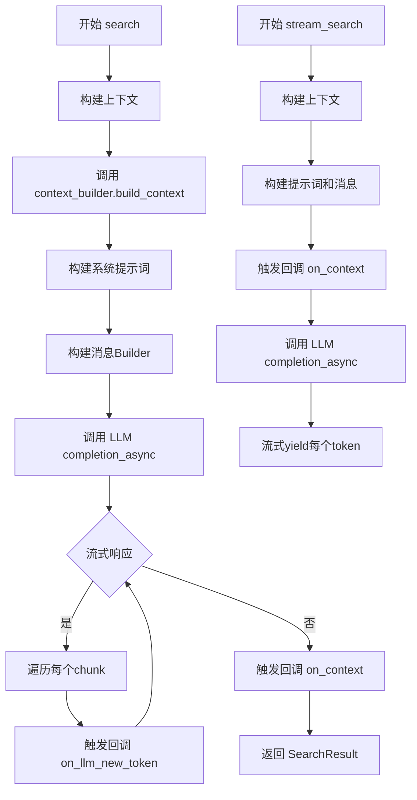

## 类结构

```
BaseSearch (抽象基类)
└── BasicSearch (基础搜索实现)
```

## 全局变量及字段


### `logger`
    
用于记录模块日志的日志记录器实例

类型：`logging.Logger`
    


### `BASIC_SEARCH_SYSTEM_PROMPT`
    
基础搜索系统提示词模板，用于构建搜索提示

类型：`str`
    


### `BasicSearch.model`
    
LLM模型实例，用于生成搜索答案

类型：`LLMCompletion`
    


### `BasicSearch.context_builder`
    
上下文构建器，用于构建搜索上下文

类型：`BasicContextBuilder`
    


### `BasicSearch.tokenizer`
    
分词器，用于对文本进行分词处理

类型：`Tokenizer | None`
    


### `BasicSearch.system_prompt`
    
系统提示词，用于配置搜索系统提示

类型：`str | None`
    


### `BasicSearch.response_type`
    
响应类型，指定生成答案的格式类型

类型：`str`
    


### `BasicSearch.callbacks`
    
查询回调列表，用于处理搜索过程中的回调事件

类型：`list[QueryCallbacks] | None`
    


### `BasicSearch.model_params`
    
模型参数，用于配置LLM模型的额外参数

类型：`dict[str, Any] | None`
    


### `BasicSearch.context_builder_params`
    
上下文构建器参数，用于配置上下文构建器的额外参数

类型：`dict | None`
    
    

## 全局函数及方法


### Tokenizer

分词器类，负责将文本字符串编码为token序列，并提供计算token数量的功能。在BasicSearch中用于计算prompt和response的token数量以进行令牌计数和成本估算。

参数：

返回值：`无`（类定义本身）

#### 流程图

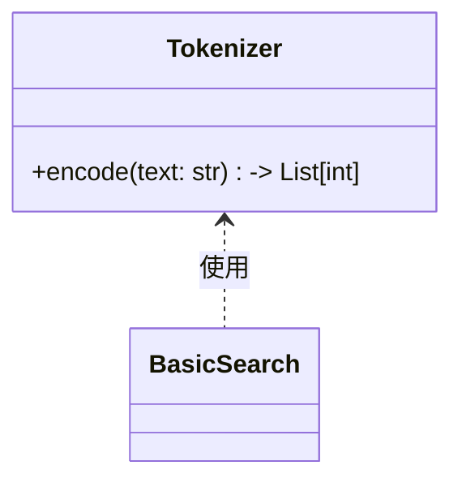

#### 带注释源码

```python
# Tokenizer 是从 graphrag_llm.tokenizer 模块导入的外部类
# 在当前代码中的使用方式：

from graphrag_llm.tokenizer import Tokenizer

# 在 BasicSearch 类中的使用：
class BasicSearch(BaseSearch[BasicContextBuilder]):
    def __init__(
        self,
        model: "LLMCompletion",
        context_builder: BasicContextBuilder,
        tokenizer: Tokenizer | None = None,  # 可选的分词器实例
        system_prompt: str | None = None,
        response_type: str = "multiple paragraphs",
        callbacks: list[QueryCallbacks] | None = None,
        model_params: dict[str, Any] | None = None,
        context_builder_params: dict | None = None,
    ):
        # ... 初始化代码
        self.tokenizer = tokenizer  # 存储tokenizer实例

    # 在 search 方法中调用 encode 方法进行token计数：
    # self.tokenizer.encode(search_prompt) - 对提示文本进行编码
    # self.tokenizer.encode(response) - 对响应文本进行编码
    # len() 用于获取token数量

    prompt_tokens["response"] = len(self.tokenizer.encode(search_prompt))
    output_tokens["response"] = len(self.tokenizer.encode(response))
```

---

### BasicSearch.search

搜索方法的核心实现，构建RAG搜索上下文并生成答案。

参数：

- `query`：`str`，用户查询字符串
- `conversation_history`：`ConversationHistory | None`，可选的对话历史记录
- `**kwargs`：可变关键字参数，传递给上下文构建器

返回值：`SearchResult`，包含响应文本、上下文数据、上下文文本、完成时间、LLM调用次数、prompt tokens、output tokens及各类别的详细统计信息

#### 流程图

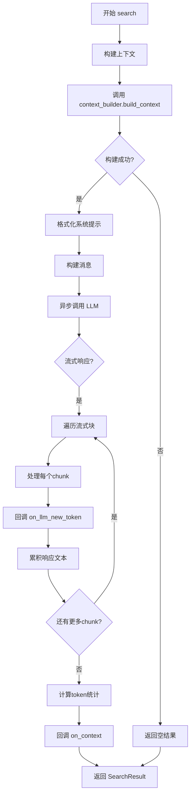

#### 带注释源码

```python
async def search(
    self,
    query: str,
    conversation_history: ConversationHistory | None = None,
    **kwargs,
) -> SearchResult:
    """Build rag search context that fits a single context window and generate answer for the user query."""
    start_time = time.time()  # 记录开始时间
    search_prompt = ""  # 初始化搜索提示
    llm_calls, prompt_tokens, output_tokens = {}, {}, {}  # 初始化统计字典

    # 第一步：构建上下文
    context_result = self.context_builder.build_context(
        query=query,
        conversation_history=conversation_history,
        **kwargs,
        **self.context_builder_params,
    )

    # 记录上下文构建的统计信息
    llm_calls["build_context"] = context_result.llm_calls
    prompt_tokens["build_context"] = context_result.prompt_tokens
    output_tokens["build_context"] = context_result.output_tokens

    logger.debug("GENERATE ANSWER: %s. QUERY: %s", start_time, query)
    try:
        # 第二步：格式化系统提示
        search_prompt = self.system_prompt.format(
            context_data=context_result.context_chunks,
            response_type=self.response_type,
        )

        # 第三步：构建消息
        messages_builder = (
            CompletionMessagesBuilder()
            .add_system_message(search_prompt)
            .add_user_message(query)
        )

        response = ""

        # 第四步：异步流式调用LLM
        response_stream: AsyncIterator[LLMCompletionChunk] = (
            self.model.completion_async(
                messages=messages_builder.build(),
                stream=True,
                **self.model_params,
            )
        )

        # 第五步：处理流式响应
        async for chunk in response_stream:
            response_text = chunk.choices[0].delta.content or ""
            for callback in self.callbacks:
                callback.on_llm_new_token(response_text)  # 回调处理新token
            response += response_text

        # 第六步：计算token统计
        llm_calls["response"] = 1
        prompt_tokens["response"] = len(self.tokenizer.encode(search_prompt))  # 使用Tokenizer计算prompt token数
        output_tokens["response"] = len(self.tokenizer.encode(response))  # 使用Tokenizer计算output token数

        # 第七步：回调上下文
        for callback in self.callbacks:
            callback.on_context(context_result.context_records)

        # 第八步：返回结果
        return SearchResult(
            response=response,
            context_data=context_result.context_records,
            context_text=context_result.context_chunks,
            completion_time=time.time() - start_time,
            llm_calls=1,
            prompt_tokens=len(self.tokenizer.encode(search_prompt)),
            output_tokens=sum(output_tokens.values()),
            llm_calls_categories=llm_calls,
            prompt_tokens_categories=prompt_tokens,
            output_tokens_categories=output_tokens,
        )

    except Exception:
        logger.exception("Exception in _asearch")
        # 异常情况下返回空结果
        return SearchResult(
            response="",
            context_data=context_result.context_records,
            context_text=context_result.context_chunks,
            completion_time=time.time() - start_time,
            llm_calls=1,
            prompt_tokens=len(self.tokenizer.encode(search_prompt)),
            output_tokens=0,
            llm_calls_categories=llm_calls,
            prompt_tokens_categories=prompt_tokens,
            output_tokens_categories=output_tokens,
        )
```

---

### BasicSearch.stream_search

流式搜索方法，以异步生成器方式返回搜索结果，支持实时流式输出。

参数：

- `query`：`str`，用户查询字符串
- `conversation_history`：`ConversationHistory | None`，可选的对话历史记录

返回值：`AsyncGenerator[str, None]` ，异步生成器，产生流式的响应文本片段

#### 流程图

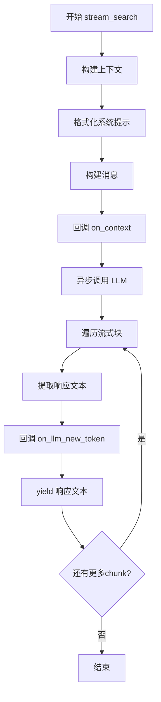

#### 带注释源码

```python
async def stream_search(
    self,
    query: str,
    conversation_history: ConversationHistory | None = None,
) -> AsyncGenerator[str, None]:
    """Build basic search context that fits a single context window and generate answer for the user query."""
    start_time = time.time()

    # 构建搜索上下文
    context_result = self.context_builder.build_context(
        query=query,
        conversation_history=conversation_history,
        **self.context_builder_params,
    )
    logger.debug("GENERATE ANSWER: %s. QUERY: %s", start_time, query)
    
    # 格式化系统提示
    search_prompt = self.system_prompt.format(
        context_data=context_result.context_chunks, response_type=self.response_type
    )

    # 构建消息
    messages_builder = (
        CompletionMessagesBuilder()
        .add_system_message(search_prompt)
        .add_user_message(query)
    )

    # 回调上下文
    for callback in self.callbacks:
        callback.on_context(context_result.context_records)

    # 获取流式响应
    response_stream: AsyncIterator[
        LLMCompletionChunk
    ] = await self.model.completion_async(
        messages=messages_builder.build(),
        stream=True,
        **self.model_params,
    )

    # 遍历流式块并yield每个文本片段
    async for chunk in response_stream:
        response_text = chunk.choices[0].delta.content or ""
        for callback in self.callbacks:
            callback.on_llm_new_token(response_text)
        yield response_text
```


### CompletionMessagesBuilder

CompletionMessagesBuilder 是一个消息构建器工具类，属于 fluent interface（流式接口）设计模式，用于链式构建 LLM（大型语言模型）的对话消息列表。它可以添加系统消息和用户消息，并最终生成符合 LLM 要求的格式。

参数：

- 无（构造函数不接受参数）

返回值：`list[dict[str, str]]`，返回一个包含消息字典的列表，每个字典包含 role 和 content 字段，用于 LLM 调用。

#### 流程图

```mermaid
flowchart TD
    A[创建 CompletionMessagesBuilder 实例] --> B[调用 add_system_message 添加系统消息]
    B --> C[调用 add_user_message 添加用户消息]
    C --> D[调用 build 方法生成消息列表]
    D --> E[返回 list[dict role: content]]
    
    B -.->|返回 self 支持链式调用| B
    C -.->|返回 self 支持链式调用| C
```

#### 带注释源码

```python
# 使用示例（来自 BasicSearch.search 方法）:
# 创建消息构建器实例
messages_builder = (
    CompletionMessagesBuilder()
    # 添加系统消息，包含搜索上下文和响应类型要求
    .add_system_message(search_prompt)
    # 添加用户查询消息
    .add_user_message(query)
)

# 构建最终的消息列表，传入 LLM
messages = messages_builder.build()
```

#### 完整使用示例

```python
# 在 BasicSearch 类中的实际使用方式
messages_builder = (
    CompletionMessagesBuilder()
    .add_system_message(search_prompt)  # 添加系统提示词，包含上下文数据
    .add_user_message(query)             # 添加用户查询
)

# 调用 LLM 生成响应
response_stream = self.model.completion_async(
    messages=messages_builder.build(),  # 构建消息列表并传递
    stream=True,
    **self.model_params,
)
```

#### 推断的类接口

基于代码使用方式推断的接口：

```python
class CompletionMessagesBuilder:
    """消息构建器，用于构建 LLM 对话消息列表"""
    
    def __init__(self):
        """初始化消息构建器"""
        self._messages: list[dict[str, str]] = []
    
    def add_system_message(self, content: str) -> "CompletionMessagesBuilder":
        """
        添加系统消息
        
        参数：
        - content: str，系统消息内容
        
        返回：
        - CompletionMessagesBuilder，返回 self 支持链式调用
        """
        self._messages.append({"role": "system", "content": content})
        return self
    
    def add_user_message(self, content: str) -> "CompletionMessagesBuilder":
        """
        添加用户消息
        
        参数：
        - content: str，用户消息内容
        
        返回：
        - CompletionMessagesBuilder，返回 self 支持链式调用
        """
        self._messages.append({"role": "user", "content": content})
        return self
    
    def build(self) -> list[dict[str, str]]:
        """
        构建消息列表
        
        返回：
        - list[dict[str, str]]，消息字典列表，每个包含 role 和 content
        """
        return self._messages.copy()
```


### QueryCallbacks

QueryCallbacks 是查询回调基类，定义了用于在搜索过程中接收事件通知的接口方法。该类主要用于在 RAG 查询执行过程中，允许外部代码监听 LLM 生成的新 token 以及构建完成的上下文数据。

参数：
- 无（基类/接口定义）

返回值：
- 无（基类/接口定义）

#### 流程图

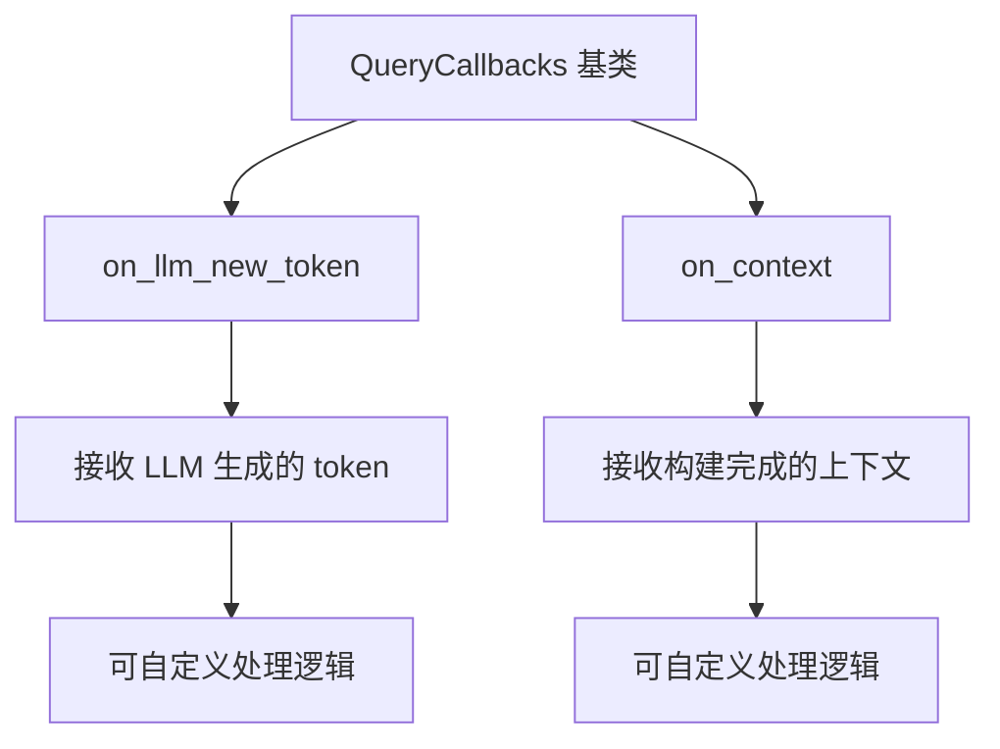

#### 带注释源码

```python
# 注意：以下是基于 BasicSearch 代码中调用方式推断的 QueryCallbacks 接口定义
# 实际源码位于 graphrag.callbacks.query_callbacks 模块

class QueryCallbacks:
    """查询回调基类，定义 RAG 查询过程中的事件钩子"""
    
    def on_llm_new_token(self, token: str) -> None:
        """
        当 LLM 生成新 token 时调用的回调方法
        
        参数：
        - token：新生成的文本片段（str）
        
        返回值：
        - None
        """
        pass
    
    def on_context(self, context_records: Any) -> None:
        """
        当上下文构建完成时调用的回调方法
        
        参数：
        - context_records：构建完成的上下文记录（Any，具体类型取决于 context_builder）
        
        返回值：
        - None
        """
        pass


# 在 BasicSearch 类中的使用方式：
class BasicSearch(BaseSearch[BasicContextBuilder]):
    def __init__(
        self,
        # ... 其他参数
        callbacks: list[QueryCallbacks] | None = None,  # 回调列表
        # ...
    ):
        self.callbacks = callbacks or []
    
    async def search(self, query: str, ...) -> SearchResult:
        # 在流式响应中遍历每个 token
        async for chunk in response_stream:
            response_text = chunk.choices[0].delta.content or ""
            # 调用每个回调的 on_llm_new_token 方法
            for callback in self.callbacks:
                callback.on_llm_new_token(response_text)
            response += response_text
        
        # 上下文构建完成后，调用每个回调的 on_context 方法
        for callback in self.callbacks:
            callback.on_context(context_result.context_records)
```

#### 在 BasicSearch 中的调用关系

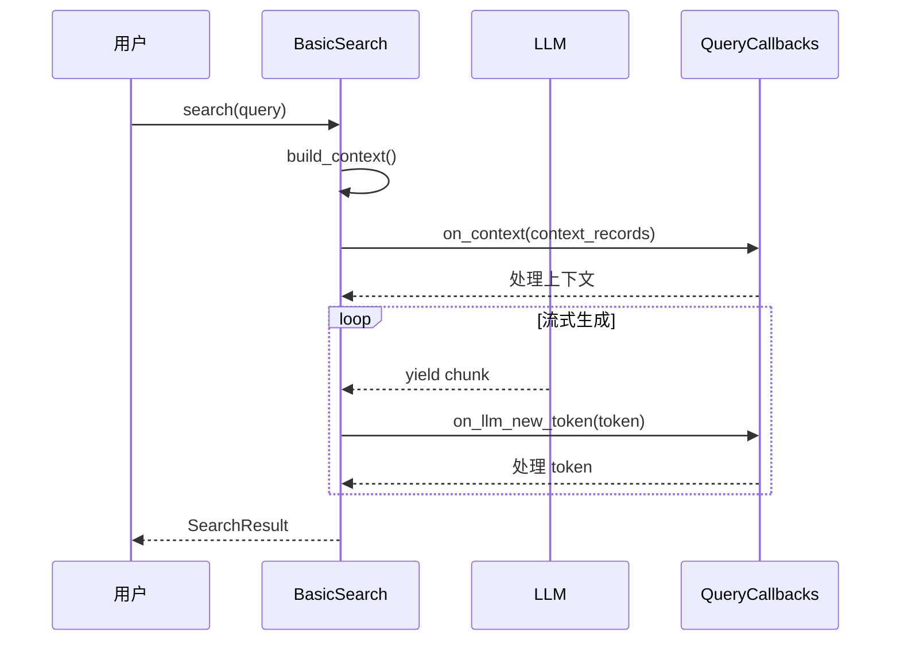


# BasicContextBuilder 提取结果

根据提供的代码，我需要说明以下几点：

1. 提供的代码文件是 `BasicSearch` 类的实现，而非 `BasicContextBuilder` 类的定义
2. `BasicContextBuilder` 是通过导入语句 `from graphrag.query.context_builder.builders import BasicContextBuilder` 引入的
3. 代码中展示了 `BasicContextBuilder` 的**使用方式**和**接口推断**

---

### BasicContextBuilder.build_context

#### 描述

基础上下文构建器的方法，用于根据查询和对话历史构建 RAG 搜索所需的上下文。该方法在 `BasicSearch.search()` 和 `BasicSearch.stream_search()` 中被调用。

#### 参数

- `query`：`str`，用户查询字符串
- `conversation_history`：`ConversationHistory | None`，可选的对话历史记录
- `**kwargs`：任意关键字参数，用于扩展查询参数
- `**context_builder_params`：字典，构建器的额外配置参数

#### 返回值

返回的对象包含以下属性：

- `context_chunks`：str，上下文文本块（用于填充提示词）
- `context_records`：list，上下文记录列表
- `llm_calls`：int，构建上下文所需的 LLM 调用次数
- `prompt_tokens`：int，使用的提示词令牌数
- `output_tokens`：int，输出的令牌数

---

#### 流程图

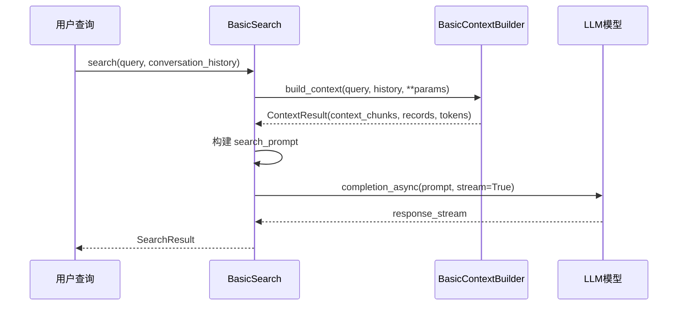

---

#### 带注释源码

```python
# BasicContextBuilder 在 BasicSearch 中的使用示例

# 1. 初始化时注入 BasicContextBuilder
class BasicSearch(BaseSearch[BasicContextBuilder]):
    def __init__(
        self,
        model: "LLMCompletion",
        context_builder: BasicContextBuilder,  # 注入上下文构建器
        tokenizer: Tokenizer | None = None,
        system_prompt: str | None = None,
        response_type: str = "multiple paragraphs",
        callbacks: list[QueryCallbacks] | None = None,
        model_params: dict[str, Any] | None = None,
        context_builder_params: dict | None = None,
    ):
        # ... 初始化逻辑

# 2. 在 search 方法中调用 build_context
async def search(self, query: str, conversation_history: ConversationHistory | None = None, **kwargs) -> SearchResult:
    # 调用上下文构建器构建上下文
    context_result = self.context_builder.build_context(
        query=query,
        conversation_history=conversation_history,
        **kwargs,
        **self.context_builder_params,  # 额外的构建器参数
    )
    
    # context_result 包含:
    # - context_chunks: 用于填充提示词的上下文文本
    # - context_records: 上下文数据记录
    # - llm_calls: LLM 调用统计
    # - prompt_tokens: 提示词令牌数
    # - output_tokens: 输出令牌数

# 3. 构建搜索提示词
search_prompt = self.system_prompt.format(
    context_data=context_result.context_chunks,
    response_type=self.response_type,
)
```

---

### 说明

由于 `BasicContextBuilder` 类的完整源码未在提供的代码文件中，要获取该类的完整定义（包含所有字段和方法），需要查看 `graphrag/query/context_builder/builders.py` 源文件。

**推断的 BasicContextBuilder 接口：**

| 成员 | 类型 | 描述 |
|------|------|------|
| `build_context()` | 方法 | 核心方法，根据查询构建上下文 |
| `max_tokens` | 属性 | 最大令牌数限制 |
| `vector_store` | 属性 | 向量存储实例 |


### `ConversationHistory`

对话历史类，用于在多轮对话场景中存储和管理用户与系统之间的交互历史，使RAG系统能够理解和利用先前的对话上下文来生成更准确的回答。

#### 参数

由于`ConversationHistory`类的具体实现未在当前代码文件中给出详细信息，以下为其在`BasicSearch`类中的使用方式：

-  `conversation_history`：`ConversationHistory | None`，可选参数，表示对话历史对象，用于传递之前的对话上下文。当为`None`时，表示首次对话或不需要历史上下文。

#### 返回值

`ConversationHistory`类本身不直接返回值，它作为上下文信息被传递到`context_builder.build_context()`方法中，用于构建包含历史对话的检索上下文。

#### 流程图

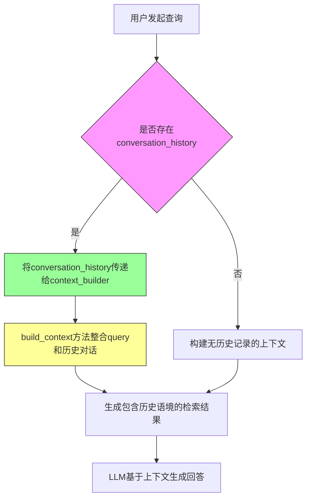

#### 带注释源码

```python
# conversation_history 在 BasicSearch 类中的使用示例

async def search(
    self,
    query: str,
    conversation_history: ConversationHistory | None = None,  # 对话历史，可选参数
    **kwargs,
) -> SearchResult:
    """构建适合单个上下文窗口的RAG搜索上下文并为用户查询生成答案。"""
    
    # 将conversation_history传递给context_builder
    context_result = self.context_builder.build_context(
        query=query,
        conversation_history=conversation_history,  # 传递对话历史对象
        **kwargs,
        **self.context_builder_params,
    )
    
    # ... 后续生成回答的逻辑

async def stream_search(
    self,
    query: str,
    conversation_history: ConversationHistory | None = None,  # 对话历史，可选参数
) -> AsyncGenerator[str, None]:
    """构建适合单个上下文窗口的基本搜索上下文并为用户查询生成答案。"""
    
    # 同样传递conversation_history到context_builder
    context_result = self.context_builder.build_context(
        query=query,
        conversation_history=conversation_history,  # 传递对话历史对象
        **self.context_builder_params,
    )
    
    # ... 流式回答生成的逻辑
```

**注意**：由于`ConversationHistory`类的具体源代码未在当前文件中提供，以上信息基于代码导入路径`graphrag.query.context_builder.conversation_history`和使用方式进行推断。如需查看该类的完整实现细节，请参考源文件`graphrag/query/context_builder/conversation_history.py`。


### `BaseSearch`

搜索抽象基类，定义了 RAG 搜索的通用接口和流程，包括模型调用、上下文构建、结果生成等核心逻辑。子类需要实现具体的搜索策略。

参数：

-  `model`：`LLMCompletion`，大语言模型实例，用于生成回答
-  `context_builder`：`BasicContextBuilder`，上下文构建器，用于构建搜索上下文
-  `tokenizer`：`Tokenizer | None`，分词器，用于计算 token 数量
-  `model_params`：`dict[str, Any] | None`，模型参数配置
-  `context_builder_params`：`dict | None`，上下文构建器参数

返回值：`SearchResult`，包含回答、上下文数据、token 统计等信息

#### 流程图

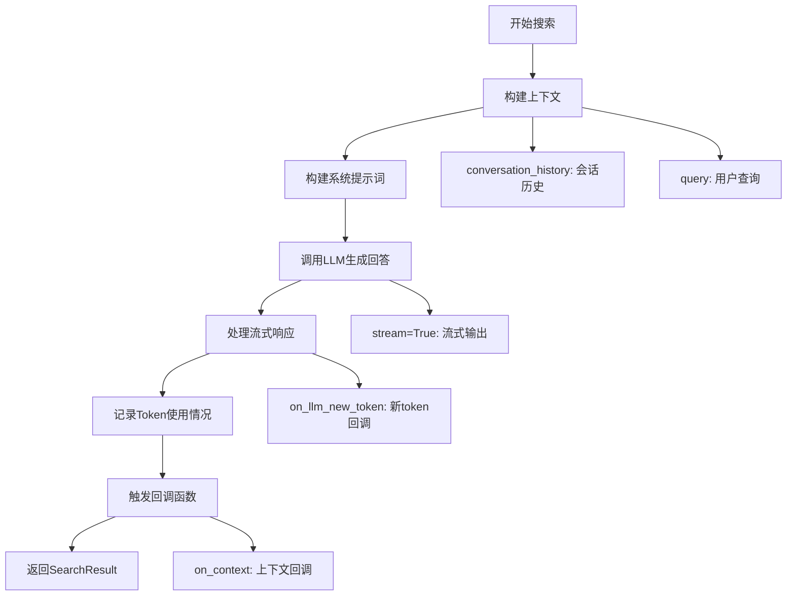

#### 带注释源码

```python
# BaseSearch 抽象基类定义（推断）
from abc import ABC, abstractmethod
from typing import Generic, TypeVar, AsyncGenerator
from dataclasses import dataclass

# 泛型类型：上下文构建器
ContextBuilderType = TypeVar("ContextBuilderType")

@dataclass
class SearchResult:
    """搜索结果数据类"""
    response: str                          # LLM生成的回答
    context_data: list                    # 上下文数据记录
    context_text: str                      # 上下文文本
    completion_time: float                # 完成耗时
    llm_calls: int                         # LLM调用次数
    prompt_tokens: int                     # 提示词token数
    output_tokens: int                     # 输出token数
    llm_calls_categories: dict            # 按类别统计的LLM调用
    prompt_tokens_categories: dict        # 按类别统计的提示词token
    output_tokens_categories: dict        # 按类别统计的输出token


class BaseSearch(ABC, Generic[ContextBuilderType]):
    """
    搜索抽象基类
    
    定义了RAG搜索的通用接口，子类实现具体搜索策略
    """
    
    def __init__(
        self,
        model: "LLMCompletion",
        context_builder: ContextBuilderType,
        tokenizer: Tokenizer | None = None,
        model_params: dict[str, Any] | None = None,
        context_builder_params: dict | None = None,
    ):
        """
        初始化搜索基类
        
        Args:
            model: 大语言模型实例
            context_builder: 上下文构建器
            tokenizer: 分词器
            model_params: 模型参数
            context_builder_params: 上下文构建器参数
        """
        self.model = model
        self.context_builder = context_builder
        self.tokenizer = tokenizer or Tokenizer()
        self.model_params = model_params or {}
        self.context_builder_params = context_builder_params or {}
    
    @abstractmethod
    async def search(
        self,
        query: str,
        conversation_history: "ConversationHistory | None" = None,
        **kwargs,
    ) -> SearchResult:
        """
        执行搜索并返回结果
        
        Args:
            query: 用户查询字符串
            conversation_history: 会话历史记录
            **kwargs: 其他参数
            
        Returns:
            SearchResult: 包含回答和元数据的搜索结果
        """
        pass
    
    @abstractmethod
    async def stream_search(
        self,
        query: str,
        conversation_history: "ConversationHistory | None" = None,
    ) -> AsyncGenerator[str, None]:
        """
        流式搜索，实时返回回答片段
        
        Args:
            query: 用户查询字符串
            conversation_history: 会话历史记录
            
        Yields:
            str: 回答的文本片段
        """
        pass
```


### SearchResult

SearchResult 是搜索结果的数据类，用于封装RAG搜索的完整结果，包含响应文本、上下文数据、上下文文本、耗时、令牌使用统计等信息。

参数：

- 无（构造函数参数来自调用处）

返回值：SearchResult 类实例

#### 流程图

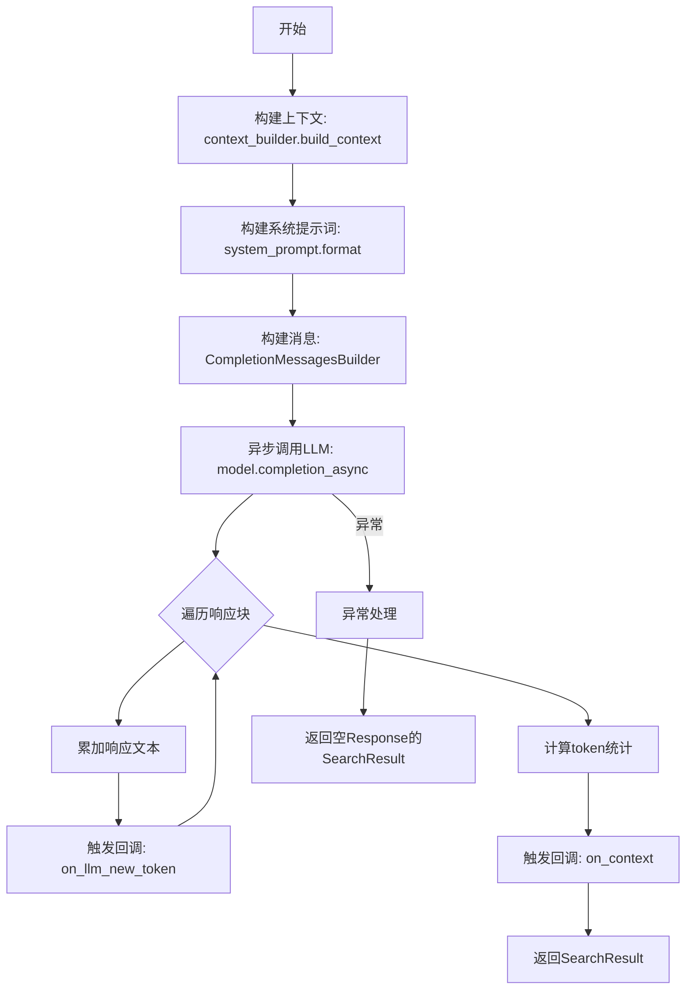

#### 带注释源码

```python
# SearchResult 是从 graphrag.query.structured_search.base 导入的数据类
# 下面展示在 BasicSearch.search 方法中创建 SearchResult 实例的代码

# 正常情况下的返回
return SearchResult(
    response=response,  # LLM生成的响应文本
    context_data=context_result.context_records,  # 上下文字典记录列表
    context_text=context_result.context_chunks,  # 上下文文本块列表
    completion_time=time.time() - start_time,  # 完成耗时（秒）
    llm_calls=1,  # LLM调用次数
    prompt_tokens=len(self.tokenizer.encode(search_prompt)),  # 提示词token数
    output_tokens=sum(output_tokens.values()),  # 输出token总数
    llm_calls_categories=llm_calls,  # 按类别统计的LLM调用次数
    prompt_tokens_categories=prompt_tokens,  # 按类别统计的提示词token数
    output_tokens_categories=output_tokens,  # 按类别统计的输出token数
)

# 异常情况下的返回
return SearchResult(
    response="",  # 空响应
    context_data=context_result.context_records,
    context_text=context_result.context_chunks,
    completion_time=time.time() - start_time,
    llm_calls=1,
    prompt_tokens=len(self.tokenizer.encode(search_prompt)),
    output_tokens=0,  # 输出token为0
    llm_calls_categories=llm_calls,
    prompt_tokens_categories=prompt_tokens,
    output_tokens_categories=output_tokens,
)
```

#### SearchResult 类结构（推断）

基于代码中的使用方式，SearchResult 类的结构如下：

| 字段名称 | 类型 | 描述 |
|---------|------|------|
| response | str | LLM生成的响应文本 |
| context_data | list | 上下文字典记录列表 |
| context_text | list | 上下文文本块列表 |
| completion_time | float | 完成耗时（秒） |
| llm_calls | int | LLM调用总次数 |
| prompt_tokens | int | 提示词总token数 |
| output_tokens | int | 输出总token数 |
| llm_calls_categories | dict | 按类别统计的LLM调用次数 |
| prompt_tokens_categories | dict | 按类别统计的提示词token数 |
| output_tokens_categories | dict | 按类别统计的输出token数 |


### `LLMCompletion`

LLMCompletion 是一个抽象接口，定义了与大语言模型交互的异步完成能力。在 BasicSearch 类中，它被用作模型对象，用于执行搜索查询的 LLM 调用。

参数：

- `messages`：`list[dict[str, Any]]`，构建好的消息列表，包含系统消息和用户消息
- `stream`：`bool`，是否以流式方式返回结果
- `**model_params`：`dict[str, Any]`（可选），传递给模型的额外参数，如温度、最大 token 数等

返回值：`AsyncIterator[LLMCompletionChunk]`（异步迭代器），流式返回的 LLM 完成块，包含文本内容和其他元数据

#### 流程图

```mermaid
flowchart TD
    A[开始调用 LLMCompletion.completion_async] --> B[构建消息列表]
    B --> C[调用 model.completion_async]
    C --> D{是否流式?}
    D -->|是| E[返回 AsyncIterator<LLMCompletionChunk>]
    D -->|否| F[返回完整响应]
    E --> G[逐个迭代 chunks]
    G --> H[提取 chunk.choices[0].delta.content]
    H --> I{还有更多 chunks?}
    I -->|是| G
    I -->|否| J[返回完整响应文本]
```

#### 带注释源码

```python
# 在 BasicSearch.__init__ 中定义
def __init__(
    self,
    model: "LLMCompletion",  # LLMCompletion 接口实例
    context_builder: BasicContextBuilder,
    tokenizer: Tokenizer | None = None,
    system_prompt: str | None = None,
    response_type: str = "multiple paragraphs",
    callbacks: list[QueryCallbacks] | None = None,
    model_params: dict[str, Any] | None = None,
    context_builder_params: dict | None = None,
):
    """
    初始化 BasicSearch 实例
    
    参数:
        model: 实现 LLMCompletion 接口的模型实例，负责执行 LLM 调用
        context_builder: 上下文构建器，用于构建搜索上下文
        tokenizer: 分词器，用于计算 token 数量
        system_prompt: 系统提示词模板
        response_type: 响应类型描述
        callbacks: 查询回调函数列表
        model_params: 传递给 LLM 的额外参数
        context_builder_params: 传递给上下文构建器的额外参数
    """

# 在 BasicSearch.search 方法中调用
response_stream: AsyncIterator[LLMCompletionChunk] = (
    self.model.completion_async(
        messages=messages_builder.build(),  # 构建好的消息列表
        stream=True,  # 启用流式输出
        **self.model_params,  # 额外的模型参数
    )
)  # type: ignore

"""
调用 LLMCompletion 接口的 completion_async 方法

参数说明:
- messages: 由 CompletionMessagesBuilder 构建的消息列表，包含:
  - 系统消息: 格式化的搜索提示，包含上下文数据和响应类型
  - 用户消息: 原始查询文本
- stream: True 表示使用流式输出，逐块返回 LLM 响应
- **self.model_params: 额外的模型参数，如 temperature, max_tokens 等

返回值:
- AsyncIterator[LLMCompletionChunk]: 异步迭代器，每次迭代返回一个 LLMCompletionChunk
  包含 choices 列表，每个 choice 包含 delta 内容块
"""

# 在 BasicSearch.stream_search 方法中的类似调用
response_stream: AsyncIterator[
    LLMCompletionChunk
] = await self.model.completion_async(
    messages=messages_builder.build(),
    stream=True,
    **self.model_params,
)  # type: ignore

"""
在 stream_search 方法中同样调用 LLMCompletion 接口
不同之处在于此方法是异步生成器，直接 yield 每个 token
"""
```


### `LLMCompletionChunk`

这是从外部模块 `graphrag_llm.types` 导入的 LLM 流式响应块类型，用于表示大型语言模型流式输出中的单个数据块。该类型在 `BasicSearch` 类的 `search` 和 `stream_search` 方法中作为异步迭代器的基础类型使用，用于处理来自 LLM 的流式响应。

参数： N/A（这是外部导入的类型定义，非函数/方法）

返回值： N/A（这是外部导入的类型定义，非函数/方法）

#### 流程图

```mermaid
graph TD
    A[LLMCompletionChunk 类型] --> B[导入自 graphrag_llm.types]
    B --> C[在 BasicSearch.search 中使用]
    B --> D[在 BasicSearch.stream_search 中使用]
    C --> E[AsyncIterator[LLMCompletionChunk]]
    D --> F[AsyncIterator[LLMCompletionChunk]]
    E --> G[遍历流式响应块]
    F --> G
    G --> H[提取 chunk.choices[0].delta.content]
```

#### 带注释源码

```python
# 从 typing 导入 TYPE_CHECKING，用于类型检查时的导入
from typing import TYPE_CHECKING, Any

# 在 TYPE_CHECKING 块中导入 LLMCompletionChunk 类型
# 这样可以避免在运行时导入可能不存在的类型，同时保留类型提示功能
if TYPE_CHECKING:
    from graphrag_llm.completion import LLMCompletion
    from graphrag_llm.types import LLMCompletionChunk  # LLM流式响应块类型

# 在 BasicSearch.search 方法中使用 LLMCompletionChunk 类型
async def search(
    self,
    query: str,
    conversation_history: ConversationHistory | None = None,
    **kwargs,
) -> SearchResult:
    # ...
    # 定义异步流式响应迭代器，类型为 AsyncIterator[LLMCompletionChunk]
    response_stream: AsyncIterator[LLMCompletionChunk] = (
        self.model.completion_async(
            messages=messages_builder.build(),
            stream=True,
            **self.model_params,
        )
    )  # type: ignore

    # 异步遍历流式响应块
    async for chunk in response_stream:
        # 从每个块中提取内容
        response_text = chunk.choices[0].delta.content or ""
        for callback in self.callbacks:
            callback.on_llm_new_token(response_text)
        response += response_text

# 在 BasicSearch.stream_search 方法中同样使用 LLMCompletionChunk
async def stream_search(
    self,
    query: str,
    conversation_history: ConversationHistory | None = None,
) -> AsyncGenerator[str, None]:
    # ...
    response_stream: AsyncIterator[
        LLMCompletionChunk
    ] = await self.model.completion_async(
        messages=messages_builder.build(),
        stream=True,
        **self.model_params,
    )  # type: ignore

    async for chunk in response_stream:
        response_text = chunk.choices[0].delta.content or ""
        for callback in self.callbacks:
            callback.on_llm_new_token(response_text)
        yield response_text
```

#### 补充说明

- **类型来源**：`LLMCompletionChunk` 是从 `graphrag_llm.types` 模块导入的外部类型，表示 LLM 流式响应的单个块
- **典型结构**：根据 OpenAI 的流式响应格式，该类型通常包含 `choices` 数组，每个 choice 包含 `delta` 对象，`delta` 对象包含 `content` 字段
- **使用场景**：用于支持 LLM 的流式输出，使系统能够实时处理和传输 LLM 生成的文本内容
- **相关类**：`BasicSearch` 类使用此类型来实现两种搜索方式：普通的 `search` 方法和流式的 `stream_search` 方法


### `BasicSearch.__init__`

初始化 BasicSearch 实例，用于配置基本搜索模式的核心组件，包括 LLM 模型、上下文构建器、分词器、系统提示词等。

参数：

- `model`：`LLMCompletion`，用于处理查询的 LLM 模型实例
- `context_builder`：`BasicContextBuilder`，用于构建搜索上下文的上下文构建器
- `tokenizer`：`Tokenizer | None`，可选的分词器，用于对文本进行分词处理
- `system_prompt`：`str | None`，可选的系统提示词，若为 None 则使用默认的 BASIC_SEARCH_SYSTEM_PROMPT
- `response_type`：`str`，响应类型，默认为 "multiple paragraphs"
- `callbacks`：`list[QueryCallbacks] | None`，可选的查询回调列表，用于处理 LLM 生成过程中的事件
- `model_params`：`dict[str, Any] | None`，可选的模型参数字典，用于配置 LLM 的行为
- `context_builder_params`：`dict | None`，可选的上下文构建器参数字典，默认为空字典

返回值：`None`，无返回值（通过调用父类构造函数进行初始化）

#### 流程图

```mermaid
flowchart TD
    A[开始 __init__] --> B[调用 super().__init__ 初始化基类]
    B --> C[设置 self.system_prompt]
    C --> D[设置 self.callbacks]
    D --> E[设置 self.response_type]
    E --> F[结束 __init__]
```

#### 带注释源码

```python
def __init__(
    self,
    model: "LLMCompletion",
    context_builder: BasicContextBuilder,
    tokenizer: Tokenizer | None = None,
    system_prompt: str | None = None,
    response_type: str = "multiple paragraphs",
    callbacks: list[QueryCallbacks] | None = None,
    model_params: dict[str, Any] | None = None,
    context_builder_params: dict | None = None,
):
    """
    初始化 BasicSearch 实例。

    参数:
        model: LLM 模型实例，用于处理查询和生成响应
        context_builder: 上下文构建器，用于构建搜索上下文
        tokenizer: 可选的分词器，若为 None 则使用默认配置
        system_prompt: 可选的系统提示词，若为 None 则使用默认提示
        response_type: 响应类型，默认为 "multiple paragraphs"
        callbacks: 可选的查询回调列表，用于处理 LLM 生成事件
        model_params: 可选的模型参数字典
        context_builder_params: 可选的上下文构建器参数字典
    """
    # 调用父类 BaseSearch 的构造函数，初始化基类属性
    super().__init__(
        model=model,
        context_builder=context_builder,
        tokenizer=tokenizer,
        model_params=model_params,
        context_builder_params=context_builder_params or {},  # 确保不为 None
    )
    # 设置系统提示词，若未提供则使用默认的 BASIC_SEARCH_SYSTEM_PROMPT
    self.system_prompt = system_prompt or BASIC_SEARCH_SYSTEM_PROMPT
    # 设置回调列表，若未提供则使用空列表
    self.callbacks = callbacks or []
    # 设置响应类型
    self.response_type = response_type
```


### `BasicSearch.search`

该方法是一个异步搜索方法，通过构建RAG（检索增强生成）上下文来回答用户查询。它首先使用上下文构建器获取相关的上下文数据，然后结合系统提示词调用大语言模型生成答案，并返回包含响应、上下文和统计信息的SearchResult对象。

参数：

- `query`：`str`，用户输入的搜索查询字符串
- `conversation_history`：`ConversationHistory | None`，可选的对话历史记录，用于提供会话上下文
- `**kwargs`：任意关键字参数，传递给上下文构建器

返回值：`SearchResult`，包含模型生成的响应、上下文数据、上下文文本、完成时间、LLM调用次数、提示词令牌数、输出令牌数以及各环节的分类统计信息

#### 流程图

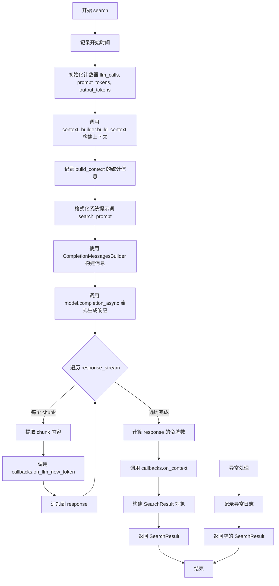

#### 带注释源码

```python
async def search(
    self,
    query: str,
    conversation_history: ConversationHistory | None = None,
    **kwargs,
) -> SearchResult:
    """Build rag search context that fits a single context window and generate answer for the user query."""
    # 记录搜索开始时间，用于计算总耗时
    start_time = time.time()
    # 初始化搜索提示词为空字符串
    search_prompt = ""
    # 初始化统计字典：记录LLM调用次数、提示词令牌数、输出令牌数
    llm_calls, prompt_tokens, output_tokens = {}, {}, {}

    # 调用上下文构建器，为查询构建相关的上下文内容
    # 包含对话历史和额外的关键字参数
    context_result = self.context_builder.build_context(
        query=query,
        conversation_history=conversation_history,
        **kwargs,
        **self.context_builder_params,
    )

    # 记录构建上下文环节的LLM调用次数和令牌统计
    llm_calls["build_context"] = context_result.llm_calls
    prompt_tokens["build_context"] = context_result.prompt_tokens
    output_tokens["build_context"] = context_result.output_tokens

    # 调试日志：记录生成答案的开始时间和查询内容
    logger.debug("GENERATE ANSWER: %s. QUERY: %s", start_time, query)
    try:
        # 使用系统提示词模板格式化上下文数据，生成最终提示词
        # 包含检索到的上下文片段和期望的响应类型
        search_prompt = self.system_prompt.format(
            context_data=context_result.context_chunks,
            response_type=self.response_type,
        )

        # 使用消息构建器创建包含系统消息和用户消息的对话列表
        messages_builder = (
            CompletionMessagesBuilder()
            .add_system_message(search_prompt)  # 添加系统提示词
            .add_user_message(query)              # 添加用户查询
        )

        # 初始化响应字符串，用于累积流式返回的内容
        response = ""

        # 调用模型的异步流式补全接口，生成回答
        response_stream: AsyncIterator[LLMCompletionChunk] = (
            self.model.completion_async(
                messages=messages_builder.build(),
                stream=True,  # 启用流式输出
                **self.model_params,
            )
        )  # type: ignore

        # 异步迭代处理流式返回的每个chunk
        async for chunk in response_stream:
            # 提取chunk中的内容，若无内容则为空字符串
            response_text = chunk.choices[0].delta.content or ""
            # 遍历所有回调，通知每个chunk的新令牌
            for callback in self.callbacks:
                callback.on_llm_new_token(response_text)
            # 累加响应内容
            response += response_text

        # 记录响应生成的LLM调用次数为1
        llm_calls["response"] = 1
        # 计算提示词的令牌数量
        prompt_tokens["response"] = len(self.tokenizer.encode(search_prompt))
        # 计算生成的响应内容的令牌数量
        output_tokens["response"] = len(self.tokenizer.encode(response))

        # 遍历所有回调，传递构建好的上下文记录
        for callback in self.callbacks:
            callback.on_context(context_result.context_records)

        # 返回完整的搜索结果对象，包含响应、上下文、时间和统计信息
        return SearchResult(
            response=response,                              # 模型生成的文本响应
            context_data=context_result.context_records,    # 上下文数据记录
            context_text=context_result.context_chunks,     # 上下文文本片段
            completion_time=time.time() - start_time,       # 完成耗时
            llm_calls=1,                                    # LLM总调用次数
            prompt_tokens=len(self.tokenizer.encode(search_prompt)),  # 提示词总令牌数
            output_tokens=sum(output_tokens.values()),      # 输出总令牌数
            llm_calls_categories=llm_calls,                 # 分类LLM调用统计
            prompt_tokens_categories=prompt_tokens,         # 分类提示词令牌统计
            output_tokens_categories=output_tokens,         # 分类输出令牌统计
        )

    # 异常捕获：处理搜索过程中可能出现的任何异常
    except Exception:
        # 记录异常详情到日志
        logger.exception("Exception in _asearch")
        # 返回包含空响应但保留上下文信息的SearchResult
        return SearchResult(
            response="",                                    # 异常时返回空响应
            context_data=context_result.context_records,
            context_text=context_result.context_chunks,
            completion_time=time.time() - start_time,
            llm_calls=1,
            prompt_tokens=len(self.tokenizer.encode(search_prompt)),
            output_tokens=0,                                # 异常时输出令牌数为0
            llm_calls_categories=llm_calls,
            prompt_tokens_categories=prompt_tokens,
            output_tokens_categories=output_tokens,
        )
```

#### 关键组件信息

| 组件名称 | 一句话描述 |
|---------|-----------|
| `BasicSearch` | 继承自BaseSearch的基础搜索类，协调上下文构建和LLM生成流程 |
| `SearchResult` | 存储搜索结果的数据类，包含响应文本、上下文、时间和令牌统计 |
| `BasicContextBuilder` | 负责构建RAG检索上下文的构建器 |
| `CompletionMessagesBuilder` | 用于构建LLM消息列表的辅助类 |
| `QueryCallbacks` | 查询回调接口，用于处理流式令牌和上下文通知 |
| `ConversationHistory` | 管理对话历史的类，提供历史消息记录 |

#### 潜在的技术债务或优化空间

1. **异常处理过于宽泛**：使用 `except Exception` 捕获所有异常并返回空响应，可能隐藏具体的业务逻辑错误，建议区分不同异常类型进行针对性处理

2. **日志记录变量使用不当**：`logger.debug("GENERATE ANSWER: %s. QUERY: %s", start_time, query)` 中 `start_time` 作为时间戳传入但语义不正确，应使用更有意义的描述

3. **令牌计算重复**：在多个地方使用 `self.tokenizer.encode()` 重复计算同一内容的令牌数，可以提取为工具方法复用

4. **硬编码的LLM调用次数**：在异常返回时硬编码 `llm_calls=1`，但实际可能未成功调用LLM，应根据实际情况调整

5. **类型注解不完整**：部分变量如 `response_stream` 使用了 `# type: ignore` 忽略类型检查，应完善类型定义

#### 其它项目

**设计目标与约束**：
- 设计目标：实现一个通用的RAG搜索流程，支持单轮对话和流式输出
- 约束：依赖外部的LLM模型和上下文构建器，必须处理令牌数量限制

**错误处理与异常设计**：
- 异常捕获后返回空的SearchResult，保留上下文信息以便调试
- 使用logger.exception记录完整堆栈信息
- 异常情况下的令牌统计可能不准确

**数据流与状态机**：
- 搜索流程：查询输入 → 上下文构建 → 提示词格式化 → LLM调用 → 结果返回
- 流式搜索（stream_search）提供增量输出能力，与search方法互补

**外部依赖与接口契约**：
- 依赖 `LLMCompletion` 接口进行模型调用
- 依赖 `BasicContextBuilder` 接口构建上下文
- 依赖 `Tokenizer` 进行令牌计数
- 依赖 `QueryCallbacks` 回调接口进行事件通知


### `BasicSearch.stream_search`

这是一个异步流式搜索方法，用于构建适合单个上下文窗口的基本搜索上下文，并为用户查询生成答案。该方法通过异步生成器逐块返回LLM流式输出的响应文本，支持对话历史上下文，并在每个新令牌生成时触发回调。

参数：

- `self`：`BasicSearch`，BasicSearch 类的实例，包含模型、上下文构建器和回调配置
- `query`：`str`，用户输入的搜索查询字符串
- `conversation_history`：`ConversationHistory | None`，可选的对话历史，用于提供上下文对话信息，默认为 None

返回值：`AsyncGenerator[str, None]`，异步生成器，逐块返回字符串类型的响应文本片段

#### 流程图

```mermaid
flowchart TD
    A([开始 stream_search]) --> B[记录开始时间 start_time]
    B --> C[调用 context_builder.build_context<br/>构建搜索上下文]
    C --> D[格式化系统提示词<br/>使用 search_prompt.format]
    D --> E[构建消息队列<br/>添加系统消息和用户消息]
    E --> F[触发回调 on_context<br/>通知上下文已构建]
    F --> G[异步调用 model.completion_async<br/>获取流式响应]
    G --> H{遍历 response_stream}
    H -->|获取 chunk| I[提取 chunk.choices[0].delta.content]
    I --> J[触发回调 on_llm_new_token<br/>通知新令牌生成]
    J --> K[yield 返回 response_text]
    K --> H
    H -->|流结束| L([结束])
```

#### 带注释源码

```python
async def stream_search(
    self,
    query: str,
    conversation_history: ConversationHistory | None = None,
) -> AsyncGenerator[str, None]:
    """Build basic search context that fits a single context window and generate answer for the user query."""
    # 记录搜索开始时间，用于后续计算耗时
    start_time = time.time()

    # 调用上下文构建器，基于查询和对话历史构建搜索上下文
    # 包含检索到的相关文档片段和上下文记录
    context_result = self.context_builder.build_context(
        query=query,
        conversation_history=conversation_history,
        **self.context_builder_params,
    )
    
    # 调试日志：记录生成答案的开始时间和查询内容
    logger.debug("GENERATE ANSWER: %s. QUERY: %s", start_time, query)
    
    # 格式化系统提示词，注入上下文数据（检索到的文档片段）
    # 和指定的响应类型（如 multiple paragraphs）
    search_prompt = self.system_prompt.format(
        context_data=context_result.context_chunks, 
        response_type=self.response_type
    )

    # 使用消息构建器构造完整的提示消息
    # 包含系统提示词（包含上下文）和用户查询
    messages_builder = (
        CompletionMessagesBuilder()
        .add_system_message(search_prompt)
        .add_user_message(query)
    )

    # 触发回调，通知上下文记录已准备就绪
    for callback in self.callbacks:
        callback.on_context(context_result.context_records)

    # 异步调用 LLM 模型，以流式模式生成响应
    # stream=True 启用流式输出，逐块返回生成的内容
    response_stream: AsyncIterator[
        LLMCompletionChunk
    ] = await self.model.completion_async(
        messages=messages_builder.build(),
        stream=True,
        **self.model_params,
    )  # type: ignore

    # 异步迭代流式响应块
    async for chunk in response_stream:
        # 从 chunk 中提取文本内容（可能为 None，需处理）
        response_text = chunk.choices[0].delta.content or ""
        
        # 对每个新生成的文本块，触发回调通知
        for callback in self.callbacks:
            callback.on_llm_new_token(response_text)
        
        # 通过 yield 将文本块作为生成器的一项返回
        # 调用者可以异步迭代获取完整的响应流
        yield response_text
```

## 关键组件


### BasicSearch 类

搜索编排器，用于基础搜索模式。继承自BaseSearch类，负责协调上下文构建、LLM调用和结果生成。

### search 方法

异步搜索方法，接收用户查询和会话历史，构建RAG上下文并生成答案。返回SearchResult对象，包含响应内容、上下文数据、token统计等信息。

### stream_search 方法

流式搜索方法，与search类似但以流式方式返回LLM响应。使用async generator逐步yield响应文本，实现实时流式输出。

### context_builder

上下文构建器(BasicContextBuilder)，负责根据查询从向量存储中检索相关文本块，构建适合单一上下文窗口的上下文数据。

### Tokenizer

分词器组件，用于对提示和响应进行编码/解码，统计token数量以用于成本计算和上下文窗口管理。

### QueryCallbacks

查询回调机制，包含on_llm_new_token和on_context等回调，用于在LLM生成token和构建上下文时执行自定义逻辑(如日志记录、流式输出等)。

### CompletionMessagesBuilder

消息构建器工具类，用于构建符合LLM API格式的消息列表，支持添加system message和user message。

### SearchResult

搜索结果数据结构，包含response(响应文本)、context_data(上下文记录)、context_text(上下文块)、completion_time(完成时间)、llm_calls_categories、prompt_tokens_categories、output_tokens_categories等字段。

### 系统提示模板

BASIC_SEARCH_SYSTEM_PROMPT，用于指导LLM如何基于检索到的上下文生成回答，格式化时注入context_data和response_type。


## 问题及建议


### 已知问题

- **异常处理过于宽泛且不完整**：捕获所有 `Exception` 但没有区分异常类型，返回的 `SearchResult` 中 `llm_calls=1`，但实际上 LLM 可能并未成功调用，导致统计信息不准确
- **日志记录错误**：`logger.debug("GENERATE ANSWER: %s. QUERY: %s", start_time, query)` 中 `start_time` 是时间戳整数，直接作为格式化字符串传入会导致日志信息可读性差
- **代码重复**：`search` 和 `stream_search` 方法中存在大量重复的上下文构建逻辑、prompt 构建逻辑和 callback 调用代码
- **类型标注不完整**：`llm_calls`、`prompt_tokens`、`output_tokens` 初始化为空字典 `{}`，但后续直接赋值特定键，类型语义不明确
- **参数传递不一致**：`stream_search` 方法签名缺少 `**kwargs` 参数，而 `search` 方法有，导致两者行为不一致
- **Tokenizer 空值风险**：多处调用 `self.tokenizer.encode()` 但未检查 tokenizer 是否为 None，虽然构造函数允许为 None

### 优化建议

- **细化异常处理**：根据不同异常类型进行区分处理，失败时将 `llm_calls` 设为 0 或记录实际失败原因
- **修复日志格式**：使用 `logger.debug("GENERATE ANSWER: %s, QUERY: %s", time.time() - start_time, query)` 或预先格式化
- **提取公共逻辑**：将上下文构建、prompt 构建等重复代码抽取为私有方法如 `_build_context_and_prompt()`
- **完善类型标注**：使用 `TypedDict` 或显式类型定义明确 `llm_calls_categories` 等字典的结构
- **统一方法签名**：为 `stream_search` 添加 `**kwargs` 参数以保持一致性，或在文档中说明差异
- **添加空值检查**：在使用 `self.tokenizer.encode()` 前检查 tokenizer 是否为 None，必要时抛出明确异常或使用默认值

## 其它


### 设计目标与约束

1. **设计目标**：实现一个通用的RAG（检索增强生成）算法，通过向量搜索原始文本块来构建搜索上下文并生成用户查询的答案
2. **约束条件**：
   - 必须继承BaseSearch类并使用BasicContextBuilder
   - 需要支持异步流式输出（streaming）以提升用户体验
   - 必须支持对话历史（ConversationHistory）以实现多轮对话
   - 需要通过回调机制（QueryCallbacks）提供扩展点
   - 必须返回详细的统计数据（llm_calls、prompt_tokens、output_tokens等）

### 错误处理与异常设计

1. **异常捕获**：在search方法中使用try-except捕获所有异常，记录日志后返回包含空response的SearchResult对象
2. **日志记录**：使用logger.exception记录异常堆栈信息，logger.debug记录关键执行节点
3. **降级策略**：发生异常时仍返回context_data和context_text，确保调用方可以获取上下文信息，仅将response置为空字符串
4. **潜在问题**：当前异常处理过于宽泛，所有异常都被捕获并以相同方式处理，无法区分可恢复和不可恢复错误；异常信息未返回给调用方

### 数据流与状态机

1. **search方法数据流**：
   - 输入：query字符串、conversation_history（可选）、kwargs
   - 第一阶段：调用context_builder.build_context()构建检索上下文
   - 第二阶段：格式化system_prompt，组装messages
   - 第三阶段：异步调用model.completion_async()获取流式响应
   - 第四阶段：遍历响应流，触发callbacks.on_llm_new_token()
   - 输出：SearchResult对象包含response、context_data、统计数据

2. **stream_search方法数据流**：与search类似，但直接yield流式响应块而非累积完整响应

3. **状态管理**：
   - 初始状态：等待查询
   - 上下文构建状态：构建检索上下文
   - LLM调用状态：流式接收响应
   - 完成状态：返回结果

### 外部依赖与接口契约

1. **核心依赖**：
   - `LLMCompletion`：大语言模型completion接口，需实现completion_async方法
   - `Tokenizer`：文本编码工具，用于计算token数量
   - `BasicContextBuilder`：上下文构建器，负责检索和格式化上下文
   - `QueryCallbacks`：查询回调接口，定义on_llm_new_token、on_context等方法
   - `CompletionMessagesBuilder`：消息构建工具，用于组装prompt

2. **接口契约**：
   - model.completion_async()：接收messages、stream参数和model_params，返回AsyncIterator[LLMCompletionChunk]
   - context_builder.build_context()：返回包含context_chunks、context_records、llm_calls等属性的结果对象
   - SearchResult：包含response、context_data、context_text、completion_time、llm_calls、prompt_tokens、output_tokens等字段的数据类

### 配置与参数说明

1. **模型参数（model_params）**：字典类型，透传给LLM的配置参数，如temperature、max_tokens等
2. **上下文构建参数（context_builder_params）**：字典类型，透传给context_builder的配置
3. **系统提示（system_prompt）**：使用BASIC_SEARCH_SYSTEM_PROMPT模板，支持format方法注入context_data和response_type
4. **响应类型（response_type）**：默认为"multiple paragraphs"，指定LLM输出格式

### 性能考量与优化建议

1. **流式响应**：使用异步迭代器流式处理LLM响应，减少首Token延迟（TTFT）
2. **Token计算**：在响应生成后统一计算token数量，存在重复计算（构建prompt时计算一次，生成响应后又计算一次）
3. **优化建议**：
   - 考虑缓存tokenizer.encode()结果避免重复计算
   - 异常处理可细化为不同策略
   - 可增加重试机制应对临时性LLM调用失败
   - context_builder_params和kwargs的合并方式可能导致参数覆盖冲突

    