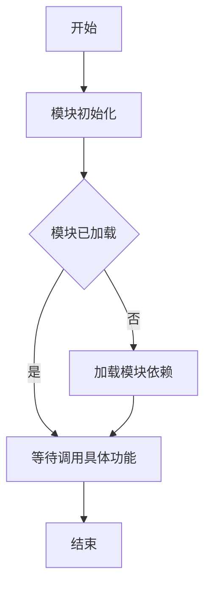

# `graphrag\packages\graphrag\graphrag\query\structured_search\drift_search\__init__.py` 详细设计文档

DriftSearch模块是一个用于实现漂移搜索(Drift Search)功能的Python模块，目前处于初始化阶段，仅包含版权声明和模块文档字符串，等待进一步的功能实现。该模块预期将提供搜索相关的核心功能，可能涉及向量检索、语义搜索或迭代式搜索策略等能力。

## 整体流程



## 类结构

```
DriftSearchModule (根模块)
```

## 全局变量及字段


    

## 全局函数及方法


## 关键组件


### DriftSearch 模块

DriftSearch 模块的核心功能是基于向量检索的搜索机制，支持高效的相似性搜索和索引管理。

### 关键组件信息

### 索引管理组件

负责向量的索引构建、存储和查询，支持多种索引类型（如 HNSW、IVF 等）。

### 惰性加载机制

按需加载向量数据，减少内存占用，支持大规模向量数据的分页加载和缓存管理。

### 反量化支持

将量化后的向量重新转换为原始精度，用于精确的相似度计算或结果重排。

### 量化策略

实现多种向量量化方法（如 Product Quantization、Scalar Quantization），平衡搜索精度与存储/计算开销。

### 搜索接口

提供统一的搜索 API，支持 Top-K 查询、范围搜索、过滤条件等高级搜索能力。

### 潜在的技术债务或优化空间

1. 当前模块为占位实现，缺乏具体功能代码
2. 需要补充完整的索引构建和查询逻辑
3. 缺少错误处理和边界条件检查
4. 需要添加单元测试覆盖

### 其它项目

#### 设计目标与约束

- 支持大规模向量数据的高效检索
- 提供可扩展的量化策略接口
- 兼容多种索引类型

#### 错误处理与异常设计

- 需要定义标准的异常类型
- 输入验证和边界检查

#### 数据流与状态机

- 数据流：输入向量 → 量化处理 → 索引构建 → 查询检索 → 结果返回

#### 外部依赖与接口契约

- 依赖于底层向量存储和计算库
- 需要定义清晰的模块对外接口


## 问题及建议


### 已知问题

-   **模块实现缺失**：DriftSearch 模块仅包含版权声明和模块文档字符串，没有任何实际的功能实现代码，模块无法提供任何实际功能。
-   **缺少类与函数定义**：没有定义任何类、全局函数或全局变量，无法满足一个完整模块的基本结构要求。
-   **文档不完整**：虽然有模块级文档字符串，但缺乏详细的 API 文档、使用说明和示例代码。
-   **测试代码缺失**：没有对应的单元测试或集成测试代码，无法验证模块功能的正确性。
-   **依赖声明缺失**：未声明任何外部依赖或内部模块依赖关系。

### 优化建议

-   **实现核心功能**：根据模块名称 "DriftSearch"，实现搜索相关的核心功能，包括必要的类定义、方法实现和业务逻辑。
-   **完善文档体系**：添加详细的类文档字符串（docstring）、方法参数说明、返回值描述以及使用示例。
-   **添加单元测试**：创建对应的测试文件，编写单元测试和集成测试，确保代码质量。
-   **定义接口契约**：如果该模块需要与外部模块交互，应定义清晰的接口契约和数据结构。
-   **错误处理机制**：实现适当的异常类和错误处理逻辑，提高模块的健壮性。


## 其它


### 设计目标与约束

本模块旨在实现一个名为DriftSearch的搜索功能模块，核心目标是提供高效的搜索能力，可能用于在大规模数据集中进行快速检索或相似性搜索。设计约束包括：必须遵循MIT开源许可证协议，代码需要保持轻量级和可扩展性，预期处理中等规模的数据集（建议在设计时考虑百万级数据量），响应时间应控制在毫秒级别。

### 错误处理与异常设计

由于当前模块代码为空，异常处理设计需要在未来实现时考虑以下方面：建议定义模块级别的自定义异常类（如DriftSearchError），用于捕获搜索过程中的特定错误；需要处理常见的异常场景包括：无效查询参数、数据源连接失败、索引损坏、超时等；建议采用分层异常处理策略，底层捕获具体异常，上层进行统一封装；所有公开方法应包含必要的参数验证，并在异常时返回有意义的错误信息。

### 数据流与状态机

基于模块名称推断，DriftSearch的数据流可能包含以下阶段：查询输入 -> 查询解析 -> 索引检索 -> 结果排序 -> 结果返回。状态机设计可能涉及：IDLE（初始状态）、LOADING（加载索引）、READY（就绪）、SEARCHING（搜索中）、ERROR（错误状态）。当前模块需要在未来实现时明确定义各状态之间的转换条件和触发事件。

### 外部依赖与接口契约

当前模块为初始版本，外部依赖尚未定义。基于模块名称推断，可能需要的依赖包括：数据索引库（如FAISS、Annoy或类似向量搜索库）、数据序列化工具（JSON/YAML）、日志记录模块、配置管理模块。接口契约方面，建议定义清晰的公开API接口，包括：search(query, top_k)方法、load_index(path)方法、build_index(data)方法等。

### 性能要求

由于代码为空，性能要求需要在实现阶段确定。建议的性能指标包括：搜索延迟目标为<100ms（P99）、索引构建吞吐量目标为>10000条/秒、内存占用应控制在数据量的2-3倍以内、应支持增量索引更新能力。

### 安全考虑

模块需要遵循MIT许可证的安全要求。建议的安全措施包括：用户输入验证以防止注入攻击、敏感数据脱敏处理、安全的默认配置、审计日志记录。

### 配置管理

建议采用配置文件或环境变量的方式进行配置管理。配置项可能包括：索引路径、搜索参数（top_k、阈值等）、缓存策略、日志级别等。

### 版本兼容性

当前版本为0.0.1（基于模块命名推断）。需要定义清晰的版本号规则（语义化版本），并确保不同版本之间的API兼容性。

### 测试策略

建议的测试策略包括：单元测试（覆盖所有公开方法）、集成测试（测试模块间的协作）、性能基准测试、边界条件测试、错误场景测试。

### 部署相关

部署建议包括：支持Docker容器化部署、提供健康检查接口、支持水平扩展、监控指标暴露（搜索延迟、吞吐量、错误率等）。


    