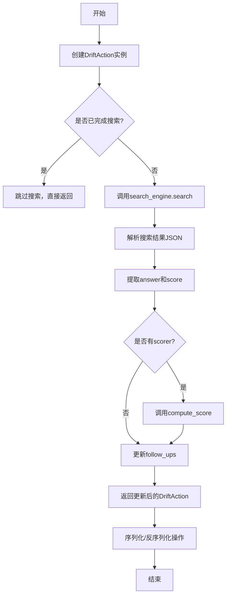
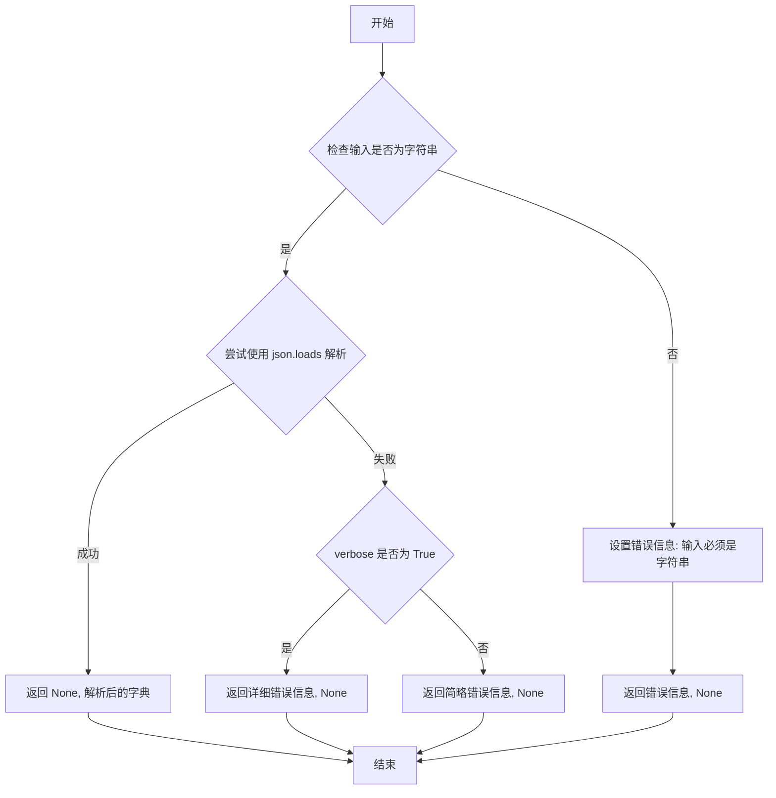
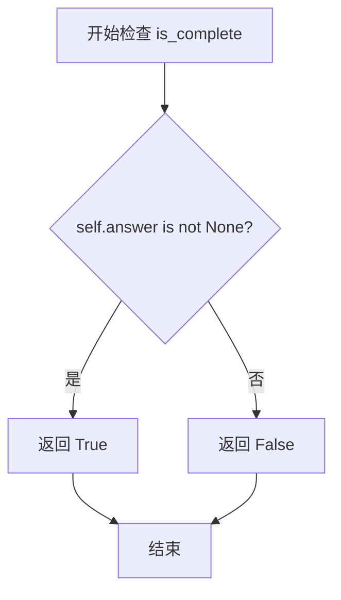
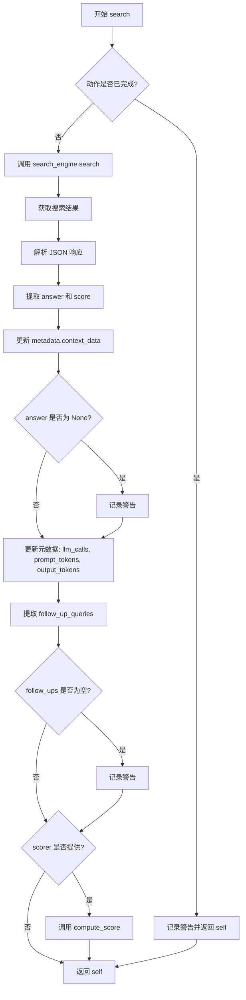
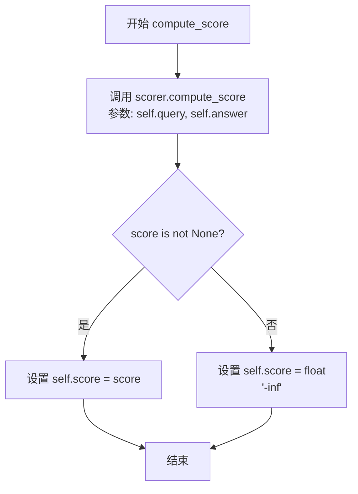
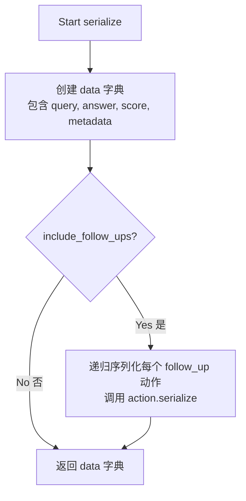
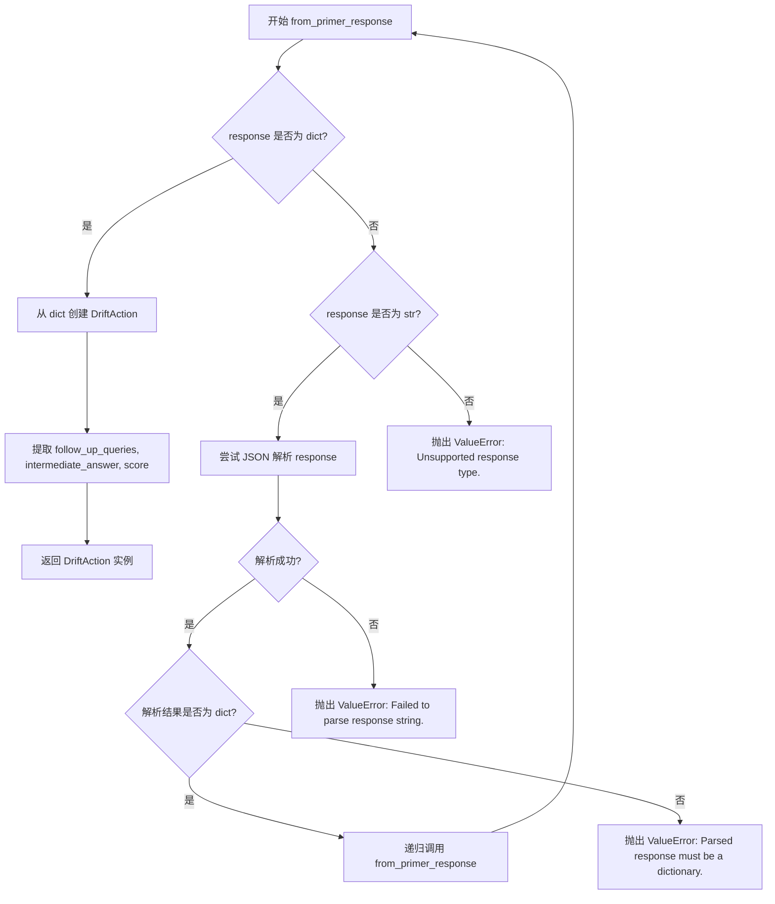
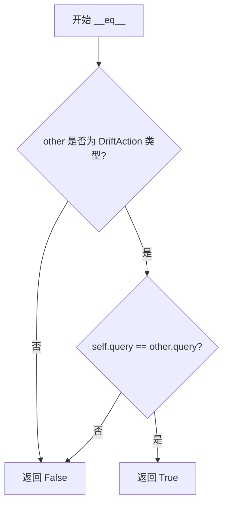

```mermaid
flowchart TD
    A[开始 __hash__] --> B{执行 hash 函数}
    B --> C[返回 hash&#40;self.query&#41;]
    C --> D[结束]
```

# `graphrag\packages\graphrag\graphrag\query\structured_search\drift_search\action.py` 详细设计文档

该文件实现了DRIFT搜索查询状态管理模块，DriftAction类封装了LLM生成的查询动作，包含查询字符串、答案、评分、后续动作和元数据，支持异步搜索执行、分数计算、序列化和反序列化操作，用于构建基于DRIFT算法的多轮对话式搜索系统。

## 整体流程



## 类结构

```
DriftAction (核心动作类)
```

## 全局变量及字段


### `logger`
    
模块级日志记录器，用于记录类内部的运行日志和警告信息

类型：`logging.Logger`
    


### `DriftAction.query`
    
查询字符串，表示该动作要搜索或处理的问题

类型：`str`
    


### `DriftAction.answer`
    
搜索结果答案，当动作完成时存储检索到的答案内容

类型：`str | None`
    


### `DriftAction.score`
    
动作评分，用于衡量该动作对整体查询的贡献程度

类型：`float | None`
    


### `DriftAction.follow_ups`
    
后续动作列表，存储由当前动作产生的子动作或分支查询

类型：`list[DriftAction]`
    


### `DriftAction.metadata`
    
元数据字典，包含llm_calls（调用次数）、prompt_tokens（提示词token数）、output_tokens（输出token数）等统计信息

类型：`dict[str, Any]`
    
    

## 全局函数及方法


### `try_parse_json_object`

从 `graphrag.query.llm.text_utils` 模块导入的 JSON 解析工具函数，用于尝试将字符串解析为 JSON 对象，并返回解析结果和可能的错误信息。

参数：

- `text`：`str`，需要解析的 JSON 字符串输入
- `verbose`：`bool`，可选参数，控制是否输出详细的错误信息（默认为 `False`）

返回值：`(str | None, dict | None)`，返回一个元组，其中第一个元素是错误信息（如果有），第二个元素是解析后的字典对象

#### 流程图



#### 带注释源码

```
# 此源码为基于函数调用方式的推断实现
# 实际定义在 graphrag.query.llm.text_utils 模块中

def try_parse_json_object(text: str, verbose: bool = False) -> tuple[str | None, dict | None]:
    """
    尝试将字符串解析为 JSON 对象。
    
    Args:
        text: 需要解析的 JSON 字符串
        verbose: 是否输出详细错误信息
        
    Returns:
        (错误信息, 解析后的字典) 的元组
    """
    try:
        # 尝试解析 JSON 字符串
        result = json.loads(text)
        
        # 检查解析结果是否为字典类型
        if isinstance(result, dict):
            return None, result  # 成功返回: (None, dict)
        else:
            # 结果不是字典，返回错误
            error_msg = "Result is not a JSON object (dict)" if verbose else None
            return error_msg, None
            
    except json.JSONDecodeError as e:
        # JSON 解析失败
        if verbose:
            return f"JSON decode error: {str(e)}", None
        return None, None
        
    except Exception as e:
        # 其他异常处理
        if verbose:
            return f"Unexpected error: {str(e)}", None
        return None, None
```

> **注意**：由于 `try_parse_json_object` 函数的实际源代码未包含在提供的代码块中，以上源码为基于函数调用方式 `_, response = try_parse_json_object(search_result.response, verbose=False)` 的推断实现。实际实现可能有所不同，请参考 `graphrag/query/llm/text_utils.py` 文件获取完整源码。


### `DriftAction.__init__`

初始化 DriftAction 实例，包含查询、可选答案和后续操作列表。

参数：

-  `query`：`str`，查询字符串
-  `answer`：`str | None`，可选的答案字段
-  `follow_ups`：`list[DriftAction] | None`，可选的后续操作列表

返回值：`None`，无返回值（构造函数）

#### 流程图

```mermaid
flowchart TD
    A[开始 __init__] --> B[接收 query, answer, follow_ups 参数]
    B --> C[设置 self.query = query]
    C --> D[设置 self.answer = answer]
    D --> E[设置 self.score = None]
    E --> F{follow_ups 是否为 None?}
    F -->|是| G[设置 self.follow_ups = []]
    F -->|否| H[设置 self.follow_ups = follow_ups]
    G --> I[初始化 self.metadata 字典]
    H --> I
    I --> J[结束]
```

#### 带注释源码

```python
def __init__(
    self,
    query: str,
    answer: str | None = None,
    follow_ups: list["DriftAction"] | None = None,
):
    """
    Initialize the DriftAction with a query, optional answer, and follow-up actions.

    Args:
        query (str): The query for the action.
        answer (Optional[str]): The answer to the query, if available.
        follow_ups (Optional[list[DriftAction]]): A list of follow-up actions.
    """
    self.query = query  # 设置查询字符串
    self.answer: str | None = answer  # Corresponds to an 'intermediate_answer'
    self.score: float | None = None  # 初始化分数为 None
    self.follow_ups: list[DriftAction] = (
        follow_ups if follow_ups is not None else []
    )  # 如果 follow_ups 为 None，则初始化为空列表
    self.metadata: dict[str, Any] = {
        "llm_calls": 0,
        "prompt_tokens": 0,
        "output_tokens": 0,
    }  # 初始化元数据字典，用于跟踪 LLM 调用统计
```


### `DriftAction.is_complete`

检查动作是否完成（即是否有答案可用）。该属性通过判断 `answer` 字段是否存在来确定动作是否已完成。

参数：

- `self`：`DriftAction`，隐式参数，调用该属性的实例本身

返回值：`bool`，如果动作包含答案则返回 `True`，否则返回 `False`

#### 流程图



#### 带注释源码

```python
@property
def is_complete(self) -> bool:
    """
    Check if the action is complete (i.e., an answer is available).
    
    该属性方法用于判断当前动作是否已完成。
    当 answer 字段不为 None 时，表示 LLM 已生成答案，
    动作处于完成状态。
    
    Returns
    -------
    bool
        True if self.answer is not None, False otherwise.
    """
    return self.answer is not None
```


### `DriftAction.search`

该方法是一个异步搜索方法，用于执行搜索查询并使用搜索结果更新 DriftAction 对象。它调用搜索引擎获取结果，解析 JSON 响应，提取答案、分数和后续查询，同时收集令牌使用情况的元数据。如果提供了评分器，还会计算动作的分数。

参数：

- `self`：`DriftAction`，DriftAction 实例本身（隐式参数）
- `search_engine`：`Any`，用于执行查询的搜索引擎对象
- `global_query`：`str`，全局查询字符串，用于漂移查询
- `k_followups`：`int`，后续查询的数量
- `scorer`：`Any`（可选），用于计算动作分数的评分器

返回值：`DriftAction`，更新后的动作对象，包含搜索结果、分数和元数据

#### 流程图



#### 带注释源码

```python
async def search(
    self,
    search_engine: Any,
    global_query: str,
    k_followups: int,
    scorer: Any = None,
):
    """
    Execute an asynchronous search using the search engine, and update the action with the results.

    If a scorer is provided, compute the score for the action.

    Args:
        search_engine (Any): The search engine to execute the query.
        global_query (str): The global query string.
        scorer (Any, optional): Scorer to compute scores for the action.

    Returns
    -------
    self : DriftAction
        Updated action with search results.
    """
    # 检查动作是否已完成（已有答案），如果已完成则跳过搜索
    if self.is_complete:
        logger.warning("Action already complete. Skipping search.")
        return self

    # 调用搜索执行异步搜索，传入本地查询、全局查询和后续查询数量
    search_result = await search_engine.search(
        query=self.query,
        drift_query=global_query,
        k_followups=k_followups,
    )

    # 尝试解析搜索结果中的 JSON 对象，如果不成功则返回空响应
    # 这样不会抛出异常，而是让分数为 -inf 来处理
    _, response = try_parse_json_object(search_result.response, verbose=False)

    # 从响应中提取答案和分数，更新动作状态
    self.answer = response.pop("response", None)
    self.score = float(response.pop("score", "-inf"))
    # 将搜索的上下文数据存储到元数据中
    self.metadata.update({"context_data": search_result.context_data})

    # 如果未找到答案，记录警告日志
    if self.answer is None:
        logger.warning("No answer found for query: %s", self.query)

    # 更新 LLM 调用统计和令牌使用情况
    self.metadata["llm_calls"] += 1
    self.metadata["prompt_tokens"] += search_result.prompt_tokens
    self.metadata["output_tokens"] += search_result.output_tokens

    # 提取后续查询列表
    self.follow_ups = response.pop("follow_up_queries", [])
    # 如果没有后续查询，记录警告
    if not self.follow_ups:
        logger.warning("No follow-up actions found for response: %s", response)

    # 如果提供了评分器，则计算动作分数
    if scorer:
        self.compute_score(scorer)

    # 返回更新后的动作对象
    return self
```


### `DriftAction.compute_score`

该方法用于使用提供的评分器（scorer）计算动作的分数，并将结果存储在动作的 score 属性中。如果评分为 None，则默认设置为负无穷（-inf），以便于排序处理。

参数：

- `scorer`：`Any`，用于计算分数的评分器对象

返回值：`None`，该方法无返回值，通过更新实例的 `self.score` 属性来传递结果

#### 流程图



#### 带注释源码

```python
def compute_score(self, scorer: Any):
    """
    Compute the score for the action using the provided scorer.

    Args:
        scorer (Any): The scorer to compute the score.
    """
    # 使用评分器计算查询和答案的分数
    score = scorer.compute_score(self.query, self.answer)
    
    # 如果分数为None，则默认为负无穷（-inf），便于排序处理
    # 否则使用计算出的分数
    self.score = (
        score if score is not None else float("-inf")
    )  # Default to -inf for sorting
```


### `DriftAction.serialize`

将 DriftAction 对象序列化为字典格式，支持可选是否包含 follow-up 动作的递归序列化。

参数：

- `include_follow_ups`：`bool`，是否在序列化结果中包含 follow-up 动作，默认为 True

返回值：`dict[str, Any]`：序列化后的动作字典，包含 query、answer、score、metadata 以及可选的 follow_ups

#### 流程图



#### 带注释源码

```python
def serialize(self, include_follow_ups: bool = True) -> dict[str, Any]:
    """
    Serialize the action to a dictionary.

    Args:
        include_follow_ups (bool): Whether to include follow-up actions in the serialization.

    Returns
    -------
    dict[str, Any]
        Serialized action as a dictionary.
    """
    # 初始化序列化数据结构，包含核心字段
    data = {
        "query": self.query,          # 动作的查询字符串
        "answer": self.answer,        # 查询的答案（可为 None）
        "score": self.score,          # 动作评分（可为 None 或 -inf）
        "metadata": self.metadata,    # 包含 llm_calls, prompt_tokens, output_tokens 等元数据
    }
    
    # 如果 include_follow_ups 为 True，则递归序列化所有 follow-up 动作
    if include_follow_ups:
        # 对每个 follow_up 动作递归调用 serialize 方法
        data["follow_ups"] = [action.serialize() for action in self.follow_ups]
    
    # 返回序列化后的字典
    return data
```


### `DriftAction.deserialize`

该方法是一个类方法，用于将字典数据反序列化为 `DriftAction` 对象实例。它从字典中提取查询、答案、分数、元数据和后续操作，并递归处理所有后续操作（follow-up actions）。

参数：

- `data`：`dict[str, Any]`，序列化后的动作数据字典

返回值：`DriftAction`，反序列化后的 `DriftAction` 实例对象

#### 流程图

```mermaid
flowchart TD
    A[开始 deserialize] --> B[从 data 获取 query]
    B --> C{query 是否为 None?}
    C -->|是| D[抛出 ValueError: Missing 'query' key]
    C -->|否| E[使用 query 创建 DriftAction 实例]
    E --> F[设置 answer = data.get('answer')]
    F --> G[设置 score = data.get('score')]
    G --> H[设置 metadata = data.get('metadata', {})]
    H --> I[获取 follow_up_queries 列表]
    I --> J[遍历 follow_up_queries]
    J --> K{还有更多 follow_up?}
    K -->|是| L[递归调用 deserialize]
    K -->|否| M[返回反序列化的 action]
    L --> J
```

#### 带注释源码

```python
@classmethod
def deserialize(cls, data: dict[str, Any]) -> "DriftAction":
    """
    Deserialize the action from a dictionary.

    Args:
        data (dict[str, Any]): Serialized action data.

    Returns
    -------
    DriftAction
        A deserialized instance of DriftAction.
    """
    # 从输入字典中获取 'query' 字段，如果不存在则返回 None
    query = data.get("query")
    
    # 验证 query 是否存在，如果缺失则抛出 ValueError 异常
    if query is None:
        error_message = "Missing 'query' key in serialized data"
        raise ValueError(error_message)

    # 使用查询字符串初始化 DriftAction 实例
    action = cls(query)
    
    # 从数据字典中提取可选字段 answer、score 和 metadata
    action.answer = data.get("answer")
    action.score = data.get("score")
    action.metadata = data.get("metadata", {})

    # 递归反序列化所有 follow_up_queries，将每个字典转换为 DriftAction 对象
    action.follow_ups = [
        cls.deserialize(fu_data) for fu_data in data.get("follow_up_queries", [])
    ]
    
    # 返回反序列化后的 DriftAction 实例
    return action
```


### `DriftAction.from_primer_response`

该方法是 `DriftAction` 类的类方法，用于将 DRIFTPrimer 的响应数据转换为 `DriftAction` 对象。它支持处理字典类型、JSON 字符串类型或字典列表的响应，并递归解析嵌套结构，最终生成包含查询、答案、分数和后续查询动作的 `DriftAction` 实例。

参数：

- `cls`：隐式参数，表示类本身
- `query`：`str`，查询字符串
- `response`：`str | dict[str, Any] | list[dict[str, Any]]`，Primer 响应数据，可以是字典、JSON 字符串或字典列表

返回值：`DriftAction`，基于响应创建的新实例

#### 流程图



#### 带注释源码

```python
@classmethod
def from_primer_response(
    cls, query: str, response: str | dict[str, Any] | list[dict[str, Any]]
) -> "DriftAction":
    """
    Create a DriftAction from a DRIFTPrimer response.

    Args:
        query (str): The query string.
        response (str | dict[str, Any] | list[dict[str, Any]]): Primer response data.

    Returns
    -------
    DriftAction
        A new instance of DriftAction based on the response.

    Raises
    ------
    ValueError
        If the response is not a dictionary or expected format.
    """
    # 如果响应是字典类型，直接提取所需字段创建 DriftAction
    if isinstance(response, dict):
        action = cls(
            query,
            follow_ups=response.get("follow_up_queries", []),
            answer=response.get("intermediate_answer"),
        )
        action.score = response.get("score")
        return action

    # 如果响应是字符串，尝试将其解析为 JSON 对象
    if isinstance(response, str):
        try:
            # 解析 JSON 字符串
            parsed_response = json.loads(response)
            # 如果解析结果是字典，递归调用本方法进行处理
            if isinstance(parsed_response, dict):
                return cls.from_primer_response(query, parsed_response)
            # 解析结果不是字典，抛出错误
            error_message = "Parsed response must be a dictionary."
            raise ValueError(error_message)
        except json.JSONDecodeError as e:
            # JSON 解析失败，记录错误并抛出异常
            error_message = f"Failed to parse response string: {e}. Parsed response must be a dictionary."
            raise ValueError(error_message) from e

    # 响应类型既不是字典也不是字符串，抛出不支持的错误
    error_message = f"Unsupported response type: {type(response).__name__}. Expected a dictionary or JSON string."
    raise ValueError(error_message)
```


### `DriftAction.__hash__`

该方法使 `DriftAction` 对象可用于需要哈希的场景（如 `networkx.MultiDiGraph` 中的节点），基于查询字符串生成哈希值，假设查询是唯一的。

参数：

- `self`：`DriftAction`，当前 `DriftAction` 实例对象

返回值：`int`，基于 `query` 属性的哈希值

#### 流程图



#### 带注释源码

```python
def __hash__(self) -> int:
    """
    Allow DriftAction objects to be hashable for use in networkx.MultiDiGraph.

    Assumes queries are unique.

    Returns
    -------
    int
        Hash based on the query.
    """
    # 使用对象的 query 属性生成哈希值
    # 这样可以让包含相同 query 的 DriftAction 对象被视为相等
    # 支持在图数据结构中作为节点使用
    return hash(self.query)
```


### `DriftAction.__eq__`

该方法用于比较两个 `DriftAction` 对象是否相等，基于查询字符串进行相等性判断。

参数：

- `other`：`object`，要比较的另一个对象

返回值：`bool`，如果另一个对象是 `DriftAction` 类型且具有相同的 query，则返回 `True`，否则返回 `False`

#### 流程图



#### 带注释源码

```python
def __eq__(self, other: object) -> bool:
    """
    Check equality based on the query string.

    Args:
        other (Any): Another object to compare with.

    Returns
    -------
    bool
        True if the other object is a DriftAction with the same query, False otherwise.
    """
    # 首先检查 other 是否为 DriftAction 类型
    if not isinstance(other, DriftAction):
        return False
    # 如果是 DriftAction，则比较 query 属性是否相等
    return self.query == other.query
```

## 关键组件


### DriftAction 类

核心动作类，封装了LLM生成的动作字符串，包含查询、答案、分数和后续动作的结构化表示，支持异步搜索执行、分数计算和序列化/反序列化操作。

### search 异步方法

执行异步搜索的核心方法，调用search_engine.search获取结果，解析响应并更新动作的answer、score、metadata和follow_ups字段，支持可选的scorer进行分数计算。

### compute_score 方法

使用提供的scorer计算动作分数的方法，如果分数为None则默认设置为负无穷，用于后续排序处理。

### serialize/deserialize 方法对

序列化方法将动作转换为字典格式，支持可选是否包含后续动作；反序列化方法从字典重建DriftAction实例，提供数据持久化和网络传输能力。

### from_primer_response 类方法

从DRIFTPrimer响应创建DriftAction的工厂方法，支持dict、str、list等多种响应格式的解析，自动处理JSON解析和格式验证。

### is_complete 属性

只读属性，判断动作是否已完成（即可用答案），用于控制搜索流程和避免重复执行。

### 元数据跟踪机制

通过metadata字典跟踪llm_calls、prompt_tokens、output_tokens等指标，实现搜索过程的资源消耗监控和性能分析。

### 哈希与相等性实现

__hash__和__eq__方法使DriftAction可哈希且可用于networkx.MultiDiGraph图结构，支持图遍历和去重操作。


## 问题及建议


### 已知问题

- **类型注解过于宽泛**：使用`Any`类型注解`search_engine`和`scorer`，降低了类型安全性和代码可读性。
- **序列化/反序列化字段不一致**：序列化时使用`follow_up_queries`作为键名，但内部属性名为`follow_ups`，容易造成混淆和维护困难。
- **异常处理过于宽泛**：在`search`方法中，`try_parse_json_object`的错误被静默处理，直接返回空响应，可能掩盖真实的解析错误。
- **状态管理不完整**：`is_complete`属性仅检查`answer`是否存在，未考虑`score`的有效性；且`score`可能同时来自搜索结果和 scorer 计算，存在潜在冲突。
- **缺少输入验证**：`from_primer_response`方法对响应格式的假设缺乏严格的字段验证，响应可能缺少关键字段时不会抛出明确错误。
- **硬编码默认值**：`float("-inf")`作为默认分数值在多处重复出现，应提取为常量。
- **哈希稳定性风险**：`__hash__`方法依赖`query`字符串，假设查询唯一，但未做唯一性约束，若`query`为空字符串会导致哈希碰撞。
- **递归深度风险**：序列化/反序列化使用递归处理`follow_ups`，深层嵌套的树结构可能导致栈溢出。

### 优化建议

- **完善类型注解**：定义`SearchEngine`和`Scorer`协议或抽象基类，替换`Any`类型。
- **统一字段命名**：将序列化键名统一为`follow_ups`，或明确区分内部属性与序列化键的映射关系。
- **改进错误处理**：为`try_parse_json_object`添加日志记录失败原因；在反序列化时验证必需字段的存在性。
- **增强状态验证**：在`is_complete`中添加对`score`有效性的检查，或引入枚举定义动作的完整状态。
- **提取常量**：定义`DEFAULT_SCORE = float("-inf")`常量，避免魔法数字分散在代码中。
- **添加数据验证**：在反序列化和`from_primer_response`中增加字段存在性和类型检查。
- **考虑迭代替代递归**：对于深层嵌套的`follow_ups`处理，可考虑使用栈的迭代方式避免递归深度问题。

## 其它


### 设计目标与约束

DriftAction类的核心设计目标是封装LLM生成的查询动作，包含查询字符串、答案、评分和后续行动，形成结构化的状态表示。该类支持异步搜索执行、分数计算、序列化和反序列化功能，适用于DRIFT（Dynamic Retrieval Interactive Flow Thought）搜索框架。设计约束包括：查询字符串必须唯一（用于哈希和相等性判断）、答案可为None表示未完成状态、分数默认为负无穷用于排序、follow_ups列表递归包含DriftAction实例。

### 错误处理与异常设计

代码中的错误处理采用防御性编程策略。在`deserialize`方法中，如果缺少'query'键则抛出ValueError并附带明确错误信息。在`from_primer_response`方法中，对非dict类型的response进行多层验证：字符串类型尝试JSON解析，解析失败捕获JSONDecodeError并抛出带上下文信息的ValueError；不支持的类型抛出详细说明预期类型的ValueError。搜索失败时不抛出异常，而是返回空响应并让分数为-inf处理，这是为了避免异常向上回滚影响其他步骤的执行。警告日志用于记录可恢复的异常情况（如无答案、无后续行动），但不中断执行流程。

### 数据流与状态机

DriftAction对象具有明确的状态转换流程。初始状态：query已设置，answer为None，score为None，表示待执行状态。执行search方法后：若is_complete为True则跳过搜索；否则调用search_engine获取结果，解析response填充answer、score和follow_ups，转换为进行中状态。compute_score方法可显式计算分数覆盖搜索获得的分数。序列化/反序列化提供持久化状态转移。该类本身不维护完整的状态机，但作为DRIFT框架中的状态载体，参与框架级的状态转换（查询生成→搜索执行→评分→答案聚合）。

### 外部依赖与接口契约

该类依赖以下外部组件：1) search_engine对象，需提供async search(query, drift_query, k_followups)方法，返回包含response、context_data、prompt_tokens、output_tokens属性的结果对象。2) scorer对象，需提供compute_score(query, answer)方法返回数值分数。3) try_parse_json_object工具函数，来自graphrag.query.llm.text_utils模块，用于解析JSON响应。4) json模块用于JSON解析。接口契约方面：search方法接收search_engine、global_query、k_followups参数，k_followups为可选整数值；scorer的compute_score方法若返回None则由调用方处理为-inf；序列化格式包含query、answer、score、metadata、follow_ups字段，反序列化需提供query字段作为必需键。

### 性能考虑与优化空间

性能特征包括：search方法为异步操作，依赖外部搜索引擎的性能；序列化操作对follow_ups递归调用，可能产生深度递归栈；__hash__方法基于字符串哈希，计算开销较低。优化空间：1) metadata字典在__init__中每次创建新实例都初始化，可考虑使用__slots__减少内存开销；2) follow_ups列表在search方法中每次都从响应中提取并覆盖，若无变化可跳过赋值；3) is_complete属性每次访问都计算，可缓存结果；4) 序列化和反序列化可考虑使用dataclasses或pydantic模型减少样板代码。

### 线程安全与并发说明

该类本身不包含线程锁机制，不是线程安全的。在异步环境（async/await）中使用时，每个DriftAction实例应仅由单个协程操作，避免并发修改answer、score、follow_ups等状态导致数据不一致。若在多协程场景中共享DriftAction实例，需要外部同步机制。compute_score方法为同步方法，在异步上下文中调用不会阻塞事件循环，但会阻塞当前协程。

### 配置参数与常量

该类无硬编码的配置参数，但运行时行为受以下参数影响：1) search方法的k_followups参数控制后续查询数量；2) score的默认值float("-inf")用于排序目的；3) metadata字典中的llm_calls、prompt_tokens、output_tokens、context_data字段用于追踪token使用和成本；4) 序列化方法的include_follow_ups参数控制是否包含后续行动。

### 使用示例与典型场景

典型使用流程：1) 通过from_primer_response从LLM响应创建DriftAction实例；2) 调用search方法执行异步搜索获取答案和后续行动；3) 可选调用compute_score进行评分；4) 通过serialize方法持久化或传输。在DRIFT框架中，该类作为节点存在于有向图中（因实现了__hash__和__eq__），支持在networkx.MultiDiGraph中作为节点使用，查询字符串的唯一性假设保证了图结构的确定性。

### 边界情况处理

代码处理的边界情况包括：1) response为None或空字符串：try_parse_json_object返回空响应，导致answer为None，score为-inf；2) follow_up_queries为空或不存在：创建空列表，记录警告日志；3) response为list类型：在from_primer_response中会抛出ValueError，因为期望dict或JSON字符串；4) JSON解析失败：捕获JSONDecodeError并抛出带详细信息的ValueError；5) 查询字符串包含特殊字符：__hash__基于字符串哈希，可能产生哈希碰撞但概率极低。

    