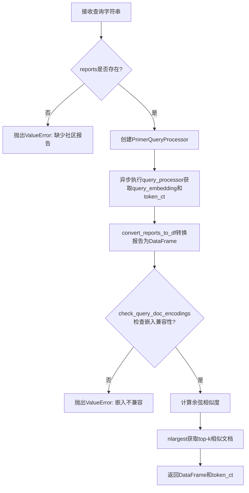
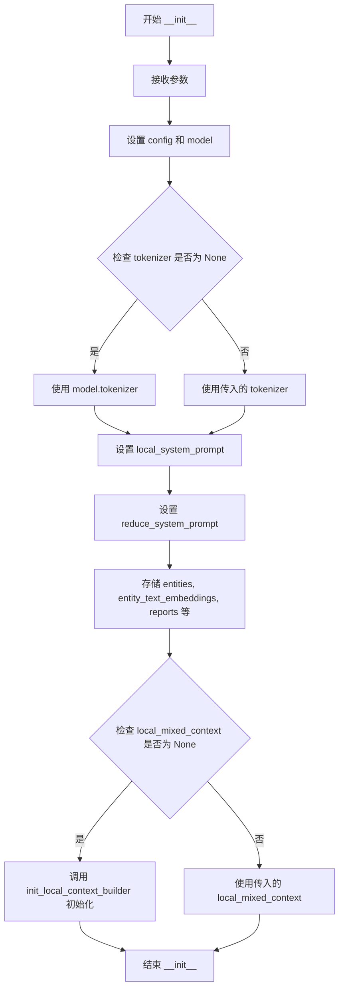
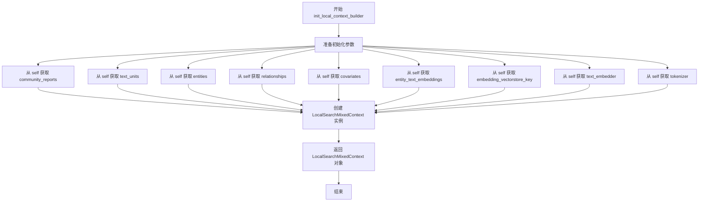
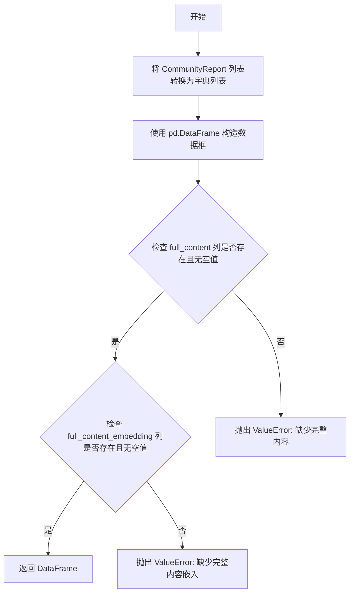
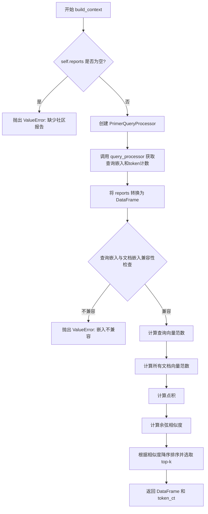

# `graphrag\packages\graphrag\graphrag\query\structured_search\drift_search\drift_context.py` 详细设计文档

DRIFT搜索上下文构建器，通过处理社区报告、计算嵌入相似度并返回top-k相关文档来构建搜索查询的上下文。

## 整体流程



## 类结构

```
DRIFTContextBuilder (抽象基类)
└── DRIFTSearchContextBuilder
```

## 全局变量及字段


### `logger`
    
模块级日志记录器

类型：`logging.Logger`
    


### `DRIFTSearchContextBuilder.config`
    
DRIFT搜索配置

类型：`DRIFTSearchConfig`
    


### `DRIFTSearchContextBuilder.model`
    
LLMCompletion模型实例

类型：`LLMCompletion`
    


### `DRIFTSearchContextBuilder.text_embedder`
    
文本嵌入器

类型：`LLMEmbedding`
    


### `DRIFTSearchContextBuilder.tokenizer`
    
分词器

类型：`Tokenizer`
    


### `DRIFTSearchContextBuilder.local_system_prompt`
    
本地系统提示词

类型：`str`
    


### `DRIFTSearchContextBuilder.reduce_system_prompt`
    
归约系统提示词

类型：`str`
    


### `DRIFTSearchContextBuilder.entities`
    
实体列表

类型：`list[Entity]`
    


### `DRIFTSearchContextBuilder.entity_text_embeddings`
    
实体文本嵌入向量存储

类型：`VectorStore`
    


### `DRIFTSearchContextBuilder.reports`
    
社区报告列表

类型：`list[CommunityReport]`
    


### `DRIFTSearchContextBuilder.text_units`
    
文本单元列表

类型：`list[TextUnit]`
    


### `DRIFTSearchContextBuilder.relationships`
    
关系列表

类型：`list[Relationship]`
    


### `DRIFTSearchContextBuilder.covariates`
    
协变量字典

类型：`dict`
    


### `DRIFTSearchContextBuilder.embedding_vectorstore_key`
    
嵌入向量存储键

类型：`str`
    


### `DRIFTSearchContextBuilder.response_type`
    
响应类型

类型：`str`
    


### `DRIFTSearchContextBuilder.local_mixed_context`
    
本地混合上下文

类型：`LocalSearchMixedContext`
    
    

## 全局函数及方法


### `DRIFTSearchContextBuilder.__init__`

初始化 DRIFT 搜索上下文构建器，用于构建 DRIFT 搜索算法的查询上下文，整合实体、文本单元、社区报告、关系和协变量等数据，并支持本地搜索混合上下文和提示词配置。

参数：

- `self`：隐式参数，表示类的实例本身
- `model`：`LLMCompletion`，用于处理 LLM 调用的语言模型
- `config`：`DRIFTSearchConfig`，DRIFT 搜索的配置参数
- `text_embedder`：`LLMEmbedding`，用于将文本转换为嵌入向量的嵌入器
- `entities`：`list[Entity]`，实体列表，包含图谱中的实体数据
- `entity_text_embeddings`：`VectorStore`，存储实体文本嵌入的向量数据库
- `text_units`：`list[TextUnit] | None`，文本单元列表，默认为 None
- `reports`：`list[CommunityReport] | None`，社区报告列表，默认为 None
- `relationships`：`list[Relationship] | None`，关系列表，默认为 None
- `covariates`：`dict[str, list[Covariate]] | None`，协变量字典，默认为 None
- `tokenizer`：`Tokenizer | None`，分词器，默认为 None（如果未提供则使用模型的 tokenizer）
- `embedding_vectorstore_key`：`str`，嵌入向量存储的键，默认为 `EntityVectorStoreKey.ID`
- `local_system_prompt`：`str | None`，本地搜索的系统提示词，默认为 None（使用 DRIFT_LOCAL_SYSTEM_PROMPT）
- `local_mixed_context`：`LocalSearchMixedContext | None`，本地搜索混合上下文，默认为 None
- `reduce_system_prompt`：`str | None`，缩减步骤的系统提示词，默认为 None（使用 DRIFT_REDUCE_PROMPT）
- `response_type`：`str | None`，响应类型，默认为 None

返回值：无（`None`）

#### 流程图



#### 带注释源码

```python
def __init__(
    self,
    model: "LLMCompletion",
    config: DRIFTSearchConfig,
    text_embedder: "LLMEmbedding",
    entities: list[Entity],
    entity_text_embeddings: VectorStore,
    text_units: list[TextUnit] | None = None,
    reports: list[CommunityReport] | None = None,
    relationships: list[Relationship] | None = None,
    covariates: dict[str, list[Covariate]] | None = None,
    tokenizer: Tokenizer | None = None,
    embedding_vectorstore_key: str = EntityVectorStoreKey.ID,
    local_system_prompt: str | None = None,
    local_mixed_context: LocalSearchMixedContext | None = None,
    reduce_system_prompt: str | None = None,
    response_type: str | None = None,
):
    """Initialize the DRIFT search context builder with necessary components."""
    # 存储配置和模型
    self.config = config
    self.model = model
    self.text_embedder = text_embedder
    
    # 如果 tokenizer 未提供，则使用模型的 tokenizer
    self.tokenizer = tokenizer or model.tokenizer
    
    # 设置本地搜索和缩减步骤的系统提示词（使用默认值或自定义）
    self.local_system_prompt = local_system_prompt or DRIFT_LOCAL_SYSTEM_PROMPT
    self.reduce_system_prompt = reduce_system_prompt or DRIFT_REDUCE_PROMPT

    # 存储实体、嵌入、报告、文本单元、关系和协变量
    self.entities = entities
    self.entity_text_embeddings = entity_text_embeddings
    self.reports = reports
    self.text_units = text_units
    self.relationships = relationships
    self.covariates = covariates
    self.embedding_vectorstore_key = embedding_vectorstore_key

    # 存储响应类型
    self.response_type = response_type

    # 初始化本地混合上下文构建器（如果未提供）
    self.local_mixed_context = (
        local_mixed_context or self.init_local_context_builder()
    )
```


### `DRIFTSearchContextBuilder.init_local_context_builder`

该方法用于初始化本地搜索混合上下文构建器，通过传入社区报告、文本单元、实体、关系、协变量、实体文本嵌入、嵌入向量存储键、文本嵌入器、分词器等参数，创建一个 `LocalSearchMixedContext` 对象，以支持 DRIFT 搜索的本地上下文构建。

参数：
- 该方法无额外参数（仅使用实例属性 `self`）

返回值：`LocalSearchMixedContext`，已初始化的本地搜索混合上下文对象

#### 流程图



#### 带注释源码

```python
def init_local_context_builder(self) -> LocalSearchMixedContext:
    """
    Initialize the local search mixed context builder.

    Returns
    -------
    LocalSearchMixedContext: Initialized local context.
    """
    # 使用类实例的各属性作为参数，创建并返回一个 LocalSearchMixedContext 对象
    # 这些属性在 __init__ 方法中已被初始化并赋值
    return LocalSearchMixedContext(
        community_reports=self.reports,              # 社区报告列表
        text_units=self.text_units,                  # 文本单元列表
        entities=self.entities,                      # 实体列表
        relationships=self.relationships,            # 关系列表
        covariates=self.covariates,                  # 协变量字典
        entity_text_embeddings=self.entity_text_embeddings,  # 实体文本嵌入向量存储
        embedding_vectorstore_key=self.embedding_vectorstore_key,  # 嵌入向量存储键
        text_embedder=self.text_embedder,            # 文本嵌入器
        tokenizer=self.tokenizer,                    # 分词器
    )
```


### `DRIFTSearchContextBuilder.convert_reports_to_df`

将社区报告对象列表转换为 pandas DataFrame，并进行数据完整性验证。

参数：

- `reports`：`list[CommunityReport]`，待转换的社区报告对象列表

返回值：`pd.DataFrame`，包含报告数据的 DataFrame

#### 流程图



#### 带注释源码

```python
@staticmethod
def convert_reports_to_df(reports: list[CommunityReport]) -> pd.DataFrame:
    """
    将 CommunityReport 对象列表转换为 pandas DataFrame。

    Args:
        reports: CommunityReport 对象列表

    Returns:
        包含报告数据的 DataFrame

    Raises:
        ValueError: 如果某些报告缺少完整内容或完整内容嵌入
    """
    # 使用 dataclasses.asdict 将每个 CommunityReport 转换为字典，再构造 DataFrame
    report_df = pd.DataFrame([asdict(report) for report in reports])
    
    # 定义错误提示信息
    missing_content_error = "Some reports are missing full content."
    missing_embedding_error = (
        "Some reports are missing full content embeddings. {missing} out of {total}"
    )

    # 验证 full_content 列存在且无空值
    if (
        "full_content" not in report_df.columns
        or report_df["full_content"].isna().sum() > 0
    ):
        raise ValueError(missing_content_error)

    # 验证 full_content_embedding 列存在且无空值
    if (
        "full_content_embedding" not in report_df.columns
        or report_df["full_content_embedding"].isna().sum() > 0
    ):
        raise ValueError(
            missing_embedding_error.format(
                missing=report_df["full_content_embedding"].isna().sum(),
                total=len(report_df),
            )
        )
    return report_df
```


### `DRIFTSearchContextBuilder.check_query_doc_encodings`

检查查询嵌入向量与文档嵌入向量是否兼容（类型和长度是否匹配）。

参数：

- `query_embedding`：`Any`，查询的嵌入向量
- `embedding`：`Any`，要比较的文档嵌入向量

返回值：`bool`，嵌入向量兼容返回 True，否则返回 False

#### 流程图

```mermaid
flowchart TD
    A[开始检查嵌入向量兼容性] --> B{query_embedding is not None?}
    B -->|否| C[返回 False]
    B -->|是| D{embedding is not None?}
    D -->|否| C
    D -->|是| E{isinstance query_embedding type equals embedding type?}
    E -->|否| C
    E -->|是| F{len query_embedding equals len embedding?}
    F -->|否| C
    F -->|是| G{isinstance query_embedding[0] type equals embedding[0] type?}
    G -->|否| C
    G -->|是| H[返回 True]
```

#### 带注释源码

```python
@staticmethod
def check_query_doc_encodings(query_embedding: Any, embedding: Any) -> bool:
    """
    Check if the embeddings are compatible.

    Args
    ----
    query_embedding : Any
        Embedding of the query.
    embedding : Any
        Embedding to compare against.

    Returns
    -------
    bool: True if embeddings match, otherwise False.
    """
    # 检查查询嵌入向量不为空
    # Check that query embedding is not None
    query_is_valid = query_embedding is not None
    
    # 检查文档嵌入向量不为空
    # Check that document embedding is not None
    embedding_is_valid = embedding is not None
    
    # 检查两个嵌入向量类型相同
    # Check that both embeddings are of the same type
    type_match = isinstance(query_embedding, type(embedding))
    
    # 检查两个嵌入向量长度相同
    # Check that both embeddings have the same length
    length_match = len(query_embedding) == len(embedding)
    
    # 检查嵌入向量第一个元素的类型相同（用于多维嵌入）
    # Check that the first element of both embeddings are of the same type
    element_type_match = isinstance(query_embedding[0], type(embedding[0]))
    
    # 只有所有检查都通过时才返回 True
    # Return True only if all checks pass
    return (
        query_is_valid
        and embedding_is_valid
        and type_match
        and length_match
        and element_type_match
    )
```


### `DRIFTSearchContextBuilder.build_context`

构建DRIFT搜索上下文，通过向量相似度从社区报告中检索最相关的top-k文档，并返回检索结果及令牌使用统计。

参数：

- `query`：`str`，搜索查询字符串
- `**kwargs`：`Any`，额外的关键字参数（可选）

返回值：`tuple[pd.DataFrame, dict[str, int]]`，第一个元素是包含top-k最相似文档的DataFrame（包含short_id、community_id、full_content列），第二个元素是包含LLM调用次数和令牌计数的字典

#### 流程图



#### 带注释源码

```python
async def build_context(
    self, query: str, **kwargs
) -> tuple[pd.DataFrame, dict[str, int]]:
    """
    Build DRIFT search context.

    Args
    ----
    query : str
        Search query string.

    Returns
    -------
    pd.DataFrame: Top-k most similar documents.
    dict[str, int]: Number of LLM calls, and prompts and output tokens.

    Raises
    ------
    ValueError: If no community reports are available, or embeddings
    are incompatible.
    """
    # 检查是否有社区报告可用，若无则抛出错误
    if self.reports is None:
        missing_reports_error = (
            "No community reports available. Please provide a list of reports."
        )
        raise ValueError(missing_reports_error)

    # 创建查询处理器，用于处理查询嵌入
    query_processor = PrimerQueryProcessor(
        chat_model=self.model,
        text_embedder=self.text_embedder,
        tokenizer=self.tokenizer,
        reports=self.reports,
    )

    # 异步获取查询嵌入和token计数
    query_embedding, token_ct = await query_processor(query)

    # 将社区报告列表转换为pandas DataFrame以便处理
    report_df = self.convert_reports_to_df(self.reports)

    # 检查查询嵌入与文档嵌入的兼容性
    if not self.check_query_doc_encodings(
        query_embedding, report_df["full_content_embedding"].iloc[0]
    ):
        error_message = (
            "Query and document embeddings are not compatible. "
            "Please ensure that the embeddings are of the same type and length."
        )
        raise ValueError(error_message)

    # 使用NumPy进行向量化的余弦相似度计算
    # 计算查询向量的L2范数
    query_norm = np.linalg.norm(query_embedding)
    # 计算所有文档向量的L2范数
    document_norms = np.linalg.norm(
        report_df["full_content_embedding"].to_list(), axis=1
    )
    # 计算查询向量与所有文档向量的点积
    dot_products = np.dot(
        np.vstack(report_df["full_content_embedding"].to_list()), query_embedding
    )
    # 余弦相似度 = 点积 / (查询范数 * 文档范数)
    report_df["similarity"] = dot_products / (document_norms * query_norm)

    # 根据相似度降序排序，选取 top-k 个最相似的文档
    top_k = report_df.nlargest(self.config.drift_k_followups, "similarity")

    # 返回包含指定列的DataFrame和token计数
    return top_k.loc[:, ["short_id", "community_id", "full_content"]], token_ct
```

## 关键组件


### DRIFTSearchContextBuilder

DRIFT搜索上下文构建器核心类，负责整合实体、文本单元、社区报告、关系和协变量等数据源，通过向量相似度计算构建搜索上下文。

### PrimerQueryProcessor

查询处理器，负责将用户查询转换为向量表示，并返回查询嵌入和token计数。

### LocalSearchMixedContext

本地搜索混合上下文构建器，整合多种数据源（社区报告、文本单元、实体、关系、协变量）用于局部搜索。

### 向量相似度计算模块

使用NumPy实现的向量化余弦相似度计算，通过np.linalg.norm计算范数，np.dot计算点积，实现高效的文档排序。

### convert_reports_to_df

将社区报告列表转换为pandas DataFrame，并验证full_content和full_content_embedding字段的完整性。

### check_query_doc_encodings

验证查询嵌入与文档嵌入的类型、长度和元素类型兼容性，确保向量空间一致。

### Tokenizer集成

通过tokenizer属性访问LLM的分词器，用于文本处理和token计数。

### 错误处理机制

包含三个主要错误场景：社区报告缺失、报告内容缺失、嵌入向量缺失。

### 配置管理

通过DRIFTSearchConfig配置drift_k_followups参数，控制返回的Top-K文档数量。


## 问题及建议


### 已知问题

- **缓存缺失**：`convert_reports_to_df` 方法在每次调用 `build_context` 时都会重复执行，将 `CommunityReport` 列表转换为 DataFrame，但报告数据在初始化后不会改变，造成重复计算和性能开销。
- **除零风险**：在计算余弦相似度时，`query_norm` 或 `document_norms` 可能为 0（零向量），导致除零操作产生 `RuntimeWarning` 或 `nan` 值。
- **类型安全不足**：`embedding_vectorstore_key` 参数类型声明为 `str`，但实际应该使用 `EntityVectorStoreKey` 枚举类型，降低了类型安全性。
- **token_ct 返回值与文档不符**：方法文档声称返回 `"Number of LLM calls, and prompts and output tokens"` 的字典，但实际只返回一个整数 `token_ct`，存在文档与实现不一致的问题。
- **初始化逻辑重复**：`init_local_context_builder` 方法的核心逻辑与 `__init__` 中对 `local_mixed_context` 的处理存在重复，增加了代码维护成本。
- **模型属性假设未验证**：代码假设传入的 `model` 对象具有 `tokenizer` 属性，但未进行验证，当模型对象不符合预期时会产生难以追踪的 `AttributeError`。

### 优化建议

- **添加缓存机制**：在 `__init__` 或首次调用时缓存转换后的 DataFrame，避免重复转换操作。
- **添加除零保护**：在相似度计算前检查 `query_norm` 和 `document_norms` 是否为零向量，或使用 `np.safe_divide` 等防护措施。
- **改进类型声明**：将 `embedding_vectorstore_key` 改为 `EntityVectorStoreKey` 类型，并使用 `Literal` 或 `Enum` 增强类型检查。
- **统一返回值与文档**：修改 `build_context` 的返回类型以匹配文档描述，或更新文档说明实际返回内容。
- **提取公共初始化逻辑**：将 `LocalSearchMixedContext` 的构建逻辑统一到一个工厂方法中，消除重复代码。
- **添加模型验证**：在 `__init__` 中验证 `model` 对象具有必要的 `tokenizer` 属性，提供清晰的错误信息。

## 其它


### 设计目标与约束

该DRIFTSearchContextBuilder类的核心设计目标是实现一种基于DRIFT算法的搜索上下文构建机制，通过向量相似度计算从社区报告中筛选出与查询最相关的内容。设计约束包括：必须提供社区报告列表；query embedding与document embedding必须类型兼容且长度一致；文本嵌入模型和tokenizer必须正确初始化；最大支持通过config.drift_k_followups参数控制返回的top-k结果数量。

### 错误处理与异常设计

代码中包含三个主要的异常抛出点：1) convert_reports_to_df方法中当报告缺少full_content或full_content_embedding字段时抛出ValueError；2) build_context方法中当self.reports为None时抛出ValueError并提示"请提供报告列表"；3) build_context方法中当query_embedding与document embedding不兼容时抛出ValueError并提示"embedding类型和长度必须一致"。建议统一异常处理策略，使用自定义异常类继承自ValueError以区分不同错误类型。

### 数据流与状态机

数据流如下：输入query字符串 -> PrimerQueryProcessor生成query_embedding -> convert_reports_to_df将CommunityReport列表转为DataFrame -> check_query_doc_encodings验证embedding兼容性 -> 计算余弦相似度 -> nlargest选取top-k结果 -> 返回(pd.DataFrame, dict)元组。状态机包含初始化状态、就绪状态、构建中状态和完成状态，通过self.reports、self.local_mixed_context等属性维护状态。

### 外部依赖与接口契约

主要外部依赖包括：1) graphrag_llm.tokenizer.Tokenizer - 用于文本分词；2) graphrag_vectors.VectorStore - 向量存储接口；3) LLMCompletion和LLMEmbedding - 语言模型和嵌入模型接口；4) LocalSearchMixedContext - 本地搜索混合上下文构建器；5) PrimerQueryProcessor - 查询处理器。接口契约要求：entities需为Entity列表；entity_text_embeddings需为VectorStore实例；reports需为CommunityReport列表且每项包含full_content和full_content_embedding字段。

### 性能考虑与优化空间

当前实现中向量相似度计算使用numpy直接计算，可考虑使用批量处理和并行计算优化；report_df["full_content_embedding"].to_list()会触发DataFrame到list的转换，可预先缓存；build_context为异步方法但内部计算主要为同步numpy操作，可考虑将计算密集部分移至线程池；self.reports在每次调用build_context时都会被转换，建议缓存转换后的DataFrame以避免重复计算。

### 安全性考虑

代码中query_embedding和embedding的比较使用isinstance检查类型，但未对embedding数值范围进行校验；输入query字符串未进行长度限制或特殊字符过滤；VectorStore操作依赖外部实现，需确保entity_text_embeddings来源可信。建议添加query长度校验、embedding数值有效性检查以及对外部依赖的接口验证。

### 测试策略

建议测试用例包括：1) 空reports列表触发ValueError；2) reports中缺少full_content字段触发ValueError；3) reports中缺少full_content_embedding字段触发ValueError；4) embedding类型不兼容触发ValueError；5) embedding长度不一致触发ValueError；6) 正常流程返回top-k结果；7) tokenizer为None时使用model.tokenizer的fallback逻辑；8) local_mixed_context为None时的初始化逻辑。使用mock对象模拟LLMCompletion、LLMEmbedding和VectorStore以实现单元测试。

### 版本兼容性

代码依赖typing.TYPE_CHECKING进行类型提示的延迟加载，确保运行时兼容性。numpy版本需支持np.linalg.norm和np.dot的向量化操作；pandas版本需支持DataFrame的na()方法和nlargest()方法。建议在requirements中明确numpy>=1.20.0和pandas>=1.3.0的版本约束。

### 配置文件与参数说明

DRIFTSearchConfig类需包含drrift_k_followups参数控制返回的相似文档数量；EntityVectorStoreKey枚举用于指定向量存储的键类型（默认ID）；local_system_prompt和reduce_system_prompt可自定义提示词模板；response_type指定响应类型格式。embedding_vectorstore_key参数默认为EntityVectorStoreKey.ID，支持切换为其他键类型。

### 并发与异步设计

build_context方法声明为async但内部主要使用同步numpy计算，建议将向量相似度计算部分重构为异步或使用asyncio.to_thread()包装计算密集型操作以真正实现非阻塞。PrimerQueryProcessor的调用已正确使用await，token_ct返回令牌计数用于监控API调用成本。

    