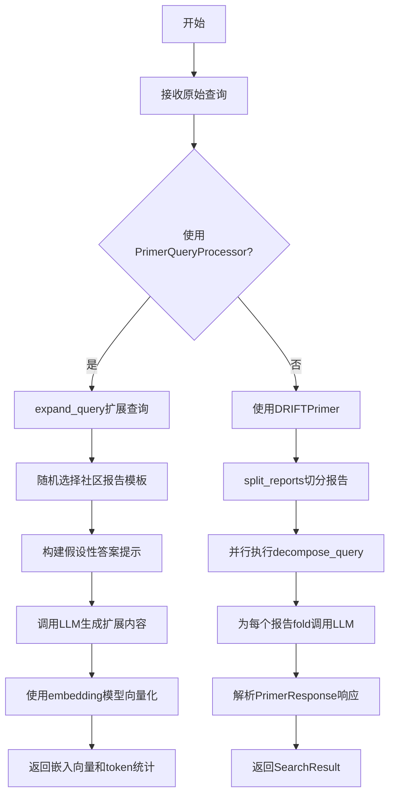
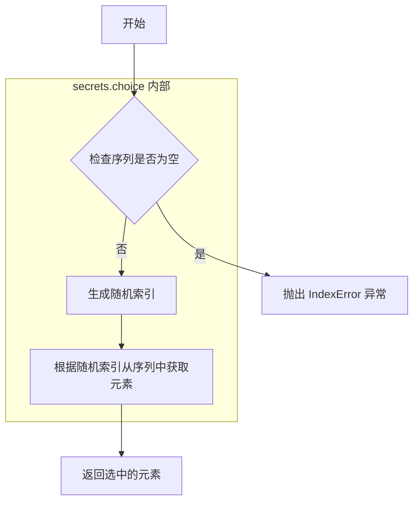
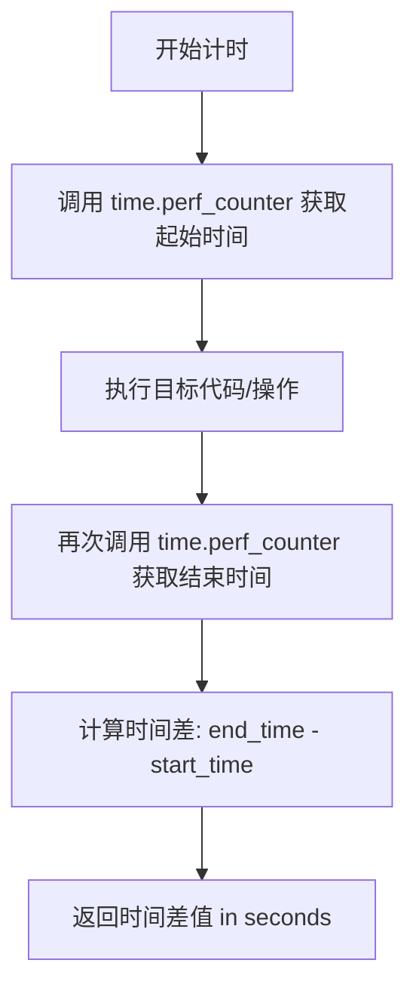
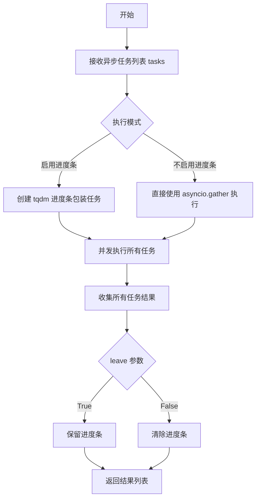
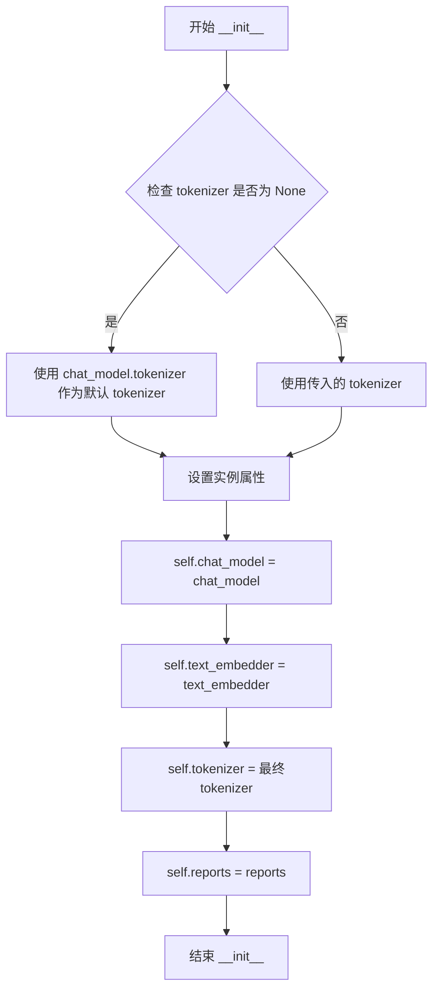
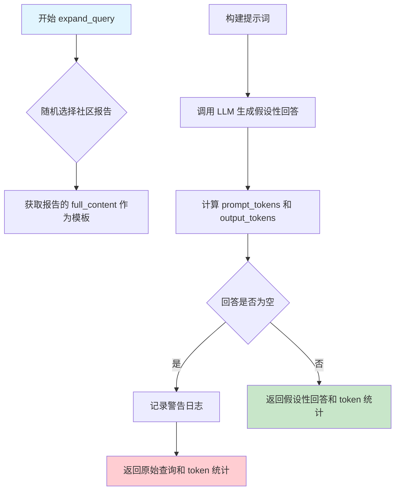
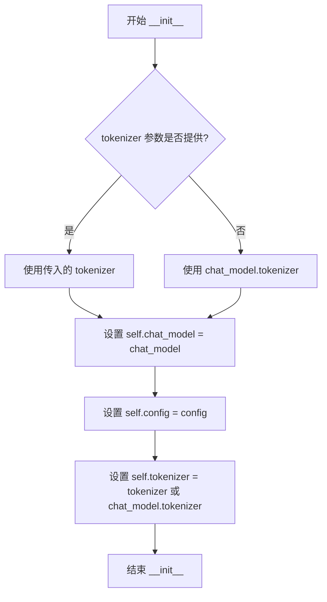
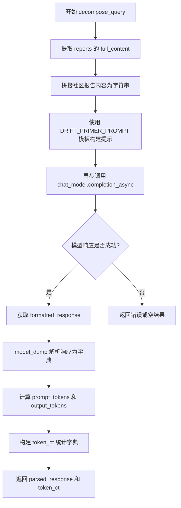
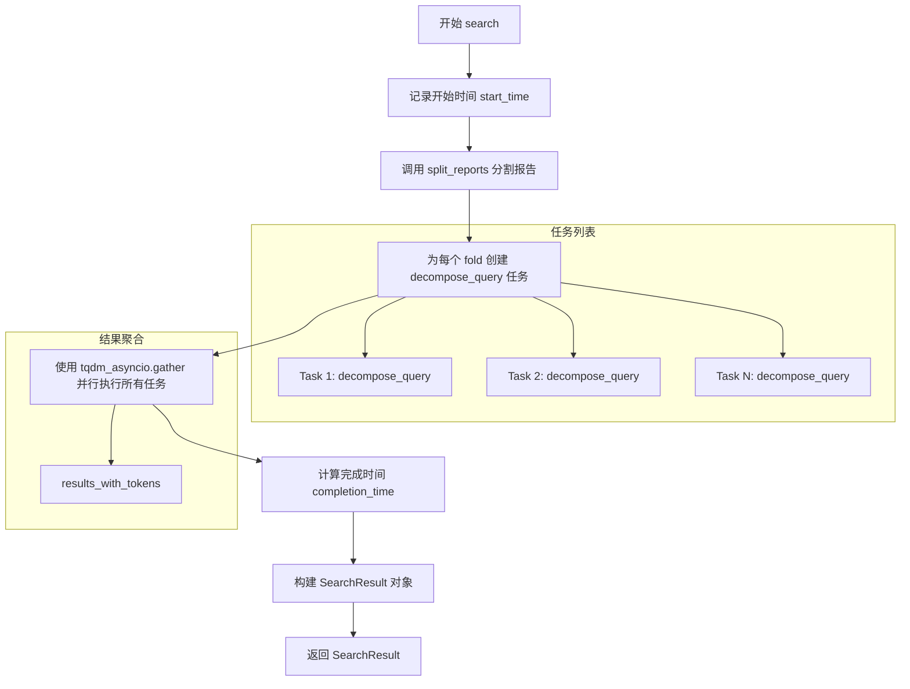

# `graphrag\packages\graphrag\graphrag\query\structured_search\drift_search\primer.py` 详细设计文档

这是一个DRIFT搜索的引物模块，通过社区报告对查询进行初始扩展和分解，使用LLM生成假设性答案来丰富查询，并利用社区报告信息将原始查询分解为多个后续查询，支持并行处理多个报告子集以提高搜索效率。

## 整体流程



## 类结构

```
BaseModel (Pydantic)
└── PrimerResponse (响应模型)
PrimerQueryProcessor (查询扩展处理器)
DRIFTPrimer (查询分解器)
```

## 全局变量及字段


### `logger`
    
模块级日志记录器，用于记录运行日志

类型：`logging.Logger`
    


### `np`
    
NumPy库别名，用于数值计算和数组操作

类型：`numpy module`
    


### `pd`
    
Pandas库别名，用于数据处理和分析

类型：`pandas module`
    


### `DRIFT_PRIMER_PROMPT`
    
从graphrag.prompts.query.drift_search_system_prompt导入的DRIFT查询分解提示模板

类型：`PromptTemplate`
    


### `PrimerResponse.intermediate_answer`
    
中间答案字段，2000字符长度的markdown格式

类型：`str`
    


### `PrimerResponse.score`
    
查询相关性评分，0-100分

类型：`int`
    


### `PrimerResponse.follow_up_queries`
    
后续查询列表，至少5个

类型：`list[str]`
    


### `PrimerQueryProcessor.chat_model`
    
语言模型用于处理查询

类型：`LLMCompletion`
    


### `PrimerQueryProcessor.text_embedder`
    
文本嵌入模型

类型：`LLMEmbedding`
    


### `PrimerQueryProcessor.tokenizer`
    
分词器

类型：`Tokenizer`
    


### `PrimerQueryProcessor.reports`
    
社区报告列表

类型：`list[CommunityReport]`
    


### `DRIFTPrimer.chat_model`
    
语言模型用于搜索

类型：`LLMCompletion`
    


### `DRIFTPrimer.config`
    
DRIFT搜索配置

类型：`DRIFTSearchConfig`
    


### `DRIFTPrimer.tokenizer`
    
分词器

类型：`Tokenizer`
    
    

## 全局函数及方法


### `secrets.choice`

从给定序列中随机选择一个元素，用于从社区报告列表中随机选取一个报告模板以扩展查询。

参数：

- `seq`：`Sequence[T]`，要从中随机选择元素的序列（在此代码中为 `self.reports`，即 `list[CommunityReport]`）

返回值：`T`（CommunityReport），从序列中随机选择的单个元素（在此代码中为随机选取的社区报告对象）

#### 流程图



#### 带注释源码

```python
# secrets.choice 函数源码（标准库实现）

def choice(seq):
    """
    从非空序列中随机选择并返回一个元素。
    
    参数:
        seq: 非空序列（list, tuple, str等）
        
    返回:
        序列中的随机选择元素
        
    异常:
        IndexError: 当序列为空时抛出
    """
    if len(seq) == 0:
        raise IndexError("Cannot choose from an empty sequence")
    
    # 使用 secrets 模块的随机数生成器（密码学安全）
    # 而不是 random 模块，以避免可预测的随机数
    return seq[_randbelow(len(seq))])


# 在 graphrag 代码中的实际使用方式：

# 从社区报告列表中随机选择一个报告的完整内容作为模板
# 用于 HyDE（假设性文档嵌入）查询扩展
template = secrets.choice(self.reports).full_content  # nosec S311
#           ^^^^^^^^^^^^
#           参数：self.reports - list[CommunityReport] 类型的报告列表
#           返回：CommunityReport - 随机选中的单个社区报告对象
#           访问属性：.full_content 获取报告的完整文本内容
```

#### 实际调用上下文

```python
async def expand_query(self, query: str) -> tuple[str, dict[str, int]]:
    """
    使用随机社区报告模板扩展查询 (HyDE 方法)
    
    Args:
        query (str): 原始搜索查询
        
    Returns:
        tuple[str, dict[str, int]]: 扩展后的查询文本和使用的 token 数量
    """
    # secrets.choice 从 self.reports (list[CommunityReport]) 中
    # 随机选择一个 CommunityReport 对象，然后访问其 .full_content 属性
    template = secrets.choice(self.reports).full_content  # nosec S311
    #               ^^^^^^^^^^^^^^^^^^^^^^^
    #               传入的参数：CommunityReport 列表
    #               返回值：单个 CommunityReport 对象
    
    # 使用选中的报告模板格式化提示词
    prompt = f"""Create a hypothetical answer to the following query: {query}\n\n
              Format it to follow the structure of the template below:\n\n
              {template}\n"
              Ensure that the hypothetical answer does not reference new named entities that are not present in the original query."""
    
    # ... 后续调用 LLM 生成假设性回答
```


### `time.perf_counter`

高精度计时函数，用于获取当前时间的高精度浮点数返回值，通常用于测量代码执行时间或计算时间差。

参数： 无

返回值：`float`，返回自上次调用以来的秒数，以浮点数形式表示，提供亚微秒级精度。

#### 流程图



#### 带注释源码

```python
# 在 DRIFTPrimer 类的 search 方法中使用
async def search(
    self,
    query: str,
    top_k_reports: pd.DataFrame,
) -> SearchResult:
    """
    异步搜索方法，处理查询并返回 SearchResult。
    """
    # 使用高精度计时器记录搜索开始时间
    # time.perf_counter() 返回一个浮点数，表示自某个未指定时刻以来的秒数
    # 它提供比 time.time() 更高的精度，特别适合用于测量代码执行时间
    start_time = time.perf_counter()
    
    # 将报告分割成多个折叠以便并行处理
    report_folds = self.split_reports(top_k_reports)
    
    # 为每个报告折叠创建分解任务
    tasks = [self.decompose_query(query, fold) for fold in report_folds]

    # 并行执行所有分解查询任务
    results_with_tokens = await tqdm_asyncio.gather(*tasks, leave=False)

    # 再次调用 perf_counter 获取结束时间
    # 通过计算差值得到整个搜索过程的耗时
    completion_time = time.perf_counter() - start_time

    # 返回包含响应、上下文数据、completion_time 等的搜索结果
    return SearchResult(
        response=[response for response, _ in results_with_tokens],
        context_data={"top_k_reports": top_k_reports},
        context_text=top_k_reports.to_json() or "",
        completion_time=completion_time,  # 搜索耗时（秒）
        llm_calls=len(results_with_tokens),
        prompt_tokens=sum(ct["prompt_tokens"] for _, ct in results_with_tokens),
        output_tokens=sum(ct["output_tokens"] for _, ct in results_with_tokens),
    )
```


### `tqdm_asyncio.gather`

`tqdm_asyncio.gather` 是 `tqdm` 库提供的异步版本的任务收集函数，用于并发执行多个异步任务并通过进度条展示执行进度。在 `DRIFTPrimer.search` 方法中用于并行处理多个报告分解任务。

参数：

- `*tasks`：`Coroutine` 或 `Awaitable` 类型，可变数量的异步任务（这里是 `self.decompose_query(query, fold)` 的结果列表）
- `leave`：`bool` 类型，指定是否在完成后保留进度条（此处为 `False`，表示完成后不保留）

返回值：`list`，包含所有异步任务的结果列表（这里是 `tuple[dict, dict[str, int]]` 类型的列表）

#### 流程图



#### 带注释源码

```python
# 在 DRIFTPrimer.search 方法中调用 tqdm_asyncio.gather
# 用于并行执行多个 decompose_query 任务并展示进度

# 1. 生成任务列表 - 将每个报告折叠（fold）创建一个分解查询的异步任务
tasks = [self.decompose_query(query, fold) for fold in report_folds]

# 2. 使用 tqdm_asyncio.gather 并行执行所有任务
# 参数说明:
#   *tasks: 解包任务列表，传入多个异步协程
#   leave=False: 任务完成后不保留进度条显示
results_with_tokens = await tqdm_asyncio.gather(*tasks, leave=False)

# results_with_tokens 是一个列表，每个元素是 decompose_query 返回的 tuple[dict, dict[str, int]]
# 包含: (分解结果字典, token计数字典)
```


### `PrimerQueryProcessor.__init__`

初始化查询扩展处理器，用于通过社区报告扩展查询并生成后续操作。

参数：

- `chat_model`：`LLMCompletion`，用于处理查询的语言模型
- `text_embedder`：`LLMEmbedding`，文本嵌入模型，用于对扩展后的查询进行向量化
- `reports`：`list[CommunityReport]`，社区报告列表，作为查询扩展的模板来源
- `tokenizer`：`Tokenizer | None`，可选的token编码器，用于token计数，默认使用chat_model的内置tokenizer

返回值：`None`，构造函数无返回值

#### 流程图



#### 带注释源码

```python
def __init__(
    self,
    chat_model: "LLMCompletion",
    text_embedder: "LLMEmbedding",
    reports: list[CommunityReport],
    tokenizer: Tokenizer | None = None,
):
    """
    Initialize the PrimerQueryProcessor.

    Args:
        chat_llm (ChatOpenAI): The language model used to process the query.
            # 注意：文档中参数名有误，实际参数名为 chat_model
        text_embedder (BaseTextEmbedding): The text embedding model.
            # 用于将扩展后的查询文本转换为向量嵌入
        reports (list[CommunityReport]): List of community reports.
            # 社区报告列表，从中随机选取作为查询扩展的模板
        tokenizer (Tokenizer, optional): Token encoder for token counting.
            # 可选的token编码器，用于计算LLM调用的token数量
    """
    # 存储聊天模型实例，用于后续的异步Completion调用
    self.chat_model = chat_model
    
    # 存储文本嵌入模型实例，用于对扩展后的查询进行向量化
    self.text_embedder = text_embedder
    
    # 如果未提供tokenizer，则使用chat_model内置的tokenizer
    # 这样可以确保即使不显式传入tokenizer也能进行token计数
    self.tokenizer = tokenizer or chat_model.tokenizer
    
    # 存储社区报告列表，这些报告将作为查询扩展的模板来源
    self.reports = reports
```


### `PrimerQueryProcessor.expand_query`

使用随机社区报告模板扩展查询，生成假设性回答以丰富查询语义。这是 HyDE（Hypothetical Document Embeddings）技术的实现，通过让语言模型根据社区报告的结构生成假设性答案来增强搜索效果。

**参数：**

- `query`：`str`，原始搜索查询

**返回值：** `tuple[str, dict[str, int]]`，扩展后的查询文本和 token 使用统计字典

#### 流程图



#### 带注释源码

```python
async def expand_query(self, query: str) -> tuple[str, dict[str, int]]:
    """
    使用随机社区报告模板扩展查询。

    该方法实现了 HyDE (Hypothetical Document Embeddings) 技术的变体。
    通过让语言模型根据随机选择的社区报告结构生成假设性回答，
    可以丰富原始查询的语义信息，提升搜索效果。

    参数:
        query (str): 原始搜索查询

    返回:
        tuple[str, dict[str, int]]: 
            - str: 扩展后的查询文本（假设性回答）
            - dict: token 使用统计，包含:
                - llm_calls: LLM 调用次数
                - prompt_tokens: 输入 token 数量
                - output_tokens: 输出 token 数量
    """
    # 使用 secrets.choice 随机选择一个社区报告
    # 使用 secrets 而非 random 是为了满足安全要求 (S311)
    template = secrets.choice(self.reports).full_content

    # 构建提示词，要求 LLM 根据模板结构生成假设性回答
    # 提示词包含原始查询和社区报告模板
    prompt = f"""Create a hypothetical answer to the following query: {query}\n\n
              Format it to follow the structure of the template below:\n\n
              {template}\n"
              Ensure that the hypothetical answer does not reference new named entities that are not present in the original query."""

    # 异步调用 LLM 生成假设性回答
    model_response: LLMCompletionResponse = await self.chat_model.completion_async(
        messages=prompt
    )  # type: ignore
    text = model_response.content

    # 计算使用的 token 数量
    prompt_tokens = len(self.tokenizer.encode(prompt))
    output_tokens = len(self.tokenizer.encode(text))
    token_ct = {
        "llm_calls": 1,
        "prompt_tokens": prompt_tokens,
        "output_tokens": output_tokens,
    }

    # 如果 LLM 返回空内容，记录警告并返回原始查询
    if text == "":
        logger.warning("Failed to generate expansion for query: %s", query)
        return query, token_ct

    # 返回假设性回答（扩展后的查询）和 token 统计
    return text, token_ct
```

#### 技术细节说明

| 项目 | 说明 |
|------|------|
| **核心目标** | 通过生成假设性文档来增强查询的语义表示 |
| **随机性** | 使用 `secrets.choice` 而非 `random.choice` 满足加密安全标准 |
| **模板作用** | 社区报告的结构引导 LLM 生成符合领域规范的假设性回答 |
| **空处理** | 当 LLM 返回空时降级返回原始查询，保证系统鲁棒性 |
| **Token 追踪** | 精确统计每次调用的 token 消耗用于成本控制 |


### `PrimerQueryProcessor.__call__`

执行查询扩展（HYDE技术）和嵌入的核心方法，接收原始查询字符串，通过`expand_query`生成假设性回答以扩展查询语义，然后使用文本嵌入模型将扩展后的查询转换为向量表示，最后返回嵌入向量和token使用统计。

参数：

- `query`：`str`，原始搜索查询字符串

返回值：`tuple[list[float], dict[str, int]]`，包含扩展查询的嵌入向量列表（通常为单个向量）以及token使用统计字典（包含llm_calls、prompt_tokens、output_tokens等键值对）

#### 流程图

```mermaid
flowchart TD
    A[开始 __call__] --> B[调用 expand_query 异步方法]
    B --> C[expand_query 生成假设性回答]
    C --> D[返回扩展查询 hyde_query 和 token_ct]
    D --> E{扩展查询是否为空?}
    E -->|是| F[记录警告日志]
    E -->|否| G[记录调试日志: 扩展后的查询内容]
    G --> H[调用 text_embedder.embedding 方法]
    H --> I[获取 first_embedding 嵌入向量]
    I --> J[返回 tuple[嵌入向量, token_ct] 结束]
    
    style A fill:#e1f5fe
    style J fill:#e8f5e8
```

#### 带注释源码

```python
async def __call__(self, query: str) -> tuple[list[float], dict[str, int]]:
    """
    Call method to process the query, expand it, and embed the result.
    
    该方法实现了HYDE（Hypothetical Document Embeddings）技术：
    1. 先使用语言模型生成假设性回答来扩展原始查询
    2. 将假设性回答嵌入为向量
    3. 返回嵌入向量用于后续的相似度搜索

    Args:
        query (str): The search query. 原始用户输入的搜索查询

    Returns
    -------
    tuple[list[float], int]: 
        - List of embeddings for the expanded query. 扩展查询的嵌入向量列表
        - token count. token使用统计字典
    """
    # Step 1: 调用 expand_query 方法，使用HYDE技术扩展查询
    # expand_query 会：
    #   - 随机选择一个社区报告作为模板
    #   - 让LLM根据模板生成假设性回答
    #   - 返回扩展后的文本和token计数
    hyde_query, token_ct = await self.expand_query(query)
    
    # Step 2: 记录调试日志，展示扩展后的查询内容
    # 这有助于调试时了解HYDE生成了什么样的扩展查询
    logger.debug("Expanded query: %s", hyde_query)
    
    # Step 3: 调用文本嵌入模型，将扩展后的查询转换为向量
    # .first_embedding 获取第一个（也是唯一的）嵌入向量
    # 返回格式为 list[float]，包含嵌入向量的各维度数值
    return self.text_embedder.embedding(
        input=[hyde_query]  # 注意：embedding方法接受列表输入
    ).first_embedding, token_ct  # 同时返回token使用统计供上层调用者记录
```


### `DRIFTPrimer.__init__`

初始化 DRIFTPrimer 类，用于执行基于社区报告信息的全局指导进行初始查询分解。

参数：

- `config`：`DRIFTSearchConfig`，DRIFT 搜索的配置设置
- `chat_model`：`LLMCompletion`，用于搜索的语言模型
- `tokenizer`：`Tokenizer | None`，用于管理令牌的分词器（可选）

返回值：`None`，`__init__` 方法不返回值，仅初始化实例属性

#### 流程图



#### 带注释源码

```python
def __init__(
    self,
    config: DRIFTSearchConfig,
    chat_model: "LLMCompletion",
    tokenizer: Tokenizer | None = None,
):
    """
    Initialize the DRIFTPrimer.

    Args:
        config (DRIFTSearchConfig): Configuration settings for DRIFT search.
        chat_llm (ChatOpenAI): The language model used for searching.
        tokenizer (Tokenizer, optional): Tokenizer for managing tokens.
    """
    # 将传入的语言模型赋值给实例属性，供后续方法使用
    self.chat_model = chat_model
    # 将 DRIFT 搜索配置赋值给实例属性，包含如 primer_folds 等配置项
    self.config = config
    # 如果提供了 tokenizer 则使用，否则从 chat_model 中获取默认 tokenizer
    self.tokenizer = tokenizer or chat_model.tokenizer
```


### `DRIFTPrimer.decompose_query`

将原始查询分解为多个子查询，基于提供的社区报告数据，利用语言模型生成中间答案、相关性评分和后续查询。

参数：

- `query`：`str`，原始搜索查询
- `reports`：`pd.DataFrame`，包含社区报告的 DataFrame

返回值：`tuple[dict, dict[str, int]]`，解析后的响应字典和 token 使用统计字典

#### 流程图



#### 带注释源码

```python
async def decompose_query(
    self, query: str, reports: pd.DataFrame
) -> tuple[dict, dict[str, int]]:
    """
    Decompose the query into subqueries based on the fetched global structures.

    Args:
        query (str): The original search query.
        reports (pd.DataFrame): DataFrame containing community reports.

    Returns
    -------
    tuple[dict, int, int]: Parsed response and the number of prompt and output tokens used.
    """
    # 从 DataFrame 中提取所有社区报告的 full_content 字段并用双换行符拼接
    # 构建包含完整社区报告内容的上下文字符串
    community_reports = "\n\n".join(reports["full_content"].tolist())
    
    # 使用系统提示模板格式化提示词，将查询和社区报告内容注入模板
    prompt = DRIFT_PRIMER_PROMPT.format(
        query=query, community_reports=community_reports
    )
    
    # 异步调用语言模型，传入格式化后的提示和响应格式 PrimerResponse
    # 使用 response_format 参数指定期望的响应结构化模型
    model_response: LLMCompletionResponse[
        PrimerResponse
    ] = await self.chat_model.completion_async(
        messages=prompt, response_format=PrimerResponse
    )  # type: ignore

    # 从模型响应中获取格式化后的响应对象，并将其转换为字典格式
    # 包含 intermediate_answer, score, follow_up_queries 等字段
    parsed_response = model_response.formatted_response.model_dump()  # type: ignore

    # 构建 token 使用统计字典
    # 记录：LLM 调用次数、提示词 token 数、输出 token 数
    token_ct = {
        "llm_calls": 1,
        "prompt_tokens": len(self.tokenizer.encode(prompt)),
        "output_tokens": len(self.tokenizer.encode(model_response.content)),
    }

    # 返回解析后的响应字典和 token 统计信息
    return parsed_response, token_ct
```


### `DRIFTPrimer.search`

该方法是一个异步搜索方法，用于处理查询并将结果封装为SearchResult对象返回。它接收原始查询和包含top-k报告的DataFrame，将报告分割成多个fold后并行执行分解查询操作，最后汇总所有结果及统计数据。

参数：

- `query`：`str`，搜索查询字符串
- `top_k_reports`：`pd.DataFrame`，包含排名前k的报告的DataFrame

返回值：`SearchResult`，包含响应数据、上下文数据、上下文文本、完成时间、LLM调用次数、提示令牌数和输出令牌数的搜索结果对象

#### 流程图



#### 带注释源码

```python
async def search(
    self,
    query: str,
    top_k_reports: pd.DataFrame,
) -> SearchResult:
    """
    异步搜索方法，处理查询并返回SearchResult。
    
    Args:
        query: 搜索查询字符串
        top_k_reports: 包含top-k报告的DataFrame
    
    Returns:
        SearchResult: 包含响应和上下文数据的搜索结果
    """
    # 记录方法开始执行的时间，用于计算整体耗时
    start_time = time.perf_counter()
    
    # 将报告分割成多个fold，以便并行处理
    # 每个fold将独立执行decompose_query任务
    report_folds = self.split_reports(top_k_reports)
    
    # 为每个报告fold创建异步分解查询任务
    tasks = [self.decompose_query(query, fold) for fold in report_folds]
    
    # 使用tqdm_asyncio.gather并行执行所有任务
    # leave=False表示进度条完成后不保留痕迹
    results_with_tokens = await tqdm_asyncio.gather(*tasks, leave=False)
    
    # 计算整个搜索过程的完成时间
    completion_time = time.perf_counter() - start_time
    
    # 构建并返回SearchResult对象，包含:
    # - response: 所有分解查询的响应列表
    # - context_data: 包含top_k_reports的上下文数据
    # - context_text: 报告的JSON字符串表示
    # - completion_time: 完成任务的总耗时
    # - llm_calls: LLM调用的总次数
    # - prompt_tokens: 所有请求的提示令牌总数
    # - output_tokens: 所有响应的输出令牌总数
    return SearchResult(
        response=[response for response, _ in results_with_tokens],
        context_data={"top_k_reports": top_k_reports},
        context_text=top_k_reports.to_json() or "",
        completion_time=completion_time,
        llm_calls=len(results_with_tokens),
        prompt_tokens=sum(ct["prompt_tokens"] for _, ct in results_with_tokens),
        output_tokens=sum(ct["output_tokens"] for _, ct in results_with_tokens),
    )
```


### `DRIFTPrimer.split_reports`

该方法用于将社区报告数据切分为多个 folds（折叠），以便进行并行处理。它根据配置文件中的 `primer_folds` 参数决定是否需要分割报告，如果只需要一个 fold 则直接返回原始报告，否则使用 numpy 的 `array_split` 函数将报告均匀分割成指定数量的子 DataFrame 列表。

参数：

- `reports`：`pd.DataFrame`，包含社区报告的 DataFrame 数据

返回值：`list[pd.DataFrame]`，返回报告 folds 的列表，每个元素是一个 DataFrame

#### 流程图

```mermaid
flowchart TD
    A[开始 split_reports] --> B[获取 primer_folds 配置值<br/>self.config.primer_folds 或默认值为 1]
    B --> C{primer_folds == 1?}
    C -->|是| D[返回 [reports]<br/>整个 DataFrame 作为一个 fold]
    C -->|否| E[使用 np.array_split 分割<br/>reports 为 primer_folds 个部分]
    E --> F[将每个部分转换为 pd.DataFrame]
    F --> G[返回 DataFrame 列表]
    D --> H[结束]
    G --> H
```

#### 带注释源码

```python
def split_reports(self, reports: pd.DataFrame) -> list[pd.DataFrame]:
    """
    Split the reports into folds, allowing for parallel processing.

    Args:
        reports (pd.DataFrame): DataFrame of community reports.

    Returns
    -------
    list[pd.DataFrame]: List of report folds.
    """
    # 从配置中获取 primer_folds 值，如果为 None 则默认为 1
    # 这确保了至少有一个 fold 用于处理
    primer_folds = self.config.primer_folds or 1  # Ensure at least one fold
    
    # 如果只需要一个 fold，直接返回包含原始 DataFrame 的列表
    # 避免不必要的分割操作
    if primer_folds == 1:
        return [reports]
    
    # 使用 numpy 的 array_split 将 DataFrame 分割成 primer_folds 个部分
    # np.array_split 会尽可能均匀地分配行数据
    # 然后将每个分割结果转换为新的 pd.DataFrame 对象
    return [pd.DataFrame(fold) for fold in np.array_split(reports, primer_folds)]
```

## 关键组件


### PrimerResponse

用于存储Primer查询处理结果的响应模型，包含中间答案、相关性评分和后续查询列表。

### PrimerQueryProcessor

使用HyDE（假设性文档嵌入）技术，通过随机选择社区报告模板来扩展查询的处理器类。

### DRIFTPrimer

执行初始查询分解的核心类，利用社区报告中的全局信息指导查询处理和子查询生成。

### expand_query 方法

使用LLM生成假设性答案来扩展原始查询，采用随机社区报告模板进行上下文学习。

### decompose_query 方法

将用户查询分解为多个子查询，通过LLM调用返回PrimerResponse格式的结构化响应。

### split_reports 方法

将大型报告数据分割为多个折叠块，支持并行处理以提高效率。

### search 方法

异步搜索入口点，协调查询分解、并行处理和结果聚合，返回SearchResult对象。


## 问题及建议


### 已知问题

- **类型安全问题**：在`expand_query`方法中，`prompt`作为字符串直接传递给`completion_async`，但根据代码注释`messages=prompt`，这里应该是消息列表格式`List[Dict[str, str]]`，类型标注不正确可能导致运行时错误
- **模型响应验证不足**：`model_response.formatted_response`可能为`None`或不存在，但没有在调用`.model_dump()`前进行空值检查
- **Token计算重复编码**：在`expand_query`中对prompt和text分别调用`self.tokenizer.encode()`，在`decompose_query`中也重复计算token，可复用已有的模型响应元数据
- **空DataFrame处理缺失**：`split_reports`方法未处理`reports`为空或None的情况，可能导致`np.array_split`抛出异常
- **资源耗尽风险**：`search`方法中`asyncio.gather`并行执行所有分解任务，当`primer_folds`较大时可能耗尽系统资源
- **异常信息丢失**：`expand_query`中捕获空响应时仅记录警告，未提供详细错误堆栈信息

### 优化建议

- **增强错误处理**：在`expand_query`和`decompose_query`中添加try-except块，捕获LLM调用异常并提供详细错误信息；实现指数退避重试机制处理临时性API失败
- **添加输入验证**：在`split_reports`开头添加`if reports.empty`检查，返回空列表或抛出更有意义的异常
- **优化Token计算**：直接从`model_response.usage`或类似属性获取token数量，避免重复编码；对于`expand_query`，可合并prompt和text的token计算
- **资源管理优化**：在`search`方法中添加信号量(Semaphore)限制并发数量，或实现分批处理机制
- **类型安全改进**：将`model_response: LLMCompletionResponse`改为正确的消息格式`messages=[{"role": "user", "content": prompt}]`
- **日志增强**：在关键失败点添加结构化日志，包含请求ID、查询长度等上下文信息，便于问题排查

## 其它


### 设计目标与约束

本模块旨在为DRIFT搜索提供初始查询分解和扩展功能，核心目标是将用户原始查询通过社区报告进行增强，生成更丰富的查询表示。设计约束包括：1) 依赖社区报告（CommunityReport）作为查询扩展的知识来源；2) 采用HYDE（假设文档嵌入）技术生成假设性回答；3) 支持并行处理多个报告折叠以提升性能；4) 严格遵循2000字符长度的中间答案格式要求。

### 错误处理与异常设计

代码中错误处理机制相对基础，主要体现在：1) 当expand_query返回空文本时，记录警告日志并返回原始查询；2) 使用pydantic进行响应模型验证，确保返回数据符合预期结构；3) 通过tokenizer编码长度计算监控输入输出规模。潜在改进：可增加重试机制处理LLM调用失败、添加超时控制、对空报告列表进行预检查、定义自定义异常类区分不同错误类型。

### 数据流与状态机

数据流遵循以下路径：1) 用户输入原始query；2) PrimerQueryProcessor.expand_query随机选取社区报告模板，结合query生成假设性回答；3) 使用text_embedder对扩展后的query进行向量化；4) DRIFTPrimer.decompose_query接收原始query和社区报告DataFrame，通过LLM解析出中间答案、相关性评分和后续查询；5) search方法将reports分割为多个fold并行执行decompose_query；6) 汇总结果返回SearchResult。状态转换：初始化态 → 查询扩展态 → 并行分解态 → 结果聚合态。

### 外部依赖与接口契约

核心依赖包括：1) graphrag_llm.tokenizer.Tokenizer：用于token计数；2) graphrag_llm.completion.LLMCompletion：异步LLM调用接口；3) graphrag_llm.embedding.LLMEmbedding：文本向量化接口；4) graphrag.config.models.drift_search_config.DRIFTSearchConfig：搜索配置模型；5) graphrag.data_model.community_report.CommunityReport：社区报告数据模型；6) graphrag.prompts.query.drift_search_system_prompt.DRIFT_PRIMER_PROMPT：查询分解提示模板。接口契约：expand_query返回tuple[str, dict]；decompose_query返回tuple[dict, dict]；search返回SearchResult；__call__返回tuple[list[float], dict]。

### 性能考量与资源管理

性能关键点：1) 使用secrets.choice随机选取模板引入不确定性但需注意线程安全（本代码中安全）；2) 并行处理通过tqdm_asyncio.gather实现，需合理配置primer_folds数量；3) token计数使用同步encode操作，大文本可能阻塞；4) 未见缓存机制，相同查询可能重复调用LLM。建议：可引入LRU缓存存储已扩展的查询、对tokenizer操作考虑异步化、根据reports规模动态调整并行度。

### 安全性与合规性

安全考量：1) secrets.choice用于随机选择报告模板（已标记# nosec S311，允许随机选择）；2) 无用户输入直接执行代码的风险；3) LLM调用可能产生不一致输出，依赖pydantic验证；4) 日志记录可能包含敏感查询信息，需注意日志级别设置。合规性：代码遵循MIT许可证，依赖库需确保合规使用。

### 测试策略建议

建议测试覆盖：1) PrimerResponse模型验证：2000字符边界测试、分数范围验证（0-100）、follow_up_queries数量检查；2) expand_query空报告列表处理、空文本返回逻辑；3) split_reports分割边界条件（1fold、多fold、报告数不足）；4) 并发调用模拟：使用mock LLM和embedding接口验证并行执行；5) token计数准确性验证；6) 日志输出验证。

### 配置与扩展性

配置通过DRIFTSearchConfig传入，支持的参数包括primer_folds（控制并行度）。扩展方向：1) 可添加自定义提示模板注入点；2) 支持多种查询扩展策略（当前仅HYDE）；3) 可集成缓存层减少重复计算；4) 报告选择策略可配置化（非纯随机）；5) 响应格式可通过配置扩展。

    