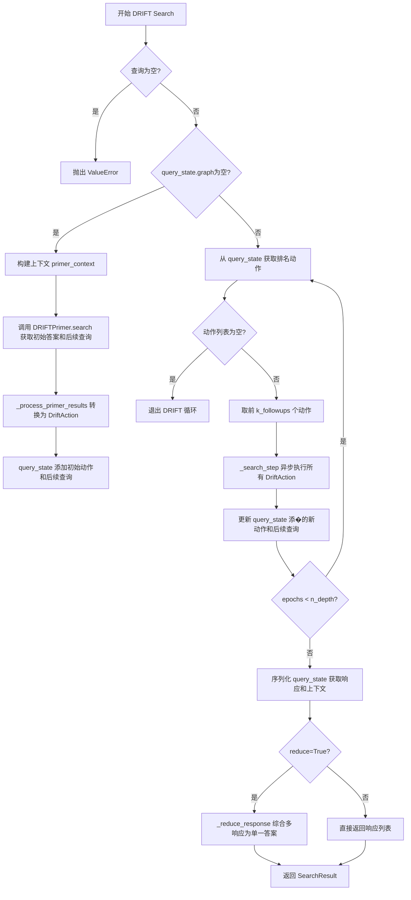
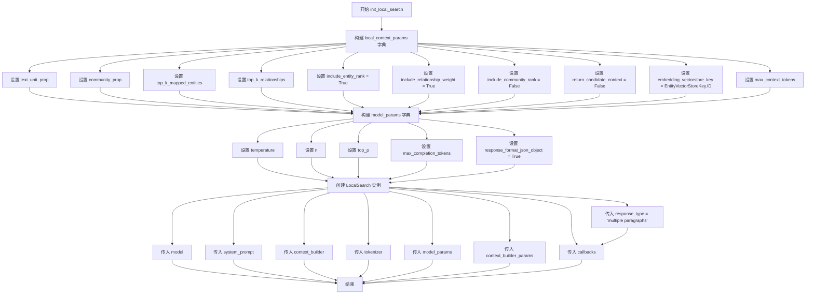
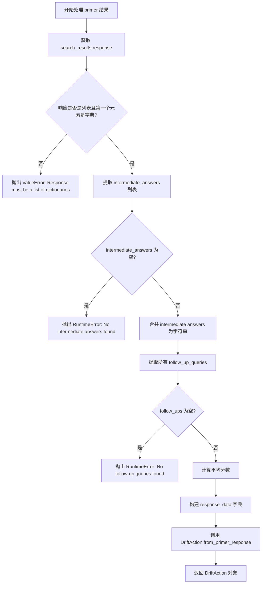
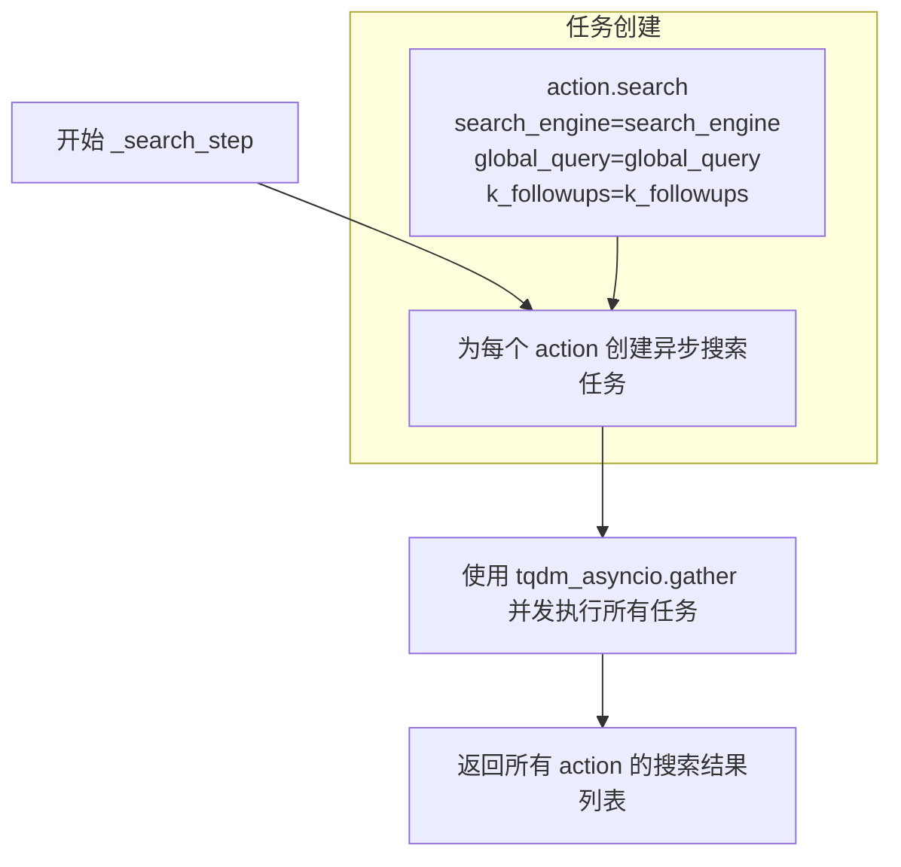
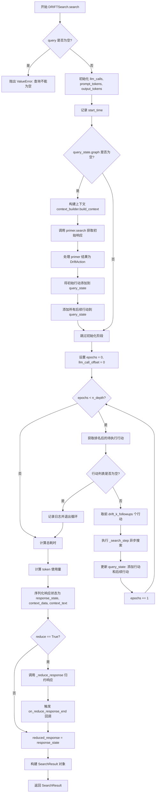
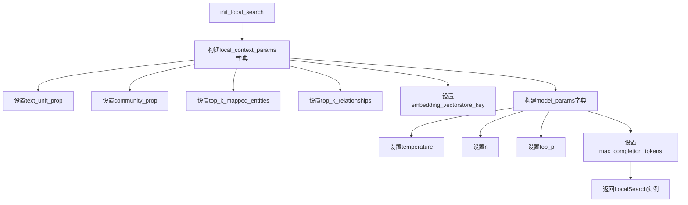
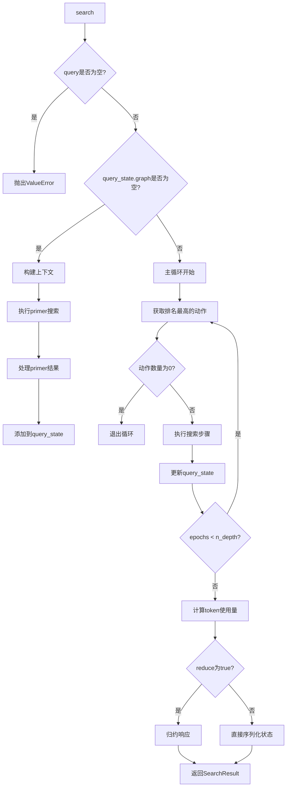

# `graphrag\packages\graphrag\graphrag\query\structured_search\drift_search\search.py` 详细设计文档

DRIFT Search（Deep Retrieval and Inference Tracking Search）是一种高级搜索实现，通过多轮迭代的搜索-行动循环来深度探索知识图谱和文档集合，最终将多个中间答案综合为单一全面的响应。

## 整体流程



## 类结构

```
BaseSearch (抽象基类)
└── DRIFTSearch (主搜索类)
    ├── DRIFTSearchContextBuilder (上下文构建器)
    ├── DRIFTPrimer (初始查询引导)
    ├── LocalSearch (本地搜索引擎)
    ├── QueryState (查询状态管理)
    ├── DriftAction (搜索动作)
    └── QueryCallbacks (回调接口)
```

## 全局变量及字段


### `logger`
    
模块级日志记录器，用于记录DRIFTSearch类运行过程中的日志信息

类型：`logging.Logger`
    


### `DRIFTSearch.model`
    
语言模型实例，用于执行搜索和响应生成任务

类型：`LLMCompletion`
    


### `DRIFTSearch.context_builder`
    
搜索上下文构建器，负责构建查询所需的上下文环境

类型：`DRIFTSearchContextBuilder`
    


### `DRIFTSearch.tokenizer`
    
分词器，用于对文本进行token编码和解码

类型：`Tokenizer`
    


### `DRIFTSearch.query_state`
    
当前查询状态，维护搜索过程中的状态信息和中间结果

类型：`QueryState`
    


### `DRIFTSearch.primer`
    
初始查询引导器，用于生成初始搜索引导和中间问题

类型：`DRIFTPrimer`
    


### `DRIFTSearch.callbacks`
    
回调函数列表，用于在搜索过程中触发特定事件的回调

类型：`list[QueryCallbacks]`
    


### `DRIFTSearch.local_search`
    
本地搜索实例，用于执行具体的本地搜索操作

类型：`LocalSearch`
    
    

## 全局函数及方法


### `DRIFTSearch.__init__`

该方法是 `DRIFTSearch` 类的构造函数，用于初始化 DRIFT Search 实例。它接收语言模型、上下文构建器、tokenizer、查询状态和回调函数等参数，并在此过程中初始化内部组件如 DRIFTPrimer 和 LocalSearch。

参数：

-  `model`：`LLMCompletion`，用于搜索的语言模型实例
-  `context_builder`：`DRIFTSearchContextBuilder`，用于构建搜索上下文的构建器
-  `tokenizer`：`Tokenizer | None`，可选的 Token 编码器，用于管理 Token；若未提供则使用模型的 tokenizer
-  `query_state`：`QueryState | None`，可选的当前搜索查询状态；若未提供则创建新的默认状态
-  `callbacks`：`list[QueryCallbacks] | None`，可选的查询回调函数列表

返回值：`None`，构造函数无返回值，仅初始化实例属性

#### 流程图

```mermaid
flowchart TD
    A[开始 __init__] --> B[调用父类初始化 super().__init__]
    B --> C[设置 context_builder 属性]
    D{tokenizer 是否为 None?} -->|是| E[使用 model.tokenizer]
    D -->|否| F[使用传入的 tokenizer]
    E --> G[设置 tokenizer 属性]
    F --> G
    G --> H{tokenizer 参数为 None?}
    H -->|是| I[创建新的 QueryState]
    H -->|否| J[使用传入的 query_state]
    I --> K[设置 query_state 属性]
    J --> K
    K --> L[创建 DRIFTPrimer 实例]
    L --> M{callbacks 参数为 None?}
    M -->|是| N[创建空列表]
    M -->|否| O[使用传入的 callbacks 列表]
    N --> P[设置 callbacks 属性]
    O --> P
    P --> Q[调用 init_local_search 方法]
    Q --> R[创建 LocalSearch 实例]
    R --> S[设置 local_search 属性]
    S --> T[结束 __init__]
```

#### 带注释源码

```python
def __init__(
    self,
    model: "LLMCompletion",
    context_builder: DRIFTSearchContextBuilder,
    tokenizer: Tokenizer | None = None,
    query_state: QueryState | None = None,
    callbacks: list[QueryCallbacks] | None = None,
):
    """
    Initialize the DRIFTSearch class.

    Args:
        llm (ChatOpenAI): The language model used for searching.
        context_builder (DRIFTSearchContextBuilder): Builder for search context.
        config (DRIFTSearchConfig, optional): Configuration settings for DRIFTSearch.
        tokenizer (Tokenizer, optional): Token encoder for managing tokens.
        query_state (QueryState, optional): State of the current search query.
    """
    # 调用父类 BaseSearch 的初始化方法，传入模型、上下文构建器和 tokenizer
    super().__init__(model, context_builder, tokenizer)

    # 设置上下文构建器属性，用于后续搜索时构建查询上下文
    self.context_builder = context_builder
    
    # 设置 tokenizer：如果未提供则使用模型的 tokenizer
    self.tokenizer = tokenizer or model.tokenizer
    
    # 设置查询状态：如果未提供则创建新的默认 QueryState 实例
    self.query_state = query_state or QueryState()
    
    # 创建 DRIFTPrimer 实例，用于生成初始搜索动作和后续查询
    self.primer = DRIFTPrimer(
        config=self.context_builder.config,
        chat_model=model,
        tokenizer=self.tokenizer,
    )
    
    # 设置回调函数列表：如果未提供则使用空列表
    self.callbacks = callbacks or []
    
    # 初始化本地搜索模块，用于执行具体的搜索操作
    self.local_search = self.init_local_search()
```


### `DRIFTSearch.init_local_search`

该方法根据 DRIFT 搜索配置初始化 LocalSearch 对象，构建本地搜索所需的上下文参数和模型参数，并返回配置好的 LocalSearch 实例。

参数：

- 该方法无显式参数（隐式使用 `self`）

返回值：`LocalSearch`，返回配置好的 LocalSearch 实例，用于执行本地搜索操作。

#### 流程图



#### 带注释源码

```python
def init_local_search(self) -> LocalSearch:
    """
    Initialize the LocalSearch object with parameters based on the DRIFT search configuration.

    Returns
    -------
    LocalSearch: An instance of the LocalSearch class with the configured parameters.
    """
    # 构建本地搜索的上下文参数字典
    local_context_params = {
        # 文本单元比例：从配置中获取本地搜索的文本单元比例
        "text_unit_prop": self.context_builder.config.local_search_text_unit_prop,
        # 社区比例：从配置中获取本地搜索的社区比例
        "community_prop": self.context_builder.config.local_search_community_prop,
        # 映射实体的Top K数量：从配置中获取
        "top_k_mapped_entities": self.context_builder.config.local_search_top_k_mapped_entities,
        # 关系的Top K数量：从配置中获取
        "top_k_relationships": self.context_builder.config.local_search_top_k_relationships,
        # 是否包含实体排名：固定为 True
        "include_entity_rank": True,
        # 是否包含关系权重：固定为 True
        "include_relationship_weight": True,
        # 是否包含社区排名：固定为 False
        "include_community_rank": False,
        # 是否返回候选上下文：固定为 False
        "return_candidate_context": False,
        # 嵌入向量存储键：固定为 EntityVectorStoreKey.ID
        "embedding_vectorstore_key": EntityVectorStoreKey.ID,
        # 最大上下文 tokens 数量：从配置中获取本地搜索的最大数据 tokens 数
        "max_context_tokens": self.context_builder.config.local_search_max_data_tokens,
    }

    # 构建模型参数字典
    model_params = {
        # 温度参数：从配置中获取本地搜索的温度设置
        "temperature": self.context_builder.config.local_search_temperature,
        # 生成数量：从配置中获取本地搜索的 n 值
        "n": self.context_builder.config.local_search_n,
        # Top P 采样：从配置中获取本地搜索的 top_p 值
        "top_p": self.context_builder.config.local_search_top_p,
        # 最大生成 tokens：从配置中获取本地搜索的最大生成 completion tokens 数
        "max_completion_tokens": self.context_builder.config.local_search_llm_max_gen_completion_tokens,
        # 响应格式：固定为 JSON 对象格式
        "response_format_json_object": True,
    }

    # 创建并返回配置好的 LocalSearch 实例
    return LocalSearch(
        model=self.model,  # 语言模型实例
        system_prompt=self.context_builder.local_system_prompt,  # 本地搜索系统提示
        context_builder=self.context_builder.local_mixed_context,  # 本地混合上下文构建器
        tokenizer=self.tokenizer,  # 分词器
        model_params=model_params,  # 模型参数
        context_builder_params=local_context_params,  # 上下文参数
        response_type="multiple paragraphs",  # 响应类型为多段落
        callbacks=self.callbacks,  # 回调函数列表
    )
```


### `DRIFTSearch._process_primer_results`

处理 primer 搜索的结果，从响应中提取中间答案和后续查询，并生成相应的 DriftAction 对象。

参数：

- `query`：`str`，原始搜索查询
- `search_results`：`SearchResult`，来自 primer 搜索的结果

返回值：`DriftAction`，从 primer 响应生成的动作

#### 流程图



#### 带注释源码

```python
def _process_primer_results(
    self, query: str, search_results: SearchResult
) -> DriftAction:
    """
    Process the results from the primer search to extract intermediate answers and follow-up queries.

    Args:
        query (str): The original search query.
        search_results (SearchResult): The results from the primer search.

    Returns
    -------
    DriftAction: Action generated from the primer response.

    Raises
    ------
    RuntimeError: If no intermediate answers or follow-up queries are found in the primer response.
    """
    # 获取搜索结果中的响应数据
    response = search_results.response
    
    # 检查响应是否是字典列表格式
    if isinstance(response, list) and isinstance(response[0], dict):
        # 从每个字典中提取 intermediate_answer 字段
        intermediate_answers = [
            i["intermediate_answer"] for i in response if "intermediate_answer" in i
        ]

        # 如果没有提取到中间答案，抛出运行时错误
        if not intermediate_answers:
            error_msg = "No intermediate answers found in primer response. Ensure that the primer response includes intermediate answers."
            raise RuntimeError(error_msg)

        # 将多个中间答案用换行符连接成一个大字符串
        intermediate_answer = "\n\n".join([
            i["intermediate_answer"] for i in response if "intermediate_answer" in i
        ])

        # 从所有响应中收集 follow_up_queries（支持多个）
        follow_ups = [fu for i in response for fu in i.get("follow_up_queries", [])]

        # 如果没有后续查询，抛出运行时错误
        if not follow_ups:
            error_msg = "No follow-up queries found in primer response. Ensure that the primer response includes follow-up queries."
            raise RuntimeError(error_msg)

        # 计算所有响应的平均分数（用于评估结果质量）
        score = sum(i.get("score", float("-inf")) for i in response) / len(response)
        
        # 构建包含中间答案、后续查询和分数的响应数据字典
        response_data = {
            "intermediate_answer": intermediate_answer,
            "follow_up_queries": follow_ups,
            "score": score,
        }
        
        # 使用工厂方法创建 DriftAction 对象
        return DriftAction.from_primer_response(query, response_data)
    
    # 如果响应格式不符合预期，抛出值错误
    error_msg = "Response must be a list of dictionaries."
    raise ValueError(error_msg)
```


### `DRIFTSearch._search_step`

执行一个异步搜索步骤，通过异步执行每个 DriftAction 来完成搜索。

参数：

- `self`：`DRIFTSearch`，DRIFTSearch 类的实例
- `global_query`：`str`，全局查询字符串
- `k_followups`：`int`，跟进查询的数量
- `search_engine`：`LocalSearch`，本地搜索引擎实例
- `actions`：`list[DriftAction]]`，要执行的 DriftAction 列表

返回值：`list[DriftAction]]`，异步执行搜索动作后的结果列表

#### 流程图



#### 带注释源码

```python
async def _search_step(
    self,
    global_query: str,
    k_followups: int,
    search_engine: LocalSearch,
    actions: list[DriftAction],
) -> list[DriftAction]:
    """
    执行一个异步搜索步骤，通过异步执行每个 DriftAction 来完成搜索。

    参数:
        global_query (str): 全局查询字符串
        k_followups (int): 跟进查询的数量
        search_engine (LocalSearch): 本地搜索引擎实例
        actions (list[DriftAction]): 要执行的 DriftAction 列表

    返回:
        list[DriftAction]: 异步执行搜索动作后的结果列表
    """
    # 为每个 DriftAction 创建异步搜索任务
    # 每个 action 都会调用自身的 search 方法，传入搜索引擎、全局查询和跟进数量
    tasks = [
        action.search(
            search_engine=search_engine,
            global_query=global_query,
            k_followups=k_followups,
        )
        for action in actions
    ]
    # 使用 tqdm_asyncio.gather 并发执行所有搜索任务
    # leave=False 表示完成后不保留进度条
    return await tqdm_asyncio.gather(*tasks, leave=False)
```


### `DRIFTSearch.search`

该方法是DRIFT搜索的核心异步实现，通过多轮迭代的局部搜索和逐步聚焦来完成复杂查询的检索与回答。它首先检查查询状态是否为空，若为空则通过DRIFTPrimer进行初始搜索并生成行动项，随后进入主循环执行多轮局部搜索（LocalSearch），每轮根据排名选择最优的待执行行动，并在每轮结束后更新查询状态与后续行动队列，最终将所有中间响应聚合归约为单一的综合答案返回。

参数：

- `query`：`str`，用户输入的搜索查询字符串
- `conversation_history`：`Any`，可选的会话历史记录，用于上下文理解
- `reduce`：`bool`，是否将多轮响应归约为单一综合答案，默认为True
- `**kwargs`：`Any`，额外的关键字参数

返回值：`SearchResult`，包含归约后的响应、上下文数据、上下文文本、完成时间、LLM调用次数、各类token使用统计等信息

#### 流程图



#### 带注释源码

```python
async def search(
    self,
    query: str,
    conversation_history: Any = None,
    reduce: bool = True,
    **kwargs,
) -> SearchResult:
    """
    Perform an asynchronous DRIFT search.

    Args:
        query (str): The query to search for.
        conversation_history (Any, optional): The conversation history, if any.
        reduce (bool, optional): Whether to reduce the response to a single comprehensive response.

    Returns
    -------
    SearchResult: The search result containing the response and context data.

    Raises
    ------
    ValueError: If the query is empty.
    """
    # 参数验证：确保查询不为空，否则抛出 ValueError
    if query == "":
        error_msg = "DRIFT Search query cannot be empty."
        raise ValueError(error_msg)

    # 初始化用于统计的字典：记录各阶段的 LLM 调用次数和 token 使用量
    llm_calls, prompt_tokens, output_tokens = {}, {}, {}

    # 记录开始时间，用于后续计算总耗时
    start_time = time.perf_counter()

    # 检查查询状态图是否为空，如果是则需要进行初始化（Primer 阶段）
    if not self.query_state.graph:
        # 构建搜索上下文，获取上下文内容和 token 统计
        primer_context, token_ct = await self.context_builder.build_context(query)
        llm_calls["build_context"] = token_ct["llm_calls"]
        prompt_tokens["build_context"] = token_ct["prompt_tokens"]
        output_tokens["build_context"] = token_ct["output_tokens"]

        # 调用 DRIFTPrimer 进行初始搜索，获取中间答案和后续查询
        primer_response = await self.primer.search(
            query=query, top_k_reports=primer_context
        )
        llm_calls["primer"] = primer_response.llm_calls
        prompt_tokens["primer"] = primer_response.prompt_tokens
        output_tokens["primer"] = primer_response.output_tokens

        # 将 primer 响应处理为 DriftAction 行动对象
        init_action = self._process_primer_results(query, primer_response)
        # 将初始行动添加到查询状态
        self.query_state.add_action(init_action)
        # 将初始行动的所有后续查询添加到查询状态
        self.query_state.add_all_follow_ups(init_action, init_action.follow_ups)

    # 主循环：根据配置深度 n_depth 进行多轮迭代搜索
    epochs = 0
    llm_call_offset = 0
    while epochs < self.context_builder.config.n_depth:
        # 获取排名后的未完成行动列表
        actions = self.query_state.rank_incomplete_actions()
        
        # 如果没有待执行行动，记录日志并退出循环
        if len(actions) == 0:
            logger.debug("No more actions to take. Exiting DRIFT loop.")
            break
        
        # 限制每次迭代只处理 drift_k_followups 个行动
        actions = actions[: self.context_builder.config.drift_k_followups]
        llm_call_offset += (
            len(actions) - self.context_builder.config.drift_k_followups
        )
        
        # 异步执行搜索步骤，对每个行动调用局部搜索
        results = await self._search_step(
            global_query=query,
            k_followups=self.context_builder.config.drift_k_followups,
            search_engine=self.local_search,
            actions=actions,
        )

        # 更新查询状态：添加执行结果行动及其后续查询
        for action in results:
            self.query_state.add_action(action)
            self.query_state.add_all_follow_ups(action, action.follow_ups)
        
        # 迭代轮次加一
        epochs += 1

    # 计算总耗时
    t_elapsed = time.perf_counter() - start_time

    # 计算行动阶段的 token 使用量
    token_ct = self.query_state.action_token_ct()
    llm_calls["action"] = token_ct["llm_calls"]
    prompt_tokens["action"] = token_ct["prompt_tokens"]
    output_tokens["action"] = token_ct["output_tokens"]

    # 将响应状态序列化为响应文本、上下文数据和上下文文本
    response_state, context_data, context_text = self.query_state.serialize(
        include_context=True
    )

    # 默认使用原始响应状态
    reduced_response = response_state
    
    # 如果需要归约：将多轮响应合并为单一综合答案
    if reduce:
        # 触发归约开始回调
        for callback in self.callbacks:
            callback.on_reduce_response_start(response_state)

        # 准备模型参数：温度和最大生成 token 数
        model_params = {
            "temperature": self.context_builder.config.reduce_temperature,
            "max_completion_tokens": self.context_builder.config.reduce_max_completion_tokens,
        }

        # 调用内部方法 _reduce_response 执行归约
        reduced_response = await self._reduce_response(
            responses=response_state,
            query=query,
            llm_calls=llm_calls,
            prompt_tokens=prompt_tokens,
            output_tokens=output_tokens,
            model_params=model_params,
        )

        # 触发归约结束回调
        for callback in self.callbacks:
            callback.on_reduce_response_end(reduced_response)
    
    # 构建并返回 SearchResult 对象，包含所有统计信息
    return SearchResult(
        response=reduced_response,
        context_data=context_data,
        context_text=context_text,
        completion_time=t_elapsed,
        llm_calls=sum(llm_calls.values()),
        prompt_tokens=sum(prompt_tokens.values()),
        output_tokens=sum(output_tokens.values()),
        llm_calls_categories=llm_calls,
        prompt_tokens_categories=prompt_tokens,
        output_tokens_categories=output_tokens,
    )
```


### `DRIFTSearch.stream_search`

执行异步流式DRIFT搜索，通过流式方式返回经Reduce处理后的最终响应。首先调用基础搜索获取多轮交互结果，然后使用流式Reduce操作将响应汇总后逐步输出给调用者。

参数：

- `query`：`str`，要搜索的查询字符串
- `conversation_history`：`ConversationHistory | None`，可选的对话历史，用于维护搜索上下文

返回值：`AsyncGenerator[str, None]`，异步生成器，逐步产出合并后的响应文本字符串

#### 流程图

```mermaid
flowchart TD
    A[开始 stream_search] --> B{调用 self.search}
    B -->|reduce=False| C[执行 DRIFT 搜索]
    C --> D{result.response 是列表?}
    D -->|是| E[取 response[0]]
    D -->|否| F[保持原 response]
    E --> G[触发 on_reduce_response_start 回调]
    F --> G
    G --> H[设置 reduce 模型参数]
    H --> I[调用 _reduce_response_streaming]
    I --> J{迭代流式响应块?}
    J -->|是| K[累加响应到 full_response]
    K --> L[yield 当前响应块]
    L --> J
    J -->|否| M[触发 on_reduce_response_end 回调]
    M --> N[结束]
```

#### 带注释源码

```python
async def stream_search(
    self, query: str, conversation_history: ConversationHistory | None = None
) -> AsyncGenerator[str, None]:
    """
    执行异步流式 DRIFT 搜索。

    该方法是 DRIFTSearch 的流式接口，通过以下步骤实现：
    1. 调用基础 search 方法获取多轮交互的搜索结果（不进行 reduce）
    2. 对结果进行预处理（列表转单元素）
    3. 触发 reduce 开始回调
    4. 使用流式方式执行 reduce 操作，逐步 yield 响应片段
    5. 触发 reduce 结束回调

    Args:
        query: str - 要搜索的查询字符串
        conversation_history: ConversationHistory | None - 可选的对话历史

    Yields:
        str - 逐步产出的响应文本片段

    Returns:
        AsyncGenerator[str, None] - 异步生成器，产出最终合并的响应
    """
    # 步骤1: 调用基础搜索方法，传入 reduce=False 以获取原始的多轮响应
    # 这里获取的是 DRIFT 多轮检索后的原始结果，而非最终合并的响应
    result = await self.search(
        query=query, conversation_history=conversation_history, reduce=False
    )

    # 步骤2: 预处理响应结果
    # 如果响应是列表形式，取第一个元素作为主要响应
    # 这是因为多轮搜索可能返回多个中间结果
    if isinstance(result.response, list):
        result.response = result.response[0]

    # 步骤3: 触发 reduce 开始的回调
    # 通知所有注册的回调函数即将开始 reduce 操作
    for callback in self.callbacks:
        callback.on_reduce_response_start(result.response)

    # 步骤4: 配置 reduce 阶段的模型参数
    # 从 context_builder 配置中获取温度和最大 token 数
    model_params = {
        "temperature": self.context_builder.config.reduce_temperature,
        "max_completion_tokens": self.context_builder.config.reduce_max_completion_tokens,
    }

    # 步骤5: 初始化完整响应累积变量
    full_response = ""

    # 步骤6: 异步迭代流式响应
    # 调用 _reduce_response_streaming 进行流式 reduce 操作
    # 该方法内部会调用 LLM 并以流式方式返回结果
    async for resp in self._reduce_response_streaming(
        responses=result.response,
        query=query,
        model_params=model_params,
    ):
        # 累积每个响应块到完整响应中
        full_response += resp
        # 步骤7: 立即 yield 当前响应块，实现流式输出
        # 调用者可以实时处理和展示响应，而不必等待完整结果
        yield resp

    # 步骤8: 触发 reduce 完成的回调
    # 通知所有回调函数 reduce 操作已完成，传入完整的响应
    for callback in self.callbacks:
        callback.on_reduce_response_end(full_response)
```


### `DRIFTSearch._reduce_response`

该方法负责将多个响应（约简阶段的中间答案）合并为一个综合性的最终响应。它通过构建特定的提示词模板，将待约简的响应作为上下文，然后调用语言模型生成最终答案。

参数：

-  `responses`：`str | dict[str, Any]`，需要约简的响应内容，可以是字符串或包含节点信息的字典
-  `query`：`str`，原始查询问题
-  `llm_calls`：`dict[str, int]`，用于记录各阶段 LLM 调用次数的字典
-  `prompt_tokens`：`dict[str, int]`，用于记录各阶段提示词 token 数量的字典
-  `output_tokens`：`dict[str, int]`，用于记录各阶段输出 token 数量的字典
-  `**llm_kwargs`：`dict[str, Any]`，传递给 LLM 的其他参数，如模型温度、最大生成 token 数等

返回值：`str`，约简后的单一综合响应

#### 流程图

```mermaid
flowchart TD
    A[开始 _reduce_response] --> B{responses 类型判断}
    B -->|str| C[将 responses 包装为列表]
    B -->|dict| D[从 responses['nodes'] 提取 answer]
    C --> E[构建约简系统提示词]
    D --> E
    E --> F[使用 CompletionMessagesBuilder 组装消息]
    F --> G[调用 model.completion_async 获取模型响应]
    G --> H[使用 gather_completion_response_async 收集完整响应]
    H --> I[更新 llm_calls/prompt_tokens/output_tokens 统计]
    I --> J[返回 reduced_response]
```

#### 带注释源码

```python
async def _reduce_response(
    self,
    responses: str | dict[str, Any],
    query: str,
    llm_calls: dict[str, int],
    prompt_tokens: dict[str, int],
    output_tokens: dict[str, int],
    **llm_kwargs,
) -> str:
    """Reduce the response to a single comprehensive response.

    Parameters
    ----------
    responses : str|dict[str, Any]
        The responses to reduce.
    query : str
        The original query.
    llm_kwargs : dict[str, Any]
        Additional keyword arguments to pass to the LLM.

    Returns
    -------
    str
        The reduced response.
    """
    # 初始化用于存储待约简响应的列表
    reduce_responses = []

    # 判断 responses 的类型：如果是字符串则直接包装为列表
    if isinstance(responses, str):
        reduce_responses = [responses]
    else:
        # 如果是字典，则从 nodes 字段中提取 answer 字段
        # 过滤掉没有 answer 的节点
        reduce_responses = [
            response["answer"]
            for response in responses.get("nodes", [])
            if response.get("answer")
        ]

    # 使用上下文构建器的 reduce_system_prompt 模板格式化提示词
    # 将约简响应列表和响应类型传入模板
    search_prompt = self.context_builder.reduce_system_prompt.format(
        context_data=reduce_responses,
        response_type=self.context_builder.response_type,
    )

    # 使用消息构建器创建消息序列
    # 1. 添加系统消息（包含约简提示词）
    # 2. 添加用户消息（原始查询）
    messages_builder = (
        CompletionMessagesBuilder()
        .add_system_message(search_prompt)
        .add_user_message(query)
    )

    # 异步调用 LLM 完成接口，传入构建好的消息和模型参数
    model_response = await self.model.completion_async(
        messages=messages_builder.build(),
        **llm_kwargs.get("model_params", {}),
    )

    # 异步收集完整的 LLM 响应内容
    reduced_response = await gather_completion_response_async(model_response)

    # 更新 token 使用统计
    # 约简阶段增加 1 次 LLM 调用
    llm_calls["reduce"] = 1
    # 提示词 token 数 = 系统提示词编码长度 + 查询编码长度
    prompt_tokens["reduce"] = len(self.tokenizer.encode(search_prompt)) + len(
        self.tokenizer.encode(query)
    )
    # 输出 token 数 = 约简响应编码长度
    output_tokens["reduce"] = len(self.tokenizer.encode(reduced_response))

    # 返回约简后的综合响应
    return reduced_response
```


### `DRIFTSearch._reduce_response_streaming`

该方法用于将多个响应流式地缩减为单个综合响应，通过异步迭代将语言模型的流式输出逐块返回给调用者。

参数：

- `self`：`DRIFTSearch`，DRIFTSearch 类的实例本身
- `responses`：`str | dict[str, Any]`，要缩减的响应，可以是字符串或字典类型
- `query`：`str`，原始查询字符串
- `model_params`：`dict[str, Any]`，传递给语言模型的参数字典

返回值：`AsyncGenerator[str, None]`，异步生成器，逐块产出缩减后的响应文本

#### 流程图

```mermaid
flowchart TD
    A[开始 _reduce_response_streaming] --> B{responses 是字符串?}
    B -->|Yes| C[reduce_responses = [responses]]
    B -->|No| D[从 responses['nodes'] 提取 answer]
    D --> E[构建 reduce_system_prompt]
    E --> F[使用 CompletionMessagesBuilder 构建消息]
    F --> G[调用 model.completion_async 流式获取响应]
    G --> H[异步迭代 chunk]
    H --> I[提取 chunk.choices[0].delta.content]
    I --> J[触发 callback.on_llm_new_token]
    J --> K[yield response_text]
    K --> H
    H -->|迭代结束| L[结束]
```

#### 带注释源码

```python
async def _reduce_response_streaming(
    self,
    responses: str | dict[str, Any],
    query: str,
    model_params: dict[str, Any],
) -> AsyncGenerator[str, None]:
    """Reduce the response to a single comprehensive response.

    Parameters
    ----------
    responses : str|dict[str, Any]
        The responses to reduce.
    query : str
        The original query.

    Returns
    -------
    str
        The reduced response.
    """
    # 初始化存储缩减响应的列表
    reduce_responses = []

    # 根据 responses 类型进行处理
    if isinstance(responses, str):
        # 如果是字符串，直接包装为列表
        reduce_responses = [responses]
    else:
        # 如果是字典，从 nodes 中提取 answer 字段
        reduce_responses = [
            response["answer"]
            for response in responses.get("nodes", [])
            if response.get("answer")
        ]

    # 使用上下文构建器的 reduce_system_prompt 模板格式化提示词
    search_prompt = self.context_builder.reduce_system_prompt.format(
        context_data=reduce_responses,
        response_type=self.context_builder.response_type,
    )

    # 构建消息结构：系统消息 + 用户查询
    messages_builder = (
        CompletionMessagesBuilder()
        .add_system_message(search_prompt)
        .add_user_message(query)
    )

    # 调用语言模型的异步流式接口获取响应
    response_search: AsyncIterator[
        LLMCompletionChunk
    ] = await self.model.completion_async(
        messages=messages_builder.build(), stream=True, **model_params
    )  # type: ignore

    # 异步迭代流式响应块
    async for chunk in response_search:
        # 提取当前块的文本内容
        response_text = chunk.choices[0].delta.content or ""
        # 对每个回调触发新 token 事件
        for callback in self.callbacks:
            callback.on_llm_new_token(response_text)
        # 将文本块产出给调用者
        yield response_text
```

## 关键组件


### DRIFTSearch 类

主搜索类，继承自 BaseSearch，实现异步 DRIFT 搜索算法，支持迭代式深度优先检索和结果归约。

### DRIFTPrimer

搜索初始化组件，用于对原始查询进行初步检索，生成中间答案和后续查询。

### LocalSearch

本地搜索组件，用于在单个搜索步骤中执行具体的检索任务，支持文本单元、社区和实体等多种上下文。

### DriftAction

行动类，代表 DRIFT 搜索中的单个操作，包含中间答案、后续查询和评分信息。

### QueryState

查询状态管理类，维护搜索过程中的所有行动、follow-up 查询以及 token 使用统计。

### DRIFTSearchContextBuilder

上下文构建器，为 DRIFT 搜索准备必要的上下文信息，包括系统提示和响应类型配置。

### _process_primer_results 方法

处理初始搜索结果，提取中间答案和后续查询，将其转换为 DriftAction 对象。

### _search_step 方法

异步执行搜索步骤，并发执行多个 DriftAction 的搜索任务。

### _reduce_response 方法

将多个搜索结果归约为单个综合响应，通过 LLM 合并中间答案。

### _reduce_response_streaming 方法

流式归约响应，支持实时输出归约后的答案片段。

### init_local_search 方法

初始化 LocalSearch 实例，配置本地搜索的参数如文本单元比例、实体数量和 token 限制。

### search 方法

主搜索入口，实现 DRIFT 算法的完整流程：初始化 → 迭代搜索 → 状态更新 → 结果归约。

### stream_search 方法

流式搜索接口，支持逐步输出最终响应，适用于需要实时展示结果的场景。


## 问题及建议


### 已知问题

-   **类型标注不一致**：`stream_search` 方法中 `conversation_history` 参数类型标注为 `ConversationHistory | None`，而 `search` 方法中为 `Any`，存在类型不一致问题
-   **重复代码**：`_reduce_response` 和 `_reduce_response_streaming` 方法中构建 `reduce_responses` 的逻辑完全重复，可提取为独立方法
-   **未使用的变量**：`llm_call_offset` 变量被计算但从未使用，属于死代码
-   **错误处理不完善**：`_process_primer_results` 方法直接访问 `response[0]` 而未先检查列表是否为空，可能导致索引越界异常
-   **文档与实现不符**：类初始化方法文档中参数名为 `llm`，实际参数名为 `model`
-   **魔法数字和字符串**：`"multiple paragraphs"`、超时配置等硬编码在代码中，缺乏配置化

### 优化建议

-   统一 `conversation_history` 参数的类型标注，使用一致的 `ConversationHistory | None` 类型
-   将 `_reduce_response` 和 `_reduce_response_streaming` 中的公共逻辑提取为私有辅助方法，如 `_build_reduce_responses`
-   移除未使用的 `llm_call_offset` 变量，或在注释中说明其用途
-   在 `_process_primer_results` 方法开头添加空列表检查：`if not response or not isinstance(response, list): raise ValueError(...)`
-   修正文档字符串中的参数名，保持与实际参数一致
-   将硬编码的 `"multiple paragraphs"` 等字符串提取为配置常量或类属性
-   考虑为 `QueryState` 添加状态重置方法，避免在多次搜索调用间存在状态污染

## 其它


### 1. 一段话描述

DRIFTSearch是一种基于图的迭代式多轮检索增强生成(RAG)搜索方法，通过初始"priming"阶段使用语言模型生成中间答案和后续查询，然后在多轮迭代中执行局部搜索扩展知识图谱，最后将多个响应归约为统一的综合答案。

### 2. 文件的整体运行流程

文件定义了`DRIFTSearch`类，继承自`BaseSearch`。整体运行流程如下：
1. 初始化：创建DRIFTSearch实例，初始化LocalSearch和DRIFTPrimer
2. Priming阶段：构建上下文，通过DRIFTPrimer生成初始中间答案和后续查询
3. 主循环：迭代执行多轮搜索，每轮选取排名最高的未完成动作执行局部搜索
4. 响应归约：将多轮搜索的结果归约为单一综合响应
5. 返回SearchResult：包含响应内容、上下文数据、token统计等信息

### 3. 类的详细信息

#### 3.1 DRIFTSearch类

##### 类字段

| 名称 | 类型 | 描述 |
|------|------|------|
| context_builder | DRIFTSearchContextBuilder | 搜索上下文构建器 |
| tokenizer | Tokenizer | 文本分词器 |
| query_state | QueryState | 当前查询状态管理 |
| primer | DRIFTPrimer | 初始搜索引物 |
| callbacks | list[QueryCallbacks] | 查询回调函数列表 |
| local_search | LocalSearch | 本地搜索引擎实例 |

##### 类方法

###### __init__

```python
def __init__(
    self,
    model: "LLMCompletion",
    context_builder: DRIFTSearchContextBuilder,
    tokenizer: Tokenizer | None = None,
    query_state: QueryState | None = None,
    callbacks: list[QueryCallbacks] | None = None,
):
```

| 参数名称 | 参数类型 | 参数描述 |
|----------|----------|----------|
| model | LLMCompletion | 语言模型实例 |
| context_builder | DRIFTSearchContextBuilder | 搜索上下文构建器 |
| tokenizer | Tokenizer \| None | 可选的分词器，默认使用模型的tokenizer |
| query_state | QueryState \| None | 可选的查询状态，默认创建新状态 |
| callbacks | list[QueryCallbacks] \| None | 可选的回调函数列表 |

| 返回值类型 | 返回值描述 |
|------------|------------|
| None | 初始化方法，无返回值 |

###### init_local_search

```python
def init_local_search(self) -> LocalSearch:
```

| 参数名称 | 参数类型 | 参数描述 |
|----------|----------|----------|
| self | DRIFTSearch | 当前实例 |

| 返回值类型 | 返回值描述 |
|------------|------------|
| LocalSearch | 配置好的本地搜索实例 |

**Mermaid流程图：**



###### _process_primer_results

```python
def _process_primer_results(
    self, query: str, search_results: SearchResult
) -> DriftAction:
```

| 参数名称 | 参数类型 | 参数描述 |
|----------|----------|----------|
| self | DRIFTSearch | 当前实例 |
| query | str | 原始查询字符串 |
| search_results | SearchResult | Priming搜索结果 |

| 返回值类型 | 返回值描述 |
|------------|------------|
| DriftAction | 从primer响应生成的动作 |

| 异常类型 | 异常描述 |
|----------|----------|
| RuntimeError | 当未找到中间答案或后续查询时 |
| ValueError | 当响应格式不正确时 |

###### _search_step

```python
async def _search_step(
    self,
    global_query: str,
    k_followups: int,
    search_engine: LocalSearch,
    actions: list[DriftAction],
) -> list[DriftAction]:
```

| 参数名称 | 参数类型 | 参数描述 |
|----------|----------|----------|
| self | DRIFTSearch | 当前实例 |
| global_query | str | 全局查询字符串 |
| k_followups | int | 后续查询数量 |
| search_engine | LocalSearch | 本地搜索引擎 |
| actions | list[DriftAction] | 待执行的动作列表 |

| 返回值类型 | 返回值描述 |
|------------|------------|
| list[DriftAction] | 异步执行后的动作结果列表 |

###### search

```python
async def search(
    self,
    query: str,
    conversation_history: Any = None,
    reduce: bool = True,
    **kwargs,
) -> SearchResult:
```

| 参数名称 | 参数类型 | 参数描述 |
|----------|----------|----------|
| self | DRIFTSearch | 当前实例 |
| query | str | 搜索查询 |
| conversation_history | Any | 可选的对话历史 |
| reduce | bool | 是否归约响应，默认True |
| **kwargs | Any | 额外关键字参数 |

| 返回值类型 | 返回值描述 |
|------------|------------|
| SearchResult | 包含响应和上下文的搜索结果 |

| 异常类型 | 异常描述 |
|----------|----------|
| ValueError | 当查询为空时 |

**Mermaid流程图：**



###### stream_search

```python
async def stream_search(
    self, query: str, conversation_history: ConversationHistory | None = None
) -> AsyncGenerator[str, None]:
```

| 参数名称 | 参数类型 | 参数描述 |
|----------|----------|----------|
| self | DRIFTSearch | 当前实例 |
| query | str | 搜索查询 |
| conversation_history | ConversationHistory \| None | 可选的对话历史 |

| 返回值类型 | 返回值描述 |
|------------|------------|
| AsyncGenerator[str, None] | 异步生成器，逐块返回响应 |

###### _reduce_response

```python
async def _reduce_response(
    self,
    responses: str | dict[str, Any],
    query: str,
    llm_calls: dict[str, int],
    prompt_tokens: dict[str, int],
    output_tokens: dict[str, int],
    **llm_kwargs,
) -> str:
```

| 参数名称 | 参数类型 | 参数描述 |
|----------|----------|----------|
| self | DRIFTSearch | 当前实例 |
| responses | str \| dict[str, Any] | 待归约的响应 |
| query | str | 原始查询 |
| llm_calls | dict[str, int] | LLM调用计数 |
| prompt_tokens | dict[str, int] | prompt token计数 |
| output_tokens | dict[str, int] | output token计数 |
| **llm_kwargs | Any | 额外的LLM参数 |

| 返回值类型 | 返回值描述 |
|------------|------------|
| str | 归约后的综合响应 |

###### _reduce_response_streaming

```python
async def _reduce_response_streaming(
    self,
    responses: str | dict[str, Any],
    query: str,
    model_params: dict[str, Any],
) -> AsyncGenerator[str, None]:
```

| 参数名称 | 参数类型 | 参数描述 |
|----------|----------|----------|
| self | DRIFTSearch | 当前实例 |
| responses | str \| dict[str, Any] | 待归约的响应 |
| query | str | 原始查询 |
| model_params | dict[str, Any] | 模型参数 |

| 返回值类型 | 返回值描述 |
|------------|------------|
| AsyncGenerator[str, None] | 异步生成器，逐块返回归约后的响应 |

### 4. 全局变量和全局函数

| 名称 | 类型 | 描述 |
|------|------|------|
| logger | logging.Logger | 模块级日志记录器 |

### 5. 关键组件信息

| 组件名称 | 描述 |
|----------|------|
| DRIFTSearch | 主搜索类，实现迭代式图搜索算法 |
| LocalSearch | 本地搜索引擎，用于执行具体的图搜索操作 |
| DRIFTPrimer | 引物搜索器，用于生成初始中间答案和后续查询 |
| QueryState | 查询状态管理器，跟踪搜索进度和中间结果 |
| DriftAction | 搜索动作类，代表一次具体的搜索操作 |
| DRIFTSearchContextBuilder | 上下文构建器，负责准备搜索所需的上下文数据 |
| BaseSearch | 搜索基类，定义搜索接口规范 |
| SearchResult | 搜索结果数据类，包含响应、上下文和统计信息 |

### 6. 设计目标与约束

**设计目标：**
- 实现基于知识图谱的多轮迭代搜索
- 支持流式和非流式两种搜索模式
- 通过priming机制引导搜索方向
- 提供可配置的搜索深度和广度参数
- 支持对话历史上下文

**设计约束：**
- 依赖外部LLM模型进行自然语言理解和生成
- 需要配置有效的tokenizer
- 搜索深度(n_depth)和后续查询数(drift_k_followups)受配置限制
- 响应归约阶段需要足够的context tokens

### 7. 错误处理与异常设计

| 异常场景 | 异常类型 | 处理方式 |
|----------|----------|----------|
| 查询为空 | ValueError | 抛出"DRIFT Search query cannot be empty." |
| Primer响应缺少中间答案 | RuntimeError | 抛出"No intermediate answers found..." |
| Primer响应缺少后续查询 | RuntimeError | 抛出"No follow-up queries found..." |
| Primer响应格式错误 | ValueError | 抛出"Response must be a list of dictionaries." |

**异常设计原则：**
- 运行时错误立即终止搜索流程
- 通过回调机制通知错误状态
- 错误信息包含具体原因便于调试

### 8. 数据流与状态机

**数据流：**
```
query → ContextBuilder.build_context → DRIFTPrimer.search 
→ _process_primer_results → DriftAction → QueryState
→ 迭代搜索循环 → LocalSearch.search → DriftAction
→ QueryState.serialize → _reduce_response → SearchResult
```

**状态机转换：**
1. **IDLE** → **PRIMING**：query_state.graph为空时
2. **PRIMING** → **SEARCHING**：完成primer搜索后
3. **SEARCHING** → **SEARCHING**：继续有未完成动作时
4. **SEARCHING** → **REDUCING**：无更多动作或达到深度限制
5. **REDUCING** → **COMPLETED**：完成响应归约

### 9. 外部依赖与接口契约

**外部依赖：**
| 依赖模块 | 用途 |
|----------|------|
| graphrag_llm.tokenizer.Tokenizer | 文本分词 |
| graphrag_llm.completion.LLMCompletion | LLM调用接口 |
| graphrag.query.structured_search.base.BaseSearch | 搜索基类 |
| graphrag.query.structured_search.drift_search.* | DRIFT相关组件 |
| graphrag.query.context_builder.* | 上下文构建 |
| tqdm.asyncio | 异步进度条 |

**接口契约：**
- `search(query, conversation_history, reduce, **kwargs)` 返回SearchResult
- `stream_search(query, conversation_history)` 返回AsyncGenerator[str, None]
- LocalSearch必须实现search方法并返回SearchResult
- QueryState必须支持add_action、add_all_follow_ups、serialize等方法

### 10. 配置参数

| 参数名称 | 描述 | 来源 |
|----------|------|------|
| n_depth | 搜索迭代深度 | context_builder.config |
| drift_k_followups | 每轮后续查询数 | context_builder.config |
| local_search_* | 本地搜索相关配置 | context_builder.config |
| reduce_* | 响应归约相关配置 | context_builder.config |

### 11. 性能考量

- 异步并行执行多个搜索动作
- token使用量跟踪和统计
- 主循环有最大迭代次数保护
- 流式响应减少首字节延迟

### 12. 潜在的技术债务或优化空间

1. **错误处理不足**：缺乏重试机制，网络异常会导致搜索直接失败
2. **资源清理**：未看到显式的资源释放或连接池管理
3. **缓存机制**：重复查询未实现缓存，可能造成不必要的LLM调用
4. **类型注解**：部分类型使用Any过于宽泛，如conversation_history
5. **日志记录**：仅在debug级别记录"No more actions"，生产环境可观测性不足
6. **硬编码字符串**：错误消息和系统提示中有多处硬编码字符串
7. **回调异常处理**：回调函数抛出异常时未捕获，可能导致主流程中断

### 13. 单元测试与集成测试建议

- 测试空查询抛出ValueError
- 测试primer响应格式错误处理
- 测试多轮迭代的正确执行
- 测试reduce=True和reduce=False两种模式
- 测试流式响应的正确性
- 模拟LLM响应进行集成测试


    