# `graphrag\packages\graphrag\graphrag\query\structured_search\drift_search\state.py` 详细设计文档

管理DRIFT查询的状态，使用NetworkX的MultiDiGraph存储和管理查询动作及其关联关系，支持动作的添加、关联、查找未完成动作、排序、序列化和反序列化，并提供token计数统计功能。

## 整体流程

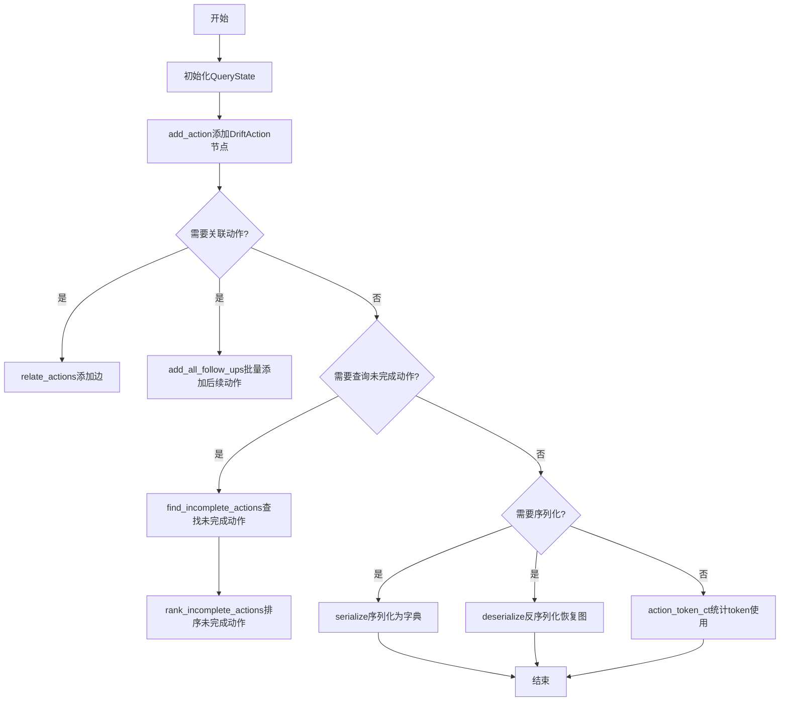

## 类结构

```
QueryState (查询状态管理类)
```

## 全局变量及字段


### `logger`
    
模块级日志记录器，用于输出查询状态管理过程中的日志信息

类型：`logging.Logger`
    


### `QueryState.graph`
    
NetworkX多重有向图，用于存储DriftAction节点及其关系边的查询动作图结构

类型：`nx.MultiDiGraph`
    
    

## 全局函数及方法


### `QueryState.__init__`

初始化 QueryState 实例，创建一个空的 NetworkX 多重有向图（MultiDiGraph）用于管理 DRIFT 查询的操作状态图。

参数：

- `self`：`QueryState`，当前 QueryState 实例，用于访问实例属性和方法

返回值：`None`，构造函数不返回值，仅初始化实例属性

#### 流程图

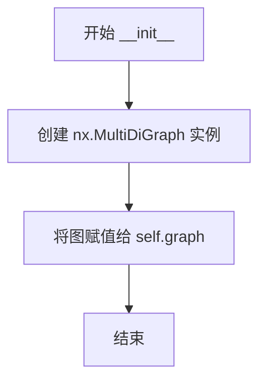

#### 带注释源码

```python
def __init__(self):
    """Initialize the QueryState instance with an empty graph."""
    # 创建一个 NetworkX 多重有向图用于存储和管理查询动作
    # MultiDiGraph 允许节点间存在多条边，适用于复杂的动作依赖关系
    self.graph = nx.MultiDiGraph()
```


### `QueryState.add_action`

将一个动作（DriftAction）添加到查询状态图中，可选择附加元数据。

参数：

- `action`：`DriftAction`，要添加到图中的动作对象
- `metadata`：`dict[str, Any] | None`，可选的元数据字典，用于存储关于该动作的额外信息

返回值：`None`，该方法直接修改图结构，不返回任何值

#### 流程图

```mermaid
flowchart TD
    A[开始 add_action] --> B[接收参数 action: DriftAction, metadata: dict | None]
    B --> C{metadata is None?}
    C -->|是| D[使用空字典 {}]
    C -->|否| E[使用传入的metadata]
    D --> F[调用 self.graph.add_node action 和 metadata]
    E --> F
    F --> G[结束]
```

#### 带注释源码

```python
def add_action(self, action: DriftAction, metadata: dict[str, Any] | None = None):
    """Add an action to the graph with optional metadata."""
    # 使用 NetworkX MultiDiGraph 的 add_node 方法将动作添加到图中
    # action 作为节点，metadata 作为节点属性
    # 如果 metadata 为 None，则使用空字典展开
    self.graph.add_node(action, **(metadata or {}))
```


### QueryState.relate_actions

在图结构中建立两个 DriftAction 节点之间的有向边关系，将父动作与子动作关联起来，可选地指定连接的权重值。

参数：

- `self`：`QueryState`，当前 QueryState 实例本身
- `parent`：`DriftAction`，父动作节点，作为边的起点
- `child`：`DriftAction`，子动作节点，作为边的终点
- `weight`：`float`，边的权重值，默认为 1.0，用于表示父子动作之间的关联强度

返回值：`None`，该方法直接修改图结构，不返回任何值

#### 流程图

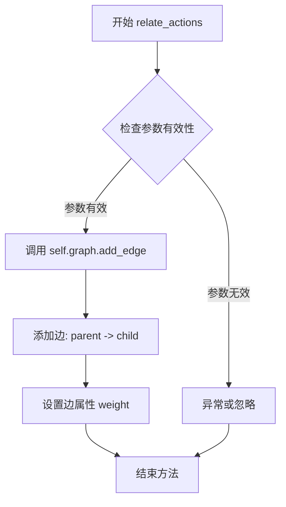

#### 带注释源码

```python
def relate_actions(
    self, parent: DriftAction, child: DriftAction, weight: float = 1.0
):
    """Relate two actions in the graph."""
    # 使用 NetworkX MultiDiGraph 的 add_edge 方法添加有向边
    # 参数 parent: 边的起始节点（父动作）
    # 参数 child: 边的目标节点（子动作）
    # 参数 weight: 边的权重属性，默认为 1.0
    # 该方法会在图中创建 parent -> child 的有向关系
    self.graph.add_edge(parent, child, weight=weight)
```


### `QueryState.add_all_follow_ups`

该方法用于将一组后续操作（follow-up actions）添加到查询状态图中，并将它们与给定的原始操作关联起来，形成操作之间的父子关系。

参数：

- `action`：`DriftAction`，原始操作，后续操作将被链接到此操作
- `follow_ups`：`list[DriftAction] | list[str]`，要添加的后续操作列表，可以是 DriftAction 对象列表或字符串列表
- `weight`：`float`，连接边的权重，默认为 1.0

返回值：`None`，该方法不返回任何值

#### 流程图

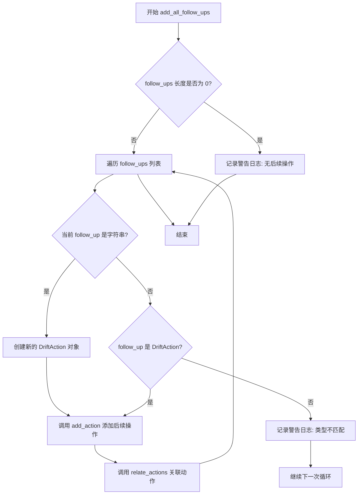

#### 带注释源码

```python
def add_all_follow_ups(
    self,
    action: DriftAction,
    follow_ups: list[DriftAction] | list[str],
    weight: float = 1.0,
):
    """Add all follow-up actions and links them to the given action."""
    # 检查后续操作列表是否为空，如果为空则记录警告日志
    if len(follow_ups) == 0:
        logger.warning("No follow-up actions for action: %s", action.query)

    # 遍历每一个后续操作
    for follow_up in follow_ups:
        # 如果后续操作是字符串，则将其转换为 DriftAction 对象
        if isinstance(follow_up, str):
            follow_up = DriftAction(query=follow_up)
        # 如果后续操作既不是字符串也不是 DriftAction 类型，记录警告日志
        elif not isinstance(follow_up, DriftAction):
            logger.warning(
                "Follow-up action is not a string, found type: %s", type(follow_up)
            )

        # 将后续操作添加到图中（调用 add_action 方法）
        self.add_action(follow_up)
        # 将原始操作与后续操作建立关联关系（添加边）
        self.relate_actions(action, follow_up, weight)
```


### `QueryState.find_incomplete_actions`

该方法用于从查询状态图（QueryState.graph）中筛选出所有未完成（is_complete=False）的动作（DriftAction），并将其作为列表返回，供后续处理（如排序或执行）使用。

参数： 无

返回值：`list[DriftAction]`，返回一个包含所有未完成动作对象的列表

#### 流程图

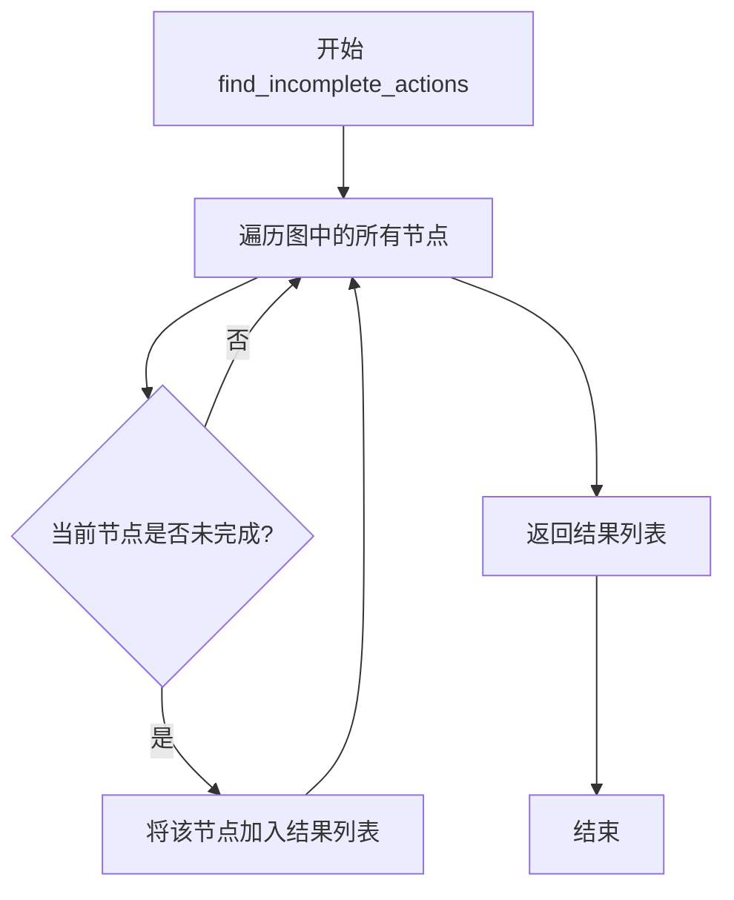

#### 带注释源码

```python
def find_incomplete_actions(self) -> list[DriftAction]:
    """Find all unanswered actions in the graph."""
    # 使用列表推导式遍历图中所有节点（DriftAction对象）
    # 筛选条件：node.is_complete 为 False 表示该动作尚未完成
    # 返回满足条件的全部 DriftAction 对象组成的列表
    return [node for node in self.graph.nodes if not node.is_complete]
```


### `QueryState.rank_incomplete_actions`

该方法用于对图中的所有未完成动作（DriftAction）进行排序。如果提供了评分器（scorer），则根据评分器计算每个未完成动作的分数，并按分数降序返回；如果未提供评分器，则随机打乱顺序返回未完成动作列表。

参数：

- `scorer`：`Callable[[DriftAction], float] | None`，可选的评分函数，接收一个 DriftAction 对象并返回一个 float 类型的分数，用于对未完成动作进行排序

返回值：`list[DriftAction]`，返回排序后的未完成动作列表

#### 流程图

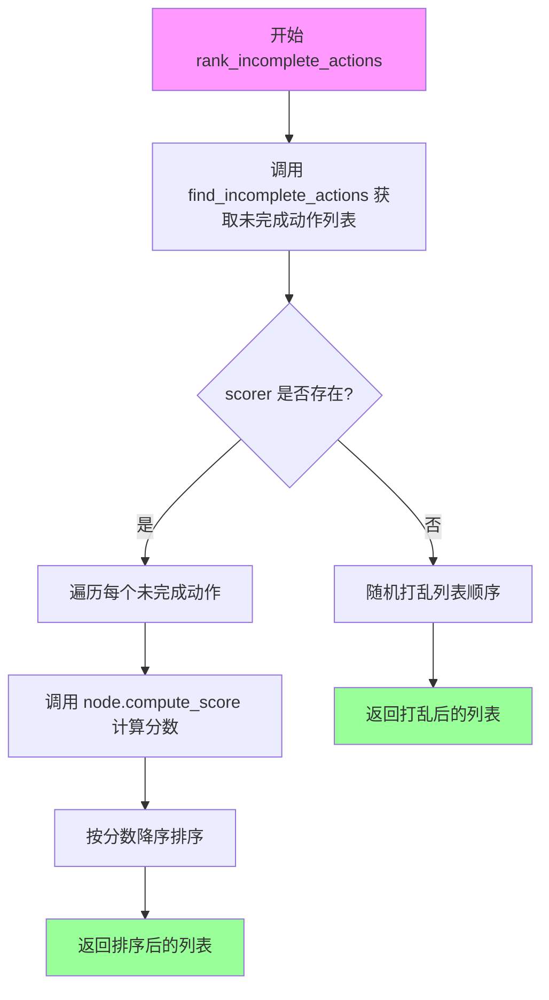

#### 带注释源码

```python
def rank_incomplete_actions(
    self, scorer: Callable[[DriftAction], float] | None = None
) -> list[DriftAction]:
    """Rank all unanswered actions in the graph if scorer available."""
    # 第一步：调用 find_incomplete_actions 获取图中所有未完成的动作
    unanswered = self.find_incomplete_actions()
    
    # 第二步：如果提供了评分器（scorer），则对每个未完成动作进行评分和排序
    if scorer:
        # 遍历所有未完成动作，为每个动作计算分数
        for node in unanswered:
            node.compute_score(scorer)
        
        # 按分数降序排序返回列表，分数为 None 的动作排在最后
        return sorted(
            unanswered,
            key=lambda node: (
                node.score if node.score is not None else float("-inf")
            ),
            reverse=True,
        )

    # 第三步：如果没有提供评分器，则随机打乱顺序后返回
    # shuffle the list if no scorer
    random.shuffle(unanswered)
    return list(unanswered)
```


### `QueryState.serialize`

将查询状态图序列化为字典格式，包含节点和边的数据，可选择是否包含上下文信息。

参数：

- `include_context`：`bool`，可选参数，默认为 `True`，指定是否在返回值中包含上下文数据

返回值：`dict[str, Any] | tuple[dict[str, Any], dict[str, Any], str]`

- 当 `include_context=False` 时：返回 `dict[str, Any]`，包含序列化的节点 (`nodes`) 和边 (`edges`)
- 当 `include_context=True` 时：返回三元组 `(dict[str, Any], dict[str, Any], str)`
  - 第一个元素：节点和边数据
  - 第二个元素：上下文数据字典
  - 第三个元素：上下文数据的字符串表示

#### 流程图

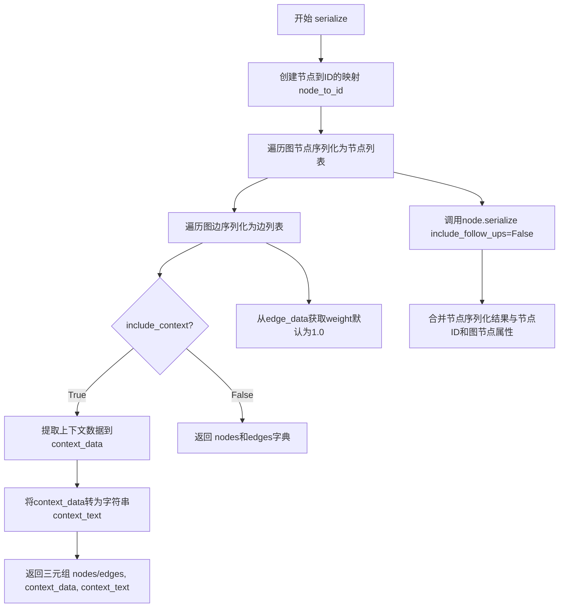

#### 带注释源码

```python
def serialize(
    self, include_context: bool = True
) -> dict[str, Any] | tuple[dict[str, Any], dict[str, Any], str]:
    """Serialize the graph to a dictionary, including nodes and edges."""
    # 第一步：创建节点到唯一ID的映射
    # 使用枚举为图中的每个节点分配一个从0开始的整数索引
    node_to_id = {node: idx for idx, node in enumerate(self.graph.nodes())}

    # 第二步：序列化节点
    # 遍历图中的每个节点，调用节点的serialize方法
    # 合并节点序列化结果、分配的ID、以及图中该节点的属性（如metadata）
    nodes: list[dict[str, Any]] = [
        {
            **node.serialize(include_follow_ups=False),  # 调用DriftAction的序列化方法
            "id": node_to_id[node],                       # 添加节点ID映射
            **self.graph.nodes[node],                     # 展开节点的图属性（如metadata）
        }
        for node in self.graph.nodes()
    ]

    # 第三步：序列化边
    # 遍历图中的每条边，将源节点和目标节点转换为对应的ID
    # 并提取边的权重数据，默认为1.0
    edges: list[dict[str, Any]] = [
        {
            "source": node_to_id[u],              # 边的起始节点ID
            "target": node_to_id[v],              # 边的终止节点ID
            "weight": edge_data.get("weight", 1.0),  # 边的权重，默认为1.0
        }
        for u, v, edge_data in self.graph.edges(data=True)
    ]

    # 第四步：可选地处理上下文数据
    # 仅当include_context为True时执行，用于返回额外的上下文信息
    if include_context:
        # 从节点中提取包含context_data的元数据
        # 键为节点的query字符串，值为metadata中的context_data
        context_data = {
            node["query"]: node["metadata"]["context_data"]
            for node in nodes
            if node["metadata"].get("context_data") and node.get("query")
        }

        # 将上下文数据字典转换为字符串格式
        context_text = str(context_data)

        # 返回三元组：图数据、上下文数据字典、上下文文本
        return {"nodes": nodes, "edges": edges}, context_data, context_text

    # 当include_context为False时，仅返回图结构数据
    return {"nodes": nodes, "edges": edges}
```


### `QueryState.deserialize`

将序列化的字典数据反序列化为图结构，重建节点和边的关系。

参数：

- `data`：`dict[str, Any]`，包含节点（nodes）和边（edges）信息的字典数据

返回值：`None`，该方法直接修改实例的 `graph` 属性，不返回任何值

#### 流程图

```mermaid
flowchart TD
    A[开始 deserialize] --> B[清空当前图: self.graph.clear]
    B --> C[创建空映射字典: id_to_action = {}]
    C --> D{遍历 nodes 数据}
    D -->|for node_data| E[提取 node_id 和节点数据]
    E --> F[调用 DriftAction.deserialize 反序列化动作]
    F --> G[添加动作到图中: self.add_action]
    G --> H[建立映射: id_to_action[node_id] = action]
    H --> D
    D -->|遍历完毕| I{遍历 edges 数据}
    I -->|for edge_data| J[提取 source_id, target_id, weight]
    J --> K[从映射中获取源动作和目标动作]
    K --> L{检查动作是否存在}
    L -->|是| M[关联动作: self.relate_actions]
    L -->|否| N[跳过该边]
    M --> I
    I -->|遍历完毕| O[结束 deserialize]
```

#### 带注释源码

```python
def deserialize(self, data: dict[str, Any]):
    """Deserialize the dictionary back to a graph."""
    # 1. 清空当前图，确保反序列化前图是空的
    self.graph.clear()
    # 2. 创建节点ID到动作对象的映射字典，用于后续边关联
    id_to_action = {}

    # 3. 遍历节点数据列表，重建每个动作节点
    for node_data in data.get("nodes", []):
        # 提取节点ID并从数据中移除（避免干扰反序列化）
        node_id = node_data.pop("id")
        # 调用 DriftAction 的反序列化方法重建动作对象
        action = DriftAction.deserialize(node_data)
        # 将动作添加到图中
        self.add_action(action)
        # 建立ID到动作的映射关系
        id_to_action[node_id] = action

    # 4. 遍历边数据列表，重建节点之间的关联关系
    for edge_data in data.get("edges", []):
        # 提取源节点ID、目标节点ID和权重
        source_id = edge_data["source"]
        target_id = edge_data["target"]
        weight = edge_data.get("weight", 1.0)  # 默认权重为1.0
        # 从映射字典中获取对应的动作对象
        source_action = id_to_action.get(source_id)
        target_action = id_to_action.get(target_id)
        # 仅当源动作和目标动作都存在时才建立关联
        if source_action and target_action:
            self.relate_actions(source_action, target_action, weight)
```


### `QueryState.action_token_ct`

该方法用于统计图中所有动作节点的 LLM 调用次数、提示词令牌数和输出令牌数的总量，并返回一个包含这三个统计指标的字典。

参数：
- 无

返回值：`dict[str, int]`，返回包含 `llm_calls`（LLM 调用次数）、`prompt_tokens`（提示词令牌数）和 `output_tokens`（输出令牌数）的字典。

#### 流程图

```mermaid
flowchart TD
    A[开始] --> B[初始化计数器: llm_calls=0, prompt_tokens=0, output_tokens=0]
    B --> C{遍历图中所有节点}
    C -->|对每个 action| D[累加 llm_calls += action.metadata.llm_calls]
    D --> E[累加 prompt_tokens += action.metadata.prompt_tokens]
    E --> F[累加 output_tokens += action.metadata.output_tokens]
    F --> C
    C -->|遍历完成| G[返回 {'llm_calls': llm_calls, 'prompt_tokens': prompt_tokens, 'output_tokens': output_tokens}]
    G --> H[结束]
```

#### 带注释源码

```python
def action_token_ct(self) -> dict[str, int]:
    """Return the token count of the action."""
    # 初始化计数器，分别用于统计 LLM 调用次数、提示词令牌数和输出令牌数
    llm_calls, prompt_tokens, output_tokens = 0, 0, 0
    
    # 遍历图中的所有节点（即所有的 DriftAction 对象）
    for action in self.graph.nodes:
        # 从每个动作的元数据中提取并累加 LLM 调用次数
        llm_calls += action.metadata["llm_calls"]
        # 从每个动作的元数据中提取并累加提示词令牌数
        prompt_tokens += action.metadata["prompt_tokens"]
        # 从每个动作的元数据中提取并累加输出令牌数
        output_tokens += action.metadata["output_tokens"]
    
    # 返回包含三个统计指标的字典
    return {
        "llm_calls": llm_calls,
        "prompt_tokens": prompt_tokens,
        "output_tokens": output_tokens,
    }
```


### `QueryState.__init__`

该方法用于初始化 QueryState 类的实例，创建一个空的 NetworkX MultiDiGraph 图结构，用于存储和管理 DRIFT 查询过程中的动作节点及其关系。

参数：

- 该方法无显式参数（隐式参数 `self` 为实例本身）

返回值：`None`，无返回值（构造方法）

#### 流程图

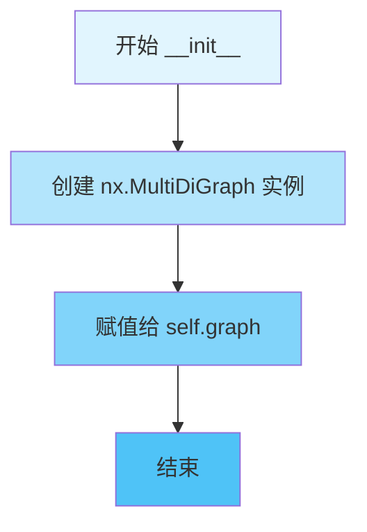

#### 带注释源码

```python
def __init__(self):
    """Initialize the QueryState instance.
    
    Creates an empty MultiDiGraph to store the query execution graph.
    The graph will contain DriftAction nodes and edges representing
    the relationships between actions.
    """
    self.graph = nx.MultiDiGraph()  # 创建一个空的MultiDiGraph图结构，用于存储动作节点和边
```

#### 补充说明

| 项目 | 说明 |
|------|------|
| **所属类** | `QueryState` |
| **方法类型** | 实例构造方法 |
| **图库依赖** | NetworkX (`nx`) 的 `MultiDiGraph` 类，支持多重有向图 |
| **设计意图** | 为 DRIFT 查询状态管理提供一个可持久化和关联动作的图结构基础 |
| **技术债务** | 当前仅创建空图，未预设任何节点/边的容量或性能优化参数 |


### `QueryState.add_action`

将一个动作（DriftAction）节点添加到状态图（MultiDiGraph）中，并可选地附加元数据信息。

参数：

- `action`：`DriftAction`，要添加到图中的动作对象
- `metadata`：`dict[str, Any] | None`，可选的元数据字典，用于存储额外的键值对信息，默认为 None

返回值：`None`，该方法直接修改图结构，不返回任何值

#### 流程图

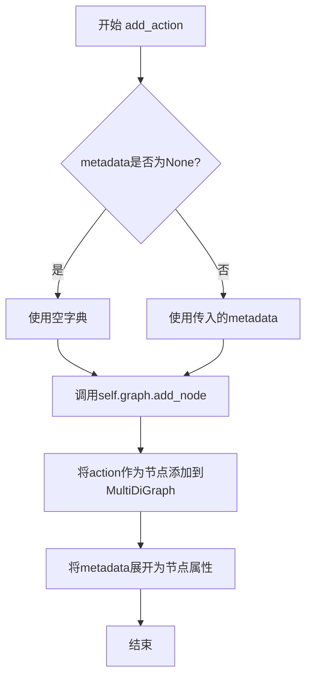

#### 带注释源码

```python
def add_action(self, action: DriftAction, metadata: dict[str, Any] | None = None):
    """Add an action to the graph with optional metadata."""
    # 使用 nx.MultiDiGraph 的 add_node 方法将动作添加到图中
    # action 作为节点本身被存储
    # metadata 中的所有键值对会被展开并存储为该节点的属性
    # 如果 metadata 为 None，则使用空字典 {}
    self.graph.add_node(action, **(metadata or {}))
```


### `QueryState.relate_actions`

在查询状态图中建立两个动作之间的父子关系连接，通过添加带权重的边将子动作关联到父动作。

参数：

- `parent`：`DriftAction`，父动作，作为边的起始节点
- `child`：`DriftAction`，子动作，作为边的目标节点
- `weight`：`float`，权重，默认为 1.0，表示父子动作之间关系的强度

返回值：`None`，无返回值，该方法直接修改图结构

#### 流程图

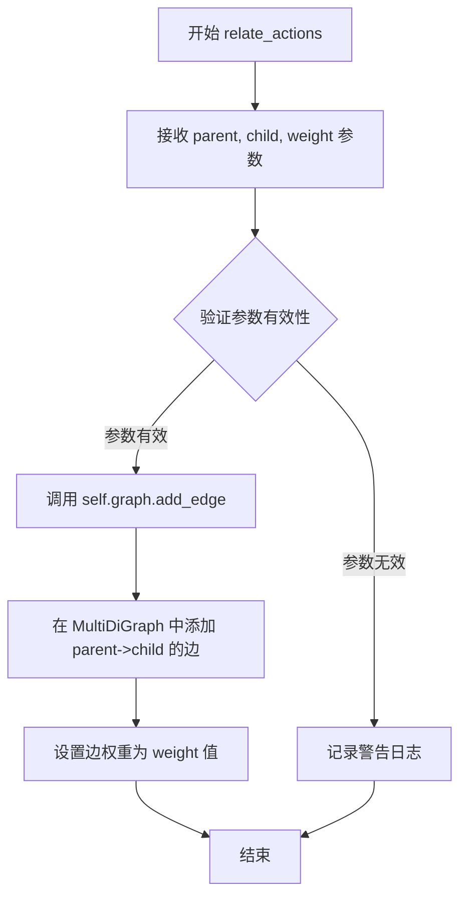

#### 带注释源码

```python
def relate_actions(
    self, parent: DriftAction, child: DriftAction, weight: float = 1.0
):
    """Relate two actions in the graph.
    
    在查询状态图中建立两个动作之间的父子关系。
    该方法创建一个有向边从父动作指向子动作，
    用于追踪动作的执行顺序和依赖关系。
    
    Args:
        parent: 父动作，作为关系的起始点
        child: 子动作，作为关系的目标点
        weight: 边的权重，默认为1.0，用于后续路径计算和排序
    
    Returns:
        None: 无返回值，直接修改内部图结构
    """
    # 调用 NetworkX MultiDiGraph 的 add_edge 方法添加有向边
    # 边从 parent 指向 child，并携带 weight 属性
    self.graph.add_edge(parent, child, weight=weight)
```


### `QueryState.add_all_follow_ups`

为给定的父操作添加多个后续操作（follow-up actions），并将它们与父操作建立关联关系，同时支持将字符串类型的后续操作自动转换为 `DriftAction` 对象。

参数：

- `self`：`QueryState`，隐式参数，表示当前查询状态实例
- `action`：`DriftAction`，父操作，后续操作将链接到此操作
- `follow_ups`：`list[DriftAction] | list[str]`，后续操作列表，可以是 `DriftAction` 对象列表或字符串列表（字符串将被转换为 `DriftAction` 对象）
- `weight`：`float`，可选，默认值为 `1.0`，用于指定父操作与后续操作之间边的权重

返回值：`None`，该方法无返回值，直接修改实例的内部状态

#### 流程图

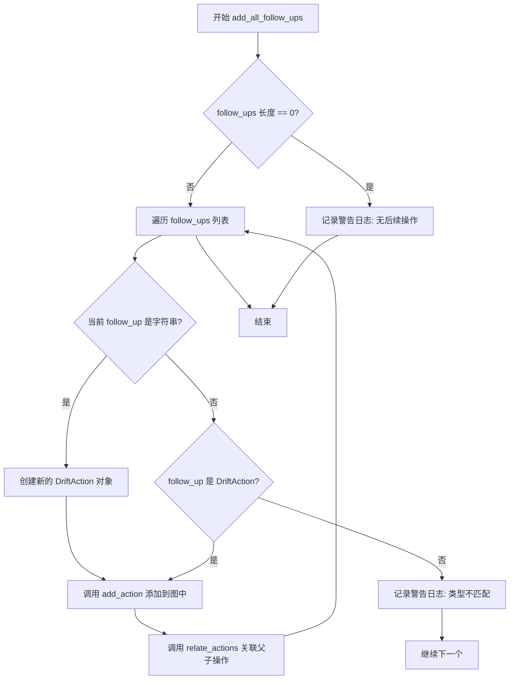

#### 带注释源码

```python
def add_all_follow_ups(
    self,
    action: DriftAction,
    follow_ups: list[DriftAction] | list[str],
    weight: float = 1.0,
):
    """Add all follow-up actions and links them to the given action."""
    # 检查后续操作列表是否为空，若为空则记录警告日志
    if len(follow_ups) == 0:
        logger.warning("No follow-up actions for action: %s", action.query)

    # 遍历每一个后续操作
    for follow_up in follow_ups:
        # 如果后续操作是字符串，则创建一个新的 DriftAction 对象
        if isinstance(follow_up, str):
            follow_up = DriftAction(query=follow_up)
        # 如果后续操作既不是字符串也不是 DriftAction，则记录警告日志
        elif not isinstance(follow_up, DriftAction):
            logger.warning(
                "Follow-up action is not a string, found type: %s", type(follow_up)
            )

        # 将后续操作添加到图中
        self.add_action(follow_up)
        # 建立父子操作之间的关联关系，带有权重
        self.relate_actions(action, follow_up, weight)
```


### `QueryState.find_incomplete_actions`

该方法用于在查询状态图中查找所有未完成的操作（即尚未完成的动作）。它通过遍历图中的所有节点，筛选出 `is_complete` 属性为 `False` 的动作并返回列表。

参数：

- 无（仅包含隐式参数 `self`）

返回值：`list[DriftAction]`，返回图中所有未完成的 `DriftAction` 对象列表

#### 流程图

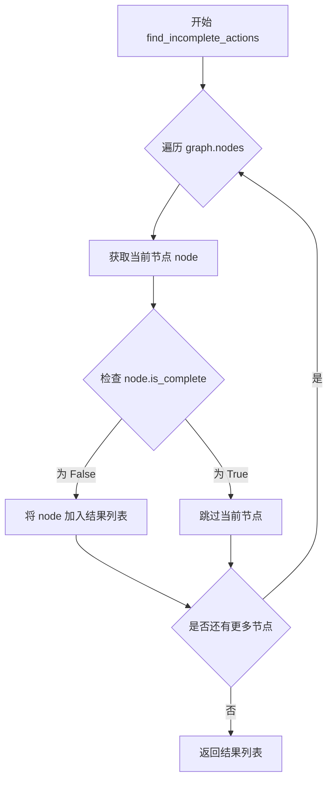

#### 带注释源码

```python
def find_incomplete_actions(self) -> list[DriftAction]:
    """Find all unanswered actions in the graph."""
    # 遍历图中的所有节点（DriftAction 对象）
    # 列表推导式筛选出 is_complete 属性为 False 的节点
    return [node for node in self.graph.nodes if not node.is_complete]
```


### `QueryState.rank_incomplete_actions`

该方法用于对图中的未完成操作（DriftAction）进行排序。如果提供了评分器（scorer），则根据评分器计算每个操作的得分并按得分降序排列；否则随机打乱顺序返回未完成的操作列表。

参数：

- `scorer`：`Callable[[DriftAction], float] | None`，可选的评分函数，用于计算每个 DriftAction 的得分

返回值：`list[DriftAction]`，排序或打乱后的未完成操作列表

#### 流程图

```mermaid
flowchart TD
    A[开始 rank_incomplete_actions] --> B[调用 find_incomplete_actions 获取未完成动作]
    B --> C{scorer 是否存在?}
    C -->|是| D[遍历每个未完成动作]
    D --> E[调用 node.compute_score(scorer) 计算分数]
    E --> F[按分数降序排序]
    F --> G[返回排序后的列表]
    C -->|否| H[使用 random.shuffle 打乱列表]
    H --> I[返回打乱后的列表]
```

#### 带注释源码

```python
def rank_incomplete_actions(
    self, scorer: Callable[[DriftAction], float] | None = None
) -> list[DriftAction]:
    """Rank all unanswered actions in the graph if scorer available."""
    # 步骤1：获取图中所有未完成的动作
    unanswered = self.find_incomplete_actions()
    
    # 步骤2：检查是否提供了评分器
    if scorer:
        # 步骤3a：如果有评分器，为每个未完成动作计算分数
        for node in unanswered:
            node.compute_score(scorer)
        
        # 步骤4a：按分数降序排序返回
        # 如果某个节点的分数为None，则使用负无穷大作为排序键
        return sorted(
            unanswered,
            key=lambda node: (
                node.score if node.score is not None else float("-inf")
            ),
            reverse=True,
        )

    # 步骤3b：如果没有评分器，随机打乱列表顺序
    # shuffle the list if no scorer
    random.shuffle(unanswered)
    return list(unanswered)
```


### `QueryState.serialize`

将 QueryState 中的图（graph）序列化为字典格式，可选择性地包含上下文数据。该方法将图中的节点和边转换为可序列化的格式，并可选地提取节点中的上下文信息用于调试或可视化。

参数：

- `include_context`：`bool`，默认为 `True`，控制是否返回上下文数据。当设为 `True` 时，方法返回一个三元组（节点边数据、上下文数据、上下文文本）；当设为 `False` 时，仅返回节点和边的字典。

返回值：`dict[str, Any] | tuple[dict[str, Any], dict[str, Any], str]`，如果 `include_context` 为 `True`，返回包含节点和边数据的字典、上下文数据字典和上下文文本字符串组成的三元组；否则仅返回包含节点和边数据的字典。

#### 流程图

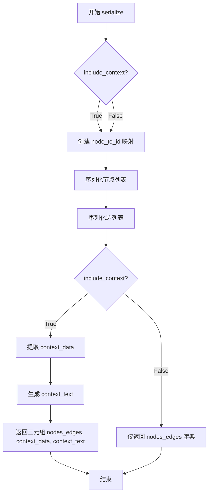

#### 带注释源码

```python
def serialize(
    self, include_context: bool = True
) -> dict[str, Any] | tuple[dict[str, Any], dict[str, Any], str]:
    """Serialize the graph to a dictionary, including nodes and edges."""
    # 创建一个从节点到唯一ID的映射，用于在边中引用节点
    node_to_id = {node: idx for idx, node in enumerate(self.graph.nodes())}

    # 序列化节点：将每个 DriftAction 节点转换为字典，并添加节点ID和图中存储的元数据
    nodes: list[dict[str, Any]] = [
        {
            **node.serialize(include_follow_ups=False),  # 调用节点的序列化方法，不包含后续动作
            "id": node_to_id[node],  # 添加节点ID
            **self.graph.nodes[node],  # 展开图中该节点的所有属性
        }
        for node in self.graph.nodes()
    ]

    # 序列化边：遍历图中的所有边，将源节点和目标节点转换为对应的ID，并提取权重
    edges: list[dict[str, Any]] = [
        {
            "source": node_to_id[u],  # 边的起始节点ID
            "target": node_to_id[v],  # 边的目标节点ID
            "weight": edge_data.get("weight", 1.0),  # 获取权重，默认为1.0
        }
        for u, v, edge_data in self.graph.edges(data=True)
    ]

    # 如果需要包含上下文数据
    if include_context:
        # 从节点中提取 context_data：遍历所有节点，收集包含 context_data 的节点查询和对应数据
        context_data = {
            node["query"]: node["metadata"]["context_data"]
            for node in nodes
            if node["metadata"].get("context_data") and node.get("query")
        }

        # 将上下文数据转换为字符串形式
        context_text = str(context_data)

        # 返回包含节点边数据、上下文数据和上下文文本的三元组
        return {"nodes": nodes, "edges": edges}, context_data, context_text

    # 如果不需要上下文数据，仅返回节点和边的字典
    return {"nodes": nodes, "edges": edges}
```


### `QueryState.deserialize`

将包含节点和边的字典数据反序列化为 QueryState 实例的图结构，恢复查询状态中的动作图。

参数：

- `self`：隐式参数，QueryState 实例本身
- `data`：`dict[str, Any]`，包含 "nodes" 和 "edges" 的字典数据，其中 nodes 是动作节点列表，每个节点包含动作的序列化数据；edges 是边列表，包含 source、target 和 weight 字段

返回值：`None`，该方法直接修改实例状态，不返回任何值

#### 流程图

```mermaid
flowchart TD
    A[开始 deserialize] --> B[清空当前图: self.graph.clear()]
    B --> C[初始化 id_to_action 字典]
    C --> D{遍历 nodes 数据}
    D -->|对于每个节点| E[提取节点 ID]
    E --> F[调用 DriftAction.deserialize 反序列化动作]
    F --> G[将动作添加到图中]
    G --> H[建立 id 到动作的映射]
    H --> D
    D -->|遍历完成| I{遍历 edges 数据}
    I -->|对于每条边| J[提取 source_id, target_id, weight]
    J --> K[从映射中获取源动作和目标动作]
    K --> L{动作都存在?}
    L -->|是| M[建立动作间的关联关系]
    L -->|否| N[跳过该边]
    M --> I
    N --> I
    I -->|遍历完成| O[结束]
```

#### 带注释源码

```python
def deserialize(self, data: dict[str, Any]):
    """将字典数据反序列化为图结构"""
    # 步骤1: 清空当前图中所有的节点和边
    self.graph.clear()
    
    # 步骤2: 初始化一个字典，用于建立节点ID到动作对象的映射
    id_to_action = {}

    # 步骤3: 遍历数据中的所有节点
    for node_data in data.get("nodes", []):
        # 提取节点ID并从节点数据中移除（避免干扰反序列化）
        node_id = node_data.pop("id")
        
        # 调用 DriftAction 的类方法 deserialize 将节点数据反序列化为 DriftAction 对象
        action = DriftAction.deserialize(node_data)
        
        # 将反序列化后的动作添加到图中
        self.add_action(action)
        
        # 建立 ID 到动作对象的映射关系，供后续边数据处理使用
        id_to_action[node_id] = action

    # 步骤4: 遍历数据中的所有边
    for edge_data in data.get("edges", []):
        # 提取边的源节点ID、目标节点ID和权重
        source_id = edge_data["source"]
        target_id = edge_data["target"]
        weight = edge_data.get("weight", 1.0)  # 默认权重为1.0
        
        # 根据ID查找对应的动作对象
        source_action = id_to_action.get(source_id)
        target_action = id_to_action.get(target_id)
        
        # 仅当源动作和目标动作都存在时才建立关联
        if source_action and target_action:
            # 调用 relate_actions 方法在两个动作之间添加边
            self.relate_actions(source_action, target_action, weight)
```


### `QueryState.action_token_ct`

该方法用于计算图中所有操作的 token 消耗统计信息，包括 LLM 调用次数、提示词 token 数量和输出 token 数量的累计总和。

参数：

- 无（仅包含 `self` 隐式参数）

返回值：`dict[str, int]`，返回一个字典，包含三个键值对：`llm_calls`（LLM 调用次数）、`prompt_tokens`（提示词 token 总数）、`output_tokens`（输出 token 总数）

#### 流程图

```mermaid
flowchart TD
    A[开始 action_token_ct] --> B[初始化计数器: llm_calls=0, prompt_tokens=0, output_tokens=0]
    B --> C{遍历 graph.nodes 中的每个 action}
    C -->|对每个 action| D[累加 llm_calls += action.metadata['llm_calls']]
    D --> E[累加 prompt_tokens += action.metadata['prompt_tokens']]
    E --> F[累加 output_tokens += action.metadata['output_tokens']]
    F --> C
    C -->|遍历完成| G[返回字典 {llm_calls, prompt_tokens, output_tokens}]
    G --> H[结束]
```

#### 带注释源码

```python
def action_token_ct(self) -> dict[str, int]:
    """Return the token count of the action."""
    # 初始化三个计数器，用于累计整个图中所有操作的 token 消耗
    llm_calls, prompt_tokens, output_tokens = 0, 0, 0
    
    # 遍历图中的所有节点（每个节点代表一个 DriftAction 操作）
    for action in self.graph.nodes:
        # 从每个操作的 metadata 中提取 LLM 调用次数并累加
        llm_calls += action.metadata["llm_calls"]
        # 从每个操作的 metadata 中提取提示词 token 数量并累加
        prompt_tokens += action.metadata["prompt_tokens"]
        # 从每个操作的 metadata 中提取输出 token 数量并累加
        output_tokens += action.metadata["output_tokens"]
    
    # 返回包含累计统计信息的字典
    return {
        "llm_calls": llm_calls,
        "prompt_tokens": prompt_tokens,
        "output_tokens": output_tokens,
    }
```

## 关键组件


## 一段话描述

QueryState类是DRIFT查询状态管理器，核心功能是使用NetworkX的MultiDiGraph数据结构维护一个动态查询动作图，支持动作的添加、关联、排序、序列化/反序列化操作，用于跟踪查询过程中的未完成动作及其依赖关系。

## 文件的整体运行流程

1. **初始化**：创建QueryState实例，初始化空的MultiDiGraph图结构
2. **动作添加**：通过add_action方法向图中添加查询动作节点，可附加元数据
3. **动作关联**：通过relate_actions方法建立父子动作之间的边关系，通过add_all_follow_ups批量添加后续动作
4. **状态查询**：find_incomplete_actions遍历图中所有未完成的动作节点
5. **动作排序**：rank_incomplete_actions根据评分器对未完成动作进行排序，支持随机打乱
6. **持久化**：serialize方法将图结构序列化为字典格式（支持上下文），deserialize方法从字典恢复图结构
7. **统计**：action_token_ct汇总图中所有动作的LLM调用统计信息

## 类的详细信息

### QueryState

**类字段**

| 名称 | 类型 | 描述 |
|------|------|------|
| graph | nx.MultiDiGraph | 存储动作节点和边的有向多图结构 |

**类方法**

#### __init__

- **参数**: 无
- **返回值**: 无
- **描述**: 初始化QueryState实例，创建空的MultiDiGraph图对象

#### add_action

- **参数**: 
  - action: DriftAction - 要添加的动作节点
  - metadata: dict[str, Any] | None = None - 可选的元数据字典
- **返回值**: 无
- **描述**: 将动作作为节点添加到图中，可附加额外属性

#### relate_actions

- **参数**:
  - parent: DriftAction - 父动作节点
  - child: DriftAction - 子动作节点
  - weight: float = 1.0 - 边的权重值
- **返回值**: 无
- **描述**: 在两个动作之间添加有向边，表示执行顺序依赖关系

#### add_all_follow_ups

- **参数**:
  - action: DriftAction - 基准动作
  - follow_ups: list[DriftAction] | list[str] - 后续动作列表
  - weight: float = 1.0 - 边权重
- **返回值**: 无
- **描述**: 批量添加后续动作，支持字符串和DriftAction两种输入，自动建立与基准动作的关联

#### find_incomplete_actions

- **参数**: 无
- **返回值**: list[DriftAction]
- **描述**: 遍历图中所有节点，筛选出is_complete属性为False的未完成动作

#### rank_incomplete_actions

- **参数**:
  - scorer: Callable[[DriftAction], float] | None = None - 评分函数
- **返回值**: list[DriftAction]
- **描述**: 对未完成动作进行排序，如果有评分器则按分数降序排列，否则随机打乱顺序

#### serialize

- **参数**:
  - include_context: bool = True - 是否包含上下文数据
- **返回值**: dict[str, Any] | tuple[dict[str, Any], dict[str, Any], str]
- **描述**: 将图结构序列化为字典，包含节点和边的信息，可选返回上下文数据

#### deserialize

- **参数**:
  - data: dict[str, Any] - 序列化后的字典数据
- **返回值**: 无
- **描述**: 从字典数据重建图结构，恢复节点和边的关系

#### action_token_ct

- **参数**: 无
- **返回值**: dict[str, int]
- **描述**: 汇总图中所有动作的LLM调用次数、prompt tokens和output tokens统计

## 关键组件信息

### MultiDiGraph图结构

使用NetworkX的MultiDiGraph存储动作关系，支持多重边（两个节点间可有多条边），用于表示复杂的查询依赖链

### 动作序列化机制

包含节点映射、边映射和可选上下文数据的三层序列化结构，支持图结构的完整持久化

### 评分排序机制

基于Callable评分器的动作优先级排序，支持自定义排序策略，默认随机打乱

## 潜在的技术债务或优化空间

1. **外部依赖过重**：强依赖networkx库，增加了项目依赖复杂度，可考虑使用轻量级图实现
2. **类型安全不足**：metadata和序列化数据缺乏严格的类型校验，运行时可能产生隐藏错误
3. **异常处理薄弱**：多个方法缺少对异常输入的防御性检查，如空graph、None节点等边界情况
4. **序列化冗余**：serialize中context_data提取逻辑复杂，可拆分为独立方法提高可读性
5. **内存占用**：find_incomplete_actions和rank_incomplete_actions每次调用都遍历全图，大规模图场景下性能堪忧
6. **评分状态污染**：评分计算直接修改node.score属性，存在副作用，应考虑无状态设计

## 其它项目

### 设计目标与约束
- 使用NetworkX作为图存储后端，保证图的数学特性
- 支持动作的动态添加和关系建立
- 序列化设计支持跨进程状态恢复

### 错误处理与异常设计
- 对空follow_ups列表仅记录warning日志
- 对非法的follow_up类型记录warning但不中断执行
- 反序列化时检查节点存在性，缺失则跳过边建立

### 数据流与状态机
- 图结构本身即状态容器
- 动作完成状态由DriftAction.is_complete属性控制
- 边的weight属性用于表示动作优先级或相关度

### 外部依赖与接口契约
- 依赖networkx库提供图数据结构
- 依赖DriftAction类定义动作节点结构
- 依赖Callable类型用于自定义评分策略
- metadata字典约定包含llm_calls、prompt_tokens、output_tokens等统计字段


## 问题及建议


### 已知问题

-   **类型安全风险**：`rank_incomplete_actions` 方法直接访问 `node.score` 和 `find_incomplete_actions` 访问 `node.is_complete`，假设节点对象必有这些属性，缺乏类型检查或属性存在性验证
-   **异常处理不足**：`action_token_ct` 方法直接访问 `action.metadata["llm_calls"]` 等键，未检查 `metadata` 字典是否包含这些键，可能抛出 `KeyError`
-   **序列化空值处理**：`serialize` 方法访问 `node["metadata"]` 和 `node["query"]` 时未做空值检查，可能导致 KeyError
-   **反序列化健壮性**：`deserialize` 方法对空数据或损坏数据处理不完善，未验证节点数据的必需字段
-   **副作用问题**：`rank_incomplete_actions` 方法会修改传入的 `node` 对象的 `score` 属性，在图中的节点对象上产生副作用，影响状态一致性
-   **图遍历效率**：多个方法（如 `serialize`、`action_token_ct`、`find_incomplete_actions`）都独立遍历整个图节点，缺乏缓存机制，存在重复计算
-   **日志不一致**：`add_all_follow_ups` 方法对无效类型仅记录警告后继续执行，可能导致部分 follow_up 被静默跳过，状态不完整
-   **错误传播缺失**：`add_all_follow_ups` 中检测到类型错误时未抛出异常，调用者无法感知操作部分失败

### 优化建议

-   **增加类型守卫**：在使用 `node.is_complete`、`node.score` 等属性前，使用 `hasattr` 或类型检查确保属性存在
-   **完善空值检查**：在访问字典键和对象属性前进行空值检查，使用 `dict.get()` 方法提供默认值
-   **改进异常处理**：对反序列化添加数据完整性验证，抛出有意义的异常而非静默失败
-   **避免副作用**：在 `rank_incomplete_actions` 中返回排序结果而非修改原节点对象，或使用不可变数据结构
-   **添加缓存机制**：对 `find_incomplete_actions` 等频繁调用的方法结果进行缓存，或使用图的入度/出度属性快速定位未完成节点
-   **统一错误处理策略**：对无效输入统一采用抛异常或返回错误的策略，并记录详细错误日志
-   **考虑依赖注入**：将 NetworkX 图操作抽象为接口，提高可测试性和模块化程度

## 其它


### 设计目标与约束

**设计目标**：提供一个用于管理 DRIFT 查询状态的核心类，能够维护一个由 DriftAction 组成的有向图结构，支持动作的添加、关联、排序、序列化等操作，以便于跟踪查询的执行状态和上下文。

**约束**：
- 依赖 networkx 库构建 MultiDiGraph 结构
- 动作节点类型必须为 DriftAction 或可转换为 DriftAction 的字符串
- 序列化/反序列化操作必须保持图的拓扑结构一致
- 不支持并发写入操作（单线程环境）

### 错误处理与异常设计

**错误处理策略**：
- 当 add_all_follow_ups 接收空列表时，记录警告日志
- 当 follow_ups 列表中的元素既不是字符串也不是 DriftAction 类型时，记录警告日志并跳过该元素
- 序列化时若节点缺少 query 字段，context_data 提取可能失败
- 反序列化时若 edge_data 中的 source_id 或 target_id 不存在对应的 action，则静默跳过该边

**异常场景**：
- 传入的 scorer 参数为非可调用对象时，可能导致运行时错误
- 反序列化时数据格式不正确（如缺少必要字段）可能导致图构建不完整

### 数据流与状态机

**数据流**：
1. 初始化：创建空的 MultiDiGraph
2. 添加动作：通过 add_action 添加节点，可选携带 metadata
3. 关联动作：通过 relate_actions 或 add_all_follow_ups 添加边
4. 查询状态：通过 find_incomplete_actions 获取未完成动作，通过 rank_incomplete_actions 排序
5. 状态输出：通过 serialize 导出图结构及上下文数据

**状态转换**：
- 动作节点从"未完成"状态转换为"已完成"状态（通过 DriftAction.is_complete 标记）
- 动作之间通过边（edge）建立父子关系，形成执行依赖链

### 外部依赖与接口契约

**外部依赖**：
- networkx：用于构建和管理 MultiDiGraph 结构
- logging：用于记录警告日志
- random：用于无 scorer 时随机打乱动作顺序
- typing：用于类型提示
- collections.abc：用于 Callable 类型提示
- graphrag.query.structured_search.drift_search.action：DriftAction 类

**接口契约**：
- add_action：接收 DriftAction 对象和可选的 metadata 字典
- relate_actions：接收两个 DriftAction 对象和可选的 weight 浮点数
- add_all_follow_ups：接收一个 DriftAction 对象和一个 follow_ups 列表（DriftAction 或字符串）
- find_incomplete_actions：返回 DriftAction 对象列表
- rank_incomplete_actions：接收可选的 scorer 函数，返回排序后的 DriftAction 列表
- serialize：接收 include_context 布尔值，返回不同的数据结构
- deserialize：接收字典数据，无返回值
- action_token_ct：返回包含 llm_calls、prompt_tokens、output_tokens 的字典

### 配置与参数

**类参数**：
- 无构造函数参数，graph 初始化为空图

**方法参数**：
- add_action: action (DriftAction), metadata (dict | None)
- relate_actions: parent (DriftAction), child (DriftAction), weight (float, 默认 1.0)
- add_all_follow_ups: action (DriftAction), follow_ups (list), weight (float, 默认 1.0)
- rank_incomplete_actions: scorer (Callable | None)
- serialize: include_context (bool, 默认 True)

### 并发与线程安全

**并发考虑**：
- 当前实现为单线程设计，无锁机制
- 多线程环境下对同一 QueryState 实例的并发操作可能导致图结构不一致
- 建议在多线程场景下为每个线程创建独立的 QueryState 实例

### 测试策略建议

**单元测试**：
- 测试 add_action 正确添加节点
- 测试 relate_actions 正确添加边
- 测试 add_all_follow_ups 正确处理字符串和 DriftAction 混合列表
- 测试 find_incomplete_actions 正确过滤未完成动作
- 测试 rank_incomplete_actions 在有/无 scorer 情况下的排序行为
- 测试 serialize/deserialize 的往返一致性

**集成测试**：
- 测试与 DriftAction 类的协同工作
- 测试序列化后的上下文数据提取

### 日志与监控

**日志记录**：
- 使用模块级 logger (logger = logging.getLogger(__name__))
- add_all_follow_ups: 当 follow_ups 为空时记录 warning 级别日志
- add_all_follow_ups: 当元素类型不匹配时记录 warning 级别日志

**监控建议**：
- 可通过 action_token_ct 方法监控 LLM 调用次数和 token 消耗
- 可通过图的节点数和边数监控查询复杂度

### 安全与隐私

**安全考虑**：
- 代码本身不直接处理敏感数据
- serialize 方法可能导出包含上下文数据的字典，需注意数据脱敏
- metadata 中的 context_data 可能包含用户查询内容，需按需过滤

### 性能考虑与优化空间

**性能瓶颈**：
- find_incomplete_actions 每次调用都遍历所有节点，时间复杂度 O(V)
- rank_incomplete_actions 对未完成动作排序，时间复杂度 O(V log V)
- serialize 方法在 include_context=True 时构建 context_data 字典，可能重复遍历节点

**优化建议**：
- 可缓存未完成动作列表，在图结构变化时更新缓存
- 可使用图的入度/出度属性优化节点遍历
- 可将 context_data 提取逻辑与节点序列化合并，减少遍历次数

    