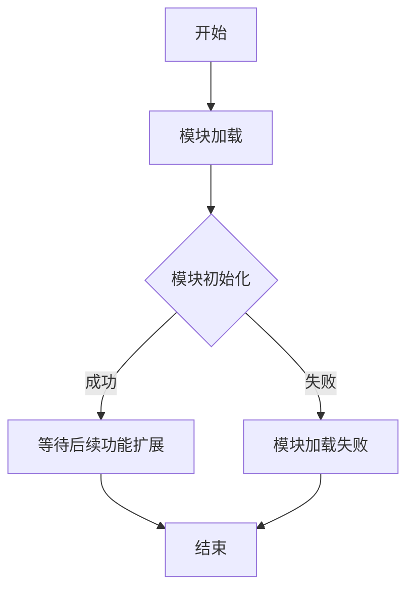

# `graphrag\packages\graphrag\graphrag\query\structured_search\global_search\__init__.py` 详细设计文档

这是一个名为GlobalSearch的模块，目前仅包含版权声明和MIT许可证信息，属于占位模块或项目框架的入口文件，实际功能实现代码尚未提供。

## 整体流程



## 类结构

```
GlobalSearch (模块根目录)
└── (暂无具体类定义)
```

## 全局变量及字段


    

## 全局函数及方法


## 关键组件


### GlobalSearch 模块

由于提供的源代码仅包含模块声明和文档字符串，未包含任何实际实现代码，无法从代码中提取具体的关键组件。基于模块名称 "GlobalSearch" 推测，该模块可能涉及以下潜在功能领域：

- 全局搜索索引结构
- 高效检索算法
- 数据 partitioning 与分布式搜索
- 查询优化与缓存策略
- 结果排序与相关性计算

如需提取具体组件信息，请提供完整的实现源代码。


## 问题及建议


### 已知问题

- 代码文件为仅包含版权声明和模块 docstring 的空壳文件，尚未实现任何实质功能
- 缺少模块的入口点或主要导出接口定义
- 没有定义任何类、全局变量或全局函数，无法进行详细的架构分析
- 缺乏错误处理、异常设计、日志记录等基础设施代码
- 未定义任何外部依赖或接口契约

### 优化建议

- 明确 GlobalSearch 模块的核心职责和功能范围，补充详细的模块文档
- 设计并实现核心类（如 GlobalSearchEngine、SearchStrategy 等）及关键方法
- 建立清晰的数据模型和接口契约，定义输入输出参数规范
- 添加适当的错误处理机制和异常类定义
- 考虑日志记录和可观测性基础设施的集成
- 定义模块的配置选项和可扩展点（如搜索策略插件化）
- 补充单元测试和集成测试的基础结构


## 其它


### 设计目标与约束

GlobalSearch模块的核心设计目标是实现一个全局搜索功能，允许用户在系统范围内快速检索和定位内容。该模块需要支持多种搜索模式（如精确匹配、模糊搜索、过滤排序等），同时保持高性能和可扩展性。约束条件包括：必须遵循MIT开源许可证协议，代码需兼容Python 3.8+版本，需要考虑与微软生态系统其他产品的集成。

### 错误处理与异常设计

GlobalSearch模块应定义统一的异常体系，包括SearchException（基础异常类）、QueryFormatException（查询格式错误）、ResultTimeoutException（搜索超时）、IndexNotFoundException（索引不存在）等。所有公开方法应进行输入验证，并向上抛出具体异常而非吞掉错误。模块内部应实现重试机制和降级策略，对于可恢复错误进行自动重试，对于不可恢复错误记录详细日志并向上传递。

### 数据流与状态机

GlobalSearch的数据流主要包括：用户输入查询请求 → 查询解析与验证 → 搜索引擎调度 → 索引查询 → 结果聚合与排序 → 结果返回。状态机方面，搜索任务应包含IDLE（空闲）、QUERY_PARSING（解析中）、SEARCHING（搜索中）、AGGREGATING（聚合中）、COMPLETED（完成）、FAILED（失败）等状态，状态转换需有明确的事件触发条件和边界处理。

### 外部依赖与接口契约

GlobalSearch模块可能依赖以下外部组件：搜索索引服务（如Elasticsearch、Azure Cognitive Search）、缓存层（如Redis）、认证授权服务、以及可能的向量数据库（如用于语义搜索）。接口契约应定义清晰的API规范，包括search(query, options)、get_index_status()、refresh_index()等核心方法，以及返回结果的标准化格式（ResultSet对象）。

### 性能要求与监控指标

模块应满足以下性能指标：P99搜索延迟需控制在200ms以内（简单查询）或500ms以内（复杂查询），支持至少1000 QPS的并发搜索请求，需提供搜索结果缓存机制（缓存命中率目标>60%）。监控指标应包括：搜索成功率、平均响应时间、缓存命中率、索引更新延迟、错误率分布等。

### 安全与隐私设计

GlobalSearch需实现细粒度的权限控制，确保用户只能搜索其有权限访问的内容。需对用户输入进行严格的XSS和注入攻击防护，所有敏感操作需记录审计日志。若涉及个人数据搜索，需支持数据脱敏和隐私合规要求（如GDPR相关的数据访问控制）。

### 配置管理

模块应支持外部化配置，包括：搜索引擎连接配置、缓存策略配置、超时和重试策略、日志级别配置、功能开关（如是否启用高级搜索、是否启用缓存等）。配置应支持热更新机制，无需重启服务即可生效。

### 版本兼容性与发展路线

模块需保持向后兼容性，新版本不应破坏现有API契约。应制定清晰的版本语义（Semantic Versioning），记录重大变更历史。发展路线图可包括：v1.0基础搜索功能、v1.1增加语义搜索能力、v2.0支持分布式架构等阶段目标。


    