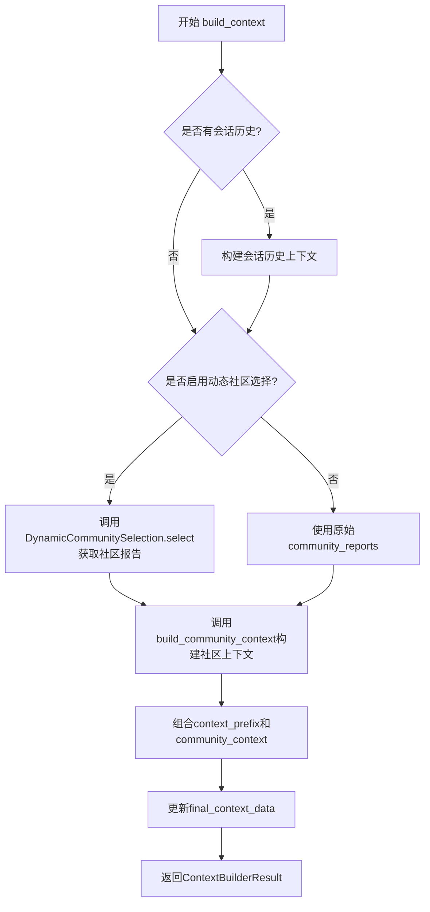
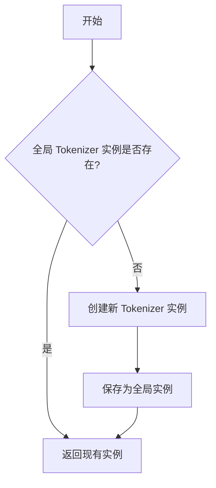
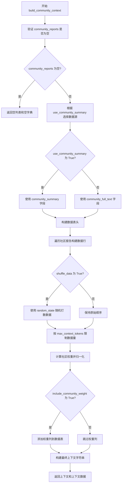
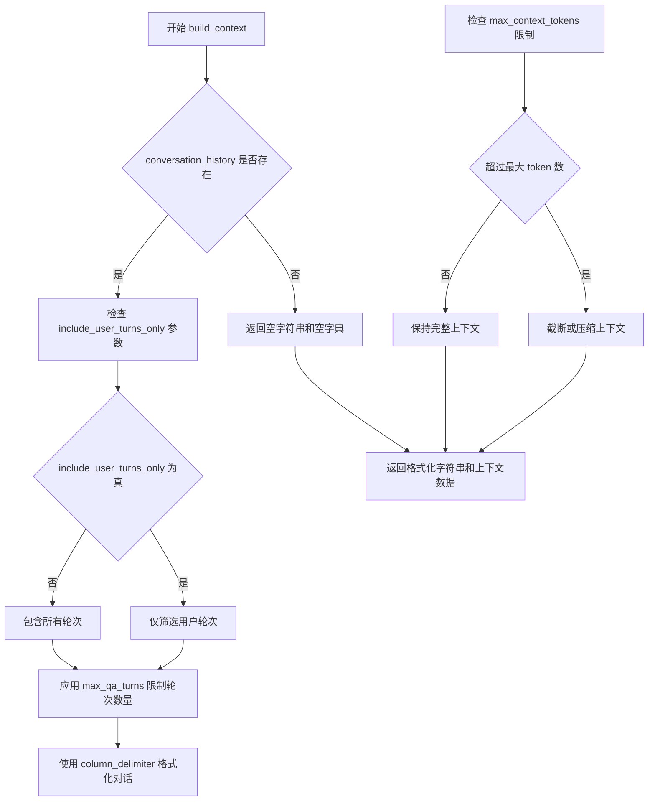
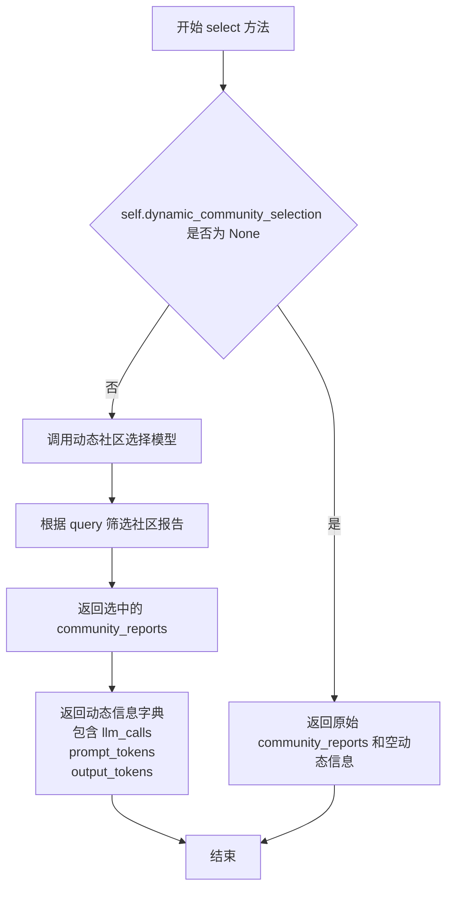
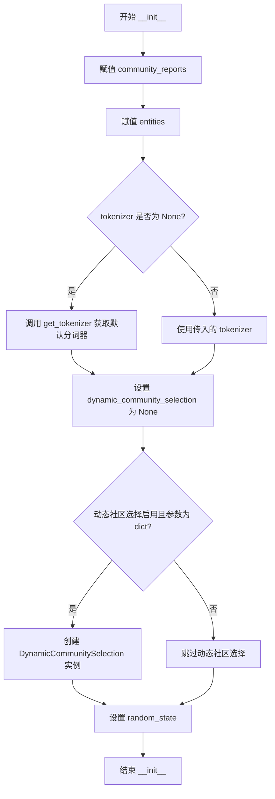

# `graphrag\packages\graphrag\graphrag\query\structured_search\global_search\community_context.py` 详细设计文档

GlobalCommunityContext类是GlobalSearch的社区上下文构建器，负责将社区报告、社区和实体数据整合为适合大模型处理的上下文数据，支持动态社区选择和会话历史功能。

## 整体流程



## 类结构

```
GlobalContextBuilder (抽象基类)
└── GlobalCommunityContext (实现类)
```

## 全局变量及字段


### `GlobalCommunityContext.community_reports`
    
存储社区报告列表，用于提供全局搜索的上下文数据

类型：`list[CommunityReport]`
    


### `GlobalCommunityContext.entities`
    
存储实体列表，可能为None，用于关联社区报告中的实体信息

类型：`list[Entity] | None`
    


### `GlobalCommunityContext.tokenizer`
    
分词器实例，用于对文本进行分词和计算token数量

类型：`Tokenizer`
    


### `GlobalCommunityContext.dynamic_community_selection`
    
动态社区选择器实例，可能为None，用于根据查询动态选择相关社区

类型：`DynamicCommunitySelection | None`
    


### `GlobalCommunityContext.random_state`
    
随机种子，用于控制数据打乱等操作的随机性

类型：`int`
    
    

## 全局函数及方法


### `get_tokenizer`

这是一个模块级别的函数，用于获取全局的 Tokenizer 实例。在 `GlobalCommunityContext` 类初始化时，如果未显式提供 tokenizer，则调用此函数获取默认的 tokenizer 实例。

参数：该函数没有参数。

返回值：`Tokenizer`，返回全局的 Tokenizer 实例。

#### 流程图



#### 带注释源码

在提供的代码片段中，仅展示了 `get_tokenizer` 函数的导入和使用，其完整定义位于 `graphrag/tokenizer/get_tokenizer.py` 模块中。以下为基于导入路径和使用方式推断的函数签名和典型实现：

```python
# 导入语句（在 graphrag/query/context_builder/community_context.py 中）
from graphrag.tokenizer.get_tokenizer import get_tokenizer

# 函数定义（在 graphrag/tokenizer/get_tokenizer.py 中）

# 全局变量用于缓存 Tokenizer 实例
_tokenizer: Tokenizer | None = None

def get_tokenizer() -> Tokenizer:
    """
    获取全局的 Tokenizer 实例。
    
    如果全局实例尚未初始化，则创建一个默认的 Tokenizer 实例；
    否则返回已存在的实例（单例模式）。
    
    Returns:
        Tokenizer: 全局的 Tokenizer 实例，用于文本分词处理
    """
    global _tokenizer
    
    # 检查是否已存在全局实例
    if _tokenizer is None:
        # 初始化默认的 Tokenizer 实例
        # 实际实现中可能涉及配置读取或模型加载
        _tokenizer = Tokenizer()
    
    return _tokenizer
```

> **注意**：由于提供的代码片段中未包含 `get_tokenizer` 函数的完整定义，上述源码为基于导入路径 `graphrag.tokenizer.get_tokenizer` 和使用方式 `tokenizer or get_tokenizer()` 进行的合理推断。实际的函数实现可能包含更多的初始化逻辑，如配置加载、模型加载等。


### `build_community_context`

该函数用于构建全局搜索的社区上下文数据，将社区报告（Community Reports）转换为适合 LLM 处理的表格格式上下文，支持动态选择社区、权重归一化、随机打散等功能。

参数：

- `community_reports`：`list[CommunityReport]`，社区报告列表
- `entities`：`list[Entity] | None`，实体列表（可选）
- `tokenizer`：`Tokenizer`，分词器实例，用于计算 token 数量
- `use_community_summary`：`bool`，是否使用社区摘要，默认为 True
- `column_delimiter`：`str`，列分隔符，默认为 "|"
- `shuffle_data`：`bool`，是否打散数据顺序，默认为 True
- `include_community_rank`：`bool`，是否包含社区排名，默认为 False
- `min_community_rank`：`int`，最小社区排名阈值，默认为 0
- `community_rank_name`：`str`，社区排名列名，默认为 "rank"
- `include_community_weight`：`bool`，是否包含社区权重，默认为 True
- `community_weight_name`：`str`，社区权重列名，默认为 "occurrence"
- `normalize_community_weight`：`bool`，是否归一化社区权重，默认为 True
- `max_context_tokens`：`int`，最大上下文 token 数，默认为 8000
- `single_batch`：`bool`，是否返回单个批次，默认为 False
- `context_name`：`str`，上下文名称，默认为 "Reports"
- `random_state`：`int`，随机种子，默认为 86

返回值：`tuple[list[str] | str, dict[str, Any]]`，返回社区上下文（字符串列表或单个字符串）和上下文数据字典

#### 流程图



#### 带注释源码

```python
# 该函数定义在 graphrag/query/context_builder/community_context 模块中
# 此处展示的是在 GlobalCommunityContext.build_context 方法中的调用方式

# 调用 build_community_context 函数构建社区上下文
community_context, community_context_data = build_community_context(
    community_reports=community_reports,      # 社区报告列表
    entities=self.entities,                   # 实体列表（可能为 None）
    tokenizer=self.tokenizer,                 # 分词器实例
    use_community_summary=use_community_summary,  # 是否使用社区摘要
    column_delimiter=column_delimiter,       # 列分隔符
    shuffle_data=shuffle_data,               # 是否打散数据
    include_community_rank=include_community_rank,  # 是否包含排名
    min_community_rank=min_community_rank,    # 最小排名阈值
    community_rank_name=community_rank_name, # 排名列名
    include_community_weight=include_community_weight,  # 是否包含权重
    community_weight_name=community_weight_name,  # 权重列名
    normalize_community_weight=normalize_community_weight,  # 是否归一化权重
    max_context_tokens=max_context_tokens,   # 最大 token 数
    single_batch=False,                       # 不返回单个批次
    context_name=context_name,                # 上下文名称
    random_state=self.random_state,           # 随机种子
)
```


# ConversationHistory.build_context 详细设计文档

由于提供的代码中只包含 `ConversationHistory` 类的导入和使用，并未包含该类的完整定义，我将从代码中调用的方式推断其结构。

### ConversationHistory.build_context

该方法用于构建对话历史上下文，将对话历史转换为适合作为提示词上下文的格式，支持过滤用户轮次和限制轮次数量。

参数：

- `include_user_turns_only`：`bool`，控制是否仅包含用户轮次，传递自 `conversation_history_user_turns_only`
- `max_qa_turns`：`int | None`，最大问答轮次数量，传递自 `conversation_history_max_turns`
- `column_delimiter`：`str`，列分隔符，用于格式化对话历史
- `max_context_tokens`：`int`，最大上下文 token 数，用于控制上下文长度
- `recency_bias`：`bool`，是否启用近因偏好，代码中固定传递 `False`

返回值：`tuple[str, dict]`，返回格式化的对话历史字符串和对应的上下文数据字典

#### 流程图



#### 带注释源码

```python
# 从代码中提取的调用方式
(
    conversation_history_context,      # str: 格式化的对话历史字符串
    conversation_history_context_data, # dict: 对话历史的上下文数据
) = conversation_history.build_context(
    include_user_turns_only=conversation_history_user_turns_only,  # bool: 是否仅包含用户轮次
    max_qa_turns=conversation_history_max_turns,                   # int | None: 最大问答轮次
    column_delimiter=column_delimiter,                             # str: 列分隔符
    max_context_tokens=max_context_tokens,                         # int: 最大 token 数
    recency_bias=False,                                            # bool: 近因偏好（固定为 False）
)

# 调用位置在 GlobalCommunityContext.build_context 方法中
if conversation_history:
    # 当 conversation_history 存在时才构建对话历史上下文
    ...
```

---

**注意**：由于提供的代码文件中并未包含 `ConversationHistory` 类的完整定义（只有导入语句），以上信息是根据代码中实际调用方式推断得出。如需完整的类定义（包括所有字段和方法实现），需要查看 `graphrag/query/context_builder/conversation_history.py` 源文件。


# DynamicCommunitySelection.select 分析

由于给定的代码中没有 `DynamicCommunitySelection` 类的完整定义（只有导入和调用），我将从调用上下文和代码结构中提取相关信息。

### DynamicCommunitySelection.select

这是 `DynamicCommunitySelection` 类的一个异步方法，用于根据查询动态选择社区报告。

参数：

-  `query`：`str`，用户查询字符串，用于确定需要选择哪些社区报告

返回值：`tuple[list[CommunityReport], dict[str, int]]`，返回一个元组，包含：
  - 选中的社区报告列表（`list[CommunityReport]`）
  - 动态选择过程的元信息（`dict[str, int]`），包含 `llm_calls`（LLM 调用次数）、`prompt_tokens`（提示词 token 数）、`output_tokens`（输出 token 数）

#### 流程图



#### 带注释源码

```python
# 从 GlobalCommunityContext.build_context 方法中调用 DynamicCommunitySelection.select 的代码片段

# 检查是否启用了动态社区选择功能
if self.dynamic_community_selection is not None:
    # 异步调用 select 方法，传入查询字符串
    # 返回值：community_reports（筛选后的社区报告列表）
    #        dynamic_info（包含 llm_calls, prompt_tokens, output_tokens 的字典）
    (
        community_reports,
        dynamic_info,
    ) = await self.dynamic_community_selection.select(query)
    
    # 累加 LLM 调用统计信息
    llm_calls += dynamic_info["llm_calls"]
    prompt_tokens += dynamic_info["prompt_tokens"]
    output_tokens += dynamic_info["output_tokens"]
```

---

### 补充信息

从 `GlobalCommunityContext` 类的构造函数可以推断 `DynamicCommunitySelection` 类的初始化参数：

- `community_reports`：`list[CommunityReport]`，社区报告列表
- `communities`：`list[Community]`，社区列表
- `model`：模型实例，用于决定哪些社区与查询相关
- `tokenizer`：`Tokenizer`，分词器
- `**dynamic_community_selection_kwargs`：其他可选参数

### 技术债务与优化空间

1. **类型推断不完整**：由于源代码不完整，无法获取 `DynamicCommunitySelection` 类的完整定义
2. **耦合度较高**：`GlobalCommunityContext` 与 `DynamicCommunitySelection` 紧密耦合，如果选择逻辑变化可能需要修改调用方
3. **错误处理缺失**：从代码中看不到 `select` 方法的异常处理机制


### `GlobalCommunityContext.__init__`

这是 `GlobalCommunityContext` 类的构造函数，用于初始化全局搜索的社区上下文构建器。它接收社区报告、社区、实体等数据，并可选地配置动态社区选择功能。

参数：

- `community_reports`：`list[CommunityReport]`，社区报告列表，用于构建上下文数据
- `communities`：`list[Community]`，社区列表，用于动态社区选择
- `entities`：`list[Entity] | None`，实体列表，可选，用于丰富上下文
- `tokenizer`：`Tokenizer | None`，分词器，可选，默认为 `get_tokenizer()`
- `dynamic_community_selection`：`bool`，是否启用动态社区选择，默认为 `False`
- `dynamic_community_selection_kwargs`：`dict[str, Any] | None`，动态社区选择的配置参数，可选
- `random_state`：`int`，随机种子，用于数据洗牌，默认为 `86`

返回值：`None`，构造函数不返回任何值

#### 流程图



#### 带注释源码

```python
def __init__(
    self,
    community_reports: list[CommunityReport],
    communities: list[Community],
    entities: list[Entity] | None = None,
    tokenizer: Tokenizer | None = None,
    dynamic_community_selection: bool = False,
    dynamic_community_selection_kwargs: dict[str, Any] | None = None,
    random_state: int = 86,
):
    """初始化全局社区上下文构建器。
    
    参数:
        community_reports: 社区报告列表，用于构建上下文
        communities: 社区列表，用于动态社区选择
        entities: 实体列表，可选，用于丰富上下文内容
        tokenizer: 分词器，默认为全局分词器
        dynamic_community_selection: 是否启用动态社区选择
        dynamic_community_selection_kwargs: 动态社区选择的配置参数
        random_state: 随机种子，用于数据洗牌
    """
    # 直接赋值社区报告和实体
    self.community_reports = community_reports
    self.entities = entities
    
    # 如果未提供分词器，则获取全局默认分词器
    self.tokenizer = tokenizer or get_tokenizer()
    
    # 初始化动态社区选择为 None（默认值）
    self.dynamic_community_selection = None
    
    # 检查是否启用动态社区选择且配置参数有效
    if dynamic_community_selection and isinstance(
        dynamic_community_selection_kwargs, dict
    ):
        # 从配置中提取 model 和 tokenizer，其余参数透传
        self.dynamic_community_selection = DynamicCommunitySelection(
            community_reports=community_reports,
            communities=communities,
            model=dynamic_community_selection_kwargs.pop("model"),
            tokenizer=dynamic_community_selection_kwargs.pop("tokenizer"),
            **dynamic_community_selection_kwargs,  # 展开剩余配置参数
        )
    
    # 设置随机状态，用于后续数据洗牌
    self.random_state = random_state
```


### `GlobalCommunityContext.build_context`

该方法是一个异步方法，用于为全局搜索（Global Search）准备社区报告数据表作为上下文数据。它整合了对话历史、社区报告、实体信息，并通过动态社区选择（如果启用）来构建最终的上下文结果。

参数：

- `query`：`str`，用户查询字符串，用于动态社区选择和上下文构建
- `conversation_history`：`ConversationHistory | None`，可选的对话历史对象，用于包含之前的对话内容
- `use_community_summary`：`bool = True`，是否使用社区摘要
- `column_delimiter`：`str = "|"`，列分隔符，用于格式化上下文数据
- `shuffle_data`：`bool = True`，是否打乱数据顺序
- `include_community_rank`：`bool = False`，是否包含社区排名
- `min_community_rank`：`int = 0`，最小社区排名阈值
- `community_rank_name`：`str = "rank"`，社区排名列的名称
- `include_community_weight`：`bool = True`，是否包含社区权重
- `community_weight_name`：`str = "occurrence"`，社区权重列的名称
- `normalize_community_weight`：`bool = True`，是否归一化社区权重
- `max_context_tokens`：`int = 8000`，最大上下文令牌数
- `context_name`：`str = "Reports"`，上下文名称
- `conversation_history_user_turns_only`：`bool = True`，是否只包含用户轮次
- `conversation_history_max_turns`：`int | None = 5`，对话历史最大轮次数
- `**kwargs`：`Any`，额外的关键字参数

返回值：`ContextBuilderResult`，包含上下文块、上下文记录、LLM调用次数、提示令牌数和输出令牌数

#### 流程图

```mermaid
flowchart TD
    A[开始 build_context] --> B{conversation_history 存在?}
    B -->|是| C[构建对话历史上下文]
    B -->|否| D[设置空对话历史上下文]
    C --> E[获取对话历史上下文数据和字符串]
    D --> F[设置 community_reports 为 self.community_reports]
    E --> G{动态社区选择启用?}
    F --> G
    G -->|是| H[调用动态社区选择.select]
    G -->|否| I[使用原始 community_reports]
    H --> J[获取选中的社区报告和动态信息]
    J --> K[累加 LLM 调用和令牌统计]
    I --> L[调用 build_community_context]
    K --> L
    L --> M[获取社区上下文和上下文数据]
    M --> N{community_context 是列表?]
    N -->|是| O[为每个上下文添加前缀]
    N -->|否| P[直接添加前缀到上下文]
    O --> Q[更新最终上下文数据]
    P --> Q
    Q --> R[返回 ContextBuilderResult]
```

#### 带注释源码

```python
async def build_context(
    self,
    query: str,
    conversation_history: ConversationHistory | None = None,
    use_community_summary: bool = True,
    column_delimiter: str = "|",
    shuffle_data: bool = True,
    include_community_rank: bool = False,
    min_community_rank: int = 0,
    community_rank_name: str = "rank",
    include_community_weight: bool = True,
    community_weight_name: str = "occurrence",
    normalize_community_weight: bool = True,
    max_context_tokens: int = 8000,
    context_name: str = "Reports",
    conversation_history_user_turns_only: bool = True,
    conversation_history_max_turns: int | None = 5,
    **kwargs: Any,
) -> ContextBuilderResult:
    """Prepare batches of community report data table as context data for global search."""
    # 初始化对话历史上下文为空字符串
    conversation_history_context = ""
    # 初始化最终上下文数据为空字典
    final_context_data = {}
    # 初始化 LLM 调用和令牌统计
    llm_calls, prompt_tokens, output_tokens = 0, 0, 0
    
    # 检查是否存在对话历史
    if conversation_history:
        # 构建对话历史上下文
        (
            conversation_history_context,
            conversation_history_context_data,
        ) = conversation_history.build_context(
            include_user_turns_only=conversation_history_user_turns_only,
            max_qa_turns=conversation_history_max_turns,
            column_delimiter=column_delimiter,
            max_context_tokens=max_context_tokens,
            recency_bias=False,
        )
        # 如果对话历史上下文不为空，则将其赋值给最终上下文数据
        if conversation_history_context != "":
            final_context_data = conversation_history_context_data

    # 获取社区报告列表
    community_reports = self.community_reports
    
    # 检查是否启用动态社区选择
    if self.dynamic_community_selection is not None:
        # 调用动态社区选择获取精选的社区报告
        (
            community_reports,
            dynamic_info,
        ) = await self.dynamic_community_selection.select(query)
        # 累加 LLM 调用和令牌统计
        llm_calls += dynamic_info["llm_calls"]
        prompt_tokens += dynamic_info["prompt_tokens"]
        output_tokens += dynamic_info["output_tokens"]

    # 构建社区上下文
    community_context, community_context_data = build_community_context(
        community_reports=community_reports,
        entities=self.entities,
        tokenizer=self.tokenizer,
        use_community_summary=use_community_summary,
        column_delimiter=column_delimiter,
        shuffle_data=shuffle_data,
        include_community_rank=include_community_rank,
        min_community_rank=min_community_rank,
        community_rank_name=community_rank_name,
        include_community_weight=include_community_weight,
        community_weight_name=community_weight_name,
        normalize_community_weight=normalize_community_weight,
        max_context_tokens=max_context_tokens,
        single_batch=False,
        context_name=context_name,
        random_state=self.random_state,
    )

    # 根据是否存在对话历史上下文来准备上下文前缀
    context_prefix = (
        f"{conversation_history_context}\n\n"
        if conversation_history_context
        else ""
    )

    # 处理最终上下文，根据 community_context 类型决定处理方式
    final_context = (
        [f"{context_prefix}{context}" for context in community_context]
        if isinstance(community_context, list)
        else f"{context_prefix}{community_context}"
    )

    # 使用提供的 community_context_data 更新最终上下文数据
    final_context_data.update(community_context_data)

    # 返回包含上下文块、上下文记录和统计信息的 ContextBuilderResult
    return ContextBuilderResult(
        context_chunks=final_context,
        context_records=final_context_data,
        llm_calls=llm_calls,
        prompt_tokens=prompt_tokens,
        output_tokens=output_tokens,
    )
```

## 关键组件


### GlobalCommunityContext

全局搜索的社区上下文构建器，负责整合社区报告、实体和对话历史，生成用于全局搜索的上下文数据。

### DynamicCommunitySelection

动态社区选择机制，支持惰性加载和按需调用 LLM 进行社区选择，实现张量索引式的社区数据按需加载。

### build_community_context

核心社区上下文构建函数，负责将社区报告数据转换为表格形式的上下文，支持打乱数据、排名加权、归一化等策略。

### ConversationHistory

对话历史管理组件，用于构建对话历史的上下文，支持用户轮次过滤和最大轮次限制。

### Tokenizer 集成

令牌化器集成模块，通过 get_tokenizer 获取默认令牌化器，支持自定义令牌化器并提供回退机制。

### ContextBuilderResult

上下文构建结果的数据模型，包含上下文块、上下文记录、LLM 调用次数和令牌统计信息。

## 问题及建议


### 已知问题

- **未使用的初始化参数**：`__init__` 方法接收了 `communities` 参数，但在不使用 `dynamic_community_selection` 时，该参数被完全忽略未被使用，造成参数浪费。
- **可能的 None 值处理问题**：`conversation_history_context_data` 在没有会话历史时可能为 `None`（取决于 `conversation_history.build_context` 的返回值），后续直接调用 `final_context_data.update()` 可能导致 `AttributeError`。
- **未使用的 kwargs 参数**：`build_context` 方法接收 `**kwargs` 但从未使用，违反了"fail fast"原则，应该显式检查并抛出未知参数错误。
- **重复的变量引用**：`self.community_reports` 在 `build_context` 中被重新赋值为局部变量 `community_reports`，这种模式容易造成混淆和维护问题。
- **类型注解不一致**：`entities` 参数在 `__init__` 中类型为 `list[Entity] | None`，但初始化时直接赋值给 `self.entities`，没有进行类型验证或默认值处理。

### 优化建议

- **移除未使用的参数**：如果 `communities` 仅用于 `DynamicCommunitySelection`，应延迟传递或在不使用时抛出异常而非静默忽略。
- **显式处理 kwargs**：在 `build_context` 方法开头添加 `if kwargs: raise TypeError(f"Unexpected arguments: {list(kwargs.keys())}")` 以避免隐藏的接口变化。
- **统一变量引用**：考虑使用局部变量替代对 `self.community_reports` 的重复引用，或使用 copy-on-write 模式。
- **添加 None 检查**：在处理 `conversation_history_context_data` 前添加显式检查，确保返回值符合预期。
- **提取配置对象**：将 `build_context` 的大量参数（column_delimiter、shuffle_data、community_rank_name 等）封装为配置类，提高可读性和可维护性。
- **添加类型守卫**：使用 `typeguard` 或 `pydantic` 对输入参数进行运行时验证，特别是对于 `dynamic_community_selection_kwargs` 的结构验证。

## 其它


### 设计目标与约束

本类旨在为全局搜索（Global Search）场景构建社区上下文数据，通过整合社区报告（CommunityReport）、社区（Community）和实体（Entity）数据，生成可供大语言模型（LLM）使用的上下文内容。设计约束包括：1）必须使用tokenizer进行token计数以控制上下文长度；2）动态社区选择为可选功能，需要模型和tokenizer支持；3）默认随机状态为86以保证结果可复现。

### 错误处理与异常设计

代码采用防御性编程风格，对于dynamic_community_selection_kwargs参数进行类型检查（isinstance检查），若不是字典类型则忽略动态社区选择功能。异步方法build_context中，如果conversation_history为空或构建的上下文为空字符串，会相应调整context_prefix的生成逻辑。异常处理主要依赖调用方（上层搜索逻辑）捕获，上游组件如build_community_context和ConversationHistory.build_context应自行处理其内部的异常情况。

### 数据流与状态机

数据流如下：1）接收query字符串和可选的conversation_history作为输入；2）若存在conversation_history，调用其build_context方法构建对话历史上下文；3）若启用了dynamic_community_selection，调用动态社区选择模块筛选社区报告；4）调用build_community_context函数构建社区上下文数据表；5）合并对话历史上下文和社区上下文，生成最终的ContextBuilderResult。状态机方面，本类无复杂状态转换，主要状态为：初始化状态（持有community_reports、entities、tokenizer等）→ 构建上下文状态（异步执行build_context）→ 结果返回状态。

### 外部依赖与接口契约

核心依赖包括：1）Tokenizer接口 - 用于token计数，默认为get_tokenizer()获取；2）数据模型：Community、CommunityReport、Entity；3）上下文构建组件：build_community_context、ConversationHistory、DynamicCommunitySelection；4）结果类型：ContextBuilderResult（来自graphrag.query.context_builder.builders）。接口契约方面，GlobalContextBuilder为抽象基类，定义了build_context方法签名；本类实现该接口，返回ContextBuilderResult包含context_chunks（上下文块列表）、context_records（上下文记录）、llm_calls（LLM调用次数）、prompt_tokens和output_tokens统计信息。

### 性能考虑与优化空间

性能关键点：1）max_context_tokens参数（默认8000）控制单次上下文最大token数，用于防止超出LLM的上下文窗口；2）dynamic_community_selection模块涉及LLM调用，会产生额外延迟和token消耗；3）shuffle_data参数决定是否打乱社区报告顺序，影响上下文多样性。优化空间：可考虑添加缓存机制避免重复构建相同query的上下文；可支持流式输出以提升用户体验；可增加并行处理多个社区报告的能力。

### 使用示例与调用模式

典型使用场景：首先创建GlobalCommunityContext实例，传入community_reports、communities、entities等数据；然后调用build_context方法，传入用户查询query；最后从返回的ContextBuilderResult中获取context_chunks用于构建prompt。示例代码：```python\ncontext_builder = GlobalCommunityContext(\n    community_reports=reports,\n    communities=communities,\n    entities=entities,\n    dynamic_community_selection=True,\n    dynamic_community_selection_kwargs={\"model\": model, \"tokenizer\": tokenizer}\n)\nresult = await context_builder.build_context(query=\"用户问题\")\nfinal_prompt = \"\\n\\n\".join(result.context_chunks)\n```。

### 并发与异步设计

本类采用Python异步编程模型，build_context方法声明为async，支持在异步事件循环中并发调用。注意事项：1）多个并发调用之间共享类实例的community_reports等数据，需要确保这些数据为不可变或线程安全；2）dynamic_community_selection模块的LLM调用为IO密集型操作，异步设计可有效提升并发性能；3）random_state用于控制数据打乱顺序，确保单实例内的多次调用结果可复现。

### 版本兼容性与迁移指南

本类属于graphrag项目的query模块，依赖于数据模型（Community、CommunityReport、Entity）和上下文构建器（ContextBuilderResult）。使用时应确保graphrag版本>=0.1.0以兼容API。若未来版本移除dynamic_community_selection功能，代码中的isinstance检查会优雅降级为不使用动态选择。若Tokenizerglobals改变，需相应调整tokenizer的获取方式。

### 安全性与边界检查

安全考量：1）用户输入的query直接用于动态社区选择和上下文构建，需确保上游调用方已完成输入 sanitization；2）column_delimiter参数用于分隔数据列，若被恶意控制可能影响输出格式，建议限制允许的字符集；3）max_context_tokens设置上限（默认8000）防止资源耗尽。边界情况处理：conversation_history为空时生成不含历史前缀的上下文；entities为None时build_community_context应能正常处理；min_community_rank=0表示不过滤任何社区。

    