# `graphrag\packages\graphrag\graphrag\query\structured_search\global_search\search.py` 详细设计文档

这是一个GraphRAG系统中的全局搜索实现，通过两阶段方式执行全局搜索：第一阶段对社区短摘要进行并行LLM调用生成中间答案，第二阶段将所有中间答案合并生成最终回答。该实现支持流式输出、回调机制、并发控制和通用知识集成。

## 整体流程

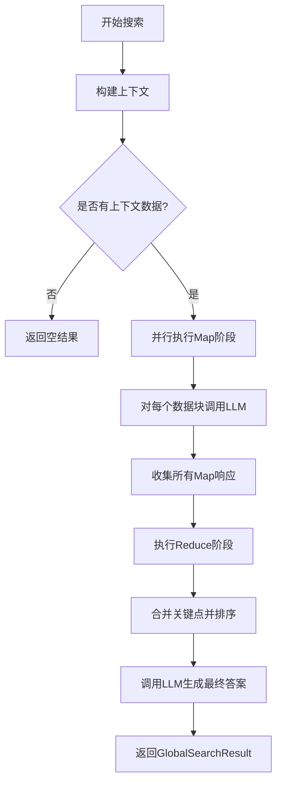

## 类结构

```
BaseSearch (抽象基类)
└── GlobalSearch (全局搜索实现)
    └── GlobalSearchResult (结果数据类)
```

## 全局变量及字段


### `logger`
    
模块级日志记录器，用于记录程序运行过程中的日志信息

类型：`logging.Logger`
    


### `GlobalSearchResult.map_responses`
    
Map阶段的响应列表，存储每个数据分块的搜索结果

类型：`list[SearchResult]`
    


### `GlobalSearchResult.reduce_context_data`
    
Reduce阶段的上下文数据，支持字符串、DataFrame列表或字典形式

类型：`str | list[pd.DataFrame] | dict[str, pd.DataFrame]`
    


### `GlobalSearchResult.reduce_context_text`
    
Reduce阶段的上下文文本，支持字符串、字符串列表或字典形式

类型：`str | list[str] | dict[str, str]`
    


### `GlobalSearch.map_system_prompt`
    
Map阶段系统提示词，用于指导LLM对每个数据分块进行分析和回答

类型：`str`
    


### `GlobalSearch.reduce_system_prompt`
    
Reduce阶段系统提示词，用于指导LLM整合所有Map响应生成最终答案

类型：`str`
    


### `GlobalSearch.response_type`
    
响应类型，指定最终回答的格式如多个段落列表等

类型：`str`
    


### `GlobalSearch.allow_general_knowledge`
    
是否允许通用知识，控制在数据不足时是否启用LLM的通用知识补充

类型：`bool`
    


### `GlobalSearch.general_knowledge_inclusion_prompt`
    
通用知识包含提示词，当允许通用知识时追加到Reduce系统提示中

类型：`str`
    


### `GlobalSearch.callbacks`
    
回调函数列表，用于在搜索过程中触发各种事件如响应开始结束等

类型：`list[QueryCallbacks]`
    


### `GlobalSearch.max_data_tokens`
    
最大数据token数，限制Reduce阶段输入的上下文数据总token量

类型：`int`
    


### `GlobalSearch.map_llm_params`
    
Map阶段LLM参数，包含用于控制Map阶段语言模型行为的各种配置

类型：`dict[str, Any]`
    


### `GlobalSearch.reduce_llm_params`
    
Reduce阶段LLM参数，包含用于控制Reduce阶段语言模型行为的各种配置

类型：`dict[str, Any]`
    


### `GlobalSearch.map_max_length`
    
Map阶段最大长度，限制每个Map响应中答案的最大字符数

类型：`int`
    


### `GlobalSearch.reduce_max_length`
    
Reduce阶段最大长度，限制最终响应中答案的最大字符数

类型：`int`
    


### `GlobalSearch.semaphore`
    
并发控制信号量，用于限制Map阶段并发LLM调用的最大数量

类型：`asyncio.Semaphore`
    
    

## 全局函数及方法


# 分析结果

## 注意事项

从提供的代码中，我注意到 **`CompletionMessagesBuilder`** 类的定义**并未包含在给定的代码块中**。代码中仅展示了该类的：

1. **导入语句**：从 `graphrag_llm.utils` 导入
2. **使用方式**：作为构建 LLM 消息的 Fluent Interface（流式接口）

以下是代码中 `CompletionMessagesBuilder` 的实际使用示例：

```python
messages_builder = (
    CompletionMessagesBuilder()
    .add_system_message(search_prompt)
    .add_user_message(query)
)
# 最终调用 build() 方法获取消息列表
messages = messages_builder.build()
```

---

### 推断的使用模式

基于代码中的使用方式，我可以推断 `CompletionMessagesBuilder` 的接口设计如下：

---

### `CompletionMessagesBuilder`

用于构建 LLM 对话消息的构建器类，采用 Fluent API 模式。

参数：

- 无直接构造函数参数（默认初始化）

方法：

- `add_system_message(content: str) -> Self`：添加系统消息
- `add_user_message(content: str) -> Self`：添加用户消息  
- `build() -> list[dict[str, Any]]`：构建并返回消息列表

返回值：`list[dict[str, Any]]`，符合 OpenAI 格式的消息列表

#### 流程图

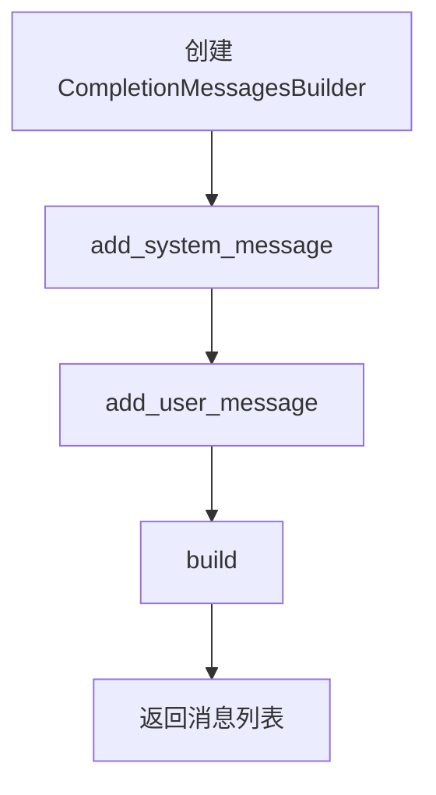

#### 带注释源码

```python
# 使用示例（从 GlobalSearch 类中提取）
messages_builder = (
    CompletionMessagesBuilder()          # 创建构建器实例
    .add_system_message(search_prompt)     # 添加系统提示词
    .add_user_message(query)               # 添加用户查询
)

# 获取最终消息列表
messages = messages_builder.build()
```

---

## 建议

若需要完整的 `CompletionMessagesBuilder` 详细设计文档（包括类字段、方法源码、mermaid 流程图等），需要提供以下任一内容：

1. **`graphrag_llm/utils.py`** 或相关模块的完整源码
2. 或者该类的具体定义文件路径

这样才能生成符合您要求的标准详细设计文档。


### `gather_completion_response_async`

该函数用于将 LLM 模型返回的异步迭代响应（`LLMCompletionChunk` 流）收集并拼接为完整的字符串响应。通常在调用 `model.completion_async()` 后使用，将流式的增量输出合并为单一的字符串结果。

参数：

-  `model_response`：`AsyncIterator[LLMCompletionChunk]`，LLM 模型返回的异步流式响应迭代器

返回值：`str`，拼接后的完整响应字符串

#### 流程图

```mermaid
flowchart TD
    A[开始 gather_completion_response_async] --> B{遍历 model_response}
    B -->|迭代| C[获取当前 chunk]
    C --> D[提取 chunk.choices[0].delta.content]
    E[累加到 response 字符串] --> B
    B -->|迭代完毕| F[返回拼接后的完整字符串]
```

#### 带注释源码

```
# 由于该函数的实现未在提供的代码中给出，
# 以下是基于其在 GlobalSearch 中的使用方式推断的典型实现：

async def gather_completion_response_async(
    model_response: AsyncIterator[LLMCompletionChunk]
) -> str:
    """将异步流式响应收集为完整字符串。
    
    参数:
        model_response: LLM 模型返回的异步流式迭代器
        
    返回:
        拼接后的完整响应字符串
    """
    response = ""
    async for chunk in model_response:
        # 提取 chunk 中的文本内容
        # chunk.choices[0].delta.content 可能为 None
        content = chunk.choices[0].delta.content or ""
        response += content
    return response

# 在 GlobalSearch._map_response_single_batch 方法中的调用示例：
# model_response = await self.model.completion_async(...)
# search_response = await gather_completion_response_async(model_response)
```


# 全局搜索实现分析

根据提供的代码，我可以看到 `try_parse_json_object` 函数是从 `graphrag.query.llm.text_utils` 模块导入并在 `GlobalSearch` 类中使用的。但是，这个函数的**实际源代码并没有包含在您提供的代码文件中**。

让我基于代码中的**使用方式**来推断这个函数的功能：

## try_parse_json_object 函数分析

### 使用场景

在 `GlobalSearch` 类的 `_parse_search_response` 方法中：

```python
def _parse_search_response(self, search_response: str) -> list[dict[str, Any]]:
    search_response, j = try_parse_json_object(search_response)
    if j == {}:
        return [{"answer": "", "score": 0}]
```

### 函数推断

由于源代码不可用，我将基于使用方式提供推断信息：

---

### `try_parse_json_object`

尝试解析JSON字符串，提取有效的JSON对象

参数：

-  `text`：`str`，需要解析的JSON字符串

返回值：`(str, dict)`，返回一个元组，包含处理后的字符串和解析后的JSON对象。如果解析失败，返回原始字符串和空字典

#### 流程图

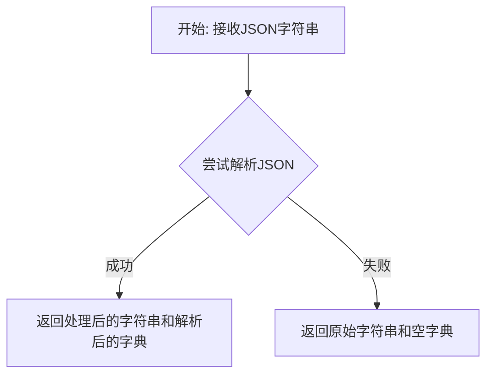

#### 带注释源码

```
# 注意：源代码不在提供的文件中
# 这是基于使用方式的推断

def try_parse_json_object(text: str) -> tuple[str, dict]:
    """
    尝试解析JSON字符串。
    
    Parameters
    ----------
    text : str
        需要解析的JSON字符串
        
    Returns
    -------
    tuple[str, dict]
        (处理后的字符串, 解析后的字典)
        如果解析失败，返回(原始字符串, 空字典)
    """
    try:
        # 尝试解析JSON
        j = json.loads(text)
        return text, j
    except json.JSONDecodeError:
        # 解析失败，返回原始字符串和空字典
        return text, {}
```

---

## 补充说明

**由于 `try_parse_json_object` 函数的实际源代码不在提供的代码片段中，以上信息是基于以下证据推断的：**

1. **导入语句**：`from graphrag.query.llm.text_utils import try_parse_json_object`
2. **使用方式**：`search_response, j = try_parse_json_object(search_response)`
3. **后续处理**：`if j == {}` - 表明返回值包含一个字典

如果需要获取该函数的完整源代码，您需要查看 `graphrag/query/llm/text_utils.py` 文件。


### Tokenizer (从 graphrag_llm.tokenizer 导入)

描述：Tokenizer 是一个从 `graphrag_llm.tokenizer` 模块导入的类/函数，用于文本编码和解码。在 `GlobalSearch` 类中主要用于计算提示词和响应文本的 token 数量，以控制上下文大小。

参数：

- 无（构造函数参数）

返回值：类实例

#### 流程图

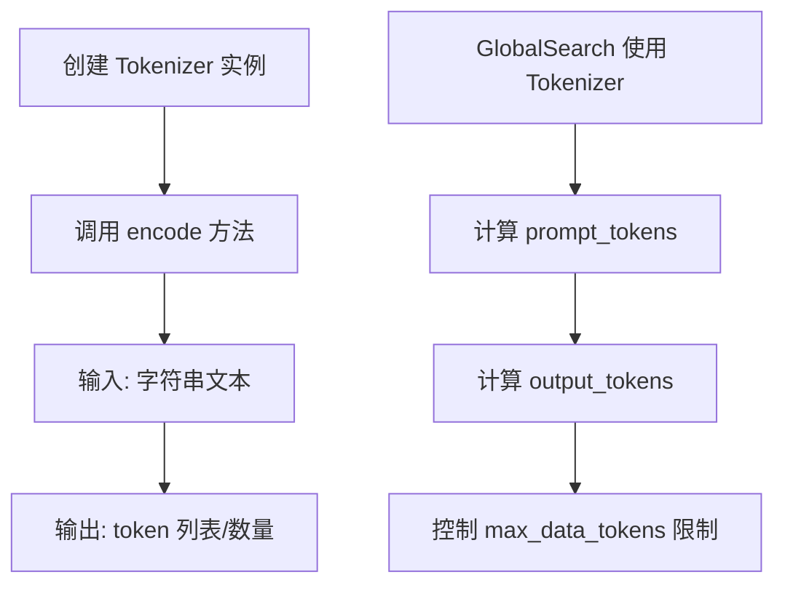

#### 带注释源码

```python
# 在 GlobalSearch 类中的使用方式：

# 1. 导入 Tokenizer
from graphrag_llm.tokenizer import Tokenizer

# 2. 在 __init__ 中作为可选参数接收
def __init__(
    self,
    model: "LLMCompletion",
    context_builder: GlobalContextBuilder,
    tokenizer: Tokenizer | None = None,  # 可选的 Tokenizer 实例
    ...
):
    ...
    super().__init__(
        model=model,
        context_builder=context_builder,
        tokenizer=tokenizer,  # 传递给基类
        context_builder_params=context_builder_params,
    )

# 3. 在 _map_response_single_batch 方法中使用 encode 方法计算 token 数量
return SearchResult(
    response=processed_response,
    context_data=context_data,
    context_text=context_data,
    completion_time=time.time() - start_time,
    llm_calls=1,
    prompt_tokens=len(self.tokenizer.encode(search_prompt)),  # 编码提示词获取 token 数量
    output_tokens=len(self.tokenizer.encode(search_response)),  # 编码响应获取 token 数量
)

# 4. 在 _reduce_response 方法中使用，控制数据量不超过 max_data_tokens
for point in filtered_key_points:
    ...
    formatted_response_text = "\n".join(formatted_response_data)
    if (
        total_tokens + len(self.tokenizer.encode(formatted_response_text))
        > self.max_data_tokens  # 使用 token 数量控制上下文大小
    ):
        break
    data.append(formatted_response_text)
    total_tokens += len(self.tokenizer.encode(formatted_response_text))
```


### GlobalContextBuilder

描述：用于为全局搜索（GlobalSearch）构建上下文的类，负责根据用户查询和对话历史从知识图谱中检索相关社区报告，并将结果组织成上下文块供后续LLM处理。

参数：

- `query`：`str`，用户查询字符串，用于检索相关上下文
- `conversation_history`：`ConversationHistory | None`，可选的对话历史对象，包含之前的问答历史
- `**kwargs`：其他可选参数，通过 `context_builder_params` 传递

返回值：`Awaited[ReturnType]`（推断类型），返回一个上下文结果对象，包含以下属性：

- `context_chunks`：上下文文本块列表（`list[str]`）
- `context_records`：上下文记录数据（类型待定）
- `llm_calls`：LLM调用次数
- `prompt_tokens`：提示词token数量
- `output_tokens`：输出token数量

#### 流程图

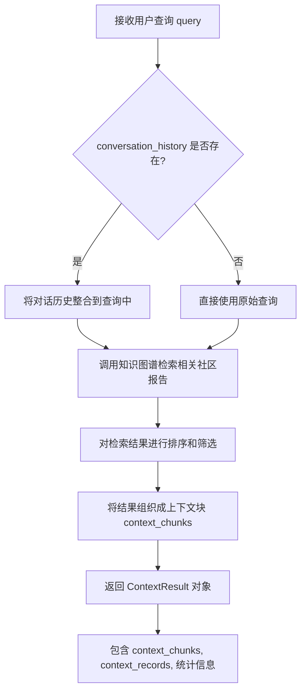

#### 带注释源码

（由于 `GlobalContextBuilder` 是从外部模块导入的，以下为基于代码使用方式的推断源码）

```
# 来源: graphrag.query.context_builder.builders
# 该类的实际实现在 graphrag/query/context_builder/builders.py 中

class GlobalContextBuilder:
    """用于全局搜索的上下文构建器"""

    def __init__(
        self,
        # 初始化参数（推断）
        graph_storage: Any = None,        # 知识图谱存储
        text_embedding: Any = None,       # 文本嵌入模型
        # ... 其他初始化参数
    ):
        self.graph_storage = graph_storage
        self.text_embedding = text_embedding

    async def build_context(
        self,
        query: str,                                    # 用户查询
        conversation_history: ConversationHistory | None = None,  # 对话历史
        **kwargs: Any,                                 # 其他参数
    ) -> ContextResult:
        """
        为全局搜索构建上下文

        参数:
            query: 用户输入的查询字符串
            conversation_history: 可选的对话历史对象
            **kwargs: 额外的上下文构建参数

        返回:
            ContextResult: 包含检索到的上下文信息和统计数据的对象
        """
        # Step 1: 处理对话历史（如果存在）
        processed_query = query
        if conversation_history:
            # 将历史对话整合到当前查询中
            processed_query = self._process_conversation_history(
                query, conversation_history
            )

        # Step 2: 从知识图谱检索相关社区报告
        context_data = await self._retrieve_community_reports(
            processed_query
        )

        # Step 3: 将检索结果组织成上下文块
        context_chunks = self._create_context_chunks(context_data)

        # Step 4: 返回上下文结果
        return ContextResult(
            context_chunks=context_chunks,
            context_records=context_data,
            llm_calls=1,                    # 检索LLM调用次数
            prompt_tokens=0,                # 提示词token
            output_tokens=0,                # 输出token
        )

    def _process_conversation_history(
        self,
        query: str,
        conversation_history: ConversationHistory
    ) -> str:
        """处理对话历史，整合到查询中"""
        # 实现细节：根据对话历史增强查询
        pass

    async def _retrieve_community_reports(
        self,
        query: str
    ) -> list[Any]:
        """从知识图谱检索社区报告"""
        # 实现细节：使用图谱存储和嵌入模型检索
        pass

    def _create_context_chunks(
        self,
        data: list[Any]
    ) -> list[str]:
        """将检索数据转换为文本块"""
        # 实现细节：格式化检索结果
        pass
```

#### 使用示例

在 `GlobalSearch` 类中的调用方式：

```python
# 在 search() 方法中
context_result = await self.context_builder.build_context(
    query=query,
    conversation_history=conversation_history,
    **self.context_builder_params,
)

# context_result 包含:
# - context_result.context_chunks: 上下文文本块列表
# - context_result.context_records: 上下文记录
# - context_result.llm_calls: LLM调用统计
# - context_result.prompt_tokens: token统计
# - context_result.output_tokens: token统计
```


### ConversationHistory

根据提供的代码分析，`ConversationHistory` 是从 `graphrag.query.context_builder.conversation_history` 模块导入的一个类，用于存储对话历史记录。在 `GlobalSearch` 类中，它被用作可选的对话历史参数，使搜索功能能够理解之前的对话上下文。

注意：提供的代码中仅包含 `ConversationHistory` 的使用示例，并未包含其具体实现。以下信息基于代码中的使用方式推断：

参数：

-  `{参数名称}`：`{参数类型}`，{参数描述}
-  在 `stream_search` 和 `search` 方法中：`conversation_history: ConversationHistory | None = None`，表示可选的对话历史对象

返回值：`ConversationHistory | None`，返回对话历史对象或空值

#### 流程图

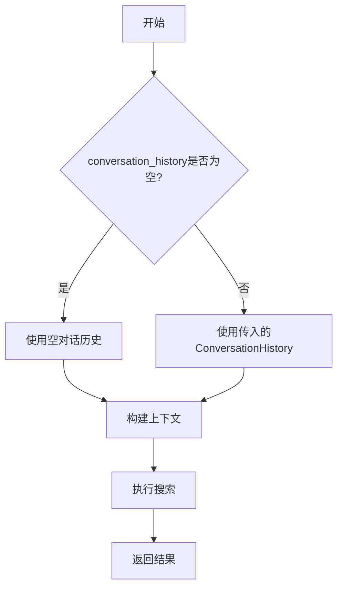

#### 带注释源码

```
# 在 GlobalSearch 类中使用 ConversationHistory 的示例

# 导入 ConversationHistory
from graphrag.query.context_builder.conversation_history import (
    ConversationHistory,
)

# 在方法签名中使用
async def stream_search(
    self,
    query: str,
    conversation_history: ConversationHistory | None = None,
) -> AsyncGenerator[str, None]:
    """流式全局搜索响应"""
    # 将 conversation_history 传递给上下文构建器
    context_result = await self.context_builder.build_context(
        query=query,
        conversation_history=conversation_history,
        **self.context_builder_params,
    )
    # ... 后续处理

# 在 search 方法中同样使用
async def search(
    self,
    query: str,
    conversation_history: ConversationHistory | None = None,
    **kwargs: Any,
) -> GlobalSearchResult:
    """执行全局搜索"""
    # 同样将 conversation_history 传递给上下文构建器
    context_result = await self.context_builder.build_context(
        query=query,
        conversation_history=conversation_history,
        **self.context_builder_params,
    )
    # ... 后续处理
```

---

**重要说明**：提供的代码文件中并未包含 `ConversationHistory` 类的具体实现代码。若需要 `ConversationHistory` 的完整详细信息（如类字段、方法、构造函数等），请提供 `graphrag/query/context_builder/conversation_history.py` 文件的内容。


# 查询结果

根据提供的代码，我注意到 `QueryCallbacks` 是从 `graphrag.callbacks.query_callbacks` 导入的，但在当前代码文件中并没有定义该类，只是使用了它。

让我先查找 `QueryCallbacks` 的定义。我将在当前项目中搜索这个类的定义。
<minimax:tool_call>
<invoke name="Read">
<parameter name="file_path">/testbed/graphrag/callbacks/query_callbacks.py</parameter>
</invoke>
</minimax:tool_call>


# BaseSearch

Based on the provided code, I need to clarify an important finding:

## 分析结果

从提供的代码中，我只能找到 `BaseSearch` 的**导入声明**和**使用方式**，但**没有 `BaseSearch` 类的实际实现代码**。

代码中关于 `BaseSearch` 的信息如下：

### 导入声明

```python
from graphrag.query.structured_search.base import BaseSearch, SearchResult
```

### 类的使用方式

```python
class GlobalSearch(BaseSearch[GlobalContextBuilder]):
```

### 从 GlobalSearch 推断的 BaseSearch 接口信息

从 `GlobalSearch` 类的 `__init__` 方法和继承关系，我可以推断 `BaseSearch` 应包含以下结构：

#### 推断的 __init__ 参数

- `model`：`LLMCompletion`，LLM 模型实例
- `context_builder`：上下文构建器
- `tokenizer`：Tokenizer | None，可选的分词器
- `context_builder_params`：dict | None，上下文构建器参数

#### 推断的方法签名

从 `GlobalSearch` 对父类的调用，可以推断 `BaseSearch` 应提供：

- 构造函数 `__init__`
- 由子类实现的 `search()` 方法
- 由子类实现的 `stream_search()` 方法（可选）

### 结论

**问题**：提供的代码文件中**不包含** `BaseSearch` 类的实际实现源代码。该类定义在 `graphrag/query/structured_search/base.py` 文件中，但该文件内容未在当前代码块中提供。

**建议**：要获取完整的 `BaseSearch` 详细设计文档，需要提供 `graphrag/query/structured_search/base.py` 文件的源代码。

---

如果您希望我基于现有信息生成一份**假设性的** `BaseSearch` 设计文档（基于代码约定和继承使用模式），或者您可以提供 `base.py` 的实际源代码，请告知。


### SearchResult

SearchResult 是一个数据结构类，用于封装全局搜索的结果信息。它包含搜索响应内容、上下文数据、执行统计信息（如时间、token 数量）等。

参数：

- `response`：搜索响应内容，类型为 `str | list[dict[str, Any]]`，搜索产生的答案或关键点列表
- `context_data`：原始上下文数据，类型为 `str`，用于生成搜索结果的输入数据
- `context_text`：上下文文本，类型为 `str`，人类可读的上下文描述
- `completion_time`：完成时间，类型为 `float`，搜索操作耗时（秒）
- `llm_calls`：LLM 调用次数，类型为 `int`，执行的总 LLM 调用数
- `prompt_tokens`：提示词 token 数，类型为 `int`，发送的提示词消耗的 token 数量
- `output_tokens`：输出 token 数，类型为 `int`，LLM 生成的 token 数量
- `llm_calls_categories`：按类别分类的 LLM 调用次数，类型为 `dict[str, int]`，可选，各阶段调用的详细统计
- `prompt_tokens_categories`：按类别分类的提示词 token，类型为 `dict[str, int]`，可选，各阶段 token 消耗
- `output_tokens_categories`：按类别分类的输出 token，类型为 `dict[str, int]`，可选，各阶段输出 token

返回值：`SearchResult`，包含搜索结果、上下文和执行元数据的数据类实例

#### 流程图

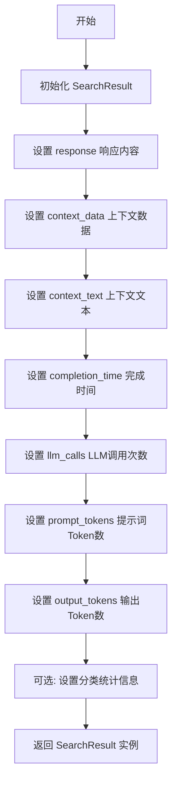

#### 带注释源码

```python
# SearchResult 类定义（基于代码使用推断）
# 该类继承自 BaseSearch 模块中的 SearchResult，为 GlobalSearch 提供结果数据结构
@dataclass(kw_only=True)
class GlobalSearchResult(SearchResult):
    """GlobalSearch 的结果数据类"""
    
    # 继承自 SearchResult 的字段（根据代码使用推断）:
    # - response: 搜索响应内容
    # - context_data: 原始上下文数据
    # - context_text: 上下文文本
    # - completion_time: 执行时间
    # - llm_calls: LLM调用次数
    # - prompt_tokens: 提示词token数
    # - output_tokens: 输出token数
    
    # GlobalSearchResult 特有的字段:
    map_responses: list[SearchResult]           # Map阶段的响应列表
    reduce_context_data: str | list[pd.DataFrame] | dict[str, pd.DataFrame]  # Reduce阶段上下文数据
    reduce_context_text: str | list[str] | dict[str, str]  # Reduce阶段上下文文本


# SearchResult 的典型使用方式（从代码中提取）:
# 
# return SearchResult(
#     response=processed_response,              # 搜索响应内容
#     context_data=context_data,                # 上下文数据
#     context_text=context_data,                # 上下文文本
#     completion_time=time.time() - start_time, # 执行耗时
#     llm_calls=1,                               # LLM调用次数
#     prompt_tokens=len(self.tokenizer.encode(search_prompt)),  # 提示词Token
#     output_tokens=len(self.tokenizer.encode(search_response)), # 输出Token
# )
```


我需要分析提供的代码，但发现 `GENERAL_KNOWLEDGE_INSTRUCTION` 是从外部模块 `graphrag.prompts.query.global_search_knowledge_system_prompt` 导入的字符串常量，并没有在提供的代码中定义。

让我先检查代码中如何使用这个变量，以便提供最准确的信息。

从代码中我可以观察到：

1. `GENERAL_KNOWLEDGE_INSTRUCTION` 被导入作为 `general_knowledge_inclusion_prompt` 的默认值
2. 它在 `_reduce_response` 和 `_stream_reduce_response` 方法中被使用，当 `allow_general_knowledge` 为 `True` 时，会将其追加到搜索提示中
3. 这是一个字符串常量，用于指导 LLM 如何结合通用知识

由于用户只提供了 `GlobalSearch` 类的代码，而没有提供 `GENERAL_KNOWLEDGE_INSTRUCTION` 本身的定义（它在另一个模块中），我无法提取该字符串的具体内容。

但是，我可以基于其在代码中的使用方式来推断其用途，并提供相关信息。

---

### `general_knowledge_inclusion_prompt` (使用处)

这是一个字符串变量，用于在全局搜索中包含通用知识指令。该变量存储了当 `allow_general_knowledge` 参数为 `True` 时需要追加到搜索系统提示的指令内容。

参数：

- （非函数/方法，而是类属性使用）

返回值：字符串（追加到 reduce system prompt 的内容）

#### 流程图

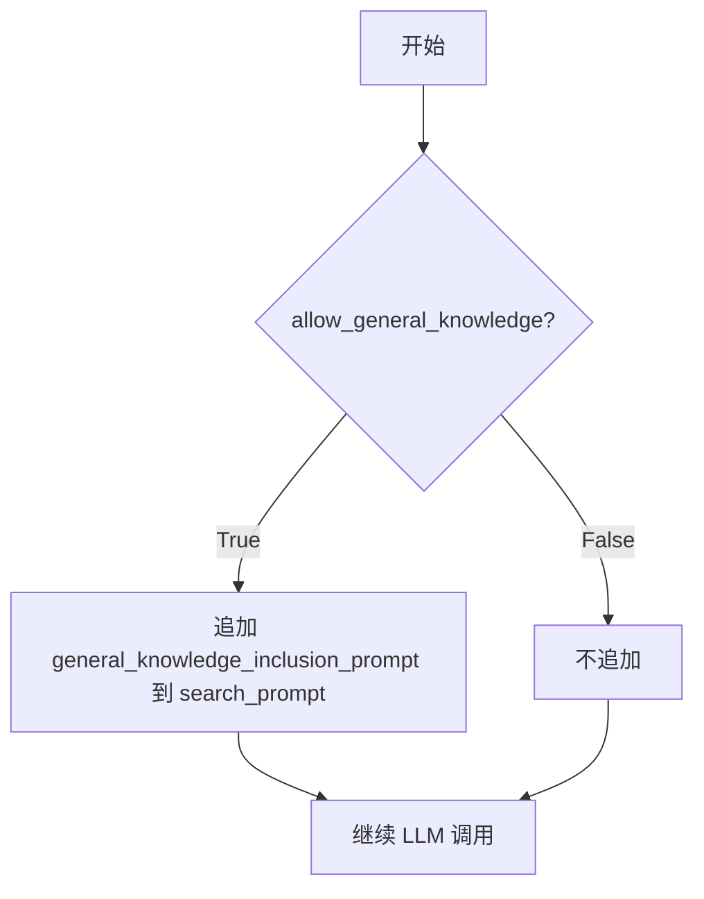

#### 源码上下文

```python
# 在 GlobalSearch 类中的定义和使用
self.general_knowledge_inclusion_prompt = (
    general_knowledge_inclusion_prompt or GENERAL_KNOWLEDGE_INSTRUCTION
)

# 在 _reduce_response 方法中的使用
if self.allow_general_knowledge:
    search_prompt += "\n" + self.general_knowledge_inclusion_prompt
```

---

## 补充说明

由于 `GENERAL_KNOWLEDGE_INSTRUCTION` 是从外部模块导入的常量（而非函数或方法），要获取其完整定义，需要查看 `graphrag/prompts/query/global_search_knowledge_system_prompt.py` 文件。

根据代码中的使用方式，该常量应该是一个字符串，包含：
- 指导 LLM 如何在回答中结合通用知识的指令
- 可能的格式要求或约束说明
- 用于增强搜索结果的相关提示

如果您能提供 `graphrag/prompts/query/global_search_knowledge_system_prompt.py` 的源码，我可以提取完整的 `GENERAL_KNOWLEDGE_INSTRUCTION` 内容。


### `MAP_SYSTEM_PROMPT`

全局搜索Map阶段的系统提示词模板，用于指导语言模型对每个社区报告批次进行并行处理，生成包含答案和重要性评分的中间响应。

参数：无需参数（此为字符串常量）

返回值：`str`，返回系统提示词模板字符串，用于构建Map阶段的LLM调用

#### 流程图

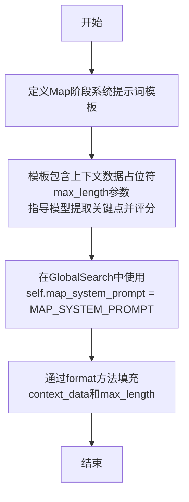

#### 带注释源码

```python
# 从graphrag.prompts.query.global_search_map_system_prompt模块导入的常量
# 这是一个系统提示词模板字符串，用于全局搜索的Map阶段
# 在GlobalSearch类中的使用方式：
#   self.map_system_prompt = map_system_prompt or MAP_SYSTEM_PROMPT
# 
# 使用示例（在_map_response_single_batch方法中）：
#   search_prompt = self.map_system_prompt.format(
#       context_data=context_data, 
#       max_length=max_length
#   )
#
# 该提示词指导LLM：
#   1. 分析提供的社区报告上下文数据
#   2. 提取与查询相关的关键信息点
#   3. 为每个信息点生成描述性答案
#   4. 为每个答案分配重要性评分
#   5. 以JSON格式返回包含points数组的结果

from graphrag.prompts.query.global_search_map_system_prompt import (
    MAP_SYSTEM_PROMPT,
)
```

> **注意**：由于`MAP_SYSTEM_PROMPT`是从外部模块导入的字符串常量，其完整的模板内容需要查看源文件`graphrag/prompts/query/global_search_map_system_prompt.py`。该常量在`GlobalSearch._map_response_single_batch()`方法中通过`format()`方法填充`context_data`和`max_length`参数后，用于构建发送给LLM的系统消息。


### `REDUCE_SYSTEM_PROMPT`

从 `graphrag.prompts.query.global_search_reduce_system_prompt` 模块导入的全局常量，用于全局搜索（Global Search）流程中 Reduce 阶段的系统提示词模板。该模板定义了如何将多个中间响应合并为最终答案的指令。

参数： 无（全局常量，非函数）

返回值：`str`，系统提示词模板字符串，包含 `{report_data}`、`{response_type}` 和 `{max_length}` 三个占位符，用于格式化最终的系统提示。

#### 流程图

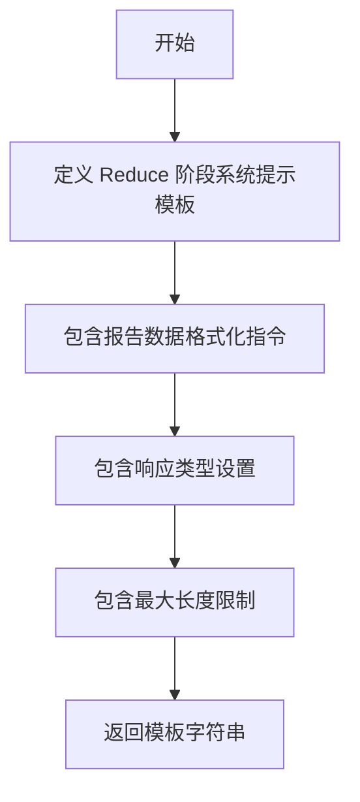

#### 带注释源码

```python
# 从 graphrag.prompts.query.global_search_reduce_system_prompt 模块导入
# 该常量是一个字符串模板，用于 GlobalSearch 的 Reduce 阶段
# 模板包含以下占位符：
# - {report_data}: 从 Map 阶段收集的关键点数据
# - {response_type}: 期望的响应类型（如 "multiple paragraphs"）
# - {max_length}: 生成内容的最大长度限制
REDUCE_SYSTEM_PROMPT = "You are a helpful AI assistant..."
# （实际内容需查看源文件 graphrag/prompts/query/global_search_reduce_system_prompt.py）
```

---

### `NO_DATA_ANSWER`

从 `graphrag.prompts.query.global_search_reduce_system_prompt` 模块导入的全局常量，用于当全局搜索的 Map 阶段未返回任何有效关键点（所有响应得分均为0）时，返回给用户的默认"无数据"回答。

参数： 无（全局常量，非函数）

返回值：`str`，默认的无数据回答字符串（如 "I don't know" 或类似表述）。

#### 流程图

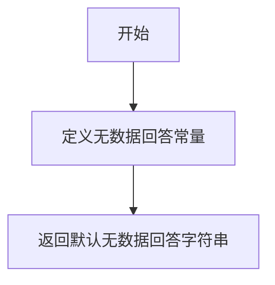

#### 带注释源码

```python
# 从 graphrag.prompts.query.global_search_reduce_system_prompt 模块导入
# 当以下情况发生时返回此常量：
# 1. 所有 Map 响应的 score 都为 0（未找到相关信息）
# 2. 未启用 allow_general_knowledge 选项
# 
# 使用示例（在 GlobalSearch 类中）：
# if len(filtered_key_points) == 0 and not self.allow_general_knowledge:
#     return SearchResult(response=NO_DATA_ANSWER, ...)
NO_DATA_ANSWER = "I don't know."
# （实际内容需查看源文件 graphrag/prompts/query/global_search_reduce_system_prompt.py）
```

---

### 补充说明

#### 设计目标与约束

- **双阶段搜索架构**：GlobalSearch 采用 Map-Reduce 范式，Map 阶段并行处理多个数据块，Reduce 阶段汇总结果
- **可扩展性**：通过系统提示模板支持自定义行为
- **容错性**：当无有效数据时返回预设答案，而非直接报错

#### 潜在技术债务

1. **硬编码默认值**：默认的 `REDUCE_SYSTEM_PROMPT` 和 `NO_DATA_ANSWER` 是导入的静态字符串，缺乏运行时动态调整能力
2. **错误处理粒度**：异常捕获使用通用 `Exception`，可能掩盖具体问题
3. **Token 计算**：使用简单的 `tokenizer.encode` 长度估算，未考虑 LLM 实际 token 消耗

#### 在代码中的使用位置

| 方法 | 使用场景 | 代码行 |
|------|----------|--------|
| `__init__` | 设置默认 reduce_system_prompt | ~75 行 |
| `_reduce_response` | 无有效数据时返回默认答案 | ~290 行 |
| `_stream_reduce_response` | 流式输出时无数据返回 | ~360 行 |


### GlobalSearch.__init__

这是 `GlobalSearch` 类的初始化方法，负责配置全局搜索的所有参数，包括语言模型、上下文构建器、系统提示、LLM参数、回调函数、令牌限制和并发控制等。

参数：

- `model`：`LLMCompletion`，用于执行语言模型调用的实例
- `context_builder`：`GlobalContextBuilder`，用于构建查询上下文的构建器
- `tokenizer`：`Tokenizer | None`，用于编码文本的tokenizer实例，默认为None
- `map_system_prompt`：`str | None`，Map阶段的系统提示，默认为None（使用MAP_SYSTEM_PROMPT）
- `reduce_system_prompt`：`str | None`，Reduce阶段的系统提示，默认为None（使用REDUCE_SYSTEM_PROMPT）
- `response_type`：`str`，响应类型，默认为"multiple paragraphs"
- `allow_general_knowledge`：`bool`，是否允许使用通用知识，默认为False
- `general_knowledge_inclusion_prompt`：`str | None`，通用知识包含提示，默认为None
- `json_mode`：`bool`，是否启用JSON模式，默认为True
- `callbacks`：`list[QueryCallbacks] | None`，查询回调函数列表，默认为None
- `max_data_tokens`：`int`，最大数据令牌数，默认为8000
- `map_llm_params`：`dict[str, Any] | None`，Map阶段LLM额外参数，默认为None
- `reduce_llm_params`：`dict[str, Any] | None`，Reduce阶段LLM额外参数，默认为None
- `map_max_length`：`int`，Map阶段最大长度，默认为1000
- `reduce_max_length`：`int`，Reduce阶段最大长度，默认为2000
- `context_builder_params`：`dict[str, Any] | None`，上下文构建器额外参数，默认为None
- `concurrent_coroutines`：`int`，并发协程数，默认为32

返回值：`None`，该方法为构造函数，不返回任何值

#### 流程图

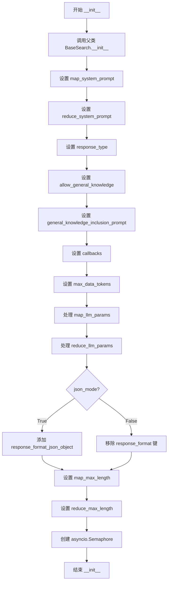

#### 带注释源码

```python
def __init__(
    self,
    model: "LLMCompletion",                          # 语言模型实例，用于处理查询
    context_builder: GlobalContextBuilder,           # 全局上下文构建器
    tokenizer: Tokenizer | None = None,             # 可选的分词器，用于计算token数量
    map_system_prompt: str | None = None,           # 可选的Map阶段系统提示
    reduce_system_prompt: str | None = None,        # 可选的Reduce阶段系统提示
    response_type: str = "multiple paragraphs",      # 响应类型，默认为多段落
    allow_general_knowledge: bool = False,          # 是否允许使用通用知识
    general_knowledge_inclusion_prompt: str | None = None,  # 通用知识提示模板
    json_mode: bool = True,                          # 是否启用JSON模式
    callbacks: list[QueryCallbacks] | None = None,  # 查询回调函数列表
    max_data_tokens: int = 8000,                    # 最大数据token数
    map_llm_params: dict[str, Any] | None = None,   # Map阶段LLM额外参数
    reduce_llm_params: dict[str, Any] | None = None, # Reduce阶段LLM额外参数
    map_max_length: int = 1000,                     # Map阶段最大长度
    reduce_max_length: int = 2000,                   # Reduce阶段最大长度
    context_builder_params: dict[str, Any] | None = None,  # 上下文构建器参数
    concurrent_coroutines: int = 32,                 # 并发协程数量限制
):
    # 调用父类 BaseSearch 的初始化方法
    super().__init__(
        model=model,
        context_builder=context_builder,
        tokenizer=tokenizer,
        context_builder_params=context_builder_params,
    )
    
    # 设置Map阶段的系统提示，如果未提供则使用默认的MAP_SYSTEM_PROMPT
    self.map_system_prompt = map_system_prompt or MAP_SYSTEM_PROMPT
    
    # 设置Reduce阶段的系统提示，如果未提供则使用默认的REDUCE_SYSTEM_PROMPT
    self.reduce_system_prompt = reduce_system_prompt or REDUCE_SYSTEM_PROMPT
    
    # 设置响应类型
    self.response_type = response_type
    
    # 设置是否允许通用知识
    self.allow_general_knowledge = allow_general_knowledge
    
    # 设置通用知识包含提示，如果未提供则使用默认的GENERAL_KNOWLEDGE_INSTRUCTION
    self.general_knowledge_inclusion_prompt = (
        general_knowledge_inclusion_prompt or GENERAL_KNOWLEDGE_INSTRUCTION
    )
    
    # 设置回调函数列表，默认为空列表
    self.callbacks = callbacks or []
    
    # 设置最大数据token数
    self.max_data_tokens = max_data_tokens

    # 处理Map阶段LLM参数
    self.map_llm_params = map_llm_params if map_llm_params else {}
    # 处理Reduce阶段LLM参数
    self.reduce_llm_params = reduce_llm_params if reduce_llm_params else {}
    
    # 根据json_mode设置响应格式
    if json_mode:
        # 启用JSON对象响应格式
        self.map_llm_params["response_format_json_object"] = True
    else:
        # 如果json_mode为False，移除response_format键
        self.map_llm_params.pop("response_format", None)
    
    # 设置Map和Reduce阶段的最大长度
    self.map_max_length = map_max_length
    self.reduce_max_length = reduce_max_length

    # 创建信号量用于控制并发协程数量
    self.semaphore = asyncio.Semaphore(concurrent_coroutines)
```


### `GlobalSearch.stream_search`

流式全局搜索响应方法，异步生成器。核心流程为：先通过 context_builder 构建查询上下文，然后并行的对每个上下文块执行 map 阶段 LLM 调用生成中间答案，最后流式输出 reduce 阶段 LLM 生成的最终答案。

参数：

- `query`：`str`，用户查询字符串
- `conversation_history`：`ConversationHistory | None`，可选的对话历史记录

返回值：`AsyncGenerator[str, None]`，异步生成器，产生流式响应文本片段

#### 流程图

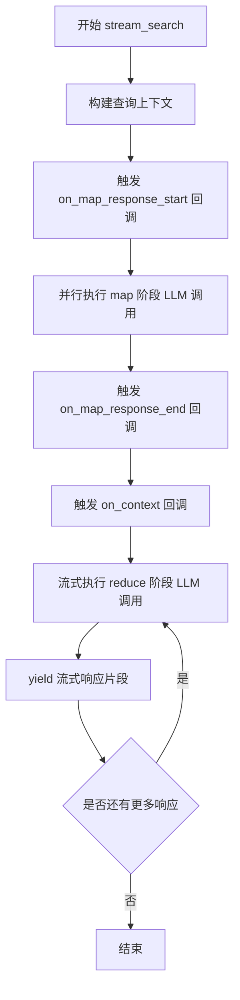

#### 带注释源码

```python
async def stream_search(
    self,
    query: str,
    conversation_history: ConversationHistory | None = None,
) -> AsyncGenerator[str, None]:
    """Stream the global search response."""
    # 第一步：构建查询上下文，包括对话历史和相关的社区报告数据
    context_result = await self.context_builder.build_context(
        query=query,
        conversation_history=conversation_history,
        **self.context_builder_params,
    )
    
    # 第二步：通知回调 map 阶段即将开始，传入上下文块
    for callback in self.callbacks:
        callback.on_map_response_start(context_result.context_chunks)  # type: ignore

    # 第三步：并行执行 map 阶段的 LLM 调用
    # 对每个上下文块（社区报告）独立生成答案和相关性分数
    map_responses = await asyncio.gather(*[
        self._map_response_single_batch(
            context_data=data,
            query=query,
            max_length=self.map_max_length,
            **self.map_llm_params,
        )
        for data in context_result.context_chunks
    ])

    # 第四步：通知回调 map 阶段完成和最终上下文记录
    for callback in self.callbacks:
        callback.on_map_response_end(map_responses)  # type: ignore
        callback.on_context(context_result.context_records)

    # 第五步：流式执行 reduce 阶段
    # 将所有 map 阶段的中间答案合并、排序、截断后，
    # 再次调用 LLM 生成最终答案，并流式输出
    async for response in self._stream_reduce_response(
        map_responses=map_responses,  # type: ignore
        query=query,
        max_length=self.reduce_max_length,
        model_parameters=self.reduce_llm_params,
    ):
        yield response
```


### `GlobalSearch.search`

执行全局搜索，返回包含搜索响应、上下文数据、映射响应、归约上下文数据/文本、完成时间、令牌计数以及 LLM 调用详情的 GlobalSearchResult 对象。

参数：

- `query`：`str`，用户查询字符串
- `conversation_history`：`ConversationHistory | None`，可选的对话历史记录
- `**kwargs`：`Any`，额外的关键字参数

返回值：`GlobalSearchResult`，包含搜索结果、上下文信息、映射响应、归约上下文、完成时间、LLM 调用次数和令牌使用统计

#### 流程图

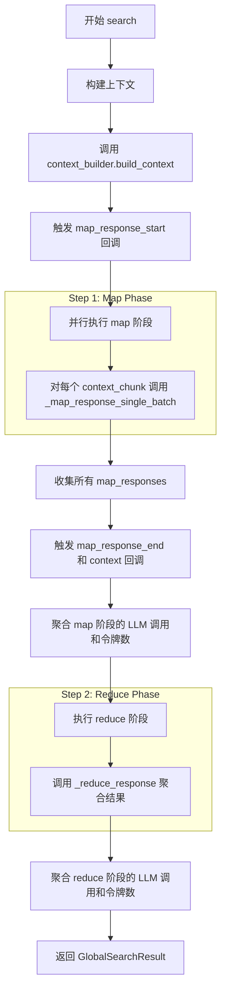

#### 带注释源码

```python
async def search(
    self,
    query: str,
    conversation_history: ConversationHistory | None = None,
    **kwargs: Any,
) -> GlobalSearchResult:
    """
    Perform a global search.

    Global search mode includes two steps:

    - Step 1: Run parallel LLM calls on communities' short summaries to generate answer for each batch
    - Step 2: Combine the answers from step 2 to generate the final answer
    """
    # Step 1: Generate answers for each batch of community short summaries
    # 初始化 LLM 调用、提示令牌和输出令牌的计数器
    llm_calls, prompt_tokens, output_tokens = {}, {}, {}

    start_time = time.time()  # 记录开始时间
    
    # 调用 context_builder 构建查询上下文
    context_result = await self.context_builder.build_context(
        query=query,
        conversation_history=conversation_history,
        **self.context_builder_params,
    )
    # 记录构建上下文的 LLM 调用和令牌使用情况
    llm_calls["build_context"] = context_result.llm_calls
    prompt_tokens["build_context"] = context_result.prompt_tokens
    output_tokens["build_context"] = context_result.output_tokens

    # 触发回调：map 响应开始
    for callback in self.callbacks:
        callback.on_map_response_start(context_result.context_chunks)  # type: ignore

    # 并行执行 map 阶段：对每个上下文块生成答案
    map_responses = await asyncio.gather(*[
        self._map_response_single_batch(
            context_data=data,
            query=query,
            max_length=self.map_max_length,
            **self.map_llm_params,
        )
        for data in context_result.context_chunks
    ])

    # 触发回调：map 响应结束和上下文记录
    for callback in self.callbacks:
        callback.on_map_response_end(map_responses)
        callback.on_context(context_result.context_records)

    # 聚合 map 阶段的 LLM 调用次数和令牌使用量
    llm_calls["map"] = sum(response.llm_calls for response in map_responses)
    prompt_tokens["map"] = sum(response.prompt_tokens for response in map_responses)
    output_tokens["map"] = sum(response.output_tokens for response in map_responses)

    # Step 2: Combine the intermediate answers from step 1 to generate the final answer
    # 执行 reduce 阶段：将 map 阶段的中间答案组合成最终答案
    reduce_response = await self._reduce_response(
        map_responses=map_responses,
        query=query,
        **self.reduce_llm_params,
    )
    # 记录 reduce 阶段的 LLM 调用和令牌使用情况
    llm_calls["reduce"] = reduce_response.llm_calls
    prompt_tokens["reduce"] = reduce_response.prompt_tokens
    output_tokens["reduce"] = reduce_response.output_tokens

    # 返回完整的 GlobalSearchResult 对象
    return GlobalSearchResult(
        response=reduce_response.response,  # 最终响应文本
        context_data=context_result.context_records,  # 上下文数据
        context_text=context_result.context_chunks,  # 上下文文本
        map_responses=map_responses,  # 所有 map 阶段的响应
        reduce_context_data=reduce_response.context_data,  # reduce 阶段上下文数据
        reduce_context_text=reduce_response.context_text,  # reduce 阶段上下文文本
        completion_time=time.time() - start_time,  # 完成耗时
        llm_calls=sum(llm_calls.values()),  # 总 LLM 调用次数
        prompt_tokens=sum(prompt_tokens.values()),  # 总提示令牌数
        output_tokens=sum(output_tokens.values()),  # 总输出令牌数
        llm_calls_categories=llm_calls,  # 按类别统计的 LLM 调用
        prompt_tokens_categories=prompt_tokens,  # 按类别统计的提示令牌
        output_tokens_categories=output_tokens,  # 按类别统计的输出令牌
    )
```


### `GlobalSearch._map_response_single_batch`

为社区报告的单个数据块生成答案，通过调用LLM模型并解析返回的JSON响应，提取关键点和相关性评分，最终封装为SearchResult对象返回。

参数：

- `context_data`：`str`，社区报告的单个块内容，作为LLM的上下文输入
- `query`：`str`，用户查询问题
- `max_length`：`int`，生成答案的最大长度限制
- `**llm_kwargs`：`dict[str, Any]`，传递给LLM模型的额外参数

返回值：`SearchResult`，包含处理后的响应列表、上下文数据、上下文文本、完成时间、LLM调用统计信息（调用次数、提示令牌数、输出令牌数）

#### 流程图

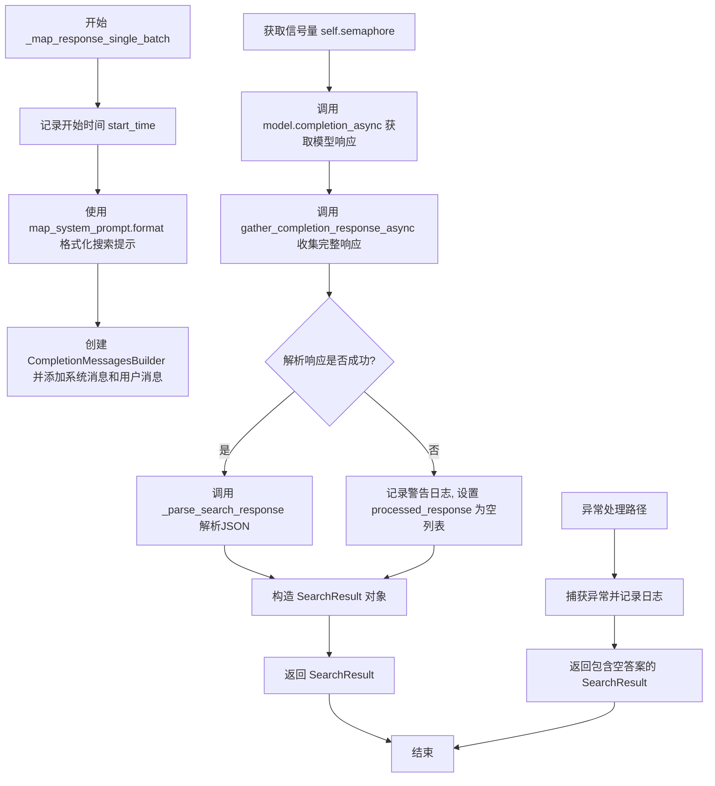

#### 带注释源码

```python
async def _map_response_single_batch(
    self,
    context_data: str,
    query: str,
    max_length: int,
    **llm_kwargs,
) -> SearchResult:
    """Generate answer for a single chunk of community reports."""
    # 记录方法执行开始时间，用于计算完成耗时
    start_time = time.time()
    # 初始化搜索提示字符串，用于异常处理时记录日志
    search_prompt = ""
    try:
        # 使用map system prompt模板格式化搜索提示，传入上下文数据和最大长度
        search_prompt = self.map_system_prompt.format(
            context_data=context_data, max_length=max_length
        )

        # 构建消息构建器，依次添加系统提示和用户查询
        messages_builder = (
            CompletionMessagesBuilder()
            .add_system_message(search_prompt)
            .add_user_message(query)
        )

        # 使用信号量控制并发数量，防止同时发起过多LLM调用
        async with self.semaphore:
            # 异步调用LLM模型完成请求，设置JSON对象响应格式
            model_response = await self.model.completion_async(
                messages=messages_builder.build(),
                response_format_json_object=True,
                **llm_kwargs,
            )
            # 收集完整的LLM响应内容
            search_response = await gather_completion_response_async(model_response)
            logger.debug("Map response: %s", search_response)
        
        # 尝试解析LLM返回的JSON响应
        try:
            # parse search response json
            processed_response = self._parse_search_response(search_response)
        except ValueError:
            # 解析失败时记录警告并跳过此批次
            logger.warning(
                "Warning: Error parsing search response json - skipping this batch"
            )
            processed_response = []

        # 返回成功解析的SearchResult对象
        return SearchResult(
            response=processed_response,
            context_data=context_data,
            context_text=context_data,
            completion_time=time.time() - start_time,
            llm_calls=1,
            prompt_tokens=len(self.tokenizer.encode(search_prompt)),
            output_tokens=len(self.tokenizer.encode(search_response)),
        )

    except Exception:
        # 捕获所有异常，记录完整堆栈信息
        logger.exception("Exception in _map_response_single_batch")
        # 返回包含空答案的SearchResult，标记处理失败
        return SearchResult(
            response=[{"answer": "", "score": 0}],
            context_data=context_data,
            context_text=context_data,
            completion_time=time.time() - start_time,
            llm_calls=1,
            prompt_tokens=len(self.tokenizer.encode(search_prompt)),
            output_tokens=0,
        )
```


### `GlobalSearch._parse_search_response`

该方法负责解析 Global Search 返回的 JSON 响应，将其转换为包含答案和重要性分数的关键点列表。如果解析失败或数据不符合预期格式，则返回默认的空答案。

参数：

- `search_response`：`str`，Global Search 返回的原始 JSON 字符串响应

返回值：`list[dict[str, Any]]`，关键点列表，其中每个元素是一个字典，包含 "answer"（答案内容，字符串类型）和 "score"（重要性分数，整数类型）两个键；若解析失败或无有效数据，则返回包含单个空答案的列表

#### 流程图

```mermaid
flowchart TD
    A[开始: 接收 search_response] --> B{尝试解析 JSON 对象}
    B -->|成功| C{检查解析结果 j 是否为空}
    B -->|失败| D[返回默认结果: [{'answer': '', 'score': 0}]]
    C -->|是空对象| D
    C -->|非空| E[从 JSON 中提取 'points' 字段]
    E --> F{points 是否存在且为列表}
    F -->|否| D
    F -->是 --> G[遍历 points 中的每个元素]
    G --> H{元素包含 'description' 和 'score'}
    H -->|是| I[提取 description 和 score, 转为 int]
    H -->|否| J[跳过该元素]
    I --> K[构建答案字典]
    K --> L[添加到结果列表]
    L --> G
    G --> M[结束: 返回关键点列表]
    J --> G
```

#### 带注释源码

```python
def _parse_search_response(self, search_response: str) -> list[dict[str, Any]]:
    """Parse the search response json and return a list of key points.

    Parameters
    ----------
    search_response: str
        The search response json string

    Returns
    -------
    list[dict[str, Any]]
        A list of key points, each key point is a dictionary with "answer" and "score" keys
    """
    # Step 1: 尝试解析 JSON 对象，处理可能存在的 Markdown 代码块包装
    search_response, j = try_parse_json_object(search_response)
    
    # Step 2: 如果解析结果为空对象，返回默认的空答案
    if j == {}:
        return [{"answer": "", "score": 0}]

    # Step 3: 从 JSON 中提取 "points" 字段（关键点列表）
    parsed_elements = json.loads(search_response).get("points")
    
    # Step 4: 检查 points 是否存在且为列表类型
    if not parsed_elements or not isinstance(parsed_elements, list):
        return [{"answer": "", "score": 0}]

    # Step 5: 遍历 points，提取每个元素中的 description 和 score
    return [
        {
            # 从元素中提取 description 作为 answer
            "answer": element["description"],
            # 将 score 转换为整数类型
            "score": int(element["score"]),
        }
        # 过滤条件：只处理同时包含 description 和 score 的元素
        for element in parsed_elements
        if "description" in element and "score" in element
    ]
```


### `GlobalSearch._reduce_response`

该方法将所有来自单批次映射阶段的中间响应（key points）合并为最终的用户查询答案。它首先收集并过滤所有关键点，按相关性分数排序，然后使用LLM基于这些关键点生成最终的回答。如果所有映射响应的分数都为0且不允许使用一般知识，则返回一个预设的"无数据"答案。

参数：

- `map_responses`：`list[SearchResult]`，来自映射阶段的搜索结果列表，每个结果包含答案和分数
- `query`：`str`，用户输入的查询问题
- `**llm_kwargs`：可变关键字参数，用于传递给LLM的额外参数

返回值：`SearchResult`，包含合并后的最终响应文本、上下文数据、上下文文本、完成时间、LLM调用次数、提示令牌数和输出令牌数

#### 流程图

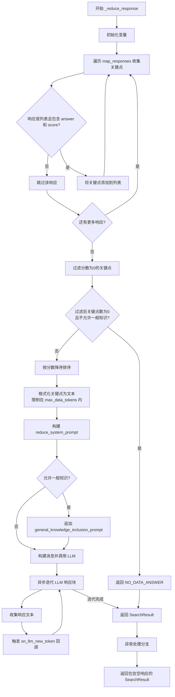

#### 带注释源码

```python
async def _reduce_response(
    self,
    map_responses: list[SearchResult],
    query: str,
    **llm_kwargs,
) -> SearchResult:
    """Combine all intermediate responses from single batches into a final answer to the user query."""
    # 初始化空字符串变量用于后续构建数据
    text_data = ""
    search_prompt = ""
    start_time = time.time()  # 记录开始时间用于计算完成时间
    try:
        # 步骤1: 收集所有关键点到单个列表以准备排序
        # 遍历所有映射响应，提取每个响应中的关键点
        key_points = []
        for index, response in enumerate(map_responses):
            # 检查响应是否是列表类型
            if not isinstance(response.response, list):
                continue
            # 遍历响应中的每个元素
            for element in response.response:
                # 检查元素是否是字典类型
                if not isinstance(element, dict):
                    continue
                # 检查是否包含 answer 和 score 字段
                if "answer" not in element or "score" not in element:
                    continue
                # 将关键点添加到列表，包含分析师索引、答案和分数
                key_points.append({
                    "analyst": index,
                    "answer": element["answer"],
                    "score": element["score"],
                })

        # 步骤2: 过滤分数为0的响应并按分数降序排列
        filtered_key_points = [
            point
            for point in key_points
            if point["score"] > 0  # type: ignore
        ]

        # 如果没有有效关键点且不允许使用一般知识，返回预设的无数据答案
        if len(filtered_key_points) == 0 and not self.allow_general_knowledge:
            # 返回无数据答案并记录警告日志
            logger.warning(
                "Warning: All map responses have score 0 (i.e., no relevant information found from the dataset), returning a canned 'I do not know' answer. You can try enabling `allow_general_knowledge` to encourage the LLM to incorporate relevant general knowledge, at the risk of increasing increasing hallucinations."
            )
            return SearchResult(
                response=NO_DATA_ANSWER,
                context_data="",
                context_text="",
                completion_time=time.time() - start_time,
                llm_calls=0,
                prompt_tokens=0,
                output_tokens=0,
            )

        # 按分数降序排序关键点
        filtered_key_points = sorted(
            filtered_key_points,
            key=lambda x: x["score"],  # type: ignore
            reverse=True,  # type: ignore
        )

        # 步骤3: 格式化关键点数据，限制总token数量
        data = []
        total_tokens = 0
        for point in filtered_key_points:
            # 构建格式化的响应数据
            formatted_response_data = []
            formatted_response_data.append(
                f"----Analyst {point['analyst'] + 1}----"
            )
            formatted_response_data.append(
                f"Importance Score: {point['score']}"  # type: ignore
            )
            formatted_response_data.append(point["answer"])  # type: ignore
            # 用换行符连接各部分
            formatted_response_text = "\n".join(formatted_response_data)
            # 检查添加此关键点是否会超过最大数据token限制
            if (
                total_tokens + len(self.tokenizer.encode(formatted_response_text))
                > self.max_data_tokens
            ):
                break  # 超过限制，停止添加更多关键点
            data.append(formatted_response_text)
            # 累计已使用的token数
            total_tokens += len(self.tokenizer.encode(formatted_response_text))
        # 用双换行符连接所有格式化数据
        text_data = "\n\n".join(data)

        # 步骤4: 构建reduce系统提示
        search_prompt = self.reduce_system_prompt.format(
            report_data=text_data,
            response_type=self.response_type,
            max_length=self.reduce_max_length,
        )
        # 如果允许一般知识，追加相关提示
        if self.allow_general_knowledge:
            search_prompt += "\n" + self.general_knowledge_inclusion_prompt

        # 步骤5: 构建消息并调用LLM
        messages_builder = (
            CompletionMessagesBuilder()
            .add_system_message(search_prompt)
            .add_user_message(query)
        )

        search_response = ""

        # 异步调用LLM生成流式响应
        response_search: AsyncIterator[
            LLMCompletionChunk
        ] = await self.model.completion_async(
            messages=messages_builder.build(),
            stream=True,
            **llm_kwargs,
        )  # type: ignore

        # 异步迭代流式响应块
        async for chunk in response_search:
            # 提取响应文本内容
            response_text = chunk.choices[0].delta.content or ""
            search_response += response_text
            # 触发回调通知新token
            for callback in self.callbacks:
                callback.on_llm_new_token(response_text)

        # 返回包含完整响应的SearchResult
        return SearchResult(
            response=search_response,
            context_data=text_data,
            context_text=text_data,
            completion_time=time.time() - start_time,
            llm_calls=1,
            prompt_tokens=len(self.tokenizer.encode(search_prompt)),
            output_tokens=len(self.tokenizer.encode(search_response)),
        )
    except Exception:
        # 异常处理：记录异常日志并返回包含空响应的结果
        logger.exception("Exception in reduce_response")
        return SearchResult(
            response="",
            context_data=text_data,
            context_text=text_data,
            completion_time=time.time() - start_time,
            llm_calls=1,
            prompt_tokens=len(self.tokenizer.encode(search_prompt)),
            output_tokens=0,
        )
```


### `GlobalSearch._stream_reduce_response`

该方法执行全局搜索的流式Reduce阶段，接收Map阶段的多个响应结果，过滤并排序关键点，格式化数据后调用LLM进行流式生成，最终以异步生成器方式逐块产出最终答案。

参数：

- `self`：隐式参数，GlobalSearch类的实例
- `map_responses`：`list[SearchResult]`，Map阶段产生的响应列表，每个SearchResult包含从不同数据块提取的关键点和分数
- `query`：`str`，用户原始查询字符串
- `max_length`：`int`，生成答案的最大长度限制
- `**llm_kwargs`：可变关键字参数，包含传递给LLM的额外参数，如temperature、top_p等

返回值：`AsyncGenerator[str, None]`，异步生成器，逐块产出LLM生成的响应文本

#### 流程图

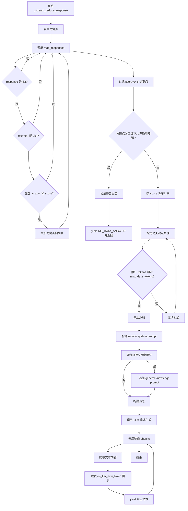

#### 带注释源码

```python
async def _stream_reduce_response(
    self,
    map_responses: list[SearchResult],
    query: str,
    max_length: int,
    **llm_kwargs,
) -> AsyncGenerator[str, None]:
    """
    流式执行Reduce阶段：将Map阶段的所有响应合并处理，生成最终答案
    
    参数:
        map_responses: Map阶段返回的SearchResult列表，每个包含关键点和分数
        query: 用户查询
        max_length: 生成文本的最大长度
        **llm_kwargs: 传递给LLM的额外参数
    """
    
    # 步骤1: 收集所有关键点到单一列表
    # 遍历每个Map响应，提取其中的answer和score字段
    key_points = []
    for index, response in enumerate(map_responses):
        # 确保response是list类型
        if not isinstance(response.response, list):
            continue
        # 遍历每个响应元素
        for element in response.response:
            # 确保元素是字典
            if not isinstance(element, dict):
                continue
            # 检查必需字段
            if "answer" not in element or "score" not in element:
                continue
            # 添加关键点，保留分析员索引用于追溯来源
            key_points.append({
                "analyst": index,
                "answer": element["answer"],
                "score": element["score"],
            })

    # 步骤2: 过滤和排序
    # 过滤掉score=0的关键点（无相关信息），并按分数降序排列
    filtered_key_points = [
        point
        for point in key_points
        if point["score"] > 0  # type: ignore
    ]

    # 步骤3: 处理无关键点情况
    # 如果没有有效关键点且不允许通用知识，则返回预设的"不知道"答案
    if len(filtered_key_points) == 0 and not self.allow_general_knowledge:
        # 记录警告日志
        logger.warning(
            "Warning: All map responses have score 0 (i.e., no relevant information found from the dataset), returning a canned 'I do not know' answer. You can try enabling `allow_general_knowledge` to encourage the LLM to incorporate relevant general knowledge, at the risk of increasing hallucinations."
        )
        yield NO_DATA_ANSWER
        return

    # 按分数降序排序，优先使用高分关键点
    filtered_key_points = sorted(
        filtered_key_points,
        key=lambda x: x["score"],  # type: ignore
        reverse=True,  # type: ignore
    )

    # 步骤4: 格式化关键点数据，限制token数量
    # 将关键点格式化为带标记的文本，并控制总token数不超过max_data_tokens
    data = []
    total_tokens = 0
    for point in filtered_key_points:
        formatted_response_data = [
            f"----Analyst {point['analyst'] + 1}----",  # 分析员编号（1-based）
            f"Importance Score: {point['score']}",        # 重要性分数
            point["answer"],                               # 答案内容
        ]
        formatted_response_text = "\n".join(formatted_response_data)
        
        # 检查添加此条后是否超过token限制
        if (
            total_tokens + len(self.tokenizer.encode(formatted_response_text))
            > self.max_data_tokens
        ):
            break  # 超过限制，停止添加
        
        data.append(formatted_response_text)
        total_tokens += len(self.tokenizer.encode(formatted_response_text))
    
    # 用双换行符连接各关键点，形成完整的报告数据
    text_data = "\n\n".join(data)

    # 步骤5: 构建Reduce系统提示
    # 使用reduce_system_prompt模板格式化提示
    search_prompt = self.reduce_system_prompt.format(
        report_data=text_data,
        response_type=self.response_type,
        max_length=max_length,
    )
    
    # 如果允许通用知识，追加相关提示
    if self.allow_general_knowledge:
        search_prompt += "\n" + self.general_knowledge_inclusion_prompt

    # 步骤6: 构建消息并调用LLM
    messages_builder = (
        CompletionMessagesBuilder()
        .add_system_message(search_prompt)  # 系统提示
        .add_user_message(query)             # 用户查询
    )

    # 调用LLM进行流式生成
    # 注意：从llm_kwargs中提取model_parameters
    response_search: AsyncIterator[
        LLMCompletionChunk
    ] = await self.model.completion_async(
        messages=messages_builder.build(),
        stream=True,
        **llm_kwargs.get("model_parameters", {}),
    )  # type: ignore

    # 步骤7: 流式产出响应
    # 遍历LLM返回的每个chunk，触发回调并yield文本
    async for chunk in response_search:
        response_text = chunk.choices[0].delta.content or ""
        for callback in self.callbacks:
            callback.on_llm_new_token(response_text)
        yield response_text
```

## 关键组件


### GlobalSearch

全局搜索的主类，负责协调两阶段搜索流程（Map阶段并行处理社区摘要，Reduce阶段合并结果生成最终答案），支持同步和流式两种搜索模式。

### GlobalSearchResult

搜索结果的数据类，存储Map阶段的响应列表、Reduce阶段的上下文数据/文本，以及性能指标（耗时、token计数等）。

### Map阶段 (_map_response_single_batch)

并行处理每个社区报告摘要的单个批次，调用LLM生成该批次的答案和重要性评分，包含异常处理和空响应fallback机制。

### Reduce阶段 (_reduce_response)

将所有Map阶段生成的中间答案收集、过滤（去除零分项）、排序后，输入LLM生成最终答案，支持通用知识补充和最大token限制。

### 流式响应 (_stream_reduce_response)

Reduce阶段的流式版本，边生成答案边 yield 输出，支持回调通知新token，适合实时展示场景。

### 上下文构建 (context_builder)

GlobalContextBuilder负责构建查询上下文，将对话历史和查询转换为社区报告的上下文块（context_chunks），供Map阶段并行使用。

### 并发控制 (semaphore)

使用asyncio.Semaphore限制并发LLM调用数量，防止过载，默认32个并发协程，可通过参数配置。

### 回调系统 (QueryCallbacks)

提供搜索过程钩子（on_map_response_start/end、on_context、on_llm_new_token），用于监控搜索进度和流式输出处理。

### 响应解析 (_parse_search_response)

解析LLM返回的JSON格式搜索响应，提取"description"和"score"字段，返回结构化的关键点列表。

### 搜索提示模板

包含Map阶段系统提示（社区报告分析）、Reduce阶段系统提示（合并答案）、通用知识补充提示，用于指导LLM行为。

## 问题及建议


### 已知问题

-   **严重代码重复**：`_reduce_response` 和 `_stream_reduce_response` 方法中存在大量重复的关键点收集、过滤、排序逻辑，违反了 DRY 原则，维护困难
-   **类型安全缺失**：大量使用 `# type: ignore` 注释绕过类型检查，表明类型注解不完整或不准确
-   **异常处理不当**：在 `_map_response_single_batch` 中使用 `except Exception` 捕获所有异常并返回默认结果，掩盖了真实错误；在 `_reduce_response` 中同样使用宽泛异常捕获
-   **参数传递不一致**：`reduce_llm_params` 在 `search` 方法中直接传入，但在 `_stream_reduce_response` 中通过 `llm_kwargs.get("model_parameters", {})` 获取，逻辑不一致
-   **参数未使用**：`search` 方法接收 `**kwargs: Any` 参数但从未使用
-   **token 计算不准确**：使用 `len(self.tokenizer.encode(...))` 近似 token 数量不够精确，应使用 tokenizer 的专用方法或更准确的计算方式
-   **字符串格式化低效**：使用字符串拼接和 `"\n".join()` 构建提示词，可读性差且性能不佳
-   **json_mode 处理逻辑错误**：当 `json_mode=False` 时尝试 `pop("response_format", None)`，但可能 key 不存在导致逻辑混乱
-   **回调方法调用不安全**：直接调用可能不存在的回调方法，依赖运行时类型检查而非静态类型安全

### 优化建议

-   **提取公共逻辑**：将关键点收集、过滤、排序逻辑抽取为私有方法（如 `_collect_and_filter_key_points`），供两个方法复用
-   **完善类型注解**：补充完整的类型注解，移除不必要的 `# type: ignore`，使用泛型确保类型安全
-   **细化异常处理**：区分可恢复和不可恢复异常，使用具体异常类型（如 `ValueError`、`JSONDecodeError`），考虑重试机制而非静默返回默认结果
-   **统一参数接口**：确保 `reduce_llm_params` 在所有调用路径中以一致的方式传递和使用
-   **使用 f-string 或模板**：改进字符串构建方式，使用 f-string 或模板引擎提高可读性和性能
-   **移除未使用参数**：删除 `search` 方法中未使用的 `**kwargs` 参数
-   **优化 token 计算**：考虑使用 tokenizer 的 `count_tokens` 方法或批量计算以提高准确性
-   **改进回调机制**：定义回调接口或协议，确保方法存在性，或提供默认空实现

## 其它


### 设计目标与约束

本代码实现了一个全局搜索（Global Search）功能，采用Map-Reduce架构：
- **设计目标**：通过并行的Map阶段对社区短摘要进行LLM调用生成答案，再通过Reduce阶段合并中间答案生成最终答案，实现对大规模知识图谱数据的全局查询能力。
- **核心约束**：
  - `max_data_tokens` 限制输入到Reduce阶段的token数量（默认8000）
  - `map_max_length` 限制Map阶段每个批次的最大长度（默认1000）
  - `reduce_max_length` 限制Reduce阶段的最大长度（默认2000）
  - `concurrent_coroutines` 限制并发协程数量（默认32）
  - `allow_general_knowledge` 控制是否允许使用通用知识（默认False）

### 错误处理与异常设计

代码采用多层异常处理策略：
- **Map阶段异常**：在`_map_response_single_batch`方法中，使用try-except捕获所有异常，返回空的SearchResult（answer为空，score为0），确保单个批次失败不影响整体流程
- **Reduce阶段异常**：在`_reduce_response`方法中，捕获异常后返回部分数据（text_data、context_data等保留），但response置为空
- **JSON解析异常**：`_parse_search_response`方法中捕获ValueError，记录警告日志并返回空结果
- **上下文构建异常**：通过`context_result.llm_calls`等指标追踪各阶段调用状态
- **日志记录**：使用`logger.exception`记录完整堆栈信息，使用`logger.warning`记录可恢复的错误

### 数据流与状态机

整体数据流分为两个主要阶段：

**阶段1：Map（并行处理）**
1. `build_context` - 构建查询上下文，生成context_chunks
2. `on_map_response_start` - 回调：开始Map阶段
3. 并行调用`_map_response_single_batch` - 对每个chunk调用LLM
4. 收集Map响应，提取key points（含answer和score）
5. `on_map_response_end` - 回调：Map阶段结束

**阶段2：Reduce（合并结果）**
1. 收集所有Map响应中的key points
2. 过滤score=0的项，按score降序排序
3. 按token数量限制（max_data_tokens）选择key points
4. 构建reduce system prompt
5. 调用LLM生成最终响应（支持流式输出）
6. `on_llm_new_token` - 回调：流式输出每个token

**状态转换**：
- `search()`方法：同步模式，返回完整结果
- `stream_search()`方法：流式模式，AsyncGenerator逐个yield token

### 外部依赖与接口契约

**核心依赖**：
- `graphrag_llm.tokenizer.Tokenizer` - token编码与计数
- `graphrag_llm.CompletionMessagesBuilder` - LLM消息构建
- `graphrag_llm.gather_completion_response_async` - 异步收集LLM响应
- `graphrag.query.context_builder.builders.GlobalContextBuilder` - 上下文构建器
- `graphrag.query.structured_search.base.BaseSearch` - 搜索基类
- `pandas.DataFrame` - 数据格式
- `asyncio` - 异步并发控制

**接口契约**：
- `LLMCompletion`接口：需实现`completion_async`方法，支持messages、response_format_json_object、stream参数
- `QueryCallbacks`接口：需实现`on_map_response_start`、`on_map_response_end`、`on_context`、`on_llm_new_token`回调方法
- `Tokenizer`接口：需实现`encode`方法，返回token列表
- `SearchResult`数据结构：包含response、context_data、context_text、completion_time、llm_calls、prompt_tokens、output_tokens等字段

### 并发模型与资源管理

- **信号量控制**：使用`asyncio.Semaphore(concurrent_coroutines)`限制Map阶段并发LLM调用数量
- **并行执行**：使用`asyncio.gather(*[...])`并行处理多个context chunks
- **流式输出**：Reduce阶段使用AsyncIterator实现流式响应，通过`async for`逐块处理
- **资源清理**：通过async context manager（`async with self.semaphore`）确保信号量正确释放

### Token管理与限制策略

- **Map阶段**：每个batch的context_data限制为`max_length` tokens
- **Reduce阶段**：
  - 累积key points的token数量，总和不超过`max_data_tokens`（默认8000）
  - 使用`self.tokenizer.encode()`计算token长度
  - 按score降序选择key points，优先保留高相关性内容
- **Prompt token统计**：记录build_context、map、reduce各阶段的prompt_tokens和output_tokens

### 回调机制与扩展点

代码提供多个扩展点（通过QueryCallbacks）：
- `on_map_response_start(context_chunks)` - Map阶段开始时调用
- `on_map_response_end(map_responses)` - Map阶段完成时调用
- `on_context(context_records)` - 上下文构建完成时调用
- `on_llm_new_token(response_text)` - 流式输出时每个新token调用

### 配置与参数化

可配置的system prompts：
- `map_system_prompt` - Map阶段系统提示词，默认`MAP_SYSTEM_PROMPT`
- `reduce_system_prompt` - Reduce阶段系统提示词，默认`REDUCE_SYSTEM_PROMPT`
- `general_knowledge_inclusion_prompt` - 通用知识追加提示，默认`GENERAL_KNOWLEDGE_INSTRUCTION`

LLM参数：
- `map_llm_params` - Map阶段额外LLM参数
- `reduce_llm_params` - Reduce阶段额外LLM参数
- `json_mode` - 控制是否使用JSON格式响应（默认True）

### 性能考量与监控指标

通过返回的`GlobalSearchResult`提供详细性能指标：
- `completion_time` - 总完成时间
- `llm_calls` - LLM总调用次数
- `prompt_tokens` - 提示词总token数
- `output_tokens` - 输出总token数
- `llm_calls_categories` - 按阶段分类的LLM调用次数
- `prompt_tokens_categories` - 按阶段分类的prompt tokens
- `output_tokens_categories` - 按阶段分类的output tokens


    