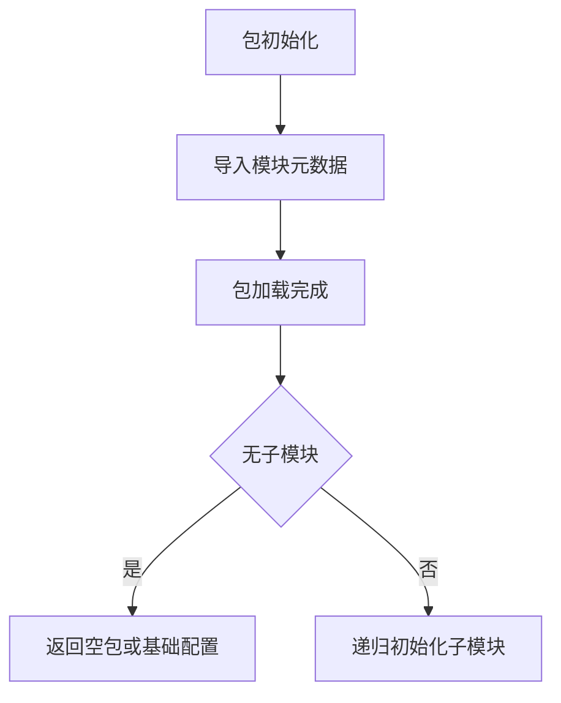

# `graphrag\packages\graphrag\graphrag\query\structured_search\local_search\__init__.py` 详细设计文档

这是一个本地搜索（LocalSearch）包的初始化文件，定义了包的元数据和文档说明，目前仅包含版权信息和包的基本描述，预计后续会填充具体的搜索实现类和函数。

## 整体流程



## 类结构

```
LocalSearch (包根目录)
└── __init__.py (包初始化模块)
```

## 全局变量及字段


    

## 全局函数及方法


## 关键组件


### LocalSearch 包

该代码文件仅为 LocalSearch 包的声明文件，包含版权信息和包的基本描述，无具体实现代码。


## 问题及建议


### 已知问题

- 代码文件仅包含版权声明和包名文档字符串，缺乏实际的模块实现代码
- 缺少任何功能性代码、类定义或方法实现
- 无从分析具体的架构设计、数据流、错误处理等设计文档要素

### 优化建议

- 实现 LocalSearch 包的核心功能模块，例如搜索算法、索引机制或数据处理逻辑
- 添加必要的类和方法定义以支撑包的实际功能
- 建立完整的错误处理与异常设计体系
- 定义清晰的接口契约和外部依赖管理
- 补充单元测试和集成测试代码
- 完善文档注释，包括 API 文档和使用示例


## 其它


### 设计目标与约束

本代码库旨在提供LocalSearch（本地搜索）功能的实现，假设核心目标为在本地环境执行高效的搜索/检索操作。设计约束包括：需遵循MIT开源许可协议，目标平台为Python 3.x+环境，依赖最小化原则，不引入重量级外部搜索引擎。

### 错误处理与异常设计

由于代码仅包含包声明文件，未定义具体异常类。建议在实际实现中定义自定义异常类（如LocalSearchException）继承自Exception，并针对不同错误场景设计子类（如IndexNotFoundException、QueryTimeoutException等）。异常应包含错误码、错误消息和上下文信息。

### 数据流与状态机

当前包级别无数据流定义。建议在完整设计中明确：数据输入（查询请求）→ 索引加载 → 搜索执行 → 结果排序 → 结果返回的完整流程，以及索引状态机（未初始化→已加载→使用中→已释放）。

### 外部依赖与接口契约

当前包无外部依赖。建议在完整设计中声明：必需的Python标准库模块、第三方库依赖（如有）、以及公共API接口的契约定义（包括方法签名、参数验证规则、返回值格式异常情况处理）。

### 性能考量与资源管理

建议包含：内存使用限制、搜索超时配置、索引缓存策略、并发访问控制机制、资源释放（特别是文件句柄和大型数据结构）等方面的设计说明。

### 安全设计

建议包含：输入验证机制、防止注入攻击、敏感数据处理、权限控制等方面的安全设计考虑。

### 测试策略

建议包含：单元测试覆盖范围、集成测试场景、性能基准测试、Mock对象使用策略、测试数据生成方式等测试相关说明。

### 版本演进与兼容性

建议包含：API版本管理策略、向后兼容性保证、废弃API处理机制、版本号语义化规范等。

    